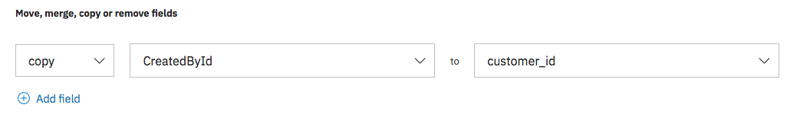

---

copyright:
  years: 2015, 2018
lastupdated: "2018-09-14"

---

{:shortdesc: .shortdesc}
{:new_window: target="_blank"}
{:tip: .tip}
{:pre: .pre}
{:codeblock: .codeblock}
{:screen: .screen}
{:javascript: .ph data-hd-programlang='javascript'}
{:java: .ph data-hd-programlang='java'}
{:python: .ph data-hd-programlang='python'}
{:swift: .ph data-hd-programlang='swift'}

# Connecting to Data Sources
{: #sources}

The {{site.data.keyword.discoveryshort}} service lets you connect to and crawl documents from remote sources.
{: shortdesc}

You can connect to a data source and pull documents on a schedule (if desired) into the {{site.data.keyword.discoveryshort}} service by configuring a collection to associate with that source. Each collection can be configured with one data source. The {{site.data.keyword.discoveryshort}} service pulls documents from the data source using a process called crawling. Crawling is the process of systematically browsing and retrieving documents from the specified start location. Only items explicitly specified by you are crawled by the {{site.data.keyword.discoveryshort}} service. The following types of data sources can be crawled:

-  [Box](/docs/services/discovery/connect.html#connectbox)
-  [Salesforce](/docs/services/discovery/connect.html#connectsf)
-  [Microsoft SharePoint Online](/docs/services/discovery/connect.html#connectsp)

Connecting to a data source can be performed using the {{site.data.keyword.discoveryshort}} tooling, or the API. The {{site.data.keyword.discoveryshort}} tooling provides a simplified method of connection that requires less understanding of the source systems, and the API provides a more granular and highly configurable interface which required a greater understanding of the source that you are connecting to. The following process overview let you know which sections of this document to read next:

1.  Read the [General Source Requirements](/docs/services/discovery/connect.html#gen_req) to get a general understanding of what will be required.
2.  Read the requirements specific to your source system:
    -  [Box](/docs/services/discovery/connect.html#connectbox)
    -  [Salesforce](/docs/services/discovery/connect.html#connectsf)
    -  [Microsoft SharePoint Online](/docs/services/discovery/connect.html#connectsp)
3.  Read the source configuration instructions based on your configuration choice:
    -  [Using the tooling](/docs/services/discovery/connect.html#source_tooling)
    -  [Using the API](/docs/services/discovery/connect.html#source_api)

## General Source Requirements
{: #gen_req}

The following general requirements apply to all data sources:

-  The individual document file size limit for Box, Salesforce, and SharePoint Online is 10MB.
-  You will need the credentials and file locations (or URLs) for each data source - these are typically provided by a developer/system administrator of the data source.
-  You will need to know which resources of the data source to crawl. This can be provided by the source administrator. When crawling Box or Salesforce, a list of available resources is presented when configuring a source using the {{site.data.keyword.discoveryshort}} tooling.
-  Crawling a data source will use resources (API calls) of the data source. The number of calls depends on the number of documents crawled. An appropriate level of service (for example Enterprise) must be obtained for the data source, and the source system administrator consulted.
-  The following file types can be ingested by {{site.data.keyword.discoveryshort}}, all other types of document are ignored:
   -  Microsoft Word
   -  PDF
   -  HTML
   -  JSON
-  {{site.data.keyword.discoveryshort}} source crawls do not delete documents that are stored in a collection. When a source is re-crawled, new documents are added, updated document are modified to the current version, and deleted documents remain as the version last stored.

## Box
{: #connectbox}

When connecting to a Box source, ensure that the instance you plan to connect to is an Enterprise plan or higher.

Setting up a Box account to work with {{site.data.keyword.discoveryshort}}:

1.  Create a new Box custom application at `https://app.box.com/developers/console` (use your company's Box URL).
1.  Then do one of the following:
    - Select **Application access** of `Enterprise`, then continue by using existing managed users.
      OR
    - Select **Application access** of `Application` and then create an `Application User` with the newly created application using the [Box API ](https://developer.box.com/reference#create-app-user){: new_window}.
1.  Enable the following **Application Scopes**:
    - `Read and Write All Folders Stored In Box`
    - `Manage Users`
1.  Enable the following **Advanced Features**
    - `Perform Actions as Users`
    - `Generate User Access Tokens`
1.  Have the administrator authorize your application client id `https://app.box.com/master/settings/openbox` by typing the `Client ID` from `https://app.box.com/developers/console` into the `API Key` field.
1.  Generate the `public/private keypair` (will download to your computer).
1.  Open the downloaded file and copy/paste the fields into {{site.data.keyword.discoveryshort}}. Remove the trailing newline `\n` at the end of the `privateKey` when copying into  {{site.data.keyword.discoveryshort}}.

**Note:** {{site.data.keyword.discoveryshort}} does not support the custom application crawling as itself (you cannot impersonate yourself). 

The following credentials are required to connect to a Box source, they should be obtained from your Box administrator (unless you have already obtained them by setting up a Box custom application using the previous steps):

-  `client_id` - The `client_id` of the source that these credentials connect to.    
-  `enterprise_id` - The `enterprise_id` of the Box site that these credentials connect to.
-  `client_secret` - The `client_secret` of the source that these credentials connect to. This value is never returned and is only used when creating or modifying credentials.
-  `public_key_id` - The `public_key_id` of the source that these credentials connect to. This value is never returned and is only used when creating or modifying credentials.
-  `private_key` - The `private_key` of the source that these credentials connect to. This value is never returned and is only used when creating or modifying credentials.
-  `passphrase` - The `passphrase` of the source that these credentials connect to. This value is never returned and is only used when creating or modifying credentials.

When identifying the credentials, it might be useful to consult the [Box developer documentation ](https://developer.box.com/){: new_window}.

Other items to consider when crawling Box:

-  Box notes are stored in JSON format, so any Box notes in the specified folders will be ingested by {{site.data.keyword.discoveryshort}}.
-  When using the API, you will need to have a list of Folders IDs and the associated Owner ID for each folder that you want to crawl. The {{site.data.keyword.discoveryshort}} tooling lets you browse and select which content to crawl.

## Salesforce
{: #connectsf}

When connecting to a Salesforce source, ensure that the instance you plan to connect to is an Enterprise plan or higher.

The following credentials are required to connect to a Salesforce source, they should be obtained from your Salesforce administrator:
-  `url` - The `url` of the source that these credentials connect to.
-  `username` - The `username` of the source that these credentials connect to.
-  `password` - The `password` consists of the Salesforce password and a valid Salesforce security token concatenated. This value is never returned and is only used when creating or modifying credentials.

When identifying the credentials, it might be useful to consult the [Salesforce developer documentation ](https://developer.salesforce.com/docs/){: new_window}.

Other items to note when crawling Salesforce:

-  Knowledge Articles are only crawled if their **version** is `published` and their languages is `en-us`.
-  When using the API, you will need to have a list of Salesforce objects that you want to crawl. The {{site.data.keyword.discoveryshort}} tooling lets you browse and select which content to crawl.


## SharePoint Online
{: #connectsp}

When connecting to a Microsoft SharePoint Online source, ensure that the instance you plan to connect to is an Enterprise (E1) plan or higher.

The following credentials are required to connect to a SharePoint Online source, they should be obtained from your SharePoint administrator:

-  `organization_url` - The `organization_url` of the source that these credentials connect to.
-  `site_collection.path` - The `site_collection.path` of the source that these credentials connect to.
-  `username` - The `client_id` of the source that these credentials connect to.
-  `password` - The `password` of the source that these credentials connect to. This value is never returned and is only used when creating or modifying credentials.

When identifying the credentials, it might be useful to consult the [Microsoft SharePoint developer documentation ](https://docs.microsoft.com/en-us/sharepoint/dev/){: new_window}.

Other items to note when crawling Microsoft SharePoint Online:

-  When crawling SharePoint, you will need to have a list of SharePoint site collection paths that you want to crawl. The {{site.data.keyword.discoveryshort}} tooling lets you browse and select which content to crawl. To crawl your entire SharePoint Online site, do not select multiple paths (URLs) in this field. In that scenario, enter a `/` in the `site_collection.path` field.

## Using the tooling
{: #source_tooling}

Connecting to a data source using the {{site.data.keyword.discoveryshort}} tooling is performed by creating a collection specifically for a source. Perform the following steps to create a source collection and crawl it:

1.  From the **Manage data** page of the {{site.data.keyword.discoveryshort}} tooling, select **Connect a data source**.
2.  Select the data source that you want to connect to.
3.  Enter your source credentials and click connect. Your source credentials must be obtained from your source system administrator.
4.  Choose which data you want to the crawl and how often you want to sync it.
5.  Click **Save & Sync objects** to start crawling your data source. You are then redirected to the collection status screen which updates as documents are added to the collection.

The crawl will sync the data initially and then on frequency that you specified.
**Note:** If you modify anything in the **Sync settings** screen and then click **Save and Sync objects** a crawl will be started (or restarted if one is already running) at that time.

## Using the API
{: #source_api}

Use the following process to create a collection connected to a data source using the API.
1.  Create credentials for the source that you are connecting to using the [Source Credentials API ](https://www.ibm.com/watson/developercloud/discovery/api/v1/curl.html?curl#credentials-api){: new_window}. Record the returned **credential_id** of the newly created credentials.
2.  Create a new configuration using the [Configuration API ](https://www.ibm.com/watson/developercloud/discovery/api/v1/curl.html?curl#configurations-api){: new_window}. This configuration must contain a **source** object which defines what should be crawled. The **source** object must contain the **credential_id** that you recorded earlier.
    ```json
    "source" : {
      "type" : "salesforce",
      "credential_id" : "{credential_id}",
      "schedule" : {
        "enabled" : true,
        "time_zone" : "America/New_York",
        "frequency" : "weekly"
      },
      "options" : {
         "site_collections" : [ {
         "site_collection_path" : "/sites/TestSiteA",
         "limit" : 10
         } ]
      }
    }
    ```
    {: codeblock}
    Record the returned **configuration_id** of the newly created configuration.
3.  Create a new collection using the [Collections API ](https://www.ibm.com/watson/developercloud/discovery/api/v1/curl.html?curl#configurations-api){: new_window}. The object defining the collection must contain the **configuration_id** that your recorded earlier.

The source crawl begins as soon as the collection is created, and then again on the frequency that you specified.
**Note:** If you modify anything in the **source** object of the configuration a new crawl will be started (or restarted if one is already running) at that time.

## Specifying a `customer_id`
{:# source_customer_id}

A `customer_id` field in an ingested {{site.data.keyword.discoveryshort}} document can be used to delete content based on the `customer_id` using the **user-data** method in the API. Incoming documents from a data source are not automatically assigned a `customer_id` when ingested. If your application requires a `customer_id` to be defined, you can specify one (or more) of the incoming fields from the source system to be copied and used as a `customer_id`. To do this you must modify the configuration that is being used to connect to the source.

1.  Perform a sample query and identify which field you want to use as a `customer_id`.
2.  Modify the configuration. You will need to add a **Normalization** section in order to create the `customer_id` field.
    -  In the tooling, navigate to your collection and click the **edit** link in the configuration section. Next, click the **Normalization** tab and add in a **copy** normalization to create the `customer_id` field. Then click **Apply & save**.
    
    -  When using the API, add the following object to the **noramizations** array"
       ```json
       {
         "operation" : "copy",
         "source_field" : "{original_field_name}",
         "destination_field" : "customer_id"
       }
       ```
       {: codeblock}
3.  The next scheduled crawl will add the `customer_id` field to all documents. If you want to have a crawl start immediately, modify the source configuration (**Sync settings** in the tooling).

See [Information security ](https://console.bluemix.net/docs/services/discovery/information-security.html){: new_window} for more information and information about deleting based on `customer_id`.
