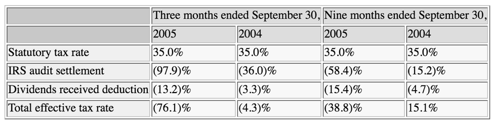
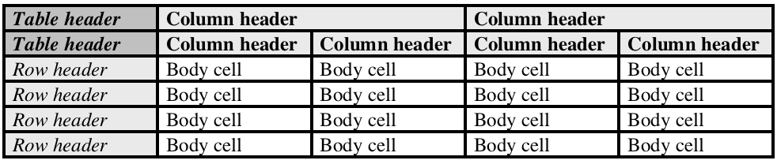

---

copyright:
  years: 2015, 2018
lastupdated: "2018-09-25"

---

{:shortdesc: .shortdesc}
{:new_window: target="_blank"}
{:tip: .tip}
{:pre: .pre}
{:codeblock: .codeblock}
{:screen: .screen}
{:javascript: .ph data-hd-programlang='javascript'}
{:java: .ph data-hd-programlang='java'}
{:python: .ph data-hd-programlang='python'}
{:swift: .ph data-hd-programlang='swift'}

# Element Classification
{: #element-classification}

Element Classification makes it possible to rapidly parse through governing documents to convert, identify, & classify elements of importance. Using state of the art Natural Language Processing, party (who it refers to), nature (type of element), and category (specific class) are extracted from elements of a document.

Element Classification is designed to provide:

- Natural Language Understanding of Contracts with emphasis on Software Procurement Contracts
- The ability to convert programmatic PDF to annotated JSON
- Identification of legal Entities and Categories that align with subject matter expertise

Element Classification brings together a functionally rich set of integrated, automated Watson APIs to input a programmatic PDF to identify: sections, lists (numbered and bulleted), footnotes, and tables converting these items into a structured HTML format. Furthermore, classification of this structured format is annotated and output as JSON with labeled elements, types and categories.

Element Classification securely transmits your data performing encryption in flight and at rest. For information about IBM Cloud security, see the [{{site.data.keyword.Bluemix_notm}} Cloud Service Description ](https://www.ibm.com/software/sla/sladb.nsf/searchsaas/?searchview&searchorder=4&searchmax=0&query=(IBM+Cloud+Service+description)){: new_window}.

This feature is currently supported in English only, see [Language support](/docs/services/discovery/language-support.html#feature-support) for details.

## Classification requirements
{: #element-class}

To classify documents using Element Classification your configuration and source documents must meet the following requirements:

- Files to be analyzed are in PDF format.
- The PDF contents are in text form. Documents that have been scanned cannot be parsed, even if they have been OCRed.

  **Note:** You can identify a PDF that is in text by opening the document in a PDF viewer and using the  **Text select**  tool to select a single word. If you cannot select a single word in the document, the file cannot be parsed.

- Files are no larger than 50Mb in size.
- Secure PDFs (with a password to open) and editing restricted PDFs (with a password to edit) cannot be parsed.
- The {{site.data.keyword.discoveryshort}} tooling includes a configuration named **Default Contract Configuration** that can be used to enrich your collection of PDF documents. You also have the option of creating a custom configuration that includes the `elements` enrichment. See [Collection requirements](/docs/services/discovery/element-classification.html#element-collection) for details.
- **Lite** plans can process a maximum of 500 pages per month.
- Not available in **Dedicated** environments.
- Post-enrichment normalization cannot be performed when using Element Classification.

**Note:** The **Default Contract Configuration** file was updated on September 25, 2018. If you applied this configuration to a collection prior to this date, see the [release notes](/docs/services/discovery/release-notes.html#25sept) for information on updating your collection.

## Collection requirements
{: #element-collection}

To use Element Classification, your collection must be configured to meet specific requirements.

The {{site.data.keyword.discoveryshort}} tooling includes a configuration named **Default Contract Configuration** that has been pre-configured to enrich PDF documents with the **Element Classification** enrichment and other required options. You can choose this configuration when you create your collection. The JSON for this configuration is:

```json
{
  "name": "Default Contract Configuration",
  "description": "Extract party, nature, and category from elements in PDFs.",
  "conversions": {
    "html": {
      "exclude_tags_completely": [],
      "exclude_tags_keep_content": []
    }
  },
  "enrichments": [
    {
      "source_field": "html",
      "destination_field": "enriched_html_elements",
      "enrichment": "elements",
      "options": {
        "model": "contract"
      }
    }
  ]
}
```
{: codeblock}

If you wish to create a custom configuration file, configure your collection to meet the following requirements:  

- `PDF` conversion settings are ignored if specified.
- `WORD` conversion settings can be omitted as Microsoft Word files cannot be ingested when Element Classification is specified.
- `html` normalization settings are ignored if specified.
- Document segmentation is not supported when the `elements` enrichment is specified.
- In the {{site.data.keyword.discoveryshort}} configuration, the `html` field must be enriched by the `elements` enrichment and the `model` specified as `contract`. In the following example, the `destination_field` is `enriched_html`, but any valid name can be used:

```json
"enrichments": [
  {
    "source_field": "html",
    "destination_field": "enriched_html",
    "enrichment": "elements",
    "options": {
      "model": "contract"
    }
  }
]
```
{: codeblock}

After selecting the `Default Contract Configuration` in the tooling, you can upload your documents. If you are unfamiliar with creating collections and uploading documents, see [Getting started with the tooling](/docs/services/discovery/getting-started-tool.html).

## Classified Elements

Once a document has been indexed with Element Classification, it will be returned with an `elements` array as part of the searchable document.

Each object in the `elements` array describes an element of the contract that Element Classification has identified. The following code represents a typical element:

```javascript
{
   "sentence" : {
     "begin" : 34941,
     "end" : 35307
   },
   "sentence_text" : "Buyer, if in New York state may, upon written notice to Supplier, terminate a SOW or WA.",
   "attributes" : [
     {
       "type": "Location",
       "text": "New York",
       "attribute": {
         "begin": 34954,
         "end": 34962
         }
     }
   ],
   "types" : [ {
     "label" : {
       "nature" : "Right",
       "party" : "Buyer"
     },
     "assurance" : "High"
   } ],
   "categories" : [ {
     "label : "Term & Termination",
     "assurance : "High"
     }
   ]
}
```

There are multiple important sections to the element:

- `sentence_text` – the text that was analyzed.
- `attributes` – this array lists one or more attributes of the element. Currently supported objects in the `attributes` array include `Location` (geographic location or region referenced by the element), `DateTime` (date, time, date range, or time range specified by the element), and `Currency` (monetary values and units).
- `categories` – An array that lists the functional categories into which the identified sentence falls; in other words, the subject matter of the sentence.
- `types`– An array that describes what the element is and whom it affects. It consists of one or more sets of `nature` keys (the effect of the sentence on the identified `party`) and `party` keys (whom the sentence affects).
- `sentence`– An object that describes where the element was found in the converted HTML. It contains a `start` character value and an `end` character value.

**Note**: Some sentences do not fall under any type or category and in that case the `types` and `categories` arrays are returned empty.

**Note:**  Some sentences cover multiple topics and will therefore be returned with multiple `types` and `categories` items listed.

## Understanding Contract Elements
{: #contract-elements}

Parsed contracts from Element Classification are returned with each identified element analyzed.

The following sections describe how the returned JSON describes the analysis.

### Type

The `types` array includes a number of objects, each of which contains `nature` and `party` keys whose values identify a couplet for the element.

The following tables list the possible values of the `nature` and `party` keys.

| **Nature**       |**Description**                                            |
|:----------------:|-----------------------------------------------------------|
|`Definition`      |This element adds clarity for a term, relationship, or similar. No action is required to fulfill the element, nor is any party affected.|
|`Disclaimer`      |The `party` in the element is not obligated to fulfill the terms specified by the element but is not prohibited from doing so.|
|`Exclusion`       |The `party` in the element will not fulfill the terms specified by the element.|
|`Obligation`      |The `party` in the element is required to fulfill the terms specified by the element.|
|`Right`           |The `party` in the element is guaranteed to receive the terms specified by the element.|

Each `nature` key is paired with a `party` key, which will contain either the name or the role of the party or parties that apply to the nature (examples include, but are not limited to, `Buyer`, `IBM`, or `All Parties`). Note that for the `Definition` nature, the party is always `None`.
 
### Parties

The separate `parties` array specifies the participants listed in the contract. Each identified `party` object lists the identified party by name and is matched with a `role` that classifies the role of the `party` object. The values of `role` that can be returned for contracts include, but are not limited to:

| **Role**         |**Description**                                            |
|:----------------:|-----------------------------------------------------------|
|`Buyer`           |The party responsible for paying for the goods or services listed in the contract.|
|`End User`        |The party who will interact with the provided goods or services, explicitly distinguished from the `Buyer`.|
|`None`            |No party was identified for the element.|
|`Supplier`        |The party responsible for providing the goods or services listed in the contract.|

### Categories

The `categories` array defines the subject matter of the sentence. Currently supported categories include:

| **Categories**   |**Description**                                            |
|:----------------:|-----------------------------------------------------------|
|`Amendments`      |Elements that specify changes to the contract after it has been signed, or alterations to a standard contract. Includes discussions of the conditions for changing the terms of a contract.|
|`Asset Use`       |Elements that refer to how one party may or may not use the assets of another party. This specifically applies to one party having access to or using assets such as licenses, equipment, tools, or personnel of the other party while in the process of conducting their duties under the agreement, including permissions and restrictions thereon.  This does not extend to specifications of a party's obligations or rights regarding any purchased goods, services, licenses, etc., as those are the party's own assets, rather than assets of another party.|
|`Assignments`     |Elements that describe the transfer of rights, obligations, or both to a third party.|
|`Audits`          |Elements referring to either the right of a party to examine or review compliance, or requirements that a party be available for inspection or compliance review. This includes references to record keeping (primarily as it relates to the right of inspection) and the maintenance and retention of activity records that may be examined.|
|`Business Continuity`|Elements referring to the consequences if the entire business of one of the parties is sold.|
|`Communication`  |Elements referring to requirements to communicate, respond, notify, or provide notice; contact information; or information regarding changes to the contract. Also includes references to details about communication methods, the act or process of exchanging information, and acceptable means of exchanging information between parties (as well as others who are not necessarily direct parties to the contract).|
|`Confidentiality` |Elements describing how parties can or cannot use information learned in the course of completing the contract and going forward. Also includes discussion of information that must be kept confidential, such as maintaining trade secrets or nondisclosure of business information.|
|`Deliverables`    |Elements specifying the items, such as goods or services, that one party provides to another under the terms of the contract, usually in exchange for payment. Includes discussion of preparation of deliverables.|
|`Delivery`        |Elements that specify the means or modes of transferring deliverables (things, as opposed to personal services) from one party to another. Includes discussions of characteristics of delivery, such as scheduling or location.|
|`Dispute Resolution`|Elements discussing provisions for settling any dispute (e.g., regarding labor, invoices, or billing) arising between contracting parties.  Provision examples may include settlement by a defined procedure such as an arbitration panel, a process for obtaining an injunction, waiving a right to trial, or prohibiting the pursuit of a class action. Also includes references to the contract's governing law or choice of law, such as a particular country or jurisdiction. |
|`Force Majeure`   |Elements that refer to unexpected or disruptive events outside a party's control that would relieve the party from performing their contractual obligation.|
|`Indemnification` |Elements that specify the remediation of certain liabilities, when one party of the contract becomes responsible for compensating another party as a result of incurred loss or damages during the term of, or arising from the circumstances of the contract. Also includes references to any legal exemptions from loss or damages.|
|`Insurance`       |Elements referring to insurance coverage or terms of coverage provided by one party to another party (including to third parties such as subcontractors or others). Includes a variety of insurance including, but not limited to, medical insurance.|
|`Intellectual Property`|Elements that discuss the assignment of rights (such as copyrights, patents, and trade secrets) to parties to the contract. Includes references to patents, rights to apply for patents, trademarks, trade names, service marks, domain names, copyrights, and all applications and registration of such schematics, industrial models, inventions, authorship, know-how, trade secrets, computer software programs, and other intangible proprietary information. Also includes discussion of the consequences of violation of intellectual property rights.|
|`Liability`       |Elements that describe the method for determining when and how fault attaches to any party. Examples may include, but are not limited to, statements regarding limitations of liability, third-party claims, and repairs, replacements, or reimbursements as required of the party at fault.|
|`Payment Terms & Billing`|Elements that detail how and when a party is to pay or get paid, as well as the items or fees the parties will be paying or billed for. Includes references to modes of payment or payment mechanisms.|
|`Pricing & Taxes` |Elements that refer to specific amounts or figures associated with individual deliverables that are exchanged (for example, how much something costs) as part of satisfying the terms of the contract. Includes references to specific figures or methods for calculating prices or tax amounts.|
|`Privacy`         |Elements that are particularly concerned with the treatment of sensitive personal information, usually regarding its protection (for example, in order to satisfy regulations such as GDPR).|
|`Responsibilities`|Elements that discuss tasks ancillary to the contract that are in only one party's control, specifically focused on discussion of employee oversight.|
|`Safety and Security`|Elements referring to physical safety or cybersecurity protection for people, data, or systems. Examples include discussions of background checks, safety precautions, workplace security, secure access protocols, and product defects that might pose a danger.|
|`Scope of Work`   |Elements that define what is in the contract versus is not in the contract; consequently, what is promised to be done. Examples include statements defining a particular order, or describing the goals or aims outlined in the contract.|
|`Subcontracts`    |Elements referring to the hiring of third parties to perform certain duties under the contract, and the permissions, rights, restrictions, and consequences thereto and arising therefrom.|
|`Term & Termination`|Elements referring to duration of the contract, the schedule and terms of contract termination, and any consequences of termination, including any obligations that apply at or after termination.|
|`Warranties`      |Elements that refer to ongoing promises and obligations made in the contract that are currently true and will continue to be true in the future. Also elements discussing the consequences of such promises or obligations being broken, and the rights to remedy the situation (for example, but not limited to, seeking damages). This category does not apply to elements that are purely concerned with representation statements (statements of fact about the past or the present), or to elements that lay out assumptions regarding things that occurred in the past.|

### Attributes
{: #attributes}

The `attributes` array specifies any attributes identified in the sentence. Each object in the array includes three keys: `type` (the type of attribute from the following table), `text` (the applicable text), and `attribute` (the start and end points of the attribute in the document). Currently supported attributes include:

| **Attributes**   |**Description**                                            |
|:----------------:|-----------------------------------------------------------|
|`Location`        |A geographical location or region.                         |
|`DateTime`        |A date, time, date range, or time range.                   |
|`Currency`        |Monetary value and units.                                  |

### Assurance

{{site.data.keyword.cnc_short}} gives an assurance rating to each `type` or `category` element it identifies. There is currently one assurance value, `High`, which indicates there is significant evidence that the listed classification is representative of the content.

### Provenance
{: #provenance}

Each object in the `types` and `categories` arrays includes a `provenance` object. The `provenance` object has one or more `id` keys. Each `id` key has a hashed value that you can send to IBM to provide feedback or receive support.

## Parties identified
{: #parties_identified}

Any identified parties are also defined in the parties array:

```json
  "parties" : [ {
    "party" : "Customer",
    "role" : "Buyer"
  } ]
```
{: codeblock}

There are two important sections to each element of the parties array:

- `party` – the text that was identified as a party within the document.
- `role` – the role of the party that has been identified. Roles change based on sub-domain, see the information on the specified sub-domain for a list of possible roles. Parties that cannot be identified to a specific role are labeled as `Unknown`.

## Tables identified
{: #tables_identified}

After a document has been enriched using Element Classification, any identified tables are parsed into the `tables` array of the stored document. Each object in the array describes a table identified in the input document.

The following is an example table from an input document.
 

The table is composed as follows:
 
 
where:

<ul>
  <li><strong><em>Bold italic text</em></strong> indicates a table header</li>
  <li><strong>Bold text</strong> indicates a column header</li>
  <li><em>Italic text</em> indicates a row header</li>
  <li>Unstyled text indicates a body cell</li>
</ul>

The following code snippet is a JSON respesentation of the above example's first body cell (that is, the first cell in row 3 with a value of `35.0%`).

```json
  "tables": [
    {
      "table": {
        "begin": 872,
        "end": 5879
      },
      "table_text": "...",
      "row_headers": [
        {
          "id": "rowHeader-2244-2262",
          "cell": {
            "begin": 2244,
            "end": 2263
          },
          "cell_text": "Statutory tax rate",
          "row_index_min": 2,
          "row_index_max": 2,
          "column_index_min": 0,
          "column_index_max": 0
        }
      ],
      "column_headers": [
        {
          "id": "colHeader-1050-1082",
          "cell": {
            "begin": 1050,
            "end": 1083
          },
          "cell_text": "Three months ended September 30,",
          "row_index_min": 0,
          "row_index_max": 0,
          "column_index_min": 1,
          "column_index_max": 2
        },
        {
          "id": "colHeader-1544-1548",
          "cell": {
            "begin": 1544,
            "end": 1549
          },
          "cell_text": "2005",
          "row_index_min": 1,
          "row_index_max": 1,
          "column_index_min": 1,
          "column_index_max": 1
        }
      ],
      "body_cells": [
        {
          "id": "bodyCell-2450-2455",
          "cell": {
            "begin": 2450,
            "end": 2456
          },
          "cell_text": "35.0%",
          "row_index_min": 2,
          "row_index_max": 2,
          "column_index_min": 1,
          "column_index_max": 1,
          "row_header_ids": [
            "rowHeader-2244-2262"
          ],
          "row_header_texts": [
            "Statutory tax rate"
          ],
          "column_header_ids": [
            "colHeader-1050-1082",
            "colHeader-1544-1548"
          ],
          "column_header_texts": [
            "Three months ended September 30,",
            "2005"
          ]
        }
      ],
      "section_title": {},
      "section_title_text": "",
      "table_headers": []
    }
  ]
```

The {{site.data.keyword.discoveryshort}} service uses the following fields to represent tables:

  - `tables`: An array defining the tables identified by the service.
  - `table`: The location of the current table as defined by its begin and end offsets in the input document.
  - `table_text`: The textual contents of the current table from the input document without associated markup content.
  - `section_title`: If identified, the location of a section title containing the current table, as defined by its begin and end offsets in the  input document. If not identified, empty.
  - `section_title_text`: If identified, the textual contents of the section title containing the current table, without associated markup content.
  - `table_headers `: An array of table-level cells applicable as headers to all other cells of the current table. Each table header is defined as a collection of the following elements:
    - `id`: A string value in the format `tableHeader-x-y`,where `x` and `y` are the begin and end offsets of the cell value in the original input document.
    - `cell`: The location of the table header cell in the current table as defined by its begin and end offsets in the input document.
    - `cell_text`: The textual contents of this cell from the input document without associated markup content.
    - `row_index_min`: The begin index of this cell's `row` location in the current table.
    - `row_index_max`: The end index of this cell's `row` location in the current table.
    - `column_index_min`: The begin index of this cell's `column` location in the current table.
    - `column_index_max`: The end index of this cell's `column` location in the current table.
  - `column_headers`: An array of column-level cells in the current table. Each cell is applicable as a header to other cells in the same column as itself. Each `column` header is defined as a collection of the following elements:
    - `id`: A string value in the format `columnHeader-x-y`, where `x` and `y` are the begin and end offsets of this column header cell in the input document.
    - `cell`: The location of the table header cell in the current table as defined by its begin and end offsets in the input document.
    - `cell_text`: The textual contents of this cell from the input document without associated markup content.
    - `row_index_min`: The begin index of this cell's `row` location in the current table.
    - `row_index_max`: The end index of this cell's `row` location in the current table.
    - `column_index_min`: The begin index of this cell's `column` location in the current table.
    - `column_index_max`: The end index of this cell's `column` location in the current table.
  - `row_headers`: An array of row-level cells in the current table. Each cell is applicable as a header to other cells in the same row as itself. Each row header is defined as a collection of the following elements:
    - `id`: A string value in the format `rowHeader-x-y`, where `x` and `y` are the begin and end offsets of this row header cell in the input document.
    - `cell`: The location of the table header cell in the current table as defined by its begin and end offsets in the input document.
    - `cell_text`: The textual contents of this cell from the input document without associated markup content.
    - `row_index_min`: The begin index of this cell's `row` location in the current table.
    - `row_index_max`: The end index of this cell's `row` location in the current table.
    - `column_index_min`: The begin index of this cell's `column` location in the current table.
    - `column_index_max`: The end index of this cell's `column` location in the current table.
  - `body_cells`: An array of cells in the current table. The cells are not table header, column header, or row header cells, and have corresponding row and column header associations. Each body cell is defined as a collection of the following elements:
    - `id`: A string value in the format `bodyCell-x-y`, where `x` and `y` are the begin and end offsets of this body cell in the input document.
    - `cell`: The location of the cell in the current table as defined by its begin and end offsets in the input document.
    - `cell_text`: The textual contents of this cell from the input document without associated markup content.
    - `row_index_min`: The begin index of this cell's `row` location in the current table.
    - `row_index_max`: The end index of this cell's `row` location in the current table.
    - `column_index_min`: The begin index of this cell's `column` location in the current table.
    - `column_index_max`: The end index of this cell's `column` location in the current table.
    - `row_header_ids`: An array of values, each being the `id` value of a `row` header that is applicable to this body cell.
    - `row_header_texts`: An array of values, each being the `cell_text` value of a `row` header that is applicable to this body cell.
    - `column_header_ids`: An array of values, each being the `id` value of a `column` header that is applicable to this body cell.
    - `column_header_texts`: An array of values, each being the `cell_text` value of a `column` header that is applicable to this body cell.

**Note:**
  - Row and column index values per cell are zero-based and so begin with `0`.
  - Multiple values in arrays of `row_header_ids` and `row_header_texts` elements indicate a hierarchy of `row` headers.
  - Multiple values in arrays of `column_header_ids` and `column_header_texts` elements indicate a hierarchy of `column` headers.
