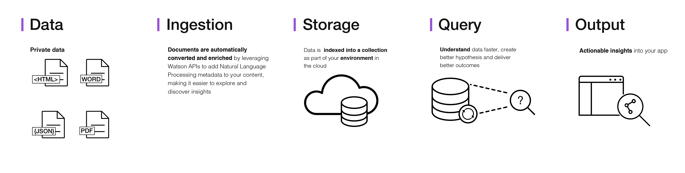

---

copyright:
  years: 2015, 2018
lastupdated: "2018-05-31"

---

{:shortdesc: .shortdesc}
{:new_window: target="_blank"}
{:tip: .tip}
{:pre: .pre}
{:codeblock: .codeblock}
{:screen: .screen}
{:javascript: .ph data-hd-programlang='javascript'}
{:java: .ph data-hd-programlang='java'}
{:python: .ph data-hd-programlang='python'}
{:swift: .ph data-hd-programlang='swift'}

# About

{{site.data.keyword.discoveryfull}} makes it possible to rapidly build cognitive, cloud-based exploration applications that unlock actionable insights hidden in unstructured data — including your own proprietary data, as well as public and third-party data.
{: shortdesc}

This is the architecture of a complete {{site.data.keyword.discoveryshort}} service solution:

With {{site.data.keyword.discoveryshort}}, it only takes a few steps to prepare your unstructured data, create a query that will pinpoint the information you need, and then integrate those insights into your new application or existing solution.

How does {{site.data.keyword.discoveryshort}} do it? By using data analysis combined with cognitive intuition to take your unstructured data and enrich it so you can discover the information you need.

{{site.data.keyword.discoveryfull}} brings together a functionally rich set of integrated, automated {{site.data.keyword.watson}} APIs to:

- Crawl, convert, enrich and normalize data.
- Securely explore your proprietary content as well as free and licensed public content.
- Apply additional enrichments such as concepts, relations, and sentiment through {{site.data.keyword.nlushort}} (NLU).
- Simplify development while still providing direct access to APIs.

For information about language support, see [{{site.data.keyword.discoveryshort}} language support](/docs/services/discovery/language-support.html).

For information about {{site.data.keyword.Bluemix_notm}} security, see the [{{site.data.keyword.Bluemix_notm}} Service Description ](../../icons/launch-glyph.svg "External link icon")](http://www.ibm.com/software/sla/sladb.nsf/searchsaas/?searchview&searchorder=4&searchmax=0&query=IBM+Bluemix+Service+Description){: new_window}.

{{site.data.keyword.discoveryfull}} Knowledge Graph is a beta feature which provides new end-points for querying entities and relations across documents. This includes context-based searches and relevance ranking. See [{{site.data.keyword.discoveryfull}} Knowledge Graph](/docs/services/discovery/building-kg.html) for more information.

## Browser support and prerequisites

For the list of {{site.data.keyword.Bluemix}} prerequisites and supported browsers, see [Prerequisites ](https://console.bluemix.net/docs/overview/prereqs.html#prereqs){: new_window}.

## Watson Discovery News
{: #watson-discovery-news}

{{site.data.keyword.discoverynewsshort}}, a public data set that has been pre-enriched with cognitive insights, is also included with {{site.data.keyword.discoveryshort}}. You can use this public, unstructured data set to query for insights that you can integrate into your applications. See [Watson Discovery News](/docs/services/discovery/watson-discovery-news.html#watson-discovery-news) for more information. See a demo of what you can build with {{site.data.keyword.discoverynewsshort}} [here ](https://discovery-news-demo.ng.bluemix.net/){: new_window}.

The {{site.data.keyword.discoveryshort}} service is available on [{{site.data.keyword.Bluemix_notm}} ](https://console.ng.bluemix.net/catalog/services/discovery/){: new_window}

## Discovery tooling
{: #discovery-tooling}

The {{site.data.keyword.discoveryshort}} service includes a complete set of online tools - the {{site.data.keyword.discoveryshort}} tooling - to help you quickly setup an instance of the service and populate it with data.

The {{site.data.keyword.discoveryshort}} service tooling has been designed to save time by eliminating the need to use APIs to configure and populate your service. This lets your application developers concentrate on creating high value ways for end users to experience the {{site.data.keyword.discoveryshort}} service. See [Getting started with the tooling](/docs/services/discovery/getting-started-tool.html) for an introduction to the {{site.data.keyword.discoveryshort}} tooling.

## Next steps
{: #next-steps}

- Get started with either the {{site.data.keyword.discoveryshort}} tooling or the {{site.data.keyword.discoveryshort}} API:
    - [Getting started with the {{site.data.keyword.discoveryshort}} tooling](/docs/services/discovery/getting-started-tool.html)
    - [Getting started with the {{site.data.keyword.discoveryshort}} API](/docs/services/discovery/getting-started.html)
- View the list of SDKs from the navigation pane.
