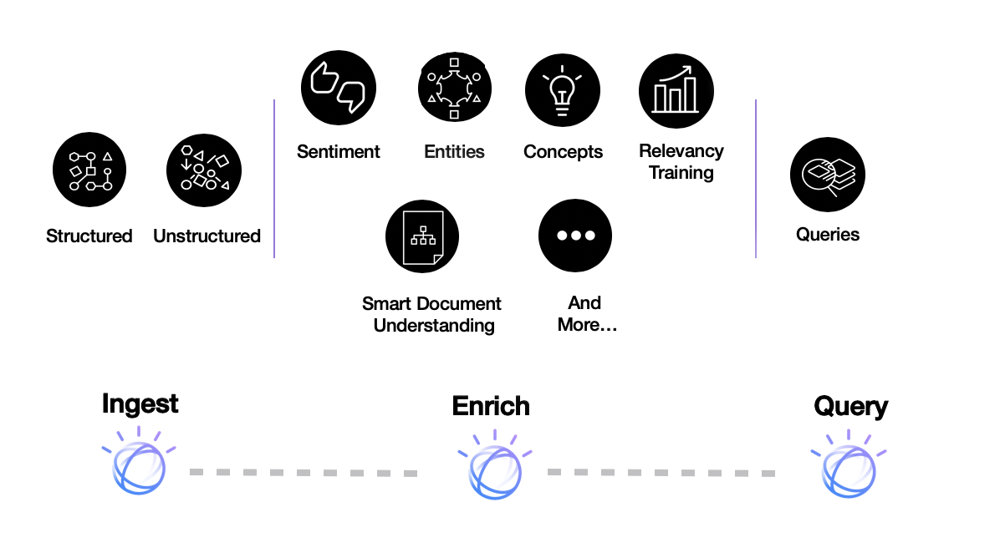

---

copyright:
  years: 2015, 2022
lastupdated: "2022-08-16"

subcollection: discovery

---

{{site.data.keyword.attribute-definition-list}}

# About Discovery v1
{: #about}

{{site.data.keyword.discoveryfull}} v1 is deprecated. As of 1 October 2021, you cannot create new v1 instances. Lite or Advanced plan service instances are {{site.data.keyword.discoveryshort}} v1 instances, as are service instances that you created with a Premium plan before 16 July 2020. Existing v1 service instances are supported until 11 July 2023. Any v1 instances that still exist on that date will be deleted. Migrate your solutions to use {{site.data.keyword.discoveryshort}} v2 before 11 July 2023. For more information, see the [{{site.data.keyword.discoveryshort}} v2 documentation](/docs/discovery-data?topic=discovery-data-version-choose){: external}.
{: deprecated}

{{site.data.keyword.discoveryshort}} makes it possible to rapidly build cognitive, cloud-based exploration applications that unlock actionable insights hidden in unstructured data — including your own proprietary data, as well as public and third-party data.
{: shortdesc}

With {{site.data.keyword.discoveryshort}}, it only takes a few steps to prepare your unstructured data, create a query that pinpoints the information you need, and then integrate those insights into your new application or existing solution.

How does {{site.data.keyword.discoveryshort}} do it? By using data analysis combined with cognitive intuition to take your unstructured data and enrich it so you can discover the information you need.

{{site.data.keyword.discoveryfull}} brings together a functionally rich set of integrated, automated {{site.data.keyword.watson}} APIs to:

- Crawl, convert, enrich and normalize data.
- Securely explore your proprietary content as well as free and licensed public content.
- Apply additional enrichments such as concepts, relations, and sentiment through {{site.data.keyword.nlushort}} (NLU).
- Simplify development while still providing direct access to APIs.

To try out {{site.data.keyword.discoveryshort}}, see the [{{site.data.keyword.discoveryfull}} Query Demo](https://www.ibm.com/demos/live/watson-discovery/self-service/home){: external}.

You can use Smart Document Understanding (SDU) to train {{site.data.keyword.discoveryfull}} to extract custom fields in your documents. See [Smart Document Understanding](/docs/discovery?topic=discovery-sdu) for more information.

If you create a chatbot in {{site.data.keyword.conversationfull}}, you can route complex customer inquiries to {{site.data.keyword.discoveryshort}} using a search skill. When a customer asks a question that the dialog is not designed to answer, your assistant can search for relevant information from {{site.data.keyword.discoveryshort}}, extract the information, and return it as the response. See [Creating a search skill](/docs/services/assistant?topic=assistant-skill-search-add) for details. (This feature is available only to {{site.data.keyword.conversationshort}} Plus or Premium plan users.)

For information about language support, see [{{site.data.keyword.discoveryshort}} language support](/docs/discovery?topic=discovery-language-support).

For information about {{site.data.keyword.Bluemix_notm}} security, see the [{{site.data.keyword.Bluemix_notm}} Service Description](https://www.ibm.com/software/sla/sladb.nsf/searchsaas/?searchview&searchorder=4&searchmax=0&query=%28IBM+Cloud+Service+description%29){: external}

US Health Insurance Portability and Accountability Act (HIPAA) support is available for Premium plans in the Washington, DC location created on or after 1 April 2019. See [Enabling EU and HIPAA supported settings](/docs/account?topic=account-eu-hipaa-supported#eu-hipaa-supported){: external} for more information.

## Browser support and prerequisites
{: #browser-support-and-prerequisites}

For the list of {{site.data.keyword.Bluemix}} prerequisites and supported browsers, see [Prerequisites](https://cloud.ibm.com/docs/overview?topic=overview-prereqs-platform){: external}.

## Discovery tooling
{: #discovery-tooling}

{{site.data.keyword.discoveryshort}} includes a complete set of online tools - the {{site.data.keyword.discoveryshort}} tooling - to help you quickly setup an instance of the service and populate it with data.

The {{site.data.keyword.discoveryshort}} tooling is designed to save time by eliminating the need to use APIs to configure and populate your service. This lets your application developers concentrate on creating high value ways for end users to experience {{site.data.keyword.discoveryshort}}. See [Getting started with the tooling](/docs/discovery?topic=discovery-getting-started) for an introduction to the {{site.data.keyword.discoveryshort}} tooling.

## Next steps
{: #next-steps}

- Get started with either the {{site.data.keyword.discoveryshort}} tooling or the {{site.data.keyword.discoveryshort}} API:
    - [Getting started with the {{site.data.keyword.discoveryshort}} tooling](/docs/discovery?topic=discovery-getting-started)
    - [Getting started with the {{site.data.keyword.discoveryshort}} API](/docs/discovery?topic=discovery-gs-api)
- {{site.data.keyword.discoveryshort}} supports a number of SDKs to simplify the development of applications. The SDKs are available for many popular programming languages and platforms, including Node.js, Java, and Python. All SDKs are available from the [watson-developer-cloud namespace](https://github.com/watson-developer-cloud){: external} on GitHub.
    - For a complete list of SDKs and information about using them, see [{{site.data.keyword.watson}} SDKs](/docs/watson?topic=watson-using-sdks).
    - For detailed information about all methods of the Node, Java, and Python SDKs, see the [API reference](/apidocs/discovery){: external}.