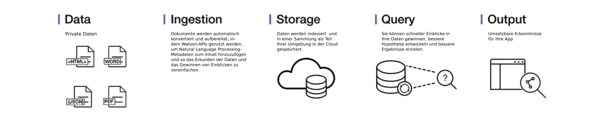

---

copyright:
  years: 2015, 2018
lastupdated: "2018-09-07"

---

{:shortdesc: .shortdesc}
{:new_window: target="_blank"}
{:tip: .tip}
{:pre: .pre}
{:codeblock: .codeblock}
{:screen: .screen}
{:javascript: .ph data-hd-programlang='javascript'}
{:java: .ph data-hd-programlang='java'}
{:python: .ph data-hd-programlang='python'}
{:swift: .ph data-hd-programlang='swift'}

# Produktinformation
{: #about}

{{site.data.keyword.discoveryfull}} ermöglicht die schnelle Erstellung von kognitiven cloudbasierten Untersuchungsanwendungen, die verlässliche Einblicke in unstrukturierte Daten freigeben. Dies schließt Ihre eigenen proprietären Daten ebenso ein wie allgemein zugängliche Daten und Daten anderer Anbieter.
{: shortdesc}

Die Architektur einer vollständigen Servicelösung von {{site.data.keyword.discoveryshort}} sieht wie folgt aus:

In {{site.data.keyword.discoveryshort}} können Sie mit nur wenigen Schritten Ihre unstrukturierten Daten vorbereiten, eine Abfrage zur Ermittlung der benötigten Informationen erstellen und anschließend diese Erkenntnisse in Ihre neue Anwendung oder eine bestehende Lösung integrieren.

Dies wird von {{site.data.keyword.discoveryshort}} wie folgt erreicht: Die Datenanalyse wird mit kognitiver Intuition kombiniert, um Ihre unstrukturierten Daten zu entnehmen und so aufzubereiten, dass Sie die benötigten Informationen erkennen können.

{{site.data.keyword.discoveryfull}} verbindet eine funktionsreiche Gruppe von integrierten und automatisierten {{site.data.keyword.watson}}-APIs und ermöglicht Folgendes:

- Sie können Daten durchsuchen, konvertieren, aufbereiten und normalisieren.
- Sie können proprietären Inhalt ebenso wie freigegebenen und lizenzierten allgemein zugänglichen Inhalt sicher durchsuchen.
- Mittels {{site.data.keyword.nlushort}} (NLU) können Sie zusätzliche Aufbereitungen wie Konzepte, Beziehungen und Stimmungen anwenden.
- Die Entwicklung wird vereinfacht; gleichzeitig bleibt der direkte Zugriff auf APIs möglich.

Informationen zur Sprachunterstützung finden Sie unter [Sprachunterstützung bei {{site.data.keyword.discoveryshort}}](/docs/services/discovery/language-support.html).

Weitere Informationen zur {{site.data.keyword.Bluemix_notm}}-Sicherheit finden Sie in der [Servicebeschreibung zu {{site.data.keyword.Bluemix_notm}} ](https://www.ibm.com/software/sla/sladb.nsf/searchsaas/?searchview&searchorder=4&searchmax=0&query=%28IBM+Cloud+Service+description%29){: new_window}

{{site.data.keyword.discoveryfull}} Knowledge Graph ist ein Betaversionsfeature, das neue Endpunkte für die dokumentübergreifende Abfrage von Entitäten und Beziehungen bereitstellt. Dies schließt kontextbasierte Suchvorgänge und die Einstufung nach Relevanz ein. Weitere Informationen finden Sie unter [{{site.data.keyword.discoveryfull}} Knowledge Graph](/docs/services/discovery/building-kg.html).

## Browserunterstützung und Voraussetzungen

Eine Liste der Voraussetzungen und unterstützten Browsern für {{site.data.keyword.Bluemix}} enthält der Abschnitt [Voraussetzungen ](https://console.bluemix.net/docs/overview/prereqs.html#prereqs){: new_window}.

## Watson Discovery News
{: #watson-discovery-news}

{{site.data.keyword.discoverynewsshort}}, ein allgemein zugänglicher Datenbestand, der vorab mit kognitiven Informationen aufbereitet wurde, ist ebenfalls in {{site.data.keyword.discoveryshort}} enthalten. Sie können diesen allgemein zugänglichen unstrukturierten Datenbestand zur Abfrage von Erkenntnissen verwenden, die Sie in Ihre Anwendungen integrieren können. Weitere Informationen finden Sie unter [Watson Discovery News](/docs/services/discovery/watson-discovery-news.html#watson-discovery-news). Was Sie mit {{site.data.keyword.discoverynewsshort}} erstellen können, wird in einer [Demo ](https://discovery-news-demo.ng.bluemix.net/){: new_window} gezeigt.

Der {{site.data.keyword.discoveryshort}}-Service ist über [{{site.data.keyword.Bluemix_notm}} ](https://console.ng.bluemix.net/catalog/services/discovery/){: new_window} verfügbar.

## Discovery-Tools
{: #discovery-tooling}

Der {{site.data.keyword.discoveryshort}}-Service beinhaltet eine umfassende Gruppe von Online-Tools (kurz '{{site.data.keyword.discoveryshort}}-Tools'), mit deren Hilfe Sie umgehend eine Instanz des Service erstellen und sie mit Daten füllen können.

Die Tools des {{site.data.keyword.discoveryshort}}-Service wurden aus Grunden der Zeitersparnis entwickelt, da zum Konfigurieren und Füllen des Service keine APIs verwendet werden müssen. Hierdurch können sich Ihre Anwendungsentwickler auf die Erstellung hochwertiger Verfahren zur Nutzung des {{site.data.keyword.discoveryshort}}-Service für die Endbenutzer konzentrieren. Unter [Einführung in die Tools](/docs/services/discovery/getting-started-tool.html) finden Sie Angaben über die ersten Schritte mit den {{site.data.keyword.discoveryshort}}-Tools.

## Nächste Schritte
{: #next-steps}

- Lesen Sie entweder die Einführung zu den {{site.data.keyword.discoveryshort}}-Tools oder zur {{site.data.keyword.discoveryshort}}-API:
    - [Einführung in die {{site.data.keyword.discoveryshort}}-Tools](/docs/services/discovery/getting-started-tool.html)
    - [Einführung in die {{site.data.keyword.discoveryshort}}-API](/docs/services/discovery/getting-started.html)
- Der {{site.data.keyword.discoveryshort}}-Service unterstützt eine Reihe von SDKs, um die Entwicklung von Anwendungen zu vereinfachen. Die SDKs sind für viele gängige Programmiersprachen und Plattformen verfügbar, z. B. Node.js, Java und Python. Alle SDKs sind über den ['watson-developer-cloud'-Namensbereich ](https://github.com/watson-developer-cloud){: new_window} auf GitHub verfügbar.
    - Eine vollständige Liste der SDKs und Informationen zur Verwendung dieser SDKs finden Sie unter [{{site.data.keyword.watson}}-SDKs ](https://console.bluemix.net/docs/services/watson/getting-started-sdks.html#sdks).
    - Ausführliche Informationen zu allen Methoden der Node-, Java- und Python-SDKs finden Sie in der [API-Referenz ](https://www.ibm.com/watson/developercloud/discovery/api/v1/curl.html?curl){: new_window}.
