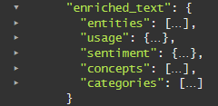

---

copyright:
  years: 2015, 2018, 2019
lastupdated: "2019-01-22"

subcollection: discovery

---

{:shortdesc: .shortdesc}
{:new_window: target="_blank"}
{:tip: .tip}
{:note: .note}
{:pre: .pre}
{:important: .important}
{:deprecated: .deprecated}
{:codeblock: .codeblock}
{:screen: .screen}
{:download: .download}
{:hide-dashboard: .hide-dashboard}
{:apikey: data-credential-placeholder='apikey'} 
{:url: data-credential-placeholder='url'}
{:curl: #curl .ph data-hd-programlang='curl'}
{:javascript: .ph data-hd-programlang='javascript'}
{:java: .ph data-hd-programlang='java'}
{:python: .ph data-hd-programlang='python'}
{:ruby: .ph data-hd-programlang='ruby'}
{:swift: .ph data-hd-programlang='swift'}
{:go: .ph data-hd-programlang='go'}

# Abfragekonzepte
{: #query-concepts}

Der {{site.data.keyword.discoveryfull}}-Service bietet leistungsfähige Funktionen für die Inhaltssuche. Nachdem Ihr Inhalt hochgeladen und durch den {{site.data.keyword.discoveryshort}}-Service aufbereitet wurde, können Sie Abfragen erstellen und dann {{site.data.keyword.discoveryshort}} in Ihre eigenen Projekte integrieren oder mit {{site.data.keyword.watson}} Explorer Application Builder eine angepasste Anwendung erstellen.
{: shortdesc}

  Die von Ihnen geschriebenen Abfragen werden je nach Sammlung variieren, da alle Sammlungen eindeutigen Inhalt enthalten.
  {: tip}

Wenn Sie eine Abfrage oder einen Filter erstellen, untersucht {{site.data.keyword.discoveryshort}} jedes Ergebnis und versucht, einen Abgleich mit den von Ihnen angegebenen Pfaden vorzunehmen. Falls Übereinstimmungen auftreten, werden sie zu den Ergebnismengen hinzugefügt. Beim Erstellen einer Abfrage können Sie so ungenau oder so spezifisch sein, wie Sie möchten. Je spezifischer die Abfrage ist, desto zielgerichteter sind die Ergebnisse.

Sie haben auch die Möglichkeit, den Abruf von Passagen zu aktivieren. Passagen sind kurze, relevante und aus den vollständigen Dokumenten, die von Ihrer Abfrage zurückgegeben wurden, extrahierte Auszüge. Diese gewünschten Passagen werden aus den Feldern `text` der Dokumente in Ihrer Sammlung extrahiert. Standardmäßig werden für eine Abfrage bis zu 10 Passagen zurückgegeben, die jeweils aus ungefähr 400 Zeichen bestehen. Aus einem einzelnen Ergebnis werden maximal drei Passagen extrahiert. Der Parameter `passages` ist nur für private Sammlungen verfügbar, in der Sammlung '{{site.data.keyword.discoverynewsshort}}' kann er nicht verwendet werden. Weitere Informationen dazu, wie Passagen erkannt werden, finden Sie unter [Passagen](//docs/services/discovery?topic=discovery-query-parameters#passages).

  Sie können Abfragen in natürlicher Sprache (z. B. 'Partnerschaften von IBM Watson') mit den {{site.data.keyword.discoveryshort}}-Tools oder der API schreiben.
  {: tip}

Alle privaten Sammlungen geben in den meisten Fällen eine `confidence`-Bewertung in den Abfrageergebnissen zurück. Details enthält der Abschnitt [Konfidenzbewertung](/docs/services/discovery?topic=discovery-improving-result-relevance-with-the-tooling#confidence).

{{site.data.keyword.discoveryshort}} gibt Abfrageergebnisse mit Sonderzeichen für die folgenden Sprachen zurück: Englisch, Deutsch, Französisch, Niederländisch, Italienisch und Portugiesisch. Wenn Sie beispielsweise nach `aqui` abfragen, erhalten Sie jetzt Ergebnisse sowohl für `aqui` als auch für <code>aqu&iacute;</code>.

Sie können längere, komplexere Abfragen erstellen, die mehrere Filter und komplexe Aggregationen enthalten. Diese Option ist nur in der API-Funktion verfügbar und erhöht die Zeichenbegrenzung für eine Abfrage auf 10.000 Zeichen. Weitere Informationen finden Sie unter [Lange Sammlungsabfragen ](https://{DomainName}/apidocs/discovery#long-collection-queries){: new_window} und [Lange Umgebungsabfragen ](https://{DomainName}/apidocs/discovery#long-environment-queries){: new_window}.

{{site.data.keyword.discoveryfull}} Knowledge Graph ist ein Betaversionsfeature, das neue Endpunkte für die dokumentübergreifende Abfrage von Entitäten und Beziehungen bereitstellt. Dies schließt kontextbasierte Suchvorgänge und die Einstufung nach Relevanz ein. Weitere Informationen finden Sie unter [{{site.data.keyword.discoveryfull}} Knowledge Graph](/docs/services/discovery?topic=discovery-kg#kg).

Weitere Informationen zum Schreiben von Abfragen enthalten die folgenden Abschnitte:
- [Einführung in das Lernprogramm für Abfragen](/docs/services/discovery?topic=discovery-getting-started-with-querying#getting-started-with-querying)
- [Abfragereferenz](/docs/services/discovery?topic=discovery-query-reference#query-reference) (enthält eine Liste der in der {{site.data.keyword.discoveryshort}}-Abfragesprache verfügbaren Parameter, Operatoren und Aggregationen)

## Discovery-Datenschema
{: #discovery-schema}

Als Erstes lernen Sie die JSON-Ausgabe von {{site.data.keyword.discoveryshort}} kennen. Wenn Sie in der {{site.data.keyword.discoveryshort}}-Abfragesprache eine Abfrage erstellen, müssen Sie mit der JSON-Ausgabe vertraut sein, die von {{site.data.keyword.discoveryshort}} erzeugt wird, nachdem die Dokumente in Ihrer Sammlung aufbereitet wurden. Sobald Ihnen das Datenschema Ihrer Dokumente geläufig ist, fällt Ihnen das Schreiben von Abfragen in der {{site.data.keyword.discoveryshort}}-Abfragesprache leichter. Hierzu haben Sie drei Möglichkeiten.

  1. Öffnen Sie in den {{site.data.keyword.discoveryshort}}-Tools die Anzeige **Daten verwalten** und wählen Sie die Sammlung aus, die {{site.data.keyword.IBM_notm}} Press Releases enthält. Klicken Sie auf die Schaltfläche **Datenschema anzeigen**. In der Anzeige **Datenschema anzeigen** werden die Felder und Werte in Ihren konvertierten Dokumenten auf zwei Arten angezeigt, nämlich nach Dokument (**Dokumentansicht**) oder nach Feld (**Sammlungsansicht**). In der **Dokumentansicht** werden maximal 50 Dokumente angezeigt. In der **Sammlungsansicht** werden die Felder der gesamten Sammlung angezeigt.

    In der **Sammlungsansicht** können Sie unter `enriched_text` die Aufbereitungen untersuchen, die Sie auf Ihre Sammlung angewendet haben. Klicken Sie auf `categories`, `concepts`, `entities` und `sentiment`, um festzustellen, wie Ihre Sammlung mit Watson-Informationen aufbereitet wurde.

  1. Führen Sie eine 'leere' Abfrage aus, um die JSON-Ausgabe anzuzeigen. Klicken Sie in der Anzeige **Datenschema anzeigen** auf die Schaltfläche **Abfragen erstellen** und dann auf **Abfrage ausführen**. Die Ergebnisse werden rechts auf den beiden Registerkarten **Zusammenfassung** (Übersicht der Abfrageergebnisse) und **JSON** angezeigt. Öffnen Sie zunächst die Registerkarte **JSON**.

     -  Jedem der vier Dokumente wird eine `ID-Nummer` vorangestellt.
     -  Blättern Sie bis zum Feld `enriched_text` vor. Untersuchen Sie die einzelnen Aufbereitungen; dies vermittelt Ihnen eine Vorstellung von den JSON-Feldern, für die Sie Abfragen ausführen können.

        

     -  **entities**: Suchen Sie zunächst nach dem Feld `text` und untersuchen Sie dann die weiteren Informationen zur Aufbereitung.
     -  **sentiment**: Suchen Sie zunächst nach dem Feld `label` und untersuchen Sie dann die weiteren Informationen zur Aufbereitung.
     -  **concepts**: Suchen Sie zunächst nach dem Feld `text` und untersuchen Sie dann die weiteren Informationen zur Aufbereitung.
     -  **categories**: Suchen Sie zunächst nach dem Feld `document` und untersuchen Sie dann die weiteren Informationen zur Aufbereitung.

     Nachdem Sie die Erkenntnisse im ersten Dokument untersucht haben, können Sie sich bei Bedarf die anderen drei Dokumente ansehen.

  1. Zeigen Sie die verfügbaren Felder in **Visual Query Builder** an. Klicken Sie in der Anzeige **Abfragen erstellen** auf **Dokumente suchen** und dann auf **{{site.data.keyword.discoveryshort}}-Abfragesprache verwenden**. Klicken Sie auf die Dropdown-Liste **Feld**, um die in Ihren Daten verfügbaren Felder anzuzeigen. Klicken Sie auf **In Abfragesprache bearbeiten**, um Abfragen manuell in der {{site.data.keyword.discoveryshort}}-Abfragesprache zu erstellen.      

### Basisabfrage strukturieren
{: #structure-basic-query}

Wie Sie bereits festgestellt haben, ist die JSON-Ausgabe hierarchisch aufgebaut. Abfragen müssen daher unter Verwendung derselben Hierarchie geschrieben werden. Beispielsweise sieht die JSON-Ausgabe wie folgt aus:

```json
"enriched_text": {
  "concepts": [
    {
    "text": "Cloud computing",
    "relevance": 0.610029}
    ]
  }
```
{: codeblock}

Ihre Abfrage müssen Sie in diesem Fall wie folgt strukturieren:


  Für Operatoren, die ein Feld bewerten (`<=`, `>=`, `<`, `>`) ist als Wert eine `Zahl` oder ein `Datum` erforderlich. Durch das Setzen von Anführungszeichen um einen Wert wird dieser zu einer `Zeichenfolge`. Daher ist `score>=0.5` eine gültige Abfrage und `score>="0.5"` keine gültige Abfrage. Eine vollständige Liste der Operatoren finden Sie unter [Abfrageoperatoren](/docs/services/discovery?topic=discovery-query-operators#query-operators).
  {: tip}

Hinweise:

- Wenn Sie sich nicht sicher sind, ob Sie die Abfrage für eine Entität, ein Konzept oder ein Schlüsselwort ausführen müssen, finden Sie im Abschnitt [Unterschiede zwischen Entitäten, Konzepten und Schlüsselwörtern](/docs/services/discovery?topic=discovery-configservice#udbeck) weiterführende Informationen.

- **Hinweis:** Nachdem Sie auf **Abfrage ausführen** geklickt und die Registerkarte **JSON** geöffnet haben, können Sie feststellen, dass die Abfragehervorhebung standardmäßig aktiviert ist. Hierdurch wird ein Feld `highlight` zu Ihren Abfrageergebnissen hinzugefügt. Im Feld `highlight` sind die Wörter, die mit Ihrer Abfrage übereinstimmen, in HTML-Tags `<em>` (Hervorhebung) eingeschlossen. Details enthält der Abbschnitt [Abfrageparameter](/docs/services/discovery?topic=discovery-query-parameters#highlight).

## Kombinierte Abfragen erstellen
{: #building-combined-queries}

Sie können Abfrageparameter kombinieren, um zielgerichtetere Abfragen zu erstellen. Zum Beispiel können Sie die Parameter `filter` und `query` gemeinsam verwenden. Weitere Informationen zu den Unterschieden zwischen Filterung und Abfrage enthält der Abschnitt [Unterschiede zwischen den Parametern 'query' und 'filter'](/docs/services/discovery?topic=discovery-query-parameters#filtervquery).

## Aggregation strukturieren
{: #structure-aggregation}

Aggregationen geben eine Gruppe von Datenwerten zurück, beispielsweise wichtige Schlüsselwörter, Gesamtstimmung von Entitäten und anderes. Eine vollständige Liste der Aggregationsoptionen finden Sie unter [Aggregationen](/docs/services/discovery?topic=discovery-query-reference#aggregations).


Diese Beispielaggregration ermittelt alle `Konzepte` in Ihrer Sammlung.
Der Begrenzer in dieser Abfrage ist `.` und der Operator ist `()`; weitere Informationen zu den anderen Operatoren, die in der {{site.data.keyword.discoveryshort}}-Abfragesprache verfügbar sind, finden Sie unter [Abfrageoperatoren](/docs/services/discovery?topic=discovery-query-operators#query-operators).

### Beispiele für Aggregationsabfragen
{: #example-aggregations}

Für die Aggregation von Ergebnissen mit {{site.data.keyword.discoverynewsshort}} gibt es verschiedene Möglichkeiten, beispielsweise können Sie sie anhand von höchsten Werten, Summe, Minimum, Maximum, Durchschnitt, Zeitscheibe und Histogramm erstellen. Darüber hinaus können Sie Filter hinzufügen und Aggregationen verschachteln.

#### Aggregationen filtern
{: #filter-aggregations}

Die folgende Beispielaggregation gibt die Anzahl der Artikel zurück, die in {{site.data.keyword.discoverynewsshort}} über die Pittsburgh Steelers gefunden wurden, sowie die Anzahl derjenigen Ergebnisse mit einer `positiven`, `negativen` oder `neutralen` Stimmung.

- `filter(enriched_text.entities.text:"Pittsburgh Steelers").term(enriched_text.sentiment.document.label,count:3)`


Die folgende Beispielaggregation nimmt zunächst eine Eingrenzung (Filterung) für eine Gruppe von Artikeln in {{site.data.keyword.discoverynewsshort}} auf diejenigen Artikel vor, die als Entitätstext `twitter` enthalten, und teilt diese Artikel anschließend nach Stimmungstyp des Dokuments auf. Nur die 3 übergeordneten Stimmungstypen für Dokumente (`positiv`, `negativ`, `neutral`) werden zurückgegeben.

- `filter(enriched_text.entities.text:twitter).term(enriched_text.sentiment.document.label,count:3)`

#### Verschachtelte Aggregationen
{: #nested-aggregations}

Die Angabe von `nested` vor einer Aggregation beschränkt die Aggregation auf den Bereich der angegebenen Ergebnisse. Beispielsweise bedeutet `nested(enriched_text.entities)`, dass nur die Komponenten `enriched_text.entities` von Ergebnissen als Grundlage für die Aggregation verwendet werden.

Dies lässt sich gut anhand der Unterschiede zwischen den beiden folgenden Abfragen nachvollziehen:
- `filter(enriched_text.entities.disambiguation.subtype::City)`: Die Aggregation zählt die Anzahl von *Ergebnissen*, die eines oder mehrere Elemente `entity` mit dem Typ `City` enthalten.
- `nested(enriched_text.entities).filter(enriched_text.entities.disambiguation.subtype::City)`: Die Aggregation zählt die Anzahl der Instanzen eines Elements `entity` mit dem Typ `City` in den Ergebnissen.  

Alle nachfolgenden Operationen grenzen die Ergebnismenge, für die eine Aggregation ausgeführt werden kann, weiter ein. Beispiel:

- `nested(enriched_text.entities).filter(enriched_text.entities.disambiguation.subtype::City)` bedeutet, dass nur Entitäten mit `subtype::City` aggregiert werden.
- `nested(enriched_text.entities).filter(enriched_text.entities.disambiguation.subtype::City).term(enriched_text.entities.text,count:3)` aggregiert die 3 wichtigsten Entitäten des Subtyps `City`.
- `filter(enriched_text.entities.disambiguation.subtype::City).term(enriched_text.entities.text,count:3)` gibt die drei wichtigsten Entitäten zurück, bei denen das Ergebnis mindestens eine Entität des Subtyps `City` enthält.

## Watson Discovery News abfragen
{: #querying-news}

{{site.data.keyword.discoverynewsshort}}, ein allgemein zugänglicher Datenbestand, der vorab mit kognitiven Informationen aufbereitet wurde, ist ebenfalls in {{site.data.keyword.discoveryshort}} enthalten. Weitere Informationen zu dieser Sammlung finden Sie unter [Watson Discovery News](/docs/services/discovery?topic=discovery-watson-discovery-news#watson-discovery-news).

Sie können diese Sammlung mit Abfragen in natürlicher Sprache (z. B. 'Partnerschaften von IBM Watson') oder in der {{site.data.keyword.discoveryshort}}-Abfragesprache abfragen. Weitere Informationen zu Abfragen in natürlicher Sprache finden Sie unter [Abfrage in natürlicher Sprache](/docs/services/discovery?topic=discovery-query-parameters#nlq).

Das Anpassen der {{site.data.keyword.discoverynewsshort}}-Konfiguration, das Durchführen eines Trainings oder das Hinzufügen von Dokumenten zur Sammlung '{{site.data.keyword.discoverynewsshort}}' ist nicht möglich. Was Sie mit {{site.data.keyword.discoverynewsshort}} erstellen können, wird in einer [Demo ](https://discovery-news-demo.ng.bluemix.net/){: new_window} gezeigt.

Die {{site.data.keyword.watson}} {{site.data.keyword.discoverynewsshort}}-Sammlung in Englisch, Koreanisch, Deutsch, Spanisch und Japanisch sind sowohl über die {{site.data.keyword.discoveryshort}}-Tools als auch die API verfügbar.

Die Standardsprache von {{site.data.keyword.watson}} {{site.data.keyword.discoverynewsshort}} in den Tools ist Englisch. Um die Sprache zu wechseln, müssen Sie zunächst auf das Symbol  klicken und anschließend die entsprechende Sprache aus der Dropdown-Liste auswählen.

Informationen zum Abfragen einer Sammlung über die API finden Sie in der [API-Referenz ](https://{DomainName}/apidocs/discovery#query-your-collection){: new_window}. Der Wert von `collection_id` für die englische Sprachversion von Watson {{site.data.keyword.discoverynewsshort}} lautet `news-en`. Zuvor wurde für `collection_id` der Wert `news` verwendet. Falls Sie den früheren Wert für `collection_id` verwendet haben, ist dies weiterhin möglich. Es kann jedoch sinnvoll sein, bei neuen Projekten auf den neuen Wert für `collection_id` umzusteigen. Der Wert für `collection_id` der koreanischen Sammlung ist `news-ko`, der Wert für `collection_id` der spanischen Sammlung `news-es`, der Wert für `collection_id` der deutschen Sammlung `news-de` und der Wert für `collection_id` für die japanische Sammlung `news-ja`.

{{site.data.keyword.discoverynewsfull}}-Abfragen zeigen die ersten 50 Wörter jedes Artikels im JSON-Feld `text` an.

Die maximale Anzahl der Ergebnisse, die für eine {{site.data.keyword.watson}} {{site.data.keyword.discoverynewsshort}}-Abfrage zurückgegeben werden, beträgt `50`. Verwenden Sie zusätzliche Abfragen und den Parameter `offset`, um mehr als `50` Ergebnisse zurückzugeben.

Falls Sie die {{site.data.keyword.discoveryshort}}-Abfragesprache verwenden, können Sie einen relativen Datumsbereich in Ihre Abfragen für {{site.data.keyword.discoverynewsshort}} einbeziehen. Beispiel: `crawl_date>=now-1month`. Gültige Werte für Datumsintervalle sind `second/seconds` `minute/minutes`, `hour/hours`, `day/days`, `week/weeks`, `month/months` und `year/years`. Der Wert `now` wird nicht durch den Parameter `time_zone` beeinflusst; Standardeinstellung ist die Zeitzone `UTC`.

In diesem Beispiel wird nach einem Schlüsselwort innerhalb eines bestimmten Datumsbereichs abgefragt. Die Zeitzoneninformationen sind nicht erforderlich:
- `enriched_text.keywords.text:"olympics", publication_date<=2018-02-15T00:00:00Z, publication_date>=2018-02-01T00:00:00Z`

Neue Artikel können für mehrere Nachrichtenausgaben syndiziert werden. {{site.data.keyword.discoverynewsfull}} nimmt alle diese Artikel auf, was zu doppelten Artikeln führt. Dies bedeutet, dass eine Abfrage von {{site.data.keyword.discoverynewsfull}} potenziell identische oder nahezu identische Artikel in Abfrageergebnissen zurückgibt. Dies können Sie mithilfe der Deduplizierung steuern. Mehr über diese Betafunktionalität enthält der Abschnitt [Doppelte Dokumente aus Abfrageergebnissen ausschließen](/docs/services/discovery?topic=discovery-query-parameters#deduplication).

## Mehrere Sammlungen abfragen
{: #multiple-collections}

Falls Ihre Umgebung mehrere Sammlungen enthält, haben Sie die Möglichkeit, Ergebnisse anzuzeigen, die sammlungsübergreifend ermittelt wurden. Mit den Abfragemethoden (`query`, `fields` und `notices`) können Sie auf der Ebene der Umgebungen (`environments`) mehrere angegebene Sammlungen abfragen. Die sammlungsübergreifende Abfrage ist in den {{site.data.keyword.discoveryshort}}-Tools gegenwärtig nicht verfügbar.

Zur Abfrage von mehreren Sammlungen in derselben Umgebung verwenden Sie die API-Methode `environments/{umgebungs-id}/query`. Bei einer Abfrage für mehrere Sammlungen sollten Sie die folgenden Aspekte berücksichtigen.
-  Bei Verwendung dieser Methode muss der Parameter `collection_ids` angegeben werden. Der Wert für `collection_ids` ist eine durch Kommas getrennte Liste der abzufragenden Sammlungen in der Umgebung.
-  Der Parameter `passages` wird beim Abfragen von mehreren Sammlungen unterstützt.
-  Als Teil jedes Ergebnisobjekts wird `collection_id` zurückgegeben. In diesem Feld ist die Sammlung angegeben, in der das Ergebnis gefunden wurde.
-  Die Sammlung '{{site.data.keyword.discoverynewsshort}}' ist Bestandteil der Umgebung `system` und kann nicht in Abfragen für mehrere Sammlungen einbezogen werden.
-  Das Relevanztraining der einzelnen Sammlungen wirkt sich nicht auf die Rangfolge der Ergebnisse aus, wenn mehrere Sammlungen abgefragt werden. Um Ergebnisse beim Abfragen von mehreren Sammlungen neu anzuordnen, implementieren Sie [Continuous Relevancy Training](/docs/services/discovery?topic=discovery-crt#crt).
-  Bei einer Abfrage für mehrere Sammlungen wird selbst dann keine erneute Einstufung ausgeführt, wenn alle Sammlung in der Abfrage trainiert worden sind.

Weitere Informationen können Sie dem Abschnitt ['Abfrage von mehreren Sammlungen' in der API-Referenz ](https://{DomainName}/apidocs/discovery#query-documents-in-multiple-collections){: new_window} entnehmen.

Sie können Hinweise zu mehreren Sammlungen in derselben Umgebung anzeigen, indem Sie die API-Methode `environments/{umgebungs-id}/notices` verwenden.
-  Bei Verwendung dieser Methode muss der Parameter `collection_ids` angegeben werden. Der Wert für `collection_ids` ist eine durch Kommas getrennte Liste der abzufragenden Sammlungen in der Umgebung.
-  Der Parameter `passages` wird beim Abfragen von mehreren Sammlungen unterstützt.

Weitere Informationen können Sie dem Abschnitt ['Hinweise zu mehreren Sammlungen' in der API-Referenz ](https://{DomainName}/apidocs/discovery#get-collection-details){: new_window} entnehmen.

Sie können die sammlungsübergreifend in derselben Umgebung verfügbaren Felder anzeigen, indem Sie die API-Methode `environments/{umgebungs-id}/fields` verwenden. Weitere Informationen können Sie dem Abschnitt ['Feldabfrage von mehreren Sammlungen' in der API-Referenz ](https://{DomainName}/apidocs/discovery#list-fields-across-collections){: new_window} entnehmen.

## Abfrageerweiterung
{: #query-expansion}

Sie können den Umfang einer Abfrage über exakte Übereinstimmungen hinaus erweitern; z. B. können Sie eine Abfrage für "car" erweitern und "automobile" und "vehicle" einschließen, indem Sie eine Liste der Abfrageerweiterungsbegriffe über die {{site.data.keyword.discoveryshort}}-API hochladen. Abfrageerweiterungsbegriffe sind normalerweise Synonyme, Antonyme oder typische Rechtschreibfehler für allgemeine Begriffe.

Es können zwei Arten von Erweiterungen definiert werden:
-  **bidirektional**: Jeder erweiterter Begriff (`expanded_term`) wird so erweitert, dass er alle erweiterten Begriffe einschließt. Beispielsweise würde eine Abfrage für `car` auf `car OR automobile OR vehicle` erweitert werden.
-  **unidirektional:**: Die Eingabebegriff (`input_terms`) in der Abfrage werden durch die erweiterten Begriffe (`expanded_terms`) ersetzt. Eine Abfrage für `banana` könnte beispielsweise auf `plaintain` und `fruit` erweitert werden. Eingabebegriffe (`input_terms`) werden nicht als Teil der resultierenden Abfrage verwendet. Im vorherigen Beispiel mit `banana` würde die Abfrage `banana` beispielsweise in `plantain` OR `fruit` konvertiert werden und den ursprünglichen Begriff nicht enthalten.

Diese Datei kann als Ausgangspunkt beim Erstellen einer Abfrageerweiterungsliste verwendet werden:
<a target="_blank" href="https://watson-developer-cloud.github.io/doc-tutorial-downloads/discovery/expansions.json" download>expansions.json </a>. Sie können diese Datei ändern, um eine angepasste Abfrageerweiterungsliste zu erstellen.

Bidirektionales Beispiel:
```JSON
 {
   "expansions": [
     {
       "expanded_terms": [
         "car",
         "automobile",
         "vehicle"
       ]
     }
   ]
 }
```
{: codeblock}

Unidirektionales Beispiel:
```JSON
 {
   "expansions": [
     {
      "input_terms": [
        "banana"
       ],
      "expanded_terms": [
        "banana",
         "plantain",
         "fruit"
       ]
     }
   ]
 }
```
{: codeblock}

Hinweise zur Abfrageerweiterung:

-  Die Abfrageerweiterung mit mehreren Tokens wird nicht unterstützt.
-  Die Abfrageerweiterung ist nur für private Sammlungen verfügbar. Die Anzahl der verfügbaren Erweiterungsarrays (`expansions`; bidirektionale und unidirektionale Arrays insgesamt) und Begriffe (die Summe aus `input_terms` plus `expanded_terms`) ist je nach Plan anders. Weitere Informationen finden Sie unter [Preisstrukturpläne für Discovery](/docs/services/discovery?topic=discovery-discovery-pricing-plans#discovery-pricing-plans). **Hinweis:** Alle Abfragebegriffe (sowohl `input_terms` als auch `expanded_terms`) zählen jeweils als ein Begriff. Dieses Beispiel enthält zwei Objekte im Array `expansions` und sieben Begriffszeichenfolgen.

```JSON
 {
   "expansions": [
     {
      "input_terms": [
         "ibm"
       ],
      "expanded_terms": [
         "ibm",
         "watson"
       ]
     },
     {
      "input_terms": [
         "banana"
       ],
      "expanded_terms": [
         "banana",
         "plantain",
         "fruit"
       ]
     }
   ]
 }
```
{: codeblock}

-  Es kann nur eine einzige Abfrageerweiterungsliste pro Sammlung hochgeladen werden. Wenn eine zweite Erweiterungsliste hochgeladen wird, ersetzt sie die erste.
-  Alle Eingaben für `input_terms` und `expanded_terms` sollten in Kleinbuchstaben angegeben werden. Begriffe in Kleinbuchstaben werden auf Großbuchstaben erweitert.
-  Die Abfrageerweiterungsliste muss in JSON geschrieben sein.
-  Löschen Sie die Abfrageerweiterungsliste, um die Abfrageerweiterung zu inaktivieren.
-  Eine Abfrageerweiterungsliste kann derzeit nicht mit den {{site.data.keyword.discoveryshort}}-Tools hochgeladen oder gelöscht werden; dies muss über die {{site.data.keyword.discoveryshort}}-API erfolgen.
-  Die Abfrageerweiterung wird für die Methoden `query` und `multiple collection query` ausgeführt. Die Abfrageerweiterung wird bei Knowledge Graph-Abfragen nicht ausgeführt.
-  Jede Gruppe von Erweiterungen ist einer Sammlung zugeordnet. Bei der Abfrage von [mehreren Sammlungen](/docs/services/discovery?topic=discovery-query-concepts#multiple-collections) wird jede Sammlung einzeln erweitert.
-  Abfrageerweiterungen werden bei der Abfragezeit angewendet, nicht während der Indexierung. Daher kann die Abfrageerweiterungsliste aktualisiert werden, ohne dass die Dokumente erneut eingepflegt werden müssen.
-  Eine Abfrageerweiterungsliste darf nicht hochgeladen oder gelöscht werden, während Sie Dokumente in Ihre Sammlung einpflegen. Dies könnte dazu führen, dass der Index für diesen kurzen Zeitraum nicht verfügbar ist.

Die API-Befehle zum Hochladen und Löschen von Abfrageerweiterungsdateien finden Sie in der [API-Referenz für Abfrageerweiterungen ](https://{DomainName}/apidocs/discovery#get-the-expansion-list){: new_window}.

## Stoppwörter definieren
{: #stopwords}

Stoppwörter sind Wörter, die aus Abfragen herausgefiltert werden, weil sie wenig Wert hinzufügen, z. B. "ein" oder "der" (`a, an, the`). Durch das Hinzufügen einer Liste mit angepassten Stoppwörtern kann die Relevanz der Ergebnisse für Abfragen in natürlicher Sprache verbessert werden. 

{{site.data.keyword.discoveryshort}} wendet eine Standardliste mit Stoppwörtern für mehrere Sprachen zur Abfragezeit an. Sie können jedoch eine angepasste Liste von Stoppwörtern definieren und hochladen, die die Standardliste außer Kraft setzt. {{site.data.keyword.discoveryshort}} wendet die entsprechende Standardliste oder eine angepasste Liste mit Stoppwörtern auf Ihre privaten Sammlungen an, basierend auf der Sprache, die für diese Sammlung angegeben ist. 

Ihre angepasste Stoppwortliste muss eine durch Zeilenumbruch getrennte `txt`-Datei sein. Nachstehend ein Beispiel für eine angepasste Stoppwortliste:

```
ibm
watson
a
an
the
what
how
when
can
should
```
Diese Liste enthält alle standardmäßigen englischen Stoppwörter <a target="_blank" href="https://watson-developer-cloud.github.io/doc-tutorial-downloads/discovery/custom_stopwords_en.txt" download>custom_stopwords_en.txt </a>. Sie kann als Ausgangspunkt bei der Erstellung einer angepassten Liste von englischen Stoppwörtern verwendet werden. Die Erstellung einer angepassten Stoppwortliste, die keine sehr allgemeinen Begriffe wie `a` und `the` enthält, kann zu einer verminderten Abfrageleistung führen, weshalb empfohlen wird, diese Wörter in der Liste der angepassten Stoppwörter beizubehalten. Im Folgenden sind Stoppwortlisten für mehrere andere unterstützte Sprachen aufgeführt. Sie alle enthalten die Standard-Stoppwörter für die jeweilige Sprache:

-  Niederländisch: <a target="_blank" href="https://watson-developer-cloud.github.io/doc-tutorial-downloads/discovery/custom_stopwords_nl.txt" download>custom_stopwords_nl.txt </a>.
-  Französisch: <a target="_blank" href="https://watson-developer-cloud.github.io/doc-tutorial-downloads/discovery/custom_stopwords_fr.txt" download>custom_stopwords_fr.txt </a>.
-  Deutsch: <a target="_blank" href="https://watson-developer-cloud.github.io/doc-tutorial-downloads/discovery/custom_stopwords_de.txt" download>custom_stopwords_de.txt </a>. 
-  Italienisch: <a target="_blank" href="https://watson-developer-cloud.github.io/doc-tutorial-downloads/discovery/custom_stopwords_it.txt" download>custom_stopwords_it.txt </a>.
-  Japanisch: <a target="_blank" href="https://watson-developer-cloud.github.io/doc-tutorial-downloads/discovery/custom_stopwords_ja.txt" download>custom_stopwords_ja.txt </a>.
-  Spanisch: <a target="_blank" href="https://watson-developer-cloud.github.io/doc-tutorial-downloads/discovery/custom_stopwords_es.txt" download>custom_stopwords_es.txt </a>. 

Eine Liste der von {{site.data.keyword.discoveryshort}} unterstützten Sprachen finden Sie unter [Sprachunterstützung](/docs/services/discovery?topic=discovery-language-support#supported-languages). Mehrere der unterstützten Sprachen verfügen über keine Standard-Stoppwortliste.

In der [API-Referenz zu Stoppwörtern ](https://{DomainName}/apidocs/discovery#create-stopword-list){: new_window} finden Sie die API-Befehle zum Hochladen und Löschen von angepassten Stoppwortlisten.

Hinweise zu Stoppwörtern:

-  Mit den {{site.data.keyword.discoveryshort}}-Tools kann derzeit keine angepasste Stoppwortliste hochgeladen oder gelöscht werden. Dies muss über die {{site.data.keyword.discoveryshort}}-API erfolgen. Weitere Informationen finden Sie in der [API-Referenz zu Stoppwörtern ](https://{DomainName}/apidocs/discovery#create-stopword-list){: new_window}.
-  Das Hochladen einer angepassten Stoppwortliste ist nur für private Sammlungen in den Plänen `Advanced` und `Premium` verfügbar.
-  Die Größenbegrenzung für die `txt`-Datei einer angepassten Stoppwortliste beträgt eine Million Zeichen. Wenn Sie jedoch eine angepasste Stoppwortliste mit einer großen Anzahl von Begriffen hochladen, kann dies die Suchgenauigkeit beeinträchtigen. Die Anzahl der Wörter ist abhängig von der Sprache, dem Dokumentinhalt und den ausgewählten Wörtern. Ein bewährtes Verfahren besteht darin, die Liste der Stoppwörter unter `200` Wörtern insgesamt zu halten. 
-  Pro Sammlung kann nur eine einzige angepasste Stoppwortliste hochgeladen werden. Wird eine zweite angepasste Stoppwortliste hochgeladen, so wird die erste Liste durch die zweite ersetzt.
-  Alle Stoppwörter sollten in Kleinbuchstaben angegeben werden. 
-  Zum Inaktivieren der angepassten Stoppwortliste muss diese gelöscht werden.
-  Eine angepasste Stoppwortliste darf nicht hochgeladen oder gelöscht werden, während Dokumente in Ihre Sammlung eingepflegt werden. Dies könnte dazu führen, dass der Index für diesen kurzen Zeitraum nicht verfügbar ist.
-  Stoppwörter werden sowohl zur Indexierungs- als auch zur Abfragezeit entfernt. Ein bewährtes Verfahren ist es, die angepasste Stoppwortliste vor dem Hochladen von Dokumenten hochzuladen.
   - Wenn Ihre Dokumente bereits mit den Standardstoppwörtern indexiert wurden und Sie dann eine angepasste Stoppwortliste hinzufügen, werden die neuen Stoppwörter weiterhin in den Index aufgenommen. In diesem Fall filtern Abfragen, die diese neuen Stoppwörter enthalten, diese zur Abfragezeit heraus.
   - Wenn ein Benutzer nach einem Wort sucht, das zu irgendeinem Zeitpunkt ein Stoppwort war, aber seitdem aus der Liste der angepassten Stoppwörter entfernt wurde, werden keine Dokumente gefunden, die mit dem ursprünglichen Stoppwort übereinstimmen, da der Begriff zum Zeitpunkt der Indexierung nicht vorhanden war. Um dieses Problem zu beheben, löschen Sie die Dokumente in Ihrer Sammlung und laden Sie alle Dokumente erneut hoch, sodass sie mit der aktualisierten angepassten Stoppwortliste indexiert werden.
-  Jede Gruppe von Stoppwörtern ist einer Sammlung zugeordnet. Bei der Abfrage über mehrere Sammlungen verwendet jede Sammlung die angepasste Stoppwortliste, die dieser Sammlung zugeordnet wurde.
- Wenn Sie an Ihrer angepassten Stoppwortliste wesentliche Änderungen vornehmen, sollten Sie die Dokumente in Ihrer Sammlung löschen und alle Dokumente erneut hochladen, sodass sie mit der aktualisierten Stoppwortliste indexiert werden.

## Angepasste Wörterverzeichnisse für die Zerlegung in Tokens erstellen
{: #tokenization}

Bei der Zerlegung in Tokens wird Text in Einheiten aufgeteilt, die als Tokens bezeichnet werden. Auf Ihre Sammlungen wird ein Standardwörterverzeichnis für die Zerlegung in Tokens angewendet. Sie können die Suchgenauigkeit für Ihre Domäne und Sprache jedoch verbessern, indem Sie ein angepasstes Wörterverzeichnis für die Zerlegung in Tokens hochladen. Ihr angepasstes Wörterverzeichnis überschreibt das Standardwörterverzeichnis. Sie können Ihr Wörterverzeichnis mit der {{site.data.keyword.discoveryshort}}-API hochladen. 

Die API-Befehle zum Hochladen und Löschen von Dateien für die Zerlegung in Tokens finden Sie in der [API-Referenz für die Zerlegung in Tokens ](https://{DomainName}/apidocs/discovery#create-tokenization-dictionary){: new_window}. 

**Hinweis:** Dieses Feature ist derzeit nur für japanische Sammlungen verfügbar. 

Im folgenden Beispiel ist **text** der Ausdruck, der bei der Suche mit einem Token versehen werden soll. **tokens** sind die Wörter, in die der **text** aufgeteilt wird (diese müssen einzeln definiert werden). Unter **readings** ist die Version der Tokens aufgelistet, die durch einen anderen Zeichensatz dargestellt werden, und **part_of_speech** ist der Teil der Sprache, den die Tokens darstellen.

Wenn Sie mit diesem angepassten Wörterverzeichnis nach dem Text `ネコ` suchen, enthalten die Suchergebnisse Text, der `すしネコ` enthält, sowie Text, der nur `ネコ` enthält.

```
{ "tokenization_rules":
  [
     {
      "text":"すし",
      "tokens":[
        "すし"
      ],
      "readings":[
        "寿司"
      ],
      "part_of_speech":"カスタム名詞"
    },
    {
      "text":"ネコ",
      "tokens":[
        "ネコ"
      ],
      "readings":[
        "ネコ"
      ],
      "part_of_speech":"カスタム名詞"
    }
```

Mit diesem angepassten Wörterverzeichnis können Sie Regeln mit einem einzigen Token erstellen. In diesem Beispiel wird `ibm発見` als einzelnes Token mit einem Token versehen, sodass es nicht in kleinere Einheiten aufgeteilt wird.

```
{ "tokenization_rules":
  [
    {
      "text":"ibm発見",
      "tokens":[  
      "ibm発見"
      ],
      "readings":[  
      "ibm発見"
      ],
      "part_of_speech":"カスタム名 詞"
    },
    ...
  ]
}
```

-  Die Zerlegung in Tokens erfolgt sowohl bei der Indexierung als auch zur Abfragezeit.
-  Tokens müssen einzeln definiert werden.
-  Für alle Sammlungen wird ein Standardwörterverzeichnis für die Zerlegung in Tokens verwendet. Wenn Ihre Sammlung bereits mit diesem Wörterverzeichnis indexiert wurde, müssen Sie nach dem Hochladen eines angepassten Wörterverzeichnisses für die Zerlegung in Tokens die Dokumente in dieser Sammlung erneut einpflegen.
-  Das Hochladen eines angepassten Wörterverzeichnisses für die Zerlegung in Tokens ist nur für private Sammlungen in den Plänen `Advanced` und `Premium` verfügbar. 
-  Pro Sammlung kann nur ein Wörterverzeichnis für die Zerlegung in Tokens hochgeladen werden; wenn ein zweites Wörterverzeichnis hochgeladen wird, ersetzt es das erste. Falls diese Sammlung bereits Dokumente enthält, müssen Sie sie erneut einpflegen, damit das angepasste Wörterverzeichnis für die Zerlegung in Tokens angewendet werden kann.
-  Das angepasste Wörterverzeichnis für die Zerlegung in Tokens muss in JSON geschrieben sein. Beispielname: `angepasstes_wörterverzeichnis_für_die_zerlegung_in_tokens.json`.
-  Alle Begriffe des angepassten Wörterverzeichnisses für die Zerlegung in Tokens sollten in Kleinbuchstaben angegeben werden.
-  Um die Zerlegung in Tokens zu inaktivieren, löschen Sie das Wörterverzeichnis für die Zerlegung in Tokens und pflegen Sie die Dokumente erneut ein.
-  Ein Wörterverzeichnis für die Zerlegung in Tokens kann derzeitig nicht mit den {{site.data.keyword.discoveryshort}}-Tools hochgeladen oder gelöscht werden; dies muss über die {{site.data.keyword.discoveryshort}}-API erfolgen.
-  Die Zerlegung in Tokens wird für die Methoden `query` und `multiple collection query` ausgeführt. Die Zerlegung in Tokens wird für Knowledge Graph-Abfragen nicht ausgeführt.
-  Jedes Wörterverzeichnis für die Zerlegung in Tokens ist einer Sammlung zugeordnet. Bei der Abfrage von [mehreren Sammlungen](/docs/services/discovery?topic=discovery-query-concepts#multiple-collections) wird jede Sammlung einzeln in Tokens zerlegt.
-  Ein Wörterverzeichnis für die Zerlegung in Tokens darf nicht hochgeladen oder gelöscht werden, während Sie Dokumente in Ihre Sammlung einpflegen. 

## Dokumentähnlichkeit
{: #doc-similarity}

Eine Dokumentähnlichkeitsabfrage findet ähnliche Dokumente wie das derzeit angezeigte Dokument. Beispiel: Ein Call-Center-Operator sieht sich die Handbücher für ein Produkt an. Mithilfe der Dokumentähnlichkeit kann er nach anderen Dokumenten mit ähnlichen Merkmalen suchen. Sie können anhand von ähnlichen Dokument-IDs (`similar.document_ids`) eine Abfrage nach ähnlichen Dokumenten durchführen und optional die Ähnlichkeit durch die Angabe von zusätzlichen ähnlichen Feldern (`similar.fields` eingrenzen.

Die Dokumentähnlichkeit wird ermittelt, indem die 25 wichtigsten Begriffe aus dem Originaldokument extrahiert werden und anschließend nach Dokumenten gesucht wird, die ähnliche relevante Begriffe enthalten.

Beispielabfrage nach `similar.document_ids` (es sollte kein Leerzeichen nach dem Komma vorhanden sein, wenn mehrere `similar.document_ids` angegeben werden):

`curl -u "apikey":"{wert_des_api-schlüssels}" "https://gateway.watsonplatform.net/discovery/api/v1/environments/{umgebungs-id}/collections/{sammlungs-id}/query?version=2017-11-07&similar.document_ids=4107b6f1-5d3f-4bea-bbcf-fb05bbf960b1,6057k6d1-7d7k-6aeh-cfbb-kj98ssf786c2"`

Beispielabfrage mit dem Zusatz `similar.fields`:

`curl -u "apikey":"{wert_des_api-schlüssels}" "https://gateway.watsonplatform.net/discovery/api/v1/environments/{umgebungs-id}/collections/{sammlungs-id}/query?version=2017-11-07&similar.document_ids=4107b6f1-5d3f-4bea-bbcf-fb05bbf960b1&similar.fields=title&return=title&count=100"`

Weitere Informationen finden Sie in der [API-Referenz zur Dokumentähnlichkeit ](https://{DomainName}/apidocs/discovery#query-your-collection){: new_window} und im Abschnitt zu den [Abfrageparametern](/docs/services/discovery?topic=discovery-query-parameters#similar).
