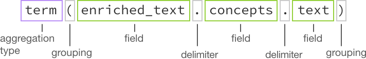

---

copyright:
  years: 2015, 2017
lastupdated: "2017-12-15"

---

{:shortdesc: .shortdesc}
{:new_window: target="_blank"}
{:tip: .tip}
{:pre: .pre}
{:codeblock: .codeblock}
{:screen: .screen}
{:javascript: .ph data-hd-programlang='javascript'}
{:java: .ph data-hd-programlang='java'}
{:python: .ph data-hd-programlang='python'}
{:swift: .ph data-hd-programlang='swift'}

# Abfragekonzepte

Der {{site.data.keyword.discoveryfull}}-Service bietet leistungsfähige Funktionen für die Inhaltssuche. Nachdem Ihr Inhalt hochgeladen und durch den {{site.data.keyword.discoveryshort}}-Service aufbereitet wurde, können Sie Abfragen erstellen und dann {{site.data.keyword.discoveryshort}} in Ihre eigenen Projekte integrieren oder mit {{site.data.keyword.watson}} Explorer Application Builder eine angepasste Anwendung erstellen.
{: shortdesc}

  Die von Ihnen geschriebenen Abfragen werden je nach Sammlung variieren, da alle Sammlungen eindeutigen Inhalt enthalten.
  {: tip}

Wenn Sie eine Abfrage oder einen Filter erstellen, untersucht {{site.data.keyword.discoveryshort}} jedes Ergebnis und versucht, einen Abgleich mit den von Ihnen angegebenen Pfaden vorzunehmen. Falls Übereinstimmungen auftreten, werden sie zu den Ergebnismengen hinzugefügt. Beim Erstellen einer Abfrage können Sie so ungenau oder so spezifisch sein, wie Sie möchten. Je spezifischer die Abfrage ist, desto zielgerichteter sind die Ergebnisse.

Sie haben auch die Möglichkeit, den Abruf von Passagen zu aktivieren. Passagen sind kurze, relevante und aus den vollständigen Dokumenten, die von Ihrer Abfrage zurückgegeben wurden, extrahierte Auszüge. Diese gewünschten Passagen werden aus den Feldern `text` der Dokumente in Ihrer Sammlung extrahiert. Standardmäßig werden für eine Abfrage bis zu 10 Passagen zurückgegeben, die jeweils aus ungefähr 400 Zeichen bestehen. Aus einem einzelnen Ergebnis werden maximal drei Passagen extrahiert. Der Parameter `passages` ist nur für private Sammlungen verfügbar, in der Sammlung '{{site.data.keyword.discoverynewsshort}}' kann er nicht verwendet werden. Weitere Informationen dazu, wie Passagen erkannt werden, finden Sie unter [Passagen](/docs/services/discovery/query-parameters.html#passages).

  Sie können Abfragen in natürlicher Sprache (z. B. 'Partnerschaften von IBM Watson') mit den {{site.data.keyword.discoveryshort}}-Tools oder der API schreiben.
  {: tip}

Sammlungen, für die ein Training durchgeführt wurde, geben im Ergebnis für eine Abfrage in natürlicher Sprache eine Konfidenzbewertung (Feld `confidence`) zurück. Details enthält der Abschnitt [Konfidenzbewertung](/docs/services/discovery/train-tooling.html#confidence).

{{site.data.keyword.discoveryfull}} Visual Insights ist ein experimentelles Feature, mit dem Sie Verbindungen grafisch orientiert untersuchen können, die aufgrund des Verständnisses von {{site.data.keyword.discoveryshort}} für semantische Elemente, Beziehungen, Konzepte und anderes erkannt wurden. Weitere Informationen finden Sie unter [{{site.data.keyword.discoveryfull}} Visual Insights](/docs/services/discovery/visual-insights.html).

{{site.data.keyword.discoveryfull}} Knowledge Graph ist ein Betaversionsfeature, das neue Endpunkte für die dokumentübergreifende Abfrage von Entitäten und Beziehungen bereitstellt. Dies schließt kontextbasierte Suchvorgänge und Einstufung nach Relevanz ein. Weitere Informationen finden Sie unter [{{site.data.keyword.discoveryfull}} Knowledge Graph](/docs/services/discovery/building-kg.html).

Weitere Informationen zum Schreiben von Abfragen enthalten die folgenden Abschnitte:
- [Einführung in das Lernprogramm für Abfragen](/docs/services/discovery/getting-started-query.html)
- [Abfragereferenz](/docs/services/discovery/query-reference.html) (enthält eine Liste der in der {{site.data.keyword.discoveryshort}}-Abfragesprache verfügbaren Parameter, Operatoren und Aggregationen)

## Discovery-Datenschema
{: #discovery-schema}

Als Erstes lernen Sie die JSON-Ausgabe von {{site.data.keyword.discoveryshort}} kennen. Wenn Sie in der {{site.data.keyword.discoveryshort}}-Abfragesprache eine Abfrage erstellen, müssen Sie mit der JSON-Ausgabe vertraut sein, die von {{site.data.keyword.discoveryshort}} erzeugt wird, nachdem die Dokumente in Ihrer Sammlung aufbereitet wurden. Sobald Ihnen das Datenschema Ihrer Dokumente geläufig ist, fällt Ihnen das Schreiben von Abfragen in der {{site.data.keyword.discoveryshort}}-Abfragesprache leichter. Hierzu haben Sie drei Möglichkeiten.

  1. Öffnen Sie in den {{site.data.keyword.discoveryshort}}-Tools die Anzeige **Daten verwalten** und wählen Sie die Sammlung aus, die {{site.data.keyword.IBM_notm}} Press Releases enthält. Klicken Sie auf die Schaltfläche **Datenschema anzeigen**. In der Anzeige **Datenschema anzeigen** werden die Felder und Werte in Ihren konvertierten Dokumenten auf zwei Arten angezeigt, nämlich nach Dokument (**Dokumentansicht**) oder nach Feld (**Sammlungsansicht**). In der **Dokumentansicht** werden maximal 50 Dokumente angezeigt. In der **Sammlungsansicht** werden die Felder der gesamten Sammlung angezeigt.

    In der **Sammlungsansicht** können Sie unter `enriched_text` die Aufbereitungen untersuchen, die Sie mit der Datei für die **Standardkonfiguration** angewendet haben. Klicken Sie auf `categories`, `concepts`, `entities` und `sentiment`, um festzustellen, wie Ihre Sammlung mit Watson-Informationen aufbereitet wurde.

  1. Führen Sie eine 'leere' Abfrage aus, um die JSON-Ausgabe anzuzeigen. Klicken Sie in der Anzeige **Datenschema anzeigen** auf die Schaltfläche **Abfragen erstellen** und dann auf **Abfrage ausführen**. Die Ergebnisse werden rechts auf den beiden Registerkarten **Zusammenfassung** (Übersicht der Abfrageergebnisse) und **JSON** angezeigt. Öffnen Sie zunächst die Registerkarte **JSON**.

     -  Jedes der vier Dokumente wird durch eine `ID-Nummer` ergänzt.
     -  Blättern Sie bis zum Feld `enriched_text` vor. Untersuchen Sie die einzelnen Aufbereitungen; dies vermittelt Ihnen eine Vorstellung von den JSON-Feldern, für die Sie Abfragen ausführen können.

        

     -  **entities**: Suchen Sie zunächst nach dem Feld `text` und untersuchen Sie dann die weiteren Informationen zur Aufbereitung.
     -  **sentiment**: Suchen Sie zunächst nach dem Feld `label` und untersuchen Sie dann die weiteren Informationen zur Aufbereitung.
     -  **concepts**: Suchen Sie zunächst nach dem Feld `text` und untersuchen Sie dann die weiteren Informationen zur Aufbereitung.
     -  **categories**: Suchen Sie zunächst nach dem Feld `document` und untersuchen Sie dann die weiteren Informationen zur Aufbereitung.

     Nachdem Sie die Erkenntnisse im ersten Dokument untersucht haben, können Sie sich bei Bedarf die anderen drei Dokumente ansehen.

  1. Zeigen Sie die verfügbaren Felder in **Visual Query Builder** an. Klicken Sie in der Anzeige **Abfragen erstellen** auf **Dokumente suchen** und dann auf **{{site.data.keyword.discoveryshort}}-Abfragesprache verwenden**. Klicken Sie auf die Dropdown-Liste **Feld**, um die in Ihren Daten verfügbaren Felder anzuzeigen. Klicken Sie auf **In Abfragesprache bearbeiten**, um Abfragen manuell in der {{site.data.keyword.discoveryshort}}-Abfragesprache zu erstellen.      

### Basisabfrage strukturieren
{: #structure-basic-query}

Wie Sie bereits festgestellt haben, ist die JSON-Ausgabe hierarchisch aufgebaut. Abfragen müssen daher unter Verwendung derselben Hierarchie geschrieben werden. Beispielsweise sieht die JSON-Ausgabe wie folgt aus:

```json
"enriched_text": {
  "concepts": [
    {
    "text": "Cloud computing",
    "relevance": 0.610029}
    ]
  }
```
{: codeblock}

Ihre Abfrage müssen Sie in diesem Fall wie folgt strukturieren:


Hinweise:

- Wenn Sie sich nicht sicher sind, ob Sie die Abfrage für eine Entität, ein Konzept oder ein Schlüsselwort ausführen müssen, finden Sie im Abschnitt [Unterschiede zwischen Entitäten, Konzepten und Schlüsselwörtern](/docs/services/discovery/building.html#udbeck) weiterführende Informationen.

- **Hinweis:** Nachdem Sie auf **Abfrage ausführen** geklickt und die Registerkarte **JSON** geöffnet haben, können Sie feststellen, dass die Abfragehervorhebung standardmäßig aktiviert ist. Hierdurch wird ein Feld `highlight` zu Ihren Abfrageergebnissen hinzugefügt. Im Feld `highlight` sind die Wörter, die mit Ihrer Abfrage übereinstimmen, in HTML-Tags `<em>` (Hervorhebung) eingeschlossen. Details enthält der Abbschnitt [Abfrageparameter](/docs/services/discovery/query-parameters.html#highlight).

## Kombinierte Abfragen erstellen
{: #building-combined-queries}

Sie können Abfrageparameter kombinieren, um zielgerichtetere Abfragen zu erstellen. Beispielsweise können Sie die Parameter `filter` und `query` zusammen verwenden. Weitere Informationen zu den Unterschieden zwischen Filterung und Abfrage enthält der Abschnitt [Unterschiede zwischen den Parametern 'query' und 'filter'](/docs/services/discovery/query-parameters.html#filtervquery).

## Aggregation strukturieren
{: #structure-aggregation}

Aggregationen geben eine Gruppe von Datenwerten zurück, beispielsweise wichtige Schlüsselwörter, Gesamtstimmung von Entitäten und anderes. Eine vollständige Liste der Aggregationsoptionen finden Sie unter [Aggregationen](/docs/services/discovery/query-reference.html#aggregations).



Diese Beispielaggregration ermittelt alle `Konzepte` in Ihrer Sammlung.
Der Begrenzer in dieser Abfrage ist `.` und der Operator ist `()`; weitere Informationen zu den anderen Operatoren, die in der {{site.data.keyword.discoveryshort}}-Abfragesprache verfügbar sind, finden Sie unter [Abfrageoperatoren](/docs/services/discovery/query-operators.html).

### Beispiele für Aggregationsabfragen
{: #example-aggregations}

Für die Aggregation von Ergebnissen mit {{site.data.keyword.discoverynewsshort}} gibt es verschiedene Möglichkeiten, beispielsweise können Sie sie anhand von höchsten Werten, Summe, Minimum, Maximum, Durchschnitt, Zeitscheibe und Histogramm erstellen. Darüber hinaus können Sie Filter hinzufügen und Aggregationen verschachteln.

#### Aggregationen filtern
{: #filter-aggregations}

Die folgende Beispielaggregation gibt die Anzahl der Artikel zurück, die in {{site.data.keyword.discoverynewsshort}} über die Pittsburgh Steelers gefunden wurden, sowie die Anzahl derjenigen Ergebnisse mit einer `positiven`, `negativen` oder `neutralen` Stimmung.

- `filter(enriched_text.entities.text:"Pittsburgh Steelers").term(enriched_text.sentiment.document.label,count:3)`


Die folgende Beispielaggregation nimmt zunächst eine Eingrenzung (Filterung) für eine Gruppe von Artikeln in {{site.data.keyword.discoverynewsshort}} auf diejenigen Artikel vor, die als Entitätstext 'twitter' enthalten, und teilt diese Artikel anschließend nach Stimmungstyp des Dokuments auf. Nur die 3 übergeordneten Stimmungstypen für Dokumente (`positiv`, `negativ`, `neutral`) werden zurückgegeben.

- `filter(enriched_text.entities.text:twitter).term(enriched_text.sentiment.document.label,count:3)`

#### Verschachtelte Aggregationen
{: #nested-aggregations}

Die Angabe von `nested` vor einer Aggregation beschränkt die Aggregation auf den Bereich der angegebenen Ergebnisse. Beispielsweise bedeutet `nested(enriched_text.entities)`, dass nur die Komponenten `enriched_text.entities` von Ergebnissen als Grundlage für die Aggregation verwendet werden.

Dies lässt sich gut anhand der Unterschiede zwischen den beiden folgenden Abfragen nachvollziehen:
- `filter(enriched_text.entities.disambiguation.subtype::City)`: Die Aggregation zählt die Anzahl von *Ergebnissen*, die eines oder mehrere Elemente `entity` mit dem Typ `City` enthalten.
- `nested(enriched_text.entities).filter(enriched_text.entities.disambiguation.subtype::City)`: Die Aggregation zählt die Anzahl der Instanzen eines Elements `entity` mit dem Typ `City` in den Ergebnissen.  

Alle nachfolgenden Operationen grenzen die Ergebnismenge, für die eine Aggregation ausgeführt werden kann, weiter ein. Beispiel:

- `nested(enriched_text.entities).filter(enriched_text.entities.disambiguation.subtype::City)` bedeutet, dass nur Entitäten mit `subtype::City` aggregiert werden.
- `nested(enriched_text.entities).filter(enriched_text.entities.disambiguation.subtype::City).term(enriched_text.entities.text,count:3)` aggregiert die 3 wichtigsten Entitäten des Subtyps `City`.
- `filter(enriched_text.entities.disambiguation.subtype::City).term(enriched_text.entities.text,count:3)` gibt die drei wichtigsten Entitäten zurück, bei denen das Ergebnis mindestens eine Entität des Subtyps `City` enthält.

## Watson Discovery News abfragen
{: #querying-news}

{{site.data.keyword.discoverynewsshort}}, ein allgemein zugänglicher Datenbestand, der vorab mit kognitiven Informationen aufbereitet wurde, ist ebenfalls in {{site.data.keyword.discoveryshort}} enthalten. Weitere Informationen zu dieser Sammlung finden Sie unter [Watson Discovery News](/docs/services/discovery/watson-discovery-news.html#watson-discovery-news).

Sie können diese Sammlung mit Abfragen in natürlicher Sprache (z. B. 'Partnerschaften von IBM Watson') oder in der {{site.data.keyword.discoveryshort}}-Abfragesprache abfragen. Weitere Informationen zu Abfragen in natürlicher Sprache finden Sie unter [Abfrage in natürlicher Sprache](/docs/services/discovery/query-parameters.html#nlq).

Das Anpassen der {{site.data.keyword.discoverynewsshort}}-Konfiguration, das Durchführen eines Trainings oder das Hinzufügen von Dokumenten zur Sammlung '{{site.data.keyword.discoverynewsshort}}' ist nicht möglich. Was Sie mit {{site.data.keyword.discoverynewsshort}} erstellen können, ist in einem [Demo ](https://discovery-news-demo.mybluemix.net/){: new_window} gezeigt.

Die englische Sprachversion von Watson {{site.data.keyword.discoverynewsshort}} ist bei den {{site.data.keyword.discoveryshort}}-Tools und der API verfügbar. Die koreanische (`collection_id`: `news-ko`) und die spanische (`collection_id`: `news-es`) Spachversion ist nur bei der API verfügbar. Informationen zum Abfragen einer Sammlung über die API finden Sie in der [API-Referenz ](https://www.ibm.com/watson/developercloud/discovery/api/v1/#query-collection){: new_window}. Der Wert von `collection_id` für die englische Sprachversion von Watson {{site.data.keyword.discoverynewsshort}} lautet `news-en`. Zuvor war der Wert für `collection_id` mit `news` festgelegt; falls Sie den früheren Wert für `collection_id` verwendet haben, funktioniert dies weiterhin. Bei neuen Projekten kann es jedoch sinnvoll sein, auf den neuen Wert für `collection_id` umzusteigen.

**Hinweis:** Die maximale Anzahl der zurückgegebenen Ergebnisse für eine Abfrage von Watson Discovery News ist `50`. Verwenden Sie zusätzliche Abfragen und den Parameter `offset`, um mehr als `50` Ergebnisse zurückzugeben.

Falls Sie die {{site.data.keyword.discoveryshort}}-Abfragesprache verwenden, können Sie einen relativen Datumsbereich in Ihre Abfragen für {{site.data.keyword.discoverynewsshort}} einbeziehen. Beispiel: `crawl_date>=now-1month`. Gültige Werte für Datumsintervalle sind `second/seconds` `minute/minutes`, `hour/hours`, `day/days`, `week/weeks`, `month/months` und `year/years`. Der Wert `now` wird nicht durch den Parameter `time_zone` beeinflusst; Standardeinstellung ist die Zeitzone `UTC`.

Neue Artikel können für mehrere Nachrichtenausgaben syndiziert werden. {{site.data.keyword.discoverynewsfull}} nimmt alle diese Artikel auf, was zu doppelten Artikeln führt. Dies bedeutet, dass eine Abfrage von {{site.data.keyword.discoverynewsfull}} potenziell identische oder nahezu identische Artikel in Abfrageergebnissen zurückgibt. Dies können Sie mithilfe der Deduplizierung steuern. Mehr über diese Betafunktionalität enthält der Abschnitt [Doppelte Dokumente aus Abfrageergebnissen ausschließen](/docs/services/discovery/query-parameters.html#deduplication).

## Mehrere Sammlungen abfragen
{: #multiple-collections}

Falls Ihre Umgebung mehrere Sammlungen enthält, haben Sie die Möglichkeit, Ergebnisse anzuzeigen, die sammlungsübergreifend ermittelt wurden. Mit den Abfragemethoden (`query`, `fields` und `notices`) können Sie auf der Ebene der Umgebungen (`environments`) mehrere angegebene Sammlungen abfragen. Die sammlungsübergreifende Abfrage ist in den {{site.data.keyword.discoveryshort}}-Tools gegenwärtig nicht verfügbar.

Zur Abfrage von mehreren Sammlungen in derselben Umgebung verwenden Sie die API-Methode `environments/{umgebungs-id}/query`. Bei einer Abfrage für mehrere Sammlungen sollten Sie die folgenden Aspekte berücksichtigen.
-  Bei Verwendung dieser Methode muss der Parameter `collection_ids` angegeben werden. Der Wert für `collection_ids` ist eine durch Kommas getrennte Liste der abzufragenden Sammlungen in der Umgebung.
-  Der Parameter `passages` und alle ihm untergeordneten Parameter werden beim Abfragen von mehreren Sammlungen nicht unterstützt.
-  Als Teil jedes Ergebnisobjekts wird das neue Feld `collection_id` zurückgegeben. In diesem Feld ist die Sammlung angegeben, in der das Ergebnis gefunden wurde.
-  Die Sammlung '{{site.data.keyword.discoverynewsshort}}' ist Bestandteil der Umgebung `system` und kann nicht in Abfragen für mehrere Sammlungen einbezogen werden.
-  Bei einer Abfrage für mehrere Sammlungen wird selbst dann keine erneute Einstufung ausgeführt, wenn alle Sammlung in der Abfrage trainiert worden sind.

Weitere Informationen können Sie dem Abschnitt ['Abfrage von mehreren Sammlungen' in der API-Referenz ](http://www.ibm.com/watson/developercloud/discovery/api/v1/#query-multi-collections){: new_window} entnehmen.

Sie können Hinweise zu mehreren Sammlungen in derselben Umgebung anzeigen, indem Sie die API-Methode `environments/{umgebungs-id}/notices` verwenden.
-  Bei Verwendung dieser Methode muss der Parameter `collection_ids` angegeben werden. Der Wert für `collection_ids` ist eine durch Kommas getrennte Liste der abzufragenden Sammlungen in der Umgebung.
-  Der Parameter `passages` und alle ihm untergeordneten Parameter werden beim Abfragen von mehreren Sammlungen nicht unterstützt.

Weitere Informationen können Sie dem Abschnitt ['Hinweise zu mehreren Sammlungen' in der API-Referenz ](http://www.ibm.com/watson/developercloud/discovery/api/v1/#collections-notices){: new_window} entnehmen.

Sie können die sammlungsübergreifend in derselben Umgebung verfügbaren Felder anzeigen, indem Sie die API-Methode `environments/{umgebungs-id}/fields` verwenden. Weitere Informationen können Sie dem Abschnitt ['Feldabfrage von mehreren Sammlungen' in der API-Referenz ](http://www.ibm.com/watson/developercloud/discovery/api/v1/#multi-list-fields){: new_window} entnehmen.
