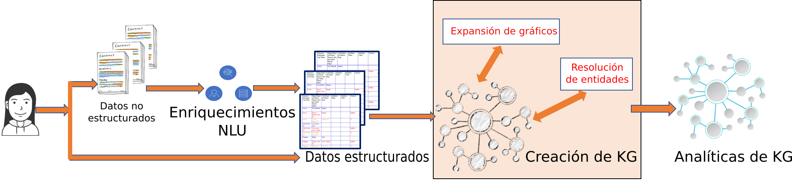

---

copyright:
  years: 2015, 2018
lastupdated: "2018-06-09"

subcollection: discovery

---

{:shortdesc: .shortdesc}
{:new_window: target="_blank"}
{:tip: .tip}
{:note: .note}
{:pre: .pre}
{:important: .important}
{:deprecated: .deprecated}
{:codeblock: .codeblock}
{:screen: .screen}
{:download: .download}
{:hide-dashboard: .hide-dashboard}
{:apikey: data-credential-placeholder='apikey'} 
{:url: data-credential-placeholder='url'}
{:curl: #curl .ph data-hd-programlang='curl'}
{:javascript: .ph data-hd-programlang='javascript'}
{:java: .ph data-hd-programlang='java'}
{:python: .ph data-hd-programlang='python'}
{:ruby: .ph data-hd-programlang='ruby'}
{:swift: .ph data-hd-programlang='swift'}
{:go: .ph data-hd-programlang='go'}

# Watson Discovery Knowledge Graph
{: #kg}

Los gráficos de conocimientos van más allá de la información y los datos creando conexiones dentro de los datos a través de documentos y generando nuevo conocimiento. IBM proporciona una tecnología de inteligencia artificial que de forma automática crea gráficos de conocimiento personalizados a partir de datos no estructurados extrayendo y desambiguando entidades y relaciones, enriqueciendo las relaciones con la ayuda de técnicas algorítmicas y clasificando los resultados utilizando algoritmos de relevancia. Los gráficos de conocimiento pueden funcionar como el "centro de conocimientos" de su empresa y se pueden utilizar para la búsqueda empresarial, para resumir información, para motores de recomendación y para otros procesos de toma de decisiones como, por ejemplo, la detección de fraudes, despilfarros o abusos. La utilización de un modelo personalizado (que se crea en {{site.data.keyword.knowledgestudioshort}}) en el proceso de creación de Knowledge Graph, puede ayudar a crear gráficos de conocimiento específicos de dominios que se pueden aplicar en dominios como, por ejemplo, el financiero, el tecnológico, el de la seguridad, el de la inteligencia o el de la salud, entre muchos otros. Consulte integrating-with-watson-knowledge-studio para obtener más información sobre la integración de {{site.data.keyword.discoveryshort}} con {{site.data.keyword.knowledgestudioshort}}.


Los dos puntos finales RESTful añadidos a {{site.data.keyword.discoveryfull}} proporcionan la capacidad de buscar entidades y relaciones enriquecidas y desambiguadas entre documentos en recopilaciones de documentos no estructuradas. Los resultados de la búsqueda se pueden clasificar según su relevancia o popularidad. Además para una señal de búsqueda, las API pueden utilizar pasajes o palabras de contexto opcionales que encuentran relaciones y entidades más relevantes dentro del amplio gráfico de conocimiento creado de forma automática.

 En la siguiente figura se muestra cómo Knowledge Graph se puede adecuar a su conducto actual de {{site.data.keyword.discoveryfull}}. Los enriquecimientos de {{site.data.keyword.nlushort}} utilizan un modelo de {{site.data.keyword.knowledgestudioshort}} personalizado (`en-news`) para extraer entidades y relaciones a nivel de documento individual. Durante la creación de Knowledge Graph, se utilizan técnicas de expansión de gráficos y resolución implícitas automáticas de entidades a través de los documentos. Además del gráfico de conocimiento que se creará, el servicio de analíticas de Knowledge Graph añade técnicas de clasificación de rangos por relevancia a los resultados devueltos.



Este gráfico conectado de técnicas de clasificación y conocimiento facilita los casos de uso siguientes:

-  Entidades desambiguadas utilizando una señal de búsqueda difusa, información de tipo (opcional) y contexto (opcional). Ejemplo: Buscando `Steve` en el contexto de `Apple` se devuelve `Steve Jobs` al principio de la búsqueda, mientras que al buscar `Steve` en el contexto de `Microsoft` se devuelve `Steve Ballmer` en primer lugar.
-  Relaciones clasificadas por su relevancia cuando se especifica una señal de búsqueda difusa y un contexto (opcional). La clasificación por relevancia utiliza las propiedades globales del gráfico para que aparezca información más específica. Ejemplo: Al buscar relaciones de `Obama` en el contexto de `health` devuelve `Affordable Care Act` y otras entidades relacionadas.
-  Inferencias y agregaciones en los documentos mediante la realización de consultas de entidades y relaciones en un gráfico conectado de conocimiento. Algunos ejemplos de tales consultas son: ¿Cómo está la persona X relacionada con la persona Y? ¿Cuál es la esfera de influencia de la persona X?

## Requisitos del servicio
{: #kg_servreq}

Durante el release beta, la funcionalidad Knowledge Graph y los métodos asociados a la misma solo están disponibles para instancias de servicio suscritas a los planes **Avanzado**, **Premium** y todos los entornos dedicados.

Actualmente, esta característica beta solo está soportada en inglés, consulte [Soporte de idiomas](/docs/services/discovery?topic=discovery-language-support#feature-support) para obtener detalles.

## Requisitos de recopilación
{: #kg_collreq}

{{site.data.keyword.discoveryshort}} utiliza entidades y relaciones extraídas de documentos ingeridos para crear el Knowledge Graph y permitir consultas de entidades y relaciones.

**Nota:** [Similaridad de entidad](/docs/services/discovery?topic=discovery-kg#kg_similarity), [Evidencia](/docs/services/discovery?topic=discovery-kg#kg_evidence) y la [Canonicalización y filtrado](/docs/services/discovery?topic=discovery-kg#kg_canonicalization) están disponibles en todas las colecciones. En las recopilaciones creadas antes del `03-05-2018`, debe volver a ingerir los documentos para utilizar estas características.

**Nota:** Knowledge Graph solo se puede utilizar en recopilaciones privadas, no ha sido diseñado para ser utilizado con {{site.data.keyword.discoverynewsshort}}.

Para utilizar Knowledge Graph, la recopilación se debe configurar para satisfacer los siguientes requisitos específicos:

-  Se deben especificar los enriquecimientos `entities` y `relations` para los campos que Knowledge Graph utilizará. Además, cada enriquecimiento debe utilizar el mismo modelo personalizado. Si se utiliza el modelo público (disponible sin utilizar {{site.data.keyword.knowledgestudioshort}}), será necesario especificarlo en forma de modelo personalizado `model="en-news"`.

-  Los enriquecimientos `relations` se deben especificar de la siguiente manera:
   ```json
   "relations": {
     "model": "en-news"
   }
   ```
   {: codeblock}

-  Se debe especificar el enriquecimiento `entities` y también se deben especificar los parámetros `mentions`, `mentions_types` y `sentence_locations`:
   ```json
   "entities": {
     "mentions": true,
     "mention_types": true,
     "sentence_locations": true,
     "model": "en-news"
    }
   ```
   {: codeblock}

   Si se desea, se pueden especificar otras opciones opcionales de `enrichments` como, por ejemplo, `"sentiment": true`. Se almacenarán en el índice de descubrimiento como enriquecimientos, pero no se utilizarán como nodos en el propio gráfico de conocimientos.

Estas opciones **no se pueden añadir** utilizando el conjunto de herramientas de {{site.data.keyword.discoveryshort}}; es necesario cargar una configuración personalizada mediante la API. [Aquí](https://raw.githubusercontent.com/watson-developer-cloud/doc-tutorial-downloads/master/discovery/config-default-kg.json) encontrará disponible una copia de la configuración predeterminada modificada para enriquecer el campo `text` para que se pueda utilizar la recopilación con un gráfico de conocimiento con el modelo público.

Cree una configuración personalizada como la siguiente, después de crear una instancia de servicio de {{site.data.keyword.discoveryshort}}:

1. Emita el siguiente mandato para crear un entorno denominado `my-first-environment`. Sustituya `{apikey_value}` por el valor de la clave de API del servicio:

   ```bash
   curl -X POST -u "apikey":"{apikey_value}" -H "Content-Type: application/json" -d '{ "name":"my-first-environment", "description":"exploring environments"}' "api/v1/environments?version=2017-11-07"
   ```
   {: pre}

   La API devuelve información como, por ejemplo, el ID de entorno, el estado del entorno y cuánto almacenamiento utiliza su entorno.

   Necesitará el `{environment_id}` que se devuelve; asegúrese de guardar el ID para utilizarlo posteriormente.

1. A continuación, cree una configuración personalizada. Este procedimiento supone que está cargando el que se encuentra
[aquí](https://raw.githubusercontent.com/watson-developer-cloud/doc-tutorial-downloads/master/discovery/config-default-kg.json). Si desea crear su propia configuración personalizada, consulte la [referencia de configuración](/docs/services/discovery?topic=discovery-configref#configref).

   ```bash
   curl -X POST -u "apikey":"{apikey_value}" -H "Content-Type: application/json" -d @config-default-kg.json "https://gateway.watsonplatform.net/discovery/api/v1/environments/{environment_id}/configurations?version=2017-11-07"
   ```
   {: pre}

   **Si ya dispone de una configuración personalizada y desea actualizar y utilizarla**, utilice {configuration ID} de la configuración personalizada de este mandato.

   ```bash
   curl -X PUT -u "apikey":"{apikey_value}" -H "Content-Type: application/json" -d @config-default-kg.json "https://gateway.watsonplatform.net/discovery/api/v1/environments/{environment_id}/configurations/{configuration ID}?version=2017-11-07"
   ```
   {: pre}

1. Después de que se haya cargado la configuración personalizada, está puede ser utilizada en cualquier recopilación que haya creado y método para cargar documentos siempre que se especifique dicha configuración personalizada. Si no está familiarizado con la creación de recopilaciones y la carga de documentos, consulte [Iniciación al conjunto de herramientas](/docs/services/discovery?topic=discovery-getting-started#getting-started). Cuando llegue al [paso 3](/docs/services/discovery?topic=discovery-getting-started#create-custom-configuration), seleccione `Configuración de Knowledge Graph` en lugar de crear una nueva configuración.

## Canonicalización y filtrado
{: #kg_canonicalization}

Todas las entidades de los documentos ingeridos a partir del `5 de marzo de 2018`, se normalizarán automáticamente con nombres canónicos de un diccionario público. Además, los pronombres incluidos en las entidades o relaciones como, por ejemplo, `he`, `she` o `they` o `it` se filtrarán automáticamente antes de la ingestión a Knowledge Graph. Los documentos ingeridos antes del 5 de marzo de 2018 no incluirán este nivel de canonicalización y filtrado; debería crear nuevas recopilaciones y volver a ingerir sus documentos para utilizar esta característica.

Al crear una consulta de entidades o relaciones en Knowledge Graph, puede especificar el nombre canónico o el texto original de la entidad en el campo `text` del método `query_entities` o `query_relations`.


## Consultas de entidades
{: #kg_entities}

El release beta de la consulta de entidades ofrece soporte a la entidad con base al contexto [disambiguation](/docs/services/discovery?topic=discovery-kg#kg_disambiguation) y a las consultas de [similarity](/docs/services/discovery?topic=discovery-kg#kg_similarity). Una consulta de entidades de Knowledge Graph se realiza con solicitudes `POST` a objetos `JSON` para el punto final `v1/environments/{environment_id}/collections/{collection_id}/query_entities`.

Se pueden consultar entidades con la API o con el conjunto de herramientas de {{site.data.keyword.discoveryshort}}. Consulte [Consultas de Knowledge Graph utilizando el conjunto de herramientas de Discovery](/docs/services/discovery?topic=discovery-kg#querying-kg) para obtener información sobre el conjunto de herramientas.

El objeto JSON de consulta de entidades de Knowledge Graph sigue el siguiente formato:

```json
{
  "feature": "disambiguate",
  "entity": {
    "text": "Steve",
    "type": "Person",
    "exact": "false"
  },
  "context": {
    "text": "iphone"
  },
  "count": 10,
  "evidence_count": 0
}
```
{: codeblock}

-  `"feature": string` _required_ - the entity query feature to be used. Las características soportadas son: [disambiguate](/docs/services/discovery?topic=discovery-kg#kg_disambiguation) y [similar_entities](/docs/services/discovery?topic=discovery-kg#kg_similarity).
-  `"entity": {}` _obligatorio_ - un objeto que contiene información de la entidad a desambiguar.
   -  `"text": string` _obligatorio_ - el texto de la entidad que se desambiguará
   -  `"type": string` _opcional_ - el tipo de la entidad opcional que se utilizará para la desambiguación, si no se especifica, se incluyen todos los tipos.
   -  `"exact": boolean` _opcional_ - Si es `false`, se realiza una desambiguación implícita. La desambiguación implícita utilizará la primera entidad desambiguada para cada objeto de entidad de entrada. Se debe establecer en `false` para `"feature": "disambiguate"`. El valor predeterminado es `false`.
-  `"context": {}` _opcional_ - un objeto opcional que incluye requisitos contextuales para la desambiguación.
   -  `"text": string` _opcional_ - Texto de entidad para proporcionar contexto para la clasificación y entidades consultadas basadas en dicha asociación. Por ejemplo, si desea consultar la ciudad de London en England, su consulta buscaría `London` con el contexto de `England`. La entrada puede corresponder a nombres parciales o pasajes extensos con términos de entidad relevantes. Se pueden pasar varios términos a la vez.
-  `"count": INT` _opcional_ - El número de entidades desambiguadas a devolver. El valor predeterminado es de `10`. El máximo es de `1000`
-  `"evidence_count": INT` _optional_ El número de instancias de evidencia que deben volver en cada entidad identificada. El valor predeterminado es `0`. El valor máximo del campo `evidence_count` es 10.000 dividido entre el número especificado en el campo `count`. Consulte la sección [Pruebas](/docs/services/discovery?topic=discovery-kg#kg_evidence) de esta página para obtener una descripción detallada y ejemplos.

La consulta devuelve los resultados en el siguiente formato:

```json
{
  "entities": [
    {
      "text": "Steve Jobs",
      "type": "PERSON"
    },
    {
      "text": "Steve Wozniak",
      "type": "PERSON"
    }
  ]
}
```
{: codeblock}

Si no se encuentra ninguna coincidencia, se devuelve el siguiente objeto JSON:

```json
{
  "entities": []
}
```
{: codeblock}

### Desambiguación de entidades
{: #kg_disambiguation}

La consulta de entidades de Knowledge Graph proporciona una desambiguación de entidades basada en el contexto. Con base en el texto de entidad proporcionado y al texto de contexto opcional, `disambiguation` identifica entidades únicas y devuelve una lista de entidades clasificadas con base a la información de contexto.

Una desambiguación de entidades se solicita especificando `"disambiguation"`como el valor del campo `"feature" :` en el objeto de consulta de Knowledge Graph.

Por ejemplo, desambiguar el texto de la entidad `Steve` en el contexto de `iphone` podría provocar la devolución de `Steve Jobs` y `Steve Wozniak`.


### Similitud de entidades
{: #kg_similarity}

La consulta de entidades de Knowledge Graph proporciona una detección de similitudes de entidades basadas en el contexto. Con base en el texto de entidad proporcionado y al texto de contexto opcional, `similar_entities` identifica entidades únicas y devuelve una lista de entidades clasificadas con base a la información de contexto.

Una similitud de entidades se solicita especificando `"similar_entities"` como el valor del campo `"feature" :` en el objeto de consulta de Knowledge Graph.

Por ejemplo, si ha buscado entidades similares a `Ford` en el contexto `car`, los resultados de entidades similares podrían incluir `GM`, `Toyota` y `Nissan`.

## Consultas de relaciones
{: #kg_relations}

Las consultas de relaciones de Knowledge Graph dan soporte a la búsqueda de las relaciones más relevantes con base a una entrada formada por entidades utilizando desambiguación de entidades implícita, relaciones basadas en el contexto, clasificación por puntuación de relevancia y recuento de menciones y por creación de filtros de ID de documento y tipos.

Se pueden consultar relaciones con la API o con el conjunto de herramientas de {{site.data.keyword.discoveryshort}}. Consulte [Consultas de Knowledge Graph utilizando el conjunto de herramientas de Discovery](/docs/services/discovery?topic=discovery-kg#querying-kg) para obtener información sobre el conjunto de herramientas.

Una consulta de entidades de Knowledge Graph se realiza con solicitudes `POST` a objetos `JSON` para el punto final `v1/environments/{environment_id}/collections/{collection_id}/query_relations`. El objeto JSON de consulta de relaciones de Knowledge Graph sigue el siguiente formato:

```json
{
  "entities": [
    {
      "text": "Steve Jobs",
      "type": "PERSON",
      "exact": true
    }
  ],
  "context": {
    "text": "iphone"
  },
  "sort": "score",
  "filter": {
    "relation_types": {
      "exclude": ["colocation"],
      "include": ["locatedAt", "employedBy", "managerOf", "founderOf"]
    },
    "entity_types": {
      "exclude": ["EVENT"],
      "include": ["PERSON", "GPE", "ORGANIZATION"]
    },
    "document_ids": ["b95df4c1-d00f-4771-abb2-a52baea0444a", "ad340635-bf3e-47a5-bea5-5e778f600c32"]
  },
  "count": 10,
  "evidence_count": 0
}
```
{: codeblock}

-  `"entities": []` _obligatorio_ - una matriz que contiene las entidades que consultarán las relaciones. Se devuelven todas las relaciones vecinas si solo se define un objeto de entidad. Cuando se define más de un objeto de entidad, se devuelven relaciones emparejadas mutuas. Las relaciones emparejadas mutuas devuelven las relaciones directas entre las entidades de entrada en lugar de las relaciones con todos los vecinos de entidad. Cada objeto de entidad contiene:
   -  `"text": string` _obligatorio_ - el texto de entidad.
   -  `"type": string` _opcional_ - el tipo de entidad opcional. Este campo es obligatorio si `"exact"` es `true`.
   -  `"exact": boolean` _opcional_ - Si es `false`, se realiza una desambiguación implícita. La desambiguación implícita utilizará la primera entidad desambiguada para cada objeto de entidad de entrada. El valor predeterminado es `false`.
-  `"context": {}` _opcional_ - un objeto opcional que incluye requisitos contextuales.
   -  `"text": string` _opcional_ - Texto de entidad para proporcionar contexto para la clasificación y entidades consultadas basadas en dicha asociación. Por ejemplo, si desea consultar la ciudad de London en England, su consulta buscaría `London` con el contexto de `England`. La entrada puede corresponder a nombres parciales o pasajes extensos con términos de entidad relevantes. Se pueden pasar varios términos a la vez.
-  `"sort": string` _opcional_ - método de clasificación para las relaciones. Puede ser `score` o `frequency`. El valor predeterminado es `score`. `score` se basa en la relevancia de las relaciones y los vecinos para la entidad de entrada y la relevancia para el contexto (si se proporciona uno). `frequency` es el número de veces únicas que se identifica cada relación.
-  `"filter": {}` _opcional_ - un objeto que contiene tipos de relación, tipos de entidad y documentos específicos por los que filtrar la consulta. De forma predeterminada, no se excluye nada.
   -  `"relation_types": {}` _opcional_ una lista de tipos de relación por los que filtrar.
      -  `"exclude": []` _opcional_ una lista separada por comas de tipos de relación a excluir de la consulta.
      -  `"include": []` _opcional_ una lista separada por comas de tipos de relación a incluir de forma explícita en la consulta. Si se especifica, se consideran excluidos todos los otros tipos.
   -  `"entity_types": {}` _opcional_ una lista de tipos de entidad para filtrar vecinos. No se aplica cuando la entrada contiene varias entidades porque no se devuelve ningún nuevo vecino.
      -  `"exclude": []` _opcional_ una lista separada por comas de tipos de entidad a excluir de la consulta.
      -  `"include": []` _opcional_ una lista separada por comas de tipos de entidad a incluir de forma explícita en la consulta. Si se especifica, se consideran excluidos todos los otros tipos.
   -  `"document_ids": []` _opcional_ una lista separada por comas de documentos en los que realizar la consulta de relaciones.
-  `"count": INT` _opcional_ El número de relaciones a devolver. El valor predeterminado es de `10`. El máximo es de `1000`.
-  `"evidence_count": INT` _optional_ El número de instancias de evidencia que deben volver en cada relación identificada. El valor predeterminado es `0`. El valor máximo del campo `evidence_count` es 10.000 dividido entre el número especificado en el campo `count`. Consulte la sección [Pruebas](/docs/services/discovery?topic=discovery-kg#kg_evidence) de esta página para obtener una descripción detallada y ejemplos.

La consulta devuelve los resultados en el siguiente formato:

```json
{
  "relations": [
    {
      "type": "FOUNDEROF",
      "frequency": 7,
      "arguments": [
        {
          "entities": [
            {
              "type": "PERSON",
              "text": "Steve Jobs"
            }
          ]
        },
        {
          "entities": [
            {
              "type": "ORGANIZATION",
              "text": "Apple"
            }
          ]
        }
      ]
    }
  ]
}
```
{: codeblock}

En cada objeto en la matriz de relaciones, se devuelve una matriz de argumentos con un par de matrices de entidades, la primera como origen o sujeto y la segunda como destino u objeto de la relación.

Si no se encuentra ninguna coincidencia, se devuelve el siguiente objeto JSON:

```json
{
  "relations": []
}
```
{: codeblock}

## Pruebas
{: #kg_evidence}

En algunas consultas de entidad o relación puede ser útil comprender dónde se han identificado las conexiones. Las pruebas de las conexiones le permiten hacer referencia al documento original, clarificar los resultados o desambiguar según proceda. A partir de las recopilaciones creadas el 03-05-2018, los puntos finales `query_entities` y `query_relations` tienen la opción de proporcionar pruebas en los resultados devueltos. Esta función está disponible para las recopilaciones creadas antes del 03-05-2018, pero los documentos se tendrán que volver a ingerir para utilizar esta función en las recopilaciones más antiguas.

Las pruebas se devuelven añadiendo el campo `"evidence_count": INT` al objeto de consulta. Este número representa el número de elementos de prueba que se devolverán por elemento de respuesta. Por ejemplo, si especifica un número `"count":` de `5` elementos de respuesta y `"evidence_count": 2`, la respuesta contendría un total de `10` elementos de prueba (2 por respuesta).  El número máximo de elementos de prueba que se devuelve en total para una única consulta es 10.000.

En las respuestas `query_entities`, cada objeto de la matriz `entities` contendrá el número especificado de objetos `evidence`. Estos objetos incluyen el `document_id` del documento en el que se ha encontrado la prueba, el campo (`field`) en el que se ubicó, la ubicación de la prueba dentro de ese campo y la ubicación exacta de la entidad identificada.

```json
    {
      "text": "Steve Jobs",
      "type": "Person",
      "evidence": [
        {
          "document_id": "cb77ce6b-bb93-42a0-8643-dfb523e14da8",
          "field": "description",
          "start_offset": 305,
          "end_offset": 392,
          "entities": [
            {
              "type": "Person",
              "text": "Steve Jobs",
              "start_offset": 311,
              "end_offset": 321
            }
          ]
        }
      ]
    }

```
{: codeblock}

En `query_relations` cada objeto de la matriz `relations` contendrá el número especificado de objetos `evidence`. Las pruebas `evidence` devueltas se estructuran de la misma manera que en `query_relations` con las ubicaciones de todas las entidades relacionadas especificadas:

```json
    {
      "type": "founderOf",
      "frequency": 7,
      "arguments": [
        {
          "entities": [
            {
              "type": "Person",
              "text": "Steve Jobs"
            }
          ]
        },
        {
          "entities": [
            {
              "type": "Organization",
              "text": "Apple"
            }
          ]
        }
      ],
      "evidence": [
        {
          "document_id": "b95df4c1-d00f-4771-abb2-a52baea0444a",
          "field": "text",
          "start_offset": 243,
          "end_offset": 303,
          "entities": [
            {
              "type": "Organization",
              "text": "Apple",
              "start_offset": 293,
              "end_offset": 298
            },
            {
              "type": "Person",
              "text": "Steve Jobs",
              "start_offset": 243,
              "end_offset": 253
            }
          ]
        }
      ]
    }
```
{: codeblock}

## Consultas de Knowledge Graph utilizando el conjunto de herramientas de Discovery
{: #querying-kg}

Aquellas con instancias de servicio suscritas al plan [**Avanzado**](/docs/services/discovery?topic=discovery-kg#kg_servreq) pueden consultar recopilaciones privadas con Knowledge Graph utilizando el conjunto de herramientas de {{site.data.keyword.discoveryshort}}.  

Para acceder a las consultas de Knowledge Graph en el conjunto de herramientas de {{site.data.keyword.discoveryshort}}:

1.  Pulse <!-- {width="20" height="20" style="padding-left:5px;padding-right:5px;"} --> para abrir la página de consultas.
1.  Seleccione su recopilación y pulse **Iniciación**.
1.  En la pantalla **Crear consultas**, elija el separador **Knowledge Graph** y, a continuación, **Entidades** o **Relaciones**.

**Nota:** No todas las características de Knowledge Graph están disponibles al utilizar el conjunto de herramientas de {{site.data.keyword.discoveryshort}}.
