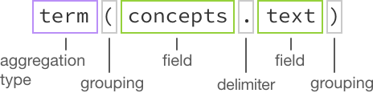

---

copyright:
  years: 2015, 2017
lastupdated: "2017-08-31"

---

{:shortdesc: .shortdesc}
{:new_window: target="_blank"}
{:tip: .tip}
{:pre: .pre}
{:codeblock: .codeblock}
{:screen: .screen}
{:javascript: .ph data-hd-programlang='javascript'}
{:java: .ph data-hd-programlang='java'}
{:python: .ph data-hd-programlang='python'}
{:swift: .ph data-hd-programlang='swift'}

# Archivos de Discovery

Este tema contiene información sobre características de {{site.data.keyword.discoveryshort}} que todavía podría estar disponibles, pero que han sido reemplazadas con nuevas opciones.
{: tip}

## Enriquecimientos de AlchemyLanguage
{: #AlchemyLanguage-enrichments}

Desde el **18 de julio del 2017** {{site.data.keyword.discoveryfull}} introdujo una nueva tecnología de enriquecimiento, denominado el NLU ({{site.data.keyword.nlushort}}). Estos enriquecimientos son los mismos que los enriquecimientos existentes pero requieren una configuración y un esquema ligeramente diferente. Los enriquecimientos originales, denominados enriquecimientos de {{site.data.keyword.alchemylanguageshort}}, pasarán a estar en desuso el **15 de enero de 2018**.


La serie de versión de API `2017-10-16` está en desuso para dar soporte a la carga de nuevos documentos en recopilaciones existentes enriquecidas con {{site.data.keyword.alchemylanguageshort}} y para crear nuevas recopilaciones y enriquecerlas con los enriquecimientos de {{site.data.keyword.alchemylanguageshort}}. Utilice una serie de versión de API anterior para continuar utilizando {{site.data.keyword.alchemylanguageshort}} hasta que el soporte finalice el **15 de enero de 2018**.

Las recopilaciones existentes enriquecidas con AlchemyLanguage se deberían migrar a enriquecimientos de NLU (Natural Language Understanding) tan pronto como sea posible. Para obtener información sobre la migración de recopilaciones y de archivos de configuración que utilizan los enriquecimientos de {{site.data.keyword.alchemylanguageshort}}, consulte [Migración de enriquecimientos a {{site.data.keyword.nlushort}}](/docs/services/discovery/migrate-nlu.html). 

**Nota:** El conjunto de herramientas de {{site.data.keyword.discoveryshort}} siempre utiliza la serie de versión de API más reciente, por lo que empezando a partir de la serie de versión de API `2017-10-16`, no podrá cargar documentos en recopilaciones existentes de {{site.data.keyword.alchemylanguageshort}} ni crear nuevas recopilaciones enriquecidas con enriquecimientos de {{site.data.keyword.alchemylanguageshort}} con el conjunto de herramientas de {{site.data.keyword.discoveryshort}}. Si desea continuar utilizando el conjunto de herramientas de Discovery para el enriquecimiento de recopilaciones, migre primero dichas recopilaciones a NLU (Natural Language Understanding). Consulte [Migración de enriquecimientos a {{site.data.keyword.nlushort}}](/docs/services/discovery/migrate-nlu.html) para obtener más detalles. 

### Extracción de entidades (AlchemyLanguage)
{: #entity-extraction-al}

Obtenga como resultados elementos como, por ejemplo, personas, lugares y organizaciones que estén presentes en el texto de entrada. La extracción de entidades añade conocimiento semántico al contenido para ayudarle a comprender el tema y el contexto del texto que se está analizando. Las técnicas de extracción de entidades se basan en sofisticados algoritmos estadísticos y en tecnología de proceso de lenguaje natural, y son exclusivos en la industria con su soporte para el análisis multilingüe, desambiguación sensible al contexto y extracción de citas. 

Ejemplo de un fragmento de un documento enriquecido con la Extracción de entidades:  

```json
{
      "text": "The stockholders were pleased that Acme Corporation plans to build a new factory in Atlanta, Georgia.",
      "enriched-text": {
        "status": "OK",
        "language": "english",
        "entities": [
          {
            "type": "City",
            "relevance": 0.532754,
            "sentiment": {
              "type": "positive",
              "score": 0.527541,
              "mixed": false
            },
            "count": 1,
            "text": "Atlanta",
            "disambiguated": {
              "subType": [
                "AdministrativeDivision",
                "GovernmentalJurisdiction",
                "OlympicHostCity",
                "PlaceWithNeighborhoods"
              ],
              "name": "Atlanta",
              "website": "http://www.atlantaga.gov/",
              "dbpedia": "http://dbpedia.org/resource/Atlanta",
              "freebase": "http://rdf.freebase.com/ns/m.013yq"
            }
          }
        ]
      }
    }
```
{: codeblock}
En el ejemplo anterior, puede consultar el tipo de entidad accediendo a `enriched_text.entities.type`.  `sentiment` se calcula para los tipos de entidad incluso si no se selecciona el enriquecimiento **sentiment**. Para obtener más información sobre la puntuación del sentimiento, consulte el [Análisis del sentimiento](/docs/services/discovery/discovery-auxiliary.html#sentiment-analysis-al). 

La puntuación de `relevance` variará entre `0.0` y `1.0`. Cuanto mayor es la puntuación, mayor es la relevancia de la entidad. El campo `disambiguated` contiene la información de desambiguación para la entidad, que incluye información de la entidad `subType` y enlaces a los recursos (si hay). `count` corresponde al número de veces que se menciona la entidad en el documento. 

### Extracción de palabras clave (AlchemyLanguage)
{: #keyword-extraction-al}

Los temas importantes de su contenido habitualmente se utilizan al indexar datos, generar nubes de etiquetas o al realizar búsquedas. El servicio {{site.data.keyword.discoveryshort}} automáticamente identifica los idiomas soportados en el contenido de entrada, y luego identifica y clasifica las palabras en ese contenido. 

Ejemplo de un fragmento de un documento enriquecido con la Extracción de palabras clave: 

```json
{
    "text": "The stockholders were pleased that Acme Corporation plans to build a new factory in Atlanta, Georgia.",
    "enriched-text": {
        "status": "OK",
        "language": "english",
        "keywords": [
          {
            "relevance": 0.66497,
            "sentiment": {
              "score": 0.527541,
              "type": "positive",
              "mixed": false
            },
            "text": "stockholders"
          }
        ]
      }
    }
```
{: codeblock}

En el ejemplo anterior, podría consultar el texto de las palabras claves accediendo a `enriched_text.keywords.text`.  

`sentiment` se calcula para las palabras clave incluso si no se selecciona el enriquecimiento **sentiment**. Para obtener más información sobre la puntuación del sentimiento, consulte el [Análisis del sentimiento](/docs/services/discovery/discovery-auxiliary.html#sentiment-analysis-al). 

La puntuación de `relevance` variará entre `0.0` y `1.0`. Cuanto mayor es la puntuación, mayor es la relevancia de la palabra clave. 

### Clasificación de taxonomías (AlchemyLanguage)
{: #taxonomy-classification-al}

Clasifica según categorías el texto de entrada, HTML o contenido basado en una taxonomía jerárquica de hasta cinco niveles de profundidad. Niveles más profundos permiten clasificar el contenido en subsegmentos más precisos y útiles. 

Ejemplo de un fragmento de un documento enriquecido con la Clasificación de taxonomías: 

```json
  {
    "text": "The stockholders were pleased that Acme Corporation plans to build a new factory in Atlanta, Georgia.",
    "enriched-text": {
        "status": "OK",
        "language": "english",
        "taxonomy": [
          {
            "label": "/business and industrial/company/merger and acquisition",
            "score": 0.517533,
            "confident": false
          }
        ]
      }
    }
```
{: codeblock}

En el ejemplo anterior, podría consultar la etiqueta de taxonomía accediendo a `enriched_text.taxonomy.label`. 

`label` corresponde a la categoría de taxonomía detectada. Los niveles de jerarquía se separan con barras inclinadas. `score` para la categoría estará en el rango de `0.0` a `1.0`. Cuanto mayor es la puntuación, mayor es la confianza en dicha categoría. 

### Etiquetado de conceptos (AlchemyLanguage)
{: #concept-tagging-al}

Identifica los conceptos con los que el texto de entrada está asociado, basándose en otros conceptos y entidades que están presentes en ese texto. El etiquetado de conceptos entiende cómo se relacionan los conceptos y es capaz de identificar conceptos a los que el texto no hace referencia. Por ejemplo, si un artículo menciona el "CERN" e "Higgs boson", las funciones de la Concepts API identificarán el concepto "Large Hadron Collider", incluso si dicho término no está mencionado de forma explícita en la página. El etiquetado de conceptos permite un mayor nivel de análisis de contenido de entrada que la simple identificación de palabras claves. 

Ejemplo de un fragmento de un documento enriquecido con el Etiquetado de conceptos: 

```json
{
    "text": "The stockholders were pleased that Acme Corporation plans to build a new factory in Atlanta, Georgia.",
    "enriched_text": {
        "status": "OK",
        "language": "english",
        "concepts": [
          {
            "text": "Acme Corporation",
            "relevance": 0.91136,
            "dbpedia": "http://dbpedia.org/resource/Acme_Corporation",
            "freebase": "http://rdf.freebase.com/ns/m.0dndy",
            "yago": "http://yago-knowledge.org/resource/Acme_Corporation"
          }
        ]
      }
    }
```
{: codeblock}

En el ejemplo anterior, puede consultar el tipo del texto del concepto accediendo a `enriched_text.concepts.text`

La puntuación de `relevance` variará entre `0.0` y `1.0`. Cuanto mayor es la puntuación, mayor es la relevancia del concepto. Si existen, se proporcionan enlaces a los recursos. 

### Extracción de relaciones (AlchemyLanguage)
{: #relation-extraction-al}

Identifica las relaciones de sujeto, acción y objeto en el contenido de entrada. La información de relación sirve para identificar automáticamente las señales de compra, sucesos clave y otras acciones importantes. 

Ejemplo de un fragmento de un documento enriquecido con la Extracción de relaciones: 

```json
{
      "text": "The stockholders were pleased that Acme Corporation plans to build a new factory in Atlanta, Georgia.",
      "enriched-text": {
        "status": "OK",
        "language": "english",
        "relations": [
          {
            "sentence": " The stockholders were pleased that Acme Corporation plans to build a new factory in Atlanta, GA.",
            "subject": {
              "text": "The stockholders",
              "keywords": [
                {
                  "text": "stockholders"
                }
              ]
            },
            "action": {
              "text": "were",
              "lemmatized": "be",
              "verb": {
              "text": "be",
              "tense": "past"
            }
            },
            "object": {
              "text": "pleased that Acme Corporation plans to build a new factory in Atlanta, GA",
              "sentiment": {
                "type": "positive",
                "score": 0.834516,
                "mixed": false
              },
              "entities": [
                {
                  "type": "Company",
                  "text": "Acme Corporation"
                },
                {
                  "type": "City",
                  "text": "Atlanta",
                  "disambiguated": {
                    "subType": [
                      "AdministrativeDivision",
                      "GovernmentalJurisdiction",
                      "OlympicHostCity",
                      "PlaceWithNeighborhoods"
                    ],
                    "name": "Atlanta",
                    "website": "http://www.atlantaga.gov/",
                    "dbpedia": "http://dbpedia.org/resource/Atlanta",
                    "freebase": "http://rdf.freebase.com/ns/m.013yq"
                  }
                },
                {
                  "type": "StateOrCounty",
                  "text": "GA"
                }
              ],
              "keywords": [
                {
                  "text": "Acme Corporation"
                },
                {
                  "text": "new factory"
                },
                {
                  "text": "GA"
                },
                {
                "text": "Atlanta"
                }
              ]
            }
          }
        ]
      }
    }
```
{: codeblock}

En el ejemplo anterior, podría consultar el texto del sujeto de la relación accediendo a `enriched_text.relations.subject.text`. 

`sentiment` se calcula para las relaciones clave incluso si no se selecciona el enriquecimiento **sentiment**. Para obtener más información sobre la puntuación del sentimiento, consulte el [Análisis del sentimiento](/docs/services/discovery/discovery-auxiliary.html#sentiment-analysis-al). No extraerá `entities` o `keywords` (tal como se muestra en el ejemplo) a no ser que seleccione los enriquecimientos **entity** y **keyword**. Consulte [Extracción de entidades](/docs/services/discovery/discovery-auxiliary.html#entity-extraction-al) y [Extracción de palabras clave](/docs/services/discovery/discovery-auxiliary.html#keyword-extraction-al) para obtener más información sobre dichos enriquecimientos. 

Las etiquetas `subject`, `action` y `object` se extraen de cada frase que contiene una relación. 

### Análisis de sentimiento (AlchemyLanguage)
{: #sentiment-analysis-al}

Identifica la actitud, las opiniones o los sentimientos en el contenido que se está analizando. El servicio {{site.data.keyword.discoveryshort}} calcula un sentimiento global dentro de un documento, el sentimiento para elementos especificados por el usuario, sentimiento a nivel de entidad, sentimiento a nivel de cita, sentimiento bidireccional y sentimiento a nivel de palabras claves. La combinación de estas funciones da soporte a una variedad de casos de uso que van desde la supervisión de medios sociales al análisis de tendencias.

Ejemplo de un fragmento de un documento enriquecido con el Análisis de sentimiento: 

```json
{
      "text": "The stockholders were pleased that Acme Corporation plans to build a new factory in Atlanta, Georgia.",
      "enriched_text": {
        "status": "OK",
        "language": "english",
        "docSentiment": {
          "type": "positive",
          "score": 0.0966252,
          "mixed": true
        }
      }
    }
```
{: codeblock}

En el ejemplo precedente, podría consultar el tipo de docSentiment accediendo a `enriched_text.docSentiment.type`

`type` corresponde al sentimiento general del documento (`positive`, `negative` o `neutral`). 
El sentimiento `type` se basa en `score`. Una puntuación de `0.0` indicaría que el documento es `neutral`, un valor positivo indicaría que el documento es `positive`, y un número negativo indicaría que el documento es `negative`. Si `mixed` es `true`, indica que el documento incluye tanto sentimientos positivos como negativos (la `score` no determina este campo). 

### Análisis de emociones (AlchemyLanguage)
{: #emotion-analysis-al}

Detecta el enfado (anger), el disgusto (disgust), el miedo (fear), la alegría (joy) o la tristeza (sadness) que implícita el texto en inglés. El Análisis de emociones puede detectar emociones que se asocian con frases concretas, entidades, palabras claves o puede analizar el tono emocional global del contenido. 

Ejemplo de un fragmento de un documento enriquecido con el Análisis emocional: 

```json
{
      "text": "The stockholders were pleased that Acme Corporation plans to build a new factory in Atlanta, Georgia.",
      "enriched_text": {
        "status": "OK",
        "language": "english",
        "docEmotions": {
          "anger": "0.077394",
          "disgust": "0.044024",
          "fear": "0.092664",
          "joy": "0.553327",
          "sadness": "0.3969"
        }
      }
    }
```
{: codeblock}

En el ejemplo precedente, podría consultar la docEmotion `joy` (alegría) accediendo a `enriched_text.docEmotions.joy`. 

El Análisis de emociones analiza el texto y calcula una puntuación para cada emoción (anger, disgust, fear, joy, sadness) en una escala del `0.0` al `1.0`. Si la puntuación de cualquier emoción es `0.5` o superior, indica que se ha detectado la emoción (y cuanto más se encuentre por encima de `0.5`, mayor será su relevancia). En el fragmento que se muestra, `joy` tiene una puntuación por encima de 0,5, lo que indica que {{site.data.keyword.watson}} ha detectado alegría. 


## Watson Discovery News Original

El **31 de julio de 2017** se introdujo la nueva versión de {{site.data.keyword.discoverynewsfull}}. {{site.data.keyword.discoverynewsfull}} Original se retiró con una fecha de eliminación del servicio del **15 de enero de 2018**. Consulte [Watson Discovery News](watson-discovery-news.html) para obtener información sobre esta nueva versión. 

{{site.data.keyword.discoverynewsfull}} Original es primordialmente conjunto de datos de orígenes de noticias en inglés que se actualiza de forma continua, con aproximadamente 300.000 nuevos artículos y blogs que se añaden diariamente. Este conjunto de datos indexado se enriquece de forma previa con los siguientes enriquecimientos de {{site.data.keyword.alchemylanguageshort}}: **Extracción de palabras clave**, **Extracción de entidades**, **Etiquetado de conceptos**, **Extracción de relaciones**, **Análisis de sentimiento** y **Clasificación de taxonomías**. También se han añadido los siguientes metadatos adicionales: fecha de rastreo, fecha de publicación, clasificación de URL, clasificación de host y texto de ancla. La búsqueda histórica está disponible para los últimos 60 días de datos de noticias. 

{{site.data.keyword.discoverynewsfull}} Original está enriquecido con los enriquecimientos de {{site.data.keyword.alchemylanguageshort}}. Para obtener más información sobre estos enriquecimientos, consulte [Enriquecimientos de {{site.data.keyword.alchemylanguageshort}}](discovery-auxiliary.html#AlchemyLanguage-enrichments). 

### Consultas de Watson Discovery News Original

El **31 de julio de 2017** se introdujo la nueva versión de {{site.data.keyword.discoverynewsfull}}. {{site.data.keyword.discoverynewsfull}} Original se retiró con una fecha de eliminación del servicio del **15 de enero de 2018**. Consulte [Watson Discovery News](watson-discovery-news.html) para obtener información sobre esta nueva versión. 

**Nota:** El número máximo de resultados devueltos a una consulta de Watson Discovery es de `50`. Utilice consultas adicionales y el parámetro `offset` para obtener más de `50` resultados.

{{site.data.keyword.discoverynewsfull}} Original utiliza un esquema JSON similar, con algunas pequeñas diferencias, respecto al esquema utilizado para las recopilaciones privadas. Por ejemplo, no es necesario incluir `enriched_text` en las consultas: 

**Como estructurar una consulta de {{site.data.keyword.discoverynewsfull}} Original**


La siguiente consulta de ejemplo devuelve los 10 artículos principales en {{site.data.keyword.discoverynewsfull}} Original sobre el equipo Pittsburgh Steelers con un sentimiento positivo. 

1.  En la pantalla **Gestionar datos**, elija la recopilación {{site.data.keyword.discoverynewsfull}}. 
1.  Pulse **Ver esquema de datos** y, a continuación, **Crear consultas**.  
1.  Bajo **Buscar documentos**, pulse **Utilizar {{site.data.keyword.discoveryshort}} Query Language** y, a continuación, `text:Pittsburgh Steelers, docSentiment.type:positive` en el campo **Especifique aquí una consulta**. 
1.  Pulse **Más opciones** y, a continuación, especifique `10` (se trata del valor predeterminado) en el campo `Número de documentos a devolver`. 
1.  Pulse **Ejecutar consulta**. Se visualizarán los 10 artículos principales sobre el equipo Pittsburgh Steelers con un sentimiento positivo. 

**Consultas de {{site.data.keyword.discoverynewsfull}} Original de ejemplo adicionales**

-  `concepts.text:"Health care"` - Bajo **Buscar documentos**, pulse **Utilizar {{site.data.keyword.discoveryshort}} Query Language** y, a continuación, especifique esta consulta. Devolverá todos los artículos que incluyen el concepto de `health care`. Si especifica un recuento, por ejemplo 50 en el campo **Número de documentos a devolver** solo recibirá los 50 artículos más relevantes. 

**Cómo estructurar una agregación de {{site.data.keyword.discoverynewsfull}} Original**



La siguiente agregación de ejemplo devuelve el número de artículos encontrados en {{site.data.keyword.discoverynewsfull}} Original sobre el equipo Pittsburgh Steelers según el sentimiento. 

1.  En la pantalla **Gestionar datos**, elija la recopilación {{site.data.keyword.discoverynewsfull}} Original. 
1.  Pulse **Ver esquema de datos** y, a continuación, **Crear consultas**.  
1.  Bajo **Incluir análisis de los resultados**, especifique `filter(text:"Pittsburgh Steelers").term(docSentiment.type,count:3)` en el campo **Escribir consulta de agregación utilizando {{site.data.keyword.discoveryshort}} Query Language**. 
1.  Pulse **Más opciones** y, a continuación, especifique `0` en el campo **Número de documentos a devolver**. 
1.  Pulse **Ejecutar consulta**. Los resultados muestran el número de documentos sobre los Pittsburgh Steelers y cuántos de estos resultados tienen un docSentiment `positive`, `negative` o `neutral`. 

**Agregación de {{site.data.keyword.discoverynewsfull}} Original de ejemplo adicional**

-  `filter(entities.text:twitter).term(docSentiment.type,count:3)` - Si especificó esta consulta de agregación en el campo **Escribir una consulta de agregación utilizando {{site.data.keyword.discoveryshort}} Query Language**, primero reducirá (filtrará) el conjunto de artículos a únicamente aquellos que incluyen el texto de entidades de Twitter y, a continuación dividirá dichos artículos por los tipos de sentimiento de documento. Solo se devolverán los primeros tres documentos con tipos de sentimiento (`positive`, `negative`, `neutral`). 

Si se añade `nested` antes de una consulta de agregación se restringe dicha agregación al área de los resultados especificados. Por ejemplo: `nested(text.entities)` significa que solo los componentes `text.entities` de cualquier resultado se utilizan para agregar. Este efecto se puede ver con facilidad inspeccionando las diferencias entre las siguientes dos consultas: `filter(text.entities.type::City)` - la agregación cuenta el número de *Resultados* que contienen una o varias `entity` con el tipo `City` y `nested(text.entities).filter(text.entities.type::City)` - la agregación cuenta el número de instancia de una `entity` con el tipo `City` en los resultados. Además, cualquier operación posterior restringirá aún más el conjunto de resultados por el que se puede agregar. Por ejemplo, `nested(text.entities).filter(text.entities.type::City)` significa que solo se agregarán entidades del tipo City (`type::City`). Por ejemplo: `nested(text.entities).filter(text.entities.type::City).term(text.entities.text,count:3)` agregará las tres entidades principales del tipo `City`, mientras que: `filter(text.entities.type::City).term(text.entities.text,count:3)` devolverá las tres entidades principales mientras el resultado contenga al menos una entidad del tipo `City`. 

**Nota**: No es posible entrenar o añadir documentos a la recopilación {{site.data.keyword.discoverynewsfull}} Original ni ajustar su configuración.    

## Integración con Watson Knowledge Studio utilizando los enriquecimientos de AlchemyLanguage

Puede integrar un modelo personalizado de {{site.data.keyword.knowledgestudiofull}} con el servicio {{site.data.keyword.discoveryshort}} para proporcionar enriquecimientos personalizados.
{: shortdesc}

### Antes de empezar

Antes de poder integrar un modelo personalizado de {{site.data.keyword.knowledgestudioshort}} con el servicio {{site.data.keyword.discoveryshort}}, debe crear y desplegar el modelo utilizando {{site.data.keyword.knowledgestudioshort}}. Consulte la documentación de {{site.data.keyword.knowledgestudioshort}} para obtener información sobre la creación y despliegue de modelos. Necesitará un ID exclusivo del modelo desplegado para integrarlo con el servicio {{site.data.keyword.discoveryshort}}. 

### Acerca de esta tarea

Puede utilizar un modelo personalizado desarrollado en {{site.data.keyword.knowledgestudioshort}} para enriquecer documentos en el servicio {{site.data.keyword.discoveryshort}}. Esto ofrece la flexibilidad de aplicar las funcionalidades de mejora de documentos del servicio {{site.data.keyword.discoveryshort}} con información específica de áreas de un tema concreto como, por ejemplo, una disciplina concreta científica o de la industria. Se pueden utilizar tanto datos públicos como sus propios datos privados en el modelo de enriquecimiento. 

Debe utilizar la API del servicio para integrar un modelo de {{site.data.keyword.knowledgestudioshort}} con el servicio de {{site.data.keyword.discoveryshort}}.  No puede utilizar el conjunto de herramientas de {{site.data.keyword.discoveryshort}} para integrar un modelo personalizado. 

### Procedimiento 

1.  Obtenga el ID de su entorno de {{site.data.keyword.discoveryshort}} tal como se describe en [Listar entornos ](https://www.ibm.com/watson/developercloud/discovery/api/v1/#list_environments){: new_window}. Anote el ID de entorno. 
1.  Liste los ID de su configuración o configuraciones de {{site.data.keyword.discoveryshort}} tal como se describe en [Listar configuraciones ](https://www.ibm.com/watson/developercloud/discovery/api/v1/#list_configurations){: new_window} Anote el ID de configuración que desea integrar con su modelo personalizado de {{site.data.keyword.knowledgestudiofull}}. 
1.  Descargue una copia de su configuración de {{site.data.keyword.discoveryshort}} actual ejecutando los siguientes mandatos en un shell bash o similar como, por ejemplo Cygwin para Windows. Sustituya `{environment_id}` y `{configuration_id}` con los ID que anotó en los dos pasos anteriores. 

    ```bash
    curl -u "{username}":"{password}" "https://gateway.watsonplatform.net/discovery/api/v1/environments/{environment_id}/configurations/{configuration_id}?version=2017-09-01" > my_config.json
    ```
    {: pre}

    Este mandato muestra el contenido del archivo de configuración y lo coloca en un archivo JSON denominado `my_config.json`.
1.  Abra el archivo `my_config.json` en un editor de texto y realice los cambios siguientes: 
    1.  Cambie el valor del campo `"name"` con un texto que indique el propósito de la nueva configuración. También puede cambiar opcionalmente el valor del campo `"description"`.  

        ```json
        ...
        "name": "wks-config",
        "description": "This is a configuration to use with a WKS model",
        ...
        ```
        {: codeblock}

    1.  Actualice los campos de enriquecimiento con la información del modelo de {{site.data.keyword.knowledgestudioshort}}. Suponiendo que los campos de enriquecimiento originalmente indicasen: 

        ```json
        "enrichments": [
          {
            "destination_field": "enriched_text",
            "source_field": "text",
            "enrichment": "alchemy_language",
            "options": {
              "extract": "keyword, entity, doc-sentiment, taxonomy, concept, relation",
              "sentiment": true,
              "quotations": true
            }
          }
        ]
        ```
        {: codeblock}

    1.  Actualizaríamos el archivo tal como se indica a continuación, sustituyendo el ID exclusivo del modelo de {{site.data.keyword.knowledgestudioshort}} descrito en "Antes de empezar" por el `{watson_knowledge_studio_model_ID}`.      

        ```json
        "enrichments": [
          {
            "destination_field": "enriched_text",
            "source_field": "text",
            "enrichment": "alchemy_language",
            "options": {
              "extract": "keyword, entity, doc-sentiment, taxonomy, concept, relation, typed-rels",
              "sentiment": true,
              "quotations": true,
              "model": "{watson_knowledge_studio_model_ID}"
            }
          }
        ]
        ```
        {: codeblock}

1.  Opcionalmente, habilite la normalización de entidad tal como se describe en [Creación de una configuración personalizada para normalizar entidades](/docs/services/discovery/normalize-entities.html). 
1.  Guarde el archivo `my_config.json`. 
1.  Utilice un validador JSON como, por ejemplo [JSLint ](http://jslint.com){: new_window} para validarlo y, si es necesario, corrija el JSON editado antes de realizar el siguiente paso. 
1.  Actualice la configuración tal como se indica a continuación. De nuevo necesitará los ID de `{environment_id}` y `{configuration_id}` que recopiló al inicio de este procedimiento. 

    ```bash
    curl -X PUT -u "{username}":"{password}" -H "Content-Type: application/json" -d @my_config.json "https://gateway.watsonplatform.net/discovery/api/v1/environments/{environment_id}/configurations/{configuration_id}?version=2017-09-01"
    ```
    {: pre}

    El mandato devuelve el contenido del archivo de configuración actualizado.
1.  Utilice el servicio {{site.data.keyword.discoveryshort}} con normalidad. Los documentos ingeridos con la configuración actualizada se enriquecerán de forma automática con los datos de su modelo personalizado. 

## Creación de una configuración personalizada para normalizar entidades de AlchemyLanguage 
{: #normalizing-entities}

El servicio {{site.data.keyword.discoveryshort}} se puede configurar para incluir *entidades normalizadas*, también conocidas como *entidades canónicas*, en la salida de sus consultas.
{: shortdesc}

**Nota:** La edición de la configuración para habilitar entidades normalizadas es una tarea manual que se debe realizar con un editor de texto y con llamadas de API. El conjunto de herramientas actualmente no da soporte a esta tarea. 

**Nota:** La normalización de entidades solo está disponible cuando se utiliza el servicio Discovery con un modelo personalizado generado por Watson Knowledge Studio, tal como se describe en [Integración con {{site.data.keyword.knowledgestudiofull}}](/docs/services/discovery/integrate-wks.html). 

La normalización de entidades inserta nombres normalizados (canónicos) para las distintas referencias para la misma persona u objeto en el documento de origen. Por ejemplo, si habilita la normalización de entidades y después se ingiere un documento o documentos que tratan sobre " J.R. Cash" y "John R. Cash," el proceso de salida incluirá el `canonical_name` "Johnny Cash" junto con cada término coincidente. También incluirá nombres canónicos relevantes para otras entidades de texto que se encuentren en el documento. Consulte al final de esta sección una salida de ejemplo. 

Después de enriquecer un documento con nombres canónicos, puede buscar elementos específicos más fácilmente con el mismo nombre canónico. 

Los nombres canónicos se derivan de un diccionario público. Si no se puede encontrar un nombre canónico adecuado, el servicio utiliza la referencia de entidad más adecuada en el documento como nombre canónico. Antes de consultar un documento con entidades normalizadas para nombres canónicos, examine el documento JSON enriquecido para verificar que el nombre o nombres canónicos que ha generado el servicio coinciden con los nombres que espera.  

### Procedimiento 

1.  Obtenga el ID de su entorno de {{site.data.keyword.discoveryshort}} tal como se describe en [Listar entornos ](https://www.ibm.com/watson/developercloud/discovery/api/v1/#list_environments){: new_window}. Anote el ID de entorno. 
1.  Obtenga una lista de la configuración o configuraciones de {{site.data.keyword.discoveryshort}} actuales tal como se describe en [Listar configuraciones ](https://www.ibm.com/watson/developercloud/discovery/api/v1/#list_configurations){: new_window}. Anote el ID de la configuración que desea actualizar.
1.  Descargue una copia de su configuración de {{site.data.keyword.discoveryshort}} actual ejecutando los siguientes mandatos en un shell bash o similar como, por ejemplo Cygwin para Windows. Sustituya `{environment_id}` y `{configuration_id}` con los ID que anotó en los dos pasos anteriores. 

    ```bash
    curl -u "{username}":"{password}" "https://gateway.watsonplatform.net/discovery/api/v1/environments/{environment_id}/configurations/{configuration_id}?version=2017-09-01" > new_config.json
    ```
    {: pre}

    Este mandato muestra el contenido del archivo de configuración y lo coloca en un archivo JSON denominado `new_config.json`.


1.  Abra el archivo `new_config.json` en un editor de texto y realice los cambios siguientes: 
    1. Cambie el valor del campo `"name"` con un texto que indique el propósito de la nueva configuración. También puede cambiar opcionalmente el valor del campo `"description"`.  

       ```json
        ...
        "name": "normalize-entities-config",
        "description": "This configuration enables entity normalization",
        ...
       ```
       {: codeblock}

    1. Actualice los campos de enriquecimiento con la información del modelo de {{site.data.keyword.knowledgestudioshort}}. Suponiendo que los campos de enriquecimiento originalmente indicasen: 

       ```json
       "enrichments": [
         {
           "destination_field": "enriched_text",
           "source_field": "text",
           "enrichment": "alchemy_language",
           "options": {
             "extract": "keyword, entity, doc-sentiment, taxonomy, concept, relation, typed-rels",
             "sentiment": true,
             "quotations": true,
             "model": "{watson_knowledge_studio_model_ID}"
           }
         }
       ]
       ```
       {: codeblock}

    1. Actualice el archivo tal como se muestra a continuación. 

       ```json
       "enrichments": [
         {
           "destination_field": "enriched_text",
           "source_field": "text",
           "enrichment": "alchemy_language",
           "options": {
             "extract": "keyword, entity, doc-sentiment, taxonomy, concept, relation, typed-rels",
             "sentiment": true,
             "quotations": true,
             "model": "{watson_knowledge_studio_model_ID}"
             "normalizeEntities": 1
           }
         }
       ]
       ```
       {: codeblock}

    1. Guarde el archivo `new_config.json`. 

1.  Utilice un validador de JSON como, por ejemplo, [JSLint ](http://jslint.com){: new_window}, para validar su JSON editado antes de realizar los siguientes pasos. 

1.  Actualice la configuración tal como se indica a continuación. De nuevo necesitará los ID de `{environment_id}` y `{configuration_id}` que recopiló al inicio de este procedimiento. 

    ```bash
    curl -X PUT -u "{username}":"{password}" -H "Content-Type: application/json" -F configuration-@new_config.json "https://gateway.watsonplatform.net/discovery/api/v1/environments/{environment_id}/configurations/{configuration_id}?version=2017-09-01"
    ```
    {: pre}

        El mandato devuelve el contenido del archivo de configuración actualizado.


1.  Utilice el servicio {{site.data.keyword.discoveryshort}} con normalidad. Los documentos ingeridos con la configuración actualizada se enriquecerán de forma automática con las entidades normalizadas, tal como se muestra en los siguientes fragmentos de salida. 

### Ejemplos de salida

Fragmento de salida **sin** `"normalizeEntities": 1`:

```json
{
  "enriched_text": {
  ...
  ...
  ...
    "entity_relations": {
      "entities": {
        "entity": [
          {
            "class": "SPC",
            "eid": "-E0",
            "generic": false,
            "level": "NAM",
            "mentref": [
              {
                "mid": "-M0",
                "text": "J.R. Cash"
              },
              {
                "mid": "-M6",
                "text": "musician"
              },
              {
                "mid": "-M7",
                "text": "who"
              },
              {
                "mid": "-M13",
                "text": "He"
              },
              {
                "mid": "-M20",
                "text": "He"
              }
            ],
            "score": 0.7874817061794613,
            "subtype": "OTHER",
            "type": "PERSON"
          },
        ...
        ...
        ...
        ]
      },
      "relations": {
        "relation": [
          {
            "rel_entity_arg": [
              {
                "argnum": 1,
                "eid": "-E0"
              },
              {
                "argnum": 2,
                "eid": "-E1"
              }
            ],
            "relmentions": {
              "relmention": [
                {
                  "class": "SPECIFIC",
                  "modality": "ASSERTED",
                  "rel_mention_arg": [
                    {
                      "argnum": 1,
                      "mid": "-M0",
                      "text": "John R. Cash",
                    },
                    {
                      "argnum": 2,
                      "mid": "-M1",
                      "text": "country"
                    }
                  ],
                  "rmid": "-R1-1",
                  "score": 0.49918343781296,
                  "tense": "UNSPECIFIED"
                }
              ]
            },
            "rid": "-R1",
            "subtype": "OTHER",
            "type": "knownAs"
          },
          ...
          ...
          ...
        ]
      }
    }
  }
}
```
{: codeblock}

Fragmento de salida **con** `"normalizeEntities": 1`:

```json
{
  "enriched_text": {
  ...
  ...
  ...
    "entity_relations": {
      "entities": {
        "entity": [
          {
            "class": "SPC",
            "eid": "-E0",
            "generic": false,
            "level": "NAM",
            "mentref": [
              {
                "mid": "-M0",
                "text": "J.R. Cash"
              },
              {
                "mid": "-M6",
                "text": "musician"
              },
              {
                "mid": "-M7",
                "text": "who"
              },
              {
                "mid": "-M13",
                "text": "He"
              },
              {
                "mid": "-M20",
                "text": "He"
              }
            ],
            "score": 0.7874817061794613,
            "subtype": "OTHER",
            "type": "PERSON",
            "canonical_name": "Johnny Cash"
          },
        ...
        ...
        ...
        ]
      },
      "relations": {
        "relation": [
          {
            "rel_entity_arg": [
              {
                "argnum": 1,
                "eid": "-E0"
              },
              {
                "argnum": 2,
                "eid": "-E1"
              }
            ],
            "relmentions": {
              "relmention": [
                {
                  "class": "SPECIFIC",
                  "modality": "ASSERTED",
                  "rel_mention_arg": [
                    {
                      "argnum": 1,
                      "mid": "-M0",
                      "text": "John R. Cash",
                      "canonical_name": "Johnny Cash"
                    },
                    {
                      "argnum": 2,
                      "mid": "-M1",
                      "text": "country",
                      "canonical_name": "country music"
                    }
                  ],
                  "rmid": "-R1-1",
                  "score": 0.49918343781296,
                  "tense": "UNSPECIFIED"
                }
              ]
            },
            "rid": "-R1",
            "subtype": "OTHER",
            "type": "knownAs"
          },
          ...
          ...
          ...
        ]
      }
    }
  }
}
```
{: codeblock}
