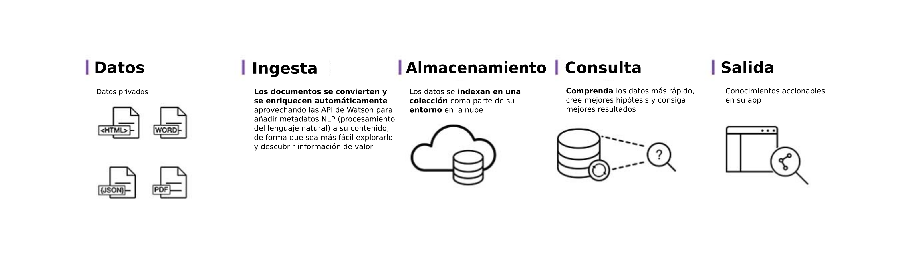

---

copyright:
  years: 2015, 2017
lastupdated: "2017-12-15"

---

{:shortdesc: .shortdesc}
{:new_window: target="_blank"}
{:tip: .tip}
{:pre: .pre}
{:codeblock: .codeblock}
{:screen: .screen}
{:javascript: .ph data-hd-programlang='javascript'}
{:java: .ph data-hd-programlang='java'}
{:python: .ph data-hd-programlang='python'}
{:swift: .ph data-hd-programlang='swift'}

# Acerca de este servicio

{{site.data.keyword.discoveryfull}} permite crear con rapidez aplicaciones cognitivas de exploración basadas en la nube, que son capaces de desvelar conocimiento útil oculto en datos no estructurados - incluido en sus propios datos, así como en datos públicos de terceros.
{: shortdesc}

Esta es la arquitectura de toda la solución del servicio {{site.data.keyword.discoveryshort}}: 

Con {{site.data.keyword.discoveryshort}}, solo se necesitan unos pocos pasos para preparar sus datos no estructurados, crear una consulta que señalará la información que necesita y, a continuación, integrar estos conocimientos en nuevas aplicaciones o en soluciones existentes. 

¿Cómo lo hace {{site.data.keyword.discoveryshort}}? Combinando el análisis de datos con la intuición cognitiva para tomar sus datos no estructurados y enriquecerlos de forma que descubra la información que necesita. 

{{site.data.keyword.discoveryfull}} reúne un conjunto funcionalmente completo de API integradas y automatizadas de {{site.data.keyword.watson}} para: 

- Rastrear, convertir, enriquecer y normalizar datos.
- Explorar el contenido propio de forma segura, así como contenido público gratuito y con licencia.
- Aplicar enriquecimientos adicionales como conceptos, relaciones y sentimientos a través del NLU ({{site.data.keyword.nlushort}}). 
- Simplificar el desarrollo a la vez que proporcionar un acceso directo a las API.

Para obtener información sobre el soporte de idiomas nacionales, consulte [Soporte de idioma de {{site.data.keyword.discoveryshort}}](/docs/services/discovery/language-support.html).

Para obtener información sobre la seguridad de {{site.data.keyword.Bluemix_notm}}, consulte [ Descripción del servicio {{site.data.keyword.Bluemix_notm}} ](../../icons/launch-glyph.svg "Icono de enlace externo")](http://www.ibm.com/software/sla/sladb.nsf/searchsaas/?searchview&searchorder=4&searchmax=0&query=IBM+Bluemix+Service+Description){: new_window}.

{{site.data.keyword.discoveryfull}} Visual Insights es una característica experimental que permite explorar visualmente conexiones identificadas por el entendimiento de {{site.data.keyword.discoveryshort}} de conceptos, relaciones y elementos semánticos, entre otros. Para obtener más información, consulte [{{site.data.keyword.discoveryfull}} Visual Insights](/docs/services/discovery/visual-insights.html).

{{site.data.keyword.discoveryfull}} Knowledge Graph es una característica en fase Beta que proporciona nuevos puntos finales para consultar entidades y relaciones entre documentos. Incluye búsquedas basadas en el contexto y clasificación según la relevancia. Consulte [{{site.data.keyword.discoveryfull}} Knowledge Graph](/docs/services/discovery/building-kg.html) para obtener más información. 

## Soporte de navegador y requisitos previos

Para obtener la lista de requisitos previos y navegadores soportados para {{site.data.keyword.Bluemix}}, consulte [
Requisitos ](https://console.bluemix.net/docs/overview/prereqs.html#prereqs){: new_window}.

## Watson Discovery News
{: #watson-discovery-news}

{{site.data.keyword.discoverynewsshort}}, un conjunto de datos públicos que previamente se ha enriquecido con conocimientos cognitivos, también se incluye con {{site.data.keyword.discoveryshort}}. Puede utilizar este conjunto de datos no estructurados públicos para consultar información que se puede integrar en sus aplicaciones. Consulte [Watson Discovery News](/docs/services/discovery/watson-discovery-news.html#watson-discovery-news) para obtener más información. Consulte una demostración que puede realizar con {{site.data.keyword.discoverynewsshort}} [aquí ](https://discovery-news-demo.mybluemix.net/){: new_window}.

El servicio {{site.data.keyword.discoveryshort}} está disponible en [{{site.data.keyword.Bluemix_notm}} ](https://console.ng.bluemix.net/catalog/services/discovery/){: new_window}

## Conjunto de herramientas de Discovery
{: #discovery-tooling}

El servicio {{site.data.keyword.discoveryshort}} incluye un conjunto completo de herramientas en línea, el conjunto de herramientas de {{site.data.keyword.discoveryshort}}, para ayudarle a configurar rápidamente una instancia del servicio y cumplimentarla con datos. 

El conjunto de herramientas de servicio {{site.data.keyword.discoveryshort}} ha sido diseñada para que ahorre tiempo eliminando la necesidad de utilizar API para configurar y cumplimentar su servicio. Esto permite a los desarrolladores de aplicaciones centrarse en crear soluciones de alto valor para que los usuarios finales experimenten el servicio {{site.data.keyword.discoveryshort}}. Consulte [Iniciación al conjunto de herramientas](/docs/services/discovery/getting-started-tool.html) para una introducción al conjunto de herramientas de {{site.data.keyword.discoveryshort}}. 

## Siguientes pasos
{: #next-steps}

- Empiece con el conjunto de herramientas de {{site.data.keyword.discoveryshort}} o con la {{site.data.keyword.discoveryshort}} API: 
    - [Iniciación al conjunto de herramientas de {{site.data.keyword.discoveryshort}}](/docs/services/discovery/getting-started-tool.html)
    - [Iniciación a {{site.data.keyword.discoveryshort}}](/docs/services/discovery/getting-started.html) API
- Obtenga la lista de SDK en el panel de navegación. 
