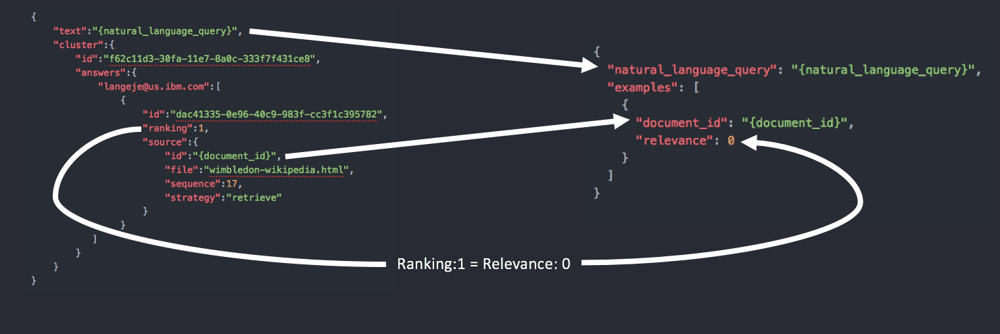

---

copyright:
  years: 2015, 2017
lastupdated: "2017-10-03"

---

{:shortdesc: .shortdesc}
{:new_window: target="_blank"}
{:tip: .tip}
{:pre: .pre}
{:codeblock: .codeblock}
{:screen: .screen}
{:javascript: .ph data-hd-programlang='javascript'}
{:java: .ph data-hd-programlang='java'}
{:python: .ph data-hd-programlang='python'}
{:swift: .ph data-hd-programlang='swift'}


# Migración desde Watson Document Conversion y Retrieve and Rank

{{site.data.keyword.documentconversionfull}} y {{site.data.keyword.retrieveandrankfull}} están en desuso y han sido reemplazadas por {{site.data.keyword.discoveryfull}}. De forma habitual, estos dos servicios se utilizan de forma conjunta para ingerir, clasificar y, a continuación, proporcionar resultados a las aplicaciones de usuario. Este documento se proporciona para guiarle a través del proceso de migración desde {{site.data.keyword.documentconversionshort}} y {{site.data.keyword.retrieveandrankshort}} a {{site.data.keyword.discoveryshort}}.

{{site.data.keyword.discoveryfull}} proporciona una interfaz de consultas más robusta, una ingestión de datos más simplificada, una mejor gestión para el entrenamiento y una mayor escala. {{site.data.keyword.discoveryshort}} está pensado para ser utilizado fundamentalmente en los mismos casos de uso que {{site.data.keyword.retrieveandrankshort}}, entre otros los de soporte para la asistencia de agentes, búsqueda en bases de datos de organizaciones y ayuda en la investigación. Se ha construido pensando en los retos a los que se enfrentan los usuarios de {{site.data.keyword.retrieveandrankshort}}, y resuelve muchos de estos casos. {{site.data.keyword.discoveryshort}} también ofrece nuevas funcionalidades para la recuperación que no estaban disponibles en {{site.data.keyword.retrieveandrankshort}}, entre otras, la recuperación de pasajes y algoritmos de búsqueda mejorados para encontrar resultados más relevantes.

**Comparación de características**

| Característica | {{site.data.keyword.retrieveandrankshort}} | {{site.data.keyword.discoveryshort}} |
|:-------------|:--------------------:|:-------------:|
| Búsqueda de lenguaje natural | Sí | Sí |
| Entrenamiento de relevancia de aprendizaje máquina | Sí | Sí |
| Herramientas de interfaz de usuario para el entrenamiento | Sí | Sí |
| Entrada de unidad de respuesta JSON | Sí | Sí |
| División de documentos | Sí | Sí |
| Recuperación de pasajes |   | Sí |
| Documento CRUD | Sí | Sí |
| Carga de JSON por lotes | Sí |   |
| Enriquecimiento de NLP de documentos de forma automática |   | Sí |
| Integración del modelo de NLP personalizado para el enriquecimiento |   | Sí |
| Datos de entrenamiento almacenados en el servicio |   | Sí |
| Gestión del ciclo de vida de modelo automatizada |   | Sí |
| Similitud semántica para mejorar la relevancia sin entrenamiento |   | Sí |
| Medición de precisión en herramientas con base a un conjunto de prueba | Sí |   |
| Soporte de vector de características personalizadas | Sí |   |
| Configuración de analizador personalizado | Sí | Preconfigurado |
| Palabras vacías ("stopwords") personalizadas | Sí | Preconfigurado |
| Diccionarios de idiomas personalizados | Sí | Preconfigurado |
| Sinónimos personalizados | Sí | Sí |
**Nota:** Esta tabla se actualizará a medida que se añadan nuevas funcionalidades de {{site.data.keyword.discoveryshort}}.

Antes de empezar la migración propiamente dicha, primero debe [evaluar](#evaluate) los datos almacenados en su servicio {{site.data.keyword.retrieveandrankshort}} y entender cómo se trasladarán los distintos componentes que forman su solución actual.

La mayoría de los usuarios utilizan {{site.data.keyword.documentconversionshort}} junto con {{site.data.keyword.retrieveandrankshort}}. Si no está utilizando {{site.data.keyword.documentconversionshort}} para convertir contenido para almacenarlo según un índice en el que se puedan realizar búsquedas, continúe para revisar las [opciones para una migración autónoma de {{site.data.keyword.documentconversionshort}}](#dcs).

Si originalmente utilizó la guía de aprendizaje de {{site.data.keyword.retrieveandrankshort}} y basó su propia instancia del servicio en dicha guía de aprendizaje, encontrará [aquí](/docs/services/discovery/migrate-rnr-tut.html) una ampliación de la guía de aprendizaje ingiriendo los mismos datos en {{site.data.keyword.discoveryshort}}.

**Nota:** La funcionalidad de conversión y enriquecimiento se incluye con {{site.data.keyword.discoveryshort}}. Si ha utilizado {{site.data.keyword.documentconversionshort}} y/o {{site.data.keyword.nlushort}} para convertir y enriquecer documentos de origen HTML, PDF o Microsoft Word, estos servicios han sido reemplazados por las características del servicio {{site.data.keyword.discoveryshort}}.

## Evaluación de los caminos de migración para el servicio Watson Discovery
{: #evaluate}

Hay dos opciones prácticas para realizar la migración desde {{site.data.keyword.retrieveandrankshort}}: migrar desde el contenido de origen y migrar desde un contenido indexado. Evalúe ambas opciones antes de decidir qué opción utilizar.

### Migración desde el contenido de origen
{: #source}

Para poder migrar desde el contenido de origen:

-  necesitará tener acceso a los archivos de origen originales de los que se ingirió el contenido.
-  necesitará extraer mediante programación el ID de cada documento (el resultado ya tiene un ID antes ser indexado)

Si puede satisfacer todos los criterios de migración, es recomendable utilizar este método para utilizar al servicio de {{site.data.keyword.discoveryshort}}.

Para migrar su contenido de origen, modifique el procedimiento descrito en la [guía de aprendizaje de migración](/docs/services/discovery/migrate-rnr-tut.html) para satisfacer las características de sus datos de origen.

#### Migración de unidades de respuesta

Si ha creado unidades de respuesta mediante {{site.data.keyword.documentconversionshort}} elija una de las siguientes opciones para migrar el contenido:

-  Si ha entrenado un clasificador y necesita migrar la clasificación, debería tomar el contenido que devolvió {{site.data.keyword.documentconversionshort}} e ingerirlo en {{site.data.keyword.discoveryshort}}.
-  Si no tiene datos de entrenamiento para migrar, ingiera los documentos de origen originales en {{site.data.keyword.discoveryshort}} utilizando la [característica de segmentación de documentos](/docs/services/discovery/building.html#doc-segmentation).

### Migración desde contenido indexado
{: #indexed}

Si desea migrar desde contenido indexado en {{site.data.keyword.retrieveandrankshort}} y no tiene acceso a los documentos de origen originales, o si:

- utilizó la generación de ID de documentos automática y ha entrenado un clasificador.
- creó unidades de respuesta en {{site.data.keyword.documentconversionshort}} y las clasificó pero no conservó las unidades de respuesta que generó el servicio de {{site.data.keyword.documentconversionshort}}.

**Nota:** Este método es únicamente posible si todo el contenido necesario está en campos almacenados en {{site.data.keyword.retrieveandrankshort}}. Si el contenido únicamente se indexó pero no se almacenó, no será posible consultar el contenido fuera del servicio, y los datos se tendrán que convertir y dividir de nuevo desde el origen.

Los documentos se extraen desde el servicio utilizando el método [/v1/solr_clusters/{solr_cluster_id}/solr/\{collection_name\}/select ](https://www.ibm.com/watson/developercloud/retrieve-and-rank/api/v1/#index_doc){: new_window} utilizando una consulta en blanco `q=*:*`. El número de documentos devueltos podría ser superior al recuento de devoluciones máximo práctico (`200` para la mayoría de las recopilaciones). Si este es el caso, se debería realizar varias llamadas con la [paginación ](https://lucene.apache.org/solr/guide/6_6/pagination-of-results.html){: new_window} adecuada para recopilar todos los documentos.

Los documentos con los **ID** especificados se cargan para el servicio {{site.data.keyword.discoveryshort}} utilizando el método [/v1/environments/\{environment_id\}/collections/\{collection_id\}/documents/\{document_id\} ](https://www.ibm.com/watson/developercloud/discovery/api/v1/#update-doc){: new_window}. Cada documento que se carga es una llamada de API separada.

## Migración de datos de entrenamiento

Después de migrar los resultados, el siguiente paso es migrar todos los datos de entrenamiento que se habían creado para el contenido. Hay dos opciones para migrar los datos de entrenamiento: migrar desde el origen (`csv`) y migrar desde el servicio. Si cargó los datos de entrenamiento desde un archivo `csv` y todavía tiene acceso al archivo, debería migrar desde el origen. Si utilizó el conjunto de herramientas de {{site.data.keyword.retrieveandrankshort}} o todavía no tiene acceso al archivo `csv` original debería migrar desde el servicio.

### Migración del entrenamiento desde el contenido original
{: #csv}

Para poder migrar desde el contenido de origen de clasificación:

- necesitará tener acceso a los archivos `csv` de origen originales con los que originalmente se cargó la información de entrenamiento.
- asegúrese de que los ID de los documentos entrenados se indexan con coincidencia de los ID de los documentos entrenados cuando se indexaron en {{site.data.keyword.retrieveandrankshort}}.

Si puede satisfacer todos los criterios de migración, es recomendable utilizar este método para trasladar el entrenamiento al servicio de {{site.data.keyword.discoveryshort}}.

Para migrar sus datos de entrenamiento, modifique el procedimiento descrito en la [guía de aprendizaje de migración](/docs/services/discovery/migrate-rnr-tut.html) para satisfacer las características de sus datos de origen.

### Migración de datos de entrenamiento desde el servicio
{: #extract-train}

Para migrar datos desde el servicio {{site.data.keyword.retrieveandrankshort}}, necesitará: extraer los datos de entrenamiento utilizando las API de {{site.data.keyword.retrieveandrankshort}}, convertir el JSON de entrenamiento de {{site.data.keyword.retrieveandrankshort}} en un formato que {{site.data.keyword.discoveryshort}} pueda utilizar y por último ingerir los datos de entrenamiento en {{site.data.keyword.discoveryshort}} utilizando la API.

Para extraer datos de entrenamiento de {{site.data.keyword.retrieveandrankshort}}, utilice la función `Exportar` dentro del conjunto de herramientas de {{site.data.keyword.retrieveandrankshort}}. Después de descargar una exportación completa, extraiga el archivo `.zip` guardado. Dentro del archivo de archivado hay dos archivos. Los datos de entrenamiento se almacenan en el archivo denominado `export-questions.json`. Este archivo contiene una matriz de objetos de entrenamiento de JSON.

Cada resultado de entrenamiento en la matriz se presenta en el formato siguiente:

**Datos de entrenamiento de ejemplo de {{site.data.keyword.retrieveandrankshort}}**
```json
{
    "text":"Who was the first royal to attend Wimbledon?",
    "cluster":{
        "id":"f62c11d3-30fa-11e7-8a0c-333f7f431ce8",
        "answers":{
            "f62c11d3-30fa-11e7-8a0c-33":[
                {
                    "id":"dac41335-0e96-40c9-983f-cc3f1c395782",
                    "ranking":1,
                    "source":{
                        "id":"e26a3d20-30fa-11e7-aa5e-d1632b06e0b1",
                        "file":"wimbledon-wikipedia.html",
                        "sequence":17,
                        "strategy":"retrieve"
                    }
                },
                {
                    "id":"661b4c9f-ecdb-4dad-aafc-6ae561a148c0",
                    "ranking":2,
                    "source":{
                        "id":"da1bc620-30fa-11e7-8f90-3305f35a93c9",
                        "file":"generated-otherFactsFigures.docx",
                        "sequence":67,
                        "strategy":"retrieve"
                    }
                },
                {
                    "id":"0053fdb8-c77e-4fcf-b0e0-6a4cd377266a",
                    "ranking":3,
                    "source":{
                        "id":"d9c0add0-30fa-11e7-aa5e-d1632b06e0b1",
                        "file":"generated-allEngland.docx",
                        "sequence":20,
                        "strategy":"retrieve"
                    }
                },
                {
                    "id":"506d3d50-19ed-49c8-b32f-65f848e60e86",
                    "ranking":4,
                    "source":{
                        "id":"da1bc620-30fa-11e7-8f90-3305f35a93c9",
                        "file":"generated-otherFactsFigures.docx",
                        "sequence":63,
                        "strategy":"retrieve"
                    }
                }
            ]
        },
        "flags":{

        }
    }
},
```
{: codeblock}

{{site.data.keyword.discoveryshort}} no precisa de toda la información que {{site.data.keyword.retrieveandrankshort}} exporta. El siguiente fragmento muestra la estructura necesaria para una entrada de entrenamiento de {{site.data.keyword.discoveryshort}}.

```json
{
  "natural_language_query": "{natural_language_query}",
  "examples": [
    {
      "document_id": "{document_id_1}",
      "relevance": 0
    },
    {
      "document_id": "{document_id_2}",
      "relevance": 10
    }
  ]
}
```
{: codeblock}

En este punto, deberá convertir su información de entrenamiento de {{site.data.keyword.retrieveandrankshort}} en información de entrenamiento de {{site.data.keyword.discoveryshort}}. Considere los siguientes puntos para realizar la conversión.

- **No relevante** se especifica con una puntuación de `relevance` de `0` en {{site.data.keyword.discoveryshort}}, pero se especifica con una puntuación de `ranking` de `1` en {{site.data.keyword.retrieveandrankshort}}, por lo tanto, todas las entradas `"ranking": 1` se deben convertir a `"relevance": 0` en {{site.data.keyword.discoveryshort}}.
- El conjunto de herramientas de {{site.data.keyword.discoveryshort}} utiliza una escala binaria de `0` y `10`. Si desea clasificar más resultados y utilizar el conjunto de herramientas de {{site.data.keyword.discoveryshort}}, debe convertir todas las entradas `"ranking": 1` y `"ranking": 2` en `"relevance": 0`, y todas las entradas `"ranking": 3` y `"ranking": 4` en `"relevance": 10`. Esto no es necesario si no está clasificando resultados adicionales, o si no está utilizando el conjunto de herramientas de {{site.data.keyword.discoveryshort}}.
- {{site.data.keyword.discoveryshort}} no precisa de respuestas sin contestar, la comprobación de la validez del entrenamiento de relevancia se realiza de forma manual.



A modo de ejemplo, los **datos de entrenamiento de {{site.data.keyword.retrieveandrankshort}} de ejemplo** mostrados con anterioridad se deberían convertir en el conjunto de herramientas de {{site.data.keyword.discoveryshort}} tal como se indica a continuación:

```json
{
  "natural_language_query": "Who was the first royal to attend Wimbledon?",
  "examples": [
    {
      "document_id": "e26a3d20-30fa-11e7-aa5e-d1632b06e0b1",
      "relevance": 0
    },
    {
      "document_id": "da1bc620-30fa-11e7-8f90-3305f35a93c9",
      "relevance": 0
    },
    {
      "document_id": "d9c0add0-30fa-11e7-aa5e-d1632b06e0b1",
      "relevance": 10
    },
    {
      "document_id": "da1bc620-30fa-11e7-8f90-3305f35a93c9",
      "relevance": 10
    }
  ]
}
```
{: codeblock}

## Soporte de idiomas
{: #language}

Consulte la [tabla de soporte de idiomas para {{site.data.keyword.discoveryshort}}](/docs/services/discovery/language-support.html). Las características de {{site.data.keyword.retrieveandrankshort}} están soportadas fundamentalmente mediante un soporte de idiomas **Básico** de {{site.data.keyword.discoveryshort}}.

## Migración de consultas
{: #queries}

El lenguaje de consultas de {{site.data.keyword.discoveryfull}} es diferente del lenguaje de consultas Solr que utiliza {{site.data.keyword.retrieveandrankshort}}. Las consultas existentes se deberían tratar en uno de los métodos de consulta de {{site.data.keyword.discoveryfull}} y convertirlas para utilizar el lenguaje de consulta de {{site.data.keyword.discoveryfull}}. En la tabla siguiente se describen algunos de los operadores habituales que se utilizan en la mayoría de las consultas:

**Migración desde consultas de Solr a {{site.data.keyword.discoveryshort}} - Operadores habituales**

| Operador de Solr | Operador de Discovery | Descripción |
|:-------------:|--------------------|-------------|
| `.` | `.` | Delimitador JSON |
| `:` | `:` | Incluye |
|  | `::` | Coincidencia exacta |
| `-{fieldname}:` | `:!` | No incluye |
|  | `::!` | No es una coincidencia exacta |
| ``\` | ``\` | Carácter de escape |
| `""` | `""` | Consulta de frase |
| `()` | `()`, `[]` | Agrupación anidada |
| `OR` | [<code>&#124;</code>] | or |
| `AND` | [,] | and |
| `[* TO 100]` | `<=`, `>=`, `>`, `<` | Comparaciones numéricas |
| `^x` | `^x` | Multiplicador de puntuación |
| `*` | `*` | Comodín |
| `~`(0 a 1) | [~n] | Variación de serie |

Consulte la documentación de [Conceptos de consultas](/docs/services/discovery/using.html) y [Referencia de consultas](/docs/services/discovery/query-reference.html) para obtener información detallada sobre el lenguaje de consultas de {{site.data.keyword.discoveryfull}}.


## Migración autónoma del servicio Watson Document Conversion
{: #dcs}

Si está utilizando {{site.data.keyword.documentconversionshort}} para ingerir contenido en {{site.data.keyword.retrieveandrankshort}}, tenga en cuenta que dicha funcionalidad se ha transformado en el servicio individual {{site.data.keyword.discoveryshort}}. {{site.data.keyword.discoveryshort}} permite fácilmente convertir, enriquecer e ingerir documentos Microsoft Word, PDF, HTML y JSON en un índice en que se pueden realizar búsquedas y entrenamiento. Esta sección es relevante si en su caso no tiene la necesidad de almacenar contenido convertido en un índice. Si está ingiriendo documentos en un índice, consulte [ingestión para el servicio {{site.data.keyword.discoveryshort}}](/docs/services/discovery/building.html).

IBM deja de proporcionar un servicio diseñado para una conversión autónoma de documentos de Microsoft Word, PDF y HTML. Si actualmente está utilizando el servicio {{site.data.keyword.documentconversionshort}} y no ingiere la salida en un servicio indexado en línea (como {{site.data.keyword.discoveryshort}}), se le recomienda considerar migrar a una alternativa de código abierto como, por ejemplo, [Apache Tika ](https://tika.apache.org/){: new_window}.
