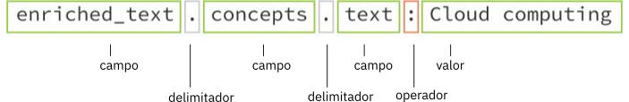

---

copyright:
  years: 2015, 2017
lastupdated: "2017-12-15"

---

{:shortdesc: .shortdesc}
{:new_window: target="_blank"}
{:tip: .tip}
{:pre: .pre}
{:codeblock: .codeblock}
{:screen: .screen}
{:javascript: .ph data-hd-programlang='javascript'}
{:java: .ph data-hd-programlang='java'}
{:python: .ph data-hd-programlang='python'}
{:swift: .ph data-hd-programlang='swift'}

# Conceptos de consultas

El servicio {{site.data.keyword.discoveryfull}} ofrece potentes funciones de búsqueda de contenido. Una vez el contenido se ha cargado y el servicio {{site.data.keyword.discoveryshort}} lo ha enriquecido, puede crear consultas, integrar {{site.data.keyword.discoveryshort}} en sus propios proyectos o crear una aplicación personalizada utilizando {{site.data.keyword.watson}} Explorer Application Builder.
{: shortdesc}

  Las consultas que escriba dependerán de la recopilación, puesto que cada recopilación posee contenido único.
  {: tip}

Cuando se crea una consulta o filtro, {{site.data.keyword.discoveryshort}} analiza cada resultado y busca coincidencias con las vías que haya definido. Cuando se producen coincidencias, se añaden al conjunto de resultados. Al crear una consulta, puede ser todo lo genérica o específica que desee. Cuando más específica sea una consulta, más acotados serán los resultados. 

También tiene la opción de activar la recuperación de pasajes. Los pasajes son fragmentos significativos breves que se extraen de los documentos completos que devuelve su consulta. Estos fragmentos específicos se extraen de los campos `text` de los documentos en su recopilación. De forma predeterminada para una consulta, se devolverá un máximo de 10 pasajes de 400 caracteres. Se extrae un máximo de tres pasajes de un resultado individual. El parámetro `passages` solo está disponible en recopilaciones privadas, por lo tanto, no está disponible en la recopilación {{site.data.keyword.discoverynewsshort}}. Consulte [Pasajes](/docs/services/discovery/query-parameters.html#passages) para obtener más información sobre cómo se identifican los pasajes. 

  Puede escribir consultas de lenguaje natural (como "IBM Watson partnerships") utilizando el conjunto de herramientas de {{site.data.keyword.discoveryshort}} o con la API.
  {: tip}

Las recopilaciones entrenadas devolverán una puntuación de `confidence` en el resultado de una consulta de lenguaje natural. Consulte [Puntuaciones de confianza](/docs/services/discovery/train-tooling.html#confidence) para obtener más información. 

{{site.data.keyword.discoveryfull}} Visual Insights es una característica experimental que permite explorar visualmente conexiones identificadas por el entendimiento de {{site.data.keyword.discoveryshort}} de conceptos, relaciones y elementos semánticos, entre otros. Para obtener más información, consulte [{{site.data.keyword.discoveryfull}} Visual Insights](/docs/services/discovery/visual-insights.html).

{{site.data.keyword.discoveryfull}} Knowledge Graph es una característica en fase Beta que proporciona nuevos puntos finales para consultar entidades y relaciones entre documentos. Incluye búsquedas basadas en el contexto y clasificación según la relevancia. Consulte [{{site.data.keyword.discoveryfull}} Knowledge Graph](/docs/services/discovery/building-kg.html) para obtener más información. 

Para obtener más información sobre cómo escribir consultas, consulte:
- [Iniciación a la guía de aprendizaje de creación de consultas](/docs/services/discovery/getting-started-query.html)
- [Referencia de consultas](/docs/services/discovery/query-reference.html) (incluye la lista de parámetros, operadores y agregaciones disponibles en {{site.data.keyword.discoveryshort}} Query Language)

## El esquema de datos de Discovery
{: #discovery-schema}

Familiarícese primero con el JSON de {{site.data.keyword.discoveryshort}}. Para entender cómo crear una consulta con {{site.data.keyword.discoveryshort}} Query Language, necesitará familiarizarse con el JSON que {{site.data.keyword.discoveryshort}} genera después de enriquecer los documentos en su recopilación. Una vez familiarizado con el esquema de datos de los documentos, será más fácil escribir consultas en {{site.data.keyword.discoveryshort}} Query Language. Hay tres maneras de hacerlo.

  1. En el conjunto de herramientas de {{site.data.keyword.discoveryshort}}, abra la pantalla **Gestionar datos**, elija la recopilación que contenga los {{site.data.keyword.IBM_notm}} Press Releases. Pulse el botón **Ver esquema de datos**. La pantalla **Ver esquema de datos** visualiza los campos y valores en sus documentos transformados de dos maneras: por documento (**Vista de documentos**) o por campo (**Vista de recopilación**). En la **Vista de documentos** se visualizará un máximo de 50 documentos. La **Vista de recopilación** visualizará los campos de toda la recopilación. 

    En la **Vista de recopilación**, bajo `enriched_text`, puede examinar los enriquecimientos aplicados con el archivo de la **Configuración predeterminada**. Pulse en `categories`, `concepts`, `entities` y `sentiment` para cómo la recopilación se enriquece con la información de Watson. 

  1. Ejecute una consulta "vacía" para ver el JSON. En la pantalla de **Ver esquema de datos**, pulse el botón **Crear consultas** y, a continuación, pulse **Ejecutar consulta**. Los resultados se visualizarán a la derecha, bajo dos separadores, **Resumen** (una visión general de los resultados de la consulta) y **JSON**. Empiece abriendo el separador **JSON**. 

     -  Cada uno de los cuatro documentos estará precedido por un número de `id`. 
     -  Desplácese hasta el campo `enriched_text`. Examine cada enriquecimiento para conocer los campos JSON que se utilizarán para realizar consultas.  

        

     -  **entities** - Encuentre el campo `text` y examine la información de enriquecimiento adicional. 
     -  **sentiment** - Encuentre el campo `label` y examine la información de enriquecimiento adicional. 
     -  **concepts** - Encuentre el campo `text` y examine la información de enriquecimiento adicional. 
     -  **categories** - Encuentre el campo `document` y examine la información de enriquecimiento adicional. 

     Después de haber examinado la información en el primer documento, puede consultar los otros tres documentos si así lo desea. 

  1. Visualice los campos disponibles en el **Creador de consulta visual**. 
En la pantalla **Crear consultas**, pulse **Buscar documentos** y, a continuación, **Utilizar {{site.data.keyword.discoveryshort}} Query Language**. Pulse el desplegable **Campo** para ver los campos disponibles en sus datos. Pulse **Editar en lenguaje de consulta** para crear consultas de forma manual con {{site.data.keyword.discoveryshort}} Query Language.       

### Como estructurar una consulta básica
{: #structure-basic-query}

Como habrá observado, JSON es jerárquico, de forma que las consultas se deben escribir utilizando la misma jerarquía. Por ello, si su JSON es parecido a: 

```json
"enriched_text": {
  "concepts": [
    {
    "text": "Cloud computing",
    "relevance": 0.610029}
    ]
  }
```
{: codeblock}

Su consulta se debería estructurar como: 




Consideraciones:

- ¿No está seguro de cuándo realizar una consulta con relación a una entidad, concepto o palabra clave? Consulte [Diferencias entre entidades, conceptos y palabras clave](/docs/services/discovery/building.html#udbeck). 

- **Nota:**  Después de pulsar **Ejecutar consulta** y abrir el separador **JSON**, observará que de forma predeterminada se activa el resaltado de la consulta. Esto añadirá un campo `highlight` a los resultados de la consulta. Dentro del campo `highlight`, las palabras que coinciden con su consulta serán delimitados en etiquetas `<em>` (emphasis) de HTML. Consulte [Parámetros de consulta](/docs/services/discovery/query-parameters.html#highlight) para obtener más información. 

## Creación de consultas combinadas
{: #building-combined-queries}

Los parámetros de las consultas se pueden combinar para crear consultas más específicas. Por ejemplo, los parámetros `filter` y `query` se pueden utilizar de forma conjunta. Para obtener más información sobre el filtrado frente a la creación de consultas, consulte [Diferencias entre los parámetros query y filter](/docs/services/discovery/query-parameters.html#filtervquery). 

## Cómo estructurar una agregación
{: #structure-aggregation}

Las agregaciones devuelven un conjunto de valores de datos, por ejemplo, palabras clave más destacadas, sentimiento general de las entidades, etc. Para obtener una lista completa de opciones de agregación, consulte [Agregaciones](/docs/services/discovery/query-reference.html#aggregations). 


Este ejemplo de agregación encontrará todos los `concepts` en su recopilación. El delimitador en esta consulta es `.` y el operador es `()`. Consulte [Operadores de consulta](/docs/services/discovery/query-operators.html) para obtener más información sobre otros operadores disponibles en {{site.data.keyword.discoveryshort}} Query Language. 

### Ejemplo de consultas de agregación
{: #example-aggregations}

Existen varias formas de agregar resultados con {{site.data.keyword.discoverynewsshort}} como, por ejemplo, con top values, sum, min, max, average, timeslice e histogram. También es posible añadir filtros y agregaciones anidadas. 

#### Filtración de agregaciones
{: #filter-aggregations}

Este ejemplo de agregación devuelve el número de artículos encontrados en {{site.data.keyword.discoverynewsshort}} acerca del equipo Pittsburgh Steelers y cuántos resultados tienen un sentimiento `positive`, `negative` o `neutral`. 

- `filter(enriched_text.entities.text:"Pittsburgh Steelers").term(enriched_text.sentiment.document.label,count:3)`


Este ejemplo de agregación primero delimitará (filtrará) un conjunto de artículos en {{site.data.keyword.discoverynewsshort}} a solo aquellos que incluyan el texto de entidades de twitter y, a continuación, dividirá estos artículos por tipos de sentimiento del documento. Solo se devolverán los primeros 3 documentos con tipos de sentimiento (`positive`, `negative`, `neutral`). 

- `filter(enriched_text.entities.text:twitter).term(enriched_text.sentiment.document.label,count:3)`

#### Agregaciones anidadas
{: #nested-aggregations}

La adición de `nested` antes de una agregación restringe la agregación al área de los resultados especificados. Por ejemplo: `nested(enriched_text.entities)` significa que solo los componentes `enriched_text.entities` de cualquier resultado se utilizan para agregar. 

Esto se muestra con facilidad consultando las diferencias entre las siguientes dos consultas: 
- `filter(enriched_text.entities.disambiguation.subtype::City)` -
La agregación cuenta el número de *Resultados* que contienen una o varias `entity` con el tipo `City`
- `nested(enriched_text.entities).filter(enriched_text.entities.disambiguation.subtype::City)` - La agregación cuenta el número de instancias de una `entity` con el tipo `City` en los resultados.   

Además, cualquier operación posterior restringirá aún más el conjunto de resultados por el que se puede agregar. Por ejemplo: 

- `nested(enriched_text.entities).filter(enriched_text.entities.disambiguation.subtype::City)` significa que solo se agregarán las entidades de `subtype::City`. 
- `nested(enriched_text.entities).filter(enriched_text.entities.disambiguation.subtype::City).term(enriched_text.entities.text,count:3)` agregará las 3 primeras entidades del subtipo `City`
- `filter(enriched_text.entities.disambiguation.subtype::City).term(enriched_text.entities.text,count:3)` devolverá las 3 primeras entidades donde el resultado contiene al menos una entidad del subtipo `City`.  

## Consultas para Watson Discovery News
{: #querying-news}

{{site.data.keyword.discoverynewsshort}}, un conjunto de datos públicos que previamente se ha enriquecido con conocimientos cognitivos, también se incluye con {{site.data.keyword.discoveryshort}}. Consulte [Watson Discovery News](/docs/services/discovery/watson-discovery-news.html#watson-discovery-news) para obtener más información sobre esta recopilación. 

Esta recopilación se puede consultar utilizando consultas de lenguaje natural, por ejemplo "IBM Watson partnerships", o {{site.data.keyword.discoveryshort}} Query Language. Para obtener más información sobre las consultas en lenguaje natural, consulte [Consulta de lenguaje natural](/docs/services/discovery/query-parameters.html#nlq). 

No es posible ajustar la configuración de {{site.data.keyword.discoverynewsshort}}, ni realizar tareas de entrenamiento ni tampoco añadir documentos la recopilación de {{site.data.keyword.discoverynewsshort}}. Consulte una demostración que puede realizar con {{site.data.keyword.discoverynewsshort}} [aquí ](https://discovery-news-demo.mybluemix.net/){: new_window}.

La versión en idioma inglés de Watson {{site.data.keyword.discoverynewsshort}} está disponible a través del conjunto de herramientas de {{site.data.keyword.discoveryshort}} y la API. Hay disponibles las versiones en idioma coreano (`collection_id`: `news-ko`) y español (`collection_id`: `news-es`) para que las utilice a través de la API únicamente. Para obtener información sobre cómo consultar una recopilación a través de la API, consulte [Referencia de API ](https://www.ibm.com/watson/developercloud/discovery/api/v1/#query-collection){: new_window}. El `collection_id` de la versión en el idioma inglés de Watson {{site.data.keyword.discoverynewsshort}} es `news-en`. Con anterioridad, el `collection_id` era `news`. Si ha esta utilizando el anterior `collection_id`, continuará funcionando, sin embargo, debería cambiar al nuevo `collection_id` para nuevos proyectos. 

**Nota:** El número máximo de resultados devueltos a una consulta de Watson Discovery es de `50`. Utilice consultas adicionales y el parámetro `offset` para obtener más de `50` resultados.

Si está utilizando {{site.data.keyword.discoveryshort}} Query Language, puede incluir un rango de fechas relativo en sus consultas para {{site.data.keyword.discoverynewsshort}}, por ejemplo: `crawl_date>=now-1month`. Valores válidos para el intervalo de fechas son `second/seconds` `minute/minutes`, `hour/hours`, `day/days`, `week/weeks`, `month/months` y `year/years`. `now`
no se ve afectado por el parámetro `time_zone`, `UTC` es el huso horario predeterminado. 

Los artículos de noticias a veces se sindican a varios proveedores de noticias, por lo que {{site.data.keyword.discoverynewsfull}} recopilará todas ellas, dando lugar a artículos duplicados. Esto significa que una consulta a {{site.data.keyword.discoverynewsfull}} potencialmente podría dar lugar a varios artículos idénticos o casi idénticos en los resultados de las consultas. Esta situación se puede tratar con la desduplicación. Para obtener más información sobre esta funcionalidad en fase beta, consulte [Exclusión de documentos duplicados en los resultados de las consultas](/docs/services/discovery/query-parameters.html#deduplication). 

## Consultas a varias recopilaciones
{: #multiple-collections}

Si tiene varias recopilaciones en su entorno, es posible que desee ver los resultados a través de varias de estas recopilaciones. Los métodos de consulta (`query`, `fields` y `notices`) al nivel de `environments` permiten consultar varias recopilaciones especificadas. Actualmente la consulta a través de varias recopilaciones no está disponible en el conjunto de herramientas de {{site.data.keyword.discoveryshort}}. 

Puede consultar varias recopilaciones en el mismo entorno mediante el método de API `environments/{environment_id}/query`. Al realizar consultas a través de varias recopilaciones, tenga en cuenta los siguientes aspectos. 
-  Al utilizar este método se debe especificar el parámetro `collection_ids`. El parámetro `collection_ids` es una lista separada por comas de recopilaciones en el entorno en el que realizar la consulta. 
-  No se da soporte a `passages` ni a todos los subparámetros al realizar consultas de varias recopilaciones. 
-  Como parte el objeto del resultado, se devuelve el nuevo campo `collection_id`. Este campo especifica la recopilación donde se ha encontrado el resultado.
-  {{site.data.keyword.discoverynewsshort}} es parte del entorno `system` y no se puede incluir en consultas a varias recopilaciones. 
-  No se realiza una reclasificación en ninguna parte de una consulta de varias recopilaciones, incluso si se han entrenado todas las recopilaciones en la consulta. 

Consulte [Referencia de API para consultas de varias recopilaciones ](http://www.ibm.com/watson/developercloud/discovery/api/v1/#query-multi-collections){: new_window} para obtener más información. 

Puede consultar varias noticias a través de varias recopilaciones en el mismo entorno mediante el método de API `environments/{environment_id}/notices`. 
-  Al utilizar este método se debe especificar el parámetro `collection_ids`. El parámetro `collection_ids` es una lista separada por comas de recopilaciones en el entorno en el que realizar la consulta. 
-  No se da soporte a `passages` ni a todos los subparámetros al realizar consultas de varias recopilaciones. 

Consulte [Referencia de API para noticias de varias recopilaciones ](http://www.ibm.com/watson/developercloud/discovery/api/v1/#collections-notices){: new_window} para obtener más información. 

Puede visualizar campos disponibles a través de recopilaciones en el mismo entorno mediante el método de API `environments/{environment_id}/fields`. Consulte [Referencia de API para consultas de campos de varias recopilaciones ](http://www.ibm.com/watson/developercloud/discovery/api/v1/#multi-list-fields){: new_window} para obtener más información. 
