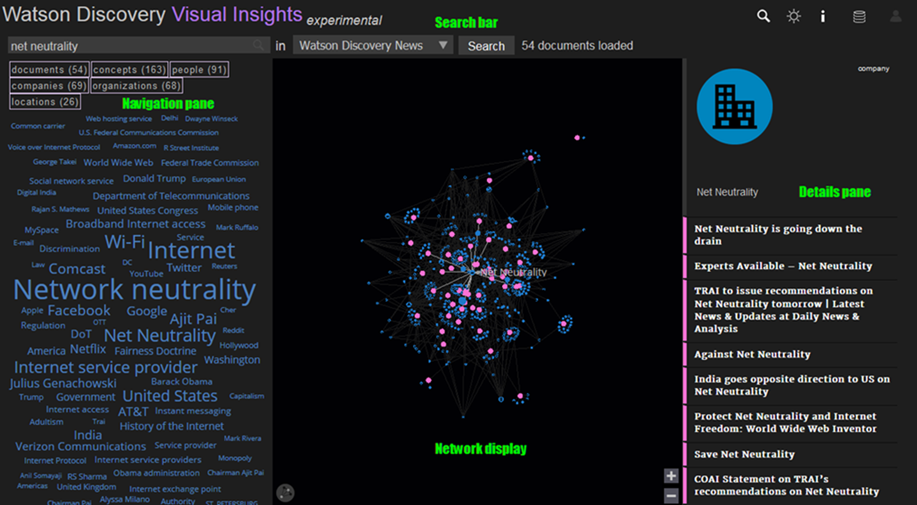

---

copyright:
  years: 2015, 2017
lastupdated: "2017-11-30"

---

{:shortdesc: .shortdesc}
{:new_window: target="_blank"}
{:tip: .tip}
{:pre: .pre}
{:codeblock: .codeblock}
{:screen: .screen}
{:javascript: .ph data-hd-programlang='javascript'}
{:java: .ph data-hd-programlang='java'}
{:python: .ph data-hd-programlang='python'}
{:swift: .ph data-hd-programlang='swift'}

# Watson Discovery Visual Insights
{: #visual-insights}

{{site.data.keyword.discoveryfull}} Visual Insights es una característica experimental que permite explorar visualmente conexiones identificadas por el entendimiento de {{site.data.keyword.discoveryshort}} de conceptos, relaciones y elementos semánticos, entre otros. 

{{site.data.keyword.discoveryfull}} Visual Insights sirve para obtener más información sobre sus recopilaciones, y antes de utilizar {{site.data.keyword.discoveryshort}} para crear consultas que se pueden integrar en su nueva aplicación o en una solución existente que apuntará a los usuarios con la información que necesitan. 

Durante la versión experimental, Visual Insights sólo está disponible en entornos públicos. 

**Aviso:** Visual Insights es una característica experimental, lo que significa que puede ser inestable, puede cambiar frecuentemente, y puede ser suspendido con poca antelación. Se proporciona para poder evaluar su funcionalidad. Puede que no proporcione el mismo nivel de rendimiento o compatibilidad que el ofrecido por otras características disponibles de forma general. No está diseñado para su uso en un entorno de producción, y si lo hace es bajo su propia responsabilidad. Consulte [Características Beta/experimentales](/docs/services/discovery/release-notes.html#beta-features) para obtener información detallada. 

## Inicio rápido de Visual Insights
{: #quick-tour-visual-insights}

La ventana de Visual Insights está dividida en 4 áreas principales. 

### Barra de búsqueda 
{: #search-bar}

La **barra de búsqueda** en la parte superior permite consultar recopilaciones de {{site.data.keyword.discoveryshort}}. 

- Si ha iniciado una sesión con sus credenciales de {{site.data.keyword.Bluemix_notm}}, estarán disponibles todas las recopilaciones de instancias de {{site.data.keyword.discoveryshort}} asociadas a su cuenta en el desplegable de recopilaciones ({{site.data.keyword.discoverynewsfull}} de forma predeterminada). Si no ha iniciado sesión, solo estará disponible la recopilación {{site.data.keyword.discoverynewsfull}}. 
- Elija su recopilación, especifique su consulta (por ejemplo `What is net neutrality`) en el recuadro de búsqueda y, a continuación, pulse el botón **buscar** para iniciar la búsqueda. Para recopilaciones grandes, se podría tardar un minuto o más antes de que se pudiesen mostrar los resultados. 
Filtre su búsqueda pulsando los botones `documentos`, `conceptos`, `gente`, `ubicaciones`, `organizaciones` o `compañías`. 
- Opcionalmente se puede seleccionar un elemento en los resultados visualizados (entidad, concepto o documento) pulsando el icono  en la cabecera. 
- Si se selecciona una recopilación privada y no se especifica consulta alguna, se visualizarán hasta 1000 documentos de la recopilación en el [panel de Detalles](/docs/services/discovery/visual-insights.html#details-pane). 
Si se elige la recopilación {{site.data.keyword.discoverynewsshort}} y no se especifica ninguna consulta, se visualizará una selección de los 100 artículos más recientes. 

### Visualización de red 
{: #network-display}

El panel central bajo la barra de búsqueda corresponde a la **visualización de red**. Se trata de una visualización interactiva de los resultados de su consulta. 

- La **visualización de red** es una representación gráfica de documentos, entidades y conceptos que se han extraído de los resultados de una consulta. Los nodos rosa representan documentos; los nodos azules representan las entidades o los conceptos. Cada nodo de documento está enlazado a todos los nodos de conceptos y entidades que {{site.data.keyword.discoveryshort}} detectó en el documento. Cuando más parecidos son los documentos, más cerca estarán ubicados entre sí en la visualización. 
- Si pasa el ratón sobre un nodo en **Visualización de red** verá su título asociado y se resaltarán sus enlaces a otros nodos. 
- Al pulsar en un nodo se mostrará información sobre ese nodo en el [panel de detalles](/docs/services/discovery/visual-insights.html#details-pane).

### Panel de detalles
{: #details-pane}

A la derecha de la visualización de red se encuentra el **panel de detalles**.

- El panel de detalles proporciona más detalles sobre cada documento, incluida su clasificación y fecha (si está disponible), un breve extracto (con la opción para abrir el documento completo), así como las entidades y conceptos a los que está enlazado. 
- Si en la visualización de red se selecciona un nodo que no corresponde a un documento, la información sobre dicho nodo se visualizará en la parte superior del panel de Detalles. 
- Al pulsar en cualquiera de las entidades o conceptos enlazados en el panel de detalles se seleccionará el correspondiente nodo en la visualización de Red. 

### Panel de navegación
{: #navigation-pane}

A la izquierda de la visualización de red se encuentra el **panel de detalles**. Este panel proporciona una visión general de etiquetas de los términos más comunes extraídas de los resultados de una consulta en la recopilación dada. Cuanto más grande es el término, más habitual es en los resultados de la consulta. 

- Al seleccionar un término en la nube de etiquetas, cambiará su color a rosa, y se resaltarán todos los documentos en la visualización de red que estén asociados a dicho término. El panel de detalles visualizará la lista de documentos resaltados. Los otros términos en la nube de etiquetas ahora indicarán su relación con el término seleccionado: 
  - Los términos en gris corresponderán a los términos no asociados con ninguno de los documentos resaltados. 
  - Si el color del término pasa a ser violeta, está asociado con todos los documentos resaltados, y no será de ayuda si está intentando distinguir entre los documentos. 
  - Los términos que permanecen de color azul están asociados con algunos, pero no todos, los documentos resaltados y, por lo tanto se podrán utilizar para refinar más el conjunto de documentos resaltados. Seleccionar uno de estos términos reducirá el conjunto de documentos resaltados a aquellos que están asociados con ambas etiquetas. En la visualización de la red se acercará a la región donde se encuentran ubicados dichos documentos. Este método puede utilizarse para refinar un número elevado de documentos a un conjunto más pequeño con tan solo unas pulsaciones.
- Para deseleccionar un término seleccionado, pulse el término de nuevo. Para borrar todos los términos seleccionados, pulse en un área en blanco entre las palabras en la nube de etiquetas. Si pulsa sobre una etiqueta gris, borrará la selección existente y seleccionará dicho término. 
- Los tipos y recuentos de documentos, personas, conceptos, organizaciones, ubicaciones y compañías se visualizan por encima de la nube de etiquetas. Pulse en cualquiera de ellos para filtrar la nube de etiquetas y la visualización de la red. 

## Utilización de Visual Insights
{: #using-visual-insights}

Visual Insights sirve para consultar {{site.data.keyword.discoverynewsfull}} sin necesidad de iniciar una sesión. Para utilizar Visual Insights con sus propias recopilaciones, necesitará:

- Una cuenta de {{site.data.keyword.Bluemix_notm}} que contenga una instancia de {{site.data.keyword.discoveryshort}}. 
- Una o varias recopilaciones en una instancia de {{site.data.keyword.discoveryshort}} que se haya enriquecido con el enriquecimiento de [Extracción de entidades](/docs/services/discovery/building.html#entity-extraction) y, de forma opcional, de los enriquecimientos de [Etiquetado de conceptos](/docs/services/discovery/building.html#concept-tagging), [Extracción de palabras clave](/docs/services/discovery/building.html#keyword-extraction), [Extracción de relaciones](/docs/services/discovery/building.html#relation-extraction)y [Clasificación de categorías](/docs/services/discovery/building.html#category-classification). Se pueden incluir otros enriquecimientos, pero Visual Insights no los representará. 

Para obtener más información sobre {{site.data.keyword.discoveryshort}} y cómo empezar de forma gratuita, consulte [Watson {{site.data.keyword.discoveryshort}} ](https://www.ibm.com/watson/services/discovery/){: new_window}. 

Una vez que tenga una cuenta de {{site.data.keyword.Bluemix_notm}}, una instancia de {{site.data.keyword.discoveryshort}} y una o varias recopilaciones cumplimentadas, verá sus recopilaciones en Visual Insights cuando inicie sesión. 

Inicio de sesión en Visual Insights

1. Abra [{{site.data.keyword.discoveryshort}} Visual Insights ](https://visual-insights.bluemix.net){: new_window}.
1. Pulse en el icono  en la barra de búsqueda. 
1. Especifique su ID de {{site.data.keyword.Bluemix_notm}} y su contraseña. En unos instantes sus recopilaciones estarán disponibles para que las pueda elegir en la barra de búsqueda. 

## Envío de comentarios 
{: #providing-feedback}

Estamos interesados en sus comentarios sobre {{site.data.keyword.discoveryshort}} Visual Insights. Para acceder al enlace de los comentarios, pulse el icono  en la cabecera. 
