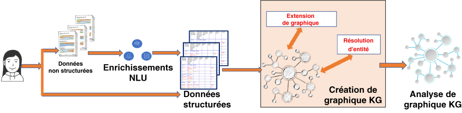

---

copyright:
  years: 2015, 2018
lastupdated: "2018-06-09"

---

{:shortdesc: .shortdesc}
{:new_window: target="_blank"}
{:tip: .tip}
{:pre: .pre}
{:codeblock: .codeblock}
{:screen: .screen}
{:javascript: .ph data-hd-programlang='javascript'}
{:java: .ph data-hd-programlang='java'}
{:python: .ph data-hd-programlang='python'}
{:swift: .ph data-hd-programlang='swift'}

# Watson Discovery Knowledge Graph

Les graphiques Knowledge Graph sont bien plus que de simples données et informations ; ils établissent des connexions entre vos données dans des documents et génèrent de nouvelles connaissances. Nous fournissons la technologie d'intelligence artificielle qui crée automatiquement des graphiques Knowledge Graph personnalisés à partir de données non structurées en extrayant et en éclaircissant des entités et des relations, en enrichissant des relations à l'aide de techniques algorithmiques et en classant des résultats à l'aide d'algorithmes appropriés. Les graphiques Knowledge Graph peuvent fonctionner comme le "concentrateur de connaissance" de votre société et peuvent être utilisés pour les moteurs de recherche, de récapitulation et de recommandation d'entreprise, d'autres processus de prise de décision, par exemple, la détection de fraudes, de pertes ou d'abus. L'utilisation d'un modèle personnalisé (créé dans {{site.data.keyword.knowledgestudioshort}}) dans le processus de création de graphiques Knowledge Graph peut vous permettre de générer des graphiques Knowledge Graph applicables à certains domaines, tels que la finance, la technologie, la sécurité, l'intelligence, la santé et beaucoup d'autres. Voir [Intégration à {{site.data.keyword.knowledgestudiofull}}](/docs/services/discovery/integrate-wks.html) pour plus d'informations sur l'intégration de {{site.data.keyword.discoveryshort}} à {{site.data.keyword.knowledgestudioshort}}.


Deux noeuds finaux RESTful ajoutés à {{site.data.keyword.discoveryfull}} permettent de rechercher des relations et des entités enrichies et éclaircies sur l'ensemble des documents d'une collection de documents non structurés. Les résultats de recherche peuvent être classés par pertinence ou popularité. Outre un jeton de recherche, les API peuvent utiliser un ou plusieurs mot(s) ou passage(s) contextuel(s) facultatif(s) qui permet(tent) de trouver des entités et des relations plus pertinentes dans le volumineux graphique Knowledge Graph créé automatiquement.

 La figure suivante montre comment un graphique Knowledge Graph s'intègre dans le pipeline {{site.data.keyword.discoveryfull}} actuel. Les enrichissements {{site.data.keyword.nlushort}} utilisent un modèle {{site.data.keyword.knowledgestudioshort}} personnalisé (`en-news`) pour extraire les entités et relations au niveau document individuel. Lors de la création d'un graphique Knowledge Graph, des techniques d'extension de graphique et de résolution d'entité (automatiques) implicites sont utilisées pour créer automatiquement un graphe d'entités et de relations connectées dans des documents. Outre le graphique Knowledge Graph en cours de création, le service d'analyse du graphique Knowledge Graph ajoute des techniques de classement par pertinence afin de renvoyer des résultats.



Ce graphique Knowledge Graph connecté et des techniques de classement facilitent les cas d'utilisation suivants :

-  Des entités éclaircies (dépourvues d'ambiguïté) grâce à l'utilisation d'un jeton de recherche floue (facultatif) et contextuelle (facultatif). Exemple : si le terme `Steve` est recherché dans le contexte `Apple`, `Steve Jobs` apparaît comme premier résultat tandis que si le terme `Steve` est recherché dans le contexte `Microsoft`, c'est `Steve Ballmer` qui apparaît comme premier résultat.
-  Des relations classées par pertinence grâce à l'utilisation d'un jeton de recherche floue et contextuelle (facultatif). Le classement par pertinence utilise les propriétés globales du graphique pour faire apparaître des informations plus spécifiques. Exemple : si des relations sont recherchées pour `Obama` dans le contexte de la santé (`health`), `Affordable Care Act` et d'autres entités connexes sont renvoyées.
-  Des déductions et des regroupements dans des documents grâce à l'exécution de requêtes portant sur des entités et des relations dans un graphique Knowledge Graph connecté. Voici quelques exemples de ce type de requête : Quels sont les liens entre la personne X et la personne Y ? En quoi les modèles d'accès aux données de l'employé X diffèrent-ils de la norme ? Quelle est la sphère d'influence de la personne X ?

## Exigences relatives aux services

Dans la version bêta, la fonctionnalité Knowledge Graph et les méthodes qui lui sont associées sont disponibles uniquement pour les plans **Advanced**, **Premium**, ainsi que tous les environnements dédiés.

Cette fonction bêta est actuellement prise en charge uniquement en anglais ; voir [Support de langue](/docs/services/discovery/language-support.html#feature-support) pour plus de détails.

## Exigences relatives aux collections

{{site.data.keyword.discoveryshort}} utilise des entités et des relations extraites de documents ingérés pour former le graphique Knowledge Graph et permettre l'exécution de requêtes portant sur des entités et des relations.

**Remarque :** [Similarité d'entités](/docs/services/discovery/building-kg.html#similarity), [Evidence](/docs/services/discovery/building-kg.html#evidence) et [Canonisation et filtrage](/docs/services/discovery/building-kg.html#canonicalization) sont disponibles dans toutes les collections. Pour les collections créées avant `03-05-2018`, vous devrez réingérer vos documents pour utiliser ces fonctions. 

**Remarque :** la fonctionnalité Knowledge Graph ne peut être utilisée que sur des collections de données privées. Elle n'a pas été conçue pour être utilisée avec {{site.data.keyword.discoverynewsshort}}.

Pour qu'un graphique Knowledge Graph puisse être utilisé sur votre collection, la configuration de cette dernière doit répondre aux exigences spécifiques suivantes :

-  Les enrichissements `entities` et `relations` doivent être spécifiés pour les zones qui utiliseront le graphique Knowledge Graph et chaque enrichissement doit utiliser le même modèle personnalisé. Si le modèle public est utilisé (disponible sans utilisation de {{site.data.keyword.knowledgestudioshort}}), il doit être spécifié sous la forme d'un modèle personnalisé `model="en-news"`.

-  Les enrichissements `relations` doivent être spécifiés comme suit :
   ```json
   "relations": {
     "model": "en-news"
   }
   ```
   {: codeblock}

-  L'enrichissement `entities` doit être spécifié comme suit et des valeurs de paramètre `mentions`, `mentions_types` et `sentence_locations` doivent lui être affectées :
   ```json
   "entities": {
     "mentions": true,
     "mention_types": true,
     "sentence_locations": true,
     "model": "en-news"
    }
   ```
   {: codeblock}

   D'autres options `enrichments` facultatives, telles que `"sentiment": true`, peuvent également être spécifiées. Elles seront stockées dans l'index discovery en tant qu'enrichissements mais ne seront pas utilisées en tant que noeuds dans Knowledge Graph. 

Ces options **ne peuvent pas être ajoutées** à l'aide des outils {{site.data.keyword.discoveryshort}}. Une configuration personnalisée doit être téléchargée à l'aide de l'API. Une copie de la configuration par défaut modifiée pour enrichir la zone `text` de sorte que la collection puisse être utilisée avec le graphique Knowledge Graph avec le modèle public est disponible [ici](https://raw.githubusercontent.com/watson-developer-cloud/doc-tutorial-downloads/master/discovery/config-default-kg.json).

Créez une configuration personnalisée en procédant comme suit, après voir créé une instance de service {{site.data.keyword.discoveryshort}} :

1. Exécutez la commande suivante pour créer un environnement nommé `my-first-environment`. Remplacez `{apikey_value}` par la valeur de la clé d'API de votre service. 

   ```bash
   curl -X POST -u "apikey":"{apikey_value}" -H "Content-Type: application/json" -d '{ "name":"my-first-environment", "description":"exploring environments"}' "api/v1/environments?version=2017-11-07"
   ```
   {: pre}

   L'API renvoie des informations, telles que votre ID d'environnement, le statut de l'environnement et le volume de stockage utilisé par l'environnement.

   Vous aurez besoin de l'ID `{environment_id}` renvoyé. Veillez à sauvegarder cet ID pour un usage ultérieur.

2. Ensuite, créez la configuration personnalisée. Cette procédure part du principe que vous téléchargez celle que vous avez trouvée  [ici](https://raw.githubusercontent.com/watson-developer-cloud/doc-tutorial-downloads/master/discovery/config-default-kg.json). Si vous souhaitez créer votre propre configuration personnalisée, voir le document [configuration reference](/docs/services/discovery/custom-config.html).

   ```bash
   curl -X POST -u "apikey":"{apikey_value}" -H "Content-Type: application/json" -d @config-default-kg.json "https://gateway.watsonplatform.net/discovery/api/v1/environments/{environment_id}/configurations?version=2017-11-07"
   ```
   {: pre}

   **Si vous possédez déjà une configuration personnalisée et souhaitez la mettre à jour et l'utiliser**, utilisez l'ID {configuration ID} de votre configuration personnalisée dans cette commande.

   ```bash
   curl -X PUT -u "apikey":"{apikey_value}" -H "Content-Type: application/json" -d @config-default-kg.json "https://gateway.watsonplatform.net/discovery/api/v1/environments/{environment_id}/configurations/{configuration ID}?version=2017-11-07"
   ```
   {: pre}

3. Une fois la configuration personnalisée téléchargée, elle peut être utilisée dans n'importe quelle collection que vous créez. N'importe quelle méthode de téléchargement de documents peut être utilisée tant que la configuration personnalisée est spécifiée. Si vous ne savez pas comment créer des collections et télécharger des documents, voir [Initiation aux outils](/docs/services/discovery/getting-started-tool.html). Lorsque vous arrivez à l'[étape 3](/docs/services/discovery/getting-started-tool.html#create-custom-configuration), sélectionnez 'Knowledge Graph Configuration' au lieu de créer une nouvelle configuration.

## Canonisation et filtrage
{: #canonicalization}

Toutes les entités des documents ingérés à la date du `5 mars 2018` ou après seront automatiquement normalisées avec des noms canoniques dérivés d'un dictionnaire public. En outre, tout pronom inclus dans des entités ou des relations (par exemple, `he`, `she`, `they` ou `it`) sera automatiquement filtré avant l'ingestion dans Knowledge Graph. Les documents ingérés avant le `5 mars 2018` n'incluront pas ce niveau de canonisation et de filtrage. Vous devrez créer de nouvelles collections et réingérer vos documents pour utiliser cette fonction.

Lors de la création d'une requête entities ou relations dans Knowledge Graph, vous pouvez indiquer le nom canonique ou le texte d'origine de l'entité dans la zone `text` de la méthode `query_entities` ou `query_relations`.


## Requêtes portant sur des entités
{: #entities}

L'édition bêta des entités Knowledge Graph prend en charge les requêtes d'entité contextuelle [disambiguation](/docs/services/discovery/building-kg.html#disambiguation) et [similarity](/docs/services/discovery/building-kg.html#similarity). Une requête portant sur l'entité Knowledge Graph est effectuée en publiant (commande 'POST') un objet 'JSON' sur le noeud final 'v1/environments/{environment_id}/collections/{collection_id}/query_entities'.

Vous pouvez exécuter des requêtes portant sur des entités à l'aide de l'API ou des outils {{site.data.keyword.discoveryshort}}. Pour plus d'informations sur les outils, voir [Exécution de requêtes sur un graphique Knowledge Graph à l'aide des outils Discovery](/docs/services/discovery/building-kg.html#querying-kg).

L'objet JSON de la requête portant sur une entité dans un graphique Knowledge Graph se présente comme suit :

```json
{
  "feature": "disambiguate",
  "entity": {
    "text": "Steve",
    "type": "Person",
    "exact": "false"
  },
  "context": {
    "text": "iphone"
  },
  "count": 10,
  "evidence_count": 0
}
```
{: codeblock}

-  `"feature": string` _required_ - Fonction de requête d'entité à utiliser. Fonctions prises en charge : [disambiguate](/docs/services/discovery/building-kg.html#disambiguation) et [similar_entities](/docs/services/discovery/building-kg.html#similarity).
-  `"entity": {}` _required_ - Objet contenant les informations d'entités à éclaircir.
   -  `"text": string` _required_ - Texte d'entité qui sera éclairci
   -  `"type": string` _optional_ - Type d'entité facultatif à utiliser pour l'éclaircissement. Si cette chaîne n'est pas spécifiée, tous les types sont inclus.
   -  `"exact": boolean` _optional_ - Si la valeur 'false' est définie, un éclaircissement implicite est effectué. L'éclaircissement implicite utilisera la première entité éclaircie pour chaque objet d'entité d'entrée. Doit être défini sur `false` pour `"feature": "disambiguate"`. La valeur par défaut est 'false'.
-  `"context": {}` _optional_ - Objet facultatif qui inclut les exigences contextuelles pour l'éclaircissement.
   -  '`"text": string` _optional_ - Texte d'entité qui fournit le contexte de l'entité sur laquelle porte la requête et classement basé sur cette association. Par exemple, si vous souhaitiez exécuter une requête sur la ville de Londres en Angleterre, l'énoncé de votre requête serait 'Londres' avec pour contexte 'Angleterre'. L'entrée peut correspondre à des noms partiels ou d'importants passages contenant des termes d'entité pertinents. Plusieurs termes peuvent être transmis en même temps.
-  `"count": INT` _optional_ - Nombre d'entités éclaircies à renvoyer. La valeur par défaut est '10'. La valeur maximale est '1000'.
-  `"evidence_count": INT` _optional_ - Nombre d'instances d'évidence à renvoyer pour chaque entité identifiée. La valeur par défaut est `0`. La valeur maximale pour la zone `evidence_count` est 10 000 divisés par le nombre spécifié dans la zone `count`. Voir la section [Evidence](/docs/services/discovery/building-kg.html#evidence) de cette page pour une description détaillée et des exemples.

Les résultats renvoyés par la requête se présentent comme suit :

```json
{
  "entities": [
         {
      "text": "Steve Jobs",
      "type": "PERSON"
    },
    {
      "text": "Steve Wozniak",
      "type": "PERSON"
    }
  ]
}
```
{: codeblock}

Si aucune correspondance n'est trouvée, l'objet JSON suivant est renvoyé :

```json
{
  "entities": []
}
```
{: codeblock}

### Eclaircissement d'entité
{: #disambiguation}

La requête sur les entités Knowledge Graph fournit un éclaircissement d'entité contextuelle. En fonction du texte d'entité fourni et du texte contextuel facultatif, l'éclaircissement (`disambiguation`) identifie des entités uniques et renvoie une liste d'entités classées en fonction des informations contextuelles.

Une requête d'éclaircissement d'entité est demandée en spécifiant `"disambiguation"` comme valeur pour la zone `"feature" :` de l'objet de requête knowledge graph.

Par exemple, l'éclaircissement du texte d'entité `Steve` dans le contexte de `iphone` peut renvoyer `Steve Jobs` et `Steve Wozniak`.


### Similarité d'entités
{: #similarity}

Les requêtes entities Knowledge Graph fournit une détection de similarité d'entités contextuelles. En fonction du texte d'entité fourni et du texte contextuel facultatif, l'éclaircissement (`similar_entities`) identifie des entités uniques et renvoie une liste d'entités classées en fonction des informations contextuelles.

Une requête de similarité d'entités est demandée en spécifiant `"similar_entities"` comme valeur pour la zone `"feature" :` de l'objet de requête knowledge graph.

Par exemple, si vous recherchiez des entités similaires à `Ford` dans le contexte `car`, les résultats d'entités similaires pourraient inclure `GM`, `Toyota` et `Nissan`.

## Requêtes portant sur des relations
{: #relations}

Les requêtes portant sur des relations dans un graphique Knowledge Graph prennent en charge la recherche des relations les plus pertinentes en fonction d'entités d'entrée en utilisant l'éclaircissement d'entité implicite, les relations contextuelles, le tri par score de pertinence et le comptage des mentions et en effectuant un filtrage par types et ID de document.

Vous pouvez exécuter des requêtes portant sur des relations à l'aide de l'API ou des outils {{site.data.keyword.discoveryshort}}. Pour plus d'informations sur les outils, voir [Exécution de requêtes sur un graphique Knowledge Graph à l'aide des outils Discovery](/docs/services/discovery/building-kg.html#querying-kg).

Une requête portant sur des relations dans un graphique Knowledge Graph est effectuée en publiant (commande 'POST') un objet 'JSON' sur le noeud final 'v1/environments/{environment_id}/collections/{collection_id}/query_relations'. L'objet JSON de la requête portant sur des relations dans un graphique Knowledge Graph se présente comme suit :

```json
{
  "entities": [
         {
      "text": "Steve Jobs",
      "type": "PERSON",
      "exact": true
    }
  ],
  "context": {
    "text": "iphone"
  },
  "sort": "score",
  "filter": {
    "relation_types": {
      "exclude": ["colocation"],
      "include": ["locatedAt", "employedBy", "managerOf", "founderOf"]
    },
    "entity_types": {
      "exclude": ["EVENT"],
      "include": ["PERSON", "GPE", "ORGANIZATION"]
    },
    "document_ids": ["b95df4c1-d00f-4771-abb2-a52baea0444a", "ad340635-bf3e-47a5-bea5-5e778f600c32"]
  },
  "count": 10,
  "evidence_count": 0
}
```
{: codeblock}

-  '"entities": []'. Obligatoire. Tableau qui contient les entités dont les relations feront l'objet d'une requête. Toutes les relations de voisin sont renvoyées si un seul objet d'entité est défini. Lorsque plusieurs objets d'entité sont définis, des relations individuelles mutuelles sont renvoyées. Les relations individuelles mutuelles renvoient les relations directes entre les entités d'entrée à la place des relations avec tous les voisins d'entité. Chaque objet d'entité contient :
   -  '"text": chaîne'. Obligatoire. Texte d'entité.
   -  '"type": chaîne'. Facultatif. Type d'entité facultatif. Cette zone est obligatoire si "exact" a pour valeur 'true'.
   -  '"exact": valeur booléenne'. Facultatif. Si la valeur 'false' est définie, un éclaircissement implicite est effectué. L'éclaircissement implicite utilisera la première entité éclaircie pour chaque objet d'entité d'entrée. La valeur par défaut est 'false'.
-  '"context": {}'. Facultatif. Objet facultatif qui inclut des exigences contextuelles.
   -  '"text": chaîne'. Texte d'entité permettant de fournir du contexte pour l'entité sur laquelle porte la requête et le classement basé sur cette association. Par exemple, si vous souhaitiez exécuter une requête sur la ville de Londres en Angleterre, l'énoncé de votre requête serait 'Londres' avec pour contexte 'Angleterre'. L'entrée peut correspondre à des noms partiels ou d'importants passages contenant des termes d'entité pertinents. Plusieurs termes peuvent être transmis en même temps.
-  '"sort": chaîne'. Facultatif. Méthode de tri pour les relations. Les valeurs possibles sont 'score' ou 'frequency'. La valeur par défaut est 'score'. La valeur 'score' est basée sur la pertinence des relations et des voisins par rapport à l'entité d'entrée et sur la pertinence par rapport au contexte, si un contexte est fourni. La valeur 'frequency' correspond au nombre de fois que chaque relation est identifiée de façon unique.
-  '"filter": {}'. Facultatif. Objet contenant les types de relation, les types d'entité et des documents spécifiques à utiliser pour le filtrage pour cette requête. Par défaut, rien n'est exclu.
   -  '"relation_types": {}'. Facultatif. Liste de types de relation à filtrer.
      -  '"exclude": []'. Facultatif. Liste séparée par des virgules comportant les types de relation à exclure de la requête.
      -  '"include": []'. Facultatif. Liste séparée par des virgules comportant les types de relation inclus explicitement dans la requête. Si ce paramètre est spécifié, tous les autres types sont considérés comme exclus.
   -  '"entity_types": {}'. Facultatif. Liste de types d'entité permettant de filtrer les voisins. Ne convient pas pour des entrées à plusieurs entités car aucun nouveau voisin n'est renvoyé.
      -  '"exclude": []'. Facultatif. Liste de types d'entité à exclure de la requête, séparés par des virgules.
      -  '"include": []'. Facultatif. Liste de types d'entité inclus explicitement dans la requête, séparés par des virgules. Si ce paramètre est spécifié, tous les autres types sont considérés comme exclus.
   -  '"document_ids": []'. Facultatif. Liste de documents sur lesquels effectuer la requête portant sur les relations, séparés par des virgules.
-  '"count": entier'. Facultatif. Nombre de relations à renvoyer. La valeur par défaut est '10'. La valeur maximale est '1000'.
-  '"evidence_count": entier'. Facultatif. Nombre d'instances d'évidence à renvoyer pour chaque relation identifiée. La valeur par défaut est `0`. La valeur maximale pour la zone `evidence_count` est 10 000 divisés par le nombre spécifié dans la zone `count`. Voir la section [Evidence](/docs/services/discovery/building-kg.html#evidence) de cette page pour une description détaillée et des exemples.

Les résultats renvoyés par la requête se présentent comme suit :

```json
{
  "relations": [
      {
      "type": "FOUNDEROF",
      "frequency": 7,
      "arguments": [
        {
          "entities": [
         {
              "type": "PERSON",
              "text": "Steve Jobs"
            }
          ]
        },
        {
          "entities": [
         {
              "type": "ORGANIZATION",
              "text": "Apple"
            }
          ]
        }
      ]
    }
  ]
}
```
{: codeblock}

Dans chaque objet du tableau des relations, un tableau d'arguments contenant une paire de tableaux d'entités est renvoyé ; le premier est la source ou le sujet et le second est la cible ou l'objet de la relation.

Si aucune correspondance n'est trouvée, l'objet JSON suivant est renvoyé :

```json
{
  "relations": []
}
```
{: codeblock}

## Evidence
{: #evidence}

Pour certaines requêtes d'entité ou de relation, il peut être utile de savoir où les connexions ont été identifiées. L'évidence des connexions vous permet de référencer le document d'origine, de clarifier les résultats, ou d'apporter un éclaircissement supplémentaire selon les besoins. A partir des collections créées après le `03-05-2018`, les noeuds finaux `query_entities` et `query_relations` peuvent fournir l'évidence dans les résultats renvoyés. Cette fonction est disponible pour les collections créées avant le `03-05-2018`, mais les documents devront être réingérés pour utiliser la fonction sur ces collections plus anciennes.

L'évidence est renvoyée en ajoutant la zone `"evidence_count": INT` à l'objet de requête. Ce nombre représente le nombre d'éléments d'évidence renvoyé par élément de réponse. Par exemple, si vous spécifiez un `"count":` de `5` éléments de réponse, et si `"evidence_count": 2`, la réponse contiendra au total `10` éléments d'évidence (2 par réponse).  Le nombre maximal d'éléments d'évidence renvoyés au total pour une requête unique est de 10 000.

Dans les réponses `query_entities`, chaque objet du tableau `entities` contiendra le nombre spécifié d'objets `evidence`. Ces objets incluent l'ID `document_id` du document dans lequel l'évidence a été trouvée, la `field` dans laquelle elle se trouve, l'emplacement de l'évidence au sein de cette zone, et la position exacte de l'entité identifiée.

```json
{
      "text": "Steve Jobs",
      "type": "Person",
      "evidence": [
        {
          "document_id": "cb77ce6b-bb93-42a0-8643-dfb523e14da8",
          "field": "description",
          "start_offset": 305,
          "end_offset": 392,
          "entities": [
            {
              "type": "Person",
              "text": "Steve Jobs",
              "start_offset": 311,
              "end_offset": 321
            }
          ]
        }
      ]
    }

```
{: codeblock}

Dans `query_relations`, chaque objet du tableau `relations` contiendra le nombre spécifié d'objets `evidence`. L'évidence (`evidence`) renvoyée est structurée de la même façon que dans `query_relations`, avec les emplacements de toutes les entités connexes spécifiées :

```json
{
      "type": "founderOf",
      "frequency": 7,
      "arguments": [
        {
          "entities": [
         {
              "type": "Person",
              "text": "Steve Jobs"
            }
          ]
        },
        {
          "entities": [
         {
              "type": "Organization",
              "text": "Apple"
            }
          ]
        }
      ],
      "evidence": [
        {
          "document_id": "b95df4c1-d00f-4771-abb2-a52baea0444a",
          "field": "text",
          "start_offset": 243,
          "end_offset": 303,
          "entities": [
            {
              "type": "Organization",
              "text": "Apple",
              "start_offset": 293,
              "end_offset": 298
            },
            {
              "type": "Person",
              "text": "Steve Jobs",
              "start_offset": 243,
              "end_offset": 253
            }
          ]
        }
      ]
    }
```
{: codeblock}

## Exécution de requêtes sur un graphique Knowledge Graph à l'aide des outils Discovery
{: #querying-kg}

Lorsque des instances de service sont abonnées au plan [**Advanced**](/docs/services/discovery/building-kg.html#service-requirements), il est possible d'exécuter des requêtes sur des collections privées avec un graphique Knowledge Graph à l'aide des outils {{site.data.keyword.discoveryshort}}.  

Pour accéder à la fonction permettant d'exécuter des requêtes sur un graphique Knowledge Graph dans les outils {{site.data.keyword.discoveryshort}} :

1.  Cliquez sur <!-- {width="20" height="20" style="padding-left:5px;padding-right:5px;"} --> pour ouvrir la page de requête.
1.  Sélectionnez votre collection et cliquez sur **Get started**.
1.  Sur l'écran **Build queries**, choisissez l'onglet **Knowledge graph**, puis **Entities** ou **Relationships**.

**Remarque :** Toutes les fonctions Knowledge Graph ne sont pas disponibles lors de l'utilisation des outils {{site.data.keyword.discoveryshort}}.
