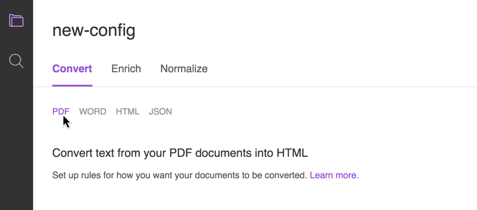

---

copyright:
  years: 2015, 2018, 2019
lastupdated: "2019-02-08"

subcollection: discovery

---

{:shortdesc: .shortdesc}
{:new_window: target="_blank"}
{:tip: .tip}
{:note: .note}
{:pre: .pre}
{:important: .important}
{:deprecated: .deprecated}
{:codeblock: .codeblock}
{:screen: .screen}
{:download: .download}
{:hide-dashboard: .hide-dashboard}
{:apikey: data-credential-placeholder='apikey'} 
{:url: data-credential-placeholder='url'}
{:curl: #curl .ph data-hd-programlang='curl'}
{:javascript: .ph data-hd-programlang='javascript'}
{:java: .ph data-hd-programlang='java'}
{:python: .ph data-hd-programlang='python'}
{:ruby: .ph data-hd-programlang='ruby'}
{:swift: .ph data-hd-programlang='swift'}
{:go: .ph data-hd-programlang='go'}

# Configuration de votre service
{: #configservice}

La création d'un service {{site.data.keyword.discoveryshort}} vous permettra d'obtenir des éclairages utiles en enrichissant vos propres données et en les fournissant sous une forme interrogeable.
{: shortdesc}

Avant d'ajouter votre propre contenu au service {{site.data.keyword.discoveryshort}}, vous devez configurer le service pour qu'il traite le contenu comme vous le souhaitez.

La première étape consiste à configurer les paramètres de base du service ([Préparation du service pour vos documents](/docs/services/discovery?topic=discovery-configservice#preparing-the-service-for-your-documents)). Cela implique notamment de créer un environnement et de créer une ou plusieurs collections dans cet environnement. 

Si votre collection a été créée avant la sortie de [Smart Document Understanding](/docs/services/discovery?topic=discovery-sdu#sdu), vous pouvez spécifier une ou plusieurs configurations personnalisées (voir [Lorsque vous avez besoin d'une configuration personnalisée](/docs/services/discovery?topic=discovery-configservice#when-you-need-a-custom-configuration)). Si tel est le cas, vous devrez procéder comme suit :

-   identifier un exemple de contenu (documents qui sont représentatifs de vos fichiers)
-   télécharger le contenu ([Téléchargement d'exemples de document](/docs/services/discovery?topic=discovery-configservice#uploading-sample-documents))
-   ajuster le processus de conversion ([Conversion d'exemples de document](/docs/services/discovery?topic=discovery-configservice#converting-sample-documents))
-   définir des enrichissements ([Ajout d'enrichissements](/docs/services/discovery?topic=discovery-configservice#adding-enrichments))
-   normaliser les résultats ([Normalisation de données](/docs/services/discovery?topic=discovery-configservice#normalizing-data))

    Après avoir créé votre configuration personnalisée, vous pouvez télécharger vos documents ([Ajout de contenu](/docs/services/discovery?topic=discovery-addcontent#addcontent)).

## Préparation du service pour vos documents
{: #preparing-the-service-for-your-documents}

Dans le service {{site.data.keyword.discoveryshort}}, le contenu que vous avez téléchargé est stocké dans une collection qui fait partie de votre environnement. Vous devez créer l'environnement et la collection avant de pouvoir télécharger votre contenu.

-   **Environnement** — L'environnement définit la quantité d'espace de stockage dont vous disposez pour le contenu dans le service {{site.data.keyword.discoveryshort}}. Un environnement au maximum peut être créé pour chaque instance du service {{site.data.keyword.discoveryshort}}.

    Plusieurs plans (Lite, Advanced, Premium) sont à votre disposition. Consultez le catalogue [{{site.data.keyword.discoveryshort}}](https://{DomainName}/catalog/services/discovery){: new_window} et les plans de tarification [{{site.data.keyword.discoveryshort}}](/docs/services/discovery?topic=discovery-discovery-pricing-plans#discovery-pricing-plans) pour plus de détails. Vos fichiers source ne sont pas pris en compte pour la taille limite de votre plan, seule la taille du fichier JSON converti indexé est comptabilisée.

-   **Collection** — Une collection est un regroupement de votre contenu au sein de l'environnement. Vous devez créer au moins une collection pour pouvoir télécharger votre contenu.

    Les collections sont constituées de vos données privées, mais {{site.data.keyword.discoveryshort}} comprend également {{site.data.keyword.discoverynewsshort}}, un fichier public pré-enrichi. 

    {{site.data.keyword.discoverynewsshort}}, fichier public qui a été pré-enrichi avec des renseignements cognitifs, est également inclus avec {{site.data.keyword.discoveryshort}}. Vous pouvez l'utiliser pour lancer une requête portant sur des connaissances, par exemple, un système d'alertes sur des actualités, la détection d'événements et les sujets tendance dans les articles d'actualité, que vous pouvez intégrer à vos applications. Pour plus d'informations, voir [Watson Discovery News](/docs/services/discovery?topic=discovery-watson-discovery-news#watson-discovery-news). Vous ne pouvez pas ajuster la configuration de {{site.data.keyword.discoverynewsshort}} ni ajouter de documents à cette collection. Regardez une démonstration illustrant ce que vous pouvez créer avec {{site.data.keyword.discoverynewsshort}} [en cliquant ici ](https://discovery-news-demo.ng.bluemix.net/){: new_window}.

Pour créer un environnement et une collection de données privées à l'aide des outils {{site.data.keyword.discoveryshort}}, procédez comme suit :

1.  Sur l'écran **Manage Data**, cliquez sur l'icône  dans le coin supérieur droit puis sélectionnez **Create environment**. L'environnement est créé à partir du plan {{site.data.keyword.Bluemix_notm}} que vous avez sélectionné précédemment. Le statut de votre environnement est toujours disponible à partir de cette liste déroulante.

1.  Une fois votre environnement prêt, cliquez sur le bouton **Upload your own data**, puis vous pouvez donner un nom à votre nouvelle collection (**Name your new collection**).

     Vous pouvez sélectionner la langue des documents que vous ajouterez à cette collection : anglais, allemand, espagnol, arabe, japonais, français, italien, coréen ou portugais brésilien. Chacune de vos collections ne doit comporter qu'une seule langue. Après que vous avez cliqué sur**Create**, votre collection de données s'affiche en mosaïque.

Votre environnement et votre collection de données sont prêts ! Vous pouvez commencer à [ajouter du contenu](/docs/services/discovery?topic=discovery-addcontent#addcontent) immédiatement. 

Toutefois, si vous souhaitez personnaliser votre configuration {{site.data.keyword.discoveryshort}} avec des paramètres de conversion et des enrichissements supplémentaires, n'ajoutez pas de documents dès maintenant, mais créez plutôt votre fichier de configuration personnalisé. Voir [Configuration de votre service](/docs/services/discovery?topic=discovery-configservice#custom-configuration).

Si votre collection a été créée en utilisant [Smart Document Understanding](/docs/services/discovery?topic=discovery-sdu#sdu), il peut être préférable d'ajuster vos enrichissements à l'aide des outils {{site.data.keyword.discoveryshort}}.
{: note}

Pour les collections créées avant la sortie de Smart Document Understanding, les documents téléchargés dans une collection de données sont convertis et enrichis à l'aide du fichier de configuration choisi pour cette collection. Il est possible ensuite de changer de fichier de configuration mais les documents que vous avez déjà téléchargés resteront convertis via la configuration d'origine. Tous les documents téléchargés après le changement de fichier de configuration utiliseront le nouveau fichier de configuration. Si vous souhaitez que **toute** la collection utilise la nouvelle configuration, vous devrez créer une nouvelle collection, choisir ce nouveau fichier de configuration et télécharger à nouveau tous les documents. Le service {{site.data.keyword.discoveryshort}} stocke le texte converti des documents que vous avez téléchargés, les images imbriquées dans les fichiers **PDF** et **Microsoft Word** ne sont pas stockées et ne sont pas renvoyées dans les résultats. Si votre collection utilise [Smart Document Understanding](/docs/services/discovery?topic=discovery-sdu#sdu), toute modification apportée aux enrichissements et à la configuration dans {{site.data.keyword.discoveryshort}} s'applique à l'ensemble de la configuration lorsque vous cliquez sur le bouton **Apply changes to collection**. Si votre collection est de taille importante, l'application des modifications peut prendre du temps.  
{: important}

Vous pouvez utiliser l'API ou les outils {{site.data.keyword.discoveryshort}} pour explorer les sources de données Box, Salesforce, Microsoft SharePoint Online, IBM Cloud Object Storage et Microsoft SharePoint 2016 ou effectuer une exploration Web. Voir [Connexion à des sources de données](/docs/services/discovery?topic=discovery-sources#sources) pour plus d'informations.
{: tip}

### Configuration par défaut
{: #the-default-configuration}

Le service {{site.data.keyword.discoveryshort}} inclut une configuration standard qui convertira, enrichira et normalisera vos données sans qu'il soit nécessaire de configurer manuellement ces options.

Le fichier de configuration par défaut**** est disponible uniquement dans les collections créées avant la sortie de [Smart Document Understanding](/docs/services/discovery?topic=discovery-sdu#sdu). Toutefois, lors de l'utilisation de Smart Document Understanding, les mêmes enrichissements et conversions HTML et JSON seront utilisés par défaut dans vos collections.
{: note}

Lorsque vous créez une collection, {{site.data.keyword.discoveryshort}} enrichit (ajoute des métadonnées cognitives) la zone de `texte` de vos documents avec des informations sémantiques collectées par quatre enrichissements {{site.data.keyword.watson}} (Entity Extraction, Sentiment Analysis, Category Classification et Concept Tagging). Pour en savoir plus, cliquez [ici](/docs/services/discovery?topic=discovery-configservice#adding-enrichments). Des conversions de document standard basées sur des tailles et des styles de police sont également appliquées. Vous pouvez ajuster les enrichissements ultérieurement, en utilisant l'onglet **Overview**. Cette configuration est nommée **Default Configuration** dans les collections créées avant la sortie de [Smart Document Understanding](/docs/services/discovery?topic=discovery-sdu#sdu).

Conversions par défaut :

-   [Conversion Microsoft Word](/docs/services/discovery?topic=discovery-configservice#microsoft-word-conversion)
-   [Conversion PDF](/docs/services/discovery?topic=discovery-configservice#pdf-conversion)
-   [Conversion HTML](/docs/services/discovery?topic=discovery-configservice#html-conversion)
-   [Conversion JSON](/docs/services/discovery?topic=discovery-configservice#json-conversion)

Une configuration nommée **Default Contract Configuration** est disponible lorsque vous créez une collection avec les outils {{site.data.keyword.discoveryshort}}. Elle est configurée pour s'enrichir avec Element Classification, et peut être utilisée pour extraire la partie prenante, la nature et la catégorie d'éléments dans des fichiers PDF. Voir [Element Classification](/docs/services/discovery?topic=discovery-element-classification#element-collection) pour plus de détails. Smart Document Understanding n'est pas disponible lorsque ce fichier de configuration est utilisé.

Si vous souhaitez créer une configuration personnalisée pour les collections créées avant la publication de [Smart Document Understanding](/docs/services/discovery?topic=discovery-sdu#sdu), voir [Configuration personnalisée](/docs/services/discovery?topic=discovery-configservice#custom-configuration).

### Lorsque vous avez besoin d'une configuration personnalisée
{: #when-you-need-a-custom-configuration}

Ces informations s'appliquent uniquement aux collections créées avant la sortie de [Smart Document Understanding](/docs/services/discovery?topic=discovery-sdu#sdu).
{: note}

Le service {{site.data.keyword.discoveryshort}} doit vous permettre d'obtenir les informations appropriées à partir de votre contenu et de les transmettre à vos utilisateurs. Ces informations sont identifiées et leur mode de stockage dans votre contenu est déterminé par la configuration que vous utilisez pour ingérer le contenu. Les types de contenu que le service {{site.data.keyword.discoveryshort}} peut ingérer sont flexibles, ce qui signifie que même si votre contenu non structuré est sauvegardé dans un format spécifique, il n'est pas nécessaire que la structure de ce contenu corresponde à la structure d'un autre contenu de même type.

-   **Je comprends que mes documents ne doivent pas être nécessairement structurés comme attendu par la configuration par défaut. *Comment savoir si les paramètres par défaut me conviennent ?***
    -   Le moyen le plus simple de savoir si les valeurs par défaut vous conviennent est de les tester en [téléchargeant des exemples de document](/docs/services/discovery?topic=discovery-configservice#uploading-sample-documents). Si les exemples de résultat JSON sont conformes à vos attentes, aucune configuration supplémentaire n'est requise.
-   **Je comprends que des enrichissements par défaut sont ajoutés à la zone de texte de mes documents. Puis-je ajouter des enrichissements supplémentaires à d'autres zones ?**
    -   Vous pouvez tout à fait ajouter des enrichissements supplémentaires à autant de zones que vous le souhaitez. Pour plus d'informations, voir [Ajout d'enrichissements](/docs/services/discovery?topic=discovery-configservice#adding-enrichments).

## Configuration personnalisée
{: #custom-configuration}

Ces informations s'appliquent uniquement aux collections créées avant la sortie de [Smart Document Understanding](/docs/services/discovery?topic=discovery-sdu#sdu).
{: note}

Pour créer une configuration personnalisée dans les outils {{site.data.keyword.discoveryshort}}, ouvrez une collection de données privées et sur l'écran **Manage Data**, cliquez sur **Switch** en regard du nom de votre **Configuration**. Dans la boîte de dialogue **Switch configuration**, cliquez sur **Create a new configuration**.

Une fois le nouveau fichier de configuration nommé, ce nom apparaîtra en haut de l'écran de configuration. Ce nouveau fichier de configuration contiendra automatiquement les paramètres et les enrichissements du fichier [Default configuration](/docs/services/discovery?topic=discovery-configservice#the-default-configuration) pour vous permettre de commencer.

Les trois étapes de personnalisation d'un fichier de configuration sont les suivantes : **Convertir**, **Enrichir** et **Normaliser**.

1.  [Conversion d'exemples de document](/docs/services/discovery?topic=discovery-configservice#converting-sample-documents)
1.  [Ajout d'enrichissements](/docs/services/discovery?topic=discovery-configservice#adding-enrichments) (l'onglet correspondant est disponible lors de l'utilisation de Smart Document Configuration.)
1.  [Normalisation de données](/docs/services/discovery?topic=discovery-configservice#normalizing-data)

Pour des informations détaillées sur les configurations, voir [Référence de configuration](/docs/services/discovery?topic=discovery-configref#configref).

### Téléchargement d'exemples de document
{: #uploading-sample-documents}

Ces informations s'appliquent uniquement aux collections créées avant la sortie de [Smart Document Understanding](/docs/services/discovery?topic=discovery-sdu#sdu).
{: note}

Pour rendre le processus de configuration plus efficace, vous pouvez télécharger jusqu'à dix fichiers Microsoft Word, HTML, JSON ou PDF qui sont représentatifs de votre jeu de documents. Ces fichiers sont appelées **exemples de document**. Ces derniers ne sont pas ajoutés à votre collection, ils sont uniquement utilisés pour identifier les zones communes à vos documents et pour personnaliser ces zones en fonction de vos exigences.

Lorsque vous créez un nouveau fichier de configuration dans les outils {{site.data.keyword.discoveryshort}}, vous pouvez télécharger des exemples de document via la fonction transférer ou le bouton Browse. Cliquez sur le nom de fichier dans le panneau **Upload Sample Documents** pour prévisualiser chaque fichier.

#### Tenez compte des points suivants lorsque vous téléchargez des exemples de document :

-   Tous vos documents sont convertis au format JSON avant d'être enrichis et indexés.
-   Les documents Microsoft Word et PDF sont convertis au format HTML, puis au format JSON.
-   Les documents HTML sont directement convertis au format JSON.
-   La taille de fichier maximale pour un exemple de document est de 1 Mo. Des exemples de document sont stockés dans le dossier local des données itinérantes de votre navigateur. Pour supprimer ces exemples, cliquez sur l'icône **Delete**.

#### Conseils pour choisir de bons exemples de document :

-   Vous devez disposer d'au moins un exemple de document pour chaque type de fichier que vous tentez d'ingérer, Microsoft Word, PDF, HTML et JSON. (Vous ne pouvez pas prévisualiser des documents PDF enrichis avec l'enrichissement **Element Classification**.)
-   Si vous avez un type de document unique (par exemple, des rapports financiers ou des articles de presse), ajoutez un de chaque à votre groupe d'exemples de document.
-   Pour les documents HTML, vous devez choisir des documents qui comportent les balises HTML que vous souhaitez exclure, ainsi que les attributs de balise que vous souhaitez inclure ou exclure.
-   Les documents JSON doivent inclure n'importe quelle zone que vous souhaitez retirer ou fusionner (par exemple, zipCode et postalCode).

### Conversion d'exemples de document
{: #converting-sample-documents}

Ces informations s'appliquent uniquement aux collections créées avant la sortie de [Smart Document Understanding](/docs/services/discovery?topic=discovery-sdu#sdu).
{: note}

Le processus de conversion de vos exemples de document vous permet de définir le mode de traitement de chaque type d'entrée. Le type de fichier de contenu que vous téléchargez dicte le nombre d'étapes de conversion que vous devrez prendre en considération.

Avant de commencer, [téléchargez vos exemples de document](/docs/services/discovery?topic=discovery-configservice#uploading-sample-documents) et ouvrez un exemple de document pour le type de fichier que vous souhaitez configurer dans le panneau sur la droite.

Pour gérer les paramètres de conversion, cliquez sur les types de fichier.



-   **Si vous convertissez des fichiers Microsoft Word, vous devez procéder comme suit :**
    -   Définir les options de conversion Microsoft Word
    -   Définir les options de conversion HTML
    -   Définir les options de conversion JSON
    -   Passer en revue le résultat

-   **Si vous convertissez des fichiers PDF, vous devez procéder comme suit :**
    -   Définir les options de conversion PDF
    -   Définir les options de conversion HTML
    -   Définir les options de conversion JSON
    -   Passer en revue le résultat

-   **Si vous convertissez des fichiers HTML, vous devez procéder comme suit :**
    -   Définir les options de conversion HTML
    -   Définir les options de conversion JSON
    -   Passer en revue le résultat

-   **Si vous convertissez des fichiers JSON**, vous devez définir les options de conversion JSON et passer en revue le résultat.

Pour chaque fichier de configuration que vous créez, il n'existe qu'un seul groupe d'options de conversion pour chaque étape du processus. Cela signifie que les options de conversion HTML seront identiques pour les fichiers PDF, les fichiers Word et les fichiers HTML. Si vous avez besoin d'options de conversion différentes pour chaque type de contenu que vous ingérez (ou si certains de vos fichiers du même type nécessiteront différents types de conversion), vous devrez stocker vos fichiers dans des collections différentes et créer des fichiers de configuration distincts pour chaque groupe de paramètres de conversion.

#### Conversion Microsoft Word
{: #microsoft-word-conversion}

Les tailles et les styles de police Microsoft Word sont utilisés pour convertir correctement les en-têtes de vos documents en H1, H2, etc. Les H1 représentent les titres de document et les H2 et les éléments de niveau inférieur représentent des sous-titres. Utilisez les zones de texte et les boutons d'option pour modifier les paramètres par défaut si vous le souhaitez. Vous pouvez également ajouter des niveaux d'en-tête et des styles Word supplémentaires. Si vos documents Word ont tendance à utiliser une police ou un nom de style spécifique pour les en-têtes, prenez soin d'ajouter ces informations. Cela vous permettra d'améliorer votre conversion, ce qui produira de meilleurs résultats de requête.

**Exemple :** si une police de 20 points, en italiques est utilisée couramment dans vos documents Word pour l'en-tête 2s, remplacez la valeur **20** du paramètre **Font size range** par la valeur **23** et affectez la valeur **italic** au paramètre **Font style**.

Une fois que vous avez apporté des modifications, cliquez sur **Apply and Save**.

#### Conversion PDF
{: #pdf-conversion}

Les tailles et les noms de police PDF sont utilisés pour convertir correctement les en-têtes de vos documents en H1, H2, etc. Les H1 représentent les titres de document et les H2 et les éléments de niveau inférieur représentent des sous-titres. Utilisez les zones de texte et les boutons d'option pour modifier les paramètres par défaut si vous le souhaitez. Vous pouvez également ajouter des niveaux d'en-tête supplémentaires. Si vos documents PDF ont tendance à utiliser une police spécifique pour les en-têtes, prenez soin d'ajouter cette information. Cela vous permettra d'améliorer votre conversion, ce qui produira de meilleurs résultats de requête.

**Exemple :** si une police de 20 points, en gras, est utilisée couramment dans vos documents PDF pour l'en-tête 1s, remplacez la valeur **20** du paramètre **Font size range** par la valeur **80** et affectez la valeur **bold** au paramètre **Font style**. Ajustez les autres niveaux en conséquence.

Une fois que vous avez apporté des modifications, cliquez sur **Apply and Save**.

#### Conversion HTML
{: #html-conversion}

Vous pouvez utiliser cette étape pour retirer les balises inutiles et d'autres informations de document afin de conserver uniquement les informations dont vous avez besoin pour vos requêtes.

Paramètres HTML par défaut :

- Exclure les balises suivantes, ainsi que leur contenu : **`script`**, **`sup`**
- Exclure les balises suivantes et conserver leur contenu : **`font`**, **`em`**, **`span`**
- Conserver les attributs de balise suivants : aucune valeur par défaut
- Exclure les attributs de balise suivants : **`EVENT_ACTIONS`**
- Conserver le contenu qui correspond à ces XPath : aucune valeur par défaut
- Exclure le contenu qui correspond à ces XPath : aucune valeur par défaut

Une fois que vous avez apporté des modifications, cliquez sur **Apply and Save**.

#### Conversion JSON
{: #json-conversion}

La dernière étape de la conversion consiste à vous assurer que le format du contenu JSON converti (ou téléchargé) est conforme à vos souhaits avant que des enrichissements ne lui soient appliqués. Vous pouvez créer des règles qui seront utilisées par {{site.data.keyword.watson}} pour convertir votre contenu HTML en contenu JSON.

-   Vous pouvez déplacer, fusionner, copier ou retirer des zones. Par exemple, vous souhaiterez peut-être fusionner **`zipCode`** et  **`postalCode`** car il s'agit de deux termes similaires pour la même zone.
-   Les zones vides (qui ne contiennent aucune information) seront supprimées par défaut. Vous pouvez modifier cela en utilisant l'option à bascule **Remove empty fields**.

Une fois que vous avez apporté des modifications, cliquez sur **Apply and Save**.

## Ajout d'enrichissements
{: #adding-enrichments}

La configuration par défaut {{site.data.keyword.discoveryshort}}[](/docs/services/discovery?topic=discovery-configservice#the-default-configuration) va enrichir (ajouter des métadonnées cognitives) la zone de `texte` de vos documents ingérés avec des informations sémantiques collectées par quatre fonctions {{site.data.keyword.watson}} (Entity Extraction, Sentiment Analysis, Category Classification et Concept Tagging). Au total, neuf enrichissements {{site.data.keyword.watson}} sont disponibles ; les autres sont Keyword Extraction, Relation Extraction, Emotion Analysis, Element Classification et Semantic Role Extraction. 

Certains enrichissements {{site.data.keyword.watson}} peuvent ne pas être disponibles dans certains plans ou environnements.

Vous pouvez également intégrer un ou plusieurs modèles personnalisés à partir d'{{site.data.keyword.knowledgestudiofull}} au service {{site.data.keyword.discoveryshort}} afin de fournir des enrichissements d'entité et de relations personnalisés. Pour plus d'informations, voir [Intégration à Watson Knowledge Studio](/docs/services/discovery?topic=discovery-integrating-with-wks#integrating-with-wks).

Seuls les 50 000 premiers caractères de chaque zone JSON sélectionnée pour enrichissement seront enrichis.
{: important}

**Remarque :** Les enrichissements {{site.data.keyword.alchemylanguageshort}} ont été dépréciés à la date du 1er mars 2018. Si vous possédez des collections utilisant des enrichissements {{site.data.keyword.alchemylanguageshort}}, vous devez migrer vers les enrichissements {{site.data.keyword.nlushort}}. Pour plus d'informations sur la migration de collections et fichiers de configuration existants qui utilisent les enrichissements {{site.data.keyword.alchemylanguageshort}}, voir [Migration des enrichissements vers {{site.data.keyword.nlushort}}](/docs/services/discovery?topic=discovery-migrate-nlu#migrate-nlu).

Vous pouvez étendre davantage vos documents en ajoutant d'autres enrichissements à la zone de `texte` ou en enrichissant d'autres zones. Pour effectuer cette action en utilisant Smart Document Understanding dans les outils {{site.data.keyword.discoveryshort}}, ouvrez l'onglet **Enrich Fields**. Pour les collections créées avant Smart Document Understanding, [créez une configuration personnalisée](/docs/services/discovery?topic=discovery-configservice#custom-configuration), choisissez la ou les zone(s) que vous souhaitez enrichir et effectuez une sélection dans la liste d'enrichissements {{site.data.keyword.nlushort}} disponibles :

### Entity Extraction
{: #entity-extraction}

Renvoie des éléments, tels que des personnes, des espaces et des organisations qui sont présents dans le texte d'entrée. La fonction Entity Extraction ajoute des connaissances sémantiques au contenu pour mieux comprendre le sujet et le contexte du texte en cours d'analyse. Les techniques Entity Extraction sont basées sur des algorithmes statistiques sophistiqués et sur une technologie de traitement automatique du langage naturel. Elles sont uniques dans le secteur d'activité car elles prennent en charge l'analyse multilingue et l'éclaircissement contextuel. Consultez la liste complète des types et sous-types d'entité [ici](/docs/services/discovery?topic=discovery-entity-types-and-subtypes#entity-types-and-subtypes). Vous pouvez également créer et ajouter un [modèle d'entité personnalisé](/docs/services/discovery?topic=discovery-configservice#custom-entity-model) à l'aide de {{site.data.keyword.knowledgestudiofull}}.

Exemple de partie d'un document enrichie à l'aide d'Entity Extraction :

```json
{
  "text": "The stockholders were pleased that Acme Corporation plans to build a new factory in Atlanta, Georgia.",
    "enriched_text": {
    "entities": [
         {
        "count": 1,
           "sentiment": {
          "score": 0
        },
           "text": "Acme Corporation",
           "relevance": 0.98389,
           "type": "Company"
      },
      {
        "count": 1,
           "sentiment": {
          "score": 0
        },
           "text": "Atlanta",
           "relevance": 0.532754,
           "type": "Location",
           "disambiguation": {
          "subtype": [
            "AdministrativeDivision",
               "GovernmentalJurisdiction",
               "OlympicHostCity",
               "PlaceWithNeighborhoods",
               "City"
          ],
                  "name": "Atlanta",
                  "dbpedia_resource": "http://dbpedia.org/resource/Atlanta"
                }
      },
      {
        "count": 1,
           "sentiment": {
          "score": 0
        },
           "text": "Georgia",
           "relevance": 0.469643,
           "type": "Location",
           "disambiguation": {
          "subtype": [
            "StateOrCounty"
                  ]
        }
      }
    ]
  }
}
```
{: codeblock}

Dans l'exemple précédent, vous pouvez faire une requête portant sur le type d'entité en accédant à `enriched_text.entities.type`

L'élément `sentiment` est calculé pour les types d'entité même si l'enrichissement **sentiment** n'est pas sélectionné. Pour en savoir plus sur l'évaluation de l'élément sentiment, voir [Sentiment Analysis](/docs/services/discovery?topic=discovery-configservice#sentiment-analysis).

L'élément `relevance` est compris entre `0.0` et `1.0`. Plus le score est élevé, plus l'entité est pertinente. La zone `disambiguation` contient les informations d'éclaircissement pour l'entité, ce qui inclut les informations `subtype` de l'entité et les liens vers la ou les ressource(s), le cas échéant. L'élément `count` correspond nombre de fois que l'entité est mentionnée dans le document.

#### Utilisation d'un modèle entité personnalisé
{: #custom-entity-model}

Si vous souhaitez créer un modèle d'enrichissement personnalisé, vous pouvez le faire dans {{site.data.keyword.knowledgestudiofull}} et importer le modèle dans {{site.data.keyword.discoveryshort}} en ajoutant l'ID dans la zone `Custom Model ID` des outils {{site.data.keyword.discoveryshort}}. Pour plus d'informations sur l'intégration à {{site.data.keyword.knowledgestudiofull}}, voir [Intégration à {{site.data.keyword.knowledgestudiofull}}](/docs/services/discovery?topic=discovery-integrating-with-wks#integrating-with-wks). Le modèle {{site.data.keyword.knowledgestudiofull}} personnalisé remplacera l'enrichissement Entity Extraction par défaut.

**Remarque :** seul le modèle {{site.data.keyword.knowledgestudiofull}} peut être affecté à un enrichissement.

### Relation Extraction
{: #relation-extraction}

Reconnaît que deux entités sont liées et identifie le type de relation qui les unit. Vous pouvez également créer et ajouter un [modèle de relation personnalisé](/docs/services/discovery?topic=discovery-configservice#custom-relation-model) à l'aide de {{site.data.keyword.knowledgestudiofull}}.

Consultez la liste complète des types de relation [ici](/docs/services/discovery?topic=discovery-relation-types#relation-types).

Exemple de partie d'un document enrichie à l'aide de Relation  Extraction :

```json
{
  "text": "The stockholders were pleased that Acme Corporation plans to build a new factory in Atlanta, Georgia.",
    "enriched_text": {
    "relations": [
      {
        "type": "locatedAt",
        "sentence": "The stockholders were pleased that Acme Corporation plans to build a new factory in Atlanta, Georgia.",
        "score": 0.989245,
        "arguments": [
         {
            "text": "Atlanta",
            "location": [
             94,
             101
            ],
            "entities": [
              {
                "type": "GeopoliticalEntity",
                "text": "Atlanta"
              }
            ]
         },
          {
            "text": "Georgia",
            "location": [
             103,
             110
            ],
            "entities": [
              {
                "type": "GeopoliticalEntity",
                "text": "Georgia"
              }
            ]
          }
        ]
      }
    ]
  }
}
```
{: codeblock}

Dans l'exemple précédent, vous pouvez faire une requête portant sur le type de relation en accédant à `enriched_text.relations.type`

Les entités associées sont répertoriées dans `arguments`. Vous pouvez consulter les types d'entité identifiables par l'enrichissement Relation Extraction [ici](/docs/services/discovery?topic=discovery-relation-types#specific-entity-types).

L'élément `score` est compris entre `0.0` et `1.0`. Plus le score est élevé, plus la relation est pertinente.

#### Utilisation d'un modèle de relation personnalisé
{: #custom-relation-model}

Si vous souhaitez créer un modèle d'enrichissement personnalisé, vous pouvez le faire dans {{site.data.keyword.knowledgestudiofull}} et importer le modèle dans {{site.data.keyword.discoveryshort}} en ajoutant l'ID dans la zone `Custom Model ID` des outils {{site.data.keyword.discoveryshort}}. Pour plus d'informations sur l'intégration à {{site.data.keyword.knowledgestudiofull}}, voir [Intégration à {{site.data.keyword.knowledgestudiofull}}](/docs/services/discovery?topic=discovery-integrating-with-wks#integrating-with-wks). Le modèle {{site.data.keyword.knowledgestudiofull}} personnalisé remplacera l'enrichissement Relation Extraction par défaut.

**Remarque :** seul le modèle {{site.data.keyword.knowledgestudiofull}} peut être affecté à un enrichissement.

### Keyword Extraction
{: #keyword-extraction}

Rubriques importantes de votre contenu généralement utilisées lors de l'indexation de données, la génération de nuages d'étiquettes ou les recherches. Le service {{site.data.keyword.discoveryshort}} identifie automatiquement les langues prises en charge dans votre contenu d'entrée, puis identifie et classe les mots clés dans ce contenu.

Exemple de partie d'un document enrichie à l'aide de Keyword Extraction :

```json
  {
  "text": "The stockholders were pleased that Acme Corporation plans to build a new factory in Atlanta, Georgia.",
    "enriched_text": {
      "keywords": [
        {
          "text": "Acme Corporation",
          "sentiment": {
            "score": 0
          },
          "relevance": 0.985203
        },
        {
          "text": "new factory",
          "sentiment": {
            "score": 0
          },
          "relevance": 0.821033
        },
        {
          "text": "stockholders",
          "sentiment": {
            "score": 0
          },
          "relevance": 0.66497
        },
        {
          "text": "title",
          "sentiment": {
            "score": 0
          },
          "relevance": 0.332438
        },
        {
          "text": "Atlanta",
          "sentiment": {
            "score": 0
          },
          "relevance": 0.307723
        },
        {
          "text": "Georgia",
          "sentiment": {
            "score": 0
          },
          "relevance": 0.306485
        }
      ]
    }
  }
```
{: codeblock}

Dans l'exemple précédent, vous pouvez faire une requête portant sur le mot clé en accédant à `enriched_text.keywords.text`

L'élément `sentiment` est calculé pour les mots-clés même si l'enrichissement **sentiment** n'est pas sélectionné. Pour en savoir plus sur l'évaluation de l'élément sentiment, voir [Sentiment Analysis](/docs/services/discovery?topic=discovery-configservice#sentiment-analysis).

L'élément `relevance` est compris entre `0.0` et `1.0`. Plus le score est élevé, plus le mot clé est pertinent.

### Category Classification
{: #category-classification}

Permet de catégoriser un texte d'entrée, un contenu HTML ou un contenu Web dans une taxonomie hiérarchique de cinq niveaux au maximum. Les niveaux les plus profonds vous permettent de classifier le contenu dans des sous-segments plus précis et utiles. Consultez la liste complète des catégories [ici](/docs/services/discovery?topic=discovery-cathierarchy#cathierarchy).

Exemple de partie d'un document enrichie à l'aide de Category Classification :

```json
{
  "text": "The stockholders were pleased that Acme Corporation plans to build a new factory in Atlanta, Georgia.",
    "enriched_text": {
      "categories": [
        {
          "score": 0.361614,
          "label": "/business and industrial"
        },
        {
          "score": 0.329377,
          "label": "/business and industrial/company/merger and acquisition"
        },
        {
          "score": 0.154254,
          "label": "/business and industrial/business operations/business plans"
        }
      ]
```
{: codeblock}

Dans l'exemple précédent, vous pouvez faire une requête portant sur le libellé de catégorie en accédant à `enriched_text.categories.label`

L'élément `label` est la catégorie détectée. Les niveaux de structure hiérarchique sont séparés par des barres obliques. L'élément `score` pour cette catégorie est compris entre `0.0` et `1.0`. Plus le score est élevé, plus le niveau de confiance dans cette catégorie est élevé.

### Concept Tagging
{: #concept-tagging}

Identifie les concepts auxquels le texte d'entrée est associé, en fonction d'autres concepts et entités présents dans ce texte. La fonction Concept Tagging comprend de quelle façon les concepts sont liés et peut identifier les concepts qui ne sont pas directement référencés dans le texte. Par exemple, si un article mentionne CERN et le boson de Higgs, les fonctions Concepts API identifieront Large Hadron Collider comme un concept même si ce terme n'est pas mentionné explicitement sur la page. La fonction Concept Tagging permet d'effectuer des analyses de contenu d'entrée de niveau supérieure par rapport à celles de l'identification de mot clé de base.

Exemple de partie d'un document enrichie à l'aide de Concept Tagging :

```json
{
  "text": "The stockholders were pleased that Acme Corporation plans to build a new factory in Atlanta, Georgia.",
    "enriched_text": {
      "concepts": [
    {
          "text": "Acme Corporation",
          "relevance": 0.91136,
          "dbpedia_resource": "http://dbpedia.org/resource/Acme_Corporation"
        },
        {
          "text": "Factory",
          "relevance": 0.886784,
          "dbpedia_resource": "http://dbpedia.org/resource/Factory"
        }
      ]
```
{: codeblock}

Dans l'exemple précédent, vous pouvez faire une requête portant sur le type de texte de concept en accédant à `enriched_text.concepts.text`

L'élément `relevance` est compris entre `0.0` et `1.0`. Plus le score est élevé, plus le concept est pertinent. Des liens vers la ou les ressource(s) sont fournis, le cas échéant.

### Semantic Role Extraction
{: #semantic-role-extraction}

Identifie les relations subject, action et object dans les phrases du contenu d'entrée. Les informations de relation peuvent être utilisées pour identifier automatiquement l'achat de signaux, d'événements clés et d'autres actions importantes.

Exemple de partie d'un document enrichie à l'aide de Semantic Role Extraction :

```json
{
  "text": "The stockholders were pleased that Acme Corporation plans to build a new factory in Atlanta, Georgia.",
      "enriched_text": {
      "semantic_roles": [
        {
          "subject": {
            "text": "The stockholders",
            "keywords": [
              {
                "text": "stockholders"
              }
            ]
          },
          "sentence": " The stockholders were pleased that Acme Corporation plans to build a new factory in Atlanta, Georgia.",
          "object": {
            "text": "pleased that Acme Corporation plans to build a new factory in Atlanta, Georgia",
            "keywords": [
              {
                "text": "Acme Corporation"
              },
              {
                "text": "new factory"
              },
              {
                "text": "Atlanta"
              },
              {
                "text": "Georgia"
              }
            ],
            "entities": [
              {
                "type": "Company",
                "text": "Acme Corporation"
              },
              {
                "type": "Location",
                "text": "Atlanta",
                "disambiguation": {
                  "subtype": [
                    "AdministrativeDivision",
                    "GovernmentalJurisdiction",
                    "OlympicHostCity",
                    "PlaceWithNeighborhoods",
                    "CityTown",
                    "City"
                  ],
                  "name": "Atlanta",
                  "dbpedia_resource": "http://dbpedia.org/resource/Atlanta"
                }
              },
              {
                "type": "Location",
                "text": "Georgia",
                "disambiguation": {
                  "subtype": [
                    "StateOrCounty"
                  ]
                }
              }
            ]
          },
          "action": {
            "verb": {
              "text": "be",
              "tense": "past"
            },
            "text": "were",
            "normalized": "be"
          }
        }
      ]
```
{: codeblock}

Dans l'exemple précédent, vous pouvez faire une requête portant sur le texte de sujet de relation en accédant à `enriched_text.relations.subject.text`

L'élément `sentiment` est calculé pour les relations même si l'enrichissement **sentiment** n'est pas sélectionné. Pour en savoir plus sur l'évaluation de l'élément sentiment, voir [Sentiment Analysis](/docs/services/discovery?topic=discovery-configservice#sentiment-analysis). Ni `entities` ni `keywords` ne seront extraits (comme illustré dans l'exemple) sauf si vous sélectionnez également les enrichissements **entity** et **keyword**. Pour plus d'informations sur ces enrichissements, voir [Entity Extraction](/docs/services/discovery?topic=discovery-configservice#entity-extraction) et [Keyword Extraction](/docs/services/discovery?topic=discovery-configservice#keyword-extraction).

Les éléments `subject`, `action` et `object` sont extraits pour chaque phrase contenant une relation.

### Sentiment Analysis
{: #sentiment-analysis}

Identifie une attitude, des opinions ou des sentiments dans le contenu en cours d'analyse. Le service {{site.data.keyword.discoveryshort}} peut calculer le sentiment global dans un document, le sentiment pour des cibles spécifiées par l'utilisateur, le sentiment de niveau entité, le sentiment de niveau citation, le sentiment directionnel et le sentiment de niveau mot clé. La combinaison de ces aptitudes prend en charge une grande variété de cas d'utilisation qui vont de la surveillance des médias sociaux à l'analyse des tendances.

Exemple de partie d'un document enrichie à l'aide de Sentiment Analysis :

```json
{
  "text": "The stockholders were pleased that Acme Corporation plans to build a new factory in Atlanta, Georgia.",
    "enriched_text": {
      "sentiment": {
        "document": {
        "score": 0.459813,
        "label": "positive"
  }
}
```
{: codeblock}

Dans l'exemple précédent, vous pouvez faire une requête portant sur le libellé de sentiment en accédant à `enriched_text.sentiment.document.label`

L'élément `label` est le sentiment global du document (`positive`, `negative` ou `neutral`). Le  `label` de sentiment est basé sur l'élément `score`. Le score `0.0` indique que le document est neutre (`neutral`), un nombre positif indique que le document est positif (`positive`), un nombre négatif indique que le document est négatif (`negative`).

### Emotion Analysis
{: #emotion-analysis}

Détecte la colère, le dégoût, la peur, la joie et la tristesse suggérés dans le texte anglais. Les fonction Emotion Analysis peut détecter des émotions qui sont associées à des phrases, des entités ou des mots clés ciblés ou elle peut analyser la tonalité affective globale de votre contenu.

Exemple de partie d'un document enrichie à l'aide de Emotion Analysis :

```json
{
  "text": "The stockholders were pleased that Acme Corporation plans to build a new factory in Atlanta, Georgia.",
    "enriched_text": {
      "emotion": {
        "document": {
          "emotion": {
          "disgust": 0.102578,
          "joy": 0.626655,
          "anger": 0.02303,
          "fear": 0.018884,
          "sadness": 0.096802
    }
  }
}
```
{: codeblock}

Dans l'exemple précédent, vous pouvez faire une requête portant sur l'émotion `joy` en accédant à `enriched_text.emotion.document.emotion.joy`

La fonction Emotion Analysis analyse votre texte et calcule un score pour chaque émotion (colère, dégoût, peur, joie, tristesse) sur une échelle de `0.0` à `1.0`. Si le score obtenu pour une émotion est `0.5` ou plus, cette émotion a été détectée (plus le score est supérieur à `0.5`, plus la pertinence est grande). Dans le fragment illustré, l'émotion `joy` est associée à un score supérieur à 0.5, par conséquent, {{site.data.keyword.watson}} a détecté de la joie.

**Remarque :** la fonction Emotion Analysis est prise en charge uniquement en anglais.

### Element Classification
{: #elements}

Effectue l'analyse syntaxique d'éléments (phrases, listes, tables) contenus dans des documents constitutifs afin de classifier les catégories et les types importants. Pour plus d'informations, voir [Element Classification](/docs/services/discovery?topic=discovery-element-classification#element-classification).

[Smart Document Understanding](/docs/services/discovery?topic=discovery-sdu#sdu) n'est pas disponible si cet enrichissement est utilisé.

#### Tarification des enrichissements
{: #enrichment-pricing}

Les informations sur la tarification des enrichissements sont disponibles sur le site [{{site.data.keyword.Bluemix_notm}} ](https://{DomainName}/catalog/services/discovery){: new_window}.

#### Support de langue pour les enrichissements
{: #enrichment-language-support}

Pour plus d'informations sur les langues prises en charge, voir [Support de langue {{site.data.keyword.discoveryshort}}](/docs/services/discovery?topic=discovery-language-support#language-support).

### Compréhension de la différence entre Entities, Concepts et Keywords
{: #udbeck}

A première vue, les enrichissements **Entity Extraction**, **Concept Tagging** et **Keyword Extraction** semblent similaires. Nous utiliseront le texte issu des exemples d'enrichissement pour montrer ce qui les différencie.

```json
"text": "The stockholders were pleased that Acme Corporation plans to build a new factory in Atlanta, Georgia."
```
{: codeblock}

Puisque l'enrichissement **Entity Extraction** extrait des personnes, des espaces et des organisations contenus dans le texte d'entrée, il renvoie les types d'entité suivants :

```json
"type": "City"
"text": "Atlanta"

"type": "Company"
"text": "Acme"

"type": "StateOrCounty"
"text": "Georgia"
```
{: codeblock}

Puisque l'enrichissement **Concept Tagging** comprend de quelle façon les concepts sont liés, il peut identifier des concepts qui ne sont pas directement référencés dans le texte. Par exemple, si un article mentionne CERN et le boson de Higgs, l'enrichissement identifiera Large Hadron Collider comme un concept même si ce terme n'est pas mentionné explicitement. Dans la mesure où le texte de notre exemple de document ne contient qu'une seule phrase, il n'y a pas de concepts connexes, par conséquent **Concept Tagging** renvoie les concepts suivants :

```json
"text": "Acme Corporation"
"text": "factory"
```
{: codeblock}

Dans la mesure où l'enrichissement **Keyword Extraction** identifie le contenu généralement utilisé lors de l'indexation de données, la génération de nuages d'étiquettes ou les recherches, **Keyword Extraction** renvoie les mots clé suivants :

```json
"text": "Acme Corporation"
"text": "new factory"
"text": "stockholders"
"text": "Atlanta"
"text": "Georgia"
```
{: codeblock}

Ces enrichissements fonctionnent ensemble pour vous aider à générer de meilleures requêtes.

## Normalisation de données
{: #normalizing-data}

Ces informations s'appliquent uniquement aux collections créées avant la sortie de [Smart Document Understanding](/docs/services/discovery?topic=discovery-sdu#sdu).
{: note}

La dernière étape relative à la personnalisation de votre fichier de configuration consiste à effectuer un nettoyage final. Ce processus est également appelé normalisation.

Dans la section **Normalize** des outils {{site.data.keyword.discoveryshort}} :

-   Vous pouvez déplacer, fusionner, copier ou retirer des zones.
-   Les zones vides (qui ne contiennent aucune information) seront supprimées par défaut. Vous pouvez modifier cela en utilisant l'option à bascule **Remove empty fields**.

Une fois que vous avez apporté des modifications, cliquez sur **Apply and Save**, puis sur **Done**. Vous revenez sur l'écran **Manage Data** à partir duquel vous pouvez appliquer cette configuration à la collection de votre choix.

**Remarque :** Vous ne pouvez pas spécifier le `data type` (par exemple : `text` or `date`) des zones. Lors de l'ingestion de documents, si une zone est détectée alors qu'elle n'existe pas encore dans l'index, {{site.data.keyword.discoveryshort}} détectera automatiquement le `data type` de cette zone en fonction de la valeur de la zone pour le premier document indexé.

Si vous utilisez l'enrichissement **Element Classification**, vous ne pouvez pas effectuer de normalisation post-enrichissement.

## Normalisation d'entités
{: #normalizing-entities}

### Utilisation de sélecteurs CSS pour extraire des zones
{: #using-css}

Vous pouvez effectuer une normalisation supplémentaire en utilisant des sélecteurs CSS via l'API Discovery.

Si vous ingérez du contenu HTML bien formé, vous pouvez le normaliser, utiliser des sélecteurs CSS pour en extraire des zones JSON, puis appliquer des enrichissements aux zones extraites. Editez votre fichier de configuration pour activer cette fonction. Plus spécifiquement, ajoutez un élément `extracted_fields` à la hiérarchie `conversions/html`, puis spécifiez des noms de zone, des sélecteurs CSS et des types de zone, comme suit :

```json
{
  "name": "Extract JSON config",
  "description": "New configuration enabling extraction of JSON fields from HTML",
  "conversions": {
    ...
    "html": {
      ...
      "extracted_fields": {
        "{field_name_1}": {
          "css_selector": "{CSS_selector_expression_1}",
          "type": "{field_type}"
        },
        ...
        "{field_name_N}": {
          "css_selector": "{CSS_selector_expression_N}",
          "type": "{field_type}"
        }
      }
    ...
    }
  }
}
```
{: codeblock}

Spécifiez des valeurs pour les nouvelles zones comme suit :

-   `field_name` - Nom de la zone qui sera ajoutée à la sortie JSON.
-   `CSS_selector_expression` - Sélecteur CSS qui doit être exécuté sur le contenu HTML d'entrée pour extraire les zones. L'expression peut comporter une ou plusieurs correspondances.

    Les sélecteurs CSS valides sont ceux qui sont spécifiés par l'[analyseur syntaxique JSoup](https://jsoup.org/apidocs/org/jsoup/select/Selector.html){: new_window} et sa [syntaxe de sélecteur ](https://jsoup.org/cookbook/extracting-data/selector-syntax){: new_window}. Une liste réduite est fournie dans la rubrique [Sélecteurs communs](/docs/services/discovery?topic=discovery-configservice#common-selectors).
-   `field_type` : valeur `array` ou `string`. Si le type de zone n'est pas spécifié, la valeur `array` est utilisée par défaut. Notez que le type `string` peut être enrichi, mais les informations stockées dans un `array` ne peuvent pas être enrichies sauf si les éléments du tableau sont d'abord extraits dans des zones de texte.

**Avertissement :** si un sélecteur CSS correspond à un noeud parent et à un ou plusieurs enfants, le contenu du texte des noeuds sera dupliqué dans la sortie JSON.

**Remarque :** les noms de zone doivent respecter les restrictions définies dans la rubrique [Exigences relatives aux noms de zone](/docs/services/discovery?topic=discovery-configref#field_reqs).

Le passage JSON ci-après présente la section appropriée du fichier Default Configuration à laquelle vous ajoutez les informations de sélecteur CSS.

```json
{
  "name": "Default Configuration",
  "description": "The configuration used by default when creating a new collection without specifying a configuration_id.",
  "conversions": {
    ...
    "html": {
      "exclude_tags_completely": [
        "script",
        "sup"
      ],
      "exclude_tags_keep_content": [
        "font",
        "em",
        "span"
      ],
      "exclude_content": {
        "xpaths": []
      },
      "keep_content": {
        "xpaths": []
      },
  "exclude_tag_attributes": [
        "EVENT_ACTIONS"
      ]
    }
    ...
  }
}
```
{: codeblock}

Le passage ci-après illustre la configuration avec un nouveau nom et une nouvelle description, ainsi que l'emplacement où vous pouvez spécifier des sélecteurs CSS.

```json
{
  "name": "Extract JSON config",
  "description": "New configuration enabling extraction of JSON fields from HTML",
  "conversions": {
    ...
    "html": {
      "exclude_tags_completely": [
        "script",
        "sup"
      ],
      "exclude_tags_keep_content": [
        "font",
        "em",
        "span"
      ],
      "exclude_content": {
        "xpaths": []
      },
      "keep_content": {
        "xpaths": []
      },
  "exclude_tag_attributes": [
        "EVENT_ACTIONS"
      ],
      "extracted_fields": {
        "{field_name_1}": {
          "css_selector": "{CSS_selector_expression_1}",
          "type": "{field_type}"
        },
        ...
        "{field_name_N}": {
          "css_selector": "{CSS_selector_expression_N}",
          "type": "{field_type}"
        }
      }
    }
  }
  ...
}
```
{: codeblock}

Enfin, le passage ci-après illustre la configuration avec un nouveau nom et une nouvelle description, ainsi que certains sélecteurs CSS. Les sélecteurs correspondent à des éléments dans un exemple HTML qui est décrit plus loin sur cette page.

```json
{
  "name": "Extract JSON config",
  "description": "New configuration enabling extraction of JSON fields from HTML",
  "conversions": {
    ...
    "html": {
      "exclude_tags_completely": [
        "script",
        "sup"
      ],
      "exclude_tags_keep_content": [
        "font",
        "em",
        "span"
      ],
      "exclude_content": {
        "xpaths": []
      },
      "keep_content": {
        "xpaths": []
      },
  "exclude_tag_attributes": [
        "EVENT_ACTIONS"
      ],
      "extracted_fields": {
        "chapters": {
          "css_selector": ".chapter",
          "type": "array"
        },
        "authors": {
          "css_selector": ".author"
        },
        "authors_str": {
          "css_selector": ".author",
          "type": "string"
        },
        "comments": {
          "css_selector": "[^comments-content]"
        }
      }
    }
  }
  ...
}
```
{: codeblock}

Si vous chargez le document HTML ci-après dans une collection qui utilise une configuration mise à jour, les sélecteurs CSS correspondent aux attributs et aux valeurs appropriés du document HTML.

```html
<html>
  <body>
    <div id="authors">
      <div class="author"><span class="first_name">Jane</span> <span class="last_name">Rain</span></div>
      <div class="author">Joe Snow</div>
  </div>
  <div class="chapter"><h1>The Rain in Spain</h1><p>falls mainly on the plain.</p></div>
  <div class="chapter"><h1>How I Learned to Stop Worrying</h1><p>and love my snowblower.</p></div>
  <span id="comments-section">
    <h4>Comments:</h4>
    <span id="comments-content-1">Rain gives me pain.</span>
    <span id="comments-content-2">All snow must go!</span>
  </span>
</body></html>
```
{: codeblock}

Une fois le texte HTML précédent ingéré et étendu, le service {{site.data.keyword.discoveryshort}} renvoie le texte JSON suivant :

```json
{
  "extracted_metadata": { ... },
  "html": "...",
  "text": "...",
  "extracted_fields": {
    "authors": [ "Jane Rain", "Joe Snow" ],
    "authors_str": "Jane Rain\n\nJoe Snow",
    "chapters": [ "The Rain in Spain\n\nfalls mainly on the plain.", "How I Learned to Stop Worrying\n\nand love my snowblower." ],
    "comments": [ "Rain gives me pain.", "All snow must go!" ]
  }
}
```
{: codeblock}

Après avoir déterminé les éléments HTML que vous souhaitez extraire, vous pouvez modifier davantage le fichier de configuration afin de spécifier les enrichissements à appliquer à ces éléments.

#### Sélecteurs communs
{: #common-selectors}

Voici quelques sélecteurs CSS communs :

  - `tag` - correspond au nom `tag`
  - `.class` - correspond à la valeur de `class`
  - `#id` - correspond à la valeur de `id`
  - `[attribute]` - correspond à n'importe quelle balise `attribute` spécifiée, quelle que soit la valeur
  - `[attribute=value]` ou `[attribute="value"]` - correspond aux valeurs `attribute` et `value` spécifiées

## Fractionnement de documents avec segmentation de document
{: #doc-segmentation}

En cas d'utilisation de Smart Document Understanding, n'utilisez pas la segmentation de document mais le [fractionnement de document](/docs/services/discovery?topic=discovery-sdu#splitting).
{: note}

Vous pouvez fractionner des documents Word, PDF et HTML en plusieurs segments basés sur des balises d'en-tête HTML. Une fois fractionné, chaque segment constitue un document distinct qui sera enrichi et indexé séparément. Dans la mesure où les requêtes renverront ces segments sous la forme de documents distincts, la segmentation de document peut être utilisée pour :

  - Effectuer des agrégations sur des segments individuels d'un document. Par exemple, votre agrégation peut prendre en compte chaque mention d'une entité spécifique dans un segment, au lieu de ne comptabiliser cette entité qu'une seule fois pour l'ensemble du document.
  - Effectuer une formation pour la pertinence sur des segments et non sur des documents, dans le but d'améliorer le nouveau classement des résultats.

Les segments sont créées lorsque les documents sont convertis au format HTML (les documents Word et PDF sont convertis au format HTML avant d'être convertis au format JSON). Les documents peuvent être fractionnés en fonction des balises HTML suivantes : `h1` `h2` `h3` `h4` `h5` et `h6`.

Remarques :

  - Le nombre de segments par document est limité à `250`. Tout contenu de document dépassant `249` segments sera stocké dans le segment `250`.

  - Chaque segment est pris en compte pour la limite de document de votre plan. {{site.data.keyword.discoveryshort}} indexe les segments jusqu'à ce que la limite du plan soit atteinte. Voir [Plans de tarification Discovery](/docs/services/discovery?topic=discovery-discovery-pricing-plans#discovery-pricing-plans) pour connaître les limites de documents.

  - Vous ne pouvez pas normaliser de données (voir [Normalisation de données](/docs/services/discovery?topic=discovery-configservice#normalizing-data)) ni utiliser des sélecteurs CSS pour extraire des zones (voir [Utilisation de sélecteurs CSS pour extraire des zones](/docs/services/discovery?topic=discovery-configservice#using-css)) lorsque la segmentation de document est utilisée.

  - Les documents seront segmentés chaque fois que la balise HTML spécifiée sera détectée. Par conséquent, il est à craindre que la segmentation génère des documents HTML mal formés car fractionnés avant les balises de fermeture et après les balises d'ouverture.

  - Les métadonnées HTML, PDF et Word, ainsi que les métadonnées personnalisées, sont extraites et incluses dans l'index avec chaque segment. Chaque segment d'un document inclut des métadonnées identiques.

  - La segmentation de document n'est pas prise en charge quand l'enrichissement **Element Classification** (`elements`) est spécifié.

  - La réingestion d'un document segmenté implique des considérations supplémentaires ; voir [Mise à jour d'un document segmenté](/docs/services/discovery?topic=discovery-configservice#update-seg).

### Exécution de la segmentation
{: #performing-segmentation}

En cas d'utilisation de Smart Document Understanding, n'utilisez pas la segmentation de document mais le [fractionnement de document](/docs/services/discovery?topic=discovery-sdu#splitting).
{: note}

La segmentation est configurée via l'API dans la section `conversions`.

```json
{
  "configuration_id": "a23c467d-1212-4b3a-5555-93e788a3622a",
  "name": "Example configuration",
  "conversions": {
    "segment": {
      "enabled": true,
      "selector_tags": ["h1", "h2", "h3", "h4", "h5", "h6"]
    }
  }
}
```
{: codeblock}

`enabled` - la valeur `true` active la segmentation de document.

`selector_tags` est un tableau qui spécifie les balises heading qui peuvent servir à la segmentation des documents.

#### Exemple
{: #example-segmentation}

Configuration :

```json
"conversions": {
  "segment": {
    "enabled": true,
    "selector_tags": ["h1", "h2"]
```
{: codeblock}

Document HTML d'origine :

```
<html>
 <head>
 </head>
 <body>
  first line
   <div name="section 1">
    <h1>heading 1</h1>
     <div name="section 2">This is the text that falls under <b>heading 1</b> and should be therefore split into its own segment.
      <h2>heading 2</h2>
      line under heading 2
     </div>
       <h3>heading 3</h3>
       line under heading 3
   </div>
  last line
 </body>
</html>
```
{: codeblock}

La premier segment du document se présente comme suit :

```json
{
  "id": "94c686c3-a790-4d8d-ba42-2bddf01b311c",
  "segment_metadata": {
    "parent_id": "94c686c3-a790-4d8d-ba42-2bddf01b311c",
    "segment": 1,
    "total_segments": 3
  },
  "extracted_metadata": {
    "title": "Heading 1",
    "sha1": "45ede479df67d78f2205ea7e714843375d3029c0",
    "filename": "doc-with-different-heading-levels.html",
    "file_type": "html"
  },
  "text": "This is the text that falls under heading 1 and should be therefore split into its own segment.",
  "html": "<div name=\"section 2\">This is the text that falls under <b>heading 1</b> and should be therefore split into its own segment."
}
```
{: codeblock}

Tous les segments contiendront les éléments suivants :

  - `id` - `id` de ce segment.
  - La section `segment_metadata` qui contient :
    - `parent_id` - ID du document d''origine. Pour le premier segment, `id` et `parent_id` seront identiques.
    - `segment` - numéro de ce segment.
    - `total_segments` - nombre total de segments obtenus à l'issue du fractionnement du document.
  - La section `extracted_metadata` qui contient :
    - `title` - zone qui est extraite du contenu de la balise heading dans ce segment (par exemple, `Chapter 1`). Si le premier segment ne comporte pas de balise heading, la zone `title` sera remplacée par `no-title`.
    - `sha1` - correspond au document d'origine.
    - `filename` - correspond au document d'origine.
    - `file_type` - correspond au document d'origine.
  - Zone `text`
  - Zone `html`

### Mise à jour d'un document segmenté
{: #update-seg}

Si un document segmenté a été mis à jour et doit à nouveau être ingéré, il peut être remplacé à l'aide de la méthode [Update document ](https://{DomainName}/apidocs/discovery#update-a-document){: new_window}.

Lors de la mise à jour d'un document segmenté, le document doit être téléchargé à l'aide de la méthode POST de l'API `/environments/{environment_id}/collections/{collection_id}/documents/{document_id}`, en spécifiant le contenu de la zone `parent_id` de l'un des segments actuels comme variable de chemin `{document_id}`.

Lors de la mise à jour, tous les segments sont remplacés, sauf si la version mise à jour du document comporte un moins grand nombre de sections que l'originale. Les segments plus anciens restent dans l'index et peuvent être supprimés individuellement à l'aide de l'API. Pour plus d'informations, voir le document [API Reference ](https://{DomainName}/apidocs/discovery#delete-a-document){: new_window}. Vous pouvez identifier le nombre de segments créés en interrogeant `notices`. Chaque segment possède une zone `document_id` composée de `{parent_id}`, suivi d'un trait de soulignement, suivi du numéro de segment.

Si des segments du document que vous prévoyez de mettre à jour ont été classés pour la formation de pertinence, vous devez d'abord supprimer tous les segments de ce document avant d'ingérer le document mis à jour en tant que nouveau document. De ce fait, un nouveau `document_id` est créé pour chaque segment et tout segment formé devra à nouveau l'être. L'index formé sera inapproprié et vous ne supprimez pas d'abord l'ancien contenu

Sinon, envisagez de créer un document contenant uniquement le contenu nouveau et ingérez-le séparément.
