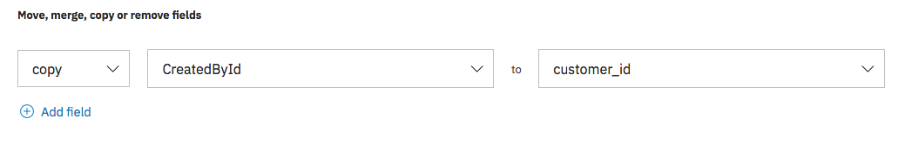

---

copyright:
  years: 2015, 2018, 2019
lastupdated: "2019-03-07"

subcollection: discovery

---

{:shortdesc: .shortdesc}
{:new_window: target="_blank"}
{:tip: .tip}
{:note: .note}
{:pre: .pre}
{:important: .important}
{:deprecated: .deprecated}
{:codeblock: .codeblock}
{:screen: .screen}
{:download: .download}
{:hide-dashboard: .hide-dashboard}
{:apikey: data-credential-placeholder='apikey'} 
{:url: data-credential-placeholder='url'}
{:curl: #curl .ph data-hd-programlang='curl'}
{:javascript: .ph data-hd-programlang='javascript'}
{:java: .ph data-hd-programlang='java'}
{:python: .ph data-hd-programlang='python'}
{:ruby: .ph data-hd-programlang='ruby'}
{:swift: .ph data-hd-programlang='swift'}
{:go: .ph data-hd-programlang='go'}

# Connexion à des sources de données
{: #sources}

Le service {{site.data.keyword.discoveryshort}} vous permet de vous connecter à des documents et de les explorer à partir de sources distantes.
{: shortdesc}

Vous pouvez vous connecter à une source de données et extraire des documents selon un planning (si vous le souhaitez) dans le service {{site.data.keyword.discoveryshort}} en configurant une collection à associer à cette source. Chaque collection peut être configurée avec une source de données lors de l'utilisation d'outils {{site.data.keyword.discoveryshort}}. Si vous utilisez l'API, vous pouvez envoyer des documents de plusieurs sources de données dans une seule collection. Le service {{site.data.keyword.discoveryshort}} extrait des documents de la source de données en utilisant un processus appelé exploration. L'exploration est le processus qui consiste à systématiquement explorer et extraire des documents de l'emplacement de départ spécifié. Seuls les éléments explicitement spécifiés par vous sont explorés par le service {{site.data.keyword.discoveryshort}}. Les types suivants de source de données peuvent être explorés :

-  [Box](/docs/services/discovery?topic=discovery-sources#connectbox)
-  [Salesforce](/docs/services/discovery?topic=discovery-sources#connectsf)
-  [Microsoft SharePoint Online](/docs/services/discovery?topic=discovery-sources#connectsp)
-  [Microsoft SharePoint 2016 On-Premise](/docs/services/discovery?topic=discovery-sources#connectsp_op)
-  [Web Crawl](/docs/services/discovery?topic=discovery-sources#connectwebcrawl) (version bêta)
-  [IBM Cloud Object Storage](/docs/services/discovery?topic=discovery-sources#connectcos)

La connexion à une source de données peut être effectuée à l'aide des outils {{site.data.keyword.discoveryshort}} ou de l'API. Les outils {{site.data.keyword.discoveryshort}} fournissent une méthode simplifiée de connexion qui nécessite une moindre compréhension des systèmes source, tandis que l'API offre une interface plus granulaire et hautement configurable qui requiert une meilleure compréhension de la source à laquelle vous vous connectez. La présentation de processus suivante vous permet de savoir quelles section du présent document lire ensuite :

1.  Lisez les [exigences générales liées à la source](/docs/services/discovery?topic=discovery-sources#gen_req) pour une vue générale des éléments requis.
2.  Lisez les exigences spécifiques à votre système source :
    -  [Box](/docs/services/discovery?topic=discovery-sources#connectbox)
    -  [Salesforce](/docs/services/discovery?topic=discovery-sources#connectsf)
    -  [Microsoft SharePoint Online](/docs/services/discovery?topic=discovery-sources#connectsp)
    -  [Microsoft SharePoint 2016 On-Premise](/docs/services/discovery?topic=discovery-sources#connectsp_op)
    -  [Web Crawl](/docs/services/discovery?topic=discovery-sources#connectwebcrawl) (version bêta)
    -  [IBM Cloud Object Storage](/docs/services/discovery?topic=discovery-sources#connectcos)
3.  Lisez les instructions de configuration de source basées sur votre choix de configuration :
    -  [Utilisation des outils](/docs/services/discovery?topic=discovery-sources#source_tooling)
    -  [Utilisation de l'API](/docs/services/discovery?topic=discovery-sources#source_api)

Si vous sélectionnez une source de données sur site, vous devez tout d'abord installer et configurer IBM Secure Gateway. Pour plus d'informations, voir [Installation d'IBM Secure Gateway pour les données sur site](/docs/services/discovery?topic=discovery-sources#gateway).

## Exigences générales liées à la source
{: #gen_req}

Les exigences générales suivante s'appliquent à toutes les sources de données :

-  La taille limite du fichier document individuel pour Box, Salesforce, SharePoint Online, SharePoint 2016, IBM Cloud Object Storage et Web Crawl est de 10 Mo.
-  Vous aurez besoin des données d'identification et des emplacements de fichier (ou URL) pour chaque source de données - ces informations sont généralement fournies par un développeur/administrateur système de la source de données.
-  Vous aurez besoin de connaître les ressources de la source de données à explorer. Ces informations peuvent être fournies par l'administrateur de la source. Lors d'une exploration de Box ou Salesforce, la liste des ressources disponibles est présentée lors de la configuration d'une source utilisant les outils {{site.data.keyword.discoveryshort}}.
-  Si vous utilisez les outils {{site.data.keyword.discoveryshort}}, une collection peut être configurée avec une seule source de données. Lors de l'utilisation de l'API, des documents provenant de plusieurs sources de données peuvent être envoyés dans une seule collection.
-  L'exploration d'une source de données utilise des ressources (appels API) de la source de données. Le nombre d'appels d'API dépend du nombre de documents devant être explorés. Un niveau approprié de licence de service (Enterprise, par exemple) doit être obtenu pour la source de données et l'administrateur du système source doit être consulté.
-  Les explorations de source {{site.data.keyword.discoveryshort}} ne supprime pas les documents stockés dans une collection. Lorsqu'une source est à nouveau explorée, les nouveaux documents sont ajoutés, les documents mis à jour sont modifiés dans la version en cours et les documents supprimés restent en tant que version stockée en dernier.
-  Les types de fichier suivants peuvent être ingérés par {{site.data.keyword.discoveryshort}}, tous les autres types de document sont ignorés :

Collection | Plans Lite | Plans Advanced 
---------------- | ------------------------------ | ------------------------------------------- 
Collections existantes créées spécifiquement pour {{site.data.keyword.discoveryfull}} avant la sortie de [Smart Document Understanding (SDU)](/docs/services/discovery?topic=discovery-release-notes#22jan19) | Microsoft Word, PDF, HTML, JSON | Microsoft Word, PDF, HTML, JSON     
Collections créées après la sortie de [SDU](/docs/services/discovery?topic=discovery-sdu#sdu) | PDF, Word, PowerPoint, Excel, JSON\*, HTML\* | PDF, Word, PowerPoint, Excel, PNG\*\*, TIFF\*\*, JPG\*\*, JSON\*, HTML\* 
    
\* Les documents JSON et HTML sont pris en charge par {{site.data.keyword.discoveryfull}} mais ne peuvent pas être modifiés à l'aide de l'éditeur SDU. Pour changer la configuration des documents HTML et JSON, vous devez utiliser l'API. Pour plus d'informations, voir la page de [référence de l'API ](https://{DomainName}/apidocs/discovery/){: new_window}.

\*\* Les fichiers individuels (PNG, TIFF, JPG) sont analysés et le texte (le cas échéant) est extrait. Les images PNG, TIFF et JPEG intégrées dans des fichiers PDF, Word, PowerPoint et Excel sont également analysés et le texte (le cas échéant) est extrait.

## Box
{: #connectbox}

Pour établir une connexion à {{site.data.keyword.discoveryfull}}, vous devez créer une application personnalisée Box. L'accès de niveau Application ou Entreprise est requis pour l'application Box.

-  Si vous n'êtes pas l'administrateur Box au sein de votre entreprise, l'accès de [**niveau Application**](/docs/services/discovery?topic=discovery-sources#applevelbox) est recommandé. Vous avez besoin d'un administrateur pour approuver votre application.
-  Si vous êtes l'administrateur Box au sein de votre entreprise, l'accès de [**niveau Entreprise**](/docs/services/discovery?topic=discovery-sources#entlevelbox) est recommandé.

La procédure de configuration de l'accès Box peut changer si Box est mis à jour. Consultez la [documentation s'adressant au développeur Box ](https://developer.box.com/){: new_window} pour connaître les mises à jour.
{: note}

### Configuration de l'accès de niveau Application
{: #applevelbox}

1.   Accédez à la page `https://app.box.com/developers/console` (utilisez l'URL Box de votre entreprise) puis cliquez sur **Create New App**.
1.   Sur l'écran **Create a New App**, sélectionnez **Enterprise Integration** puis cliquez sur **Next**.
1.   Sur l'écran **Authentication Method**, sélectionnez **OAuth 2.0 with JWT (Server Authentication)** puis cliquez sur **Next**.
1.   Indiquez un nom pour votre application puis cliquez sur le bouton **Create App**. Une fois votre application Box créée, cliquez sur **View Your App**.
1.   Lors de la consultation de votre application, sélectionnez **Application** dans la section **Application access**. Vous pouvez utiliser vos utilisateurs gérés existants par la suite. Vous n'êtes pas obligé d'en créer de nouveaux.
1.   Faites défiler l'écran jusqu'à la section **Application Scopes** de la page et sélectionnez les options suivantes : 
     - `Read and write all folders stored in Box`
     - `Manage Users`
1.   Faites défiler l'écran jusqu'à la section **Advanced Features** et sélectionnez les options suivantes :
     - `Perform Actions as Users`
     - `Generate User Access Tokens` 
1.  Cliquez sur le bouton **Save Changes**.

Pour la procédure suivante, vous allez avoir besoin de l'assistance de l'administrateur de votre compte Box. Si vous n'êtes pas l'administrateur de votre compte Box, vous pouvez déterminer qui est l'administrateur en ouvrant la console de développement Box et en accédant à la section **Account settings** > **Account details** > **Settings**.

1.  [Etape d'administrateur] Autorisez votre ID de client d'application sur la page `https://app.box.com/master/settings/openbox` en cliquant sur le bouton **Authorize New App**.
1.  [Etape d'administrateur] Entrez l'**ID client** dans la zone **API key** sur la page `https://app.box.com/developers/console` puis cliquez sur le bouton **Authorize**.
1.  [Etape d'administrateur] Extrayez un jeton de développeur pour l'application. Pour cela, accédez à la page `https://app.box.com/developers/console`, faites défiler l'écran jusqu'à la section **Developer Token** puis générez votre jeton.
1.  Maintenant que l'application a été autorisée par l'administrateur, accédez à la page `https://developer.box.com/reference#page-create-an-enterprise-user` et créez un utilisateur d'application en utilisant la page de référence d'API.

   Exemple Curl permettant de créer un utilisateur d'application :

   ```bash
    curl https://api.box.com/2.0/users -H "Authorization: Bearer ACCESS_TOKEN" -d '{"name": "NedStark", "is_platform_access_only": true}' -X POST
   ```
   {: pre}

1.  Copiez le contenu de la zone **id** nouvellement généré et transmettez ces données à l'utilisateur qui n'est pas administrateur en connectant l'application Box à {{site.data.keyword.discoveryfull}}.
1.  Une fois que l'utilisateur d'application est créé, les dossiers que vous souhaitez explorer doivent être partagés avec l'utilisateur d'application et les droits `Viewer` doivent être accordés à cet utilisateur pour ces dossiers. Le nom de connexion de l'utilisateur d'application provenant de la réponse de commande curl ci-dessus est requis. Exemple : `"login":"AppUser_737729_jmUo@boxdevedition.com"`.
1.  Accédez à nouveau à la console de développement Box `https://app.box.com/developers/console` puis faites défiler l'écran jusqu'à la section **Add and Manage Public Keys**. Cliquez sur **Generate the public/private keypair** et téléchargez votre fichier de paire de clés. Ouvrez le fichier.
1.  Dans le fichier de paire de clés, coupez et collez les zones suivantes dans les outils {{site.data.keyword.discoveryshort}}.
    -  `client_id`
    -  `enterprise_id`
    -  `client_secret` 
    -  `public_key_id` 
    -  `private_key` 
    -  `passphrase` 

### Configuration de l'accès de niveau d'entreprise
{: #entlevelbox}

1.  Accédez à la page `https://app.box.com/developers/console` (utilisez l'URL Box de votre entreprise) puis cliquez sur **Create New App**.
1.  Sur l'écran **Create a New App**, sélectionnez **Enterprise Integration** puis cliquez sur **Next**.
1.  Sur l'écran **Authentication Method**, sélectionnez **OAuth 2.0 with JWT (Server Authentication)** puis cliquez sur **Next**.
1.  Indiquez un nom pour votre application puis cliquez sur le bouton **Create App**. Une fois votre application Box créée, cliquez sur **View Your App**.
1.  Lors de la consultation de votre application, sélectionnez **Enterprise** dans la section **Application access**. Vous pouvez utiliser vos utilisateurs gérés existants par la suite. Vous n'êtes pas obligé d'en créer de nouveaux.
1.  Faites défiler l'écran jusqu'à la section **Application Scopes** de la page et sélectionnez les options suivantes : 
    - `Read and write all folders stored in Box`
    - `Manage Users`
    - `Manage Enterprise Properties`
1.  Faites défiler l'écran jusqu'à la section **Advanced Features** et sélectionnez les options suivantes :
    - `Perform Actions as Users`
    - `Generate User Access Tokens` 
1.  Cliquez sur le bouton **Save Changes**.

L'actualisation`` est prise en charge uniquement avec l'accès de niveau d'entreprise.
{: note}

Si vous changez les paramètres de l'application Box, autorisez à nouveau`` votre application afin que les modifications soient appliquées.
{: tip}

Pour la procédure suivante, vous allez avoir besoin de l'assistance de l'administrateur de votre compte Box. Si vous n'êtes pas l'administrateur de votre compte Box, vous pouvez déterminer qui est l'administrateur en ouvrant la console de développement Box et en accédant à la section **Account settings** > **Account details** > **Settings**.

1.  [Etape d'administrateur] Autorisez votre ID client d'application en sélectionnant **Admin console** > **Enterprise settings** > **Apps** puis en faisant défiler l'écran jusqu'à la section `Custom applications`. URL exemple :`https://app.box.com/master/settings/openbox`.
1.  [Etape d'administrateur] Entrez l'**ID client** dans la zone **API key** sur la page `https://app.box.com/developers/console` puis cliquez sur le bouton **Authorize**.
1.  Accédez à nouveau à la console de développement Box `https://app.box.com/developers/console` puis faites défiler l'écran jusqu'à la section **Add and Manage Public Keys**. Cliquez sur **Generate the public/private keypair** puis téléchargez votre fichier de paire de clés. Ouvrez le fichier.
1.  Dans le fichier de paire de clés, coupez et collez les zones suivantes dans les outils {{site.data.keyword.discoveryshort}}.
    -  `client_id`
    -  `enterprise_id`
    -  `client_secret` 
    -  `public_key_id` 
    -  `private_key` 
    -  `passphrase` 

Autres éléments à prendre en considération lors de l'exploration de Box :

-  Les notes Box étant stockées au format JSON, toute note se trouvant dans les dossiers spécifiés sera ingérée par {{site.data.keyword.discoveryshort}}.
-  Lors de l'utilisation de l'API, vous devrez disposer d'une liste des ID dossier et des ID propriétaire associés à chaque dossier que vous souhaitez explorer. Les outils {{site.data.keyword.discoveryshort}} vous permettent de parcourir et sélectionner du contenu à explorer.

## Salesforce
{: #connectsf}

Lors de la connexion à une source Salesforce, assurez-vous que l'instance à laquelle vous prévoyez de vos connecter est un plan Enterprise ou supérieur.

Les données d'identification suivantes sont requises pour la connexion à une source Salesforce, vous devez vous les procurer auprès de votre administrateur Salesforce :
-  `url` - `url` de la source à laquelle ces données d'identification permettent de se connecter.
-  `username` - `username` (nom d'utilisateur) de la source à laquelle ces données d'identification permettent de se connecter.
-  `password` - Le `password` est une concaténation du mot de passe Salesforce et d'un jeton de sécurité Salesforce valide. Cette valeur n'est jamais renvoyée et est utilisée uniquement lors de la création ou de la modification des données d'identification.

Lors de l'identification des données d'identification, il peut être utile de consulter la [documentation du développeur Salesforce ](https://developer.salesforce.com/docs/){: new_window}.

Autres éléments à noter lors de l'exploration de Salesforce :

-  Les articles provenant de Knowledge Center sont explorés uniquement si leur **version** est `published` et si leur langue est `en-us`.
-  Lors de l'utilisation de l'API, vous devrez disposer d'une liste des objets Salesforce que vous souhaitez explorer. Les outils {{site.data.keyword.discoveryshort}} vous permettent de parcourir et sélectionner du contenu à explorer.

## SharePoint Online
{: #connectsp}

Lors de la connexion à une source Microsoft SharePoint Online, assurez-vous que l'instance à laquelle vous prévoyez de vos connecter est un plan Enterprise (E1) ou supérieur.

Les données d'identification suivantes sont requises pour la connexion à une source SharePoint Online, vous devez vous les procurer auprès de votre administrateur SharePoint :

-  `organization_url` - `organization_url` de la source à laquelle ces données d'identification permettent de se connecter.
-  `site_collection_path` - `site_collection_path` de la source à laquelle ces données d'identification permettent de se connecter.
-  `username` - `client_id` (ID client) de la source à laquelle ces données d'identification permettent de se connecter. Cet utilisateur doit avoir accès à tous les sites et listes à explorer et indexer.
-  `password` - `password` de la source à laquelle ces données d'identification permettent de se connecter. Cette valeur n'est jamais renvoyée et est utilisée uniquement lors de la création ou de la modification des données d'identification.

Lors de l'identification des données d'identification, il peut être utile de consulter la [documentation du développeur Microsoft SharePoint ](https://docs.microsoft.com/en-us/sharepoint/dev/){: new_window}.

Autres éléments à noter lors de l'exploration de Microsoft SharePoint Online :

-  Pour explorer SharePoint, le compte `Crawl User` doit disposer des droits de type `SiteCollection Administrator`. 
-  Lors de l'exploration de SharePoint, vous avez besoin de la liste des chemins de collecte de site SharePoint à explorer. {{site.data.keyword.discoveryshort}} ne prend pas en charge les chemins de dossier comme entrée.

## Web Crawl
{: #connectwebcrawl}

Cette fonction bêta peut être utilisée pour explorer les sites Web public pour lesquels aucun mot de passe n'est requis. Vous pouvez sélectionner la fréquence à laquelle synchroniser {{site.data.keyword.discoveryshort}} avec les sites Web, la langue et le nombre de tronçons.

-  `Sync my data` - Vous pouvez choisir d'effectuer la synchronisation toutes les 5 minutes, toutes les heures, tous les jours, toutes les semaines ou tous les mois. 
-  `Select language` - Choisissez la langue des sites Web dans la liste des langues prises en charge. Pour connaître la liste des langues prises en charge par {{site.data.keyword.discoveryshort}}, voir [Support de langue](/docs/services/discovery?topic=discovery-language-support#supported-languages). Il est recommandé de créer une collection séparée pour chaque langue.
-  `URL group to sync` - Entrez votre URL puis cliquez sur le signe plus pour ajouter cette dernière au groupe d'URL. Pour définir les paramètres Crawl**** pour ce groupe d'URL, cliquez sur l'icône . Vous pouvez définir une valeur dans **Maximum hops** qui correspond au nombre de liens consécutifs à suivre depuis l'URL de départ (URL `0`). Le nombre de tronçons par défaut est `2` et le nombre maximal est `20` (en cas d'utilisation de l'API, la valeur maximale est `1 000`). 

Pour cette version bêta, le nombre de pages Web explorées est limité. Ainsi, l'explorateur Web peut ne pas explorer tous les sites Web spécifiés et atteindre le nombre maximal de tronçons.
{: note}

Si vous avez besoin de paramètres Crawl**** différents pour d'autres URL, cliquez sur **Add URL group** et créez un groupe. Vous pouvez créer autant de groupes d'URL que nécessaire.
{: tip}

## SharePoint 2016 On-Premise
{: #connectsp_op}

Microsoft SharePoint 2016 (également appelé SharePoint Server 2016) est une source de données sur site. Pour vous y connecter, vous devez tout d'abord installer et configurer IBM Secure Gateway. Pour plus d'informations, voir [Installation d'IBM Secure Gateway pour les données sur site](/docs/services/discovery?topic=discovery-sources#gateway).
{: note}

Les données d'identification suivantes sont requises pour la connexion à une source de données SharePoint 2016. Vous devez vous les procurer auprès de votre administrateur SharePoint :

-  `username` - `client_id` (ID client) de la source à laquelle ces données d'identification permettent de se connecter. Cet utilisateur doit avoir accès à tous les sites et listes à explorer et indexer.
-  `password` - `password` (mot de passe) de la source à laquelle ces données d'identification permettent de se connecter. Cette valeur n'est jamais renvoyée et est utilisée uniquement lors de la création ou de la modification des données d'identification.
-  `web_application_url` - `web_application_url` (URL de l'application Web) SharePoint 2016 ; par exemple, https://sharepointwebapp.com:8443. Si le port n'est pas indiqué, par défaut `80` est utilisé pour http et `443` pour https.
-  `domain` - `domain` (domaine) du compte SharePoint 2016.

Lors de l'identification des données d'identification, il peut être utile de consulter la [documentation du développeur Microsoft SharePoint ](https://docs.microsoft.com/en-us/sharepoint/dev/){: new_window}.

Autres éléments à prendre en compte lors de l'exploration de Microsoft SharePoint 2016 :

-  Pour explorer SharePoint 2016, le compte `Crawl User` doit disposer des droits `SiteCollection Administrator`.
-  Lors de l'exploration de SharePoint, vous avez besoin de la liste des chemins de collecte de site SharePoint à explorer. {{site.data.keyword.discoveryshort}} ne prend pas en charge les chemins de dossier comme entrée.

## IBM Cloud Object Storage
{: #connectcos}

Lors de la connexion à une source IBM Cloud Object Storage, les données d'identification suivantes sont requises. Vous pouvez vous les procurer auprès de votre administrateur IBM Cloud Object Storage :

-  `endpoint` - Elément `endpoint` utilisé pour l'interaction avec les données IBM Cloud Object Storage.
-  `access_key_id` - Elément `access_key_id` obtenu lors de la création de l'instance IBM Cloud Object Storage.
-  `secret_access_key` - Elément `secret_access_key` permettant de signer les demandes obtenues lors de la création de l'instance IBM Cloud Object Storage.

Une fois ces informations entrées, vous pouvez choisir la fréquence à laquelle synchroniser vos données et sélectionner les compartiments avec lesquels vous synchroniser.

Autres éléments à prendre en compte lors de l'exploration d'IBM Cloud Object Storage :

-  Ce connecteur ne prend pas en charge l'exploration de noeuds finaux privés.
-  Il existe un léger problème de performance si tous les compartiments sont sélectionnés. Dans ce cas, il peut exister un délai avant la fin de l'indexation des documents.

## Utilisation des outils
{: #source_tooling}

La connexion à une source données à l'aide des outils {{site.data.keyword.discoveryshort}} est effectuée via la création d'une collection spécifique à une source. Procédez comme suit pour créer une collection source et l'explorer :

1.  Depuis la page **Manage data** des outils {{site.data.keyword.discoveryshort}}, sélectionnez **Connect a data source**.
2.  Sélectionnez la source de données à laquelle vous souhaitez vous connecter. Si vous avez sélectionné une source de données sur site, vous devez tout d'abord installer IBM Secure Gateway. Pour plus d'informations, voir [Installation d'IBM Secure Gateway pour les données sur site](/docs/services/discovery?topic=discovery-sources#gateway). 
3.  Entrez vos données d'identification source et cliquez sur Connect. Vos données d'identification doivent être obtenues auprès de votre administrateur système source.
4.  Choisissez les données à explorer, ainsi que la fréquence de synchronisation. Option de synchronisation :
    -  Every five minutes : s'exécute toutes les cinq minutes
    -  Hourly : s'exécute toutes les heures
    -  Daily : s'exécute tous les jours entre 00:00 et 06:00 dans le fuseau horaire spécifié
    -  Weekly : s'exécute tous les dimanches entre 00:00 et 06:00 dans le fuseau horaire spécifié
    -  Monthly : s'exécute tous les premiers dimanche de chaque mois entre 00:00 et 06:00 dans le fuseau horaire spécifié
    
    Statut d'exploration exemple :
    
    ```json
    "crawl_status" : {
    "source_crawl" : {
      "status" : "completed",
      "next_crawl" : "2019-02-10T05:00:00-05:00"
    }
    ```
5.  Cliquez sur **Save & Sync objects** pour démarrer l'exploration de votre source de données. Vous êtes alors redirigé vers l'écran de statut de la collecte qui est mis à jour au fur et à mesure de l'ajout de documents à la collection.

L'exploration synchronise les données initialement, puis selon la fréquence spécifiée.
**Remarque :** Si vous modifiez un élément de l'écran **Sync settings** puis cliquez sur **Save and Sync objects**, une exploration est alors lancée (ou redémarrée si déjà en cours).

## Utilisation de l'API
{: #source_api}

Utilisez le processus suivant pour créer une collection connectée à une source de données à l'aide de l'API.

Si vous avez planifié d'établir une connexion à une source de données sur site, vous devez tout d'abord installer IBM Secure Gateway. Pour plus d'informations, voir [Installation d'IBM Secure Gateway pour les données sur site](/docs/services/discovery?topic=discovery-sources#gateway). 

L'exemple suivant utilise la source de données SharePoint.

1.  Créez des données d'identification pour la source à laquelle vous vous connectez à l'aide l'[API de données d'identification source ](https://{DomainName}/apidocs/discovery#create-credentials){: new_window}. Enregistrez le **credential_id** renvoyé pour les données d'identification nouvellement créées.
2.  Créez une configuration à l'aide de l'[API de configuration ](https://{DomainName}/apidocs/discovery#add-configuration){: new_window}. Cette configuration doit comporter un objet **source** qui définit ce qui doit être exploré. L'objet **source** doit contenir le **credential_id** que vous avez enregistré plus tôt.
    ```json
    "source" : {
      "type" : "salesforce",
      "credential_id" : "{credential_id}",
      "schedule" : {
        "enabled" : true,
        "time_zone" : "America/New_York",
        "frequency" : "weekly"
      },
      "options" : {
         "site_collections" : [ {
         "site_collection_path" : "/sites/TestSiteA",
         "limit" : 10
         } ]
      }
    }
    ```
    {: codeblock}
    Enregistrez le **configuration_id** renvoyé de la configuration nouvellement créée.
3.  Créez une collection à l'aide de l'[API Collections ](https://{DomainName}/apidocs/discovery#create-a-collection){: new_window}. L'objet qui définit la collection doit contenir l'élément **configuration_id** enregistré précédemment.

L'exploration source débute dès que la collection est créée, puis selon la fréquence spécifiée.
**Remarque :** Si vous modifiez un élément de l'objet **source** de la configuration, une nouvelle exploration est alors démarrée (ou redémarrée si déjà en cours).

### Spécification d'un `customer_id`
{: #source_customer_id}

Une zone `customer_id` d'un document {{site.data.keyword.discoveryshort}} ingéré peut être utilisée pour supprimer du contenu en fonction du `customer_id` à l'aide de la méthode **user-data** dans l'API. Les documents entrants qui proviennent d'une source de données ne reçoivent pas automatiquement un `customer_id` lorsqu'ils sont ingérés. Si votre application requiert la définition d'un `customer_id`, vous pouvez en spécifier une (ou plusieurs) des zones entrantes provenant du système source pour être copiées et utilisées en tant que `customer_id`. Pour ce faire, vous devez modifier la configuration utilisée pour la connexion à la source.

1.  Exécutez un exemple de requête et identifiez les zones à utiliser comme `customer_id`.
2.  Modifiez la configuration. Vous aurez besoin d'ajouter une section **Normalization** pour pouvoir créer la zone `customer_id`.
    -  Dans les outils, accédez à votre collection t cliquez sur le lien **edit** de la section configuration. Cliquez ensuite sur l'onglet **Normalization** et ajoutez-y une normalisation **copy** pour créer la zone `customer_id`. Cliquez ensuite sur **Apply & save**.
    
    -  Lors de l'utilisation de l'API, ajoutez l'objet suivant au tableau de **normalisations** :
       ```json
       {
         "operation" : "copy",
         "source_field" : "{original_field_name}",
         "destination_field" : "customer_id"
       }
       ```
       {: codeblock}
3.  La prochaine exploration planifiée ajoutera la zone `customer_id` à tous les documents. Si vous souhaitez qu'une exploration débute immédiatement, modifiez la configuration source (**Sync settings** dans les outils).

Pour plus d'informations, notamment sur la suppression basée sur un `customer_id`, voir [Sécurité de l'information](/docs/services/discovery?topic=discovery-information-security#information-security).

## Installation d'IBM Secure Gateway pour les données sur site 
{: #gateway}

Pour établir une connexion à une source de données sur site, vous devez tout d'abord télécharger, installer et configurer IBM Secure Gateway. Une fois que vous avez installé IBM Secure Gateway pour votre première source de données sur site, vous n'avez pas besoin de répéter cette action.

1.  Depuis la page **Manage data** des outils {{site.data.keyword.discoveryshort}}, sélectionnez **Connect a data source**.
1.  Sélectionnez la source de données à laquelle vous souhaitez vous connecter. Lorsque vous sélectionnez une source de données sur site, accédez à la section **Connect to your on-premise network** puis cliquez sur le bouton **Make connection**.
1.  Sur l'écran **Download and install the Secure Gateway Client**, téléchargez la version appropriée d'IBM Secure Gateway.
1.  Une fois le téléchargement terminé, cliquez sur le bouton **Download Secure Gateway and Continue**. Lors de l'installation, les invites Secure Gateway Client vous demandent les données **Gateway ID** et **Token** fournies sur l'écran. Voir [Installation du client ](https://cloud.ibm.com/docs/services/SecureGateway/securegateway_install.html#installing-the-client){: new_window} dans la documentation Secure Gateway pour accéder aux instructions d'installation.
1.  Sur la machine exécutant Secure Gateway Client, ouvrez le tableau de bord Secure Gateway à partir de la page http://localhost:9003.
1.  Cliquez sur **add ACL** dans le tableau de bord. Ajoutez l'URL de noeud final de chaque collection SharePoint à la liste **Allow access**. Par exemple, en utilisant le nom d'hôte `mycompany.sharepoint.com` et le port `80`.
1.  Accédez à nouveau aux outils {{site.data.keyword.discoveryshort}} puis cliquez sur **Continue**. Si la connexion aboutit, le message `Connection successful` s'affiche. Dans le cas contraire, ouvrez le tableau de bord Secure Gateway et vérifiez que les noeuds finaux de la liste **Allow access** sont corrects.

Une fois que la connexion est établie, vous pouvez commencer à entrer les données d'identification pour la source de données sur site.

## Connexion à la source de données et isolement des données
{: #source_isolation}

La [connexion à des sources de données externes](/docs/services/discovery?topic=discovery-sources#sources) réduit l'isolement de données de votre instance de service car les données en transit entre la source et le service ne peuvent pas être isolées. Tout autre isolement (au repos, administration, requête) est conservé en l'état. Toutes les communications en cours entre les services et les sources de données ou au sein de ces éléments sont chiffrées en utilisant TLS v1.2. Les clés privées des certificats TLS sont chiffrées au repos en utilisant AES-256-GCM, le certificat de service expire tous les trois ans et les listes de révocation de certificat sont mises à jour tous les mois. Toutes les données d'identification sont envoyées via une connexion chiffrée en utilisant TLS v1.2 et chiffrées au repos en utilisant AES-256. Les connexions à ces sources de données utilisent un protocole sécurisé pris en charge par ces sources de données.
