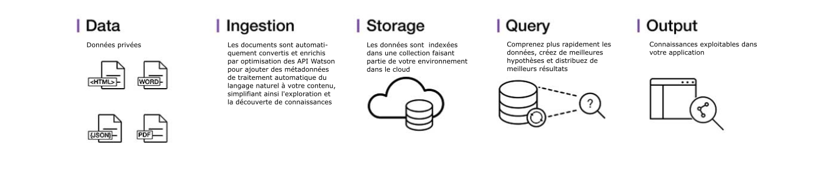

---

copyright:
  years: 2015, 2018
lastupdated: "2018-09-07"

---

{:shortdesc: .shortdesc}
{:new_window: target="_blank"}
{:tip: .tip}
{:pre: .pre}
{:codeblock: .codeblock}
{:screen: .screen}
{:javascript: .ph data-hd-programlang='javascript'}
{:java: .ph data-hd-programlang='java'}
{:python: .ph data-hd-programlang='python'}
{:swift: .ph data-hd-programlang='swift'}

# A propos de
{: #about}

{{site.data.keyword.discoveryfull}} permet de créer rapidement des applications d'exploration cognitive basées sur le cloud qui déverrouillent les connaissances exploitables masquées dans des données non structurées, y compris vos propres données exclusives, ainsi que les données publiques et tierces.
{: shortdesc}

Ci-dessous l'architecture d'une solution de service {{site.data.keyword.discoveryshort}} complète :

Avec {{site.data.keyword.discoveryshort}}, quelques étapes suffisent pour préparer vos données non structurées, créer une requête destinée à cerner les informations dont vous avez besoin, puis intégrer ces connaissances dans votre nouvelle application ou dans une solution existante.

Comment {{site.data.keyword.discoveryshort}} s'y prend-il ? Il utilise une analyse de données combinée à une intuition cognitive pour extraire vos données non structurées et les enrichir afin de vous permettre de découvrir les informations dont vous avez besoin.

{{site.data.keyword.discoveryfull}} regroupe un ensemble complet d'API {{site.data.keyword.watson}} automatisées et intégrées permettant d'effectuer les opérations suivantes :

- Explorer, enrichir et normaliser des données.
- Explorer en toute sécurité votre contenu exclusif, ainsi que le contenu public sous licence et gratuit.
- Appliquer des enrichissements supplémentaires, tels que des concepts, des relations et des sentiments via {{site.data.keyword.nlushort}} (NLU).
- Simplifier le développement tout en fournissant un accès direct à des API.

Pour plus d'informations sur les langues prises en charge, voir [Support de langue {{site.data.keyword.discoveryshort}}](/docs/services/discovery/language-support.html).

Pour plus d'informations sur la sécurité {{site.data.keyword.Bluemix_notm}}, voir la [description de service {{site.data.keyword.Bluemix_notm}} ](https://www.ibm.com/software/sla/sladb.nsf/searchsaas/?searchview&searchorder=4&searchmax=0&query=%28IBM+Cloud+Service+description%29){: new_window}

{{site.data.keyword.discoveryfull}} Knowledge Graph est une fonction bêta qui fournit des noeuds finaux permettant d'exécuter des requêtes sur des entités et des relations figurant dans des documents. Cela inclut des recherches contextuelles et un classement par pertinence. Pour plus d'informations, voir [{{site.data.keyword.discoveryfull}} Knowledge Graph](/docs/services/discovery/building-kg.html).

## Navigateurs pris en charge et prérequis

Pour obtenir la liste des prérequis et des navigateurs pris en charge pour {{site.data.keyword.Bluemix}}, voir le document [Prérequis](https://console.bluemix.net/docs/overview/prereqs.html#prereqs){: new_window}.

## Watson Discovery News
{: #watson-discovery-news}

{{site.data.keyword.discoverynewsshort}}, fichier public qui a été pré-enrichi avec des renseignements cognitifs, est également inclus avec {{site.data.keyword.discoveryshort}}. Vous pouvez utiliser ce fichier de données non structurées public pour exécuter des requêtes portant sur des connaissances que vous souhaitez intégrer à vos applications. Pour plus d'informations, voir [Watson Discovery News](/docs/services/discovery/watson-discovery-news.html#watson-discovery-news). Regardez une démonstration illustrant ce que vous pouvez créer avec {{site.data.keyword.discoverynewsshort}} [en cliquant ici ](https://discovery-news-demo.ng.bluemix.net/){: new_window}.

Le service {{site.data.keyword.discoveryshort}} est disponible sur [{{site.data.keyword.Bluemix_notm}} ](https://console.ng.bluemix.net/catalog/services/discovery/){: new_window}

## Outils de Discovery
{: #discovery-tooling}

Le service {{site.data.keyword.discoveryshort}} comprend un ensemble complet d'outils en ligne, les outils {{site.data.keyword.discoveryshort}}, conçus pour vous aider à configurer rapidement une instance du service et à la remplir de données.

Les outils du service {{site.data.keyword.discoveryshort}} ont été conçus pour vous permettre de gagner du temps en éliminant la nécessité d'utiliser des API pour configurer et remplir votre service. Cela permet aux développeurs d'application de se concentrer sur la création de moyens de grande valeur permettant aux utilisateurs finaux de découvrir le service {{site.data.keyword.discoveryshort}}. La rubrique [Initiation aux outils](/docs/services/discovery/getting-started-tool.html) contient une présentation des outils {{site.data.keyword.discoveryshort}}.

## Etapes suivantes
{: #next-steps}

- Initiez-vous à l'utilisation des outils {{site.data.keyword.discoveryshort}} ou de l'API {{site.data.keyword.discoveryshort}} :
    - [Initiation aux outils {{site.data.keyword.discoveryshort}}](/docs/services/discovery/getting-started-tool.html)
    - [Initiation à l'API {{site.data.keyword.discoveryshort}}](/docs/services/discovery/getting-started.html)
- Le service {{site.data.keyword.discoveryshort}} prend en charge plusieurs kits SDK afin de simplifier le développement d'applications. Ces kits SDK sont disponibles pour de nombreux langages de programmation et plateformes populaires, notamment Node.js, Java et Python. Tous ces SDK sont disponibles sur le site GitHub [watson-developer-cloud namespace ](https://github.com/watson-developer-cloud){: new_window}.
    - Pour obtenir la liste complète des SDK ainsi que des informations relatives à leur utilisation, voir [{{site.data.keyword.watson}} SDKs](https://console.bluemix.net/docs/services/watson/getting-started-sdks.html#sdks).
    - Pour des informations détaillées sur toutes les méthodes des SDK Node, Java et Python, voir [API reference ](https://www.ibm.com/watson/developercloud/discovery/api/v1/curl.html?curl){: new_window}.
