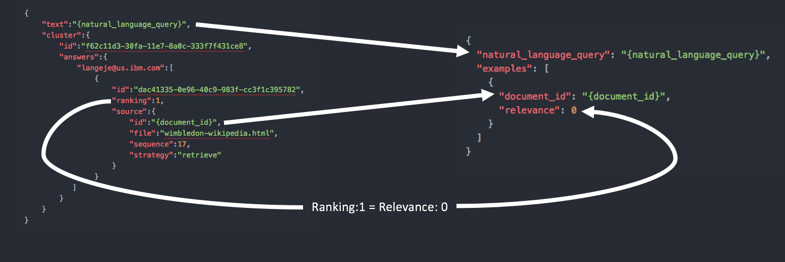

---

copyright:
  years: 2015, 2017
lastupdated: "2017-10-03"

---

{:shortdesc: .shortdesc}
{:new_window: target="_blank"}
{:tip: .tip}
{:pre: .pre}
{:codeblock: .codeblock}
{:screen: .screen}
{:javascript: .ph data-hd-programlang='javascript'}
{:java: .ph data-hd-programlang='java'}
{:python: .ph data-hd-programlang='python'}
{:swift: .ph data-hd-programlang='swift'}


# Migration à partir de Watson Document Conversion et Retrieve and Rank

{{site.data.keyword.documentconversionfull}} et {{site.data.keyword.retrieveandrankfull}} sont devenus obsolètes et ont été remplacés par {{site.data.keyword.discoveryfull}}. En général, ces deux services sont utilisés conjointement pour ingérer, classer puis fournir des résultats à vos applications. Ce document a pour objectif de vous guider dans le processus de migration à partir de {{site.data.keyword.documentconversionshort}} et {{site.data.keyword.retrieveandrankshort}} vers {{site.data.keyword.discoveryshort}}.

{{site.data.keyword.discoveryfull}} fournit une interface de requête plus robuste, une ingestion de données simplifiée, une gestion de formation améliorée et une échelle plus étendue. {{site.data.keyword.discoveryshort}} prend en charge une grande partie des principaux cas d'utilisation de {{site.data.keyword.retrieveandrankshort}}, y compris l'assistant d'agent, la recherche dans la base de connaissances organisationnelle et l'assistance de recherche. Ce service a été créé en tenant compte d'un grand nombre des difficultés rencontrées par les utilisateurs de {{site.data.keyword.retrieveandrankshort}}, et il résout la plupart de ces problématiques. {{site.data.keyword.discoveryshort}} fournit également de nouvelles fonctions pour l'extraction d'informations qui ne sont pas disponibles dans {{site.data.keyword.retrieveandrankshort}}, y compris l'extraction des passages et des algorithmes de recherche améliorés, afin de trouver des résultats plus pertinents. 

**Comparaison des fonctions**

| Fonction| {{site.data.keyword.retrieveandrankshort}} | {{site.data.keyword.discoveryshort}} |
|:-------------|:--------------------:|:-------------:|
| Recherche en langage naturel | Oui | Oui |
| Formation pour la pertinence par apprentissage automatique | Oui | Oui |
| Outils d'interface utilisateur pour la formation | Oui | Oui |
| Entrée d'unité de réponse JSON | Oui | Oui |
| Fractionnement de document | Oui | Oui |
| Extraction de passage |   | Oui |
| CRUD de document | Oui | Oui |
| Téléchargement JSON par lots | Oui |   |
| Enrichissement NLP de document automatique |   | Oui |
| Intégration de modèle NLP personnalisée pour les enrichissements |   | Oui |
| Données de formation stockées dans le service |   | Oui |
| Gestion de cycle de vie de modèle automatisée |   | Oui |
| Similarité de sémantique pour améliorer la pertinence sans formation |   | Oui |
| Mesure d'exactitude dans les outils en fonction d'un ensemble de tests | Oui |   |
| Prise en charge de vecteur de fonction personnalisée | Oui |   |
| Configuration d'analyseur personnalisée | Oui | Préconfigurée |
| Mots vides personnalisés | Oui | Préconfigurée |
| Dictionnaires de langue personnalisés | Oui | Préconfigurée |
| Synonymes personnalisés | Oui |  |
**Remarque :** ce tableau sera mis à jour à mesure que de nouvelles fonctions {{site.data.keyword.discoveryshort}} seront ajoutées.

Avant de lancer la migration, vous devez d'abord [évaluer](#evaluate) les données stockées dans votre service {{site.data.keyword.retrieveandrankshort}} et comprendre de quelle façon vous allez déplacer les différents composants qui constituent votre solution actuelle. 

La plupart des clients utilise {{site.data.keyword.documentconversionshort}} conjointement à {{site.data.keyword.retrieveandrankshort}}. Si vous n'utilisez pas {{site.data.keyword.documentconversionshort}} pour convertir un contenu de manière à pouvoir le stocker dans un index pouvant faire l'objet d'une recherche, reportez-vous à la rubrique décrivant les [options de migration d'un service {{site.data.keyword.documentconversionshort}} autonome](#dcs).

Si vous avez utilisé le tutoriel {{site.data.keyword.retrieveandrankshort}} tutorial et basé votre propre instance du service sur ce tutoriel, une extension du tutoriel qui ingère les mêmes données dans {{site.data.keyword.discoveryshort}} est décrite [ici](/docs/services/discovery/migrate-rnr-tut.html).

**Remarque :** la fonctionnalité de conversion et d'enrichissement est fournie avec {{site.data.keyword.discoveryshort}}. Si vous avez utilisé {{site.data.keyword.documentconversionshort}} et/ou {{site.data.keyword.nlushort}} pour convertir et enrichir des documents HTML, PDF ou Microsoft Word source, ces services sont remplacés par des fonctions dans le service {{site.data.keyword.discoveryshort}}. 

## Evaluation de votre chemin de migration vers le service Watson Discovery
{: #evaluate}

Deux options pratiques vous permettent d'effectuer une migration à partir de {{site.data.keyword.retrieveandrankshort}} : la migration à partir d'un contenu source et la migration à partir d'un contenu indexé. Evaluez les deux options avant de choisir celle que vous utiliserez. 

### Migration à partir d'un contenu source
{: #source}

Pour effectuer une migration à partir du contenu source, vous devrez :

-  avoir accès aux fichiers source d'origine à partir desquels le contenu a été ingéré ;
-  extraire l'ID de chaque document à l'aide d'un programme (le résultat comporte déjà un ID avant d'être indexé).

Si vous pouvez respecter tous les critères de migration, il est recommandé d'utiliser cette méthode pour passer au service {{site.data.keyword.discoveryshort}}. 

Pour faire migrer votre contenu source, modifiez la procédure décrite dans [le tutoriel de migration](/docs/services/discovery/migrate-rnr-tut.html) afin de respecter les caractéristiques de vos données source. 

#### Migration des unités de réponse

Si vous avez créé des unités de réponse à l'aide de {{site.data.keyword.documentconversionshort}}, choisissez l'une des options suivantes pour faire migrer ce contenu :

-  Si vous avez formé un dispositif de classement et devez faire migrer le classement, prenez le contenu qui a été renvoyé par {{site.data.keyword.documentconversionshort}} et versez-le dans {{site.data.keyword.discoveryshort}}. 
-  Si vous n'avez aucune donnée de formation à faire migrer, versez les documents source d'origine dans {{site.data.keyword.discoveryshort}} à l'aide de la [fonction de segmentation de document](/docs/services/discovery/building.html#doc-segmentation). 

### Migration à partir d'un contenu indexé
{: #indexed}

Vous devez effectuer une migration à partir du contenu indexé dans {{site.data.keyword.retrieveandrankshort}} si vous n'avez pas accès aux documents source d'origine, ou :

- si vous avez utilisé une génération d'ID de document automatique et formé un dispositif de classement ;
- si vous avez créé des unités de réponse dans {{site.data.keyword.documentconversionshort}} et que vous les avez classées, mais que vous n'avez pas conservé les unités de réponse générées par le service {{site.data.keyword.documentconversionshort}}. 

**Remarque :** cette méthode est possible uniquement si l'ensemble du contenu nécessaire figure dans des zones stockées dans {{site.data.keyword.retrieveandrankshort}}. Si le contenu a été indexé uniquement et n'a pas été stocké, il ne sera pas possible d'exécuter des requêtes sur le contenu en dehors du service, et les données devront être converties et fractionnées à nouveau à partir du contenu source. 

Les documents sont extraits à partir du service à l'aide de la méthode [/v1/solr_clusters/{solr_cluster_id}/solr/\{collection_name\}/select ](https://www.ibm.com/watson/developercloud/retrieve-and-rank/api/v1/#index_doc){: new_window} avec une requête vide `q=*:*`. Le nombre de documents renvoyés peut être supérieur au nombre maximal de retours (`200` pour la plupart des collections). Si tel est le cas, plusieurs appels doivent être émis avec la [pagination ](https://lucene.apache.org/solr/guide/6_6/pagination-of-results.html){: new_window} appropriée pour collecter tous les documents.

Les documents pour lesquels des **ID** sont spécifiés sont téléchargés vers le service {{site.data.keyword.discoveryshort}} à l'aide de la méthode [/v1/environments/\{environment_id\}/collections/\{collection_id\}/documents/\{document_id\} ](https://www.ibm.com/watson/developercloud/discovery/api/v1/#update-doc){: new_window}. Chaque téléchargement de document est un appel d'API distinct. 

## Migration des données de formation

Après avoir fait migré vos résultats, vous devez faire migrer les données de formation qui ont été créées pour le contenu. Il existe deux options pour la migration des données de formation : la migration à partir de la source (`csv`) et la migration à partir du service. Si vous avez téléchargé des données de formation à partir d'un fichier `csv` et que vous avez toujours accès à ce fichier, il est recommandé d'effectuer la migration à partir de la source. Si vous avez utilisé les outils {{site.data.keyword.retrieveandrankshort}} ou que vous n'avez pas accès au fichier `csv` d'origine, il est recommandé d'effectuer la migration à partir du service. 

### Migration de la formation à partir du contenu source
{: #csv}

Pour effectuer une migration à partir du contenu source de classement, vous devrez :

- avoir accès aux fichiers `csv` source d'origine avec lesquels les données de formation ont été initialement téléchargées ;
- vous assurer que les ID des documents formés lors de leur indexation correspondent aux ID des documents formés lors de leur indexation dans {{site.data.keyword.retrieveandrankshort}}.

Si vous pouvez respecter tous les critères de migration, il est recommandé d'utiliser cette méthode pour faire migrer la formation vers le service {{site.data.keyword.discoveryshort}}. 

Pour faire migrer vos données de formation, modifiez la procédure décrite dans [le tutoriel de migration](/docs/services/discovery/migrate-rnr-tut.html) afin de respecter les caractéristiques de vos données source. 

### Migration des données de formation à partir du service
{: #extract-train}

Pour faire migrer des données de formation à partir du service {{site.data.keyword.retrieveandrankshort}}, vous devrez extraire les données de formation à l'aide des API {{site.data.keyword.retrieveandrankshort}}, convertir le document JSON de formation {{site.data.keyword.retrieveandrankshort}} dans un format utilisable par{{site.data.keyword.discoveryshort}} et enfin faire ingérer les données de formation par {{site.data.keyword.discoveryshort}} à l'aide de l'API.

Pour extraire les données de formation de {{site.data.keyword.retrieveandrankshort}}, utilisez la fonction `Export` des outils {{site.data.keyword.retrieveandrankshort}}. Une fois le téléchargement d'une exportation complète, procédez à l'extraction du fichier `.zip`. L'archive comprend deux fichiers. Les données de formation sont stockées dans celui qui se nomme `export-questions.json`. Ce fichier contient un tableau d'objets de formation JSON. 

Chaque résultat de formation contenu dans le tableau est présenté comme suit :

**Exemple de données de formation {{site.data.keyword.retrieveandrankshort}}**
```json
{
    "text":"Who was the first royal to attend Wimbledon?",
    "cluster":{
        "id":"f62c11d3-30fa-11e7-8a0c-333f7f431ce8",
        "answers":{
            "f62c11d3-30fa-11e7-8a0c-33":[
                {
                    "id":"dac41335-0e96-40c9-983f-cc3f1c395782",
                    "ranking":1,
                    "source":{
                        "id":"e26a3d20-30fa-11e7-aa5e-d1632b06e0b1",
                        "file":"wimbledon-wikipedia.html",
                        "sequence":17,
                        "strategy":"retrieve"
                    }
                },
                {
                    "id":"661b4c9f-ecdb-4dad-aafc-6ae561a148c0",
                    "ranking":2,
                    "source":{
                        "id":"da1bc620-30fa-11e7-8f90-3305f35a93c9",
                        "file":"generated-otherFactsFigures.docx",
                        "sequence":67,
                        "strategy":"retrieve"
                    }
                },
                {
                    "id":"0053fdb8-c77e-4fcf-b0e0-6a4cd377266a",
                    "ranking":3,
                    "source":{
                        "id":"d9c0add0-30fa-11e7-aa5e-d1632b06e0b1",
                        "file":"generated-allEngland.docx",
                        "sequence":20,
                        "strategy":"retrieve"
                    }
                },
                {
                    "id":"506d3d50-19ed-49c8-b32f-65f848e60e86",
                    "ranking":4,
                    "source":{
                        "id":"da1bc620-30fa-11e7-8f90-3305f35a93c9",
                        "file":"generated-otherFactsFigures.docx",
                        "sequence":63,
                        "strategy":"retrieve"
                    }
                }
            ]
        },
        "flags":{

        }
    }
},
```
{: codeblock}

{{site.data.keyword.discoveryshort}} ne requiert pas que toutes les informations soient exportées à partir de {{site.data.keyword.retrieveandrankshort}}. Le fragment suivant illustre la structure requise pour une entrée de formation {{site.data.keyword.discoveryshort}}. 

```json
{
  "natural_language_query": "{natural_language_query}",
  "examples": [
    {
      "document_id": "{document_id_1}",
      "relevance": 0
    },
    {
      "document_id": "{document_id_2}",
      "relevance": 10
    }
  ]
}
```
{: codeblock}

A ce stade, vous devrez convertir vos informations de formation {{site.data.keyword.retrieveandrankshort}} en informations de formation {{site.data.keyword.discoveryshort}}. Tenez compte des points suivants lors de la conversion.

- Le texte **non pertinent** est signalé par un score de pertinence (`relevance`) égal à `0` dans {{site.data.keyword.discoveryshort}}, mais il est signalé par une valeur de classement (`ranking`) égale à `1` dans {{site.data.keyword.retrieveandrankshort}} - Toutes les entrées `"ranking": 1` doivent être converties en `"relevance": 0` dans {{site.data.keyword.discoveryshort}}. 
- Les outils {{site.data.keyword.discoveryshort}} utilisent une échelle binaire de `0` et `10`. Si vous souhaitez classer d'autres résultats et utiliser les outils {{site.data.keyword.discoveryshort}}, vous devez convertir toutes les entrées `"ranking": 1` et `"ranking": 2` en`"relevance": 0`, et toutes les entrées `"ranking": 3` et `"ranking": 4` en `"relevance": 10`. Cela n'est pas obligatoire si vous ne classez pas d'autres résultats ou si vous n'utilisez pas les outils {{site.data.keyword.discoveryshort}}. 
- Des questions sans réponse ne sont pas requises par {{site.data.keyword.discoveryshort}}, car la validité de la formation pour la pertinence est vérifiée manuellement. 



A titre d'exemple, l'**exemple de données de formation {{site.data.keyword.retrieveandrankshort}}** illustré ci-dessous doit être converti pour être utilisé dans les outils {{site.data.keyword.discoveryshort}}, comme suit : 

```json
{
  "natural_language_query": "Who was the first royal to attend Wimbledon?",
  "examples": [
    {
      "document_id": "e26a3d20-30fa-11e7-aa5e-d1632b06e0b1",
      "relevance": 0
    },
    {
      "document_id": "da1bc620-30fa-11e7-8f90-3305f35a93c9",
      "relevance": 0
    },
    {
      "document_id": "d9c0add0-30fa-11e7-aa5e-d1632b06e0b1",
      "relevance": 10
    },
    {
      "document_id": "da1bc620-30fa-11e7-8f90-3305f35a93c9",
      "relevance": 10
    }
  ]
}
```
{: codeblock}

## Support de langue
{: #language}

Voir le tableau [Support de langue pour {{site.data.keyword.discoveryshort}}](/docs/services/discovery/language-support.html). Les fonctions {{site.data.keyword.retrieveandrankshort}} sont essentiellement prises en charge par le support de langue **de base** pour {{site.data.keyword.discoveryshort}}. 

## Migration des requêtes
{: #queries}

Le langage de requête {{site.data.keyword.discoveryfull}} est différent du langage de requête Solr utilisé par {{site.data.keyword.retrieveandrankshort}}. Les requêtes existantes doivent être redirigées vers l'une des méthodes de requête {{site.data.keyword.discoveryfull}} et converties pour utiliser le langage de requête {{site.data.keyword.discoveryfull}}. Le tableau suivant décrit certains des opérateurs standard utilisés dans la plupart des requêtes :

**Migration des requêtes Solr vers {{site.data.keyword.discoveryshort}} - Opérateurs standard**

| Opérateur Solr | Opérateur Discovery | Description |
|:-------------:|--------------------|-------------|
| `.` | `.` | Délimiteur JSON |
| `:` | `:` | Inclut |
|  | `::` | Correspondance exacte |
| `-{fieldname}:` | `:!` | N'inclut pas |
|  | `::!` | N'est pas une correspondance exacte |
| ``\` | ``\` | Caractère d'échappement |
| `""` | `""` | Requête de phrase |
| `()` | `()`, `[]` | Regroupement imbriqué |
| `OR` | [<code>&#124;</code>] | ou |
| `AND` | [,] | et |
| `[* TO 100]` | `<=`, `>=`, `>`, `<` | Comparaisons numériques |
| `^x` | `^x` | Multiplicateur de score |
| `*` | `*` | Caractère générique |
| `~`(0 à 1) | [~n] | Variation de chaîne |

Pour plus d'informations sur le langage de requête {{site.data.keyword.discoveryfull}}, voir les rubriques [Concepts de requête](/docs/services/discovery/using.html) et [Référence de requête](/docs/services/discovery/query-reference.html). 


## Migration de service Watson Document Conversion autonome
{: #dcs}

Si vous utilisez {{site.data.keyword.documentconversionshort}} pour vous aider à verser un contenu dans {{site.data.keyword.retrieveandrankshort}}, sachez que cette fonctionnalité est devenu un service unique, {{site.data.keyword.discoveryshort}}. {{site.data.keyword.discoveryshort}} vous permet de facilement convertir, enrichir et verser des documents Microsoft Word, PDF, HTML et JSON dans un index pouvant faire l'objet d'une formation et d'une recherche. Cette section vous concerne si votre cas d'utilisation n'implique pas le stockage du contenu converti dans un index. Si vous versez des documents dans un index, voir la section relative au[versement dans le service {{site.data.keyword.discoveryshort}}](/docs/services/discovery/building.html).

IBM ne fournit plus un service conçu pour la conversion autonome des documents Microsoft Word, PDF et HTML. Si vous utilisez le service {{site.data.keyword.documentconversionshort}} et que nous ne versez pas la sortie dans un service indexé en ligne (par exemple,{{site.data.keyword.discoveryshort}}), il est recommandé d'envisager d'effectuer une migration vers une alternative open source, telle que [Apache Tika ](https://tika.apache.org/){: new_window}.
