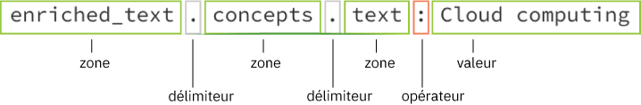

---

copyright:
  years: 2015, 2018
lastupdated: "2018-10-23"

---

{:shortdesc: .shortdesc}
{:new_window: target="_blank"}
{:tip: .tip}
{:pre: .pre}
{:codeblock: .codeblock}
{:screen: .screen}
{:javascript: .ph data-hd-programlang='javascript'}
{:java: .ph data-hd-programlang='java'}
{:python: .ph data-hd-programlang='python'}
{:swift: .ph data-hd-programlang='swift'}

# Concepts de requête
{: #query-concepts}

Le service {{site.data.keyword.discoveryfull}} offre des fonctions de recherche de contenu puissantes. Une fois votre contenu téléchargé et enrichi par le service {{site.data.keyword.discoveryshort}}, vous pouvez créer des requêtes, intégrer {{site.data.keyword.discoveryshort}} dans vos propres projets ou créer une application personnalisée en utilisant {{site.data.keyword.watson}} Explorer Application Builder.
{: shortdesc}

  Les requêtes que vous écrivez varient d'une collection à une autre, car toutes les collections comportent un contenu unique.
  {: tip}

Lorsque vous créez une requête ou un filtre, {{site.data.keyword.discoveryshort}} examine chaque résultat et tente de mettre en correspondance les chemins que vous avez définis. Lorsque des correspondances sont trouvées, elles sont ajoutées à l'ensemble de résultats. Lorsque vous créez une requête, vous pouvez être aussi vague ou spécifique que vous le souhaitez. Plus la requête est spécifique, plus les résultats seront ciblés.

Vous avez également la possibilité d'activer l'extraction de passage. Les passages sont des extraits pertinents et courts issus des documents entiers renvoyés par votre requête. Ces passages ciblés sont extraits des zones `text` contenues dans les documents de votre collection. Par défaut, jusqu'à 10 passages contenant environ 400 caractères chacun seront renvoyés pour une requête. Un maximum de trois passages sont extraits à partir d'un résultat. Le paramètre `passages` n'est disponible que pour les collections privées ; il n'est pas disponible dans la collection {{site.data.keyword.discoverynewsshort}}. Pour plus d'informations sur la manière dont les passages sont identifiés, voir [Passages](/docs/services/discovery/query-parameters.html#passages).

  Vous pouvez écrire des requêtes en langage naturel (par exemple, "IBM Watson partnerships") à l'aide des outils ou de l'API {{site.data.keyword.discoveryshort}}.
  {: tip}

Les collections formées renverront un score `confidence` dans le résultat d'une requête en langage naturel. Pour plus d'informations, voir [Scores de confiance](/docs/services/discovery/train-tooling.html#confidence).

{{site.data.keyword.discoveryshort}} renvoie des résultats de requête qui incluent des caractères spéciaux pour les langues suivantes : anglais, allemand, français, néerlandais, italien et portugais. Si, par exemple, vous faites une requête pour `aqui`, vous recevrez à présent des résultats pour `aqui` et <code>aqu&iacute;</code>.

Vous pouvez créer des requêtes plus longues et plus complexes incluant plusieurs filtres et des agrégations complexes. Cette option est disponible uniquement dans l'API et fait passer le nombre limite de caractères d'une requête à 10 000 caractères. Voir [Long collection queries ](https://www.ibm.com/watson/developercloud/discovery/api/v1/curl.html?curl#query){: new_window} et [Long environment queries ](https://www.ibm.com/watson/developercloud/discovery/api/v1/curl.html?curl#federated-query){: new_window} pour plus de détails.

{{site.data.keyword.discoveryfull}} Knowledge Graph est une fonction bêta qui fournit des noeuds finaux permettant d'exécuter des requêtes sur des entités et des relations figurant dans des documents. Cela inclut des recherches contextuelles et un classement par pertinence. Pour plus d'informations, voir [{{site.data.keyword.discoveryfull}} Knowledge Graph](/docs/services/discovery/building-kg.html).

Pour plus d'informations sur l'écriture de requêtes, voir :
- [Initiation à l'écriture de requêtes](/docs/services/discovery/getting-started-query.html)
- [Référence de requête](/docs/services/discovery/query-reference.html) (comprend la liste des paramètres, opérateurs et agrégations disponibles dans le langage de requête {{site.data.keyword.discoveryshort}})

## Schéma de données Discovery
{: #discovery-schema}

Commençons par découvrir l'objet JSON {{site.data.keyword.discoveryshort}}. Pour comprendre comment créer une requête à l'aide du langage de requête {{site.data.keyword.discoveryshort}}, il est utile de connaître l'objet JSON produit par {{site.data.keyword.discoveryshort}} après que celui-ci a enrichi les documents de votre collection. Une fois que vous aurez découvert le schéma de données de vos documents, il vous sera plus facile d'écrire des requêtes dans le langage de requête {{site.data.keyword.discoveryshort}}. Trois méthodes sont possibles.

  1. Dans les outils {{site.data.keyword.discoveryshort}}, ouvrez l'écran **Manage data**, choisissez la collection {{site.data.keyword.IBM_notm}} Press Releases. Cliquez sur le bouton **View Data Schema**. L'écran **View data schema** affiche de deux manières différentes les zones et les valeurs contenues dans vos documents transformés : par document (**vue de document**) ou par zone (**vue de collection**). La **vue de document** peut afficher jusqu'à 50 documents. La **vue de collection** affiche toutes les zones de la collection.

    Dans la **vue de collection**, sous `enriched_text`, se trouvent les enrichissements que vous avez appliqués au fichier **Default Configuration**. Cliquez sur `categories`, `concepts`, `entities` et `sentiment` pour voir de quelle façon votre collection a été enrichie avec des connaissances Watson.

  1. Exécutez une requête "empty" pour visualiser l'objet JSON. Sur l'écran **View data schema**, cliquez sur le bouton **Build queries**,puis cliquez sur **Run Query**. Les résultats s'affichent sur la droite, sous deux onglets, **Summary** (présentation générale des résultats de la requête) et **JSON**. Ouvrez d'abord l'onglet **JSON**.

     -  Chacun des quatre documents sera précédé d'un numéro (`id`).
     -  Faites défiler l'écran jusqu'à la zone `enriched_text`. Examinez chaque enrichissement pour savoir quelles sont les zones JSON sur lesquelles vous pouvez exécuter une requête.

        

     -  **entities** - Commencez par rechercher la zone `text`, puis examinez les autres informations d'enrichissement.
     -  **sentiment** - Commencez par rechercher la zone `label`, puis examinez les autres informations d'enrichissement.
     -  **concepts** - Commencez par rechercher la zone `text`, puis examinez les autres informations d'enrichissement.
     -  **categories** - Commencez par rechercher la zone `document`, puis examinez les autres informations d'enrichissement.

     Après avoir consulté les indications contenues dans le premier document, vous pouvez examiner les autres trois documents si vous le souhaitez.

  1. Consultez les zones disponibles dans le **générateur de requête visuelle**. Sur l'écran **Build queries**, cliquez sur **Search for documents**, puis sur **Use the {{site.data.keyword.discoveryshort}} Query Language**. Cliquez sur la liste déroulante **Field** pour voir les zones disponibles dans vos données. Cliquez sur **Edit in query language** pour créer des requêtes manuellement à l'aide du langage de requête {{site.data.keyword.discoveryshort}}.      

### Comment structurer une requête de base
{: #structure-basic-query}

Comme vous l'avez remarqué, l'objet JSON est de nature hiérarchique, par conséquent, les requêtes doivent être écrites en utilisant la même hiérarchie. Si votre objet JSON se présente comme suit :

```json
"enriched_text": {
  "concepts": [
    {
    "text": "Cloud computing",
    "relevance": 0.610029}
    ]
  }
```
{: codeblock}

Votre requête doit être structurée comme suit :



  Les opérateurs qui évaluent une zone (`<=` , `>=`, `<`, `>`) requièrent un élément `number` ou `date` comme valeur. L'utilisation de guillemets autour d'une valeur transforme toujours celle-ci en `string`. C'est pourquoi `score>=0.5` est une requête valide et `score>="0.5"` ne l'est pas. Voir [Opérateurs de requête](/docs/services/discovery/query-operators.html) pour la liste complète des opérateurs. {: tip}

Remarques :

- Vous ne savez pas quand exécuter une requête sur une entité, un concept ou un mot clé ? Voir [Compréhension de la différence entre Entities, Concepts et Keywords](/docs/services/discovery/building.html#udbeck).

- **Remarque :** après avoir cliqué sur **Run query** et ouvert l'onglet **JSON**, vous constaterez que la mise en évidence des requêtes est activée par défaut. Cela ajoutera une zone `highlight` à vos résultats de requête. Dans la zone `highlight`, les mots qui correspondent à votre requête seront encapsulés dans les balises HTML `<em>` (mise en évidence). Pour plus d'informations, voir[Paramètres de requête](/docs/services/discovery/query-parameters.html#highlight).

## Création de requêtes combinées
{: #building-combined-queries}

Vous pouvez combiner des paramètres de requête afin de créer des requêtes davantage ciblées. Par exemple, vous pouvez utiliser en même temps les paramètres `filter` et `query`. Pour en savoir plus sur ce qui différencie le filtrage de la création de requêtes, voir [Différences entre les paramètres de requête et de filtre](/docs/services/discovery/query-parameters.html#filtervquery).

## Comment structurer une agrégation
{: #structure-aggregation}

Les agrégations renvoient un groupe de valeurs de données. Par exemple, des mots clés principaux, des sentiments d'entités globaux, etc. Pour obtenir la liste complète des options d'agrégation, voir [Agrégations](/docs/services/discovery/query-reference.html#aggregations).


Cet exemple d'agrégation trouvera tous les `concepts` dans votre collection.
Le délimiteur dans cette requête est `.` et l'opérateur est  `()`. Pour découvrir les autres opérateurs disponibles dans le langage de requête {{site.data.keyword.discoveryshort}}, voir [Opérateurs de requête](/docs/services/discovery/query-operators.html).

### Exemple de requêtes d'agrégation
{: #example-aggregations}

Il existe plusieurs façons d'agréger des résultats avec {{site.data.keyword.discoverynewsshort}}, y compris les valeurs supérieures, les sommes, le minimum, le maximum, la moyenne, l'intervalle de temps et l'histogramme. Vous pouvez également ajouter des filtres et imbriquer des agrégations.

#### Agrégations filtrées
{: #filter-aggregations}

Cet exemple d'agrégation renvoie le nombre d'articles trouvés dans {{site.data.keyword.discoverynewsshort}} au sujet des Steelers de Pittsburgh et indique combien d'entre eux contiennent un sentiment positif (`positive`), négatif (`negative`) ou neutre (`neutral`).

- `filter(enriched_text.entities.text:"Pittsburgh Steelers").term(enriched_text.sentiment.document.label,count:3)`


Cet exemple d'agrégation commence par limiter (filtrer) le groupe d'articles dans {{site.data.keyword.discoverynewsshort}} à ceux qui incluent le texte d'entité de Twitter, puis il divise ces articles en fonction des types de sentiment de document. Seuls les trois premiers types de sentiment de document (`positive`, `negative`, `neutral`) sont renvoyés.

- `filter(enriched_text.entities.text:twitter).term(enriched_text.sentiment.document.label,count:3)`

#### Agrégations imbriquées
{: #nested-aggregations}

Le fait d'ajouter `nested` avant une agrégation permet de limiter l'agrégation à la zone des résultats spécifiés. Par exemple : `nested(enriched_text.entities)` signifie que seuls les composants `enriched_text.entities` de n'importe quel résultat sont utilisés pour l'agrégation.

Cela peut être facilement vérifiable en examinant les différences entre les deux requêtes :
- `filter(enriched_text.entities.disambiguation.subtype::City)` - L'agrégation compte le nombre de *résultats* contenant un ou plusieurs éléments `entity` avec le type `City`.
- `nested(enriched_text.entities).filter(enriched_text.entities.disambiguation.subtype::City)` - L'agrégation compte le nombre d'instance d'un élément `entity` avec le type `City` dans les résultats.  

De plus, n'importe quelle opération suivante aura pour conséquence de restreindre davantage l'ensemble de résultats sur lequel effectuer l'agrégation. Par exemple :

- `nested(enriched_text.entities).filter(enriched_text.entities.disambiguation.subtype::City)` signifie que seules les entités `subtype::City` seront agrégées.
- `nested(enriched_text.entities).filter(enriched_text.entities.disambiguation.subtype::City).term(enriched_text.entities.text,count:3)` agrégera les 3 premières entités du sous-type `City`.
- `filter(enriched_text.entities.disambiguation.subtype::City).term(enriched_text.entities.text,count:3)` renverra les 3 premières entités dont le résultat contient au moins une entité du sous-type `City`.

## Exécution de requêtes sur Watson Discovery News
{: #querying-news}

{{site.data.keyword.discoverynewsshort}}, fichier public qui a été pré-enrichi avec des renseignements cognitifs, est également inclus avec {{site.data.keyword.discoveryshort}}. Pour plus d'informations sur cette collection, voir [Watson Discovery News](/docs/services/discovery/watson-discovery-news.html#watson-discovery-news).

Vous pouvez exécuter une requête sur cette collection en utilisant des requêtes en langage naturel, par exemple, "IBM Watson partnerships", ou le langage de requête {{site.data.keyword.discoveryshort}}. Pour en savoir plus sur les requêtes en langage naturel, voir la rubrique [Requête en langage naturel](/docs/services/discovery/query-parameters.html#nlq).

Vous ne pouvez pas ajuster la configuration de {{site.data.keyword.discoverynewsshort}}, former ou ajouter des documents à la collection {{site.data.keyword.discoverynewsshort}}. Regardez une démonstration illustrant ce que vous pouvez créer avec {{site.data.keyword.discoverynewsshort}} [en cliquant ici ](https://discovery-news-demo.ng.bluemix.net/){: new_window}.

Les collections {{site.data.keyword.watson}} {{site.data.keyword.discoverynewsshort}} en langue anglaise, coréenne, allemande, espagnole et japonaise sont disponibles depuis les outils et l'API {{site.data.keyword.discoveryshort}}. 

La langue par défaut pour {{site.data.keyword.watson}} {{site.data.keyword.discoverynewsshort}} dans les outils est l'anglais. Pour changer de langue, vous devez d'abord cliquer sur l'icône , puis sélectionner la langue appropriée dans la liste déroulante.

Pour plus d'informations sur l'exécution d'une requête sur une collection via l'API, voir le document [API Reference ](https://www.ibm.com/watson/developercloud/discovery/api/v1/#query-collection){: new_window}. La référence `collection_id` de la version anglaise de Watson {{site.data.keyword.discoverynewsshort}} est `news-en`. Anciennement, la référence `collection_id` était `news`. Si vous utilisiez l'ancienne référence `collection_id`, elle continuera de fonctionner, cela dit, vous souhaiterez peut-être utiliser la nouvelle référence `collection_id` pour vos nouveaux projets. Le `collection_id` de la collection coréenne est `news-ko`, le `collection_id` espagnol est `news-es`, le `collection_id` allemand est `news-de`, le `collection_id` japonais est `news-ja`.

Les requêtes {{site.data.keyword.discoverynewsfull}} affichent les 50 premiers mots de chaque article dans la zone JSON `text`.

Le nombre maximal de résultats renvoyés pour une requête {{site.data.keyword.watson}} {{site.data.keyword.discoverynewsshort}} est de `50`. Utilisez d'autres requêtes ainsi  que le paramètre `offset` pour renvoyer plus de `50` résultats.

Si vous utilisez le langage de requête {{site.data.keyword.discoveryshort}}, vous pouvez inclure une plage de dates relative dans vos requêtes {{site.data.keyword.discoverynewsshort}}, par exemple, `crawl_date>=now-1month`. Les valeurs d'intervalle de date valides sont `second/seconds` `minute/minutes`, `hour/hours`, `day/days`, `week/weeks`, `month/months` et `year/years`. `now` n'est pas concerné par le paramètre `time_zone` ; le fuseau horaire `UTC` est défini par défaut.

Cet exemple va créer une requête pour un mot-clé sur une plage spécifique de dates. Les informations de fuseau horaire ne sont pas nécessaires :
- `enriched_text.keywords.text:"olympics", publication_date<=2018-02-15T00:00:00Z, publication_date>=2018-02-01T00:00:00Z`

Les articles de journal peuvent être syndiqués vers plusieurs organes de presse. {{site.data.keyword.discoverynewsfull}} sélectionnera chacun d'eux, générant ainsi des articles en double. Cela signifie qu'une requête sur {{site.data.keyword.discoverynewsfull}} peut potentiellement renvoyer plusieurs articles identiques ou quasiment identiques dans les résultats de requête. Vous pouvez gérer cette situation à l'aide du dédoublonnage. Pour en savoir plus sur cette fonction bêta, voir [Exclusion des documents en double dans les résultats de requête](/docs/services/discovery/query-parameters.html#deduplication).

## Exécution d'une requête sur plusieurs collections
{: #multiple-collections}

Si vous disposez de plusieurs collections dans votre environnement, vous pouvez être amené à afficher des résultats sur ces collections. Les méthodes de requête (`query`, `fields` et `notices`) au niveau `environments` vous permettent d'exécuter des requêtes sur plusieurs collections spécifiées. Pour l'instant, la fonction permettant d'exécuter des requêtes sur plusieurs collections n'est pas disponible dans les outils {{site.data.keyword.discoveryshort}}.

Vous pouvez exécuter des requêtes sur plusieurs collections dans le même environnement à l'aide de la méthode d'API `environments/{environment_id}/query`. Lorsque vous exécutez des requêtes sur plusieurs collections, tenez compte des points suivants :
-  Le paramètre `collection_ids` doit être spécifié lorsque cette méthode est utilisée. `collection_ids` est une liste des collections de l'environnement qui fera l'objet d'une requête, séparées par des virgules.
-  Les `passages` sont pris en charge lors de l'interrogation de plusieurs collections.
-  `collection_id` est renvoyé comme partie de chaque objet de résultat. Cette zone indique la collection dans laquelle le résultat a été trouvé.
-  {{site.data.keyword.discoverynewsshort}} fait partie de l'environnement `system` et ne peut pas être inclus dans plusieurs requêtes de collection.
-  L'apprentissage de pertinence de collection individuelle n'affecte pas le classement des résultats lors de l'interrogation de plusieurs collections. Pour reclasser les résultats renvoyés lors de l'interrogation de plusieurs collections, implémentez [Continuous Relevancy Training](/docs/services/discovery/continuous-training.html).
-  Aucune partie d'une requête portant sur plusieurs collections ne fait l'objet d'un nouveau classement, même si toutes les collections de la requête ont été formées.

Pour plus d'informations, voir la section [Multiple collection querying dans le document API Reference ](http://www.ibm.com/watson/developercloud/discovery/api/v1/#query-multi-collections){: new_window}.

Vous pouvez afficher des avis dans plusieurs collections au sein d'un même environnement à l'aide de la méthode d'API `environments/{environment_id}/notices`.
-  Le paramètre `collection_ids` doit être spécifié lorsque cette méthode est utilisée. `collection_ids` est une liste des collections de l'environnement qui fera l'objet d'une requête, séparées par des virgules.
-  Les `passages` sont pris en charge lors de l'interrogation de plusieurs collections.

Pour plus d'informations, voir la section [Notices across multiple collections dans le document API Reference ](http://www.ibm.com/watson/developercloud/discovery/api/v1/#collections-notices){: new_window}.

Vous pouvez afficher les zones disponibles sur les collections d'un environnement à l'aide de la méthode d'API `environments/{environment_id}/fields`. Pour plus d'informations, voir la section [List fields across collections dans le document API Reference ](http://www.ibm.com/watson/developercloud/discovery/api/v1/#multi-list-fields){: new_window}.

## Extension de requête
{: #query-expansion}

Vous pouvez étendre la portée d'une requête au-delà des correspondances exactes - vous pouvez, par exemple, étendre une requête pour "car" afin d'inclure "automobile" et "véhicule à moteur" - en téléchargeant une liste de termes d'extension de requête à l'aide de l'API {{site.data.keyword.discoveryshort}}. Les termes d'extension de requête sont généralement des synonymes ou des fautes d'orthographe classiques pour des termes courants.

Vous pouvez définir deux types d'extension :
- **bidirectional** - chaque `expanded_term` est étendu pour inclure tous les termes étendus. Par exemple, une requête pour `car` sera étendue à `car OR automobile OR (motor AND vehicle`).
- **unidirectional** - les `input_terms` de la requête seront remplacés par les `expanded_terms`. Par exemple, une requête pour `ibm` peut être étendue à `international business machines` et `big blue`. Les `input_terms` ne sont pas utilisés comme partie de la requête obtenue. Dans le précédent exemple, `ibm`, la requête `IBM` sera convertie en `international business machines` OU `big blue` et ne contiendra pas le terme d'origine.

Le fichier suivant peut être utilisé comme point de départ lors de la création d'une liste d'extensions de requête : 
<a target="_blank" href="https://watson-developer-cloud.github.io/doc-tutorial-downloads/discovery/expansions.json" download>expansions.json </a>. Vous pouvez modifier ce fichier pour créer votre liste personnalisée d'extensions de requête. 

Exemple bidirectionnel :
```JSON
 {
   "expansions": [
     {
       "expanded_terms": [
         "car",
         "automobile",
         "motor vehicle"
       ]
     }
   ]
 }
```
{: codeblock}

Exemple unidirectionnel :
```JSON
 {
   "expansions": [
     {
      "input_terms": [
        "ibm"
       ],
      "expanded_terms": [
        "ibm",
        "international business machines",
        "big blue"
       ]
     }
   ]
 }
```
{: codeblock}

Remarques concernant l'extension de requête :

- L'extension de requête est disponible uniquement pour les collections privées. Le nombre de tableaux `expansions` disponibles (total des tableaux bidirectionnels et unidirectionnels) et des termes (total des `input_terms` plus les `expanded_terms`) varie d'un plan à un autre. Voir [Plans de tarification Discovery](/docs/services/discovery/pricing-details.html) pour plus de détails. **Remarque :** Chacun des termes de requête (`input_terms` et `expanded_terms`) compte pour un terme. L'exemple suivant contient deux objets dans le tableau `expansions` et huit chaînes de termes. 

```JSON
 {
   "expansions": [
     {
      "input_terms": [
         "ibm"
       ],
      "expanded_terms": [
         "ibm",
         "international business machines",
         "big blue"
       ]
     },
     {
      "input_terms": [
         "banana"
       ],
      "expanded_terms": [
         "banana",
         "plantain",
         "fruit"
       ]
     }
   ]
 }
```
{: codeblock}

- Une seule liste d'extensions de requête peut être téléchargée par collection. Si une seconde liste est chargée, elle remplace la première.
- Tous les `input_terms` et `expanded_terms` doivent être en minuscules. Les termes en minuscule seront étendus en majuscules. 
- La liste d'extensions de requête doit être écrite en JSON.
- Pour désactiver l'extension de requête, supprimez la liste d'extensions de requête.
- Vous pouvez pas actuellement télécharger ou supprimer une liste d'extensions de requête à l'aide des outils {{site.data.keyword.discoveryshort}}. Vous devez le faire avec l'API {{site.data.keyword.discoveryshort}}.
- L'extension de requête est effectuée sur les méthodes `query` et `multiple collection query`. Elle ne s'applique pas aux requêtes Knowledge Graph.
- Chaque ensemble d'extensions est associé à une collection. Lorsque vous exécutez des requêtes sur [plusieurs collections](/docs/services/discovery/using.html#multiple-collections), chaque collection est étendue individuellement.
- Les extensions de requête sont appliquées lors de la soumission de requête, et non lors de l'indexation, afin que la liste d'extensions de requête puisse être mise à jour sans devoir réingérer les documents.
- Ne téléchargez pas et ne supprimez pas de liste d'extensions de requête en même temps que des documents sont versés dans votre collection. L'index risquerait d'être indisponible pendant ce laps de temps.

Voir [query expansion API reference ](http://www.ibm.com/watson/developercloud/discovery/api/v1/#query-expansion){: new_window} pour les commandes d'API de téléchargement et de suppression des fichiers d'extension de requête.

##  Dictionnaires de marquage sémantique personnalisés 

Le marquage sémantique segmente le texte en unités appelées sèmes. Un dictionnaire standard de marquage sémantique est appliqué à vos collections, mais vous pouvez améliorer la précision de recherche pour votre domaine ou votre langue en téléchargeant un dictionnaire de marquage sémantique personnalisé. Celui-ci remplacera le dictionnaire standard. Vous pouvez télécharger votre dictionnaire en utilisant l'API {{site.data.keyword.discoveryshort}}. 

Voir [tokenization API reference ](http://www.ibm.com/watson/developercloud/discovery/api/v1/curl.html?curl#create-tokenization-dictionary){: new_window} pour les commandes d'API de téléchargement et de suppression d'API de marquage sémantique.  

**Remarque :** Cette fonction est actuellement disponible uniquement pour les collections en japonais.  

Dans l'exemple ci-dessous, **text** est l'expression qui marquée et **tokens** sont les mots en lesquels le **text** sera fractionné. **Readings** indique la version des sèmes représentés par un jeu de caractères différent, et **part_of_speech** correspond à la partie du discours que les sèmes représentent.

Avec ce dictionnaire personnalisé, si vous recherchez le texte `ネコ`, les résultats de la recherche incluront le texte contenant `すしネコ`, ainsi que le texte contenant uniquement `ネコ`.

```
{ "tokenization_rules":
  [
    {
      "text":"すしネコ",
      "tokens":[
        "すし",
        "ネコ"
      ],
      "readings":[
        "寿司",
        "ネコ"
      ],
      "part_of_speech":"カスタム名詞"
    },
    ...
  ]
}
```

Vous pouvez également créer des règles avec un seul sème. Dans cet l'exemple suivant, `ibm発見` sera marqué en tant que sème unique afin de ne pas être scindé en unités plus petites.

```
{ "tokenization_rules":
  [
    {
      "text":"ibm発見",
      "tokens":[  
      "ibm発見"
      ],
      "readings":[  
      "ibm発見"
      ],
      "part_of_speech":"カスタム名 詞"
    },
    ...
  ]
}
```

- Le marquage sémantique a lieu au moment de l'indexation et de la requête.  
- Un dictionnaire de marquage sémantique standard est utilisé sur toutes les collections. Si votre collection a déjà été indexée avec ce dictionnaire, vous devez reverser les documents dans cette collection après avoir téléchargé un dictionnaire de marquage sémantique personnalisé.
- Un seul dictionnaire de marquage sémantique peut être téléchargé par collection. Si un second dictionnaire est chargé, il remplace le premier. Si la collection comportait déjà des documents, vous devez les réingérer pour que le nouveau dictionnaire de marquage sémantique soit appliqué.
- Le dictionnaire de marquage sémantique doit être écrit en JSON. Exemple de nom de fichier : `custom_tokenization_dictionary.json`.
- Pour désactiver le marquage sémantique, supprimez le dictionnaire puis réingérez vos documents.
- Vous pouvez pas actuellement télécharger ou supprimer un dictionnaire de marquage sémantique à l'aide des outils {{site.data.keyword.discoveryshort}}. Vous devez le faire avec l'API {{site.data.keyword.discoveryshort}}.
- Le marquage sémantique est effectué sur les méthodes `query` et `multiple collection query`. Il ne s'applique pas aux requêtes Knowledge Graph.
- Chaque dictionnaire de marquage sémantique est associé à une collection. Lorsque vous exécutez des requêtes sur [plusieurs collections](/docs/services/discovery/using.html#multiple-collections), chaque collection est marquée sémantiquement de façon individuelle.
- Ne téléchargez pas et ne supprimez pas de dictionnaire de marquage sémantique en même temps que des documents sont versés dans votre collection.  

## Similarité de documents
{: #doc-similarity}

Une requête de similarité de documents recherche d'autres documents similaires à celui actuellement consulté. Par exemple, un opérateur de centre d'appels pourrait consulter les manuels d'utilisation d'un produit et utiliser la similarité de documents pour trouver d'autres documents avec des caractéristiques similaires. Vous pouvez effectuer une requête pour des documents similaires par `similar.document_ids`, et éventuellement affiner le degré de similarité en spécifiant des `similar.fields` supplémentaires.

La similarité de documents est déterminée par l'extraction des 25 termes les plus pertinents du document original puis par la recherche de documents comportant des termes pertinents similaires.

Exemple de requête par `similar.document_ids` (il ne doit pas y avoir d'espace après les virgules si plusieurs `similar.document_ids` sont spécifiés) :

`curl -u "apikey":"{apikey_value}" "https://gateway.watsonplatform.net/discovery/api/v1/environments/{environment_id}/collections/{collection_id}/query?version=2017-11-07&similar.document_ids=4107b6f1-5d3f-4bea-bbcf-fb05bbf960b1,6057k6d1-7d7k-6aeh-cfbb-kj98ssf786c2"`

Exemple de requête avec ajout de `similar.fields` :

`curl -u "apikey":"{apikey_value}" "https://gateway.watsonplatform.net/discovery/api/v1/environments/{environment_id}/collections/{collection_id}/query?version=2017-11-07&similar.document_ids=4107b6f1-5d3f-4bea-bbcf-fb05bbf960b1&similar.fields=title&return=title&count=100"`

Voir [document similarity API reference ](https://www.ibm.com/watson/developercloud/discovery/api/v1/curl.html?curl#query-using-get){: new_window} et [Paramètres de requête](/docs/services/discovery/query-parameters.html#similar) pour plus d'informations.
