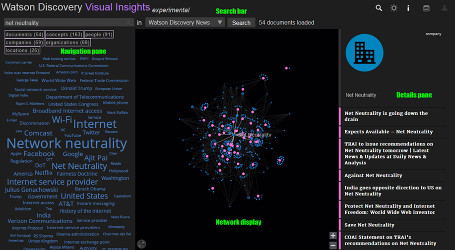

---

copyright:
  years: 2015, 2017
lastupdated: "2017-11-30"

---

{:shortdesc: .shortdesc}
{:new_window: target="_blank"}
{:tip: .tip}
{:pre: .pre}
{:codeblock: .codeblock}
{:screen: .screen}
{:javascript: .ph data-hd-programlang='javascript'}
{:java: .ph data-hd-programlang='java'}
{:python: .ph data-hd-programlang='python'}
{:swift: .ph data-hd-programlang='swift'}

# Watson Discovery Visual Insights
{: #visual-insights}

{{site.data.keyword.discoveryfull}} Visual Insights est une fonction expérimentale que vous pouvez utiliser pour explorer visuellement les connexions identifiées au travers de la compréhension d'éléments sémantiques, de relations, de concepts, etc. par {{site.data.keyword.discoveryshort}}. 

Vous pouvez utiliser {{site.data.keyword.discoveryfull}} Visual Insights pour en apprendre davantage sur vos collections, avant d'utiliser {{site.data.keyword.discoveryshort}} pour créer des requêtes que vous pouvez intégrer dans votre nouvelle application ou dans une solution existante qui attireront l'attention des utilisateurs sur les informations dont ils ont besoin. 

Dans le cadre de l'édition expérimentale, Visual Insights est disponible uniquement dans des environnements publics. 

**Clause de protection :** Visual Insights est une fonction expérimentale, ce qui signifie qu'elle peut être instable, qu'elle peut changer fréquemment et sa commercialisation peut être arrêtée dans des délais rapides. Elle est fournie afin de vous permettre d'évaluer sa fonctionnalité. Son niveau de performance ou de compatibilité peut être différent de celui offert par les fonctions commercialisées partout. Elle n'a pas été conçue pour être utilisée dans un environnement de production, et si vous passez outre cette recommandation, vous le faites à vos risques et périls. Pour plus d'informations, voir [Fonctions bêta/expérimentales](/docs/services/discovery/release-notes.html#beta-features). 

## Tour d'horizon de Visual Insights
{: #quick-tour-visual-insights}

L'écran Visual Insights est divisé en 4 zones principales. 

### Barre de recherche
{: #search-bar}

Vous pouvez exécuter une requête sur des collections {{site.data.keyword.discoveryshort}} en utilisant la **barre de recherche** située en haut de l'écran. 

- Si vous êtes connecté avec vos données d'identification {{site.data.keyword.Bluemix_notm}}, toutes les collections issues des instances {{site.data.keyword.discoveryshort}} associées à votre compte seront disponibles dans la liste déroulante de collections ({{site.data.keyword.discoverynewsfull}} par défaut). Si vous n'êtes pas connecté, seule la collection {{site.data.keyword.discoverynewsfull}} sera disponible. 
- Choisissez votre collection, entrez votre requête (par exemple, `What is net neutrality`) dans la zone de recherche, puis cliquez sur le bouton **Search** pour lancer la recherche. Pour les collections de grande taille, l'affichage des résultats peut prendre 1 minute ou plus. Vous pouvez affiner votre recherche en cliquant sur les boutons `documents`, `concepts`, `people`, `locations`, `organizations` ou `companies`. 
- Vous pouvez éventuellement sélectionner un élément dans les résultats affichés (entité, concept ou document) en cliquant sur l'icône  dans l'en-tête. 
- Si une collection privée est sélectionnée et aucune requête n'a été saisie, jusqu'à 1 000 documents issus de la collection seront affichés dans le[panneau Details](/docs/services/discovery/visual-insights.html#details-pane). Si la collection {{site.data.keyword.discoverynewsshort}} est choisie et aucune requête n'a été saisie, une sélection de 100 articles récents sera affichée. 

### Ecran Network
{: #network-display}

Le panneau central situé au-dessous de la barre de recherche est l'**écran Network**. Il s'agit de la visualisation interactive de vos résultats de requête. 

- L'**écran Network** est une représentation graphique des documents, des entités et des concepts extraits des résultats de requête. Les noeuds de couleur rose représentent des documents, les noeuds de couleur bleu représentent des entités ou des concepts. Chaque noeud de document est lié à tous les noeuds d'entité et de concept d'entité qui ont été détectés dans ce document par {{site.data.keyword.discoveryshort}}. Plus les documents sont semblables, plus ils seront proches dans la visualisation. 
- Lorsque vous survolez un noeud sur l'**écran Network**, le titre qui lui est associé s'affiche et ses liens vers d'autres noeuds sont mis en évidence. 
- Lorsque vous cliquez sur un noeud, les informations relatives à ce noeud sont affichées dans le [panneau Details](/docs/services/discovery/visual-insights.html#details-pane).

### Panneau Details
{: #details-pane}

Le **panneau Details** est situé à droite de l'écran Network.

- Le panneau Details contient davantage de détails sur chaque document, y compris sa classification et sa date (le cas échéant), un bref extrait (avec la possibilité d'ouvrir le document complet), ainsi que les entités et les concepts auxquels il est lié. 
- Si un noeud autre qu'un document a été sélectionné sur l'écran Network, les informations sur ce noeud s'affichent en haut du panneau Details. 
- Cliquez sur n'importe quelle entité liée ou sur n'importe quel concepts lié dans le panneau Details que le noeud correspondant soit sélectionné dans l'écran Network. 

### Panneau de navigation
{: #navigation-pane}

Le **panneau de navigation** est situé à gauche de l'écran Network. Ce panneau fournit une présentation sous forme de nuage de balises des termes les plus courants extraits des résultats de requête dans la collection choisie. Plus le terme est long, plus il est courant dans les résultats de requête. 

- Lorsqu'un terme est sélectionné dans le nuage de balises, il devient rose et les documents présents sur l'écran Network qui lui sont associés sont mis en évidence. Le panneau Details affiche la liste des documents mis en évidence. Les autres termes du nuage de balises indiquent maintenant leur relation avec le terme sélectionné :
  - Les termes grisés ne sont associés à aucun des documents mis en évidence. 
  - Si un terme devient violet, il est associé à tous les documents mis en évidence et il ne vous sera d'aucune aide si vous essayez de distinguer un document par rapport à un autre. 
  - Les termes qui restent en bleu sont associés à certains des documents mis en évidence. Par conséquent, ils peuvent être utilisés pour affiner davantage l'ensemble de documents mis en évide. Lorsque vous sélectionnez l'un de ces termes, vous réduisez l'ensemble de documents mis en évidence à ceux qui sont associés aux deux balises et, sur l'écran Network, un zoom avant est effectué sur la région où se trouvent ces documents. Cette méthode peut être utilisée pour transformer un grand ensemble de documents en un petit ensemble de documents en quelques clics seulement. 
- Pour désélectionner un terme sélectionné, cliquez à nouveau sur ce terme. Pour désélectionner tous les termes, cliquez sur une zone vide entre les mots du nuage de balises. Lorsque vous cliquez sur une balise grise, la sélection existante est annulée et ce terme est sélectionné. 
- Les types et nombres de documents, de personnes, de concepts, d'organisations, d'emplacements et d'entreprises sont affichés au-dessus du nuage de balises. Cliquez sur l'un d'eux pour filtrer le nuage de balises et la visualisation de l'écran Network. 

## Utilisation de Visual Insights
{: #using-visual-insights}

Vous pouvez utiliser Visual Insights pour exécuter des requêtes sur {{site.data.keyword.discoverynewsfull}} sans vous connecter. Pour visualiser Visual Insights avec vos propres collections, vous aurez besoin des éléments suivants :

- Un compte {{site.data.keyword.Bluemix_notm}} qui contient une instance {{site.data.keyword.discoveryshort}}.
- Une ou plusieurs collections de cette instance {{site.data.keyword.discoveryshort}} qui ont été enrichies avec l'enrichissement [Entity Extraction](/docs/services/discovery/building.html#entity-extraction), et le cas échéant, n'importe lequel des enrichissements [Concept Tagging](/docs/services/discovery/building.html#concept-tagging), [Keyword Extraction](/docs/services/discovery/building.html#keyword-extraction), [Relation Extraction](/docs/services/discovery/building.html#relation-extraction) et [Category Classification](/docs/services/discovery/building.html#category-classification). D'autres enrichissements peuvent être inclus, mais ils ne seront pas représentés par Visual Insights.

Pour plus d'informations sur {{site.data.keyword.discoveryshort}} et pour savoir comment commencer à l'utiliser gratuitement, voir [Watson {{site.data.keyword.discoveryshort}} ](https://www.ibm.com/watson/services/discovery/){: new_window}.

Dès lors que vous possédez un compte {{site.data.keyword.Bluemix_notm}}, une instance {{site.data.keyword.discoveryshort}} et une ou plusieurs collections remplies, vous voyez vos collections dans Visual Insights lorsque vous vous connectez. 

Connexion à Visual Insights

1. Ouvrez [{{site.data.keyword.discoveryshort}} Visual Insights ](https://visual-insights.bluemix.net){: new_window}.
1. Cliquez sur l'icône  dans la barre de recherche. 
1. Entrez votre ID et votre mot de passe {{site.data.keyword.Bluemix_notm}}. Dans quelques instants, vos collections seront disponibles pour sélection dans la barre de recherche.

## Envoi de commentaires
{: #providing-feedback}

Nous souhaitons connaître votre avis sur {{site.data.keyword.discoveryshort}} Visual Insights. Pour accéder au lien permettant de fournir des commentaires en retour, cliquez sur l'icône  dans l'en-tête. 
