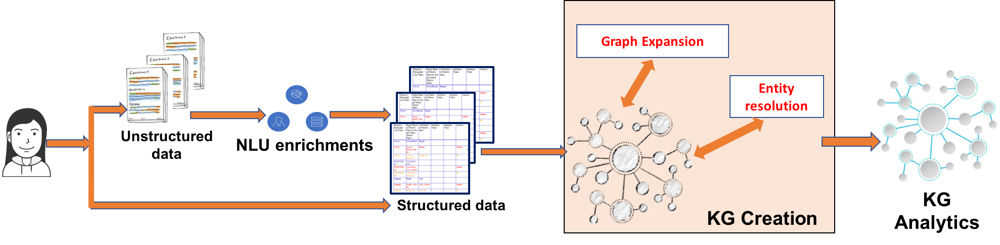

---

copyright:
  years: 2015, 2018
lastupdated: "2018-06-09"

---

{:shortdesc: .shortdesc}
{:new_window: target="_blank"}
{:tip: .tip}
{:pre: .pre}
{:codeblock: .codeblock}
{:screen: .screen}
{:javascript: .ph data-hd-programlang='javascript'}
{:java: .ph data-hd-programlang='java'}
{:python: .ph data-hd-programlang='python'}
{:swift: .ph data-hd-programlang='swift'}

# Watson Discovery Knowledge Graph
{: #kg}

I grafi della conoscenza vanno oltre i soli dati e informazioni, effettuando le connessioni all'interno dei tuoi dati nei documenti e generando nuove conoscenze. Forniamo la tecnologia IA che crea automaticamente grafi della conoscenza personalizzati da dati non strutturati estraendo e rimuovendo l'ambiguità delle entità e delle relazioni, arricchendo le relazioni utilizzando tecniche algoritmiche e classificando i risultati utilizzando algoritmi di pertinenza. I grafi della conoscenza possono funzionare come "hub di conoscenza" per la tua azienda e possono essere utilizzati per la ricerca aziendale, il riepilogo, i motori di raccomandazione, altri processi decisionali - ad esempio, rilevando frodi, sprechi o abusi. L'utilizzo di un modello personalizzato (creato in {{site.data.keyword.knowledgestudioshort}}) nel processo di creazione del grafo della conoscenza, può aiutare a creare i KG specifici del dominio con applicabilità in domini come finanziario, tecnologia, sicurezza, intelligence, salute e molti altri. Consulta [Integrazione con {{site.data.keyword.knowledgestudiofull}}](/docs/services/discovery/integrate-wks.html) per ulteriori informazioni sull'integrazione di {{site.data.keyword.discoveryshort}} con {{site.data.keyword.knowledgestudioshort}}.


Due endpoint RESTful aggiunti a {{site.data.keyword.discoveryfull}} forniscono la capacità di cercare le entità e le relazioni disambiguate e arricchite e le relazioni tra i documenti nelle raccolte dei documenti non strutturate. I risultati della ricerca possono essere classificati per rilevanza o per popolarità. Oltre a un token di ricerca, le API possono utilizzare le parole di contesto o i passaggi facoltativi che trovano più entità e relazioni pertinenti all'interno del grande grafo della conoscenza creato automaticamente.

 La seguente figura illustra come i grafi della conoscenza si adattano nella pipeline {{site.data.keyword.discoveryfull}} corrente. Gli arricchimenti {{site.data.keyword.nlushort}} utilizzano un modello {{site.data.keyword.knowledgestudioshort}} personalizzato (`en-news`) per estrarre le entità e le relazioni al livello del documento individuale. Durante la creazione del grafo della conoscenza, vengono utilizzate tecniche grafiche e di risoluzione dell'entità (automatiche) implicite per creare automaticamente un grafo di entità e relazioni collegato ai documenti. Oltre al grafo di conoscenza in fase di creazione, il servizio di analisi del grafo della conoscenza aggiunge delle tecniche di classificazione per rilevanza per restituire i risultati.



Questo grafo della conoscenza collegato e le tecniche di classificazione facilitano i seguenti casi d'utilizzo:

-  Entità senza ambiguità utilizzando un token di ricerca fuzzy, immetti le informazioni (facoltativo) e il contesto (facoltativo). Esempio: Ricerca di `Steve` nel contesto `Apple` restituisce `Steve Jobs` all'inizio mentre la ricerca di `Steve` nel contesto `Microsoft` restituisce `Steve Ballmer` all'inizio.
-  Relazioni classificate per rilevanza immettendo il token e il contesto di ricerca fuzzy (facoltativo). La classificazione per rilevanza utilizza le proprietà globali del grafo per dare rilievo a informazioni più specifiche. Esempio: la ricerca delle relazioni di `Obama` nel contesto `health` restituisce `Affordable Care Act` e altre entità correlate.
-  Deduzioni e aggregazioni nei documenti mediante l'esecuzione di query per entità e relazioni in un grafo della conoscenza collegato. Alcuni esempi di queste query sono: Come la persona X è collegata alla persona Y? Quanto sono diversi i modelli di accesso ai dati del dipendente X dalla norma? Qual è la sfera di influenza della persona X?

## Requisiti del servizio

Durante la release beta, la funzionalità del grafo della conoscenza e i relativi metodi associati sono disponibili solo per le istanze del servizio sottoscritte ai piani **Advanced**, **Premium** e a tutti gli ambienti dedicati.

Questa funzione beta è attualmente supportata solo in inglese, consulta [Supporto per la lingua](/docs/services/discovery/language-support.html#feature-support) per i dettagli.

## Requisiti della raccolta

{{site.data.keyword.discoveryshort}} utilizza entità e relazioni estratte dai documenti inseriti per formare il grafo della conoscenza e per consentire le query di entità e relazione.

**Nota:** [Somiglianza dell'entità](/docs/services/discovery/building-kg.html#similarity), [Controllo](/docs/services/discovery/building-kg.html#evidence) e [Canonizzazione e filtro](/docs/services/discovery/building-kg.html#canonicalization) sono disponibili in tutte le raccolte. Per le raccolte create prima del `03-05-2018`, devi reinserire i tuoi documenti per poter utilizzare queste funzioni.

**Nota:** il grafo della conoscenza può essere utilizzato solo su raccolte di dati privati, non è progettato per l'utilizzo con {{site.data.keyword.discoverynewsshort}}.

Per utilizzare il grafo della conoscenza, la raccolta deve essere configurata per soddisfare i requisiti specifici nel modo seguente:

-  Devono essere specificati gli arricchimenti `entities` e `relations` per i campi che utilizzeranno il grafo della conoscenza e ogni arricchimento deve utilizzare lo stesso modello personalizzato. Se viene utilizzato il modello pubblico (disponibile senza l'utilizzo di {{site.data.keyword.knowledgestudioshort}}) deve essere specificato nel formato di un modello personalizzato `model="en-news"`.

-  Gli arricchimenti `relations` devono essere specificati nel modo seguente:
   ```json
   "relations": {
     "model": "en-news"
   }
   ```
   {: codeblock}

-  L'arricchimento `entities` deve essere specificato nel modo seguente e deve avere anche i parametri `mentions`, `mentions_types` e `sentence_locations` specificati:
   ```json
   "entities": {
     "mentions": true,
     "mention_types": true,
     "sentence_locations": true,
     "model": "en-news"
   }
   ```
   {: codeblock}

   Possono essere specificate anche altre opzioni `enrichments` facoltative come `"sentiment": true` se desiderato. Saranno archiviate nell'indice di rilevamento come arricchimenti, ma non saranno utilizzate come nodi nel grafo della conoscenza stesso.

Queste opzioni **non possono essere aggiunte** utilizzando la strumentazione {{site.data.keyword.discoveryshort}}, deve essere caricata una configurazione personalizzata utilizzando l'API. Una copia della configurazione predefinita modificata per arricchire il campo `text` in modo che la raccolta possa essere utilizzata con il grafo della conoscenza con il modello pubblico è disponibile [qui](https://raw.githubusercontent.com/watson-developer-cloud/doc-tutorial-downloads/master/discovery/config-default-kg.json).

Crea una configurazione personalizzata nel seguente modo, dopo aver creato un'istanza del servizio {{site.data.keyword.discoveryshort}}:

1. Immetti il seguente comando per creare un ambiente denominato `my-first-environment`. Sostituisci `{apikey_value}` con il valore della chiave API del tuo servizio:

   ```bash
   curl -X POST -u "apikey":"{apikey_value}" -H "Content-Type: application/json" -d '{ "name":"my-first-environment", "description":"exploring environments"}' "api/v1/environments?version=2017-11-07"
   ```
   {: pre}

   L'API restituisce informazioni come l'ID ambiente, lo stato dell'ambiente e la quantità di memoria che il tuo ambiente sta utilizzando.

   Avrai bisogno che venga restituito `{environment_id}`; assicurati di salvare tale ID per un utilizzo successivo.

1. Successivamente, crea la configurazione personalizzata. Questa procedura presume che stai caricando quella trovata [qui](https://raw.githubusercontent.com/watson-developer-cloud/doc-tutorial-downloads/master/discovery/config-default-kg.json). Se vuoi creare una tua configurazione personalizzata, consulta il [riferimento della configurazione](/docs/services/discovery/custom-config.html).

   ```bash
   curl -X POST -u "apikey":"{apikey_value}" -H "Content-Type: application/json" -d @config-default-kg.json "https://gateway.watsonplatform.net/discovery/api/v1/environments/{environment_id}/configurations?version=2017-11-07"
   ```
   {: pre}

   **Se già hai una configurazione personalizzata e desideri aggiornarla e utilizzarla**, utilizza il {configuration ID} della tua configurazione personalizzata in questo comando.

   ```bash
   curl -X PUT -u "apikey":"{apikey_value}" -H "Content-Type: application/json" -d @config-default-kg.json "https://gateway.watsonplatform.net/discovery/api/v1/environments/{environment_id}/configurations/{configuration ID}?version=2017-11-07"
   ```
   {: pre}

1. Dopo che la configurazione personalizzata è stata caricata può essere utilizzata in qualsiasi raccolta che crei, qualsiasi metodo per caricare i documenti può essere utilizzato fino a quando viene specificata la configurazione personalizzata. Se non hai familiarità con la creazione di raccolte e sul caricamento dei documenti, consulta [Introduzione alla strumentazione](/docs/services/discovery/getting-started-tool.html). Quando sei al [passo 3](/docs/services/discovery/getting-started-tool.html#create-custom-configuration) seleziona `Knowledge Graph Configuration` invece di creare una nuova configurazione.

## Canonizzazione e filtro
{: #canonicalization}

Tutte le entità nei documenti inseriti dopo il `5 marzo 2018` saranno automaticamente normalizzate con nomi canonici derivati da una directory pubblica. Inoltre, gli eventuali pronomi inclusi nelle entità o nelle relazioni ad esempio: `he`, `she`, `they` o `it` vengono automaticamente filtrati prima dell'inserimento nel grafo della conoscenza. I documenti inseriti prima del `5 marzo 2018` non includeranno questo livello di canonizzazione e filtro; dovrai creare nuove raccolte e reinserire i tuoi documenti in modo da poter utilizzare questa funzione.

Quando crei una query delle entità o delle relazioni nel grafo della conoscenza, puoi immettere il nome canonico o il testo originale dell'entità nel campo `text` del metodo `query_entities` o `query_relations`.


## Query delle entità
{: #entities}

La release beta della query delle entità del grafo della conoscenza supporta query [disambiguation](/docs/services/discovery/building-kg.html#disambiguation) e [similarity](/docs/services/discovery/building-kg.html#similarity) di entità basate sul contesto. Una query dell'entità del grafo della conoscenza viene eseguita da un oggetto `POST`ing a `JSON` nell'endpoint `v1/environments/{environment_id}/collections/{collection_id}/query_entities`.

Puoi eseguire la query delle entità utilizzando l'API o la strumentazione {{site.data.keyword.discoveryshort}}. Consulta [Esecuzione di query del grafo della conoscenza utilizzando la strumentazione Discovery](/docs/services/discovery/building-kg.html#querying-kg) per informazioni sulla strumentazione.

L'oggetto JSON della query dell'entità del grafo della conoscenza prende il seguente formato:

```json
    {
  "feature": "disambiguate",
  "entity": {
    "text": "Steve",
    "type": "Person",
    "exact": "false"
  },
  "context": {
    "text": "iphone"
  },
  "count": 10,
  "evidence_count": 0
}
```
{: codeblock}

-  `"feature": string` _required_ - la funzione di query dell'entità da utilizzare. Le funzioni supportate sono: [disambiguate](/docs/services/discovery/building-kg.html#disambiguation) e [similar_entities](/docs/services/discovery/building-kg.html#similarity).
-  `"entity": {}` _required_ - un oggetto che contiene le informazioni sull'entità da distinguere.
   -  `"text": string` _required_ - il testo dell'entità che sarà distinto
   -  `"type": string` _optional_ - il tipo di entità facoltativo da distinguere, se non specificato, vengono inclusi tutti i tipi.
   -  `"exact": boolean` _optional_ - Se 'false', viene eseguita la disambiguazione implicita. La disambiguazione implicita utilizzerà la prima entità senza ambiguità per ogni oggetto dell'entità di input. Dovrebbe essere impostato su `false` per `"feature": "disambiguate"`. Il valore predefinito è `false`.
-  `"context": {}` _optional_ - un oggetto facoltativo che include i requisiti contestuali per la disambiguazione.
   -  `"text": string` _optional_ - testo dell'entità per fornire il contesto per l'entità sottoposta a query e la classificazione in base a tale associazione. Ad esempio, se vuoi eseguire la query della città di Londra in Inghilterra la tua query dovrebbe cercare `London` con il contesto `England`. L'input può essere nomi parziali o grandi passaggi che contengono termini di entità rilevanti. Più termini possono essere passati insieme.
-  `"count": INT` _optional_ - Il numero di entità senza ambiguità da restituire. Il valore predefinito è `10`. Il valore massimo è `1000`
-  `"evidence_count": INT` _optional_ Il numero di istanze di prova da restituire per ciascuna entità identificata. Il valore predefinito è `0`. Il valore massimo per il campo `evidence_count` è 10.000 diviso per il numero specificato nel campo `count`. Consulta la sezione [Evidence](/docs/services/discovery/building-kg.html#evidence) di questa pagina per una descrizione dettagliata e degli esempi.

La query restituisce risultati del seguente formato:

```json
    {
  "entities": [
    {
      "text": "Steve Jobs",
      "type": "PERSON"
    },
    {
      "text": "Steve Wozniak",
      "type": "PERSON"
    }
  ]
}
```
{: codeblock}

Se non viene trovata alcuna corrispondenza, viene restituito il seguente oggetto JSON:

```json
    {
  "entities": []
}
```
{: codeblock}

### Disambiguazione entità
{: #disambiguation}

La query delle entità del grafo della conoscenza fornisce la disambiguazione dell'entità basata sul contesto. In base al testo dell'entità fornito e al testo del contesto facoltativo, `disambiguation` identifica entità univoche e restituisce un elenco di entità classificate in base alle informazioni del contesto.

Una query di disambiguazione dell'entità viene richiesta specificando `"disambiguation"` come valore del campo `"feature" :` nell'oggetto della query del grafo della conoscenza.

Ad esempio, la disambiguazione del testo dell'entità `Steve` nel contesto `iphone` potrebbe risultare in `Steve Jobs` ma viene restituito `Steve Wozniak`.


### Somiglianza entità
{: #similarity}

La query delle entità del grafo della conoscenza fornisce la somiglianza dell'entità basata sul contesto. In base al testo dell'entità fornito e al testo del contesto facoltativo, `similar_entities` identifica entità univoche e restituisce un elenco di entità classificate in base alle informazioni del contesto.

Una query di somiglianza dell'entità viene richiesta specificando `"similar_entities"` come valore del campo `"feature" :` nell'oggetto della query del grafo della conoscenza.

Ad esempio, se cerchi entità simili a `Ford` nel contesto `car`, i risultati di entità simili potrebbero includere `GM`, `Toyota` e `Nissan`.

## Query delle relazioni
{: #relations}

Le query delle relazioni del grafo della conoscenza supportano la ricerca delle relazioni rilevanti in base alle entità di input utilizzando la disambiguazione dell'entità implicita, le relazioni basate sul contesto, l'ordinamento per punteggio rilevante e numero di menzioni e il filtro per tipo e ID documento.

Puoi eseguire la query delle relazioni utilizzando l'API o la strumentazione {{site.data.keyword.discoveryshort}}. Consulta [Esecuzione di query del grafo della conoscenza utilizzando la strumentazione Discovery](/docs/services/discovery/building-kg.html#querying-kg) per informazioni sulla strumentazione.

Una query dell'entità del grafo della conoscenza viene eseguita da un oggetto `POST`ing a `JSON` nell'endpoint `v1/environments/{environment_id}/collections/{collection_id}/query_relations`. L'oggetto JSON della query delle relazioni del grafo della conoscenza prende il seguente formato:

```json
    {
  "entities": [
    {
      "text": "Steve Jobs",
      "type": "PERSON",
      "exact": true
    }
  ],
  "context": {
    "text": "iphone"
  },
  "sort": "score",
  "filter": {
    "relation_types": {
      "exclude": ["colocation"],
      "include": ["locatedAt", "employedBy", "managerOf", "founderOf"]
    },
    "entity_types": {
      "exclude": ["EVENT"],
      "include": ["PERSON", "GPE", "ORGANIZATION"]
    },
    "document_ids": ["b95df4c1-d00f-4771-abb2-a52baea0444a", "ad340635-bf3e-47a5-bea5-5e778f600c32"]
  },
  "count": 10,
  "evidence_count": 0
}
```
{: codeblock}

-  `"entities": []` _required_ - un array che contiene le entità su cui sarà eseguita la query delle relazioni. Vengono restituite tutte le relazioni simili se viene definito solo un oggetto dell'entità. Quando viene definito più di un oggetto dell'entità, vengono restituite le relazioni a coppie reciproche. Le relazioni a coppie reciproche restituiscono le relazioni dirette tra le entità di input piuttosto che le relazioni con tutte le entità simili. Ogni oggetto entità contiene:
   -  `"text": string` _required_ - il testo dell'entità.
   -  `"type": string` _optional_ - il tipo di entità facoltativo. Questo campo è obbligatorio se `"exact"` è `true`.
   -  `"exact": boolean` _optional_ - Se 'false', viene eseguita la disambiguazione implicita. La disambiguazione implicita utilizzerà la prima entità senza ambiguità per ogni oggetto dell'entità di input. Il valore predefinito è `false`.
-  `"context": {}` _optional_ - un oggetto facoltativo che include i requisiti contestuali.
   -  `"text": string` _optional_ - Testo dell'entità per fornire il contesto per l'entità sottoposta a query e la classificazione in base a tale associazione. Ad esempio, se vuoi eseguire la query della città di Londra in Inghilterra la tua query dovrebbe cercare `London` con il contesto `England`. L'input può essere nomi parziali o grandi passaggi che contengono termini di entità rilevanti. Più termini possono essere passati insieme.
-  `"sort": string` _optional_ - il metodo di ordinamento delle relazioni, può essere `score` o `frequency`. Il valore predefinito è `score`. `score` si basa sulla rilevanza delle relazioni e dei valori simili all'entità di input e rilevanza per il contesto se viene fornito. `frequency` è il numero di volte in cui viene identificata ogni relazione.
-  `"filter": {}` _optional_ - un oggetto contenente i tipi di relazione, i tipi di entità e i documenti specifici da filtrare per questa query. Per impostazione predefinita non viene escluso nulla.
   -  `"relation_types": {}` _optional_ un elenco di tipi di relazione da filtrare.
      -  `"exclude": []` _optional_ un elenco separato da virgole dei tipi di relazione da escludere dalla query.
      -  `"include": []` _optional_ un elenco separato da virgole dei tipi di relazione da includere esplicitamente nella query. Se specificato, tutti gli altri tipi sono considerati esclusi.
   -  `"entity_types": {}` _optional_ un elenco dei tipi di entità per filtrare i valori simili. Non applicabile per l'input di più entità perché non viene restituito alcun valore simile.
      -  `"exclude": []` _optional_ un elenco separato da virgole dei tipi di entità da escludere dalla query.
      -  `"include": []` _optional_ un elenco separato da virgole dei tipi di entità da includere esplicitamente nella query. Se specificato, tutti gli altri tipi sono considerati esclusi.
   -  `"document_ids": []` _optional_ un elenco separato da virgole di documenti su cui eseguire la query della relazione.
-  `"count": INT` _optional_ Il numero di relazioni da restituire. Il valore predefinito è `10`. Il valore massimo è `1000`.
-  `"evidence_count": INT` _optional_ Il numero di istanze di prova da restituire per ciascuna relazione identificata. Il valore predefinito è `0`. Il valore massimo per il campo `evidence_count` è 10.000 diviso per il numero specificato nel campo `count`. Consulta la sezione [Evidence](/docs/services/discovery/building-kg.html#evidence) di questa pagina per una descrizione dettagliata e degli esempi.

La query restituisce i risultati nel seguente formato:

```json
    {
  "relations": [
    {
      "type": "FOUNDEROF",
      "frequency": 7,
      "arguments": [
        {
          "entities": [
            {
              "type": "PERSON",
              "text": "Steve Jobs"
            }
          ]
        },
        {
          "entities": [
            {
              "type": "ORGANIZATION",
              "text": "Apple"
            }
          ]
        }
      ]
    }
  ]
}
```
{: codeblock}

In ogni oggetto nell'array delle relazioni, viene restituito un array di argomenti contenente una coppia di array di entità, il primo che è l'origine o il soggetto e il secondo che è la destinazione o l'oggetto della relazione.

Se non viene trovata alcuna corrispondenza, viene restituito il seguente oggetto JSON:

```json
    {
  "relations": []
}
```
{: codeblock}

## Controllo
{: #evidence}

Per alcune query di entità o di relazione potrebbe essere utile per comprendere dove sono state identificate le connessioni. Il controllo delle connessioni vi permetterà di fare riferimento al documento originale, chiarire i risultati o ulteriore disambiguazione come appropriato. A partire dalle raccolte create dopo il `03-05-2018', gli endpoint `query_relations` e `query_relations` hanno la possibilità di fornire il controllo nei risultati restituiti. Questa funzione è disponibile per le raccolte create prima del `03-05-2018`, ma i documenti dovranno essere reinseriti per utilizzare questa funzione sulle raccolte più vecchie.

Il controllo viene restituito aggiungendo il campo `"evidence_count": INT` all'oggetto di query. Questo numero rappresenta il numero di elementi di controllo che saranno restituiti per elemento di risposta. Ad esempio, se si specifica un `"count":` di `5` elementi di risposta e `"evidence_count": 2`, la risposta dovrebbe contenere un totale di `10` elementi di controllo (2 per risposta).  Il numero massimo di elementi di controllo restituiti in totale per una singola query è 10.000.

Nelle risposte `query_entities`, ogni oggetto nell'array `entities` conterrà il numero specificato di oggetti `evidence`. Questi oggetti includono il `document_id` del documento in cui è stato trovato il controllo, in quale `field` è stato rilevato, l'ubicazione del controllo all'interno di tale campo e l'ubicazione esatta dell'entità identificata.

```json
    {
      "text": "Steve Jobs",
      "type": "Person",
      "evidence": [
        {
          "document_id": "cb77ce6b-bb93-42a0-8643-dfb523e14da8",
          "field": "description",
          "start_offset": 305,
          "end_offset": 392,
          "entities": [
            {
              "type": "Person",
              "text": "Steve Jobs",
              "start_offset": 311,
              "end_offset": 321
            }
          ]
        }
      ]
    }

```
{: codeblock}

In `query_relations` ogni oggetto nell'array `relations` conterrà il numero specificato di oggetti `evidence`. L'`evidence` restituito è strutturato nello stesso modo di `query_relations` con le ubicazioni di tutte le entità correlate specificate.

```json
    {
      "type": "founderOf",
      "frequency": 7,
      "arguments": [
        {
          "entities": [
            {
              "type": "Person",
              "text": "Steve Jobs"
            }
          ]
        },
        {
          "entities": [
            {
              "type": "Organization",
              "text": "Apple"
            }
          ]
        }
      ],
      "evidence": [
        {
          "document_id": "b95df4c1-d00f-4771-abb2-a52baea0444a",
          "field": "text",
          "start_offset": 243,
          "end_offset": 303,
          "entities": [
            {
              "type": "Organization",
              "text": "Apple",
              "start_offset": 293,
              "end_offset": 298
            },
            {
              "type": "Person",
              "text": "Steve Jobs",
              "start_offset": 243,
              "end_offset": 253
            }
          ]
        }
      ]
    }
```
{: codeblock}

## Esecuzione di query del grafo della conoscenza utilizzando la strumentazione Discovery
{: #querying-kg}

Quelle con le istanze del servizio sottoscritte nel piano [**Advanced**](/docs/services/discovery/building-kg.html#service-requirements) possono eseguire query di raccolte private con il grafo della conoscenza utilizzando la strumentazione {{site.data.keyword.discoveryshort}}.

Per accedere all'esecuzione di query del grafo della conoscenza nella strumentazione {{site.data.keyword.discoveryshort}}:

1.  Fai clic su <!-- {width="20" height="20" style="padding-left:5px;padding-right:5px;"} --> per aprire la pagina di query.
1.  Seleziona la tua raccolta e fai clic su **Get started**.
1.  Nella schermata **Build queries**, scegli la scheda **Knowledge graph** e **Entities** o **Relationships**.

**Nota:** non tutte le funzioni del grafo della conoscenza sono disponibili quando utilizzi la strumentazione {{site.data.keyword.discoveryshort}}.
