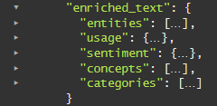

---

copyright:
  years: 2015, 2018
lastupdated: "2018-10-23"

---

{:shortdesc: .shortdesc}
{:new_window: target="_blank"}
{:tip: .tip}
{:pre: .pre}
{:codeblock: .codeblock}
{:screen: .screen}
{:javascript: .ph data-hd-programlang='javascript'}
{:java: .ph data-hd-programlang='java'}
{:python: .ph data-hd-programlang='python'}
{:swift: .ph data-hd-programlang='swift'}

# Concetti delle query
{: #query-concepts}

Il servizio {{site.data.keyword.discoveryfull}} offre potenti funzionalità di ricerca di contenuto. Dopo che il tuo contenuto è stato caricato e arricchito dal servizio {{site.data.keyword.discoveryshort}}, puoi creare delle query e integrare quindi {{site.data.keyword.discoveryshort}} nei tuoi progetti oppure creare un'applicazione personalizzata utilizzando il {{site.data.keyword.watson}} Explorer Application Builder.
{: shortdesc}

  Le query che scrivi varieranno in base alla raccolta poiché tutte le raccolte contengono del contenuto univoco.
  {: tip}

Quando crei una query o un filtro, {{site.data.keyword.discoveryshort}} esamina ciascun risultato e prova a mettere in corrispondenza i percorsi da te definiti. Le eventuali corrispondenze riscontrate vengono aggiunte alle serie di risultati. Quando crei una query, puoi scegliere in che misura essere vago o specifico. Più è specifica la query e più saranno mirati i risultati.

Hai anche l'opzione di attivare il richiamo dei passaggi. I passaggi sono estratti brevi e pertinenti dai documenti completi restituiti dalla tua query. Questi passaggi mirati vengono estratti dai campi `text` dei documenti nella tua raccolta. Per impostazione predefinita, per una query verranno restituiti fino a 10 passaggi di circa 400 caratteri ognuno. Per un singolo risultato viene estratto un massimo di tre passaggi. Il parametro `passages` è disponibile solo per raccolte private; non è disponibile nella raccolta {{site.data.keyword.discoverynewsshort}}. Per ulteriori informazioni sul modo in cui vengono identificati i passaggi, vedi [Passaggi](/docs/services/discovery/query-parameters.html#passages).

  Puoi scrivere query in linguaggio naturale (come "collaborazioni di IBM Watson") utilizzando la strumentazione {{site.data.keyword.discoveryshort}} oppure l'API.
  {: tip}

Le raccolte formate restituiranno un punteggio `confidence` nel risultato di una query in linguaggio naturale. Per i dettagli, vedi [Punteggi di affidabilità](/docs/services/discovery/train-tooling.html#confidence).

{{site.data.keyword.discoveryshort}} restituisce risultati della query che includono caratteri speciali per le seguenti lingue: inglese, tedesco, francese, olandese, italiano e portoghese. Ad esempio, se esegui una query per `aqui`, riceverai ora i risultati sia per `aqui` che per <code>aqu&iacute;</code>.

Puoi creare query più lunghe e più complesse che includono più filtri e aggregazioni complesse. Questa opzione è disponibile solo nell'API e aumenterà il limite di caratteri di una query a 10.000 caratteri. Vedi [Long collection queries ](https://www.ibm.com/watson/developercloud/discovery/api/v1/curl.html?curl#query){: new_window} e [Long environment queries ](https://www.ibm.com/watson/developercloud/discovery/api/v1/curl.html?curl#federated-query){: new_window} per i dettagli.

{{site.data.keyword.discoveryfull}} Knowledge Graph è una funzione beta che fornisce nuovi endpoint per l'esecuzione di query di entità e relazioni sui documenti. Ciò include le ricerche basate sul contesto e la classificazione della pertinenza. Per informazioni, vedi [{{site.data.keyword.discoveryfull}} Knowledge Graph](/docs/services/discovery/building-kg.html).

Per ulteriori informazioni relative alla scrittura di query, consulta:
- [Esercitazione introduttiva alle query](/docs/services/discovery/getting-started-query.html)
- [Guida di riferimento per le query](/docs/services/discovery/query-reference.html) (include l'elenco di parametri, operatori e aggregazioni disponibili nel {{site.data.keyword.discoveryshort}} Query Language)

## Lo schema di dati Discovery
{: #discovery-schema}

Inizia acquisendo dimestichezza con JSON {{site.data.keyword.discoveryshort}}. Per comprendere come creare una query utilizzando il {{site.data.keyword.discoveryshort}} Query Language, devi avere dimestichezza con il JSON prodotto da {{site.data.keyword.discoveryshort}} dopo che ha arricchito i documenti nella tua raccolta. Una volta che avrai acquisito dimestichezza con lo schema di dati dei tuoi documenti, sarà più facile scrivere query nel {{site.data.keyword.discoveryshort}} Query Language. Ci sono tre modi per farlo.

  1. Nella strumentazione {{site.data.keyword.discoveryshort}}, apri la schermata **Manage data** e scegli la raccolta che contiene i comunicati stampa di {{site.data.keyword.IBM_notm}}. Fai clic sul pulsante **View Data Schema**. La schermata **View data schema** visualizza i campi e i valori nei tuoi documenti trasformati in due modi: in base al documento (**vista Document**) o in base al campo **vista Collection**). Nella **vista Document** verrà visualizzato un massimo di 50 documenti. La **vista Collection** visualizzerà i campi nell'intera raccolta.

    Nella **vista Collection**, sotto `enriched_text`, puoi esaminare gli arricchimenti che hai applicato con il file **Default Configuration**. Fai clic su `categories`, `concepts`, `entities` e `sentiment` per vedere in che modo la tua raccolta è stata arricchita con l'analisi approfondita di Watson.

  1. Esegui una query "vuota" per visualizzare il JSON. Nella schermata **View data schema**, fai clic sul pulsante **Build queries** e fai quindi clic su **Run Query**. I risultati vengono visualizzati sulla destra, in due schede: **Summary** (una panoramica dei risultati della query) e **JSON**. Inizia aprendo la scheda **JSON**.

     -  Ciascuno dei quattro documenti sarà preceduto da un numero `id`.
     -  Scorrere verso il basso al campo `enriched_text`. Esamina ogni arricchimento per acquisire informazioni sui campi JSON su cui puoi eseguire delle query.

        

     -  **entities** - inizia trovando il campo `text` ed esamina le altre informazioni sull'arricchimento.
     -  **sentiment** - inizia trovando il campo `label` ed esamina le altre informazioni sull'arricchimento.
     -  **concepts** - inizia trovando il campo `text` ed esamina le altre informazioni sull'arricchimento.
     -  **categories** - inizia trovando il campo `document` ed esamina le altre informazioni sull'arricchimento.

     Dopo che hai esaminato l'analisi approfondita nel primo documento, puoi esaminare gli altri tre documenti, se lo desideri.

  1. Visualizzare i campi disponibili nel **Visual Query Builder**. Nella schermata **Build queries**, fai clic su **Search for documents** e quindi su **Use the {{site.data.keyword.discoveryshort}} Query Language**. Fai clic sull'elenco a discesa **Field** per visualizzare i campi disponibili nei tuoi dati. Fai clic su **Edit in query language** per creare delle query manualmente utilizzando il {{site.data.keyword.discoveryshort}} Query Language.      

### Come strutturare una query di base
{: #structure-basic-query}

Come hai notato, JSON è gerarchico e quindi le query devono essere scritte utilizzando la stessa gerarchia. Quindi, se il tuo JSON si presenta così:

```json
"enriched_text": {
  "concepts": [
    {
    "text": "Cloud computing",
    "relevance": 0.610029}
    ]
  }
```
{: codeblock}

La struttura della tua query sarà simile alla seguente:


  Gli operatori che valutano un campo (`<=` , `>=`, `<`, `>`) richiedono un numero (`number`) o una data (`date`) come valore. Racchiudere un valore tra virgolette lo rende sempre una stringa (`string`). Pertanto, `score>=0.5` è una query valida e `score>="0.5"` non lo è. Vedi [Operatori di query](/docs/services/discovery/query-operators.html) per un elenco completo di operatori.
  {: tip}

Considerazioni:

- Non sei sicuro di quando eseguire una query su un'entità, un concetto o una parola chiave? Vedi [Descrizione della differenza tra entità, concetti e parole chiave](/docs/services/discovery/building.html#udbeck).

- **Nota:**  dopo che fai clic su **Run query** e apri la scheda **JSON**, noterai che l'evidenziazione della query è attivata per impostazione predefinita. Questo aggiungerà un campo `highlight` ai tuoi risultati della query. Nel campo `highlight`, le parole che corrispondono alla tua query saranno racchiuse nelle tag HTML `<em>` (enfsi). Vedi [Parametri di query](/docs/services/discovery/query-parameters.html#highlight) per i dettagli.

## Creazione di query combinate
{: #building-combined-queries}

Puoi combinare i parametri di query insieme per creare query più mirate. Ad esempio, puoi utilizzare entrambi i parametri `filter` e `query` insieme. Per ulteriori informazioni su un confronto tra filtro e query, vedi [Differenze tra i parametri di filtro e di query](/docs/services/discovery/query-parameters.html#filtervquery).

## Come strutturare un'aggregazione
{: #structure-aggregation}

Le aggregazioni restituiscono una serie di valori di dati; ad esempio le parole chiave più importanti, il parere generale delle entità e altro ancora. Per l'elenco completo delle opzioni di aggregazione, vedi [Aggregazioni](/docs/services/discovery/query-reference.html#aggregations).


Questa aggregazione di esempio troverà tutti i concetti (`concepts`) nella tua raccolta.
Il delimitatore in questa query è `.` e l'operatore è `()`; vedi [Operatori di query](/docs/services/discovery/query-operators.html) per informazioni sugli altri operatori disponibili nel {{site.data.keyword.discoveryshort}} Query Language.

### Query di aggregazione di esempio
{: #example-aggregations}

Ci sono diversi tipi di modi in cui puoi aggregare i risultati con {{site.data.keyword.discoverynewsshort}}, inclusi i massimi valori, somma, minimo, massimo, media, intervallo di tempo e istogramma. Puoi anche aggiungere filtri e nidificare aggregazioni.

#### Aggregazioni di filtro
{: #filter-aggregations}

Questa aggregazione di esempio restituisce il numero di articoli trovati in {{site.data.keyword.discoverynewsshort}} sui Pittsburgh Steelers e quanti di questi risultati hanno un parere positivo (`positive`), negativo (`negative`) o neutro (`neutral`).

- `filter(enriched_text.entities.text:"Pittsburgh Steelers").term(enriched_text.sentiment.document.label,count:3)`


Questa aggregazione di esempio procederà prima a restringere (filtrare) una serie di articoli in {{site.data.keyword.discoverynewsshort}} solo a quelli che includono il testo di entità twitter e dividerà quindi tali articoli in base ai tipi di parere del documento. Verranno restituiti solo i primi 3 tipi di parere del documento (`positive`, `negative`, `neutral`).

- `filter(enriched_text.entities.text:twitter).term(enriched_text.sentiment.document.label,count:3)`

#### Aggregazioni nidificate
{: #nested-aggregations}

L'aggiunta di `nested` prima di un'aggregazione limita l'aggregazione all'area dei risultati specificati. Ad esempio, `nested(enriched_text.entities)` significa che solo i componenti `enriched_text.entities` di qualsiasi risultato vengono utilizzati come base per l'esecuzione dell'aggregazione.

Questo può essere osservato facilmente guardando alle differenze tra le due query di seguito indicate:
- `filter(enriched_text.entities.disambiguation.subtype::City)` - l'aggregazione conta il numero di *Risultati* che contengono una o più `entity` con il tipo `City`
- `nested(enriched_text.entities).filter(enriched_text.entities.disambiguation.subtype::City)` - l'aggregazione conta il numero di istanze di una `entity` con il tipo `City` nei risultati.  

Inoltre, qualsiasi successiva operazione restringerà ulteriormente l'insieme di risultati rispetto al quale è possibile eseguire l'aggregazione. Ad esempio:

- `nested(enriched_text.entities).filter(enriched_text.entities.disambiguation.subtype::City)` significa che verranno aggregate solo le entità di `subtype::City`.
- `nested(enriched_text.entities).filter(enriched_text.entities.disambiguation.subtype::City).term(enriched_text.entities.text,count:3)` aggregherà le prime 3 entità di sottotipo `City`
- `filter(enriched_text.entities.disambiguation.subtype::City).term(enriched_text.entities.text,count:3)` restituirà le prime 3 entità in cui il risultato contiene almeno una entità di sottotipo `City`.

## Query di Watson Discovery News
{: #querying-news}

{{site.data.keyword.discoverynewsshort}}, un insieme di dati pubblico che è stato pre-arricchito con analisi approfondite cognitive, è anche incluso con {{site.data.keyword.discoveryshort}}. Vedi [Watson Discovery News](/docs/services/discovery/watson-discovery-news.html#watson-discovery-news) per ulteriori informazioni su questa raccolta.

Puoi eseguire una query di questa raccolta utilizzando delle query in linguaggio naturale, ad esempio "Collaborazioni di IBM Watson", oppure il {{site.data.keyword.discoveryshort}} Query Language. Per ulteriori informazioni sulle query in linguaggio naturale, vedi [Query in linguaggio naturale](/docs/services/discovery/query-parameters.html#nlq).

Non puoi regolare la configurazione di {{site.data.keyword.discoverynewsshort}}, formare o aggiungere documenti alla raccolta {{site.data.keyword.discoverynewsshort}}. Vedi una demo di quello che puoi creare con {{site.data.keyword.discoverynewsshort}} [qui](https://discovery-news-demo.ng.bluemix.net/){: new_window}.

Le raccolte {{site.data.keyword.watson}} {{site.data.keyword.discoverynewsshort}} in lingua inglese, coreana, tedesca, spagnola e giapponese sono disponibili sia dalla strumentazione {{site.data.keyword.discoveryshort}} che dall'API.

La lingua predefinita di {{site.data.keyword.watson}} {{site.data.keyword.discoverynewsshort}} nella strumentazione è l'inglese. Per passare da una lingua a un'altra, devi prima fare clic sull'icona  e scegliere quindi la lingua appropriata dall'elenco a discesa.

Per informazioni sull'esecuzione di query di una raccolta tramite l'API, vedi la [Guida di riferimento per le API ](https://www.ibm.com/watson/developercloud/discovery/api/v1/#query-collection){: new_window}. Il `collection_id` della versione in lingua inglese di Watson {{site.data.keyword.discoverynewsshort}} è `news-en`. In precedenza, il `collection_id` era `news`; se stai usando il `collection_id` precedente, continuerà a funzionare; tuttavia, sarebbe opportuno passare al nuovo `collection_id` per i nuovi progetti. Il `collection_id` della raccolta in coreano è `news-ko`, il `collection_id` in spagnolo è `news-es`, il `collection_id` in tedesco è `news-de` e il `collection_id` in giapponese è `news-ja`.

Le query {{site.data.keyword.discoverynewsfull}} visualizzano le prime 50 parole di ogni articolo nel campo JSON `text`.

Il numero massimo di risultati restituiti per una query {{site.data.keyword.watson}} {{site.data.keyword.discoverynewsshort}} è `50`. Utilizza query aggiuntive e il parametro `offset` per restituire più di `50` risultati.

Se stai utilizzando il {{site.data.keyword.discoveryshort}} Query Language, puoi includere un intervallo di date relativo nelle tue query {{site.data.keyword.discoverynewsshort}}, ad esempio `crawl_date>=now-1month`. I valori di intervallo di date validi sono `second/seconds` `minute/minutes`, `hour/hours`, `day/days`, `week/weeks`, `month/months` e `year/years`. `now` non è influenzato dal parametro `time_zone`; il fuso orario `UTC` è il valore predefinito.

Questo esempio eseguirà una query per una parola chiave all'interno di uno specifico intervallo di date. Le informazioni sul fuso orario non sono richieste:
- `enriched_text.keywords.text:"olympics", publication_date<=2018-02-15T00:00:00Z, publication_date>=2018-02-01T00:00:00Z`

Gli articoli di notizie possono essere diffusi a diversi canali di notizie e {{site.data.keyword.discoverynewsfull}} rileverà ciascuno di essi, con una conseguente presenza di articoli duplicati. Ciò significa che una query a {{site.data.keyword.discoverynewsfull}} potrebbe, potenzialmente, restituire diversi articoli identici o quasi identici nei risultati della query. Puoi gestire questa cosa utilizzando la deduplicazione. Per ulteriori informazioni su questa funzionalità beta, vedi [Esclusione di documenti duplicati dai risultati della query](/docs/services/discovery/query-parameters.html#deduplication).

## Query di più raccolte
{: #multiple-collections}

Se hai più raccolte nel tuo ambiente, potresti voler visualizzare i risultati di tutte queste raccolte. I metodi di query (`query`, `fields` e `notices`) al livello `environments` ti consentono di eseguire query di più raccolte specifiche. L'esecuzione di query su intere raccolte non è attualmente disponibile nella strumentazione {{site.data.keyword.discoveryshort}}.

Puoi eseguire query di più raccolte nello stesso ambiente utilizzando il metodo API `environments/{environment_id}/query`. Quando esegui query su più raccolte, tieni conto dei seguenti elementi.
-  Quando utilizzi questo metodo, deve essere specificato il parametro `collection_ids`. `collection_ids` è un elenco separato da virgole di raccolte nell'ambiente di cui eseguire una query.
-  I passaggi (`passages`) sono supportati quando si eseguono query di più raccolte.
-  L'ID raccolta (`collection_id`) viene restituito come parte di ciascun oggetto risultato. Questo campo specifica la raccolta in cui è stato trovato il risultato.
-  {{site.data.keyword.discoverynewsshort}} fa parte dell'ambiente `system` e non può essere incluso in query di più raccolte.
-  La formazione della pertinenza di singole raccolte non influenza la classificazione dei risultati quando si eseguono query di più raccolte. Per riclassificare i risultati restituiti quando si eseguono query di più raccolte, implementa [Continuous Relevancy Training](/docs/services/discovery/continuous-training.html).
-  La riclassificazione non viene eseguita su alcuna parte di una query di più raccolte, anche se tutte le raccolte nella query sono state formate.

Per ulteriori informazioni, vedi la [guida di riferimento all'API di query di più raccolte (multiple collection query) ](http://www.ibm.com/watson/developercloud/discovery/api/v1/#query-multi-collections){: new_window}.

Puoi visualizzare gli avvisi su più raccolte nello stesso ambiente utilizzando il metodo API `environments/{environment_id}/notices`.
-  Quando utilizzi questo metodo, deve essere specificato il parametro `collection_ids`. `collection_ids` è un elenco separato da virgole di raccolte nell'ambiente di cui eseguire una query.
-  I passaggi (`passages`) sono supportati quando si eseguono query di più raccolte.

Per ulteriori informazioni, vedi la [guida di riferimento all'API di avvisi di più raccolte (multiple collection query) ](http://www.ibm.com/watson/developercloud/discovery/api/v1/#collections-notices){: new_window}.

Puoi visualizzare i campi disponibili su intere raccolte nello stesso ambiente utilizzando il metodo API `environments/{environment_id}/fields`. Per ulteriori informazioni, vedi la [guida di riferimento per l'API di query di campi di più raccolte ](http://www.ibm.com/watson/developercloud/discovery/api/v1/#multi-list-fields){: new_window}.

## Espansione query
{: #query-expansion}

Puoi espandere l'ambito di una query oltre le corrispondenze esatte; ad esempio puoi espandere una query per "car" per includere "automobile" e "motor vehicle", caricando un elenco di termini di espansione della query utilizzando l'API {{site.data.keyword.discoveryshort}}. I termini di espansione della query sono di norma sinonimi, contrari o tipici errori di ortografia per termini comuni.

Puoi definire due tipi di espansioni:
- **bidirezionale** - ogni `expanded_term` eseguirà un'espansione per includere tutti i termini espansi. Ad esempio, una query per `car` eseguirà un'espansione a `car OPPURE automobile OPPURE (motor E vehicle`).
- **unidirezionale** - gli `input_terms` nella query verranno sostituiti dagli `expanded_terms`. ad esempio, una query per `ibm` può eseguire l'espansione a `international business machines` e `big blue`. Gli `input_terms` non vengono utilizzati come parte della query risultante. Nell'esempio `ibm` precedente, la query `IBM` verrà convertita in `international business machines` OPPURE `big blue` e non conterrà il termine originale.

Questo file può essere utilizzato come punto di partenza durante la creazione di un elenco di espansione di query:
<a target="_blank" href="https://watson-developer-cloud.github.io/doc-tutorial-downloads/discovery/expansions.json" download>expansions.json </a>. Puoi modificare questo file per creare il tuo elenco di espansione di query personalizzato.

Esempio bidirezionale:
```JSON
 {
   "expansions": [
     {
       "expanded_terms": [
         "car",
         "automobile",
         "motor vehicle"
       ]
     }
   ]
 }
```
{: codeblock}

Esempio unidirezionale:
```JSON
 {
   "expansions": [
     {
      "input_terms": [
        "ibm"
       ],
      "expanded_terms": [
        "ibm",
        "international business machines",
        "big blue"
       ]
     }
   ]
 }
```
{: codeblock}

Note sull'espansione della query:

- L'espansione della query è disponibile solo per le raccolte private. Il numero di array `expansions` disponibili (totale array bidirezionali e unidirezionali) e termini (il totale degli `input_terms` più gli `expanded_terms`) varia in base al piano. Per i dettagli, vedi [Piani dei prezzi Discovery](/docs/services/discovery/pricing-details.html). **Nota:** tutti i termini di query (sia gli `input_terms` che gli `expanded_terms`) vengono conteggiati ognuno come un singolo termine. Questo esempio contiene due oggetti nell'array `expansions` e otto stringhe di termine.

```JSON
 {
   "expansions": [
     {
      "input_terms": [
         "ibm"
       ],
      "expanded_terms": [
         "ibm",
         "international business machines",
         "big blue"
       ]
     },
     {
      "input_terms": [
         "banana"
       ],
      "expanded_terms": [
         "banana",
         "plantain",
         "fruit"
       ]
     }
   ]
 }
```
{: codeblock}

- Può essere caricato un solo elenco di espansione di query per raccolta; se viene caricato un secondo elenco di espansione, esso sostituirà il primo.
- Tutti gli `input_terms` e gli `expanded_terms` devono essere in minuscolo. I termini in minuscolo verranno espansi in maiuscolo.
- L'elenco di espansione di query deve essere scritto in JSON.
- Per disabilitare l'espansione di query, elimina l'elenco di espansione di query.
- Non puoi attualmente caricare o eliminare un elenco di espansione di query utilizzando la strumentazione {{site.data.keyword.discoveryshort}}; tale operazione deve essere eseguita servendosi dell'API {{site.data.keyword.discoveryshort}}.
- L'espansione di query viene eseguita sui metodi `query` e `multiple collection query`. L'espansione di query non viene eseguita sulle query Knowledge Graph.
- Ogni insieme di espansioni è associato a una raccolta. Quando si eseguono query su [più raccolte](/docs/services/discovery/using.html#multiple-collections), ogni raccolta viene espansa singolarmente.
- Le espansioni di query vengono applicate quando viene eseguita la query, non durante l'indicizzazione e, pertanto, l'elenco di espansione di query può essere aggiornato senza che occorra reinserire i tuoi documenti.
- Non caricare o eliminare un elenco di espansione di query contemporaneamente all'inserimento di documenti nella tua raccolta. Ciò potrebbe causare la non disponibilità dell'indice per tale breve periodo.

Consulta la [Guida di riferimento per l'API di espansione di query ](http://www.ibm.com/watson/developercloud/discovery/api/v1/#query-expansion){: new_window} per i comandi API per caricare ed eliminare i file di espansione di query.

## Dizionari di tokenizzazione personalizzati

La tokenizzazione suddivide il testo in unità denominate token. Un dizionario di tokenizzazione standard viene applicato alle tue raccolte ma puoi migliorare l'accuratezza della ricerca per il tuo dominio o la tua lingua caricando un dizionario di tokenizzazione personalizzato. Il tuo dizionario personalizzato sovrascriverà il dizionario standard. Puoi caricare il tuo dizionario utilizzando l'API {{site.data.keyword.discoveryshort}}. 

Vedi la [Guida di riferimento per l'API di tokenizzazione ](http://www.ibm.com/watson/developercloud/discovery/api/v1/curl.html?curl#create-tokenization-dictionary){: new_window} per i comandi API per caricare ed eliminare i file di tokenizzazione 

**Nota:** questa funzione è attualmente disponibile solo per le raccolte in lingua giapponese. 

Nell'esempio di seguito, il testo (**text**) è la frase che verrà tokenizzata quando verrà riscontrata e i token (**tokens**) sono le parole in cui verrà suddiviso il testo (**text**). In **readings** è elencata la versione dei token rappresentata da una diversa serie di caratteri e **part_of_speech** è la parte del discorso rappresentata dai token.

Con questo dizionario personalizzato, se cerchi questo testo: `ネコ`, i risultati della ricerca includeranno il testo che include `すしネコ`, nonché il testo che contiene solo `ネコ`.

```
{ "tokenization_rules":
  [
    {
      "text":"すしネコ",
      "tokens":[
        "すし",
        "ネコ"
      ],
      "readings":[
        "寿司",
        "ネコ"
      ],
      "part_of_speech":"カスタム名詞"
    },
    ...
  ]
}
```

Puoi anche creare le regole con un singolo token. In questo esempio, `ibm??` sarà tokenizzato come un singolo token, quindi non sarà suddiviso in unità più piccole.

```
{ "tokenization_rules":
  [
    {
      "text":"ibm発見",
      "tokens":[
      "ibm発見"
      ],
      "readings":[
      "ibm発見"
      ],
      "part_of_speech":"カスタム名 詞"
    },
    ...
  ]
}
```

- La tokenizzazione si verifica sia in fase di indice che in fase di query. 
- Un dizionario di tokenizzazione standard viene utilizzato su tutte le raccolte. Se la tua raccolta è già stata indicizzata con tale dizionario, devi reinserire i documenti in tale raccolta dopo che hai caricato un dizionario di tokenizzazione personalizzato.
- Può essere caricato solo un singolo dizionario di tokenizzazione per raccolta; se viene caricato un secondo dizionario di tokenizzazione, esso sostituirà il primo. Se tale raccolta già conteneva dei documenti, devi reinserirli perché il nuovo dizionario di tokenizzazione personalizzato venga applicato.
- Il dizionario di tokenizzazione personalizzato deve essere scritto in JSON; un nome file di esempio è `custom_tokenization_dictionary.json`.
- Per disabilitare la tokenizzazione, elimina il dizionario di tokenizzazione e reinserisci i tuoi documenti.
- Non puoi attualmente caricare o eliminare un dizionario di tokenizzazione utilizzando la strumentazione {{site.data.keyword.discoveryshort}}; tale operazione deve essere eseguita servendosi dell'API {{site.data.keyword.discoveryshort}}.
- La tokenizzazione viene eseguita sui metodi `query` e `multiple collection query`. La tokenizzazione non viene eseguita sulle query Knowledge Graph.
- Ogni dizionario di tokenizzazione è associato a una raccolta. Quando si eseguono query su [più raccolte](/docs/services/discovery/using.html#multiple-collections), ciascuna raccolta viene tokenizzata singolarmente.
- Non caricare o eliminare un dizionario di tokenizzazione contemporaneamente all'inserimento di documenti nella tua raccolta. 

## Similarità dei documenti
{: #doc-similarity}

Una query di similarità dei documenti troverà altri documenti simili a quello attualmente visualizzato; ad esempio, è possibile che un operatore di call center stia visualizzando i manuali per un prodotto e utilizzi la similarità dei documenti per trovare altri documenti con caratteristiche simili. Puoi eseguire query di documenti simili in base ai `similar.document_ids` e puoi, facoltativamente, perfezionare la similarità specificando ulteriori `similar.fields`.

La similarità dei documenti è determinata estraendo i 25 termini più pertinenti dal documento originale e quindi cercando documenti con termini pertinenti simili.

Query di esempio in base a `similar.document_ids` (non ci devono essere spazi dopo la virgola se si specificano più `similar.document_ids`):

`curl -u "apikey":"{apikey_value}" "https://gateway.watsonplatform.net/discovery/api/v1/environments/{environment_id}/collections/{collection_id}/query?version=2017-11-07&similar.document_ids=4107b6f1-5d3f-4bea-bbcf-fb05bbf960b1,6057k6d1-7d7k-6aeh-cfbb-kj98ssf786c2"`

Query di esempio con `similar.fields` aggiunti

`curl -u "apikey":"{apikey_value}" "https://gateway.watsonplatform.net/discovery/api/v1/environments/{environment_id}/collections/{collection_id}/query?version=2017-11-07&similar.document_ids=4107b6f1-5d3f-4bea-bbcf-fb05bbf960b1&similar.fields=title&return=title&count=100"`

Per ulteriori informazioni, vedi la [Guida di riferimento per l'API di similarità dei documenti ](https://www.ibm.com/watson/developercloud/discovery/api/v1/curl.html?curl#query-using-get){: new_window} e i [parametri di query](/docs/services/discovery/query-parameters.html#similar).
