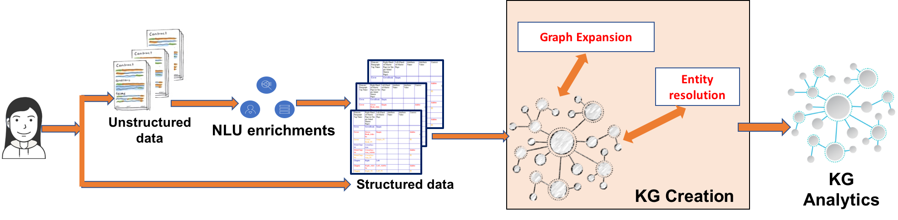

---

copyright:
  years: 2015, 2018
lastupdated: "2018-06-09"

subcollection: discovery

---

{:shortdesc: .shortdesc}
{:new_window: target="_blank"}
{:tip: .tip}
{:note: .note}
{:pre: .pre}
{:important: .important}
{:deprecated: .deprecated}
{:codeblock: .codeblock}
{:screen: .screen}
{:download: .download}
{:hide-dashboard: .hide-dashboard}
{:apikey: data-credential-placeholder='apikey'} 
{:url: data-credential-placeholder='url'}
{:curl: #curl .ph data-hd-programlang='curl'}
{:javascript: .ph data-hd-programlang='javascript'}
{:java: .ph data-hd-programlang='java'}
{:python: .ph data-hd-programlang='python'}
{:ruby: .ph data-hd-programlang='ruby'}
{:swift: .ph data-hd-programlang='swift'}
{:go: .ph data-hd-programlang='go'}

# Watson Discovery Knowledge Graph
{: #kg}

ナレッジ・グラフは、さまざまな文書にあるデータを関連付けて新しいナレッジを生成することにより、単なるデータや情報を上回る価値を生み出します。 IBM は非構造化データからカスタム・ナレッジ・グラフを自動的に作成する AI テクノロジーを提供しています。これは、エンティティーと関係を抽出してあいまいさを除去し、アルゴリズム手法を使用して関係をエンリッチし、さらに関連性アルゴリズムを使用して結果をランク付けすることによって行われます。 Knowledge Graph は企業の「ナレッジ・ハブ」として機能し、エンタープライズに対応した検索、要約、推奨の各エンジンや、その他の意思決定プロセス (例えば、不正、無駄、悪用の検出など) に使用できます。 {{site.data.keyword.knowledgestudioshort}} で作成したカスタム・モデルを Knowledge Graph の作成プロセスで使用すると、金融、テクノロジー、セキュリティー、インテリジェンス、医療などの領域やその他多くの領域に適用可能な、領域固有のナレッジ・グラフの構築に役立ちます。 {{site.data.keyword.discoveryshort}} と {{site.data.keyword.knowledgestudioshort}} の統合方法について詳しくは、『integrating-with-watson-knowledge-studio』を参照してください。


{{site.data.keyword.discoveryfull}} に追加された 2 つの RESTful エンドポイントにより、構造化されていない文書コレクション内の文書すべてを対象にして、あいまいさを除去してエンリッチしたエンティティーおよび関係を検索することができます。 検索結果は、関連性または人気の順番にランク付けできます。 API では、検索トークンを使用できるほか、自動的に作成された大規模なナレッジ・グラフ内で、より関連性の高いエンティティーや関係を検索するオプションのコンテキスト・ワードや文節を使用できます。

 次の図は、Knowledge Graph がどのように現在の {{site.data.keyword.discoveryfull}} パイプラインに適合するのかを示します。 {{site.data.keyword.nlushort}} エンリッチメントは、カスタム {{site.data.keyword.knowledgestudioshort}} モデル (`en-news`) を使用して、個々の文書レベルでエンティティーおよび関係を抽出します。 Knowledge Graph の作成時には、暗黙の (自動的な) エンティティー分解とグラフ拡張の手法を使用して、さまざまな文書にあるエンティティーと関係の接続グラフを自動的に作成します。 作成される Knowledge Graph に加え、Knowledge Graph 分析サービスによって、結果を返すための関連性をランク付ける手法が追加されます。



このナレッジ接続グラフとランク付け手法により、以下のユース・ケースが容易になります。

-  ファジー検索トークン、タイプ情報 (オプション)、およびコンテキスト (オプション) を使用してあいまいさを除去したエンティティー。 例: `Apple` のコンテキストで `Steve` を検索すると `Steve Jobs` がトップで返されるのに対し、`Microsoft` のコンテキストで `Steve` を検索すると `Steve Ballmer` がトップで返されます。
-  ファジー検索トークンとコンテキスト (オプション) の入力によって関連性がランク付けされた関係。 関連性のランク付けはグラフのグローバル・プロパティーを使用して、より具体的な情報を明示します。 例: `health` のコンテキストで `Obama` の関係を検索すると、`Affordable Care Act` (医療保険制度改革法) とその関連エンティティーが返されます。
-  ナレッジの接続グラフでエンティティーと関係を照会することによる、文書間における推論と集約。 このような照会の例として、人物 X はどのように人物 Y と関連付けられているのか、 人物 X の影響が及ぶ範囲はどれぐらいか、などがあります。

## サービス要件
{: #kg_servreq}

ベータ版では、Knowledge Graph 機能およびそれに関連付けられたメソッドは、**拡張**プラン、**プレミアム**・プラン、およびすべての専用環境に登録されたサービス・インスタンスにのみ使用できます。

このベータ版フィーチャーは、現在は英語でのみサポートされています。詳しくは、『[言語サポート](/docs/services/discovery?topic=discovery-language-support#feature-support)』を参照してください。

## コレクションの要件
{: #kg_collreq}

{{site.data.keyword.discoveryshort}} は、取り込んだ文書から抽出したエンティティーと関係を使用して Knowledge Graph を作成した上でエンティティーと関係を照会できるようにします。

**注:** [エンティティー類似性](/docs/services/discovery?topic=discovery-kg#kg_similarity)、[エビデンス](/docs/services/discovery?topic=discovery-kg#kg_evidence)、および[正規化とフィルタリング](/docs/services/discovery?topic=discovery-kg#kg_canonicalization)は、すべてのコレクションで使用できます。 `2018 年 3 月 5 日`より前に作成されたコレクションの場合、これらの機能を使用するには、文書を再取り込みする必要があります。

**注:** Knowledge Graph はプライベート・データ・コレクションにのみ使用できます。{{site.data.keyword.discoverynewsshort}} で使用するようには設計されていません。

Knowledge Graph を使用するには、コレクションが、以下に示す特定の条件を満たすように構成されている必要があります。

-  Knowledge Graph を使用するフィールドで `entities` エンリッチメントと `relations` エンリッチメントの両方を指定する必要があり、各エンリッチメントは同じカスタム・モデルを使用しなければなりません。 パブリック・モデル ({{site.data.keyword.knowledgestudioshort}} を使用せずに使用可能) を使用する場合、カスタム・モデルの形式で指定する必要があります (`model="en-news"`)。

-  `relations` エンリッチメントは、次のように指定してください。
   ```json
   "relations": {
     "model": "en-news"
   }
   ```
   {: codeblock}

-  `entities` エンリッチメントは次のように指定し、さらに `mentions`、`mentions_types`、および `sentence_locations` の各パラメーターを指定してください。
   ```json
   "entities": {
     "mentions": true,
     "mention_types": true,
     "sentence_locations": true,
     "model": "en-news"
    }
   ```
   {: codeblock}

   上記のほか、オプションの `enrichments` オプション (`"sentiment": true` など) は、必要に応じて指定できます。 それらは、エンリッチメントとしてディスカバリー索引に保管されますが、ナレッジ・グラフ自体のノードとしては使用されません。

これらのオプションは {{site.data.keyword.discoveryshort}} ツールを使用して**追加できず**、API を使用してカスタム構成をアップロードしなければなりません。 パブリック・モデルのナレッジ・グラフでコレクションを使用するために `text` フィールドをエンリッチするよう変更したデフォルト構成のコピーは、[こちら](https://raw.githubusercontent.com/watson-developer-cloud/doc-tutorial-downloads/master/discovery/config-default-kg.json)にあります。

{{site.data.keyword.discoveryshort}} サービス・インスタンスを作成したあと、以下のようにカスタム構成を作成します。

1. 次のコマンドを発行して、`my-first-environment` という名前の環境を作成します。 `{apikey_value}` はサービスの API 鍵の値に置き換えてください。

   ```bash
   curl -X POST -u "apikey":"{apikey_value}" -H "Content-Type: application/json" -d '{ "name":"my-first-environment", "description":"exploring environments"}' "api/v1/environments?version=2017-11-07"
   ```
   {: pre}

   API によって、環境 ID、環境状況、環境が使用しているストレージ量などの情報が返されます。

   返された `{environment_id}` が必要になります。後で使用できるようにこの ID を保存してください。

1. 次に、カスタム構成を作成します。 この手順では、[こちら](https://raw.githubusercontent.com/watson-developer-cloud/doc-tutorial-downloads/master/discovery/config-default-kg.json) で見つかった構成をアップロードしていることを前提としています。 独自のカスタム構成を作成する場合は、[構成リファレンス](/docs/services/discovery?topic=discovery-configref#configref) を参照してください。

   ```bash
   curl -X POST -u "apikey":"{apikey_value}" -H "Content-Type: application/json" -d @config-default-kg.json "https://gateway.watsonplatform.net/discovery/api/v1/environments/{environment_id}/configurations?version=2017-11-07"
   ```
   {: pre}

   **既にカスタム構成があり、それを更新してから使用したい場合**、次のコマンドでそのカスタム構成の {configuration ID} を使用してください。

   ```bash
   curl -X PUT -u "apikey":"{apikey_value}" -H "Content-Type: application/json" -d @config-default-kg.json "https://gateway.watsonplatform.net/discovery/api/v1/environments/{environment_id}/configurations/{configuration ID}?version=2017-11-07"
   ```
   {: pre}

1. カスタム構成がアップロードされると、作成する任意のコレクションでそのカスタム構成を使用でき、そのカスタム構成が指定されている限り、文書をアップロードする任意のメソッドが使用できます。 コレクションの作成と文書のアップロードに慣れていない場合は、[ツールの概要](/docs/services/discovery?topic=discovery-getting-started#getting-started) を参照してください。 [ステップ 3](/docs/services/discovery?topic=discovery-getting-started#create-custom-configuration) に進んだら、新規構成を作成せずに、「Knowledge Graph の構成 (Knowledge Graph Configuration)」を選択してください。

## 正規化とフィルタリング
{: #kg_canonicalization}

2018 年 3 月 5 日以降に取り込まれた文書内のすべてのエンティティーは、パブリック辞書から導出された正規名を使用して自動的に正規化されます。 さらに、エンティティーまたは関係に含まれている代名詞 (「he」、「she」、「they」、「it」など) は、Knowledge Graph に取り込まれる前に自動的にフィルタリングによって除外されます。 2018 年 3 月 5 日より前に取り込まれた文書には、このレベルの正規化とフィルタリングは含まれません。この機能を利用するには、新規コレクションを作成し、文書を再取り込みする必要があります。

Knowledge Graph でエンティティー照会または関係照会を作成する場合、エンティティーの正規名または元のテキストのいずれかを、query_entities メソッドまたは query_relations メソッドの text フィールドに入力できます。


## エンティティー照会
{: #kg_entities}

ベータ版の Knowledge Graph エンティティー照会は、コンテキスト・ベースのエンティティーの [あいまいさ除去](/docs/services/discovery?topic=discovery-kg#kg_disambiguation) および [類似性](/docs/services/discovery?topic=discovery-kg#kg_similarity) 照会をサポートしています。 Knowledge Graph のエンティティー照会は、`JSON` オブジェクトを `v1/environments/{environment_id}/collections/{collection_id}/query_entities` エンドポイントに `POST` することで実行されます。

エンティティーの照会は、API を使用するか、{{site.data.keyword.discoveryshort}} ツールによって行うことができます。 ツールの情報については、[Discovery ツールを使用した Knowledge Graph の照会](/docs/services/discovery?topic=discovery-kg#querying-kg) を参照してください。

Knowledge Graph エンティティー照会の JSON オブジェクトは、次のような形式です。

```json
{
  "feature": "disambiguate",
  "entity": {
    "text": "Steve",
    "type": "Person",
    "exact": "false"
  },
  "context": {
    "text": "iphone"
  },
  "count": 10,
  "evidence_count": 0
}
```
{: codeblock}

-  `"feature": string` _required_ - 使用されるエンティティー照会機能。 サポートされる機能は、[disambiguate](/docs/services/discovery?topic=discovery-kg#kg_disambiguation) および [similar_entities](/docs/services/discovery?topic=discovery-kg#kg_similarity) です。
-  `"entity": {}` _required_ - あいまいさを除去するためのエンティティー情報を含むオブジェクト。
   -  `"text": string` _required_ - あいまいさが除去されるエンティティー・テキスト。
   -  `"type": string` _optional_ - あいまいさを除去するオプションのエンティティー・タイプ。指定しない場合は、すべてのタイプが対象となります。
   -  `"exact": boolean` _optional_ - `false` の場合、暗黙のあいまいさ除去が実行されます。 暗黙のあいまいさ除去は、各入力エンティティー・オブジェクトに、あいまいさを除去した最上位のエンティティーを使用します。 `"feature": "disambiguate"` の場合は `false` に設定する必要があります。 デフォルトは `false` です。
-  `"context": {}` _optional_ - あいまいさ除去のためのコンテキスト要件を含むオプションのオブジェクト。
   -  `"text": string` _optional_ - 照会されたエンティティーのコンテキストを提供し、その関連性に基づいてランク付けするためのエンティティー・テキスト。 例えば、England の都市 London を検索する場合、照会は `England` というコンテキストを使用して `London` を検索します。 入力は、名前の一部でも、関連するエンティティー用語を含む大きな文節でもかまいません。 複数の用語を一緒に渡すことができます。
-  `"count": INT` _optional_ - あいまいさを除去したエンティティーの返却数。 デフォルトは `10` です。 最大は `1000` です。
-  `"evidence_count": INT` _optional_ - 識別されたエンティティーごとに返すエビデンス・インスタンスの数。 デフォルトは `0` です。 `evidence_count` フィールドの最大値は、10,000 を `count` フィールドに指定された数で除算した値です。 詳しい説明と例については、このページの [エビデンス](/docs/services/discovery?topic=discovery-kg#kg_evidence) セクションを参照してください。

照会は結果を次の形式で返します。

```json
{
  "entities": [
    {
      "text": "Steve Jobs",
      "type": "PERSON"
    },
    {
      "text": "Steve Wozniak",
      "type": "PERSON"
    }
  ]
}
```
{: codeblock}

一致が見つからなかった場合は、次の JSON オブジェクトが返されます。

```json
{
  "entities": []
}
```
{: codeblock}

### エンティティーのあいまいさ除去
{: #kg_disambiguation}

Knowledge Graph のエンティティー照会は、コンテキスト・ベースでのエンティティーのあいまいさ除去を提供します。 提供されたエンティティー・テキストおよびオプションのコンテキスト・テキストに基づいて、`disambiguation` は、固有のエンティティーを識別し、コンテキスト情報に基づいてランク付けしたエンティティー・リストを返します。

エンティティーのあいまいさ除去照会は、ナレッジ・グラフ照会オブジェクトの `"feature" :` フィールドの値として `"disambiguation"` を指定することによって要求されます。

例えば、「iphone」のコンテキストでエンティティー・テキスト「Steve」のあいまいさが除去された結果、「Steve Jobs」や「Steve Wozniak」が返されることが考えられます。


### エンティティー類似性
{: #kg_similarity}

Knowledge Graph のエンティティー照会は、コンテキスト・ベースでのエンティティー類似性の検出を提供します。 提供されたエンティティー・テキストおよびオプションのコンテキスト・テキストに基づいて、`similar_entities` は、固有のエンティティーを識別し、コンテキスト情報に基づいてランク付けしたエンティティー・リストを返します。

エンティティー類似性照会は、ナレッジ・グラフ照会オブジェクトの `"feature" :` フィールドの値として `"similar_entities"` を指定することによって要求されます。

例えば、コンテキスト「car」で「Ford」に類似したエンティティーを検索した場合、類似エンティティー結果には「GM」、「Toyota」、および「Nissan」が含まれることが考えられます。

## 関係照会
{: #kg_relations}

Knowledge Graph の関係照会は、最も関連性の高い関係の検索をサポートしています。これには、入力エンティティーに基づいて、エンティティーの暗黙のあいまいさ除去、コンテキスト・ベースの関係、関連性スコアと言及カウントによるソート、タイプと文書 id によるフィルタリングが使用されます。

関係の照会は、API を使用するか、{{site.data.keyword.discoveryshort}} ツールによって行うことができます。 ツールの情報については、[Discovery ツールを使用した Knowledge Graph の照会](/docs/services/discovery?topic=discovery-kg#querying-kg) を参照してください。

Knowledge Graph のエンティティー照会は、`JSON` オブジェクトを `v1/environments/{environment_id}/collections/{collection_id}/query_relations` エンドポイントに `POST` することで実行されます。 Knowledge Graph 関係照会の JSON オブジェクトは、次のような形式です。

```json
{
  "entities": [
    {
      "text": "Steve Jobs",
      "type": "PERSON",
      "exact": true
    }
  ],
  "context": {
    "text": "iphone"
  },
  "sort": "score",
  "filter": {
    "relation_types": {
      "exclude": ["colocation"],
      "include": ["locatedAt", "employedBy", "managerOf", "founderOf"]
    },
    "entity_types": {
      "exclude": ["EVENT"],
      "include": ["PERSON", "GPE", "ORGANIZATION"]
    },
    "document_ids": ["b95df4c1-d00f-4771-abb2-a52baea0444a", "ad340635-bf3e-47a5-bea5-5e778f600c32"]
  },
  "count": 10,
  "evidence_count": 0
}
```
{: codeblock}

-  `"entities": []` _required_ - 関係が照会されるエンティティーを含む配列。 エンティティー・オブジェクトが 1 つしか定義されていない場合は、近隣の関係がすべて返されます。 複数のエンティティー・オブジェクトが定義されている場合は、相互にペアワイズの関係が返されます。 相互にペアワイズの関係は、近隣のすべてのエンティティーを含む関係の代わりに、入力エンティティー間の直接の関係を返します。 各エンティティー・オブジェクトには以下が含まれます。
   -  `"text": string` _required_ - エンティティー・テキスト。
   -  `"type": string` _optional_ - オプションのエンティティー・タイプ。 `"exact"` が `true` の場合、このフィールドは必須です。
   -  `"exact": boolean` _optional_ - `false` の場合、暗黙のあいまいさ除去が実行されます。 暗黙のあいまいさ除去は、各入力エンティティー・オブジェクトに、あいまいさを除去した最上位のエンティティーを使用します。 デフォルトは `false` です。
-  `"context": {}` _optional_ - コンテキスト要件を含むオプションのオブジェクト。
   -  `"text": string` _optional_ - 照会されたエンティティーのコンテキストを提供し、その関連性に基づいてランク付けするためのエンティティー・テキスト。 例えば、England の都市 London を検索する場合、照会は `England` というコンテキストを使用して `London` を検索します。 入力は、名前の一部でも、関連するエンティティー用語を含む大きな文節でもかまいません。 複数の用語を一緒に渡すことができます。
-  `"sort": string` _optional_ - 関係のソート方法であり、`score` または `frequency` のいずれかです。 デフォルトは `score` です。 `score` は、入力エンティティーに対する関係と近隣の関連性、およびコンテキストに対する関連性 (コンテキストが提供されている場合) に基づいています。 `frequency` は、各関係が識別された固有の回数です。
-  `"filter": {}` _optional_ - この照会のフィルター処理に使用する関係のタイプ、エンティティー・タイプ、特定の文書を含むオブジェクト。 デフォルトでは、何も除外されません。
   -  `"relation_types": {}` _optional_ フィルター処理する関係タイプのリスト。
      -  `"exclude": []` _optional_ 照会から除外する関係タイプを含むコンマ区切りリスト。
      -  `"include": []` _optional_ 明示的に照会に含める関係タイプを含むコンマ区切りリスト。 指定した場合、他のすべてのタイプは除外とみなされます。
   -  `"entity_types": {}` _optional_ 近隣をフィルター処理するためのエンティティー・タイプのリスト。 新しい近隣は返されないので、複数エンティティー入力には適用されません。
      -  `"exclude": []` _optional_ 照会から除外するエンティティー・タイプを含むコンマ区切りリスト。
      -  `"include": []` _optional_ 明示的に照会に含めるエンティティー・タイプを含むコンマ区切りリスト。 指定した場合、他のすべてのタイプは除外とみなされます。
   -  `"document_ids": []` _optional_ 関係照会を実行する文書を含むコンマ区切りリスト。
-  `"count": INT` _optional_ 返す関係の数。 デフォルトは `10` です。 最大は `1000` です。
-  `"evidence_count": INT` _optional_ 識別された関係ごとに返すエビデンス・インスタンスの数。 デフォルトは `0` です。 `evidence_count` フィールドの最大値は、10,000 を `count` フィールドに指定された数で除算した値です。 詳しい説明と例については、このページの [エビデンス](/docs/services/discovery?topic=discovery-kg#kg_evidence) セクションを参照してください。

照会は結果を次の形式で返します。

```json
{
  "relations": [
    {
      "type": "FOUNDEROF",
      "frequency": 7,
      "arguments": [
        {
          "entities": [
            {
              "type": "PERSON",
              "text": "Steve Jobs"
            }
          ]
        },
        {
          "entities": [
            {
              "type": "ORGANIZATION",
              "text": "Apple"
            }
          ]
        }
      ]
    }
  ]
}
```
{: codeblock}

関係配列内の各オブジェクトに、エンティティー配列のペア (最初がソースまたはサブジェクト、2 番目が関係のターゲットまたはオブジェクト) を含む引数配列が返されます。

一致が見つからない場合は、次の JSON オブジェクトが返されます。

```json
{
  "relations": []
}
```
{: codeblock}

## エビデンス
{: #kg_evidence}

一部のエンティティー照会または関係照会では、どこでその関連性が特定されたのかを理解すると、役立つ場合があります。 関連性のエビデンスによって、元の文書を参照したり、結果を明確にしたり、必要に応じてさらにあいまいさを除去したりすることができます。 2018 年 3 月 5 日以降に作成されたコレクションでは、`query_entities` エンドポイントと `query_relations` エンドポイントの両方に、返された結果にエビデンスを含めるというオプションがあります。 この機能は、2018 年 3 月 5 日より前に作成されたコレクションにも使用できますが、それらの古いコレクションでこの機能を使用するには、文書の再取り込みが必要です。

照会オブジェクトに `"evidence_count": INT` フィールドを追加することによって、エビデンスが返されます。 この数値は、応答項目ごとの、返されるエビデンス項目の数を表します。 例えば、応答項目の `"count":` に `5` を指定し、`"evidence_count": 2` を指定すると、応答には合計 `10` のエビデンス項目 (応答当たり 2 個) が含まれます。  1 回の照会で返されるエビデンス項目の合計の最大数は 10,000 です。

`query_entities` 応答内で、`entities` 配列内の各オブジェクトには、指定された数の `evidence` オブジェクトが含まれます。 これらのオブジェクトには、エビデンスが検出された文書の `document_id`、 エビデンスが見つかった `field`、そのフィールド内でのエビデンスの位置、および識別されたエンティティーの正確な位置が含まれます。

```json
{
      "text": "Steve Jobs",
      "type": "Person",
      "evidence": [
        {
          "document_id": "cb77ce6b-bb93-42a0-8643-dfb523e14da8",
          "field": "description",
          "start_offset": 305,
          "end_offset": 392,
          "entities": [
            {
              "type": "Person",
              "text": "Steve Jobs",
              "start_offset": 311,
              "end_offset": 321
            }
          ]
        }
      ]
    }

```
{: codeblock}

`query_relations` 内で、`relations` 配列内の各オブジェクトには、指定された数の `evidence` オブジェクトが含まれます。 返される `evidence` は、`query_relations` の場合と同じように構造化され、すべての指定された関連エンティティーの位置が示されます。

```json
{
      "type": "founderOf",
      "frequency": 7,
      "arguments": [
        {
          "entities": [
            {
              "type": "Person",
              "text": "Steve Jobs"
            }
          ]
        },
        {
          "entities": [
            {
              "type": "Organization",
              "text": "Apple"
            }
          ]
        }
      ],
      "evidence": [
        {
          "document_id": "b95df4c1-d00f-4771-abb2-a52baea0444a",
          "field": "text",
          "start_offset": 243,
          "end_offset": 303,
          "entities": [
            {
              "type": "Organization",
              "text": "Apple",
              "start_offset": 293,
              "end_offset": 298
            },
            {
              "type": "Person",
              "text": "Steve Jobs",
              "start_offset": 243,
              "end_offset": 253
            }
          ]
        }
      ]
    }
```
{: codeblock}

## Discovery ツールを使用した Knowledge Graph の照会
{: #querying-kg}

[**Advanced**](/docs/services/discovery?topic=discovery-kg#kg_servreq) プランでサブスクライブされたサービス・インスタンスでは、
{{site.data.keyword.discoveryshort}} ツールを使用して Knowledge Graph でプライベート・コレクションを照会できます。  

{{site.data.keyword.discoveryshort}} ツールで Knowledge Graph 照会にアクセスするには、次のようにします。

1.  <!-- {width="20" height="20" style="padding-left:5px;padding-right:5px;"} --> をクリックして、照会ページを開きます。
1.  コレクションを選択して、**「開始 (Get started)」**をクリックします。
1.  **「照会の作成 (Build queries)** 画面で**「ナレッジ・グラフ (Knowledge graph)」**タブを選択し、**「エンティティー」**または**「関係」**を選択します。

**注:** {{site.data.keyword.discoveryshort}} ツールの使用時に、すべての Knowledge Graph 機能を使用できるわけではありません。
