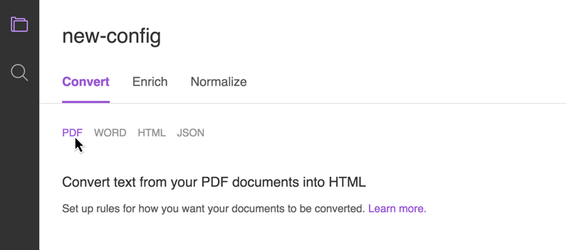

---

copyright:
  years: 2015, 2018
lastupdated: "2018-07-03"

---

{:shortdesc: .shortdesc}
{:new_window: target="_blank"}
{:tip: .tip}
{:pre: .pre}
{:codeblock: .codeblock}
{:screen: .screen}
{:javascript: .ph data-hd-programlang='javascript'}
{:java: .ph data-hd-programlang='java'}
{:python: .ph data-hd-programlang='python'}
{:swift: .ph data-hd-programlang='swift'}

# サービスの構成

{{site.data.keyword.discoveryshort}} サービスを構築すると、独自のデータをエンリッチし、それを照会可能な形式で送信することによって、有用な洞察を得られるようになります。
{: shortdesc}

{{site.data.keyword.discoveryshort}} サービスに独自のコンテンツを追加する前に、希望する方法でコンテンツが処理されるように、このサービスを構成する必要があります。

最初のステップは、サービスの基本パラメーターを構成することです ([文書のためのサービスの準備](/docs/services/discovery/building.html#preparing-the-service-for-your-documents))。これには、環境の作成とその環境内での 1 つ以上のコレクションの作成が含まれます。 コレクションを作成すると、デフォルトのセット ([デフォルト構成](/docs/services/discovery/building.html#the-default-configuration)) が自動的に提供されます。 これらのデフォルトを受け入れる場合は、コンテンツのアップロード ([コンテンツの追加](/docs/services/discovery/adding-content.html)) に進むことができます。

なお、1 つ以上のカスタム構成を指定したい場合もあります (「[カスタム構成が必要な場合](/docs/services/discovery/building.html#when-you-need-a-custom-configuration)」を参照)。 このような場合には、次のことを行う必要があります。

-   いくつかのサンプル・コンテンツ (ファイルの代表的な文書) を識別します
-   コンテンツをアップロードします ([サンプル文書のアップロード](/docs/services/discovery/building.html#uploading-sample-documents))
-   変換プロセスを調整します ([サンプル文書の変換](/docs/services/discovery/building.html#converting-sample-documents))
-   エンリッチメントを定義します ([エンリッチメントの追加](/docs/services/discovery/building.html#adding-enrichments))
-   結果を正規化します ([データの正規化](/docs/services/discovery/building.html#normalizing-data))

    カスタム構成を作成したら、文書をアップロードできます ([コンテンツの追加](/docs/services/discovery/adding-content.html))。

## 文書のためのサービスの準備
{: #preparing-the-service-for-your-documents}

{{site.data.keyword.discoveryshort}} サービスでは、アップロードするコンテンツは、ご使用の環境の一部であるコレクションに保管されます。 コンテンツをアップロードする前に、環境とコレクションを作成する必要があります。

-   **環境** — 環境とは、コンテンツのために {{site.data.keyword.discoveryshort}} サービスで用意するストレージ・スペースの量のことです。 {{site.data.keyword.discoveryshort}} サービスのインスタンスごとに最大 1 つの環境を作成できます。

    「ライト」、「拡張」、「プレミアム」のプランから選択できます。詳しくは、[{{site.data.keyword.discoveryshort}} カタログ ](https://console.ng.bluemix.net/catalog/services/discovery/){: new_window} および『[{{site.data.keyword.discoveryshort}} の料金プラン](/docs/services/discovery/pricing-details.html)』を参照してください。ソース・ファイルはファイル・サイズ制限の対象外であり、索引付けられた変換後の JSON のみがサイズ制限の対象になります。

-   **コレクション** — コレクションは、環境内のコンテンツのグループです。 コンテンツをアップロードするには、少なくとも 1 つのコレクションを作成する必要があります。

    コレクションはプライベート・データで構成されますが、{{site.data.keyword.discoveryshort}} によって、事前にエンリッチされたパブリック・データ・セットの {{site.data.keyword.discoverynewsshort}} も組み込まれます。 これを使用して洞察を照会できます。例えば、ニュース・アラートやイベント検出、ニュースにおけるトピックのトレンド把握などで、これらをアプリケーションに統合できます。

    {{site.data.keyword.discoveryshort}} には、コグニティブな洞察によって事前にエンリッチされた公開データ・セット、{{site.data.keyword.discoverynewsshort}} も含まれています。詳しくは、[Watson Discovery News](/docs/services/discovery/watson-discovery-news.html#watson-discovery-news) を参照してください。{{site.data.keyword.discoverynewsshort}} 構成を調整したり、このコレクションに文書を追加したりすることはできません。 {{site.data.keyword.discoverynewsshort}} を使用して何を作成できるのかを示すデモを[ここ ](https://discovery-news-demo.ng.bluemix.net/){: new_window} で見ることができます。

{{site.data.keyword.discoveryshort}} ツールを使用して環境とプライベート・データ・コレクションを作成するには、以下を実行します。

1.  **「データの管理」**画面で、 アイコンをクリックし、**「環境の作成」**を選択します。 これまでに選択した {{site.data.keyword.Bluemix_notm}} プランに基づいて環境が作成されます。 ご使用の環境の状況は、常にこのドロップダウンから確認できます。

1.  環境の準備ができたら、**「独自のデータをアップロード (Upload your own data)」**ボタンをクリックし、**新しいコレクションに名前を付ける**ことができます。

    デフォルトでは、構成ファイルは **Default Configuration** になります。 使用可能な別の構成ファイルがある場合は、そのファイルを選択できます。あるいは、後で新しい構成ファイルを作成して、そのファイルをこのコレクションに適用することも可能です。 また、このコレクションに追加する文書の言語 (英語、ドイツ語、スペイン語、アラビア語、日本語、フランス語、イタリア語、韓国語、またはブラジル・ポルトガル語) を選択できます。 各コレクションには 1 つの言語しか存在できません。 **「作成」** をクリックすると、データ・コレクションがタイルとして表示されます。

これで、環境とデータ・コレクションが準備できました。 デフォルトの構成ファイルを使用する場合は、[コンテンツの追加](/docs/services/discovery/adding-content.html)をすぐに開始できます。 しかし、追加のエンリッチメントと変換の設定を使用して {{site.data.keyword.discoveryshort}} 構成をカスタマイズする場合は、すぐには文書の追加を開始しないでください。カスタム構成ファイルの作成から始める必要があります。 「[ サービスの構成 ](/docs/services/discovery/building.html#custom-configuration)」を参照してください。

**注:** 文書がデータ・コレクションにアップロードされると、そのコレクション用に選択された構成ファイルを使用して文書が変換およびエンリッチされます。 後でコレクションを別の構成ファイルに切り替えたい場合、切り替えは可能ですが、既にアップロードされている文書は元の構成ファイルによって変換されたままとなります。 構成ファイルの切り替え後にアップロードされたすべての文書は、新しい構成ファイルを使用します。 コレクション**全体**で新しい構成を使用する場合は、新規コレクションを作成し、新しい構成ファイルを選択してから、すべての文書を再度アップロードすることが必要になります。 {{site.data.keyword.discoveryshort}} サービスは、アップロードした文書から変換したテキストを保管します。**PDF** ファイルおよび **Microsoft Word** ファイルに埋め込まれたイメージは、結果として返されません。

{{site.data.keyword.discoveryshort}} ツールまたは API を使用して、Box、Salesforce、および Microsoft SharePoint Online データ・ソースをクロールできます。詳しくは、『[データ・ソースへの接続](/docs/services/discovery/connect.html)』を参照してください。
{: tip}

### デフォルト構成
{: #the-default-configuration}

{{site.data.keyword.discoveryshort}} サービスには、手動によるオプションの構成を必要とせずにデータの変換、エンリッチ、および正規化を行う標準の構成があります。

**Default Configuration** という名前のデフォルト構成には、エンリッチメントに加えて、フォント・スタイルおよびサイズに基づいた標準の文書変換が含まれています。{{site.data.keyword.discoveryshort}} は、{{site.data.keyword.watson}} の 4 つのエンリッチメントであるエンティティーの抽出 (Entity Extraction)、センチメント分析 (Sentiment Analysis)、カテゴリーの分類 (Category Classification)、概念のタグ付け (Concept Tagging) によって収集されたセマンティック情報を使用して文書のテキスト・フィールドをエンリッチ (コグニティブ・メタデータを追加) します (4 つのエンリッチメントの詳細については、[こちら](/docs/services/discovery/building.html#adding-enrichments)を参照してください)。

-   [Microsoft Word 変換](/docs/services/discovery/building.html#microsoft-word-conversion)
-   [PDF 変換](/docs/services/discovery/building.html#pdf-conversion)
-   [HTML 変換](/docs/services/discovery/building.html#html-conversion)
-   [JSON 変換](/docs/services/discovery/building.html#json-conversion)

{{site.data.keyword.discoveryshort}} ツールでは、**Default Contract Configuration** という名前のもう 1 つのデフォルト構成があります。これは、PDF 内の要素からパーティー、性質、およびカテゴリーを抽出するために使用できる要素の分類を使用してエンリッチするように構成されています。詳しくは、『[要素の分類](/docs/services/discovery/element-classification.html#element-collection)』を参照してください。

カスタム構成を作成する場合は、 「[カスタム構成](/docs/services/discovery/building.html#custom-configuration)」を参照してください。

### カスタム構成が必要な場合
{: #when-you-need-a-custom-configuration}

コンテンツから適切な情報を取得してユーザーに返すことが {{site.data.keyword.discoveryshort}} サービスの目的です。 その情報が何であるか、それをどのようにコンテンツに保管するかは、コンテンツの取り込みに使用する構成によって定義されます。 {{site.data.keyword.discoveryshort}} サービスが取り込めるコンテンツ・タイプは柔軟です。つまり、たとえ非構造化コンテンツが特定のフォーマットで保管されていても、そのコンテンツの構造は同じタイプの他のコンテンツの構造と一致する必要はありません。

-   **私の文書は、デフォルト構成に対応する方法で構成されていないかもしれません。 *デフォルト設定が私の文書に適しているかどうか、どのような方法で確認できますか?***
    -   デフォルトが機能するかどうかを確認する最も簡単な方法は、[サンプル文書のアップロード](/docs/services/discovery/building.html#uploading-sample-documents)によってテストすることです。 サンプルの JSON 結果が希望どおりであれば、追加の構成は必要ありません。
-   **デフォルトのエンリッチメントが文書のテキスト・フィールドに追加されることを理解しています。 他のフィールドにエンリッチメントを追加できますか?**
    -   もちろん、必要な任意の数のフィールドにエンリッチメントを追加できます。 詳しくは、「[エンリッチメントの追加](/docs/services/discovery/building.html#adding-enrichments)」を参照してください。

## カスタム構成
{: #custom-configuration}

{{site.data.keyword.discoveryshort}} ツールでカスタム構成を作成するには、プライベート・データ・コレクションを開き、**「データの管理」**画面で、使用する**構成**の名前の横にある**「切り替え (Switch)」**をクリックします。 **「構成の切り替え (Switch configuration)」**ダイアログで、**「新規構成の作成  (Create a new configuration)」**」をクリックします。

新規構成ファイルに名前を付けると、その名前が構成画面の上部に表示されます。 この新規構成ファイルには、[デフォルト構成](/docs/services/discovery/building.html#the-default-configuration)ファイルの設定とエンリッチメントが自動的に組み込まれ、出発地点となります。

構成ファイルをカスタマイズする 3 つのステップは、**変換**、**エンリッチ**、**正規化**です。

1.  [サンプル文書の変換](/docs/services/discovery/building.html#converting-sample-documents)
1.  [エンリッチメントの追加](/docs/services/discovery/building.html#adding-enrichments)
1.  [データの正規化](/docs/services/discovery/building.html#normalizing-data)

構成について詳しくは、『[構成リファレンス](/docs/services/discovery/custom-config.html)』を参照してください。

### サンプル文書のアップロード
{: #uploading-sample-documents}

構成プロセスをより効率的にするために、Microsoft Word、HTML、JSON、PDF の各ファイルを合計 10 個まで文書セットの見本としてアップロードできます。 これらを**サンプル文書**と呼びます。 サンプル文書はコレクションには追加されず、文書に共通するフィールドを特定し、要件に沿ってこれらのフィールドをカスタマイズするためにのみ使用されます。

{{site.data.keyword.discoveryshort}} ツールで新規構成ファイルを作成する場合は、ドラッグ・アンド・ドロップまたはブラウズによってサンプル文書をアップロードできます。 **「サンプル文書のアップロード (Upload Sample Documents)」**ペインのファイル名をクリックして、各ファイルをプレビューします。

#### サンプル文書をアップロードする場合は、以下の点を留意してください。

-   すべての文書は JSON に変換されてから、エンリッチおよび索引付けされます。
-   Microsoft Word 文書と PDF 文書は、最初に HTML に変換されてから JSON に変換されます。
-   HTML 文書は直接 JSON に変換されます。
-   サンプル文書の最大ファイル・サイズは 1 MB です。 サンプル文書は、ブラウザーのローカル・ローミング・データ・フォルダーに保管されます。サンプル文書を削除するには、**削除**アイコンをクリックします。

#### 適切なサンプル文書を選択するためのガイドライン

-   取り込む予定のファイル・タイプ (Microsoft Word、PDF、HTML、JSON) ごとに、少なくとも 1 つのサンプル文書が必要です。 (**要素の分類**エンリッチメントを使用してエンリッチされた PDF 文書をプレビューすることはできません。)
-   固有の文書タイプ (金融レポートやプレス・リリースなど) がある場合は、それぞれ 1 つをサンプル文書のセットに含めます。
-   HTML 文書の場合は、除外する HTML タグと、除外または追加するタグ属性を含む文書を選択する必要があります。
-   JSON 文書には、除去するフィールドとマージするフィールド (例えば、zipCode と postalCode) を含める必要があります。

### サンプル文書の変換
{: #converting-sample-documents}

サンプル文書の変換とは、各入力タイプをどのように処理するのかを定義するプロセスです。 アップロードするコンテンツのファイル・タイプによって、考慮しなければならない変換ステップの数が異なります。

開始する前に、[サンプル文書のアップロード](/docs/services/discovery/building.html#uploading-sample-documents)を行い、構成したいファイル・タイプのサンプル文書を右側のペインで開きます。

変換設定を行うために、ファイル・タイプをクリックします。



-   ** Microsoft Word ファイルを変換する場合は、以下を実行する必要があります。**
    -   Microsoft Word の変換オプションを設定する
    -   HTML の変換オプションを設定する
    -   JSON の変換オプションを設定する
    -   結果をレビューする

-   **PDF ファイルを変換する場合は、以下を実行する必要があります。**
    -   PDF の変換オプションを設定する
    -   HTML の変換オプションを設定する
    -   JSON の変換オプションを設定する
    -   結果をレビューする

-   **HTML ファイルを変換する場合は、以下を実行する必要があります。**
    -   HTML の変換オプションを設定する
    -   JSON の変換オプションを設定する
    -   結果をレビューする

-   **JSON ファイルを変換する場合は**、JSON 変換オプションを設定し、結果をレビューする必要があります。

作成する構成ファイルごとに、プロセスの各ステップ用の変換オプションのセットが 1 つだけあります。 つまり、HTML 変換オプションは、PDF ファイル、Word ファイル、HTML のものと同じになることを意味します。 取り込んでいるコンテンツのタイプごとに異なる変換オプションが必要な場合 (または、同じタイプのファイルだが異なるタイプの変換が必要な場合) は、ファイルを別のコレクションに保管し、変換設定セットごとに個別の構成ファイルを作成する必要があります。

#### Microsoft Word 変換
{: #microsoft-word-conversion}

Microsoft Word のフォント・サイズとフォント・スタイルは、文書内の見出しを H1、H2 などに正しく変換するために使用されます。 H1 は文書のタイトルで、H2 以下は副見出しです。 必要であれば、テキスト・ボックスとラジオ・ボタンを使用して、デフォルト設定を変更します。 また、見出しレベルと Word スタイルを追加することもできます。 Word 文書の見出しに特定のフォントとスタイル名が使われる傾向がある場合は、必ずその情報を追加します。 この情報は変換の向上に役立ち、より良い照会結果を得られるようになります。

**例:** Word 文書の見出し 2 に　20 ポイントのフォントとイタリックがよく使われる場合は、**フォント・サイズの範囲**を **20** から **23** に変更し、**フォント・スタイル**を**イタリック**に変更します。

変更を行った後、**「適用して保存」**をクリックします。

#### PDF 変換
{: #pdf-conversion}

PDF のフォント・サイズとフォント名は、文書内の見出しを H1、H2 などに正しく変換するために使用されます。 H1 は文書のタイトルで、H2 以下は副見出しです。 必要であれば、テキスト・ボックスとラジオ・ボタンを使用して、デフォルト設定を変更します。 また、見出しレベルを追加することもできます。 PDF 文書の見出しに特定のフォントが使われる傾向がある場合は、必ずその情報を追加します。 この情報は変換の向上に役立ち、より良い照会結果を得られるようになります。

**例:** PDF 文書の見出し 1 に　20 ポイントのフォントと太字がよく使われる場合は、**フォント・サイズの範囲**を **20** から **80** に変更し、**フォント・スタイル**を**太字**に変更します。 それに応じて他のレベルを調整します。

変更を行った後、**「適用して保存」**をクリックします。

#### HTML 変換
{: #html-conversion}

このステップを使用して不要なタグと他の文書情報を削除し、照会に必要な情報だけを保持することができます。

デフォルトの HTML 設定

- 次のタグとその内容を除外します: **`script`**、**`sup`**
- 次のタグは除外しますが、その内容は維持します: **`font`**、**`em`**、**`span`**
- 次のタグ属性を維持します: デフォルトなし
- 次のタグ属性を除外します: **`EVENT_ACTIONS`**
- 次の XPath に一致する内容を維持します: デフォルトなし
- 次の XPath に一致する内容を除外します: デフォルトなし

変更を行った後、**「適用して保存」**をクリックします。

#### JSON 変換
{: #json-conversion}

変換の最後のステップは、コンテンツにエンリッチメントを適用する前に、変換された (またはアップロードされた) JSON が、期待どおりの方法で形成されているかを確認することです。 {{site.data.keyword.watson}} が HTML を JSON に変換するために使用するルールを作成できます。

-   フィールドの移動、マージ、コピー、削除が可能です。 例: **`zipCode`** と **`postalCode`** は同じフィールドの類似用語なので、マージできます。
-   空のフィールド (情報を含んでいないフィールド) は、デフォルトで削除されます。 **「空のフィールドを除去 (Remove empty fields)」**トグルを使用して、この設定を変更できます。

変更を行った後、**「適用して保存」**をクリックします。

## エンリッチメントの追加
{: #adding-enrichments}

{{site.data.keyword.discoveryshort}} の[デフォルト構成](/docs/services/discovery/building.html#the-default-configuration)は、{{site.data.keyword.watson}} の 4 つの機能であるエンティティーの抽出 (Entity Extraction)、センチメント分析 (Sentiment Analysis)、カテゴリーの分類 (Category Classification)、概念のタグ付け (Concept Tagging) によって収集されたセマンティック情報を使用して、取り込まれた文書の`テキスト`・フィールドをエンリッチ (コグニティブ・メタデータを追加) します。 ({{site.data.keyword.watson}} エンリッチメントは全部で 9 個あります。残りは、キーワードの抽出 (Keyword Extraction)、関係の抽出 (Relation Extraction)、感情分析 (Emotion Analysis)、要素の分類 (Element Classification)、意味役割抽出 (Semantic Role Extraction) です。)

一部の {{site.data.keyword.watson}} エンリッチメントは、特定のプランまたは環境では使用できない場合があります。

**重要:** エンリッチメントのために選択された各 JSON フィールドの最初の 50,000 文字のみがエンリッチされます。

**注:** {{site.data.keyword.alchemylanguageshort}} エンリッチメントは 2018 年 3 月 1 日に非推奨になりました。{{site.data.keyword.alchemylanguageshort}} エンリッチメントを使用している既存のコレクションがある場合は、{{site.data.keyword.nlushort}} エンリッチメントにマイグレーションする必要があります。{{site.data.keyword.alchemylanguageshort}} エンリッチメントを利用する既存のコレクションおよび構成ファイルのマイグレーションについて詳しくは、『[{{site.data.keyword.nlushort}}](/docs/services/discovery/migrate-nlu.html)へのエンリッチメントのマイグレーション』を参照してください。

別のエンリッチメントを`テキスト`・フィールドに追加したり、別のフィールドをエンリッチしたりすることで、文書をさらに増強することができます。 これを行うには、{{site.data.keyword.discoveryshort}} ツールを使用して、[カスタム構成を作成](/docs/services/discovery/building.html#custom-configuration)し、エンリッチするフィールドを選択して、使用可能な {{site.data.keyword.nlushort}} エンリッチメントのリストからいずれかを選択します。

### エンティティーの抽出
{: #entity-extraction}

入力テキスト内に存在する人、場所、組織などの項目を返します。 エンティティーの抽出により、分析されるテキストの主題やコンテキストを理解するのに役立つセマンティック・ナレッジがコンテンツに追加されます。エンティティー抽出技法は、高度な統計アルゴリズムと自然言語処理テクノロジーに基づき、複数言語分析や、コンテキストに依存するあいまいさ除去をサポートする、業界でユニークなものです。エンティティーのタイプとサブタイプの完全なリストについては、[こちら](/docs/services/discovery/entity-types.html)を参照してください。 また、{{site.data.keyword.knowledgestudiofull}} を使用して [カスタム・エンティティー・モデル](/docs/services/discovery/building.html#custom-entity-model)を作成して追加することもできます。

例として、エンティティーの抽出でエンリッチされた文書の一部を以下に示します。

```json
{
  "text": "The stockholders were pleased that Acme Corporation plans to build a new factory in Atlanta, Georgia.",
      "enriched_text": {
    "entities": [
         {
        "count": 1,
           "sentiment": {
          "score": 0
        },
           "text": "Acme Corporation",
           "relevance": 0.98389,
           "type": "Company"
      },
      {
        "count": 1,
           "sentiment": {
          "score": 0
        },
           "text": "Atlanta",
           "relevance": 0.532754,
           "type": "Location",
           "disambiguation": {
          "subtype": [
            "AdministrativeDivision",
               "GovernmentalJurisdiction",
               "OlympicHostCity",
               "PlaceWithNeighborhoods",
               "City"
          ],
               "name": "Atlanta",
               "dbpedia_resource": "http://dbpedia.org/resource/Atlanta"
           }
      },
      {
        "count": 1,
           "sentiment": {
          "score": 0
        },
           "text": "Georgia",
           "relevance": 0.469643,
           "type": "Location",
           "disambiguation": {
          "subtype": [
            "StateOrCounty"
                  ]
        }
      }
    ]
  }
}
```
{: codeblock}

上の例では、`enriched_text.entities.type` にアクセスすることにより、エンティティー・タイプを照会できます。

**センチメント**のエンリッチメントが選択されていなくても、エンティティー・タイプの `sentiment` が算出されます。 センチメントのスコアについて詳しくは、「[センチメント分析](/docs/services/discovery/building.html#sentiment-analysis)」を参照してください。

`relevance` スコアの範囲は `0.0` から `1.0` までです。 スコアが高いほど、エンティティーの関連性が高くなります。 `disambiguation` フィールドにはエンティティーに関するあいまいさ除去の情報があり、エンティティーの `subtype` 情報やリソースのリンク先 (存在する場合) が含まれています。 `count` は、文書内でエンティティーが言及された回数です。

#### カスタム・エンティティー・モデルの使用
{: #custom-entity-model}

カスタム・エンリッチ・モデルを作成する場合は、{{site.data.keyword.knowledgestudiofull}} で作成することができ、{{site.data.keyword.discoveryshort}} ツールの `カスタム・モデル ID (Custom Model ID)` ボックスに ID を追加することで、モデルを {{site.data.keyword.discoveryshort}} にインポートします。 {{site.data.keyword.knowledgestudiofull}} との統合について詳しくは、「[{{site.data.keyword.knowledgestudiofull}} との統合](/docs/services/discovery/integrate-wks.html#integrating-with-watson-knowledge-studio)」を参照してください。 カスタムの {{site.data.keyword.knowledgestudiofull}} モデルによって、デフォルトの「エンティティーの抽出」エンリッチメントがオーバーライドされます。

**注:** 1 つのエンリッチメントには、1 つの {{site.data.keyword.knowledgestudiofull}} モデルのみ割り当てることができます。

### 関係の抽出
{: #relation-extraction}

2 つのエンティティーが関連付けられている場合に認識し、関係のタイプを識別します。 また、{{site.data.keyword.knowledgestudiofull}} を使用して[カスタム関係モデル](/docs/services/discovery/building.html#custom-relation-model)を作成して追加することもできます。

関係タイプの完全なリストについては、[こちら](/docs/services/discovery/relation-types.html)を参照してください。

例として、関係抽出でエンリッチされた文書の一部を以下に示します。

```json
{
  "text": "The stockholders were pleased that Acme Corporation plans to build a new factory in Atlanta, Georgia.",
      "enriched_text": {
    "relations": [
      {
        "type": "locatedAt",
        "sentence": "The stockholders were pleased that Acme Corporation plans to build a new factory in Atlanta, Georgia.",
        "score": 0.989245,
        "arguments": [
         {
            "text": "Atlanta",
            "location": [
             94,
             101
            ],
            "entities": [
              {
                "type": "GeopoliticalEntity",
                "text": "Atlanta"
              }
            ]
         },
          {
            "text": "Georgia",
            "location": [
             103,
             110
            ],
            "entities": [
              {
                "type": "GeopoliticalEntity",
                "text": "Georgia"
              }
            ]
          }
        ]
      }
    ]
  }
}
```
{: codeblock}

上の例では、`enriched_text.relations.type` にアクセスすることにより、関係タイプを照会できます。

関係のあるエンティティーが `arguments` にリストされます。 関係の抽出エンリッチメントによって識別できるエンティティー・タイプについては、[こちら](/docs/services/discovery/relation-types.html#specific-entity-types)を参照してください。

`score` の範囲は `0.0` から `1.0` までです。 スコアが高いほど、関係の関連性が高くなります。

#### カスタム関係モデルの使用
{: #custom-relation-model}

カスタム・エンリッチ・モデルを作成する場合は、{{site.data.keyword.knowledgestudiofull}} で作成することができ、{{site.data.keyword.discoveryshort}} ツールの `カスタム・モデル ID (Custom Model ID)` ボックスに ID を追加することで、モデルを {{site.data.keyword.discoveryshort}} にインポートします。 {{site.data.keyword.knowledgestudiofull}} との統合について詳しくは、「[{{site.data.keyword.knowledgestudiofull}} との統合](/docs/services/discovery/integrate-wks.html#integrating-with-watson-knowledge-studio)」を参照してください。 カスタムの {{site.data.keyword.knowledgestudiofull}} モデルによって、デフォルトの「関係の抽出」エンリッチメントがオーバーライドされます。

**注:** 1 つのエンリッチメントには、1 つの {{site.data.keyword.knowledgestudiofull}} モデルのみ割り当てることができます。

### キーワードの抽出
{: #keyword-extraction}

キーワードはコンテンツの重要なトピックであり、データの索引付け、タグ・クラウドの生成、および検索のときに一般的に使用されます。 {{site.data.keyword.discoveryshort}} サービスは、入力コンテンツでサポート言語を自動的に識別し、そのコンテンツ内のキーワードを識別し、ランク付けします。

例として、キーワード抽出でエンリッチされた文書の一部を以下に示します。

```json
  {
  "text": "The stockholders were pleased that Acme Corporation plans to build a new factory in Atlanta, Georgia.",
    "enriched_text": {
      "keywords": [
        {
          "text": "Acme Corporation",
          "sentiment": {
            "score": 0
          },
          "relevance": 0.985203
        },
        {
          "text": "new factory",
          "sentiment": {
            "score": 0
          },
          "relevance": 0.821033
        },
        {
          "text": "stockholders",
          "sentiment": {
            "score": 0
          },
          "relevance": 0.66497
        },
        {
          "text": "title",
          "sentiment": {
            "score": 0
          },
          "relevance": 0.332438
        },
        {
          "text": "Atlanta",
          "sentiment": {
            "score": 0
          },
          "relevance": 0.307723
        },
        {
          "text": "Georgia",
          "sentiment": {
            "score": 0
          },
          "relevance": 0.306485
        }
      ]
    }
  }
```
{: codeblock}

上の例では、`enriched_text.keywords.text` にアクセスすることにより、キーワード・テキストを照会できます。

**センチメント**のエンリッチメントが選択されていなくても、キーワードの `sentiment` が算出されます。 センチメントのスコアについて詳しくは、「[センチメント分析](/docs/services/discovery/building.html#sentiment-analysis)」を参照してください。

`relevance` スコアの範囲は `0.0` から `1.0` までです。 スコアが高いほど、キーワードの関連性が高くなります。

### カテゴリーの分類

入力テキスト、HTML、または Web ベースのコンテンツを最大 5 階層の深さのタクソノミーに分類します。 階層を深めるほど、より正確で役に立つサブセグメントにまでコンテンツを分類できます カテゴリーの完全なリストについては、[こちら](/docs/services/discovery/categories.html)を参照してください。

例として、カテゴリーの分類でエンリッチされた文書の一部を以下に示します。

```json
{
  "text": "The stockholders were pleased that Acme Corporation plans to build a new factory in Atlanta, Georgia.",
    "enriched_text": {
      "categories": [
        {
          "score": 0.361614,
          "label": "/business and industrial"
        },
        {
          "score": 0.329377,
          "label": "/business and industrial/company/merger and acquisition"
        },
        {
          "score": 0.154254,
          "label": "/business and industrial/business operations/business plans"
        }
      ]
```
{: codeblock}

上の例では、`enriched_text.categories.label` にアクセスすることにより、カテゴリー・ラベルを照会できます。

`label` は検出されたカテゴリーです。 階層レベルはスラッシュで区切ります。 そのカテゴリーの `score` は、`0.0` から `1.0` の範囲です。スコアが高いほど、当該カテゴリーの信頼度が高くなります。

### 概念のタグ付け
{: #concept-tagging}

入力テキストと関連付けられた概念を、そのテキスト内に存在する他の概念およびエンティティーに基づいて識別します。概念のタグ付けは、概念の関連性を理解し、テキスト内で直接参照されない概念を識別することができます。例えば、記事で CERN とヒッグス粒子が取り上げられている場合、概念 API 関数は、「大型ハドロン衝突型加速器」という用語がページ内で明示的に言及されていなくても、その用語を概念として識別します。概念のタグ付けにより、単なる基本的なキーワード識別よりも、入力コンテンツの高レベルの分析が可能になります。

例として、概念のタグ付けでエンリッチされた文書の一部を以下に示します。

```json
{
  "text": "The stockholders were pleased that Acme Corporation plans to build a new factory in Atlanta, Georgia.",
    "enriched_text": {
      "concepts": [
        {
          "text": "Acme Corporation",
          "relevance": 0.91136,
          "dbpedia_resource": "http://dbpedia.org/resource/Acme_Corporation"
        },
        {
          "text": "Factory",
          "relevance": 0.886784,
          "dbpedia_resource": "http://dbpedia.org/resource/Factory"
        }
      ]
```
{: codeblock}

上の例では、`enriched_text.concepts.text` にアクセスすることにより、概念テキスト・タイプを照会できます。

`relevance` スコアの範囲は `0.0` から `1.0` までです。 スコアが高いほど、概念の関連性が高くなります。 該当がある場合は、リソースへのリンクも提供されます。

### 意味役割抽出

入力コンテンツの文内の主語、動作、目的語の関係を識別します。関係情報は、購買シグナル、キー・イベント、およびその他の重要なアクションを自動的に識別するために使用できます。

例として、意味役割抽出でエンリッチされた文書の一部を以下に示します。

```json
{
  "text": "The stockholders were pleased that Acme Corporation plans to build a new factory in Atlanta, Georgia.",
      "enriched_text": {
      "semantic_roles": [
        {
          "subject": {
            "text": "The stockholders",
            "keywords": [
              {
                "text": "stockholders"
              }
            ]
          },
          "sentence": " The stockholders were pleased that Acme Corporation plans to build a new factory in Atlanta, Georgia.",
          "object": {
            "text": "pleased that Acme Corporation plans to build a new factory in Atlanta, Georgia",
            "keywords": [
              {
                "text": "Acme Corporation"
              },
              {
                "text": "new factory"
              },
              {
                "text": "Atlanta"
              },
              {
                "text": "Georgia"
              }
            ],
            "entities": [
              {
                "type": "Company",
                "text": "Acme Corporation"
              },
              {
                "type": "Location",
                "text": "Atlanta",
                "disambiguation": {
                  "subtype": [
                    "AdministrativeDivision",
                    "GovernmentalJurisdiction",
                    "OlympicHostCity",
                    "PlaceWithNeighborhoods",
                    "CityTown",
                    "City"
                  ],
                  "name": "Atlanta",
                  "dbpedia_resource": "http://dbpedia.org/resource/Atlanta"
                }
              },
              {
                "type": "Location",
                "text": "Georgia",
                "disambiguation": {
                  "subtype": [
                    "StateOrCounty"
                  ]
                }
              }
            ]
          },
          "action": {
            "verb": {
              "text": "be",
              "tense": "past"
            },
            "text": "were",
            "normalized": "be"
          }
        }
      ]
```
{: codeblock}

上記の例では、`enriched_text.relations.subject.text` にアクセスすることで、関係の主語のテキストを照会できます。

**センチメント**のエンリッチメントが選択されていなくても、関係の `sentiment` が算出されます。 センチメントのスコアについて詳しくは、「[センチメント分析](/docs/services/discovery/building.html#sentiment-analysis)」を参照してください。 **エンティティー**と**キーワード**のエンリッチメントも選択していなければ、(例に示したような) `entities` および `keywords` は抽出されません。これらのエンリッチメントについて詳しくは、「[ エンティティーの抽出 ](/docs/services/discovery/building.html#entity-extraction)」と「[ キーワードの抽出 ](/docs/services/discovery/building.html#keyword-extraction)」を参照してください。

関係を含むすべての文について、`subject`、`action`、および `object` が抽出されます。

### センチメント分析
{: #sentiment-analysis}

分析中のコンテンツ内の姿勢、意見、または感情を識別します。{{site.data.keyword.discoveryshort}} サービスは、文書内の全体的なセンチメント、ユーザーが指定したターゲットのセンチメント、エンティティー・レベルのセンチメント、引用レベルのセンチメント、方向性のセンチメント、キーワード・レベルのセンチメントを計算できます。これらの機能を組み合わせて、ソーシャル・メディアのモニターからトレンド分析まで、さまざまなユース・ケースをサポートします。

例として、センチメント分析でエンリッチされた文書の一部を以下に示します。

```json
{
  "text": "The stockholders were pleased that Acme Corporation plans to build a new factory in Atlanta, Georgia.",
    "enriched_text": {
      "sentiment": {
        "document": {
        "score": 0.459813,
        "label": "positive"
  }
}
```
{: codeblock}

上の例では、`enriched_text.sentiment.document.label` にアクセスすることにより、センチメント・ラベルを照会できます。

`label` は文書の全体的なセンチメントです (`positive`、`negative`、または `neutral`)。 センチメント `label` は `score` に基づいています。スコア `0.0` は文書が `neutral` であることを示し、正の数値は文書が `positive` であることを示し、負の数値は文書が `negative` であることを示します。

### 感情分析
{: #emotion-analysis}

英語のテキスト内に暗示された怒り、嫌悪、不安、喜び、悲しみを検出します。感情分析では、対象の句、エンティティー、またはキーワードに関連する感情を検出することや、コンテンツの全体的な感情のトーンを分析することができます。

例として、感情分析でエンリッチされた文書の一部を以下に示します。

```json
{
  "text": "The stockholders were pleased that Acme Corporation plans to build a new factory in Atlanta, Georgia.",
    "enriched_text": {
      "emotion": {
        "document": {
          "emotion": {
          "disgust": 0.102578,
          "joy": 0.626655,
          "anger": 0.02303,
          "fear": 0.018884,
          "sadness": 0.096802
    }
  }
}
```
{: codeblock}

上の例では、`enriched_text.emotion.document.emotion.joy` にアクセスすることにより、感情の `joy` を照会できます。

感情分析ではテキストを分析し、`0.0` から `1.0` までの尺度で各感情 (怒り、嫌悪、不安、喜び、悲しみ) のスコアを計算します。感情のスコアが `0.5` 以上であると、その感情が検出されます (スコアが `0.5` を超えて高いほど、関連性が高くなります)。示されているスニペットでは、`joy` のスコアが 0.5 を超えるため、{{site.data.keyword.watson}} は喜びを検出しました。

**注:** 感情分析は英語でのみサポートされます。

### 要素の分類
{: #elements}

管理文書内の要素 (センテンス、リスト、表) を解析して、重要なタイプとカテゴリーを分類します。詳細については、「[要素の分類](/docs/services/discovery/element-classification.html)」を参照してください。

#### エンリッチメントの価格
{: #enrichment-pricing}

エンリッチメントの価格情報については、[{{site.data.keyword.Bluemix_notm}} ](https://console.ng.bluemix.net/catalog/services/discovery/){: new_window} を参照してください。

#### エンリッチメントの言語サポート
{: #enrichment-language-support}

エンリッチメントの言語サポートについては、「[{{site.data.keyword.discoveryshort}} の言語サポート](/docs/services/discovery/language-support.html)」を参照してください。

### エンティティー、概念、およびキーワードの違いについて
{: #udbeck}

一見すると、**エンティティーの抽出**、**概念のタグ付け**、**キーワードの抽出**は、似たようなエンリッチメントに見えます。 エンリッチメントのサンプルからのテキストを使用して、それらの相違を示します。

```json
"text": "The stockholders were pleased that Acme Corporation plans to build a new factory in Atlanta, Georgia."
```
{: codeblock}

**エンティティーの抽出**エンリッチメントは、入力テキスト内の人、場所、および組織を抽出するので、**エンティティーの抽出**によって以下のエンティティー・タイプが返されます。

```json
"type": "City"
"text": "Atlanta"

"type": "Company"
"text": "Acme"

"type": "StateOrCounty"
"text": "Georgia"
```
{: codeblock}

**コンセプトのタグ付け**エンリッチメントは、概念がどのように関係するのかを把握し、テキスト内で直接参照されていない概念を識別できます。 例えば、記事で CERN とヒッグス粒子が取り上げられている場合、大型ハドロン衝突型加速器という用語が明示的に言及されていなくても、その用語を概念として識別します。 このサンプル文書テキストには 1 つのセンテンスのだけが含まれるため関係する概念は存在せず、**概念のタグ付け**によって以下の概念が返されます。

```json
"text": "Acme Corporation"
"text": "factory"
```
{: codeblock}

**キーワードの抽出**エンリッチメントは、データの索引付け、タグ・クラウドの生成、または検索のときに一般的に使用されるコンテンツを識別するので、** キーワードの抽出**によって以下のキーワードが返されます。

```json
"text": "Acme Corporation"
"text": "new factory"
"text": "stockholders"
"text": "Atlanta"
"text": "Georgia"
```
{: codeblock}

これらのエンリッチメントは連携して機能し、より優れた照会を作成するのに役立ちます。

## データの正規化
{: #normalizing-data}

構成ファイルをカスタマイズする最後のステップは、正規化と呼ばれる最終的なクリーンアップを行うことです。

{{site.data.keyword.discoveryshort}} ツールの**「正規化」**セクションでは、以下のことを行います。

-   フィールドの移動、マージ、コピー、削除が可能です。
-   空のフィールド (情報を含んでいないフィールド) は、デフォルトで削除されます。 **「空のフィールドを除去 (Remove empty fields)」**トグルを使用して、この設定を変更できます。

変更を行った後、**「適用して保存」**をクリックし、**「完了」**をクリックします。 **「データの管理」**画面に戻され、選択したコレクションにこの構成を提供できます。

**注:** フィールドの`データ・タイプ` (例: `text` や `date`) を指定することはできません。文書の取り込み中に、索引にまだ存在しないフィールドが検出されると、{{site.data.keyword.discoveryshort}} は、索引付けられた最初の文書のそのフィールドの値に基づいて、そのフィールドの`データ・タイプ`を自動的に検出します。

**要素の分類**エンリッチメントを使用している場合、エンリッチメント後の正規化を実行することはできません。

## エンティティーの正規化
{: #normalizing-entities}

### CSS セレクターを使用したフィールドの抽出
{: #using-css}

Discovery API を介して CSS セレクターを使用することにより、追加の正規化を実行できます。

整形式の HTML を取り込んでいる場合は、それを正規化し、CSS セレクターを使用して JSON フィールドを抽出できます。その後、抽出したフィールドに、エンリッチメントを適用できます。 構成ファイルを編集して、この機能を有効にします。 具体的には、`extracted_fields` 要素を `conversions/html` 階層に追加し、次にフィールド名、CSS セレクター、フィールド・タイプを次のように指定します。

```json
{
  "name": "Extract JSON config",
  "description": "New configuration enabling extraction of JSON fields from HTML",
  "conversions": {
    ...
    "html": {
      ...
      "extracted_fields": {
        "{field_name_1}": {
          "css_selector": "{CSS_selector_expression_1}",
          "type": "{field_type}"
        },
        ...
        "{field_name_N}": {
          "css_selector": "{CSS_selector_expression_N}",
          "type": "{field_type}"
        }
      }
    ...
    }
  }
}
```
{: codeblock}

新規フィールドの値を以下のように指定します。

-   `field_name` — JSON 出力に追加されるフィールドの名前。
-   `CSS_selector_expression` — フィールドを抽出するために、入力 HTML に対して実行される CSS セレクター。 式による一致が 1 つ以上になることがあります。

    有効な CSS セレクターは、[JSoup パーサー ](https://jsoup.org/apidocs/org/jsoup/select/Selector.html){: new_window} とその[セレクター構文](https://jsoup.org/cookbook/extracting-data/selector-syntax){: new_window}によって指定されたものです。 簡略なリストが「[一般的なセレクター](/docs/services/discovery/building.html#common-selectors)」にあります。
-   `field_type` — `array` または `string` です。 フィールド・タイプが指定されないと、デフォルトの `array` になります。 `string` タイプはエンリッチできますが、配列の項目を最初にテキスト・フィールドに抽出しておかない限り、`array` に保管された情報をエンリッチすることはできません。

**警告:** CSS セレクターが、親ノードとその子 (1 つまたは複数) の両方に一致する場合、ノードのテキスト・コンテンツは JSON 出力で重複します。

**注:** フィールド名は、「[フィールド名の要件](/docs/services/discovery/custom-config.html#field_reqs)」に定義された制限事項を満たしている必要があります。

次に示す JSON の文節は、Default Configuration の関連セクションです。このセクションに、CSS セレクター情報を追加します。

```json
{
  "name": "Default Configuration",
  "description": "The configuration used by default when creating a new collection without specifying a configuration_id.",
  "conversions": {
    ...
    "html": {
      "exclude_tags_completely": [
        "script",
        "sup"
      ],
      "exclude_tags_keep_content": [
        "font",
        "em",
        "span"
      ],
      "exclude_content": {
        "xpaths": []
      },
      "keep_content": {
        "xpaths": []
      },
      "exclude_tag_attributes": [
        "EVENT_ACTIONS"
      ]
    }
    ...
  }
}
```
{: codeblock}

次の文節は、新しい名前と説明、および CSS セレクターを指定できる場所が含まれる構成を示します。

```json
{
  "name": "Extract JSON config",
  "description": "New configuration enabling extraction of JSON fields from HTML",
  "conversions": {
    ...
    "html": {
      "exclude_tags_completely": [
        "script",
        "sup"
      ],
      "exclude_tags_keep_content": [
        "font",
        "em",
        "span"
      ],
      "exclude_content": {
        "xpaths": []
      },
      "keep_content": {
        "xpaths": []
      },
      "exclude_tag_attributes": [
        "EVENT_ACTIONS"
      ],
      "extracted_fields": {
        "{field_name_1}": {
          "css_selector": "{CSS_selector_expression_1}",
          "type": "{field_type}"
        },
        ...
        "{field_name_N}": {
          "css_selector": "{CSS_selector_expression_N}",
          "type": "{field_type}"
        }
      }
    }
  }
  ...
}
```
{: codeblock}

最後に、次の文節は、新しい名前と記述、および一部の CSS セレクターが含まれる構成を示しています。 このセレクターは、本ページで後述する HTML サンプル内の項目に一致します。

```json
{
  "name": "Extract JSON config",
  "description": "New configuration enabling extraction of JSON fields from HTML",
  "conversions": {
    ...
    "html": {
      "exclude_tags_completely": [
        "script",
        "sup"
      ],
      "exclude_tags_keep_content": [
        "font",
        "em",
        "span"
      ],
      "exclude_content": {
        "xpaths": []
      },
      "keep_content": {
        "xpaths": []
      },
      "exclude_tag_attributes": [
        "EVENT_ACTIONS"
      ],
      "extracted_fields": {
        "chapters": {
          "css_selector": ".chapter",
          "type": "array"
        },
        "authors": {
          "css_selector": ".author"
        },
        "authors_str": {
          "css_selector": ".author",
          "type": "string"
        },
        "comments": {
          "css_selector": "[^comments-content]"
        }
      }
    }
  }
  ...
}
```
{: codeblock}

更新された構成を使用するコレクションに以下の HTML 文書をロードする場合、CSS セレクターは HTML 内の適切な属性と値に一致します。

```html
<html>
  <body>
    <div id="authors">
      <div class="author"><span class="first_name">Jane</span> <span class="last_name">Rain</span></div>
      <div class="author">Joe Snow</div>
  </div>
  <div class="chapter"><h1>The Rain in Spain</h1><p>falls mainly on the plain.</p></div>
  <div class="chapter"><h1>How I Learned to Stop Worrying</h1><p>and love my snowblower.</p></div>
  <span id="comments-section">
    <h4>Comments:</h4>
    <span id="comments-content-1">Rain gives me pain.</span>
    <span id="comments-content-2">All snow must go!</span>
  </span>
</body></html>
```
{: codeblock}

前の HTML が取り込まれて拡張されると、{{site.data.keyword.discoveryshort}} サービスは次の JSON を返します。

```json
{
  "extracted_metadata": { ... },
  "html": "...",
  "text": "...",
  "extracted_fields": {
    "authors": [ "Jane Rain", "Joe Snow" ],
    "authors_str": "Jane Rain\n\nJoe Snow",
    "chapters": [ "The Rain in Spain\n\nfalls mainly on the plain.", "How I Learned to Stop Worrying\n\nand love my snowblower." ],
    "comments": [ "Rain gives me pain.", "All snow must go!" ]
  }
}
```
{: codeblock}

抽出する HTML 要素を決定した後、その構成ファイルをさらに変更して、それらに適用するエンリッチメントを指定することができます。

#### 一般的なセレクター

一般的な CSS セレクターを以下に示します。

  - `tag` — `tag` 名に一致します
  - `.class` — `class` の値に一致します
  - `#id` — `id` の値に一致します
  - `[attribute]` — 値に関係なく、指定された `attribute` を持つ任意のタグに一致します
  - `[attribute=value]` または `[attribute="value"]` — 指定された `attribute` と `value` に一致します

## 文書セグメンテーションによる文書の分割
{: #doc-segmentation}

Word、PDF、および HTML の各文書を HTML の見出しタグに基づいてセグメントに分割できます。 一度分割されると、各セグメントは個別の文書となり、エンリッチおよび索引付けが個別に行われるようになります。照会によってこれらのセグメントが個別の文書として返されるので、文書は以下の目的で使用できます。

  - 文書の個々のセグメントに集約を実行します。 例えば、集約によって、指定のエンティティーへの言及を文書全体で 1 回のみカウントする代わりに、セグメントが言及するたびにカウントすることができます。
  - 文書ではなくセグメントに対して関連性のトレーニングを実行します。これによって結果の再ランク付けが改善されます。

セグメントは、文書が HTML に変換されるときに作成されます (Word 文書と PDF 文書は、最初に HTML に変換されてから JSON に変換されます)。 文書は、HTML タグ `h1` `h2` `h3` `h4` `h5` および `h6`に基づいて分割できます。

考慮事項:

  - 文書あたりのセグメント数は `250` に制限されています。 `249` 個のセグメント以降に残っている文書コンテンツは、セグメント `250` に格納されます。

  - 各セグメントは、計画した文書の制限に向けてカウントされます。 {{site.data.keyword.discoveryshort}} は、プランの制限に達するまでセグメントの索引付けを行います。文書制限については、『[Discovery の料金プラン](/docs/services/discovery/pricing-details.html)』を参照してください。

  - 文書のセグメンテーションを使用しているときは、データの正規化 (「[データの正規化](/docs/services/discovery/building.html#normalizing-data)」を参照) および CSS セレクターを使用したフィールドの抽出 ([「CSS セレクターを使用したフィールドの抽出](/docs/services/discovery/building.html#using-css)」を参照) を行うことはできません。

  - 文書は、指定された HTML タグが検出されるたびにセグメント化されます。 その結果、終了タグの前または開始タグの後で文書が分割されることがあり、セグメンテーションによって誤った形式の HTML になる可能性があります。

  - HTML、PDF、および Word のメタデータ、およびすべてのカスタム・メタデータは、抽出され、各セグメントと共に索引に組み込まれます。文書の各セグメントには、同一のメタデータが含まれます。

  - **要素の分類** (`elements`) エンリッチメントが指定されている場合は文書のセグメンテーションはサポートされません。

  - セグメント化された文書の再取り込みには、追加の考慮事項があります。『[セグメント化された文書の更新](/docs/services/discovery/building.html#update-seg)』を参照してください。

### セグメンテーションの実行
{: #performing-segmentation}

セグメンテーションは、`conversions` セクションの API を使用してセットアップされます。

```json
{
  "configuration_id": "a23c467d-1212-4b3a-5555-93e788a3622a",
  "name": "Example configuration",
  "conversions": {
    "segment": {
      "enabled": true,
      "selector_tags": ["h1", "h2", "h3", "h4", "h5", "h6"]
    }
  }
}
```
{: codeblock}

`enabled` = `true` によって、文書のセグメンテーションがオンになります。

`selector_tags` は、文書のセグメント化に使用される見出しタグを指定する配列です。

#### 例

構成

```json
"conversions": {
  "segment": {
    "enabled": true,
    "selector_tags": ["h1", "h2"]
```
{: codeblock}

元の HTML 文書

```
<html>
 <head>
 </head>
 <body>
  first line
   <div name="section 1">
    <h1>heading 1</h1>
     <div name="section 2">This is the text that falls under <b>heading 1</b> and should be therefore split into its own segment.
      <h2>heading 2</h2>
      line under heading 2
     </div>
       <h3>heading 3</h3>
       line under heading 3
   </div>
  last line
 </body>
</html>
```
{: codeblock}

最初の文書セグメントは次のようになります。

```json
{
  "id": "94c686c3-a790-4d8d-ba42-2bddf01b311c",
  "segment_metadata": {
    "parent_id": "94c686c3-a790-4d8d-ba42-2bddf01b311c",
    "segment": 1,
    "total_segments": 3
  },
  "extracted_metadata": {
    "title": "Heading 1",
    "sha1": "45ede479df67d78f2205ea7e714843375d3029c0",
    "filename": "doc-with-different-heading-levels.html",
    "file_type": "html"
  },
  "text": "This is the text that falls under heading 1 and should be therefore split into its own segment.",
  "html": "<div name=\"section 2\">This is the text that falls under <b>heading 1</b> and should be therefore split into its own segment."
}
```
{: codeblock}

すべてのセグメントには、次のものが含まれます。

  - `id` - このセグメントの `id`。
  - 以下を含む `segment_metadata` セクション
    - `parent_id` - `parent_id` は元の文書の id です。 最初のセグメントについては、`id` と `parent_id` が同じです。
    - `segment` - このセグメントの数。
    - `total_segments` - 文書が分割されてできたセグメントの合計数。
  - 以下を含む `extracted_metadata` セクション
    - `title` - `title` フィールドは、そのセグメント内の見出しタグの内容から抽出されます (例えば、`Chapter 1`)。 最初のセグメントに見出しタグが含まれていない場合、`title` は `no-title` になります。
    - `sha1` - 元の文書に対応します。
    - `filename` - 元の文書に対応します。
    - `file_type` - 元の文書に対応します。
  - `text` フィールド
  - `html` フィールド

### セグメント化された文書の更新
{: #update-seg}

セグメント化された文書が更新され、再取り込みが必要な場合は、[文書の更新 ](https://www.ibm.com/watson/developercloud/discovery/api/v1/#update-doc){: new_window} メソッドを使用して置き換えることができます。

セグメント化された文書を更新する場合、`/environments/{environment_id}/collections/{collection_id}/documents/{document_id}` API の POST メソッドを使用し、`{document_id}` パス変数としていずれかの現行セグメントの `parent_id` フィールドを指定して、その文書をアップロードする必要があります。

更新時には、更新版の文書のセクションの総数が元のものより少ない場合を除き、すべてのセグメントが上書きされます。これらの古いセグメントは索引に残り、API を使用して個別に削除できます。詳しくは、[API リファレンス ](https://www.ibm.com/watson/developercloud/discovery/api/v1/#delete-doc){: new_window} を参照してください) `notices` を照会することによって、作成されたセグメントの数を識別できます。各セグメントには `document_id` フィールドが与えられます。このフィールドは、順に、`{parent_id}`、下線、セグメント番号からなります。

更新する文書のいずれかのセグメントが関連性トレーニングのためにランク付けされている場合、まずその文書のすべてのセグメントを削除してから、更新された文書を新規文書として取り込む必要があります。これによってセグメントごとに新しい `document_id` が付与され、トレーニングされたセグメントはリトレーニングが必要になります。最初に古いコンテンツを削除しないと、トレーニングされた索引は不正確になります。

あるいは、新規コンテンツのみを含む新規文書を作成し、それを個別に取り込むことを検討してください。
