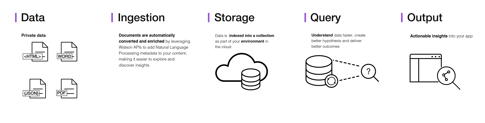

---

copyright:
  years: 2015, 2017
lastupdated: "2017-12-15"

---

{:shortdesc: .shortdesc}
{:new_window: target="_blank"}
{:tip: .tip}
{:pre: .pre}
{:codeblock: .codeblock}
{:screen: .screen}
{:javascript: .ph data-hd-programlang='javascript'}
{:java: .ph data-hd-programlang='java'}
{:python: .ph data-hd-programlang='python'}
{:swift: .ph data-hd-programlang='swift'}

# 製品情報

{{site.data.keyword.discoveryfull}} の使用により、ユーザー自身が所有するデータ、および公開データやサード・パーティー・データを含む非構造化データに隠された、すぐに実施可能な洞察のロックを解除する、コグニティブなクラウド・ベースの探査アプリケーションを素早く作成することができます。
{: shortdesc}

完全な {{site.data.keyword.discoveryshort}} サービス・ソリューションのアーキテクチャーを以下に示します。

{{site.data.keyword.discoveryshort}} を使用すれば、わずか数ステップで、非構造化データを準備し、必要な情報を正確に示す照会を作成し、それらの洞察を新しいアプリケーションや既存のソリューションに統合することができます。

{{site.data.keyword.discoveryshort}} はどのようにそれを実現するのでしょうか。データ分析とコグニティブ直観を組み合わせて使用し、ユーザーが必要な情報を発見できるように非構造化データをエンリッチすることによって実現します。

{{site.data.keyword.discoveryfull}} は、統合され、自動化された、機能豊富な {{site.data.keyword.watson}} API のセットを集めて以下のことを実行します。

- データをクロール、変換、エンリッチ、および正規化する。
- 自身が所有するコンテンツだけでなく、無料およびライセンス交付を受けた公開コンテンツを安全に探索する。
- {{site.data.keyword.nlushort}} (NLU) を介して、概念、関係、およびセンチメントなどの追加エンリッチメントを適用する。
- API への直接アクセスを引き続き提供する一方で、開発を簡素化する。

言語サポートについては、[{{site.data.keyword.discoveryshort}} の言語サポート](/docs/services/discovery/language-support.html)を参照してください。

{{site.data.keyword.Bluemix_notm}} セキュリティーについては、[{{site.data.keyword.Bluemix_notm}} Service Description ](../../icons/launch-glyph.svg "外部リンク・アイコン")](http://www.ibm.com/software/sla/sladb.nsf/searchsaas/?searchview&searchorder=4&searchmax=0&query=IBM+Bluemix+Service+Description){: new_window} を参照してください。

{{site.data.keyword.discoveryfull}} Visual Insights は、{{site.data.keyword.discoveryshort}} による、意味的要素、関係、概念、その他の理解によって識別される関連付けを視覚的に探索するために使用できる試験的機能です。詳しくは、[{{site.data.keyword.discoveryfull}} Visual Insights](/docs/services/discovery/visual-insights.html) を参照してください。

{{site.data.keyword.discoveryfull}} Knowledge Graph は、複数の文書にわたってエンティティーおよび関係を照会するための新しいエンドポイントを提供するベータ版フィーチャーです。これには、コンテキスト・ベースの検索および関連性ランキングが含まれます。詳しくは、[{{site.data.keyword.discoveryfull}} Knowledge Graph](/docs/services/discovery/building-kg.html) を参照してください。

## ブラウザー・サポートおよび前提条件

{{site.data.keyword.Bluemix}} の前提条件とサポートされるブラウザーのリストについては、[前提条件 ](https://console.bluemix.net/docs/overview/prereqs.html#prereqs){: new_window} を参照してください。

## Watson Discovery News
{: #watson-discovery-news}

{{site.data.keyword.discoveryshort}} には、コグニティブな洞察によって事前にエンリッチされた公開データ・セット、{{site.data.keyword.discoverynewsshort}} も含まれています。この公開された非構造化データ・セットを使用して、自身のアプリケーションに統合できる洞察を照会することができます。詳しくは、[Watson Discovery News](/docs/services/discovery/watson-discovery-news.html#watson-discovery-news) を参照してください。{{site.data.keyword.discoverynewsshort}} で何を作成できるかのデモについては、[こちら ](https://discovery-news-demo.mybluemix.net/){: new_window} を参照してください。

{{site.data.keyword.discoveryshort}} サービスは、[{{site.data.keyword.Bluemix_notm}} ](https://console.ng.bluemix.net/catalog/services/discovery/){: new_window} で使用可能です。

## Discovery ツール
{: #discovery-tooling}

{{site.data.keyword.discoveryshort}} サービスには、サービスのインスタンスを素早くセットアップし、それにデータを取り込むのに役立つオンライン・ツールの完全セット、{{site.data.keyword.discoveryshort}} ツールが含まれています。

{{site.data.keyword.discoveryshort}} サービス・ツールは、サービスの構成とデータの取り込みに API を使用する必要性をなくすことによって時間を節約するよう設計されています。これにより、アプリケーション開発者は、エンド・ユーザーにとって価値の高い、{{site.data.keyword.discoveryshort}} サービスの経験方法を作成することに専念できます。 {{site.data.keyword.discoveryshort}} ツールの概要については、[ツール入門](/docs/services/discovery/getting-started-tool.html)を参照してください。

## 次のステップ
{: #next-steps}

- 以下を参照して、{{site.data.keyword.discoveryshort}} ツールまたは {{site.data.keyword.discoveryshort}} API のいずれかを開始します。
    - [{{site.data.keyword.discoveryshort}} ツール入門](/docs/services/discovery/getting-started-tool.html)
    - [{{site.data.keyword.discoveryshort}} API 入門](/docs/services/discovery/getting-started.html)
- ナビゲーション・ペインから SDK のリストを表示します。
