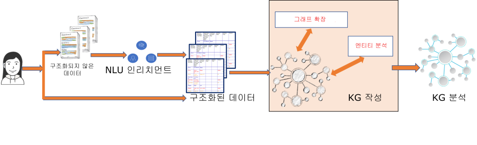

---

copyright:
  years: 2015, 2018
lastupdated: "2018-06-09"

---

{:shortdesc: .shortdesc}
{:new_window: target="_blank"}
{:tip: .tip}
{:pre: .pre}
{:codeblock: .codeblock}
{:screen: .screen}
{:javascript: .ph data-hd-programlang='javascript'}
{:java: .ph data-hd-programlang='java'}
{:python: .ph data-hd-programlang='python'}
{:swift: .ph data-hd-programlang='swift'}

# Watson Discovery Knowledge Graph

Knowledge Graph(KG)는 문서 전반에서 데이터 내 연결을 작성하고 새로운 지식을 생성함으로써 데이터 및 정보 이상의 것을 제공합니다. 엔티티와 관계를 추출하고 이들의 모호성을 제거하며, 알고리즘 기술을 통해 관계를 강화하고, 관련성 알고리즘을 통해 결과의 순위를 지정하여 구조화되지 않은 데이터에서 자동으로 사용자 정의 Knowledge Graph를 작성하는 AI 기술을 제공합니다. Knowledge Graph는 회사에 대한 "지식 허브"로의 기능을 수행할 수 있으며 엔터프라이즈 검색, 요약, 권장 엔진, 기타 의사 결정 프로세스(예: 부정 행위, 낭비 또는 남용)에 사용될 수 있습니다. Knowledge Graph 작성 프로세스의 사용자 정의 모델({{site.data.keyword.knowledgestudioshort}}에서 작성됨)을 사용하면 재무, 기술, 보안, 인텔리전스, 의료 등과 같은 도메인에 적용할 수 있는 도메인 특정 KG를 빌드할 수 있습니다. {{site.data.keyword.discoveryshort}}와 {{site.data.keyword.knowledgestudioshort}}의 통합에 대한 자세한 정보는 [{{site.data.keyword.knowledgestudiofull}}와 통합](/docs/services/discovery/integrate-wks.html)을 참조하십시오.


{{site.data.keyword.discoveryfull}}에 추가된 두 개의 RESTful 엔드포인트는 비구조화된 문서 콜렉션의 문서에서 모호성이 제거되고 강화된 엔티티 및 관계를 검색할 수 있는 기능을 제공합니다. 검색 결과는 관련성 및 인기도 순으로 순위가 지정될 수 있습니다. 검색 토큰 외에도, API는 자동으로 작성된 대형 Knowledge Graph 내에 좀 더 관련성이 높은 엔티티 및 관계를 찾는 선택적 컨텍스트 단어 또는 구문을 사용할 수 있습니다.

 다음 그림은 Knowledge Graph가 현재 {{site.data.keyword.discoveryfull}} 파이프라인에서 얼마나 적합한지를 보여줍니다. {{site.data.keyword.nlushort}} 인리치먼트는 사용자 정의 {{site.data.keyword.knowledgestudioshort}} 모델(`en-news`)을 사용하여 개별 문서 레벨에서 엔티티 및 관계를 추출합니다. Knowledge Graph 작성 중에 내재된(자동) 엔티티 분석 및 그래프 확장 기술이 문서 전반에서 엔티티 및 관계의 연결된 그래프를 자동으로 작성하는 데 사용됩니다. Knowledge Graph 작성 외에도, Knowledge Graph 분석 서비스는 결과를 리턴하기 위해 관련성 순위 지정 기술을 추가합니다.



이 연결된 Knowledge Graph 및 순위 지정 기술은 다음 유스 케이스를 용이하게 합니다.

-  퍼지 검색 토큰, 유형 정보(선택사항) 및 컨텍스트(선택사항)를 사용하여 모호성이 제거된 엔티티. 예를 들어, `Apple`의 컨텍스트에서 `Steve`를 검색하면 상위에 `Steve Jobs`가 리턴되고 `Microsoft`의 컨텍스트에서 `Steve`를 검색하면 상위에 `Steve Ballmer`가 리턴됩니다.
-  퍼지 검색 토큰 및 컨텍스트(선택사항)를 입력하여 생성된 관련성 순위 지정 관계. 관련성 순위 지정은 그래프의 글로벌 특성을 활용하여 좀 더 자세한 정보를 표시합니다. 예를 들어, `health`의 컨텍스트에서 `Obama`의 관계를 검색하면 `Affordable Care Act` 및 기타 관련된 엔티티가 리턴됩니다.
-  연결된 Knowledge Graph에서 엔티티 및 관계를 조회하여 생성된 문서 전체의 추론 및 집계. 이러한 조회의 예는 "사람 X가 사람 Y에 연결되는 방법은 무엇입니까?" "직원 X의 데이터 액세스 패턴이 표준과 얼마나 다릅니까?" "사람 X의 영향권은 무엇입니까?"입니다.

## 서비스 요구사항

베타 릴리스 중에 Knowledge Graph 기능 및 이와 연관된 메소드는 **고급** 플랜, **프리미엄** 플랜 및 모든 전용 환경에 등록된 서비스 인스턴스에 대해서만 사용 가능합니다. 

이 베타 기능은 현재 영어로만 지원되며 세부사항은 [언어 지원](/docs/services/discovery/language-support.html#feature-support)을 참조하십시오.

## 콜렉션 요구사항

{{site.data.keyword.discoveryshort}}는 Knowledge Graph를 작성하고 엔티티 관계 조회를 허용하기 위해 수집된 문서에서 추출된 엔티티 및 관계를 사용합니다.

**참고:** [엔티티 유사성](/docs/services/discovery/building-kg.html#similarity), [증거](/docs/services/discovery/building-kg.html#evidence) 및 [정규화 및 필터링](/docs/services/discovery/building-kg.html#canonicalization)을 모든 콜렉션에서 사용할 수 있습니다. `03-05-2018` 이전에 작성된 모든 콜렉션의 경우 이러한 기능을 사용하려면 문서를 다시 수집해야 합니다.

**참고:** Knowledge Graph는 개인용 데이터 콜렉션에만 사용할 수 있으며 {{site.data.keyword.discoverynewsshort}}에서 사용하도록 설계되지 않았습니다.

Knowledge Graph를 사용하려면 다음과 같이 특정 요구사항을 충족하도록 콜렉션을 구성해야 합니다.

-  `entities` 및 `relations` 인리치먼트가 둘 다 Knowledge Graph를 활용할 필드에 대해 지정되어야 하며 각 인리치먼트는 동일한 사용자 정의 모델을 사용해야 합니다. 공용 모델이 사용되는 경우({{site.data.keyword.knowledgestudioshort}} 없이 사용 가능) 이는 사용자 정의 모델 `model="en-news"`의 양식으로 지정되어야 합니다. 

-  다음과 같이 `relations` 인리치먼트를 지정해야 합니다.
   ```json
   "relations": {
     "model": "en-news"
   }
   ```
   {: codeblock}

-  `entities` 인리치먼트는 다음과 같이 지정되어야 하며 `mentions`, `mentions_types` 및 `sentence_locations` 매개변수도 지정되어야 합니다.
   ```json
   "entities": {
     "mentions": true,
     "mention_types": true,
     "sentence_locations": true,
     "model": "en-news"
    }
   ```
   {: codeblock}

   원하는 경우 기타 선택적 `enrichments` 옵션(예: `"sentiment": true`)도 지정할 수 있습니다. 이는 인리치먼트로 검색 인덱스에 저장되지만, Knowledge Graph 자체에서 노드로 사용되지는 않습니다.

이러한 옵션은 {{site.data.keyword.discoveryshort}} 도구를 사용하여 **추가할 수 없으며** 사용자 정의 구성은 API를 사용하여 업로드해야 합니다. 공용 모델을 사용하는 Knowledge Graph를 통해 콜렉션을 사용할 수 있도록 `text` 필드를 강화하도록 수정된 기본 구성의 사본은 [여기](https://raw.githubusercontent.com/watson-developer-cloud/doc-tutorial-downloads/master/discovery/config-default-kg.json)에서 확인할 수 있습니다.

{{site.data.keyword.discoveryshort}} 서비스 인스턴스 작성 후 다음과 같이 사용자 정의 구성을 작성하십시오.

1. 다음 명령을 실행하여 `my-first-environment`라는 환경을 작성하십시오. `{apikey_value}`를 서비스의 API 키 값으로 바꾸십시오.

   ```bash
   curl -X POST -u "apikey":"{apikey_value}" -H "Content-Type: application/json" -d '{ "name":"my-first-environment", "description":"exploring environments"}' "api/v1/environments?version=2017-11-07"
   ```
   {: pre}

   API가 환경 ID, 환경 상태 및 환경에서 사용 중인 스토리지의 크기와 같은 정보를 리턴합니다.

   리턴되는 `{environment_id}`가 필요합니다. 나중에 사용할 수 있도록 해당 ID를 저장해 두어야 합니다.

1. 그런 다음, 사용자 정의 구성을 작성하십시오. 이 프로시저에서는 사용자가 [여기](https://raw.githubusercontent.com/watson-developer-cloud/doc-tutorial-downloads/master/discovery/config-default-kg.json)에 있는 사용자 정의 구성을 업로드 중이라고 간주합니다. 고유한 사용자 정의 구성을 빌드할 경우 [구성 참조](/docs/services/discovery/custom-config.html)를 참조하십시오.

   ```bash
   curl -X POST -u "apikey":"{apikey_value}" -H "Content-Type: application/json" -d @config-default-kg.json "https://gateway.watsonplatform.net/discovery/api/v1/environments/{environment_id}/configurations?version=2017-11-07"
   ```
   {: pre}

   **사용자 정의 구성이 이미 있고 이를 업데이트하여 사용하려는 경우**, 이 명령에서 사용자 정의 구성의 {configuration ID}를 사용하십시오.

   ```bash
   curl -X PUT -u "apikey":"{apikey_value}" -H "Content-Type: application/json" -d @config-default-kg.json "https://gateway.watsonplatform.net/discovery/api/v1/environments/{environment_id}/configurations/{configuration ID}?version=2017-11-07"
   ```
   {: pre}

1. 사용자 정의 구성이 업로드된 후 작성하는 모든 콜렉션에 이를 사용할 수 있으며, 사용자 정의 구성이 지정되는 한 문서를 업로드하는 모든 메소드를 사용할 수 있습니다. 콜렉션을 작성하고 문서를 업로드하는 데 익숙하지 않은 경우 [도구 시작하기](/docs/services/discovery/getting-started-tool.html)를 참조하십시오. [3단계](/docs/services/discovery/getting-started-tool.html#create-custom-configuration)에서 새 구성을 작성하는 대신 `Knowledge Graph 구성`을 선택하십시오.

## 정규화 및 필터링
{: #canonicalization}

`2018년 5월 5일` 이후에 수집된 문서의 모든 엔티티는 공용 사전에서 파생된 표준 이름으로 자동으로 정규화됩니다. 또한 엔티티 또는 관계에 포함되는 모든 대명사(예: `he`, `she`, `they` 또는 `it`)는 Knowledge Graph로 수집되기 전에 자동으로 필터링됩니다. '2018년 3월 5일' 이전에 수집된 문서에는 이 레벨의 정규화 및 필터링이 포함되지 않습니다. 이 기능을 활용하려면 새 콜렉션을 작성하고 문서를 다시 수집해야 합니다.

Knowledge Graph에서 엔티티 조회 또는 관계 조회를 빌드하는 경우 엔티티의 표준 이름 또는 원래 텍스트를 `query_entities` 또는 `query_relations` 메소드의 `text` 필드에 입력할 수 있습니다.


## 엔티티 조회
{: #entities}

베타 릴리스의 Knowledge Graph 엔티티 조회에서는 컨텍스트 기반 엔티티 [disambiguation](/docs/services/discovery/building-kg.html#disambiguation) 및 [similarity](/docs/services/discovery/building-kg.html#similarity) 조회를 지원합니다. Knowledge Graph 엔티티 조회는 `v1/environments/{environment_id}/collections/{collection_id}/query_entities` 엔드포인트에 대한 `JSON` 오브젝트를 `POST`하여 수행됩니다.

API 또는 {{site.data.keyword.discoveryshort}} 도구를 사용하여 엔티티를 조회할 수 있습니다. 도구 정보는 [Discovery 도구를 사용하여 Knowledge Graph 조회](/docs/services/discovery/building-kg.html#querying-kg)를 참조하십시오.

Knowledge Graph 엔티티 조회 JSON 오브젝트의 양식은 다음과 같습니다.

```json
{
  "feature": "disambiguate",
  "entity": {
    "text": "Steve",
    "type": "Person",
    "exact": "false"
  },
  "context": {
    "text": "iphone"
  },
  "count": 10,
  "evidence_count": 0
}
```
{: codeblock}

-  `"feature": string` _required_ - 사용할 엔티티 조회 기능입니다. 지원되는 기능은 다음과 같습니다. [disambiguate](/docs/services/discovery/building-kg.html#disambiguation) 및 [similar_entities](/docs/services/discovery/building-kg.html#similarity).
-  `"entity": {}` _required_ - 모호성 제거를 위한 엔티티 정보를 포함하는 오브젝트입니다.
   -  `"text": string` _required_ - 모호성이 제거될 엔티티 텍스트입니다.
   -  `"type": string` _optional_ - 모호성 제거를 위한 선택적 엔티티 유형으로, 지정되지 않으면 모든 유형이 포함됩니다.
   -  `"exact": boolean` _optional_ - `false`이면 내재된 모호성 제거가 수행됩니다. 내재된 모호성 제거는 각 입력 엔티티 오브젝트마다 상위에 있는 하나의 모호성이 제거된 엔티티를 사용합니다. `"feature": "disambiguate"`를 `false`로 설정해야 합니다. 기본값은 `false`입니다.
-  `"context": {}` _optional_ - 모호성 제거를 위한 컨텍스트 요구사항이 포함된 선택적 오브젝트입니다.
   -  `"text": string` _optional_ - 해당 연관을 기반으로 한 순위 및 조회된 엔티티에 대한 컨텍스트를 제공하는 엔티티 텍스트입니다. 예를 들어, 영국의 도시인 런던을 조회하려는 경우 조회는 `England`의 컨텍스트를 사용하여 `London`을 검색합니다. 입력은 관련 엔티티 용어가 포함된 대형 구문 또는 이름의 일부가 될 수 있습니다. 여러 용어를 함께 전달할 수 있습니다.
-  `"count": INT` _optional_ - 리턴할 모호성이 제거된 엔티티의 수입니다. 기본값은 `10`입니다. 최대값은 `1000`입니다.
-  `"evidence_count": INT` _optional_ 식별된 각 엔티티에 대해 리턴할 증거 인스턴스 수입니다. 기본값은 `0`입니다. `evidence_count` 필드의 최대값은 10,000을 `count` 필드에 지정된 수로 나눈 값입니다. 자세한 설명과 예를 보려면 이 페이지의 [Evidence](/docs/services/discovery/building-kg.html#evidence) 절을 참조하십시오.

조회는 다음 양식의 결과를 리턴합니다.

```json
{
  "entities": [
    {
      "text": "Steve Jobs",
      "type": "PERSON"
    },
    {
      "text": "Steve Wozniak",
      "type": "PERSON"
    }
  ]
}
```
{: codeblock}

일치 항목이 발견되지 않으면 다음 JSON 오브젝트가 리턴됩니다.

```json
{
  "entities": []
}
```
{: codeblock}

### 엔티티 모호성 제거
{: #disambiguation}

Knowledge Graph 엔티티 조회는 컨텍스트 기반 엔티티 모호성 제거를 제공합니다. 제공된 엔티티 텍스트와 선택적 컨텍스트 텍스트에 따라 `disambiguation`는 고유한 엔티티를 식별하고 컨텍스트 정보를 기반으로 순위가 지정된 엔티티 목록을 리턴합니다.

엔티티 모호성 제거 조회는 Knowledge Graph 조회 오브젝트에서 `"feature" :` 필드의 값으로 `"disambiguation"`을 지정하여 요청할 수 있습니다.

예를 들어 `iphone` 컨텍스트에서 엔티티 텍스트 `Steve`의 모호성을 제거하면 `Steve Jobs` 및 `Steve Wozniak`이 리턴됩니다.


### 엔티티 유사성
{: #similarity}

Knowledge Graph 엔티티 조회는 컨텍스트 기반 엔티티 유사성 발견을 제공합니다. 제공된 엔티티 텍스트와 선택적 컨텍스트 텍스트에 따라 `similar_entities`는 고유한 엔티티를 식별하고 컨텍스트 정보를 기반으로 순위가 지정된 엔티티 목록을 리턴합니다.

엔티티 유사성 조회는 Knowledge Graph 조회 오브젝트에서 `"feature" :` 필드의 값으로 `"similar_entities"`를 지정하여 요청할 수 있습니다.

예를 들어 'car' 컨텍스트에서 `Ford`와 유사한 엔티티를 찾는 경우 유사한 엔티티 결과에는 `GM`, `Toyota` 및 `Nissan`이 포함될 수 있습니다.

## 관계 조회
{: #relations}

Knowledge Graph 관계 조회는 내재된 엔티티 모호성 제거, 컨텍스트 기반 관계를 사용하고 관련성 스코어 및 멘션 수를 정렬하며 유형 및 문서 ID로 필터링하여 입력 엔티티를 기반으로 한 가장 관련성이 높은 관계 찾기를 지원합니다.

API 또는 {{site.data.keyword.discoveryshort}} 도구를 사용하여 관계를 조회할 수 있습니다. 도구 정보는 [Discovery 도구를 사용하여 Knowledge Graph 조회](/docs/services/discovery/building-kg.html#querying-kg)를 참조하십시오.

Knowledge Graph 엔티티 조회는 `v1/environments/{environment_id}/collections/{collection_id}/query_relations` 엔드포인트에 대한 `JSON` 오브젝트를 `POST`하여 수행됩니다. Knowledge Graph 관계 조회 JSON 오브젝트의 양식은 다음과 같습니다.

```json
{
  "entities": [
    {
      "text": "Steve Jobs",
      "type": "PERSON",
      "exact": true
    }
  ],
  "context": {
    "text": "iphone"
  },
  "sort": "score",
  "filter": {
    "relation_types": {
      "exclude": ["colocation"],
      "include": ["locatedAt", "employedBy", "managerOf", "founderOf"]
    },
    "entity_types": {
      "exclude": ["EVENT"],
      "include": ["PERSON", "GPE", "ORGANIZATION"]
    },
    "document_ids": ["b95df4c1-d00f-4771-abb2-a52baea0444a", "ad340635-bf3e-47a5-bea5-5e778f600c32"]
  },
  "count": 10,
  "evidence_count": 0
}
```
{: codeblock}

-  `"entities": []` _required_ - 관계를 조회할 엔티티가 포함된 배열입니다. 하나의 엔티티 오브젝트만 정의되는 경우 모든 인접 항목 관계가 리턴됩니다. 둘 이상의 엔티티 오브젝트가 정의되면 상호 쌍 관계가 리턴됩니다. 상호 쌍 관계는 모든 엔티티 인접 항목이 포함된 관계가 아닌 입력 엔티티 간의 직접적인 관계를 리턴합니다. 각 엔티티 오브젝트에는 다음이 포함됩니다.
   -  `"text": string` _required_ - 엔티티 텍스트입니다.
   -  `"type": string` _optional_ - 선택적 엔티티 유형입니다. `"exact"`가 `true`이면 이 필드는 필수입니다.
   -  `"exact": boolean` _optional_ - `false`이면 내재된 모호성 제거가 수행됩니다. 내재된 모호성 제거는 각 입력 엔티티 오브젝트마다 상위에 있는 하나의 모호성이 제거된 엔티티를 사용합니다. 기본값은 `false`입니다.
-  `"context": {}` _optional_ - 컨텍스트 요구사항이 포함된 선택적 오브젝트입니다.
   -  `"text": string` _optional_ - 해당 연관을 기반으로 한 순위 및 조회된 엔티티에 대한 컨텍스트를 제공하는 엔티티 텍스트입니다. 예를 들어, 영국의 도시인 런던을 조회하려는 경우 조회는 `England`의 컨텍스트를 사용하여 `London`을 검색합니다. 입력은 관련 엔티티 용어가 포함된 대형 구문 또는 이름의 일부가 될 수 있습니다. 여러 용어를 함께 전달할 수 있습니다.
-  `"sort": string` _optional_ - 관계에 대한 정렬 메소드는 `score` 또는 `frequency`가 될 수 있습니다. 기본값은 `score`입니다. `score`는 입력 엔티티에 대한 관계 및 인접 항목의 관련성과 컨텍스트에 대한 관련성(컨텍스트가 제공되는 경우)을 기반으로 합니다. `frequency`는 각 관계를 식별할 고유 횟수입니다.
-  `"filter": {}` _optional_ - 이 조회에 대해 필터링할 관계 유형, 엔티티 유형 및 특정 문서가 포함된 오브젝트입니다. 기본적으로 아무 것도 제외되지 않습니다.
   -  `"relation_types": {}` _optional_ 필터링할 관계 유형의 목록입니다.
      -  `"exclude": []` _optional_ 조회에서 제외할 관계 유형의 쉼표로 구분된 목록입니다.
      -  `"include": []` _optional_ 명시적으로 조회에 포함할 관계 유형의 쉼표로 구분된 목록입니다. 지정된 경우 모든 기타 유형은 제외되도록 간주됩니다.
   -  `"entity_types": {}` _optional_ 인접 항목을 필터링할 엔티티 유형의 목록입니다. 새 인접 항목이 리턴되지 않으므로 다중 엔티티 입력에는 적용되지 않습니다.
      -  `"exclude": []` _optional_ 조회에서 제외할 엔티티 유형의 쉼표로 구분된 목록입니다.
      -  `"include": []` _optional_ 명시적으로 조회에 포함할 엔티티 유형의 쉼표로 구분된 목록입니다. 지정된 경우 모든 기타 유형은 제외되도록 간주됩니다.
   -  `"document_ids": []` _optional_ 조회를 수행할 문서의 쉼표로 구분된 목록입니다.
-  `"count": INT` _optional_ 리턴할 관계의 수입니다. 기본값은 `10`입니다. 최대값은 `1000`입니다.
-  `"evidence_count": INT` _optional_ 식별된 각 관계에 대해 리턴할 증거 인스턴스 수입니다. 기본값은 `0`입니다. `evidence_count` 필드의 최대값은 10,000을 `count` 필드에 지정된 수로 나눈 값입니다. 자세한 설명과 예를 보려면 이 페이지의 [Evidence](/docs/services/discovery/building-kg.html#evidence) 절을 참조하십시오.

조회는 다음 양식으로 결과를 리턴합니다.

```json
{
  "relations": [
    {
      "type": "FOUNDEROF",
      "frequency": 7,
      "arguments": [
        {
          "entities": [
            {
              "type": "PERSON",
              "text": "Steve Jobs"
            }
          ]
        },
        {
          "entities": [
            {
              "type": "ORGANIZATION",
              "text": "Apple"
            }
          ]
        }
      ]
    }
  ]
}
```
{: codeblock}

관계 배열의 각 오브젝트에서 엔티티 배열의 쌍을 포함하는 인수 배열이 리턴되며, 각 쌍에서 첫 번째는 소스 또는 주체이고 두 번째는 관계의 대상 또는 객체입니다.

일치 항목이 발견되지 않으면 다음 JSON 오브젝트가 리턴됩니다.

```json
{
  "relations": []
}
```
{: codeblock}

## 증거
{: #evidence}

일부 엔티티나 관계 조회의 경우 연결이 식별되는 위치를 이해하는 것이 중요할 수 있습니다. 연결의 증거를 통해 적절하게 원래 문서를 참조하거나 결과를 명확하게 하거나 추가로 모호성을 제거할 수 있습니다. `03-05-2018` 이후에 작성된 콜렉션부터 `query_entities` 및 `query_relations` 엔드포인트에는 리턴된 결과의 증거를 제공하는 옵션이 있습니다. 이 기능은 `03-05-2018` 이후에 작성된 콜렉션에 사용할 수 있지만 이전 콜렉션에서 이 기능을 사용하려면 문서를 다시 수집해야 합니다.

`"evidence_count": INT` 필드를 조회 오브젝트에 추가하면 증거가 리턴됩니다. 이 수는 응답 시간당 리턴되는 증거 항목 수를 나타냅니다. 예를 들어 `"count":`에 `5`개의 응답 항목을 지정하고 `"evidence_count": 2`를 지정하면 응답에 `10`개의 증거 항목이 포함됩니다(응답당 2개). 단일 조회의 총계에 리턴되는 증거 항목의 최대값은 10,000입니다.

`query_entities` 응답에서는 `entities` 배열의 각 오브젝트에 지정된 수의 `evidence` 오브젝트가 포함됩니다. 이러한 오브젝트에는 증거를 찾은 문서의 `document_id`, 증거가 있는 `field`, 해당 필드 내에 있는 증거의 위치 및 식별된 엔티티의 정확한 위치가 포함됩니다.

```json
{
      "text": "Steve Jobs",
      "type": "Person",
      "evidence": [
        {
          "document_id": "cb77ce6b-bb93-42a0-8643-dfb523e14da8",
          "field": "description",
          "start_offset": 305,
          "end_offset": 392,
          "entities": [
            {
              "type": "Person",
              "text": "Steve Jobs",
              "start_offset": 311,
              "end_offset": 321
            }
          ]
        }
      ]
    }

```
{: codeblock}

`query_relations`에서는 `relations` 배열의 각 오브젝트에 지정된 수의 `evidence` 오브젝트가 포함됩니다. 리턴된 `evidence`는 관련 엔티티의 위치가 모두 지정된 `query_relations`에서와 동일하게 구조화됩니다.

```json
{
      "type": "founderOf",
      "frequency": 7,
      "arguments": [
        {
          "entities": [
            {
              "type": "Person",
              "text": "Steve Jobs"
            }
          ]
        },
        {
          "entities": [
            {
              "type": "Organization",
              "text": "Apple"
            }
          ]
        }
      ],
      "evidence": [
        {
          "document_id": "b95df4c1-d00f-4771-abb2-a52baea0444a",
          "field": "text",
          "start_offset": 243,
          "end_offset": 303,
          "entities": [
            {
              "type": "Organization",
              "text": "Apple",
              "start_offset": 293,
              "end_offset": 298
            },
            {
              "type": "Person",
              "text": "Steve Jobs",
              "start_offset": 243,
              "end_offset": 253
            }
          ]
        }
      ]
    }
```
{: codeblock}

## Discovery 도구를 사용하여 Knowledge Graph 조회
{: #querying-kg}

[**고급**](/docs/services/discovery/building-kg.html#service-requirements) 플랜에 등록된 서비스 인스턴스가 있는 사용자는 {{site.data.keyword.discoveryshort}} 도구를 사용하여 Knowledge Graph로 개인용 콜렉션을 조회할 수 있습니다.  

{{site.data.keyword.discoveryshort}} 도구에서 Knowledge Graph 조회에 액세스하려면 다음을 수행하십시오.

1.  <!-- {width="20" height="20" style="padding-left:5px;padding-right:5px;"} -->을 클릭하여 조회 페이지를 여십시오.
1.  콜렉션을 선택한 후 **시작하기**를 클릭하십시오.
1.  **조회 빌드** 화면에서 **Knowledge Graph** 탭을 누른 후 **엔티티** 또는 **관계**를 클릭하십시오.

**참고:** {{site.data.keyword.discoveryshort}} 도구를 사용할 때 모든 Knowledge Graph 기능을 사용할 수 있는 것은 아닙니다.
