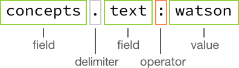

---

copyright:
  years: 2015, 2017
lastupdated: "2017-08-31"

---

{:shortdesc: .shortdesc}
{:new_window: target="_blank"}
{:tip: .tip}
{:pre: .pre}
{:codeblock: .codeblock}
{:screen: .screen}
{:javascript: .ph data-hd-programlang='javascript'}
{:java: .ph data-hd-programlang='java'}
{:python: .ph data-hd-programlang='python'}
{:swift: .ph data-hd-programlang='swift'}

# Discovery 아카이브

이 절에는 계속해서 사용 가능하지만 최신 옵션으로 대체된 {{site.data.keyword.discoveryshort}} 기능에 대한 정보가 포함되어 있습니다.
{: tip}

## AlchemyLanguage 인리치먼트
{: #AlchemyLanguage-enrichments}

**2017년 7월 18일**에 {{site.data.keyword.discoveryfull}}는 {{site.data.keyword.nlushort}}이라는 새 인리치먼트 기술을 도입하였습니다. 이 인리치먼트는 기존 인리치먼트와 동일하지만 약간 다른 구성 및 스키마가 필요합니다. {{site.data.keyword.alchemylanguageshort}}라고 하는 원래 인리치먼트는 더 이상 사용되지 않고 **2018년 1월 15일**에 지원이 종료됩니다. 

`2017-10-16` API 버전 문자열에서 새 문서를 {{site.data.keyword.alchemylanguageshort}}로 강화된 기존 콜렉션에 업로드하고 새 콜렉션을 작성하고 새 콜렉션을 {{site.data.keyword.alchemylanguageshort}} 인리치먼트로 강화하기 위한 지원은 더 이상 사용되지 않습니다. 지원이 **2018년 1월 15일**에 종료될 때까지 {{site.data.keyword.alchemylanguageshort}}를 계속 사용하려면 이전 API 버전 문자열을 사용하십시오. 

AlchemyLanguage로 강화된 기존 콜렉션은 가능한 빨리 Natural Language Understanding 인리치먼트로 마이그레이션되어야 합니다. {{site.data.keyword.alchemylanguageshort}} 인리치먼트를 활용하는 콜렉션 및 구성 파일의 마이그레이션에 대한 정보는 [{{site.data.keyword.nlushort}}으로 인리치먼트 마이그레이션](/docs/services/discovery/migrate-nlu.html)을 참조하십시오.

**참고:** {{site.data.keyword.discoveryshort}} 도구는 항상 최신 API 버전 문자열을 사용하므로 `2017-10-16` API 버전 문자열로 시작합니다. 더 이상 기존 {{site.data.keyword.alchemylanguageshort}} 콜렉션으로 문서를 업로드하거나 {{site.data.keyword.discoveryshort}} 도구를 사용하여 {{site.data.keyword.alchemylanguageshort}} 인리치먼트로 강화된 새 콜렉션을 작성할 수 없습니다. 콜렉션을 강화하기 위해 Discovery 도구를 계속 사용하려면 먼저 콜렉션을 Natural Language Understanding으로 마이그레이션하십시오. 자세한 사항은 [{{site.data.keyword.nlushort}}으로 인리치먼트 마이그레이션](/docs/services/discovery/migrate-nlu.html)을 참조하십시오. 

### 엔티티 추출(AlchemyLanguage)
{: #entity-extraction-al}

입력 텍스트에 있는 개인, 위치 및 조직과 같은 항목을 리턴합니다. 엔티티 추출은 시맨틱 정보를 컨텐츠에 추가하여 분석 중인 텍스트의 주제 및 컨텍스트를 이해하는 데 도움을 줍니다. 엔티티 추출 기술은 정교한 통계 알고리즘 및 자연어 처리 기술을 기반으로 하며 다국어 분석, 컨텍스트에 따른 모호성 제거 및 인용 추출에 대한 지원으로 업계에서 독보적인 기술입니다. 

엔티티 추출을 사용하여 강화된 문서의 일부 예제:

```json
{
      "text": "The stockholders were pleased that Acme Corporation plans to build a new factory in Atlanta, Georgia.",
      "enriched-text": {
        "status": "OK",
        "language": "english",
        "entities": [
          {
            "type": "City",
            "relevance": 0.532754,
            "sentiment": {
              "type": "positive",
              "score": 0.527541,
              "mixed": false
            },
            "count": 1,
            "text": "Atlanta",
            "disambiguated": {
              "subType": [
                "AdministrativeDivision",
                "GovernmentalJurisdiction",
                "OlympicHostCity",
                "PlaceWithNeighborhoods"
              ],
              "name": "Atlanta",
              "website": "http://www.atlantaga.gov/",
              "dbpedia": "http://dbpedia.org/resource/Atlanta",
              "freebase": "http://rdf.freebase.com/ns/m.013yq"
            }
          }
        ]
      }
    }
```
{: codeblock}
이전 예에서는 `enriched_text.entities.type`에 액세스하여 엔티티 유형을 조회할 수 있었습니다.

`sentiment`는 **sentiment** 인리치먼트가 선택되지 않은 경우에도 엔티티 유형에 대해 계산됩니다. 감성 스코어링에 대해 자세히 알아보려면 [감성 분석](/docs/services/discovery/discovery-auxiliary.html#sentiment-analysis-al)을 참조하십시오.

`relevance` 스코어의 범위는 `0.0` - `1.0`입니다. 스코어가 높을수록 엔티티 관련성이 높아집니다. `disambiguated` 필드에는 엔티티에 대한 모호성 제거 정보가 포함되며, 엔티티 `subType` 정보를 포함하고 리소스에 연결합니다(해당 경우). `count`는 엔티티가 문서에 언급된 횟수입니다. 

### 키워드 추출(AlchemyLanguage)
{: #keyword-extraction-al}

데이터를 인덱싱하거나 태그 클라우드를 생성하거나 검색할 때 일반적으로 사용되는 컨텐츠의 중요 주제입니다. {{site.data.keyword.discoveryshort}} 서비스는 자동으로 입력 컨텐츠에서 지원되는 언어를 식별한 후 해당 컨텐츠에서 키워드를 식별하고 순위를 지정합니다. 

키워드 추출을 사용하여 강화된 문서의 일부 예제:

```json
{
    "text": "The stockholders were pleased that Acme Corporation plans to build a new factory in Atlanta, Georgia.",
    "enriched-text": {
        "status": "OK",
        "language": "english",
        "keywords": [
          {
            "relevance": 0.66497,
            "sentiment": {
              "score": 0.527541,
              "type": "positive",
              "mixed": false
            },
            "text": "stockholders"
          }
        ]
      }
    }
```
{: codeblock}

이전 예에서는 `enriched_text.keywords.text`에 액세스하여 키워드 텍스트를 조회할 수 있었습니다. 

`sentiment`는 **sentiment** 인리치먼트가 선택되지 않은 경우에도 키워드에 대해 계산됩니다. 감성 스코어링에 대해 자세히 알아보려면 [감성 분석](/docs/services/discovery/discovery-auxiliary.html#sentiment-analysis-al)을 참조하십시오.

`relevance` 스코어의 범위는 `0.0` - `1.0`입니다. 스코어가 높을수록 키워드 관련성이 높아집니다. 

### 택소노미 분류(AlchemyLanguage)
{: #taxonomy-classification-al}

입력 텍스트, HTML 또는 웹 기반 컨텐츠를 최대 다섯 개 레벨의 계층 구조 택소노미로 분류합니다. 레벨이 세분화될수록 컨텐츠를 좀 더 정확하고 유용한 하위 세그먼트로 분류할 수 있습니다. 

택소노미 분류를 사용하여 강화된 문서의 일부 예제:

```json
  {
    "text": "The stockholders were pleased that Acme Corporation plans to build a new factory in Atlanta, Georgia.",
    "enriched-text": {
        "status": "OK",
        "language": "english",
        "taxonomy": [
          {
            "label": "/business and industrial/company/merger and acquisition",
            "score": 0.517533,
            "confident": false
          }
        ]
      }
    }
```
{: codeblock}

이전 예에서는 `enriched_text.taxonomy.label`에 액세스하여 택소노미 레이블을 조회할 수 있었습니다. 

`label`은 발견된 택소노미 카테고리입니다. 계층 구조 레벨은 슬래시로 구분됩니다. 해당 카테고리에 대한 `score`의 범위는 `0.0` - `1.0`입니다. 스코어가 높을수록 해당 카테고리의 신뢰도가 높아집니다. 

### 개념 태그 지정(AlchemyLanguage)
{: #concept-tagging-al}

해당 텍스트에 있는 기타 개념 및 엔티티를 기반으로 입력 텍스트가 연관되는 개념을 식별합니다. 개념 태그 지정에서 개념이 관련되는 방식을 이해하고 텍스트에서 직접 참조되지 않는 개념을 식별할 수 있습니다. 예를 들어, 기사에서 CERN 및 Higgs 입자를 언급한 경우 개념 API 기능은 해당 용어가 페이지에 명시적으로 언급되지 않은 경우에도 개념으로 Large Hadron Collider를 식별합니다. 개념 태그 지정을 사용하면 단지 기본적인 키워드 식별이 아닌 입력 컨텐츠에 대한 좀더 상위 레벨의 분석을 할 수 있습니다. 

개념 태그 지정을 사용하여 강화된 문서의 일부 예제:

```json
{
    "text": "The stockholders were pleased that Acme Corporation plans to build a new factory in Atlanta, Georgia.",
    "enriched_text": {
        "status": "OK",
        "language": "english",
        "concepts": [
          {
            "text": "Acme Corporation",
            "relevance": 0.91136,
            "dbpedia": "http://dbpedia.org/resource/Acme_Corporation",
            "freebase": "http://rdf.freebase.com/ns/m.0dndy",
            "yago": "http://yago-knowledge.org/resource/Acme_Corporation"
          }
        ]
      }
    }
```
{: codeblock}

이전 예에서는 `enriched_text.concepts.text`에 액세스하여 개념 텍스트 유형을 조회할 수 있었습니다. 

`relevance` 스코어의 범위는 `0.0` - `1.0`입니다. 스코어가 높을수록 개념 관련성이 높아집니다. 리소스에 대한 링크가 제공됩니다(해당 경우). 

### 관계 추출(AlchemyLanguage)
{: #relation-extraction-al}

입력 컨텐츠에서 문장 내 주체(subject), 동작(action) 및 객체(object) 간의 관계를 식별합니다. 구매 신호, 키 이벤트 및 기타 중요 동작을 자동으로 식별하기 위해 관계 정보를 사용할 수 있습니다. 

관계 추출을 사용하여 강화된 문서의 일부 예제:

```json
{
      "text": "The stockholders were pleased that Acme Corporation plans to build a new factory in Atlanta, Georgia.",
      "enriched-text": {
        "status": "OK",
        "language": "english",
        "relations": [
          {
            "sentence": " The stockholders were pleased that Acme Corporation plans to build a new factory in Atlanta, GA.",
            "subject": {
              "text": "The stockholders",
              "keywords": [
                {
                  "text": "stockholders"
                }
              ]
            },
            "action": {
              "text": "were",
              "lemmatized": "be",
              "verb": {
              "text": "be",
              "tense": "past"
            }
            },
            "object": {
              "text": "pleased that Acme Corporation plans to build a new factory in Atlanta, GA",
              "sentiment": {
                "type": "positive",
                "score": 0.834516,
                "mixed": false
              },
              "entities": [
                {
                  "type": "Company",
                  "text": "Acme Corporation"
                },
                {
                  "type": "City",
                  "text": "Atlanta",
                  "disambiguated": {
                    "subType": [
                      "AdministrativeDivision",
                      "GovernmentalJurisdiction",
                      "OlympicHostCity",
                      "PlaceWithNeighborhoods"
                    ],
                    "name": "Atlanta",
                    "website": "http://www.atlantaga.gov/",
                    "dbpedia": "http://dbpedia.org/resource/Atlanta",
                    "freebase": "http://rdf.freebase.com/ns/m.013yq"
                  }
                },
                {
                  "type": "StateOrCounty",
                  "text": "GA"
                }
              ],
              "keywords": [
                {
                  "text": "Acme Corporation"
                },
                {
                  "text": "new factory"
                },
                {
                  "text": "GA"
                },
                {
                "text": "Atlanta"
                }
              ]
            }
          }
        ]
      }
    }
```
{: codeblock}

이전 예에서는 `enriched_text.relations.subject.text`에 액세스하여 관계의 주체(subject) 텍스트를 조회할 수 있었습니다. 

`sentiment`는 **sentiment** 인리치먼트가 선택되지 않은 경우에도 관계에 대해 계산됩니다. 감성 스코어링에 대해 자세히 알아보려면 [감성 분석](/docs/services/discovery/discovery-auxiliary.html#sentiment-analysis-al)을 참조하십시오. **entity** 및 **keyword** 인리치먼트도 선택하지 않으면 예에 표시된 대로 `entities` 또는 `keywords`를 추출하지 않습니다. 해당 인리치먼트에 대한 자세한 정보는 [엔티티 추출](/docs/services/discovery/discovery-auxiliary.html#entity-extraction-al) 및 [키워드 추출](/docs/services/discovery/discovery-auxiliary.html#keyword-extraction-al)을 참조하십시오. 

관계를 포함한 모든 문장마다 `subject`, `action` 및 `object`가 추출됩니다. 

### 감성 분석(AlchemyLanguage)
{: #sentiment-analysis-al}

분석 중인 컨텐츠에서 태도, 의견 또는 감정을 식별합니다. {{site.data.keyword.discoveryshort}} 서비스는 문서 내의 전체 감성, 사용자 지정 대상에 대한 감성, 엔티티 레벨 감성, 인용 레벨 감성, 방향 레벨 감성 및 키워드 레벨 감성을 계산할 수 있습니다. 이러한 기능의 조합은 소셜 미디어 모니터링부터 경향 분석까지의 다양한 유스 케이스를 지원합니다. 

감성 분석을 사용하여 강화된 문서의 일부 예제:

```json
{
      "text": "The stockholders were pleased that Acme Corporation plans to build a new factory in Atlanta, Georgia.",
      "enriched_text": {
        "status": "OK",
        "language": "english",
        "docSentiment": {
          "type": "positive",
          "score": 0.0966252,
          "mixed": true
        }
      }
    }
```
{: codeblock}

이전 예에서는 `enriched_text.docSentiment.type`에 액세스하여 docSentiment 유형을 조회할 수 있었습니다. 

`type`은 문서의 전체 감성입니다(`positive`, `negative` 또는 `neutral`). 감성 `type`은 `score`를 기반으로 합니다. `0.0`의 스코어는 문서가 `neutral`임을 나타내고 양수는 문서가 `positive`임을 나타내며 음수는 문서가 `negative`임을 나타냅니다. `mixed`가 `true`이면 문서에 양수 및 음수 감성이 모두 포함됨을 나타냅니다(이 필드는 `score`로 결정되지 않음).

### 감정 분석(AlchemyLanguage)
{: #emotion-analysis-al}

영문 텍스트에서 암시되는 분노, 혐오, 공포, 기쁨 및 슬픔을 발견합니다. 감정 분석은 대상 구문, 엔티티 또는 키워드와 연관된 감정을 발견하거나 컨텐츠의 전반적인 감정적 어조를 분석할 수 있습니다. 

감정 분석을 사용하여 강화된 문서의 일부 예제:

```json
{
      "text": "The stockholders were pleased that Acme Corporation plans to build a new factory in Atlanta, Georgia.",
      "enriched_text": {
        "status": "OK",
        "language": "english",
        "docEmotions": {
          "anger": "0.077394",
          "disgust": "0.044024",
          "fear": "0.092664",
          "joy": "0.553327",
          "sadness": "0.3969"
        }
      }
    }
```
{: codeblock}

이전 예에서는 `enriched_text.docEmotions.joy`에 액세스하여 `joy` docEmotion을 조회할 수 있었습니다. 

감정 분석은 텍스트를 분석하고 `0.0` - `1.0`의 범위로 각 감정(분노, 혐오, 공포, 기쁨, 슬픔)의 스코어를 계산합니다. 감정의 스코어가 `0.5` 이상이면 해당 감정이 감지됩니다(`0.5` 이상으로 스코어가 높을수록 관련성이 높아짐). 표시된 스니펫에서 `joy`의 스코어가 0.5 이상이므로 {{site.data.keyword.watson}}에서 기쁨(joy)을 발견했습니다. 


## Watson Discovery News Original

**2017년 7월 31일**에 {{site.data.keyword.discoverynewsfull}}의 새 버전이 발표되었습니다. {{site.data.keyword.discoverynewsfull}} Original은 **2018년 1월 15일**(서비스일)부터 삭제되어 사용이 중지되었습니다. 새 버전에 대한 정보는 [Watson Discovery News](watson-discovery-news.html)를 참조하십시오. 

{{site.data.keyword.discoverynewsfull}} Original은 주로 영어로 된 뉴스 소스의 데이터세트로, 매일 추가되는 약 300,000개의 새 기사 및 블로그와 함께 지속적으로 업데이트됩니다. 이 인덱싱된 데이터세트는 {{site.data.keyword.alchemylanguageshort}} 인리치먼트(**키워드 추출**, **엔티티 추출**, **개념 태그 지정**, **관계 추출**, **감성 분석** 및 **택소노미 분류**)로 사전 강화됩니다. 추가 메타데이터(크롤링 날짜, 발행 날짜, URL 순위 지정, 호스트 순서 및 앵커 텍스트)도 추가됩니다. 뉴스 데이터에 대한 이전 60일 동안의 히스토리 검색이 가능합니다. 

{{site.data.keyword.discoverynewsfull}} Original은 {{site.data.keyword.alchemylanguageshort}} 인리치먼트로 강화됩니다. 이 인리치먼트에 대한 자세한 정보는 [{{site.data.keyword.alchemylanguageshort}} 인리치먼트](discovery-auxiliary.html#AlchemyLanguage-enrichments)를 참조하십시오.

### Watson Discovery News Original 조회

**2017년 7월 31일**에 {{site.data.keyword.discoverynewsfull}}의 새 버전이 발표되었습니다. {{site.data.keyword.discoverynewsfull}} Original은 **2018년 1월 15일**(서비스일)부터 삭제되어 사용이 중지되었습니다. 새 버전에 대한 정보는 [Watson Discovery News](watson-discovery-news.html)를 참조하십시오. 

**참고:** Watson Discovery News 조회에 대해 리턴되는 최대 결과의 수는 `50`입니다. `50`개 이상의 결과를 리턴하려면 추가 조회와 `offset` 매개변수를 사용하십시오. 

{{site.data.keyword.discoverynewsfull}} Original은 개인용 콜렉션에 사용되는 JSON 스키마와 유사하지만 약간 다른 JSON 스키마를 사용합니다. 조회에 `enriched_text`를 포함할 필요는 없습니다. 예를 들면, 다음과 같습니다. 

**{{site.data.keyword.discoverynewsfull}} Original 조회를 구조화하는 방법**



다음 조회 예제는 {{site.data.keyword.discoverynewsfull}} Original에서 Pittsburgh Steelers에 대해 긍정적인 어조의 상위 10개의 기사를 리턴합니다. 

1.  **데이터 관리** 화면에서 {{site.data.keyword.discoverynewsfull}} 콜렉션을 선택하십시오. 
1.  **데이터 스키마 보기**, **조회 빌드**를 차례로 클릭하십시오. 
1.  **문서 검색**에서 **{{site.data.keyword.discoveryshort}} 조회 언어 사용**을 클릭한 후 **여기에 조회 입력** 필드에 `text:Pittsburgh Steelers, docSentiment.type:positive`를 입력하십시오. 
1.  **추가 옵션**을 클릭한 후 `Number of documents to return` 필드에 `10`(기본값)을 입력하십시오. 
1.  **조회 실행**을 클릭하십시오. Pittsburgh Steelers에 대해 긍정적인 어조의 상위 10개의 기사가 표시됩니다. 

**추가 {{site.data.keyword.discoverynewsfull}} Original 조회** 예제

-  `concepts.text:"Health care"` - **문서 검색**에서 **{{site.data.keyword.discoveryshort}} 조회 언어 사용**을 클릭한 후 이 조회를 입력하십시오. `health care`의 개념이 포함된 모든 기사를 리턴합니다. **리턴할 문서 수** 필드에 수(예: 50)를 지정하는 경우 가장 관련성이 높은 상위 50개의 기사만 수신합니다. 

**{{site.data.keyword.discoverynewsfull}} Original 집계를 구조화하는 방법**


다음 집계 예제는 감성별 Pittsburgh Steelers에 대해 {{site.data.keyword.discoverynewsfull}} Original에서 발견되는 기사의 수를 리턴합니다. 

1.  **데이터 관리** 화면에서 {{site.data.keyword.discoverynewsfull}} Original 콜렉션을 선택하십시오. 
1.  **데이터 스키마 보기**, **조회 빌드**를 차례로 클릭하십시오. 
1.  **결과의 분석 포함** 아래의 **{{site.data.keyword.discoveryshort}} 조회 언어를 사용하여 집계 조회 작성** 필드에 `filter(text:"Pittsburgh Steelers").term(docSentiment.type,count:3)`를 입력하십시오. 
1.  **추가 옵션**을 클릭한 후 `Number of documents to return` 필드에 **0**을 입력하십시오. 
1.  **조회 실행**을 클릭하십시오. 결과는 Pittsburgh Steelers에 대한 문서의 수와 `positive`, `negative` 또는 `neutral` docSentiment가 포함된 결과의 수를 표시합니다. 

**추가 {{site.data.keyword.discoverynewsfull}} Original 집계** 예제

-  `filter(entities.text:twitter).term(docSentiment.type,count:3)` - **{{site.data.keyword.discoveryshort}} 조회 언어를 사용하여 집계 조회 작성** 필드에 이 집계 조회를 입력하는 경우 Twitter의 엔티티 텍스트가 포함된 기사로만 기사의 세트를 좁힌(필터링) 후 문서 감성 유형별로 해당 기사를 나누십시오. 상위 세 개의 문서 감성 유형만(`positive`, `negative`, `neutral`) 리턴됩니다. 

집계 조회 전에 `nested`를 추가하면 지정된 결과의 영역으로 집계를 제한합니다. 예를 들어, `nested(text.entities)`는 결과의 `text.entities` 컴포넌트만 집계하는 데 사용됨을 의미합니다. 이 영향은 `filter(text.entities.type::City)` 조회(`City` 유형으로 하나 이상의 `entity`가 포함된 *결과*의 수를 계산하는 집계) 및 `nested(text.entities).filter(text.entities.type::City)` 조회(결과에서 `City` 유형으로 `entity`의 인스턴스 수를 계산하는 집계) 간의 차이점을 살펴보면 쉽게 알 수 있습니다. 또한 후속 오퍼레이션은 집계될 수 있는 결과 세트를 추가로 제한합니다. 예를 들어, `nested(text.entities).filter(text.entities.type::City)`는 `type::City`의 엔티티만 집계됨을 의미합니다. 예를 들어, `nested(text.entities).filter(text.entities.type::City).term(text.entities.text,count:3)`은 유형 `City`의 상위 세 개의 엔티티만 집계합니다. 결과에 `City` 유형의 최소 하나의 엔티티만 포함되는 반면에 `filter(text.entities.type::City).term(text.entities.text,count:3)`은 상위 세 개의 엔티티를 리턴합니다. 

**참고**: {{site.data.keyword.discoverynewsfull}} Original 구성, 훈련을 조정하거나 문서를 이 콜렉션에 추가할 수 없습니다. 

## AlchemyLanguage 인리치먼트를 사용하여 Watson Knowledge Studio와 통합

{{site.data.keyword.knowledgestudiofull}}의 사용자 정의 모델을 {{site.data.keyword.discoveryshort}} 서비스와 통합하여 사용자 정의 인리치먼트를 제공할 수 있습니다.
{: shortdesc}

### 시작하기 전에

{{site.data.keyword.knowledgestudioshort}}의 사용자 정의 모델을 {{site.data.keyword.discoveryshort}} 서비스와 통합하기 전에 {{site.data.keyword.knowledgestudioshort}}를 사용하여 모델을 작성하고 배치해야 합니다. 모델 작성 및 배치에 대한 정보는 {{site.data.keyword.knowledgestudioshort}} 문서를 참조하십시오. 사용자 정의 모델을 {{site.data.keyword.discoveryshort}} 서비스와 통합하려면 배치된 모델의 고유 ID가 필요합니다. 

### 이 태스크 정보

{{site.data.keyword.knowledgestudioshort}}에서 개발된 사용자 정의 모델을 사용하여 {{site.data.keyword.discoveryshort}} 서비스의 문서를 강화할 수 있습니다. 산업 또는 과학 전문 분야와 같은 특정 집중 분야에만 사용되는 정보를 사용하여 {{site.data.keyword.discoveryshort}} 서비스의 문서 개선 기능을 적용할 수 있는 유연성을 제공합니다. 인리치먼트 모델의 공용 데이터와 고유한 독점적 데이터를 모두 사용할 수 있습니다. 

서비스 API를 사용하여 {{site.data.keyword.knowledgestudioshort}} 모델을 {{site.data.keyword.discoveryshort}} 서비스와 통합해야 합니다. 사용자 정의 모델을 통합하는 데 {{site.data.keyword.discoveryshort}} 도구를 사용할 수 없습니다. 

### 프로시저

1.  [환경 나열 ](https://www.ibm.com/watson/developercloud/discovery/api/v1/#list_environments){: new_window}에 설명된 대로 {{site.data.keyword.discoveryshort}}의 ID를 가져오십시오. 환경 ID를 확인하십시오. 
1.  [구성 나열 ](https://www.ibm.com/watson/developercloud/discovery/api/v1/#list_configurations){: new_window}에 설명된 대로 현재 {{site.data.keyword.discoveryshort}} 구성의 ID를 나열하십시오. {{site.data.keyword.knowledgestudiofull}} 사용자 정의 모델과 통합할 구성의 ID를 확인하십시오. 
1.  bash 쉘 또는 이와 동등한 환경(예: Windows용 Cygwin)에서 다음 명령을 실행하여 현재 {{site.data.keyword.discoveryshort}} 구성의 사본을 다운로드하십시오. `{environment_id}` 및 `{configuration_id}`를 이전의 두 단계에서 기록한 ID로 대체하십시오. 

    ```bash
    curl -u "{username}":"{password}" "https://gateway.watsonplatform.net/discovery/api/v1/environments/{environment_id}/configurations/{configuration_id}?version=2017-09-01" > my_config.json
    ```
    {: pre}

    이 명령은 콜렉션 파일의 컨텐츠를 나열하고 `my_config.json`으로 이름 지정된 JSON 파일에 이 컨텐츠를 저장합니다.
1.  텍스트 편집기에서 `my_config.json` 파일을 열어 다음 변경사항을 수행하십시오. 
    1.  `"name"` 필드의 값을 새 구성의 목적을 나타내는 값으로 변경하십시오. 선택적으로 `"description"` 필드의 값도 변경할 수 있습니다. 

        ```json
        ...
        "name": "wks-config",
        "description": "This is a configuration to use with a WKS model",
        ...
        ```
        {: codeblock}

    1.  {{site.data.keyword.knowledgestudioshort}} 모델에 대한 정보를 사용하여 인리치먼트 필드를 업데이트하십시오. 원래 인리치먼트 필드에서 다음을 읽는다고 가정하십시오. 

        ```json
        "enrichments": [
          {
            "destination_field": "enriched_text",
            "source_field": "text",
            "enrichment": "alchemy_language",
            "options": {
              "extract": "keyword, entity, doc-sentiment, taxonomy, concept, relation",
              "sentiment": true,
              "quotations": true
            }
          }
        ]
        ```
        {: codeblock}

    1.  `{watson_knowledge_studio_model_ID}`에 대해 "시작하기 전에"에서 설명된 대로 {{site.data.keyword.knowledgestudioshort}} 모델의 고유 ID를 대체하여 다음과 같이 파일을 업데이트하십시오. 

        ```json
        "enrichments": [
          {
            "destination_field": "enriched_text",
            "source_field": "text",
            "enrichment": "alchemy_language",
            "options": {
              "extract": "keyword, entity, doc-sentiment, taxonomy, concept, relation, typed-rels",
              "sentiment": true,
              "quotations": true,
              "model": "{watson_knowledge_studio_model_ID}"
            }
          }
        ]
        ```
        {: codeblock}

1.  선택적으로 [엔티티를 정규화하기 위해 사용자 정의 구성 작성](/docs/services/discovery/normalize-entities.html)에 설명된 대로 엔티티 정규화를 사용으로 설정하십시오. 
1.  `my_config.json` 파일을 저장하십시오. 
1.  [JSLint ](http://jslint.com){: new_window}와 같은 JSON 유효성 검증기를 사용하여 유효성을 검증하고 다음 단계를 수행하기 전에 편집된 JSON을 편집하십시오(필요한 경우). 
1.  다음과 같이 구성을 업데이트하십시오. 이 프로시저를 시작할 때 수집한 `{environment_id}` 및 `{configuration_id}` ID가 다시 필요할 수 있습니다. 

    ```bash
    curl -X PUT -u "{username}":"{password}" -H "Content-Type: application/json" -d @my_config.json "https://gateway.watsonplatform.net/discovery/api/v1/environments/{environment_id}/configurations/{configuration_id}?version=2017-09-01"
    ```
    {: pre}

    명령은 업데이트된 구성 파일의 컨텐츠를 리턴합니다.
1.  정상적으로 {{site.data.keyword.discoveryshort}} 서비스를 사용하십시오. 업데이트된 구성으로 수집한 문서는 사용자 정의 모델의 데이터를 사용하여 자동으로 강화됩니다. 

## AlchemyLanguage 엔티티를 정규화하기 위한 사용자 정의 구성 작성
{: #normalizing-entities}

조회의 출력에서 *기본 이름*이라고 하는 *정규화된 엔티티*를 포함하도록 {{site.data.keyword.discoveryshort}} 서비스를 구성할 수 있습니다.
{: shortdesc}

**참고:** 정규화된 엔티티를 사용으로 설정하도록 구성을 편집하는 것은 텍스트 편집기 및 API 호출을 사용하여 수행되어야 하는 수동 태스크입니다. 현재 도구에서는 지원되지 않습니다. 

**참고:** [{{site.data.keyword.knowledgestudiofull}}와 통합](/docs/services/discovery/integrate-wks.html)에 설명된 대로 Watson Knowledge Studio에서 생성된 사용자 정의 모델과 함께 Discovery 서비스를 사용하는 경우에만 엔티티 정규화가 사용 가능합니다. 

엔티티 정규화는 다른 참조를 위해 정규화된(기본) 이름을 소스 문서의 동일한 사용자 또는 오브젝트에 삽입합니다. 예를 들어, 엔티티 정규화를 사용으로 설정한 후 "J.R. Cash" 및 "John R. Cash," 를 설명하는 문서를 수집하는 경우 처리된 출력에는 각 일치 용어와 함께 `canonical_name` "Johnny Cash"가 포함됩니다. 또한 문서에서 발생한 기타 텍스트 엔티티의 관련 기본 이름도 포함됩니다. 출력 예제는 이 절의 끝에 표시되어 있습니다. 

기본 이름을 사용하여 문서를 강화한 후 같은 기본 이름을 사용하여 특정 항목을 좀 더 쉽게 검색할 수 있습니다. 

기본 이름은 공용 사전에서 파생됩니다. 적합한 기본 이름을 사전에서 찾을 수 없는 경우 서비스는 기본 이름으로 문서의 가장 적합한 엔티티 참조를 사용합니다. 기본 이름에 대한 엔티티 정규화된 문서를 조회하기 전에, 강화된 JSON 문서를 검토하여 서비스로 생성된 기본 이름이 예상한 이름과 일치하는지 확인하십시오. 

### 프로시저

1.  [환경 나열 ](https://www.ibm.com/watson/developercloud/discovery/api/v1/#list_environments){: new_window}에 설명된 대로 {{site.data.keyword.discoveryshort}}의 ID를 가져오십시오. 환경 ID를 확인하십시오. 
1.  [구성 나열 ](https://www.ibm.com/watson/developercloud/discovery/api/v1/#list_configurations){: new_window}에 설명된 대로 현재 {{site.data.keyword.discoveryshort}} 구성의 ID를 나열하십시오. 업데이트할 구성의 ID를 확인하십시오. 
1.  bash 쉘 또는 이와 동등한 환경(예: Windows용 Cygwin)에서 다음 명령을 실행하여 현재 {{site.data.keyword.discoveryshort}} 구성의 사본을 다운로드하십시오. `{environment_id}` 및 `{configuration_id}`를 이전의 두 단계에서 기록한 ID로 대체하십시오. 

    ```bash
    curl -u "{username}":"{password}" "https://gateway.watsonplatform.net/discovery/api/v1/environments/{environment_id}/configurations/{configuration_id}?version=2017-09-01" > new_config.json
    ```
    {: pre}

    이 명령은 콜렉션 파일의 컨텐츠를 나열하고 `new_config.json`으로 이름 지정된 JSON 파일에 이 컨텐츠를 저장합니다. 

1.  텍스트 편집기에서 `new_config.json` 파일을 열어 다음 변경사항을 수행하십시오. 
    1. `"name"` 필드의 값을 새 구성의 목적을 나타내는 값으로 변경하십시오. 선택적으로 `"description"` 필드의 값도 변경할 수 있습니다. 

       ```json
        ...
        "name": "normalize-entities-config",
        "description": "This configuration enables entity normalization",
        ...
       ```
       {: codeblock}

    1. {{site.data.keyword.knowledgestudioshort}} 모델에 대한 정보를 사용하여 인리치먼트 필드를 업데이트하십시오. 원래 인리치먼트 필드에서 다음을 읽는다고 가정하십시오. 

       ```json
       "enrichments": [
         {
           "destination_field": "enriched_text",
           "source_field": "text",
           "enrichment": "alchemy_language",
           "options": {
             "extract": "keyword, entity, doc-sentiment, taxonomy, concept, relation, typed-rels",
             "sentiment": true,
             "quotations": true,
             "model": "{watson_knowledge_studio_model_ID}"
           }
         }
       ]
       ```
       {: codeblock}

    1. 다음과 같이 파일을 업데이트하십시오. 

       ```json
       "enrichments": [
         {
           "destination_field": "enriched_text",
           "source_field": "text",
           "enrichment": "alchemy_language",
           "options": {
             "extract": "keyword, entity, doc-sentiment, taxonomy, concept, relation, typed-rels",
             "sentiment": true,
             "quotations": true,
             "model": "{watson_knowledge_studio_model_ID}"
             "normalizeEntities": 1
           }
         }
       ]
       ```
       {: codeblock}

    1. `new_config.json` 파일을 저장하십시오. 

1.  다음 단계를 수행하기 전에 JSON 유효성 검증기(예: [JSLint ](http://jslint.com){: new_window})를 사용하여 편집된 JSON을 유효성 검증하십시오. 

1.  다음과 같이 구성을 업데이트하십시오. 이 프로시저를 시작할 때 수집한 `{environment_id}` 및 `{configuration_id}` ID가 다시 필요할 수 있습니다. 

    ```bash
    curl -X PUT -u "{username}":"{password}" -H "Content-Type: application/json" -F configuration-@new_config.json "https://gateway.watsonplatform.net/discovery/api/v1/environments/{environment_id}/configurations/{configuration_id}?version=2017-09-01"
    ```
    {: pre}

    명령은 업데이트된 구성 파일의 컨텐츠를 리턴합니다. 

1.  정상적으로 {{site.data.keyword.discoveryshort}} 서비스를 사용하십시오. 업데이트된 구성을 사용하여 수집한 문서는 다음 출력 발췌에 표시된 대로 정규화된 엔티티로 자동 강화됩니다. 

### 출력 예제

`"normalizeEntities": 1`을 **포함하지 않은** 출력 스니펫:

```json
{
  "enriched_text": {
  ...
  ...
  ...
    "entity_relations": {
      "entities": {
        "entity": [
          {
            "class": "SPC",
            "eid": "-E0",
            "generic": false,
            "level": "NAM",
            "mentref": [
              {
                "mid": "-M0",
                "text": "J.R. Cash"
              },
              {
                "mid": "-M6",
                "text": "musician"
              },
              {
                "mid": "-M7",
                "text": "who"
              },
              {
                "mid": "-M13",
                "text": "He"
              },
              {
                "mid": "-M20",
                "text": "He"
              }
            ],
            "score": 0.7874817061794613,
            "subtype": "OTHER",
            "type": "PERSON"
          },
        ...
        ...
        ...
        ]
      },
      "relations": {
        "relation": [
          {
            "rel_entity_arg": [
              {
                "argnum": 1,
                "eid": "-E0"
              },
              {
                "argnum": 2,
                "eid": "-E1"
              }
            ],
            "relmentions": {
              "relmention": [
                {
                  "class": "SPECIFIC",
                  "modality": "ASSERTED",
                  "rel_mention_arg": [
                    {
                      "argnum": 1,
                      "mid": "-M0",
                      "text": "John R. Cash",
                    },
                    {
                      "argnum": 2,
                      "mid": "-M1",
                      "text": "country"
                    }
                  ],
                  "rmid": "-R1-1",
                  "score": 0.49918343781296,
                  "tense": "UNSPECIFIED"
                }
              ]
            },
            "rid": "-R1",
            "subtype": "OTHER",
            "type": "knownAs"
          },
          ...
          ...
          ...
        ]
      }
    }
  }
}
```
{: codeblock}

`"normalizeEntities": 1`을 **포함한** 출력 스니펫:

```json
{
  "enriched_text": {
  ...
  ...
  ...
    "entity_relations": {
      "entities": {
        "entity": [
          {
            "class": "SPC",
            "eid": "-E0",
            "generic": false,
            "level": "NAM",
            "mentref": [
              {
                "mid": "-M0",
                "text": "J.R. Cash"
              },
              {
                "mid": "-M6",
                "text": "musician"
              },
              {
                "mid": "-M7",
                "text": "who"
              },
              {
                "mid": "-M13",
                "text": "He"
              },
              {
                "mid": "-M20",
                "text": "He"
              }
            ],
            "score": 0.7874817061794613,
            "subtype": "OTHER",
            "type": "PERSON",
            "canonical_name": "Johnny Cash"
          },
        ...
        ...
        ...
        ]
      },
      "relations": {
        "relation": [
          {
            "rel_entity_arg": [
              {
                "argnum": 1,
                "eid": "-E0"
              },
              {
                "argnum": 2,
                "eid": "-E1"
              }
            ],
            "relmentions": {
              "relmention": [
                {
                  "class": "SPECIFIC",
                  "modality": "ASSERTED",
                  "rel_mention_arg": [
                    {
                      "argnum": 1,
                      "mid": "-M0",
                      "text": "John R. Cash",
                      "canonical_name": "Johnny Cash"
                    },
                    {
                      "argnum": 2,
                      "mid": "-M1",
                      "text": "country",
                      "canonical_name": "country music"
                    }
                  ],
                  "rmid": "-R1-1",
                  "score": 0.49918343781296,
                  "tense": "UNSPECIFIED"
                }
              ]
            },
            "rid": "-R1",
            "subtype": "OTHER",
            "type": "knownAs"
          },
          ...
          ...
          ...
        ]
      }
    }
  }
}
```
{: codeblock}
