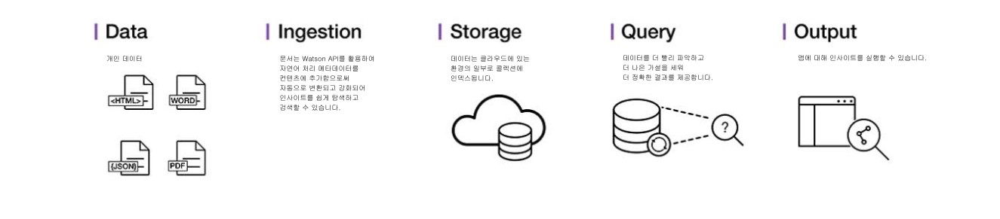

---

copyright:
  years: 2015, 2018
lastupdated: "2018-09-07"

subcollection: discovery

---

{:shortdesc: .shortdesc}
{:new_window: target="_blank"}
{:tip: .tip}
{:note: .note}
{:pre: .pre}
{:important: .important}
{:deprecated: .deprecated}
{:codeblock: .codeblock}
{:screen: .screen}
{:download: .download}
{:hide-dashboard: .hide-dashboard}
{:apikey: data-credential-placeholder='apikey'} 
{:url: data-credential-placeholder='url'}
{:curl: #curl .ph data-hd-programlang='curl'}
{:javascript: .ph data-hd-programlang='javascript'}
{:java: .ph data-hd-programlang='java'}
{:python: .ph data-hd-programlang='python'}
{:ruby: .ph data-hd-programlang='ruby'}
{:swift: .ph data-hd-programlang='swift'}
{:go: .ph data-hd-programlang='go'}

# 정보
{: #about}

{{site.data.keyword.discoveryfull}}를 통해 고유한 전용 데이터와 공용 및 서드파티 데이터를 포함하여 구조화되지 않은 데이터에 숨겨진 실행 가능한 인사이트를 잠금 해제하는 코그너티브, 클라우드 기반 탐색 애플리케이션을 빠르게 빌드할 수 있습니다.
{: shortdesc}

다음은 전체 {{site.data.keyword.discoveryshort}} 서비스 솔루션의 아키텍처입니다.

{{site.data.keyword.discoveryshort}}를 사용하여 구조화되지 않은 데이터를 준비하고 필요한 정보를 정확히 찾아내는 조회를 작성한 후 인사이트를 새 애플리케이션 또는 기존 솔루션과 통합하려면 몇 가지 단계만 수행하면 됩니다.

{{site.data.keyword.discoveryshort}}가 어떻게 수행합니까? 구조화되지 않은 데이터를 가져와서 강화하기 위해 코그너티브 직관력과 결합된 데이터 분석을 사용하면 필요한 정보를 발견할 수 있습니다.

{{site.data.keyword.discoveryfull}}는 기능상으로 풍부한 통합 및 자동화된 {{site.data.keyword.watson}} API 세트를 함께 제공하여 다음을 수행할 수 있도록 합니다.

- 데이터를 크롤링, 변환, 강화 및 정규화합니다.
- 독점적 컨텐츠와 라이센스가 부여된 무료 공용 컨텐츠를 안전하게 탐색합니다.
- {{site.data.keyword.nlushort}}(NLU)을 통해 추가 인리치먼트(예: 개념, 관계 및 감성)를 적용합니다.
- API에 대한 직접 액세스를 계속 제공하면서 개발을 단순화합니다.

언어 지원에 대한 자세한 정보는 [{{site.data.keyword.discoveryshort}} 언어 지원](/docs/services/discovery?topic=discovery-language-support#language-support)을 참조하십시오.

{{site.data.keyword.Bluemix_notm}} 보안에 대한 자세한 정보는 [{{site.data.keyword.Bluemix_notm}} 서비스 설명 ](https://www.ibm.com/software/sla/sladb.nsf/searchsaas/?searchview&searchorder=4&searchmax=0&query=%28IBM+Cloud+Service+description%29){: new_window}을 참조하십시오.

{{site.data.keyword.discoveryfull}} Knowledge Graph는 문서 전반의 엔티티 및 관계를 조회하기 위해 새 엔드포인트를 제공하는 베타 기능입니다. 여기에는 컨텍스트 기반 검색 및 관련성 순위 지정이 포함됩니다. 자세한 정보는 [{{site.data.keyword.discoveryfull}} Knowledge Graph](/docs/services/discovery?topic=discovery-kg#kg)를 참조하십시오.

## 브라우저 지원 및 전제조건
{: #browser-support-and-prerequisites}

{{site.data.keyword.Bluemix}} 전제조건 및 지원되는 브라우저의 목록은 [전제조건 ](https://cloud.ibm.com/docs/overview/prereqs.html#prereqs){: new_window}을 참조하십시오.

## Watson Discovery News
{: #wds}

코그너티브 인사이트로 사전 강화된 공용 데이터 세트인 {{site.data.keyword.discoverynewsshort}}는 {{site.data.keyword.discoveryshort}}에도 함께 포함되어 있습니다. 애플리케이션에 통합할 수 있도록 인사이트를 위한 조회에 공용이며 구조화되지 않은 이 데이터 세트를 사용할 수 있습니다. 자세한 정보는 [Watson Discovery News](/docs/services/discovery?topic=discovery-watson-discovery-news#watson-discovery-news)를 참조하십시오. [여기 ](https://discovery-news-demo.ng.bluemix.net/){: new_window}에서 {{site.data.keyword.discoverynewsshort}}를 사용하여 무엇을 빌드할 수 있는지에 대한 데모를 보십시오.

{{site.data.keyword.discoveryshort}} 서비스는 [{{site.data.keyword.Bluemix_notm}} ](https://{DomainName}/catalog/services/discovery){: new_window}에서 사용할 수 있습니다.

## Discovery 도구
{: #discovery-tooling}

{{site.data.keyword.discoveryshort}} 서비스는 전체 온라인 도구 세트인 {{site.data.keyword.discoveryshort}} 도구를 포함하여 서비스의 인스턴스를 빠르게 설정하고 데이터로 서비스의 인스턴스를 채울 수 있습니다.

{{site.data.keyword.discoveryshort}} 서비스 도구는 서비스를 구성하고 채우기 위해 API를 사용해야 하는 필요성을 제거하여 시간을 절약하도록 설계되었습니다. 이를 통해 애플리케이션 개발자는 일반 사용자가 {{site.data.keyword.discoveryshort}} 서비스를 경험하기 위한 최상의 방법을 작성하는 데 집중할 수 있습니다. {{site.data.keyword.discoveryshort}} 도구 소개는 [도구 시작하기](/docs/services/discovery?topic=discovery-getting-started#getting-started)를 참조하십시오.

## 다음 단계
{: #next-steps}

- {{site.data.keyword.discoveryshort}} 도구 또는 {{site.data.keyword.discoveryshort}} API로 시작하십시오.
    - [{{site.data.keyword.discoveryshort}} 도구 시작하기](/docs/services/discovery?topic=discovery-getting-started#getting-started)
    - [{{site.data.keyword.discoveryshort}} API 시작하기](/docs/services/discovery?topic=discovery-gs-api#gs-api)
- {{site.data.keyword.discoveryshort}} 서비스는 애플리케이션 개발을 단순화하기 위해 다수의 SDK를 지원합니다. SDK는 많은 유명한 프로그래밍 언어 및 플랫폼(예: Node.js, Java, and Python)에 사용할 수 있습니다. 모든 SDK는 GitHub의 [watson-developer-cloud namespace ](https://github.com/watson-developer-cloud){: new_window}에 있습니다.
    - SDK 전체 목록과 사용 방법에 대한 정보는 [{{site.data.keyword.watson}} SDK](https://cloud.ibm.com/docs/services/watson/getting-started-sdks.html#sdks)를 참조하십시오.
    - Node, Java 및 Python SDK의 모든 메소드에 대한 자세한 정보는 [API 참조 ](https://{DomainName}/apidocs/discovery){: new_window}를 참조하십시오.
