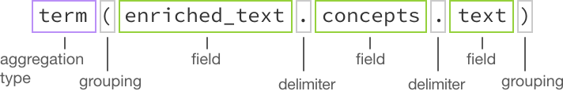

---

copyright:
  years: 2015, 2018, 2019
lastupdated: "2019-01-22"

subcollection: discovery

---

{:shortdesc: .shortdesc}
{:new_window: target="_blank"}
{:tip: .tip}
{:note: .note}
{:pre: .pre}
{:important: .important}
{:deprecated: .deprecated}
{:codeblock: .codeblock}
{:screen: .screen}
{:download: .download}
{:hide-dashboard: .hide-dashboard}
{:apikey: data-credential-placeholder='apikey'} 
{:url: data-credential-placeholder='url'}
{:curl: #curl .ph data-hd-programlang='curl'}
{:javascript: .ph data-hd-programlang='javascript'}
{:java: .ph data-hd-programlang='java'}
{:python: .ph data-hd-programlang='python'}
{:ruby: .ph data-hd-programlang='ruby'}
{:swift: .ph data-hd-programlang='swift'}
{:go: .ph data-hd-programlang='go'}

# 조회 개념
{: #query-concepts}

{{site.data.keyword.discoveryfull}} 서비스는 강력한 컨텐츠 검색 기능을 제공합니다. 컨텐츠가 {{site.data.keyword.discoveryshort}} 서비스를 통해 업로드되고 강화된 후 조회를 빌드하거나 {{site.data.keyword.discoveryshort}}를 고유한 프로젝트에 통합하거나 {{site.data.keyword.watson}} Explorer Application Builder를 사용하여 사용자 정의 애플리케이션을 작성할 수 있습니다.
{: shortdesc}

  모든 연결이 고유한 컨텐츠가 포함되므로 작성하는 조회는 콜렉션에 따라 변경됩니다.
  {: tip}

조회 또는 필터를 작성하는 경우 {{site.data.keyword.discoveryshort}}는 각 결과를 보고 정의한 경로와 일치시키려고 합니다. 일치 항목이 발생하면 결과 세트에 추가됩니다. 조회를 작성할 때 원하는 정도로 모호하거나 구체적으로 설정할 수 있습니다. 조회가 구체적일수록 좀 더 정확한 결과를 얻게 됩니다.

단락 검색을 설정할 수 있는 옵션도 있습니다. 단락은 조회로 리턴된 전체 문서에서 추출된 짧은 관련 발췌입니다. 이 대상 단락은 콜렉션에 있는 문서의 `text` 필드에서 추출됩니다. 기본적으로, 약 400자로 각각 구성된 최대 10개의 단락이 조회에 대해 리턴됩니다. 최대 세 개의 단락이 단일 결과에서 추출됩니다. `passages` 매개변수는 개인용 콜렉션에만 사용할 수 있으며, {{site.data.keyword.discoverynewsshort}} 콜렉션에는 사용할 수 없습니다. 단락 식별 방법에 대한 자세한 정보는 [단락](//docs/services/discovery?topic=discovery-query-parameters#passages)을 참조하십시오.

  {{site.data.keyword.discoveryshort}} 도구 또는 API를 사용하여 자연어 조회(예: "IBM Watson partnerships")도 작성할 수 있습니다.
  {: tip}

대부분의 경우 모든 개인용 콜렉션은 조회의 결과에 `confidence` 스코어를 리턴합니다. 자세한 사항은 [신뢰도 스코어](/docs/services/discovery?topic=discovery-improving-result-relevance-with-the-tooling#confidence)를 참조하십시오.

{{site.data.keyword.discoveryshort}}는 영어, 독일어, 프랑스어, 네덜란드어, 이탈리아어 및 포르투갈어의 경우에 특수 문자가 포함된 조회 결과를 리턴합니다. 예를 들어 `aqui`를 조회한 경우 `aqui` 및 <code>aqu&iacute;</code> 둘 다에 대한 결과를 받게 됩니다.

여러 필터와 복합 집계가 포함된 더 길고 더 복잡한 조회를 작성할 수 있습니다. 이 옵션은 API 전용으로 사용 가능하며 조회의 문자 한계를 10,000자로 늘릴 수 있습니다. 세부사항은 [긴 콜렉션 조회 ](https://{DomainName}/apidocs/discovery#long-collection-queries){: new_window} 및 [긴 환경 조회 ](https://{DomainName}/apidocs/discovery#long-environment-queries){: new_window}를 참조하십시오.

{{site.data.keyword.discoveryfull}} Knowledge Graph는 문서 전반의 엔티티 및 관계를 조회하기 위해 새 엔드포인트를 제공하는 베타 기능입니다. 여기에는 컨텍스트 기반 검색 및 관련성 순위 지정이 포함됩니다. 자세한 정보는 [{{site.data.keyword.discoveryfull}} Knowledge Graph](/docs/services/discovery?topic=discovery-kg#kg)를 참조하십시오.

조회 작성에 대한 자세한 정보는 다음을 참조하십시오.
- [조회 튜토리얼 시작하기](/docs/services/discovery?topic=discovery-getting-started-with-querying#getting-started-with-querying)
- [조회 참조](/docs/services/discovery?topic=discovery-query-reference#query-reference)({{site.data.keyword.discoveryshort}} 조회 언어에 사용 가능한 매개변수, 연산자 및 집계의 목록 포함)

## Discovery 데이터 스키마
{: #discovery-schema}

먼저 {{site.data.keyword.discoveryshort}} JSON에 대해 알아보십시오. {{site.data.keyword.discoveryshort}} 조회 언어를 사용하여 조회를 빌드하는 방법을 이해하는 데 이 조회 언어가 콜렉션의 문서를 강화한 후 {{site.data.keyword.discoveryshort}}로 생성된 JSON과 익숙해져야 합니다. 문서의 데이터 스키마에 익숙해지면 {{site.data.keyword.discoveryshort}} 조회 언어로 좀 더 쉽게 조회를 작성할 수 있습니다. 이를 수행하는 데 세 가지 방법이 있습니다.

  1. {{site.data.keyword.discoveryshort}} 도구에서 **데이터 관리** 화면을 열고 {{site.data.keyword.IBM_notm}} Press Releases에 포함된 콜렉션을 선택하십시오. **데이터 스키마 보기** 단추를 클릭하십시오. **데이터 스키마 보기** 화면은 두 가지 방법 즉, 문서(**문서 보기**) 또는 필드(**콜렉션 보기**)로 변환된 문서에서 필드 및 값을 표시합니다. 최대 50개의 문서가 **문서 보기**에 표시됩니다. **콜렉션 보기**에 전체 콜렉션의 필드가 표시됩니다.

    `enriched_text`의 **콜렉션 보기**에서 콜렉션에 적용된 인리치먼트를 검토할 수 있습니다. 콜렉션이 Watson 인사이트로 강화되는 방법을 보려면 `categories`, `concepts`, `entities` 및 `sentiment`를 클릭하십시오.

  1. JSON을 보려면 "비어 있는" 조회를 실행하십시오. **데이터 스키마 보기** 화면에서 **조회 빌드** 단추를 클릭한 후 **조회 실행**을 클릭하십시오. 결과가 두 개의 탭인 **요약**(조회 결과의 개요) 및 **JSON** 아래의 오른쪽에 표시됩니다. **JSON** 탭을 열어 시작하십시오.

     -  네 개의 각 문서 앞에는 `id` 번호가 표시됩니다.
     -  `enriched_text` 필드를 아래로 스크롤하십시오. 조회할 수 있는 JSON 필드에 대해 알아보려면 각 인리치먼트를 검토하십시오.

        

     -  **entities** - `text` 필드를 찾아 시작한 후 기타 인리치먼트 정보를 검토하십시오.
     -  **sentiment** - `label` 필드를 찾아 시작한 후 기타 인리치먼트 정보를 검토하십시오.
     -  **concepts** - `text` 필드를 찾아 시작한 후 기타 인리치먼트 정보를 검토하십시오.
     -  **categories** - `document` 필드를 찾아 시작한 후 기타 인리치먼트 정보를 검토하십시오.

     첫 번째 문서의 인사이트를 검토한 후 원하는 경우 다른 세 개의 문서를 볼 수 있습니다.

  1. **시각적 조회 빌더**에서 사용 가능한 필드를 보십시오. **조회 빌드** 화면에서 **문서 검색**을 클릭한 후 **{{site.data.keyword.discoveryshort}} 조회 언어 사용**을 클릭하십시오. 데이터의 사용 가능한 필드를 보려면 **필드** 드롭 다운을 클릭하십시오.     {{site.data.keyword.discoveryshort}} 조회 언어를 사용하여 수동으로 조회를 빌드하려면 **조회 언어로 편집**을 클릭하십시오.      

### 기본 조회를 구조화하는 방법
{: #structure-basic-query}

JSON은 계층적이므로 조회는 동일한 계층 구조를 사용하여 작성되어야 합니다. 그러므로 JSON은 다음과 같이 표시됩니다.

```json
"enriched_text": {
  "concepts": [
    {
    "text": "Cloud computing",
    "relevance": 0.610029}
    ]
  }
```
{: codeblock}

조회는 다음과 같이 구조화될 수 있습니다.


  필드(`<=` , `>=`, `<`, `>`)를 평가하는 연산자에서는 `number` 또는 `date`가 값으로 필요합니다. 값을 인용 부호로 묶으면 `string`이 됩니다. 따라서 `score>=0.5`는 유효한 조회이고 `score>="0.5"`는 그렇지 않습니다. 연산자의 전체 목록은 [조회 연산자](/docs/services/discovery?topic=discovery-query-operators#query-operators)를 참조하십시오.
  {: tip}

고려사항:

- 엔티티, 개념 또는 키워드에서 조회할 시점이 확실하지 않은 경우 [엔티티, 개념 및 키워드 간의 차이점 이해](/docs/services/discovery?topic=discovery-configservice#udbeck)를 참조하십시오.

- **참고:** **조회 실행**을 클릭하고 **JSON** 탭을 연 후 조회 강조표시가 기본적으로 설정되어 있음을 알 수 있습니다. 이를 통해 조회 결과에 `highlight` 필드가 추가됩니다. `highlight` 필드 내에 조회와 일치하는 단어는 HTML `<em>`(강조표시) 태그로 랩핑됩니다. 자세한 사항은 [조회 매개변수](/docs/services/discovery?topic=discovery-query-parameters#highlight)를 참조하십시오.

## 결합된 조회 빌드
{: #building-combined-queries}

더 많은 대상 조회를 빌드하기 위해 조회 매개변수를 함께 결합할 수 있습니다. 예를 들어, `filter` 및 `query` 매개변수를 함께 사용할 수 있습니다. 필터링 대 조회에 대한 자세한 정보는 [필터 및 조회 매개변수 간의 차이점](/docs/services/discovery?topic=discovery-query-parameters#filtervquery)을 참조하십시오.

## 집계를 구조화하는 방법
{: #structure-aggregation}

집계에서는 데이터 값의 세트(예: 상위 키워드, 엔티티의 전체 감성 등)를 리턴합니다. 집계 옵션의 전체 목록은 [집계](/docs/services/discovery?topic=discovery-query-reference#aggregations)를 참조하십시오.



이 집계 예제에서는 콜렉션에서 모든 `concepts`를 찾습니다.
이 조회의 구분 기호는 `.`이고 연산자는 `()`입니다. {{site.data.keyword.discoveryshort}} 조회 언어에 사용할 수 있는 기타 연산자에 대해 자세히 알아보려면 [조회 연산자](/docs/services/discovery?topic=discovery-query-operators#query-operators)를 참조하십시오.

### 집계 조회 예제
{: #example-aggregations}

상위 값, 총계, 분, 최대, 평균, 시분할 및 히스토그램을 포함한 {{site.data.keyword.discoverynewsshort}}로 결과를 집계할 수 있는 여러 유형의 방식이 있습니다. 또한 필터를 포함하고 집계를 중첩할 수 있습니다.

#### 필터 집계
{: #filter-aggregations}

이 집계 예제는 Pittsburgh Steelers에 대한 {{site.data.keyword.discoverynewsshort}}에 있는 기사의 수와 `positive`, `negative` 또는 `neutral` 감성이 포함된 결과의 수를 표시합니다.

- `filter(enriched_text.entities.text:"Pittsburgh Steelers").term(enriched_text.sentiment.document.label,count:3)`


이 집계 예제에서는 먼저 `twitter`의 엔티티를 포함하는 기사로만 {{site.data.keyword.discoverynewsshort}}에 있는 기사의 세트를 좁힌(필터링) 후 문서 감성 유형별로 해당 기사를 나눕니다. 상위 세 개의 문서 감성 유형(`positive`, `negative`, `neutral`)만 리턴됩니다.

- `filter(enriched_text.entities.text:twitter).term(enriched_text.sentiment.document.label,count:3)`

#### 중첩된 집계
{: #nested-aggregations}

집계 전에 `nested`를 추가하면 지정된 결과의 영역으로 집계를 제한합니다. 예를 들어, `nested(enriched_text.entities)`는 결과의 `enriched_text.entities` 컴포넌트만 집계하는 데 사용됨을 의미합니다.

다음 두 조회 간의 차이점을 살펴보면 쉽게 알 수 있습니다.
- `filter(enriched_text.entities.disambiguation.subtype::City)` - 집계는 `City` 유형으로 하나 이상의 `entity`가 포함된 *결과*의 수를 계산합니다.
- `nested(enriched_text.entities).filter(enriched_text.entities.disambiguation.subtype::City)` - 집계는 결과에서 `City` 유형으로 `entity`의 인스턴스 수를 계산합니다.  

또한 후속 오퍼레이션은 집계될 수 있는 결과 세트를 추가로 제한합니다. 예:

- `nested(enriched_text.entities).filter(enriched_text.entities.disambiguation.subtype::City)`는 `subtype::City`의 엔티티만 집계됨을 의미합니다.
- `nested(enriched_text.entities).filter(enriched_text.entities.disambiguation.subtype::City).term(enriched_text.entities.text,count:3)`은 `City` 하위 유형의 상위 세 개의 엔티티를 집계합니다.
- `filter(enriched_text.entities.disambiguation.subtype::City).term(enriched_text.entities.text,count:3)`은 결과에 `City` 하위 유형의 최소 한 개의 엔티티가 포함되는 상위 세 개의 엔티티를 리턴합니다.

## Watson Discovery News 조회
{: #querying-news}

코그너티브 인사이트로 사전 강화된 공용 데이터 세트인 {{site.data.keyword.discoverynewsshort}}는 {{site.data.keyword.discoveryshort}}에도 함께 포함되어 있습니다. 이 콜렉션에 대한 자세한 정보는 [Watson Discovery News](/docs/services/discovery?topic=discovery-watson-discovery-news#watson-discovery-news)를 참조하십시오.

자연어 조회를 사용하여 이 콜렉션을 조회할 수 있습니다(예: "IBM Watson partnerships" 또는 {{site.data.keyword.discoveryshort}} 조회 언어). 자연어 조회에 대해 자세히 알아보려면 [자연어 조회](/docs/services/discovery?topic=discovery-query-parameters#nlq)를 참조하십시오.

{{site.data.keyword.discoverynewsshort}} 구성을 조정하거나 훈련하거나 또는 {{site.data.keyword.discoverynewsshort}} 콜렉션에 문서를 추가할 수 없습니다. [여기 ](https://discovery-news-demo.ng.bluemix.net/){: new_window}에서 {{site.data.keyword.discoverynewsshort}}를 사용하여 무엇을 빌드할 수 있는지에 대한 데모를 보십시오.

영어, 한국어, 독일어, 스페인어 및 일본어 {{site.data.keyword.watson}} {{site.data.keyword.discoverynewsshort}} 콜렉션은 {{site.data.keyword.discoveryshort}} 도구와 API 모두에서 사용 가능합니다.

도구에서 {{site.data.keyword.watson}} {{site.data.keyword.discoverynewsshort}}의 기본 언어는 영어입니다. 언어를 전환하려면 먼저  아이콘을 클릭한 다음 드롭 다운에서 적절한 언어를 선택해야 합니다.

API를 통한 콜렉션 조회에 대한 정보는 [API 참조 ](https://{DomainName}/apidocs/discovery#query-your-collection){: new_window}를 참조하십시오. Watson {{site.data.keyword.discoverynewsshort}}의 영어 버전에서 `collection_id`는 `news-en`으로 표시됩니다. 이전에는 `collection_id`가 `news`였습니다. 이전 `collection_id`를 사용하고 있는 경우 계속해서 작동됩니다. 그러나 새 프로젝트의 경우 새 `collection_id`로 전환하려고 할 수 있습니다. 한국어 콜렉션의 `collection_id`는 `news-ko`이고, 스페인어 `collection_id`는 `news-es`이고, 독일어 `collection_id` 는 `news-de`이며, 일본어 `collection_id`는 `news-ja`입니다.

{{site.data.keyword.discoverynewsfull}} 조회는 `text` JSON 필드에 각 기사의 처음 50개 단어를 표시합니다.

{{site.data.keyword.watson}} {{site.data.keyword.discoverynewsshort}} 조회에 리턴되는 최대 결과 수는 `50`개입니다. `50`개 이상의 결과를 리턴하려면 추가 조회와 `offset` 매개변수를 사용하십시오.

{{site.data.keyword.discoveryshort}} 조회 언어를 사용하는 경우 {{site.data.keyword.discoverynewsshort}} 조회에서 상대 데이터 범위를 포함할 수 있습니다(예: `crawl_date>=now-1month`). 올바른 날짜 간격 값은 `second/seconds` `minute/minutes`, `hour/hours`, `day/days`, `week/weeks`, `month/months` 및 `year/years`입니다. `now`는 `time_zone` 매개변수에 영향을 받지 않습니다. `UTC` 시간대가 기본값입니다.

이 예는 특정 날짜 범위 내에서 키워드를 조회합니다. 다음과 같이 시간대 정보는 필요하지 않습니다.
- `enriched_text.keywords.text:"olympics", publication_date<=2018-02-15T00:00:00Z, publication_date>=2018-02-01T00:00:00Z`

뉴스 기사는 여러 언론 매체에 신디케이트될 수 있습니다. {{site.data.keyword.discoverynewsfull}}는 기사를 각각 선별하므로 기사가 중복됩니다. 이는 {{site.data.keyword.discoverynewsfull}}에 대한 조회가 잠재적으로 조회 결과에서 동일한 여러 기사 또는 거의 동일한 기사를 리턴할 수 있음을 의미합니다. 중복 제거를 사용하여 이를 관리할 수 있습니다. 이 베타 기능에 대해 자세히 알아보려면 [조회 결과에서 중복 문서 제외](/docs/services/discovery?topic=discovery-query-parameters#deduplication)를 참조하십시오.

## 다중 콜렉션 조회
{: #multiple-collections}

사용자의 환경에 다중 콜렉션이 있으면 이 콜렉션 전반에서 결과를 보려고 할 수 있습니다. `environments` 레벨에서 조회 메소드(`query`, `fields` 및 `notices`)를 통해 지정된 다중 콜렉션을 조회할 수 있습니다. 콜렉션 전반의 조회는 현재 {{site.data.keyword.discoveryshort}} 도구에서 사용할 수 없습니다.

`environments/{environment_id}/query` API 메소드를 사용하여 같은 환경에서 다중 콜렉션을 조회할 수 있습니다. 다중 콜렉션 전반에서 조회하는 경우 다음 사항을 고려해야 합니다.
-  이 메소드를 사용할 때 `collection_ids` 매개변수를 지정해야 합니다. `collection_ids`는 환경에서 조회할 콜렉션의 목록이며, 쉼표로 구분됩니다.
-  여러 콜렉션을 조회할 때 `passages`가 지원됩니다.
-  `collection_id`는 각 결과 오브젝트의 일부로 리턴됩니다. 이 필드는 결과를 찾은 콜렉션을 지정합니다.
-  {{site.data.keyword.discoverynewsshort}}는 `system` 환경의 일부이며 다중 콜렉션 조회에 포함될 수 없습니다.
-  개별 콜렉션 관련성 훈련은 여러 콜렉션을 조회할 때의 결과에 영향을 주지 않습니다. 여러 콜렉션을 조회할 때 리턴되는 결과의 순위를 다시 지정하려면 [Continuous Relevancy Training](/docs/services/discovery?topic=discovery-crt#crt)을 구현하십시오.
-  순위 재지정은 조회의 모든 콜렉션이 훈련된 경우에도 다중 콜렉션 조회의 일부에서 수행되지 않습니다.

자세한 정보는 [다중 콜렉션 조회 API 참조 ](https://{DomainName}/apidocs/discovery#query-documents-in-multiple-collections){: new_window}를 참조하십시오.

`environments/{environment_id}/notices` API 메소드를 사용하여 같은 환경에서 다중 콜렉션 전반의 알림을 볼 수 있습니다.
-  이 메소드를 사용할 때 `collection_ids` 매개변수를 지정해야 합니다. `collection_ids`는 환경에서 조회할 콜렉션의 목록이며, 쉼표로 구분됩니다.
-  여러 콜렉션을 조회할 때 `passages`가 지원됩니다.

자세한 정보는 [다중 콜렉션 알림 API 참조 ](https://{DomainName}/apidocs/discovery#get-collection-details){: new_window}를 참조하십시오.

`environments/{environment_id}/fields` API 메소드를 사용하여 같은 환경에서 다중 콜렉션 전반의 사용 가능한 필드를 볼 수 있습니다. 자세한 정보는 [다중 콜렉션 필드 조회 API 참조 ](https://{DomainName}/apidocs/discovery#list-fields-across-collections){: new_window}를 참조하십시오.

## 조회 확장
{: #query-expansion}

정확한 일치를 넘어서 조회의 범위를 확장할 수 있습니다. 예를 들어 {{site.data.keyword.discoveryshort}} API로 조회 확장 용어 목록을 업로드하여 "automobile" 및 "vehicle"을 포함하도록 "car"에 대한 조회를 확장할 수 있습니다. 조회 확장 용어는 보통 일반적인 용어에 대한 동의어, 반의어 또는 일반적인 맞춤법 오류입니다.

두 가지 유형의 확장을 정의할 수 있습니다.
-  **양방향** - 각 `expanded_term`이 확장된 용어를 모두 포함하도록 확장됩니다. 예를 들어 `car`에 대한 조회는 `car OR automobile OR vehicle`로 확장됩니다.
-  **단방향** - 조회의 `input_terms`는 `expanded_terms`로 대체됩니다. 예를 들어 `banana`에 대한 조회를 `plaintain` 및 `fruit`으로 확장할 수 있습니다. `input_terms`는 결과 조회의 일부로 사용되지 않습니다. 이전 `banana` 예에서는 조회 `banana`이 `plantain` 또는 `fruit`으로 변환되고 원래 용어는 포함되지 않습니다.

이 파일은 조회 확장 목록을 빌드할 때 시작점으로 사용될 수 있습니다.
<a target="_blank" href="https://watson-developer-cloud.github.io/doc-tutorial-downloads/discovery/expansions.json" download>expansions.json </a>. 이 파일을 수정하여 사용자 정의 조회 확장 목록을 작성할 수 있습니다.

양방향 예:
```JSON
 {
   "expansions": [
     {
       "expanded_terms": [
         "car",
         "automobile",
         "vehicle"
       ]
     }
   ]
 }
```
{: codeblock}

단방향 예:
```JSON
 {
   "expansions": [
     {
      "input_terms": [
        "banana"
       ],
      "expanded_terms": [
        "banana",
         "plantain",
         "fruit"
       ]
     }
   ]
 }
```
{: codeblock}

조회 확장에 대한 참고사항:

-  다중 토큰 조회 확장은 지원되지 않습니다.
-  조회 확장은 개인용 콜렉션에만 사용할 수 있습니다. 사용 가능한 `expansions` 배열 수(양방향과 단방향 배열의 총 수) 및 용어 수(`input_terms`과 `expanded_terms`를 합한 총 수)는 플랜에 따라 다릅니다. 세부사항은 [Discovery 가격 플랜](/docs/services/discovery?topic=discovery-discovery-pricing-plans#discovery-pricing-plans)을 참조하십시오. **참고:** 모든 조회 용어(`input_terms` 및 `expanded_terms` 둘 다 해당)는 각각 한 용어씩 계수됩니다. 이 예에서는 `expansions` 배열의 두 오브젝트와 일곱 개의 용어 문자열이 포함되어 있습니다.

```JSON
 {
   "expansions": [
     {
      "input_terms": [
         "ibm"
       ],
      "expanded_terms": [
         "ibm",
         "watson"
       ]
     },
     {
      "input_terms": [
         "banana"
       ],
      "expanded_terms": [
         "banana",
         "plantain",
         "fruit"
       ]
     }
   ]
 }
```
{: codeblock}

-  콜렉션당 하나의 조회 확장 목록만 업로드할 수 있습니다. 두 번째 확장 목록이 업로드되면 첫 번째 확장 목록이 대체됩니다.
-  모든 `input_terms` 및 `expanded_terms`는 소문자여야 합니다. 소문자 용어는 대문자로 확장됩니다.
-  조회 확장 목록은 JSON 형식으로 작성되어야 합니다.
-  조회 확장을 사용하지 않으려면 조회 확장 목록을 삭제하십시오.
-  현재 {{site.data.keyword.discoveryshort}} 도구를 사용하여 조회 확장 목록을 업로드하거나 삭제할 수 없습니다. {{site.data.keyword.discoveryshort}} API를 사용하여 수행해야 합니다.
-  조회 확장은 `query` 및 `multiple collection query` 메소드에서 수행됩니다. Knowledge Graph 조회에서는 조회 확장을 수행할 수 없습니다.
-  각 확장 세트는 콜렉션과 연관되어 있습니다. [여러 콜렉션](/docs/services/discovery?topic=discovery-query-concepts#multiple-collections)에서 조회하는 경우 각 콜렉션은 개별적으로 확장됩니다.
-  조회 확장은 인덱싱 중에 적용되지 않고 조회 시에 적용되므로 문서를 다시 수집할 필요 없이 조회 확장 목록을 업데이트할 수 있습니다.
-  문서를 콜렉션으로 수집하는 것과 동시에 조회 확장 목록을 업로드하거나 삭제하지 마십시오. 이렇게 하면 짧은 기간 동안 인덱스를 사용하지 못하게 될 수 있습니다.

조회 확장 파일을 업로드하고 삭제하는 API 명령에 대해서는 [조회 확장 API 참조 ](https://{DomainName}/apidocs/discovery#get-the-expansion-list){: new_window}를 참조하십시오.

## 제외어 정의
{: #stopwords}

제외어는 작은 값(예: `a, an, the`)을 추가하므로 조회에서 필터링된 단어입니다. 공통 단어를 제외어 목록에 추가하면 자연어 조회에 대한 결과의 관련성도 향상시킬 수 있습니다.  

{{site.data.keyword.discoveryshort}}는 조회 시 여러 언어에 대한 제외어의 기본 목록을 적용합니다. 그러나 기본 목록을 대체하는 제외어의 사용자 정의 목록을 정의하고 업로드할 수 있습니다. {{site.data.keyword.discoveryshort}}는 기본 또는 사용자 정의 제외어 목록을 해당 콜렉션에 지정된 언어를 기반으로 하는 개인용 콜렉션에 적용합니다.  

사용자 정의 제외어 목록은 별도의 새 `txt` 파일에 저장되어야 합니다. 사용자 정의 제외어 목록의 예는 다음과 같습니다. 

```
ibm
watson
a
an
the
what
how
when
can
should
```
이 목록에는 모든 기본 영어 제외어 <a target="_blank" href="https://watson-developer-cloud.github.io/doc-tutorial-downloads/discovery/custom_stopwords_en.txt" download>custom_stopwords_en.txt </a>가 포함되어야 합니다. 이 파일은 영어로 된 사용자 정의 제외어 목록을 빌드할 때 시작점으로 사용될 수 있습니다. 매우 일반적인 공통 용어(예: `a` 및 `the`)를 포함하지 않는 사용자 정의 제외어 목록을 작성하면 조회 성능이 저하될 수 있습니다. 그러므로 사용자 정의 제외어 목록에 해당 단어를 계속 포함시키는 것이 좋습니다. 다음은 여러 개의 기타 지원되는 언어에 대한 제외어 목록입니다. 여기에는 해당 언어에 대한 기본 제외어가 모두 포함됩니다. 

-  네덜란드어: <a target="_blank" href="https://watson-developer-cloud.github.io/doc-tutorial-downloads/discovery/custom_stopwords_nl.txt" download>custom_stopwords_nl.txt </a>.
-  프랑스어: <a target="_blank" href="https://watson-developer-cloud.github.io/doc-tutorial-downloads/discovery/custom_stopwords_fr.txt" download>custom_stopwords_fr.txt </a>.
-  독일어: <a target="_blank" href="https://watson-developer-cloud.github.io/doc-tutorial-downloads/discovery/custom_stopwords_de.txt" download>custom_stopwords_de.txt </a>. 
-  이탈리아어: <a target="_blank" href="https://watson-developer-cloud.github.io/doc-tutorial-downloads/discovery/custom_stopwords_it.txt" download>custom_stopwords_it.txt </a>.
-  일본어: <a target="_blank" href="https://watson-developer-cloud.github.io/doc-tutorial-downloads/discovery/custom_stopwords_ja.txt" download>custom_stopwords_ja.txt </a>.
-  스페인어: <a target="_blank" href="https://watson-developer-cloud.github.io/doc-tutorial-downloads/discovery/custom_stopwords_es.txt" download>custom_stopwords_es.txt </a>. 

{{site.data.keyword.discoveryshort}}에서 지원되는 언어 목록은 [언어 지원](/docs/services/discovery?topic=discovery-language-support#supported-languages)을 참조하십시오. 여러 개의 지원되는 언어에는 기본 제외어 목록이 없습니다. 

사용자 정의 제외어 목록을 업로드하고 삭제하는 API 명령에 대해서는 [제외어 API 참조 ](https://{DomainName}/apidocs/discovery#create-stopword-list){: new_window}를 참조하십시오.

제외어에 대한 참고사항:

-  현재 {{site.data.keyword.discoveryshort}} 도구를 사용하여 사용자 정의 제외어 목록을 업로드하거나 삭제할 수 없습니다. {{site.data.keyword.discoveryshort}} API를 사용하여 수행해야 합니다. [제외어 API 참조 ](https://{DomainName}/apidocs/discovery#create-stopword-list){: new_window}를 참조하십시오. 
-  사용자 정의 제외어 목록 업로드는 `Advanced` 및 `Premium` 플랜의 개인용 콜렉션에만 사용할 수 있습니다.
-  사용자 정의 제외어 목록 `txt` 파일의 크기는 백만 개의 문자로 제한됩니다. 그러나 많은 용어를 사용하여 사용자 정의 제외어 목록을 업로드하는 경우 검색 정확도에 부정적인 영향을 줄 수 있습니다. 단어 수는 언어, 문서 컨텐츠 및 선택한 단어에 따라 달라집니다. 총 `200`개 미만의 제외어 목록을 유지하는 것이 좋습니다. 
-  콜렉션당 하나의 사용자 정의 제외어 목록만 업로드할 수 있습니다. 두 번째 사용자 정의 제외어 목록이 업로드되면 첫 번째 확장 목록이 대체됩니다.
-  모든 제외어는 소문자여야 합니다. 
-  사용자 정의 제외어 목록을 사용하지 않으려면 사용자 정의 제외어 목록을 삭제하십시오. 
-  문서를 콜렉션으로 수집하는 것과 동시에 사용자 정의 제외어 목록을 업로드하거나 삭제하지 마십시오. 이렇게 하면 짧은 기간 동안 인덱스를 사용하지 못하게 될 수 있습니다.
-  제외어는 인덱스 및 조회 시간 둘 다에서 제외됩니다. 문서를 업로드하기 전에 사용자 정의 제외어 목록을 업로드하는 것이 좋습니다. 
   - 문서가 이미 기본 제외어를 사용하여 인덱싱된 후 사용자 정의 제외어 목록을 추가하는 경우 새 제외어는 계속해서 인덱스에 포함됩니다. 해당 경우 이러한 새 제외어가 포함된 조회는 조회 시 필터링합니다. 
   - 사용자가 예전에 제외어였던 단어를 검색하지만 제외어가 사용자 정의 제외어 목록에서 제거된 경우 용어가 인덱스 시 제거되었으므로 원래의 제외어와 일치하는 문서를 찾지 않습니다. 이 문제를 수정하려면 문서가 업데이트된 사용자 정의 제외어 목록을 사용하여 인덱싱되도록 콜렉션의 문서를 삭제하고 모든 문서를 다시 업로드하십시오. 
-  각 제외어 세트는 콜렉션과 연관되어 있습니다. 여러 콜렉션에서 조회하는 경우 각 콜렉션은 해당 콜렉션과 연관된 사용자 정의 제외어 목록을 사용합니다. 
- 사용자 정의 제외어 모록에 대한 중요 변경사항을 수행하는 경우 문서가 업데이트된 사용자 정의 제외어 목록을 사용하여 인덱싱되도록 콜렉션의 문서를 삭제하고 모든 문서를 다시 업로드하십시오. 

## 사용자 정의 토큰화 사전 작성
{: #tokenization}

토큰화는 토큰이라는 단위로 텍스트를 분리합니다. 표준 토큰화 사전이 콜렉션에 적용되지만 사용자 정의 토큰화 사전을 업로드하여 도메인 또는 언어에 대한 검색 정확도를 향상시킬 수 있습니다. 사용자 정의 사전이 표준 사전을 대체합니다. {{site.data.keyword.discoveryshort}} API를 사용하여 사전을 업로드할 수 있습니다. 

토큰화 파일을 업로드하고 삭제하는 API 명령에 대해서는 [토큰화 API 참조 ](https://{DomainName}/apidocs/discovery#create-tokenization-dictionary){: new_window}를 참조하십시오. 

**참고:** 이 기능은 현재 일본어 콜렉션에서만 사용할 수 있습니다. 

아래 예에서 **text**는 해당하는 경우 토큰화되는 구문이며 **tokens**는 **text**가 분리되는 단어입니다(개별적으로 정의되어야 함). **판독값**은 다른 문자 세트로 표현되는 토큰 버전을 나열하고 **part_of_speech**는 토큰이 나타내는 언어의 일부입니다.

이 사용자 정의 사전을 사용하여 텍스트 `ネコ`를 검색하는 경우 검색 결과에는 `ネコ`만 포함된 텍스트 뿐 아니라 `すしネコ`가 있는 텍스트도 포함됩니다.

```
{ "tokenization_rules":
  [
     {
      "text":"すし",
      "tokens":[
        "すし"
      ],
      "readings":[
        "寿司"
      ],
      "part_of_speech":"カスタム名詞"
    },
    {
      "text":"ネコ",
      "tokens":[
        "ネコ"
      ],
      "readings":[
        "ネコ"
      ],
      "part_of_speech":"カスタム名詞"
    }
```

이 사용자 정의 사전을 사용하여 단일 토큰으로 규칙을 작성할 수 있습니다. 이 예에서 `ibm発見`은 단일 토큰으로 토큰화되므로 더 작은 단위로 분리되지 않습니다.

```
{ "tokenization_rules":
  [
    {
      "text":"ibm発見",
      "tokens":[  
      "ibm発見"
      ],
      "readings":[  
      "ibm発見"
      ],
      "part_of_speech":"カスタム名 詞"
    },
    ...
  ]
}
```

-  토큰화는 인덱스 및 조회 시간 둘 다에서 발생합니다.
-  토큰은 개별적으로 정의되어야 합니다.
-  표준 토큰화 사전은 모든 콜렉션에서 사용됩니다. 콜렉션이 해당 사전으로 이미 인덱싱된 경우 사용자 정의 토큰화 사전을 업로드한 후 해당 콜렉션에서 문서를 다시 수집해야 합니다.
-  토큰화 사전 업로드는 `Advanced` 및 `Premium` 플랜의 개인용 콜렉션에만 사용할 수 있습니다. 
-  콜렉션당 하나의 토큰화 사전만 업로드할 수 있습니다. 두 번째 토큰화 사전이 업로드되면 첫 번째 사전이 대체됩니다. 해당 콜렉션에 이미 문서가 포함된 경우 새 사용자 정의 토큰화 사전을 적용하려면 문서를 다시 수집해야 합니다.
-  사용자 정의 토큰화 사전은 JSON 형식으로 기록되어야 합니다. 파일 이름 예: `custom_tokenization_dictionary.json`
-  모든 사용자 정의 토큰화 사전 용어는 소문자여야 합니다.
-  토큰화를 사용하지 않으려면 토큰화 사전을 삭제하고 문서를 다시 수집하십시오.
-  현재 {{site.data.keyword.discoveryshort}} 도구를 사용하여 토큰화 사전을 업로드하거나 삭제할 수 없습니다. {{site.data.keyword.discoveryshort}} API를 사용하여 수행해야 합니다.
-  토큰화는 `query` 및 `multiple collection query` 메소드에서 수행됩니다. Knowledge Graph 조회에서는 토큰화를 수행할 수 없습니다.
-  각 토큰화 사전은 콜렉션과 연관되어 있습니다. [여러 콜렉션](/docs/services/discovery?topic=discovery-query-concepts#multiple-collections)에서 조회하는 경우 각 콜렉션은 개별적으로 토큰화됩니다.
-  문서를 콜렉션으로 수집하는 것과 동시에 토큰화 사전을 업로드하거나 삭제하지 마십시오. 

## 문서 유사성
{: #doc-similarity}

문서 유사성 조회는 현재 표시되는 문서와 유사한 다른 문서를 찾습니다. 예를 들어 콜 센터 운영자는 제품 매뉴얼을 보고 문서 유사성을 사용하여 유사한 특성을 가진 다른 문서를 찾을 수 있습니다. `similar.document_ids`로 유사한 문서를 조회할 수 있으며 추가 `similar.fields`를 지정하여 선택적으로 유사성을 세분화할 수 있습니다.

문서 유사성은 원래 문서에서 가장 관련성이 높은 25개의 용어를 추출한 다음 유사한 관련 용어를 사용하여 문서를 검색하여 판별됩니다.

다음은 `similar.document_ids`를 사용한 조회 예입니다(여러 개의 `similar.document_ids`를 지정하는 경우 쉼표 뒤에 공백이 없어야 함).

`curl -u "apikey":"{apikey_value}" "https://gateway.watsonplatform.net/discovery/api/v1/environments/{environment_id}/collections/{collection_id}/query?version=2017-11-07&similar.document_ids=4107b6f1-5d3f-4bea-bbcf-fb05bbf960b1,6057k6d1-7d7k-6aeh-cfbb-kj98ssf786c2"`

다음은 `similar.fields`를 추가한 조회 예입니다.

`curl -u "apikey":"{apikey_value}" "https://gateway.watsonplatform.net/discovery/api/v1/environments/{environment_id}/collections/{collection_id}/query?version=2017-11-07&similar.document_ids=4107b6f1-5d3f-4bea-bbcf-fb05bbf960b1&similar.fields=title&return=title&count=100"`

자세한 정보는 [문서 유사성 API 참조 ](https://{DomainName}/apidocs/discovery#query-your-collection){: new_window} 및 [조회 매개변수](/docs/services/discovery?topic=discovery-query-parameters#similar)를 참조하십시오.
