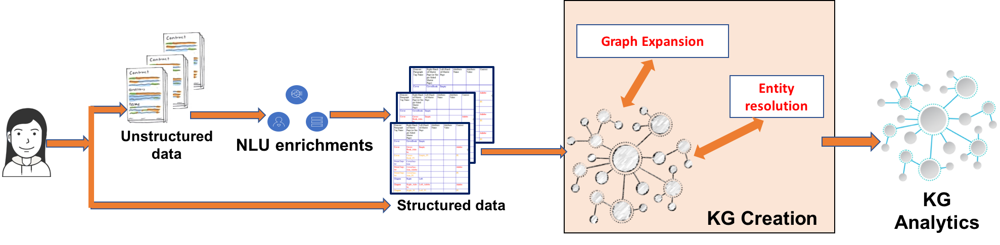

---

copyright:
  years: 2015, 2017
lastupdated: "2017-12-15"

---

{:shortdesc: .shortdesc}
{:new_window: target="_blank"}
{:tip: .tip}
{:pre: .pre}
{:codeblock: .codeblock}
{:screen: .screen}
{:javascript: .ph data-hd-programlang='javascript'}
{:java: .ph data-hd-programlang='java'}
{:python: .ph data-hd-programlang='python'}
{:swift: .ph data-hd-programlang='swift'}

# Watson Discovery Knowledge Graph

Os gráficos do Knowledge vão além de dados e informações por fazer conexões em seus dados em documentos e gerar novos conhecimentos. Nós fornecemos a tecnologia de AI que cria automaticamente gráficos de conhecimento customizados de dados não estruturados extraindo e desambiguizando relacionamentos e entidades, enriquecendo os relacionamentos usando técnicas de algoritmo e classificando os resultados usando algoritmos de relevância. Os gráficos do Knowledge podem funcionar como o "hub de conhecimento" para sua empresa e podem ser usados para procura corporativa, resumo, mecanismos de recomendação e outros processos de tomada de decisão, por exemplo, detecção de fraude, desperdício ou abuso. O uso de um modelo customizado (criado no
{{site.data.keyword.knowledgestudioshort}}) no processo de criação do Knowledge Graph, pode ajudar a construir KGs específicos de domínio com aplicabilidade em domínios, como financeiro, tecnologia, segurança, inteligência, assistência médica e muitos outros.

Dois novos terminais da foram incluídos no {{site.data.keyword.discoveryfull}}, fornecendo a capacidade para procurar por entidades desambiguas e relações enriquecidas nos documentos em coleções de documentos não estruturados. Os resultados da procura podem ser classificados por ordem de relevância ou
de popularidade. Além de um token de procura, as APIs podem usar palavras de contexto ou passagens opcionais que localizam entidades e relações mais relevantes dentro do grande gráfico de conhecimento criado automaticamente.

 A figura a seguir mostra como o Knowledge Graph se encaixa no pipeline atual do {{site.data.keyword.discoveryfull}}. O {{site.data.keyword.nlushort}} enriquece documentos com entidades e documentos no nível de documento individual. Durante a criação do Knowledge Graph, técnicas implícitas (automáticas) de resolução de entidade e de expansão de gráfico são usadas para criar automaticamente um gráfico conectado de entidades e relações em documentos. Além da criação do Knowledge Graph, o serviço de análise de dados do Knowledge Graph inclui técnicas de classificação de relevância para retornar resultados.



Este gráfico conectado de técnicas de conhecimento e de classificação fornece:

-  Entidades desambiguas usando um token de procura difusa, informações de tipo (opcional) e contexto (opcional). Exemplo: a procura por `Steve` no contexto de `Apple` retorna `Steve Jobs` na parte superior, enquanto que a procura por `Steve` no contexto de `Microsoft` retorna `Steve Ballmer` na parte superior.
-  Relacionamentos classificados por relevância inserindo o token de procura difusa e o contexto (opcional). A classificação de relevância utiliza as propriedades globais do gráfico para obter informações mais específicas. Exemplo: a procura por relacionamentos de `Obama` no contexto de `health` retorna `Affordable Care Act` e outras entidades relacionadas.
-  As inferências e agregações em documentos consultando entidades e relacionamentos em um gráfico de conhecimento conectado. Alguns exemplos desse tipo são: como uma pessoa X se conectou à pessoa Y? Qual é o grau de diferença dos padrões de acesso a dados do funcionário X da norma? Qual é a esfera de
influência da pessoa X?

## Requisitos de Serviço

Durante a liberação beta, a funcionalidade do Knowledge Graph e os métodos associados a ele estão disponíveis somente para instâncias de serviço que estejam inscritas no plano **Avançado**.

## Requisitos de coleção

O {{site.data.keyword.discoveryshort}} usa Entidades e Relacionamentos extraídos de documentos alimentados para formar o Knowledge Graph e permitir consultas de entidade e de relacionamento.

**Nota:** o Knowledge Graph pode ser usado somente em coleções de dados privados, ele não foi projetado para uso com o {{site.data.keyword.discoverynewsshort}}.

Para usar o Knowledge Graph, sua coleção deve ser configurada para atender a requisitos específicos como segue:

-  Os enriquecimentos `entities` e `relations` devem ser especificados para os campos que utilizarão o Knowledge Graph e cada enriquecimento deve usar o mesmo modelo customizado. Se o modelo público for necessário, ele deverá ser especificado na forma de um modelo
customizado `model="en-news"`.

-  Os enriquecimentos `relations` devem ser especificados como segue:
   ```json
   "relations": {
     "model": "en-news"
   }
   ```
   {: codeblock}

-  O enriquecimento `entities` deve ser especificado como segue e os parâmetros `mentions`, `mentions_types` e `sentence_locations` também devem ser especificados: 
   ```json
   "entities": {
     "mentions": true,
     "mention_types": true,
     "sentence_locations": true,
     "model": "en-news"
    }
    ```
    {: codeblock}

   Outras opções de `enrichments` opcionais, como `"sentiment": true`, também podem ser especificadas, se desejado.

Essas opções não podem ser incluídas usando o conjunto de ferramentas do {{site.data.keyword.discoveryshort}} e uma configuração customizada deve ser transferida por upload usando a API. Uma cópia da configuração padrão modificada para enriquecer o campo `text` para que a coleção possa ser usada com o gráfico de conhecimento com o modelo público está disponível [aqui](https://raw.githubusercontent.com/watson-developer-cloud/doc-tutorial-downloads/master/discovery/config-default-kg.json).

Depois de criar uma instância de serviço do {{site.data.keyword.discoveryshort}}, crie uma configuração customizada como segue: 

1. Emita o seguinte comando para criar um ambiente chamado `my-first-environment`. 
Substitua `{username}` e `{password}` pelas suas credenciais de serviço:

   ```bash
   curl -X POST -u "{username}":"{password}" -H "Content-Type: application/json" -d '{ "name":"my-first-environment", "description":"exploring environments"}' "api/v1/environments?version=2017-11-07"
   ```
   {: pre}
   The API returns information such as your environment ID, environment status, and how much storage your environment is using.
   You will need the `{environment_id}` that is returned.
1. Next, create the custom configuration. This procedure assumes that you are uploading the one found [here](https://raw.githubusercontent.com/watson-developer-cloud/doc-tutorial-downloads/master/discovery/config-default-kg.json). 
If you want to build your own custom configuration, see the  [configuration reference](/docs/services/discovery/custom-config.html).
   ```bash
   curl -X PUT -u "{username}":"{password}" -H "Content-Type: application/json" -d config-default-kg.json
"https://gateway.watsonplatform.net/discovery/api/v1/environments/{environment_id}/configurations?version=2017-11-07"
   ```
   {: pre}
1. After the custom configuration has been uploaded it can be used in any collection that you create, any method to upload documents can be used as long as the custom configuration is specified. If you are unfamiliar with creating collections and uploading documents, see [Getting started with the tooling](/docs/services/discovery/getting-started-tool.html). When you get to [step 3](/docs/services/discovery/getting-started-tool.html#create-custom-configuration) select `Knowledge Graph Configuration` instead of creating a new configuration.
## Entities queries
{: #entities}

In the beta release of the Knowledge Graph entity queries supports
context-based entity disambiguation. Based on the entity text provided and optional context text, disambiguation identifies unique entities and returns a list of the entities ranked based on the context information. A Knowledge Graph entity query is performed by `POST`ing a `JSON` object to the `v1/environments/{environment_id}/collections/{collection_id}/query_entities` endpoint.
You can query entities using the API, or with the {{site.data.keyword.discoveryshort}} tooling. See [Querying Knowledge Graph using the Discovery tooling](/docs/services/discovery/building-kg.html#querying-kg) for tooling information.
The Knowledge Graph entity query JSON object takes the following form:
```json
{
  "feature": "disambiguate",
  "entity": {
    "text": "Steve",
    "type": "Person"
  },
  "context": {
    "text": "iphone"
  }, "count": 10
}
```
{: codeblock}

-  `"feature": string` _required_ - the entity query feature to be used, must be `disambiguate`.
-  `"entity": {}` _required_ - an object that contains the entity information to disambiguate.
   -  `"text": string` _required_ - the entity text that will be disambiguated
   -  `"type": string` _optional_ - the optional entity type to disambiguate against, if not specified, all types are included.
-  `"context": {}` _optional_ - an optional object that includes contextual requirements for the disambiguation.
   -  `"text": string` _optional_ - entity text to provide context for the queried entity and rank based on that association. For example, if you wanted to query the city of London in England your query would look for `London` with the context of `England`. A entrada pode ser nomes parciais ou passagens grandes contendo termos de entidade relevantes. Múltiplos termos podem ser passados juntos.
-  `"count": INT` _optional_ - The number of disambiguated entities to return. The default is `10`. The maximum is `1000`

The query returns results of the following form:

```json
{
  "entities": [ {
      "text": "Steve Jobs",
      "type": "PERSON"
    },
    {
      "text": "Steve Wozniak",
      "type": "PERSON"
    }
  ]
}
```
{: codeblock}

Se nenhuma correspondência for localizada, o objeto JSON a seguir será retornado:

```json
{
  "entities": []
}
```
{: codeblock}

## Relations queries
{: #relations}

Knowledge Graph relations queries supports finding most relevant
relationships based on input entities using implicit entity disambiguation, context based relationships,
sorting by relevance score and mention count, and filtering by types and document ids.
You can query relations using the API, or with the {{site.data.keyword.discoveryshort}} tooling. See [Querying Knowledge Graph using the Discovery tooling](/docs/services/discovery/building-kg.html#querying-kg) for tooling information.

A Knowledge Graph entity query is performed by `POST`ing a `JSON` object to the  `v1/environments/{environment_id}/collections/{collection_id}/query_relations` endpoint. The Knowledge Graph relations query JSON object takes the following form:

```json
{
  "entities": [ {
      "text": "Steve Jobs",
      "type": "PERSON",
      "exact": true
    }
  ],
  "context": {
    "text": "iphone"
  },
  "sort": "score",
  "filter": {
    "relation_types": {
      "exclude": ["colocation"],
      "include": ["locatedAt", "employedBy", "managerOf", "founderOf"]
    },
    "entity_types": {
      "exclude": ["EVENT"],
      "include": ["PERSON", "GPE", "ORGANIZATION"]
    },
    "document_ids": ["b95df4c1-d00f-4771-abb2-a52baea0444a", "ad340635-bf3e-47a5-bea5-5e778f600c32"]
  }, "count": 10
}
```
{: codeblock}

-  `"entities": []` _required_ - an array that contains the entities that relationships will be queried. All neighbor relationships are returned if only one entity object is defined. When more than one entity object is defined, mutual pairwise relations are returned. Mutual pairwise relations return the direct relations between the input entities rather than the relations with all entity neighbors. Each entity object contains:
   -  `"text": string` _required_ - the entity text.
   -  `"type": string` _optional_ - the optional entity type. This field is required if `"exact"` is `true`.
   -  `"exact": boolean` _optional_ - If `false`, implicit disambiguation is performed. Implicit disambiguation will use the top one disambiguated entity for each input entity object. The default is `false`.
-  `"context": {}` _optional_ - an optional object that includes contextual requirements.
   -  `"text": string` _optional_ - Entity text to provide context for the queried entity and rank based on that association. For example, if you wanted to query the city of London in England your query would look for `London` with the context of `England`. A entrada pode ser nomes parciais ou passagens grandes contendo termos de entidade relevantes. Múltiplos termos podem ser passados juntos.
-  `"sort": string` _optional_ - the sorting method for the relationships, can be `score` or `frequency`. The default is `score`. `score` is based on relevance of relations and neighbors to the input entity and relevance to context if context is provided. `frequency` is the number of unique times each relation is identified.
-  `"filter": {}` _optional_ - an object containing the relation types, entity types, and specific documents to filter by for this query. By default nothing is excluded.
   -  `"relation_types": {}` _optional_ a list of relation types to filter.
      -  `"exclude": []` _optional_ a comma separated list of relation types to exclude from the query.
      -  `"include": []` _optional_ a comma separated list of relation types explicitly include in the query. Se especificado, todos os outros tipos são considerados excluídos.
   -  `"entity_types": {}` _optional_ a list of entity types to filter neighbors. Not applicable for multi entities input because no new neighbor is returned.
      -  `"exclude": []` _optional_ a comma separated list of entity types to exclude from the query.
      -  `"include": []` _optional_ a comma separated list of entity types explicitly include in the query. Se especificado, todos os outros tipos são considerados excluídos.
   -  `"document_ids": []` _optional_ a comma separated list of documents on which to perform the relationship query on.
-  `"count": INT` _optional_ The number of relations to return. The default is `10`. The maximum is `1000`.

The query returns results in the following form:

```json
{
  "relations": [ {
      "type": "FOUNDEROF",
      "frequency": 7,
      "arguments": [
        {
          "entities": [ {
              "type": "PERSON",
              "text": "Steve Jobs"
            }
          ]
        },
        {
          "entities": [ {
              "type": "ORGANIZATION",
              "text": "Apple"
            }
          ]
        }
      ]
    }
  ]
}
```
{: codeblock}

In each object in the relationship array, an arguments array is returned containing a pair of entities arrays, the first being the source or subject and the second being the target or object of the relationship.

If no match is found, the following JSON object is returned:

```json
{
  "relations": []
}
```
{: codeblock}

## Querying Knowledge Graph using the Discovery tooling
{: #querying-kg}

Those with service instances subscribed to the [**Advanced**](/docs/services/discovery/building-kg.html#service-requirements) plan can query private collections with Knowledge Graph using the {{site.data.keyword.discoveryshort}} tooling.  

To access Knowledge Graph querying in the {{site.data.keyword.discoveryshort}} tooling:

1.  Click <!-- {width="20" height="20" style="padding-left:5px;padding-right:5px;"} --> to open the query page.
1.  Select your collection and click **Get started**.
1.  On the **Build queries** screen, choose the **Knowledge graph** tab, then **Entities** or **Relationships**.
