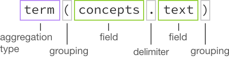

---

copyright:
  years: 2015, 2017
lastupdated: "2017-08-31"

---

{:shortdesc: .shortdesc}
{:new_window: target="_blank"}
{:tip: .tip}
{:pre: .pre}
{:codeblock: .codeblock}
{:screen: .screen}
{:javascript: .ph data-hd-programlang='javascript'}
{:java: .ph data-hd-programlang='java'}
{:python: .ph data-hd-programlang='python'}
{:swift: .ph data-hd-programlang='swift'}

# Archives do Discovery

Esse tópico contém informações sobre os recursos do {{site.data.keyword.discoveryshort}} que
ainda podem estar disponíveis, mas que foram substituídos por opções mais recentes.
{: tip}

## Enriquecimentos AlchemyLanguage
{: #AlchemyLanguage-enrichments}

A partir de **18 de julho de 2017**, o {{site.data.keyword.discoveryfull}}
introduziu uma nova tecnologia de enriquecimento chamada {{site.data.keyword.nlushort}}.  Esses enriquecimentos são iguais aos seus enriquecimentos existentes, mas exigem uma configuração e um esquema ligeiramente diferentes. 
Os enriquecimentos originais, chamados enriquecimentos do {{site.data.keyword.alchemylanguageshort}},
serão descontinuados e o suporte terminará em **15 de janeiro de 2018**.

A sequência de versão da API `2017-10-16` descontinua o suporte
para upload de novos documentos em coleções existentes enriquecidas com o
{{site.data.keyword.alchemylanguageshort}} e para
criação de novas coleções e o aprimoramento delas com enriquecimentos
{{site.data.keyword.alchemylanguageshort}}.
Use uma sequência de versões da API anterior para continuar usando o {{site.data.keyword.alchemylanguageshort}} até que o suporte seja encerrado em **15 de janeiro de 2018**.

As coleções existentes enriquecidas com o AlchemyLanguage devem ser migradas para os
enriquecimentos do Natural Language Understanding o mais breve possível. Para obter informações sobre como migrar coleções e arquivos de configuração que utilizam os enriquecimentos do{{site.data.keyword.alchemylanguageshort}}, consulte [Migrando enriquecimentos para o {{site.data.keyword.nlushort}}](/docs/services/discovery/migrate-nlu.html).

**Nota:** como o conjunto de ferramentas do
{{site.data.keyword.discoveryshort}} sempre usa a sequência de versão da API mais recente, então,
iniciando com a sequência de versão da API `2017-10-16`, não será mais possível fazer upload
de documentos para coleções do {{site.data.keyword.alchemylanguageshort}} existentes ou criar novas
coleções aprimoradas com os enriquecimentos do {{site.data.keyword.alchemylanguageshort}} com o
conjunto de ferramentas do {{site.data.keyword.discoveryshort}}.
Se você deseja continuar usando o conjunto de ferramentas do Discovery para enriquecer coleções, migre suas
coleções para primeiramente para o Natural Language Understanding.
Consulte [Migrando enriquecimentos para {{site.data.keyword.nlushort}}](/docs/services/discovery/migrate-nlu.html) para obter detalhes.

### Extração de Entidade (AlchemyLanguage)
{: #entity-extraction-al}

Retorna itens como pessoas, lugares e organizações presentes no texto de entrada. Extração de entidade inclui conhecimento semântico ao conteúdo para ajudar a entender o assunto e o contexto do texto que está sendo analisado. 
As técnicas de extração de entidade são baseadas em algoritmos estatísticos sofisticados e em tecnologia de
processamento de linguagem natural e são exclusivas no segmento de mercado com seu apoio para análise
multilíngue, desambiguação contextual e extração de citações.

Parte exemplo de um documento enriquecido com a Extração de entidade:

```json
{
      "text": "Os acionistas ficaram satisfeitos com o fato de a Acme Corporation planejar a construção de uma nova fábrica em Atlanta, Georgia.", "enriched-text": {
        "status": "OK",
        "language": "english",
        "entities": [
          {
            "type": "City",
            "relevance": 0.532754,
            "sentiment": {
              "type": "positive",
              "score": 0.527541,
              "mixed": false
            },
            "count": 1,
            "text": "Atlanta",
            "disambiguated": {
              "subType": [
                "AdministrativeDivision", "GovernmentalJurisdiction", "OlympicHostCity", "PlaceWithNeighborhoods"
              ], "name": "Atlanta", "website": "http://www.atlantaga.gov/", "dbpedia": "http://dbpedia.org/resource/Atlanta", "freebase": "http://rdf.freebase.com/ns/m.013yq" }
          }
        ]
      }
    }
```
{: codeblock}
No exemplo anterior, seria possível consultar o tipo de entidade, acessando `enriched_text.entities.type`

`sentiment` é calculado para tipos de entidade, mesmo que o enriquecimento **sentiment** não seja selecionado. Para saber mais sobre a análise de sentimentos, consulte [Análise de sentimentos](/docs/services/discovery/discovery-auxiliary.html#sentiment-analysis-al).

A pontuação de `relevance` variará de `0.0` a `1.0`. Quanto maior a pontuação, mais relevante a entidade. 
O campo `disambiguated` contém as informações de desambiguação para a entidade, que
incluem informações da entidade `subType` e links para um ou mais recursos, se
aplicável. A `count` é o número de vezes que a entidade é mencionada no documento.

### Extração de Palavra-chave (AlchemyLanguage)
{: #keyword-extraction-al}

Tópicos importantes em seu conteúdo que são usados, geralmente, ao indexar dados, ao gerar nuvens de tags ou ao fazer uma procura. O serviço do {{site.data.keyword.discoveryshort}} identifica automaticamente idiomas suportados em seu conteúdo de entrada e, em seguida, identifica e classifica palavras-chave nesse conteúdo.

Parte exemplo de um documento com a Extração de palavra-chave:

```json
{
    "text": "Os acionistas ficaram satisfeitos com o fato de a Acme Corporation planejar a construção de uma nova fábrica em Atlanta, Georgia.", "enriched-text": {
        "status": "OK",
        "language": "english",
        "keywords": [
          {
            "relevance": 0.66497,
            "sentiment": {
              "score": 0.527541,
              "type": "positive",
              "mixed": false
            },
            "text": "stockholders"
          }
        ]
      }
    }
```
{: codeblock}

No exemplo anterior, seria possível consultar o texto de palavra-chave, acessando `enriched_text.keywords.text`

`sentiment` é calculado para palavras-chave, mesmo que o enriquecimento **sentiment** não seja selecionado. Para saber mais sobre a análise de sentimentos, consulte [Análise de sentimentos](/docs/services/discovery/discovery-auxiliary.html#sentiment-analysis-al).

A pontuação de `relevance` variará de `0.0` a `1.0`. Quanto maior a pontuação, mais relevante a palavra-chave.

### Classificação de Taxonomia (AlchemyLanguage)
{: #taxonomy-classification-al}

Categoriza texto de entrada, HTML ou conteúdo baseado na web em uma taxonomia hierárquica de até cinco
níveis de profundidade. Os níveis mais profundos permitem classificar o conteúdo em subsegmentos mais precisos e úteis.

Exemplo de parte de um documento enriquecida com Classificação de Taxonomia:

```json
  {
    "text": "Os acionistas ficaram satisfeitos com o fato de a Acme Corporation planejar a construção de uma nova fábrica em Atlanta, Georgia.", "enriched-text": {
        "status": "OK",
        "language": "english",
        "taxonomy": [
          {
            "label": "/business and industrial/company/merger and acquisition",
            "score": 0.517533,
            "confident": false
          }
        ]
      }
    }
```
{: codeblock}

No exemplo anterior, é possível consultar o rótulo de taxonomia acessando
`enriched_text.taxonomy.label`

O `label` é a categoria de taxonomia detectada. Os níveis de hierarquia são separados por barras. A `score` para essa categoria variará de `0.0` a `1.0`. Quanto maior a pontuação, maior a confiança nessa categoria.

### Identificação de Conceito (AlchemyLanguage)
{: #concept-tagging-al}

Identifica conceitos com os quais o texto de entrada está associado, com base em outros conceitos e entidades presentes nesse texto. A identificação de conceitos compreende como os conceitos se relacionam e podem identificar conceitos que não são referenciados diretamente no texto. Por exemplo, se um artigo menciona CERN e o boson Higgs, as funções da API Concepts identificarão o Large Hadron Collider como o conceito, mesmo que o termo não seja mencionado explicitamente na página. A identificação de conceitos permite uma análise de nível superior de conteúdo de entrada do que apenas a identificação básica de palavras-chave.

Parte exemplo de um documento enriquecido com a Identificação de conceito:

```json
{
    "text": "Os acionistas ficaram satisfeitos com o fato de a Acme Corporation planejar a construção de uma nova fábrica em Atlanta, Georgia.", "enriched_text": {
        "status": "OK",
        "language": "english",
        "concepts": [
          {
            "text": "Acme Corporation",
            "relevance": 0.91136,
            "dbpedia": "http://dbpedia.org/resource/Acme_Corporation",
            "freebase": "http://rdf.freebase.com/ns/m.0dndy",
            "yago": "http://yago-knowledge.org/resource/Acme_Corporation"
          }
        ]
      }
    }
```
{: codeblock}

No exemplo anterior, seria possível consultar o tipo de texto de conceito, acessando `enriched_text.concepts.text`

A pontuação de `relevance` variará de `0.0` a `1.0`. Quanto maior a pontuação, mais relevante o conceito. Os links para os recursos são fornecidos, se aplicável.

### Extração de Relação (AlchemyLanguage)
{: #relation-extraction-al}

Identifica relações de assunto, de ação e de objeto dentro de sentenças no conteúdo de entrada. As informações de relação podem ser usadas para identificar automaticamente sinais de compra, eventos-chave e outras ações importantes.

Parte exemplo de um documento enriquecido com a Extração de relação:

```json
{
      "text": "Os acionistas ficaram satisfeitos com o fato de a Acme Corporation planejar a construção de uma nova fábrica em Atlanta, Georgia.", "enriched-text": {
        "status": "OK",
        "language": "english",
        "relations": [
          {
            "sentence": " The stockholders were pleased that Acme Corporation plans to build a new factory in Atlanta, GA.",
            "subject": {
              "text": "The stockholders", "keywords": [ {
                  "text": "stockholders" }
              ]
            }, "action": {
              "text": "were",
              "lemmatized": "be",
              "verb": {
              "text": "be",
              "tense": "past"
            }
            },
            "object": {
              "text": "pleased that Acme Corporation plans to build a new factory in Atlanta, GA",
              "sentiment": {
                "type": "positive",
                "score": 0.834516,
                "mixed": false
              },
              "entities": [
                {
                  "type": "Company", "text": "Acme Corporation"
                },
                {
                  "type": "City",
                  "text": "Atlanta",
                  "disambiguated": {
                    "subType": [
                      "AdministrativeDivision", "GovernmentalJurisdiction", "OlympicHostCity", "PlaceWithNeighborhoods"
                    ], "name": "Atlanta", "website": "http://www.atlantaga.gov/", "dbpedia": "http://dbpedia.org/resource/Atlanta", "freebase": "http://rdf.freebase.com/ns/m.013yq" }
                },
                {
                  "type": "StateOrCounty",
                  "text": "GA"
                }
              ],
              "keywords": [
                {
                  "text": "Acme Corporation"
                },
                {
                  "text": "new factory"
                },
                {
                  "text": "GA"
                },
                {
                "text": "Atlanta"
                }
              ]
            }
          }
        ]
      }
    }
```
{: codeblock}

No exemplo anterior, seria possível consultar o texto do assunto de relação, acessando `enriched_text.relations.subject.text`

`sentiment` é calculado para relações, mesmo que o enriquecimento **sentiment** não seja relacionado. Para saber mais sobre a análise de sentimentos, consulte [Análise de sentimentos](/docs/services/discovery/discovery-auxiliary.html#sentiment-analysis-al). Ele não extrairá `entities` ou `keywords` (como mostrado no exemplo) a menos que você também selecione os enriquecimentos **entidade** e **palavra-chave**. 
Consulte [Extração de
Entidades](/docs/services/discovery/discovery-auxiliary.html#entity-extraction-al) e
[Extração de
Palavras-chave](/docs/services/discovery/discovery-auxiliary.html#keyword-extraction-al) para obter mais informações sobre esses enriquecimentos.

O `subject`, a `action` e o `object` são extraídos para cada sentença que contém uma relação.

### Análise de Sentimentos (AlchemyLanguage)
{: #sentiment-analysis-al}

Identifica atitude, opiniões ou sentimentos no conteúdo que está sendo analisado. O serviço do {{site.data.keyword.discoveryshort}} pode calcular o sentimento geral dentro de um documento, o sentimento para objetivos especificados pelo usuário, o sentimento de nível de entidade, o sentimento de nível de cotação, o sentimento direcional e o sentimento de nível de palavra-chave. A combinação desses recursos suporta uma variedade de casos de uso que vão do monitoramento de mídia social à análise de tendências.

Parte exemplo de um documento enriquecido com a Análise de sentimentos:

```json
{
      "text": "Os acionistas ficaram satisfeitos com o fato de a Acme Corporation planejar a construção de uma nova fábrica em Atlanta, Georgia.", "enriched_text": {
        "status": "OK",
        "language": "english",
        "docSentiment": {
          "type": "positive",
          "score": 0.0966252,
          "mixed": true
        }
      }
    }
```
{: codeblock}

No exemplo anterior, é possível consultar o tipo docSentiment acessando
`enriched_text.docSentiment.type`

O `type` é a impressão geral do documento (`positive`,
`negative` ou `neutral`). A impressão `type` é baseada no
`score`; uma pontuação de `0,0` indica que o documento é
`neutral`, um número positivo indica que o documento é `positive` e um número
negativo indica que o documento é `negative`. Se `mixed` é `true`, ele indica que o documento contém impressões positivas e negativas (esse campo não é determinado pelo `score`).

### Análise de Emoção (AlchemyLanguage)
{: #emotion-analysis-al}

Detecta raiva, nojo, medo, alegria e tristeza implícitas no texto em inglês. A Análise de emoção pode detectar emoções associadas a frases, entidades ou palavras-chave específicas ou pode analisar o tom emocional geral do seu conteúdo.

Parte exemplo de um documento enriquecido com a Análise de emoção:

```json
{
      "text": "Os acionistas ficaram satisfeitos com o fato de a Acme Corporation planejar a construção de uma nova fábrica em Atlanta, Georgia.", "enriched_text": {
        "status": "OK",
        "language": "english",
        "docEmotions": {
          "anger": "0.077394",
          "disgust": "0.044024",
          "fear": "0.092664",
          "joy": "0.553327",
          "sadness": "0.3969"
        }
      }
    }
```
{: codeblock}

No exemplo anterior, é possível consultar o docEmotion `joy` acessando
`enriched_text.docEmotions.joy`

A Análise de emoção analisa seu texto e calcula uma pontuação para cada emoção (raiva, nojo, medo, alegria, tristeza) em uma escala de `0.0` a `1.0`. Se a pontuação de qualquer emoção for `0.5` ou superior, então essa emoção foi detectada (quanto maior a pontuação acima de `0.5`, maior a relevância). No fragmento exibido, `joy` possui uma pontuação acima de 0,5, então o {{site.data.keyword.watson}} detectou alegria.


## Watson Discovery News Original

Uma nova versão do {{site.data.keyword.discoverynewsfull}} lançada em **31 de julho de 2017**. {{site.data.keyword.discoverynewsfull}} Original foi retirado com uma remoção da data de serviço de **15 de janeiro de 2018**. Consulte [Watson Discovery News](watson-discovery-news.html) para obter informações sobre esta nova versão.

O {{site.data.keyword.discoverynewsfull}} Original é um conjunto de dados de fontes de notícias
principalmente em inglês que é atualizado continuamente, com cerca de 300.000 novos artigos e blogs
incluídos diariamente. Este conjunto de dados indexado é pré-aprimorado com os seguintes
enriquecimentos do {{site.data.keyword.alchemylanguageshort}}: **Extração de
Palavra-chave**, **Extração de Entidade**, **Identificação
de Conceito**, **Extração de Relação**, **Análise de
Sentimentos** e **Classificação de Taxonomia**. Os seguintes metadados adicionais também são incluídos: data de crawl, data de publicação, classificação de URL, classificação de host e texto âncora. A procura histórica está disponível para os últimos 60 dias de dados de notícias.

O {{site.data.keyword.discoverynewsfull}} Original é aprimorado com
enriquecimentos do {{site.data.keyword.alchemylanguageshort}}. Para obter mais informações sobre esses
enriquecimentos, consulte
[Enriquecimentos
do {{site.data.keyword.alchemylanguageshort}}](discovery-auxiliary.html#AlchemyLanguage-enrichments).

### Consultando Watson Discovery News Original

Uma nova versão do {{site.data.keyword.discoverynewsfull}} lançada em **31 de julho de 2017**. {{site.data.keyword.discoverynewsfull}} Original foi retirado com uma remoção da data de serviço de **15 de janeiro de 2018**. Consulte [Watson Discovery News](watson-discovery-news.html) para obter informações sobre esta nova versão.

**Observação:** o número máximo de resultados retornados para uma consulta do Watson Discovery News é `50`. Use as consultas adicionais e o parâmetro `offset` para retornar mais do que `50` resultados.

O {{site.data.keyword.discoverynewsfull}} Original usa um esquema JSON semelhante, mas um pouco
diferente daquele usado para coleções privadas. Não é necessário incluir `enriched_text` em
suas consultas, por exemplo:

**Como estruturar uma consulta do {{site.data.keyword.discoverynewsfull}} Original **


A consulta de exemplo a seguir retorna os 10 principais artigos no
{{site.data.keyword.discoverynewsfull}} original sobre o Pittsburgh Steelers que possui uma impressão
positiva.

1.  Na tela **Gerenciar dados**, escolha a
coleção do {{site.data.keyword.discoverynewsfull}}.
1.  Clique em **Visualizar esquema de dados**, em seguida, clique em **Construir consultas**.
1.  Em **Procura por documentos**, clique em **Usar o
{{site.data.keyword.discoveryshort}} Query Language** e, em seguida,
insira `text:Pittsburgh Steelers, docSentiment.type:positive` no campo **Insira
a consulta aqui**.
1.  Clique em **Mais opções**, em seguida, insira `10` (esse é o
padrão) no campo `Número de documentos a serem retornados`.
1.  Clique em **Executar consulta**. Os 10 principais artigos sobre o Pittsburgh
Steelers com uma impressão positiva são exibidos.

**Exemplo de consultas adicionais do {{site.data.keyword.discoverynewsfull}} Original**

-  `concepts.text:"Health care"` - em **Procurar por documentos**, clique em **Usar o {{site.data.keyword.discoveryshort}} Query Language** e, em seguida, insira essa consulta. Ele retorna todos os artigos que incluem o conceito
de `health care`. Se você especificar uma contagem, como 50, no campo **Número de documentos a serem retornados**, você receberá apenas os 50 principais artigos mais relevantes.

**Como estruturar uma agregação do {{site.data.keyword.discoverynewsfull}} Original**



A agregação de exemplo a seguir retorna o número de artigos localizados no {{site.data.keyword.discoverynewsfull}} Original sobre o Pittsburgh Steelers por impressão.

1.  Na tela **Gerenciar dados**, escolha a coleção {{site.data.keyword.discoverynewsfull}} Original.
1.  Clique em **Visualizar esquema de dados**, em seguida, clique em **Construir consultas**.
1.  Em **Incluir análise de seus resultados**, insira
`filter(text:"Pittsburgh Steelers").term(docSentiment.type,count:3)` no campo **Gravar
uma consulta de agregação usando o {{site.data.keyword.discoveryshort}} Query Language**.
1.  Clique em **Mais opções**, em seguida, insira `0` no campo **Número de documentos a serem retornados**.
1.  Clique em **Executar consulta**. Os resultados mostram o número de documentos
sobre o Pittsburgh Steelers e quantos desses resultados têm um docSentiment de `positive`,
`negative` ou `neutral`.

**Exemplo de agregação adicional do
{{site.data.keyword.discoverynewsfull}} Original**

-  `filter(entities.text:twitter).term(docSentiment.type,count:3)` - se você
inserir esta consulta de agregação no campo **Gravar uma consulta de agregação usando o
{{site.data.keyword.discoveryshort}} Query Language**, primeiramente ele limitará
(filtrará) a conjunto de artigos para somente aqueles que incluem o texto de entidades do Twitter e, em
seguida, dividirá os arquivos pelos tipos de impressão do documento. Somente os três principais tipos de
impressão do documento (`positive`, `negative`, `neutral`)
são retornados.

A inclusão de `nested` antes de uma consulta de agregação restringe a agregação para
a área dos resultados especificados. Por exemplo: `nested(text.entities)` significa que
apenas os componentes `text.entities` de qualquer resultado são usados para agregação.
Esse efeito pode ser visto facilmente observando as diferenças entre as duas consultas a seguir:
`filter(text.entities.type::City)` - a agregação conta o número de *Resultados*
que contêm uma ou mais `entity` com o tipo `City` e
`nested(text.entities).filter(text.entities.type::City)` - a agregação conta o número de
instâncias de uma `entity` com o tipo `City` nos resultados.  Além disso, qualquer operação subsequente restringirá ainda mais o conjunto de resultados que pode ser agregado. 
Por exemplo, `nested(text.entities).filter(text.entities.type::City)` significa que
somente entidades de `type::City` serão agregadas. Por exemplo:
`nested(text.entities).filter(text.entities.type::City).term(text.entities.text,count:3)`
agregará as três principais entidades do tipo `City` e
`filter(text.entities.type::City).term(text.entities.text,count:3)` retornará as três
principais entidades enquanto o resultado contém pelo menos uma entidade do tipo `City`.

**Nota**: não é possível ajustar a configuração do
{{site.data.keyword.discoverynewsfull}} Original, treinar ou incluir documentos nessa coleção.

## Integrando-se com o Watson Knowledge Studio usando enriquecimentos do AlchemyLanguage

É possível integrar um modelo customizado do {{site.data.keyword.knowledgestudiofull}} com o
serviço do {{site.data.keyword.discoveryshort}} para fornecer enriquecimentos customizados.
{: shortdesc}

### Antes de Começar

Antes de ser possível integrar um modelo customizado de {{site.data.keyword.knowledgestudioshort}} com o serviço do {{site.data.keyword.discoveryshort}}, deve-se criar e implementar o modelo usando o{{site.data.keyword.knowledgestudioshort}}. 
Consulte a documentação do {{site.data.keyword.knowledgestudioshort}} para obter informações sobre a
criação e a implementação dos modelos. É necessário ter o ID exclusivo do modelo implementado para integrá-lo com o serviço do {{site.data.keyword.discoveryshort}}.

### Sobre essa Tarefa

É possível usar um modelo customizado desenvolvido no {{site.data.keyword.knowledgestudioshort}}
para enriquecer documentos no serviço do {{site.data.keyword.discoveryshort}}.
Isso fornece a flexibilidade para aplicar os recursos de aprimoramento de documento do serviço do {{site.data.keyword.discoveryshort}} com informações específicas para áreas de foco particular, como indústria ou disciplina científica. É possível usar dados públicos e seus próprios dados proprietários em seu modelo de enriquecimento.

Deve-se usar a API de serviço para integrar um modelo
do {{site.data.keyword.knowledgestudioshort}}
com o serviço do {{site.data.keyword.discoveryshort}}.
Não é possível usar o conjunto de ferramentas do {{site.data.keyword.discoveryshort}} para
integrar um modelo customizado.

### Procedimento

1.  Obtenha o ID de seu ambiente do {{site.data.keyword.discoveryshort}} conforme descrito em [Lista de ambientes](https://www.ibm.com/watson/developercloud/discovery/api/v1/#list_environments){: new_window}. Observe o ID de ambiente.
1.  Liste os IDs de sua configuração ou configurações atuais do {{site.data.keyword.discoveryshort}} conforme descrito em [Lista de configurações ](https://www.ibm.com/watson/developercloud/discovery/api/v1/#list_configurations){: new_window} Observe o ID da configuração que você deseja integrar ao seu modelo customizado do {{site.data.keyword.knowledgestudiofull}}.
1.  Faça download de uma cópia de sua configuração atual do {{site.data.keyword.discoveryshort}} executando os comandos a seguir em um shell bash ou equivalente, tal como Cygwin for Windows. Substitua `{environment_id}` e `{configuration_id}` pelos IDs que você anotou nas duas etapas anteriores.

    ```bash
    curl -u "{username}":"{password}" "https://gateway.watsonplatform.net/discovery/api/v1/environments/{environment_id}/configurations/{configuration_id}?version=2017-09-01" > my_config.json
    ```
    {: pre}

    Esse comando lista o conteúdo do seu arquivo de coleção e os coloca em um arquivo JSON chamado `my_config.json`.
1.  Abra o arquivo `my_config.json` em um editor de texto e faça as seguintes mudanças:
    1.  Mude o valor do campo `"name"` para algo que indica o propósito da nova configuração. É possível mudar opcionalmente o valor do campo `"description"` também.

        ```json
        ...
        "name": "wks-config",
        "description": "This is a configuration to use with a WKS model",
        ...
        ```
        {: codeblock}

    1.  Atualize os campos de enriquecimento com informações para o modelo do {{site.data.keyword.knowledgestudioshort}}. Assumindo que os campos de enriquecimento originalmente leram:

        ```json
        "enrichments": [ {
            "destination_field": "enriched_text", "source_field": "text", "enrichment": "alchemy_language", "options": {
              "extract": "keyword, entity, doc-sentiment, taxonomy, concept, relation",
              "sentiment": true,
              "quotations": true
            }
          }
        ]
        ```
        {: codeblock}

    1.  Atualize o arquivo da seguinte maneira, substituindo o ID exclusivo do modelo do {{site.data.keyword.knowledgestudioshort}} descrito em "Antes de iniciar" por `{watson_knowledge_studio_model_ID}`.

        ```json
        "enrichments": [ {
            "destination_field": "enriched_text", "source_field": "text", "enrichment": "alchemy_language", "options": {
              "extract": "keyword, entity, doc-sentiment, taxonomy, concept, relation, typed-rels", "sentiment": true, "quotations": true, "model": "{watson_knowledge_studio_model_ID}" }
          }
        ]
        ```
        {: codeblock}

1.  Opcionalmente, ative a normalização de entidade conforme descrito em [Criando uma configuração personalizada para normalizar entidades](/docs/services/discovery/normalize-entities.html).
1.  Salve o arquivo `my_config.json`.
1.  Use um validador JSON, como [JSLint ](http://jslint.com){: new_window} para validar e, se necessário, corrija seu JSON editado antes de executar as próximas etapas.
1.  Atualize a configuração conforme a seguir. Você precisa novamente dos IDs `{environment_id}` e `{configuration_id}` coletados no início deste procedimento.

    ```bash
    curl -X PUT -u "{username}":"{password}" -H "Content-Type: application/json" -d @my_config.json "https://gateway.watsonplatform.net/discovery/api/v1/environments/{environment_id}/configurations/{configuration_id}?version=2017-09-01"
    ```
    {: pre}

    O comando retorna o conteúdo do arquivo de configuração atualizado.
1.  Use o serviço do {{site.data.keyword.discoveryshort}} normalmente. Os documentos que você alimenta com a configuração atualizada são enriquecidos automaticamente com os dados do seu modelo customizado.

## Criando uma configuração customizada para normalizar as entidades AlchemyLanguage
{: #normalizing-entities}

É possível configurar o serviço do {{site.data.keyword.discoveryshort}} para incluir *entidades normalizadas*, também conhecidas como *nomes canônicos*, na saída de suas consultas.
{: shortdesc}

**Nota:** a edição da configuração para ativar entidades normalizadas é uma
tarefa manual que deve ser executada usando um editor de texto e chamadas API. Ela não é suportada atualmente
pelo Tooling.

**Nota:** a normalização de entidade está disponível apenas ao usar o serviço do Discovery com um modelo customizado gerado pelo Watson Knowledge Studio, conforme descrito em [Integrando-se com o {{site.data.keyword.knowledgestudiofull}}](/docs/services/discovery/integrate-wks.html).

A normalização da entidade insere nomes normalizados (canônicos) para referências diferentes para a mesma pessoa ou objeto no documento de origem. 
Por exemplo, se você ativar a normalização de entidade e, em seguida, alimentar um documento ou documentos que
discute "J.R. Cash" e "John R. Cash," a saída processada incluirá o `canonical_name` "Johnny
Cash" juntamente com cada termo correspondente. Ela também incluirá nomes canônicos relevantes para outras entidades de texto encontradas no documento. Consulte o término desta seção para obter a saída de exemplo.

Depois de aprimorar um documento com nomes canônicos, é possível procurar mais facilmente por itens específicos com o mesmo nome canônico.

Os nomes canônicos são derivados de um dicionário público. Se um nome canônico apropriado não puder ser localizado no dicionário, o serviço usará a referência de entidade mais adequada no documento como o nome canônico. Antes de consultar um documento normalizado da entidade para um ou mais nomes canônicos,
examine o documento JSON enriquecido para verificar se o nome ou nomes canônicos gerados pelo serviço correspondem aos nomes que você espera.

### Procedimento

1.  Obtenha o ID de seu ambiente do {{site.data.keyword.discoveryshort}} conforme descrito em [Lista de ambientes](https://www.ibm.com/watson/developercloud/discovery/api/v1/#list_environments){: new_window}. Observe o ID de ambiente.
1.  Liste os IDs de sua configuração ou configurações atuais do
{{site.data.keyword.discoveryshort}},
conforme descrito em
[Listar
configurações do ](https://www.ibm.com/watson/developercloud/discovery/api/v1/#list_configurations){: new_window}. 
Anote o ID da configuração que você deseja atualizar.
1.  Faça download de uma cópia de sua configuração atual do {{site.data.keyword.discoveryshort}} executando os comandos a seguir em um shell bash ou equivalente, tal como Cygwin for Windows. Substitua `{environment_id}` e `{configuration_id}` pelos IDs que você anotou nas duas etapas anteriores.

    ```bash
    curl -u "{username}":"{password}" "https://gateway.watsonplatform.net/discovery/api/v1/environments/{environment_id}/configurations/{configuration_id}?version=2017-09-01" > new_config.json
    ```
    {: pre}

    Esse comando lista o conteúdo de seu arquivo de coleção e o coloca em um arquivo JSON denominado `new_config.json`.

1.  Abra o arquivo `new_config.json` em um editor de texto e faça as mudanças a seguir:
    1. Mude o valor do campo `"name"` para algo que indica o propósito da nova configuração. É possível mudar opcionalmente o valor do campo `"description"` também.

       ```json
        ...
        "name": "normalize-entities-config",
        "description": "This configuration enables entity normalization",
        ...
       ```
       {: codeblock}

    1. Atualize os campos de enriquecimento com informações para o modelo do {{site.data.keyword.knowledgestudioshort}}. Assumindo que os campos de enriquecimento originalmente leram:

       ```json
       "enrichments": [ {
           "destination_field": "enriched_text", "source_field": "text", "enrichment": "alchemy_language", "options": {
             "extract": "keyword, entity, doc-sentiment, taxonomy, concept, relation, typed-rels", "sentiment": true, "quotations": true, "model": "{watson_knowledge_studio_model_ID}" }
         }
       ]
       ```
       {: codeblock}

    1. Atualize o arquivo como segue.

       ```json
       "enrichments": [ {
           "destination_field": "enriched_text", "source_field": "text", "enrichment": "alchemy_language", "options": {
             "extract": "keyword, entity, doc-sentiment, taxonomy, concept, relation, typed-rels",
             "sentiment": true,
             "quotations": true,
             "model": "{watson_knowledge_studio_model_ID}"
             "normalizeEntities": 1
           }
         }
       ]
       ```
       {: codeblock}

    1. Salve o arquivo `new_config.json`.

1.  Use um validador JSON, como [JSLint ](http://jslint.com){: new_window}, para validar seu JSON editado antes de executar as próximas etapas.

1.  Atualize a configuração conforme a seguir. Você precisa novamente dos IDs `{environment_id}` e `{configuration_id}` coletados no início deste procedimento.

    ```bash
    curl -X PUT -u "{username}":"{password}" -H "Content-Type: application/json" -F configuration-@new_config.json "https://gateway.watsonplatform.net/discovery/api/v1/environments/{environment_id}/configurations/{configuration_id}?version=2017-09-01"
    ```
    {: pre}

    O comando retorna o conteúdo do arquivo de configuração atualizado.

1.  Use o serviço do {{site.data.keyword.discoveryshort}} normalmente. Os documentos que você alimenta com a configuração atualizada são automaticamente enriquecidos com entidades normalizadas, conforme mostrado nos trechos de saída a seguir.

### Exemplos de saída

Fragmento de saída **sem** `"normalizeEntities": 1`:

```json
{
  "enriched_text": {
  ...
  ...
  ...
    "entity_relations": {
      "entities": {
        "entity": [ {
            "class": "SPC", "eid": "-E0", "generic": false, "level": "NAM", "mentref": [ {
                "mid": "-M0", "text": "J.R. Dinheiro"
              },
              {
                "mid": "-M6", "text": "musician"
              },
              {
                "mid": "-M7", "text": "who"
              },
              {
                "mid": "-M13", "text": "He"
              },
              {
                "mid": "-M20", "text": "He" }
            ],
            "score": 0.7874817061794613,
            "subtype": "OTHER",
            "type": "PERSON"
          },
        ...
        ...
        ...
        ]
      }, "relations": {
        "relation": [ {
            "rel_entity_arg": [ {
                "argnum": 1, "eid": "-E0"
              },
              {
                "argnum": 2, "eid": "-E1" }
            ], "relmentions": {
              "relmention": [ {
                  "class": "SPECIFIC", "modality": "ASSERTED", "rel_mention_arg": [ {
                      "argnum": 1,
                      "mid": "-M0",
                      "text": "John R. Cash",
                    },
                    {
                      "argnum": 2,
                      "mid": "-M1",
                      "text": "country"
                    }
                  ], "rmid": "-R1-1", "score": 0.49918343781296, "tense": "UNSPECIFIED" }
              ]
            }, "rid": "-R1", "subtype": "OTHER", "type": "knownAs"
          },
          ...
          ...
          ...
        ]
      }
    }
  }
}
```
{: codeblock}

Fragmento de saída **com** `"normalizeEntities": 1`:

```json
{
  "enriched_text": {
  ...
  ...
  ...
    "entity_relations": {
      "entities": {
        "entity": [ {
            "class": "SPC", "eid": "-E0", "generic": false, "level": "NAM", "mentref": [ {
                "mid": "-M0", "text": "J.R. Dinheiro"
              },
              {
                "mid": "-M6", "text": "musician"
              },
              {
                "mid": "-M7", "text": "who"
              },
              {
                "mid": "-M13", "text": "He"
              },
              {
                "mid": "-M20", "text": "He" }
            ],
            "score": 0.7874817061794613,
            "subtype": "OTHER",
            "type": "PERSON",
            "canonical_name": "Johnny Cash"
          },
        ...
        ...
        ...
        ]
      }, "relations": {
        "relation": [ {
            "rel_entity_arg": [ {
                "argnum": 1, "eid": "-E0"
              },
              {
                "argnum": 2, "eid": "-E1" }
            ], "relmentions": {
              "relmention": [ {
                  "class": "SPECIFIC", "modality": "ASSERTED", "rel_mention_arg": [ {
                      "argnum": 1,
                      "mid": "-M0",
                      "text": "John R. Cash",
                      "canonical_name": "Johnny Cash"
                    },
                    {
                      "argnum": 2,
                      "mid": "-M1",
                      "text": "country",
                      "canonical_name": "country music"
                    }
                  ], "rmid": "-R1-1", "score": 0.49918343781296, "tense": "UNSPECIFIED" }
              ]
            }, "rid": "-R1", "subtype": "OTHER", "type": "knownAs"
          },
          ...
          ...
          ...
        ]
      }
    }
  }
}
```
{: codeblock}
