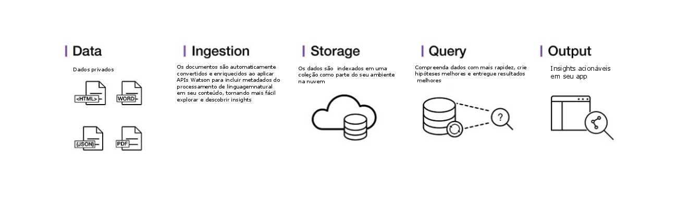

---

copyright:
  years: 2015, 2018
lastupdated: "2018-09-07"

subcollection: discovery

---

{:shortdesc: .shortdesc}
{:new_window: target="_blank"}
{:tip: .tip}
{:note: .note}
{:pre: .pre}
{:important: .important}
{:deprecated: .deprecated}
{:codeblock: .codeblock}
{:screen: .screen}
{:download: .download}
{:hide-dashboard: .hide-dashboard}
{:apikey: data-credential-placeholder='apikey'} 
{:url: data-credential-placeholder='url'}
{:curl: #curl .ph data-hd-programlang='curl'}
{:javascript: .ph data-hd-programlang='javascript'}
{:java: .ph data-hd-programlang='java'}
{:python: .ph data-hd-programlang='python'}
{:ruby: .ph data-hd-programlang='ruby'}
{:swift: .ph data-hd-programlang='swift'}
{:go: .ph data-hd-programlang='go'}

# Sobre
{: #about}

O {{site.data.keyword.discoveryfull}} permite construir rapidamente aplicativos de
exploração cognitivos baseados em nuvem que desbloqueiam insights acionáveis ocultos em dados não estruturados,
incluindo seus próprios dados proprietários, bem como dados públicos e de terceiros.
{: shortdesc}

Essa é a arquitetura de uma solução de serviço completa do {{site.data.keyword.discoveryshort}}:

Com o {{site.data.keyword.discoveryshort}}, apenas algumas etapas são necessárias para preparar
seus dados não estruturados, criar uma consulta que identifique as informações que você precisa e, em seguida, integrar
esses insights em sua solução de aplicativo nova ou existente.

Como o {{site.data.keyword.discoveryshort}} faz isso? Usando análise de dados em combinação com
intuição cognitiva para obter seus dados não estruturados e enriquecê-los para que seja possível descobrir as
informações que você precisa.

O {{site.data.keyword.discoveryfull}} reúne um conjunto completo de funcionalidade de APIs
integradas e automatizadas do {{site.data.keyword.watson}} para:

- Efetuar Crawl, converter, enriquecer e normalizar dados.
- Explorar de modo seguro seu conteúdo proprietário, bem como conteúdo público livre e
licenciado.
- Aplicar enriquecimentos adicionais, como conceitos, relações e impressão por meio
do {{site.data.keyword.nlushort}} (NLU).
- Simplificar o desenvolvimento enquanto ainda fornece acesso direto às APIs.

Para obter informações sobre o suporte ao idioma, consulte [Suporte ao idioma do {{site.data.keyword.discoveryshort}}](/docs/services/discovery?topic=discovery-language-support#language-support).

Para obter informações sobre a segurança do {{site.data.keyword.Bluemix_notm}}, veja a [Descrição do serviço do {{site.data.keyword.Bluemix_notm}} ](https://www.ibm.com/software/sla/sladb.nsf/searchsaas/?searchview&searchorder=4&searchmax=0&query=%28IBM+Cloud+Service+description%29){: new_window}

{{site.data.keyword.discoveryfull}} Knowledge Graph é um recurso beta que fornece novos terminais para consultas de entidades e de relações entre documentos. Isso inclui buscas baseadas em contexto e classificação de relevância. Consulte [{{site.data.keyword.discoveryfull}} Gráfico de conhecimento](/docs/services/discovery?topic=discovery-kg#kg) para obter mais informações.

## Suporte do navegador e pré-requisitos
{: #browser-support-and-prerequisites}

Para a lista de pré-requisitos e de navegadores suportados do {{site.data.keyword.Bluemix}}, consulte [Pré-requisitos ](https://cloud.ibm.com/docs/overview/prereqs.html#prereqs){: new_window}.

## Watson Discovery News
{: #wds}

{{site.data.keyword.discoverynewsshort}}, um conjunto de dados públicos que foi pré-enriquecido com insights cognitivos, também está incluído com o {{site.data.keyword.discoveryshort}}. É possível utilizar este conjunto de dados públicos e não estruturados para consultar insights que podem ser integrados aos seus aplicativos. Consulte [Watson Discovery News](/docs/services/discovery?topic=discovery-watson-discovery-news#watson-discovery-news) para obter mais informações. Veja uma demonstração do que você pode construir com o {{site.data.keyword.discoverynewsshort}} [aqui ](https://discovery-news-demo.ng.bluemix.net/){: new_window}.

O serviço {{site.data.keyword.discoveryshort}} está disponível em [{{site.data.keyword.Bluemix_notm}} ](https://{DomainName}/catalog/services/discovery){: new_window}

## Conjunto de ferramentas de descoberta
{: #discovery-tooling}

O serviço do {{site.data.keyword.discoveryshort}} inclui um conjunto completo de ferramentas on-line, o conjunto de ferramentas do {{site.data.keyword.discoveryshort}}, para ajudá-lo a configurar rapidamente uma instância do serviço e preenchê-la com dados.

O conjunto de ferramentas do serviço do {{site.data.keyword.discoveryshort}} foi projetado para economizar tempo eliminando a necessidade de usar as APIs para configurar e preencher seu serviço. Isso permite que seus desenvolvedores de aplicativos se concentrem na criação de maneiras valiosas para que os usuários finais experimentem o serviço do {{site.data.keyword.discoveryshort}}. Consulte [Introdução ao conjunto de ferramentas](/docs/services/discovery?topic=discovery-getting-started#getting-started) para obter uma introdução ao conjunto de ferramentas do {{site.data.keyword.discoveryshort}}.

## Próximos passos
{: #next-steps}

- Comece com o conjunto de ferramentas do {{site.data.keyword.discoveryshort}} ou com a API do {{site.data.keyword.discoveryshort}}:
    - [ Introdução ao conjunto de ferramentas do  {{site.data.keyword.discoveryshort}}  ](/docs/services/discovery?topic=discovery-getting-started#getting-started)
    - [ Introdução à API do  {{site.data.keyword.discoveryshort}}  ](/docs/services/discovery?topic=discovery-gs-api#gs-api)
- O serviço {{site.data.keyword.discoveryshort}} suporta vários SDKs para simplificar o desenvolvimento de aplicativos. Os SDKs estão disponíveis para muitas linguagens de programação e plataformas populares, incluindo Node.js, Java e Python. Todos os SDKs estão disponíveis no [watson-developer-cloud namespace ](https://github.com/watson-developer-cloud){: new_window} no GitHub.
    - Para obter uma lista completa de SDKs e informações sobre como usá-los, consulte [{{site.data.keyword.watson}} SDKs](https://cloud.ibm.com/docs/services/watson/getting-started-sdks.html#sdks).
    - Para obter informações detalhadas sobre todos os métodos dos SDKs Node, Java e Python, veja a [Referência da API ](https://{DomainName}/apidocs/discovery){: new_window}.
