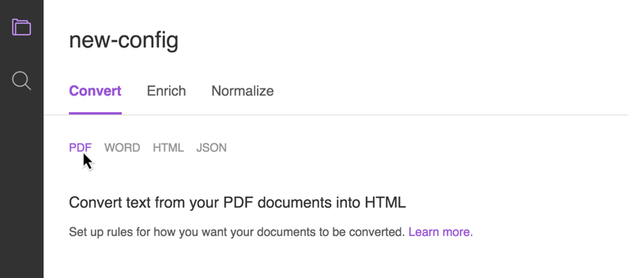

---

copyright:
  years: 2015, 2017
lastupdated: "2017-12-15"

---

{:shortdesc: .shortdesc}
{:new_window: target="_blank"}
{:tip: .tip}
{:pre: .pre}
{:codeblock: .codeblock}
{:screen: .screen}
{:javascript: .ph data-hd-programlang='javascript'}
{:java: .ph data-hd-programlang='java'}
{:python: .ph data-hd-programlang='python'}
{:swift: .ph data-hd-programlang='swift'}

# 配置服务

通过构建 {{site.data.keyword.discoveryshort}} 服务，可以扩充您自己的数据，然后以可查询的形式交付这些数据，从而获得有用的见解。
{: shortdesc}

向 {{site.data.keyword.discoveryshort}} 服务添加自己的内容之前，应该先将该服务配置为按您所需的方式处理内容。

第一步是配置服务的基本参数（[准备服务以用于处理文档](/docs/services/discovery/building.html#preparing-the-service-for-your-documents)），这包括创建环境以及在该环境中创建一个或多个集合。创建集合时，将自动提供一组缺省值（[缺省配置](/docs/services/discovery/building.html#the-default-configuration)）。如果您对这些缺省值感到满意，那么可以继续上传内容（[添加内容](/docs/services/discovery/adding-content.html)）。

但是，您很可能希望指定一个或多个定制配置（请参阅[需要定制配置时](/docs/services/discovery/building.html#when-you-need-a-custom-configuration)）。对于这种情况，您需要执行以下操作：

-   识别一些样本内容（可代表文件的文档）
-   上传内容（[上传样本文档](/docs/services/discovery/building.html#uploading-sample-documents)）
-   调整转换过程（[转换样本文档](/docs/services/discovery/building.html#converting-sample-documents)）
-   定义扩充项（[添加扩充项](/docs/services/discovery/building.html#adding-enrichments)）
-   规范化结果（[规范化数据](/docs/services/discovery/building.html#normalizing-data)）

    创建定制配置后，可以上传文档（[添加内容](/docs/services/discovery/adding-content.html)）。

## 准备服务以用于处理文档
{: #preparing-the-service-for-your-documents}

在 {{site.data.keyword.discoveryshort}} 服务中，上传的内容会存储在属于您环境的集合中。您必须先创建环境和集合，然后才能上传内容。

-   **环境** - 环境用于定义您有多少存储空间量可用来保存 {{site.data.keyword.discoveryshort}} 服务中的内容。针对每个 {{site.data.keyword.discoveryshort}} 服务实例最多可以创建一个环境。

    如果您有多个套餐（Lite、标准和高级）可供选择，请参阅 [{{site.data.keyword.discoveryshort}} 目录 ](https://console.ng.bluemix.net/catalog/services/discovery/){: new_window} 以获取详细信息。源文件不会计入文件大小限制。

-   **集合** - 集合是环境中内容的分组。必须至少创建一个集合才能上传内容。

    集合由您的专用数据组成，而且 {{site.data.keyword.discoveryshort}} 还包含预扩充的公共数据集 {{site.data.keyword.discoverynewsshort}}。可以将其用于查询见解（例如：新闻警报、事件检测和新闻中的趋势主题），然后可以将这些见解集成到应用程序中。

    {{site.data.keyword.discoverynewsshort}} 是已使用认知见解进行预扩充的公共数据集，并且随附于 {{site.data.keyword.discoveryshort}} 中。请参阅 [Watson Discovery News](/docs/services/discovery/watson-discovery-news.html#watson-discovery-news) 以获取更多信息。不能调整 {{site.data.keyword.discoverynewsshort}} 配置或向此集合添加文档。请在[此处 ](https://discovery-news-demo.mybluemix.net/){: new_window} 查看可以使用 {{site.data.keyword.discoverynewsshort}} 构建的内容的演示。

要使用 {{site.data.keyword.discoveryshort}} 工具来创建环境和专用数据集合，请执行以下操作：

1.  在**管理数据**屏幕上，单击  图标，然后选择**创建环境**。这将根据您先前选择的 {{site.data.keyword.Bluemix_notm}} 套餐来创建环境。在此下拉列表中，将始终提供您环境的状态。

1.  一旦环境就绪后，请单击**创建数据集合**按钮，然后可以**命名新集合**。

    缺省情况下，配置文件将为 **Default Configuration**。如果您有其他配置文件可用，那么可以选择该配置文件，也可以日后创建新的配置文件并将其应用于此集合。您还可以选择要添加到此集合的文档的语言：英语、德语、西班牙语、阿拉伯语、法语、意大利语、韩语或巴西葡萄牙语。每个集合中只能有一种语言。单击**创建**后，数据集合将显示为磁贴。

您的环境和数据集合已就绪！如果希望使用缺省配置文件，那么可以立即开始[添加内容](/docs/services/discovery/adding-content.html)。但是，如果要使用其他扩充项和转换设置来定制 {{site.data.keyword.discoveryshort}} 配置，那么不应立即开始添加文档，而应该开始创建定制配置文件。请参阅[配置服务](/docs/services/discovery/building.html#custom-configuration)。

**注：**将文档上传到数据集合后，将使用为该集合选择的配置文件对这些文档进行转换和扩充。如果您日后决定要将集合切换到其他配置文件，您可以执行此操作，但已上传的文档仍然通过原始配置文件进行转换。切换配置文件后上传的所有文档都将使用新的配置文件。如果您希望**整个**集合使用新配置，那么需要创建新的集合，选择该新的配置文件，然后重新上传所有文档。{{site.data.keyword.discoveryshort}} 服务可存储转换后的上传文档文本，但不会存储 **PDF** 和 **Microsoft Word** 文件格式的嵌入式图像，因此不会在结果中返回这些图像。

### 缺省配置
{: #the-default-configuration}

{{site.data.keyword.discoveryshort}} 服务包含标准配置文件，此文件将转换、扩充和规范化数据，而无需您手动配置这些选项。

此缺省配置文件名为 **Default Configuration**。它包含扩充项以及基于字体样式和大小的标准文档转换。

首先是缺省扩充项。{{site.data.keyword.discoveryshort}} 将使用按以下 4 个 {{site.data.keyword.watson}} 扩充项收集的语义信息来扩充文档的 text 字段（向其中添加认知元数据）：“实体抽取”、“观点分析”、“类别分类”和“概念标记”（在[此处](/docs/services/discovery/building.html#adding-enrichments)可了解更多相关信息）。

**注：**从 **2017 年 7 月 18 日**开始，{{site.data.keyword.discoveryfull}} 引入了名为 {{site.data.keyword.nlushort}} (NLU) 的新扩充技术。请参阅[添加扩充项](/docs/services/discovery/building.html#adding-enrichments)以获取详细信息。如果在此日期之前已将 **Default Configuration** 应用于集合，那么该集合已使用 {{site.data.keyword.alchemylanguageshort}} 扩充项进行扩充。如果在此日期之后将 **Default Configuration** 应用于集合，那么将使用 {{site.data.keyword.nlushort}} 扩充项。

-   [Microsoft Word 转换](/docs/services/discovery/building.html#microsoft-word-conversion)
-   [PDF 转换](/docs/services/discovery/building.html#pdf-conversion)
-   [HTML 转换](/docs/services/discovery/building.html#html-conversion)
-   [JSON 转换](/docs/services/discovery/building.html#json-conversion)

如果要创建定制配置，请参阅[定制配置](/docs/services/discovery/building.html#custom-configuration)。

### 需要定制配置时
{: #when-you-need-a-custom-configuration}

{{site.data.keyword.discoveryshort}} 服务的目标是从内容中获取正确的信息并将其返回给您的用户。识别该信息是什么及其在内容中的存储方式可通过用于摄入内容的配置进行定义。{{site.data.keyword.discoveryshort}} 服务可以摄入的内容类型非常灵活，这意味着尽管您的非结构化内容是以特定格式保存的，但不要求该内容的结构与相同类型的其他内容的结构相匹配。

-   **我了解我的文档可能并未以缺省配置所预期的方式进行构造。*我该如何确定缺省设置是否适用于我？***
    -   确定缺省设置是否适用于您的最简单方法是通过[上传样本文档](/docs/services/discovery/building.html#uploading-sample-documents)来对缺省设置进行测试。如果样本 JSON 结果符合您的预期，那么无需额外配置。
-   **我了解缺省扩充项已添加到我的文档的 text 字段中。我可以向其他字段添加额外的扩充项吗？**
    -   当然可以，您可以根据需要向任意数量的字段添加额外的扩充项。请参阅[添加扩充项](/docs/services/discovery/building.html#adding-enrichments)以获取详细信息。

## 定制配置
{: #custom-configuration}

要在 {{site.data.keyword.discoveryshort}} 工具中创建定制配置，请打开“专用数据集合”，然后在**管理数据**屏幕上，单击**配置**名称旁的**切换**。在**切换配置**对话框上，单击**新建配置**。

命名新的配置文件后，该名称将显示在配置屏幕的顶部。此新的配置文件将自动包含[缺省配置](/docs/services/discovery/building.html#the-default-configuration)文件的设置和扩充项，以供您开始使用。

定制配置文件的三个步骤为：**转换**、**扩充**和**规范化**。

1.  [转换样本文档](/docs/services/discovery/building.html#converting-sample-documents)
1.  [添加扩充项](/docs/services/discovery/building.html#adding-enrichments)
1.  [规范化数据](/docs/services/discovery/building.html#normalizing-data)

### 上传样本文档
{: #uploading-sample-documents}

要使配置过程更高效，可以上传最多 10 个可代表您的文档集的 Microsoft Word、HTML、JSON 或 PDF 文件。这些文件称为**样本文档**。样本文档不会添加到集合中 - 这些文档仅用于识别对于文档通用的字段，并根据您的需求定制这些字段。

在 {{site.data.keyword.discoveryshort}} 工具中创建新的配置文件时，可以通过拖放或浏览操作来上传样本文档。单击**上传样本文档**窗格中的文件名以预览每个文件。

#### 上传样本文件时，请记住以下事项：

-   所有文档在转换为 JSON 后，才可对其进行扩充和建立索引。
-   Microsoft Word 和 PDF 文档首先转换为 HTML，再转换为 JSON。
-   HTML 文档会直接转换为 JSON。
-   样本文档的最大文件大小为 5 MB。样本文档将在 1 个月后自动删除，但如果您希望对配置进行其他更改，那么可以再次上传相同的文档。

#### 选择适用样本文档的准则：

-   对于要摄入的每种文件类型（Microsoft Word、PDF、HTML 和 JSON），应该（至少）有一个样本文档。
-   如果有任何独特的文档类型（例如，财务报表或新闻稿），请将每种类型的一个文档都包含在样本文档集内。
-   对于 HTML 文档，应该选择包含要排除的 HTML 标记的文档，以及要包含或排除的标记属性。
-   JSON 文档应该包含要除去或合并在一起的任何字段（例如，zipCode 和 postalCode）。

### 转换样本文档
{: #converting-sample-documents}

通过样本文档转换过程，您可以定义每种输入类型的处理方式。所上传内容的文件类型指示必须考虑的转换步骤数。

开始之前，请[上传样本文档](/docs/services/discovery/building.html#uploading-sample-documents)，然后在右侧的窗格中打开要配置的文件类型的样本文档。

要完成“转换”设置，请单击以逐步设置各个文件类型。



-   **如果要转换 Microsoft Word 文件，必须执行以下操作：**
    -   设置 Microsoft Word 转换选项
    -   设置 HTML 转换选项
    -   设置 JSON 转换选项
    -   复查结果

-   **如果要转换 PDF 文件，必须执行以下操作：**
    -   设置 PDF 转换选项
    -   设置 HTML 转换选项
    -   设置 JSON 转换选项
    -   复查结果

-   **如果要转换 HTML 文件，必须执行以下操作：**
    -   设置 HTML 转换选项
    -   设置 JSON 转换选项
    -   复查结果

-   **如果要转换 JSON 文件**，必须设置 JSON 转换选项，然后复查结果。

对于创建的每个配置文件，转换过程的每个步骤中只有一组转换选项。这意味着对于 PDF 文件、Word 文件和 HTML，HTML 转换选项都是相同的。如果需要对要摄入的每种类型的内容使用不同的转换选项（或者如果您具有相同类型的文件，但需要不同类型的转换），那么您需要将文件存储在不同的集合中，并为每组转换设置创建单独的配置文件。

#### Microsoft Word 转换
{: #microsoft-word-conversion}

Microsoft Word 字体大小和字体样式用于将文档中的标题正确转换为 H1、H2 等。H1 是文档标题，H2 及后续项是副标题。如果需要，请使用文本框和单选按钮来更改缺省设置。您还可以添加额外的标题级别和 Word 样式。如果 Word 文档倾向于对标题使用特定字体或样式名称，请确保添加这些信息。这将有助于改进转化，从而生成更好的查询结果。

**示例：**如果 Word 文档的标题 2 通常使用 20 磅斜体字，请将**字体大小范围**更改为从 **20** 到 **23**，并将**字体样式**更改为**斜体**。

进行任何更改后，单击**应用并保存**。

#### PDF 转换
{: #pdf-conversion}

PDF 字体大小和字体名称用于将文档中的标题正确转换为 H1、H2 等。H1 是文档标题，H2 及后续项是副标题。如果需要，请使用文本框和单选按钮来更改缺省设置。您还可以添加额外的标题级别。如果 PDF 文档倾向于对标题使用特定字体，请确保添加这些信息。这将有助于改进转化，从而生成更好的查询结果。

**示例：**如果 PDF 文档的标题 1 通常使用 20 磅粗体字，请将**字体大小范围**更改为从 **20** 到 **80**，并将**字体样式**更改为**粗体**。相应调整其他级别。

进行任何更改后，单击**应用并保存**。

#### HTML 转换
{: #html-conversion}

您可以使用此步骤来除去不必要的标记和其他文档信息，以便仅保留查询所需的信息。

缺省 HTML 设置：

- 排除以下标记及其内容：**`script`** 和 **`sup`**
- 排除以下标记，但保留其内容：**`font`**、**`em`** 和 **`span`**
- 保留以下标记属性：无缺省值
- 排除以下标记属性：**`EVENT_ACTIONS`**
- 保留与以下 XPath 相匹配的内容：无缺省值
- 排除与以下 XPath 相匹配的内容：无缺省值

进行任何更改后，单击**应用并保存**。

#### JSON 转换
{: #json-conversion}

转换的最后一步是确保转换（或上传）的 JSON 以您预期的形式构成，然后将扩充项应用于内容。您可以创建 {{site.data.keyword.watson}} 用于将 HTML 转换为 JSON 的规则。

-   可以移动、合并、复制或除去字段。例如：您可能希望合并 **`zipCode`** 和 **`postalCode`**，因为它们对于同一字段是两个相似项。
-   缺省情况下，将删除空字段（不包含任何信息的字段）。可以使用**除去空字段**切换项来更改此设置。

进行任何更改后，单击**应用并保存**。

## 添加扩充项
{: #adding-enrichments}

**注：**从 **2017 年 7 月 18 日**开始，{{site.data.keyword.discoveryfull}} 引入了名为 {{site.data.keyword.nlushort}} (NLU) 的新扩充技术。这些扩充项与现有扩充项相同，但需要的配置和模式略有不同。不推荐使用名为 {{site.data.keyword.alchemylanguageshort}} 扩充项的原始扩充项。对 {{site.data.keyword.alchemylanguageshort}} 扩充项的支持将于 **2018 年 1 月 15 日**结束。新集合应该使用 {{site.data.keyword.nlushort}} 进行扩充，任何使用 {{site.data.keyword.alchemylanguageshort}} 配置文件的现有集合应该尽快迁移。有关迁移利用 {{site.data.keyword.alchemylanguageshort}} 扩充项的集合和配置文件的信息，请参阅[将扩充项迁移到 {{site.data.keyword.nlushort}}](/docs/services/discovery/migrate-nlu.html)。

{{site.data.keyword.discoveryshort}} [缺省配置](/docs/services/discovery/building.html#the-default-configuration)将使用按以下 4 个 {{site.data.keyword.watson}} 功能收集的语义信息来扩充所摄入文档的 `text` 字段（向其中添加认知元数据）：“实体抽取”、“观点分析”、“类别分类”和“概念标记”。（共有 9 个 {{site.data.keyword.watson}} 扩充项可用；除了上面的 4 个之外，其他的扩充项为：“关键字抽取”、“关系抽取”、“情绪分析”、“元素分类”和“语义角色抽取”。）

**重要信息：**将仅扩充选择用于扩充的每个 JSON 字段的前 50,000 个字符。

可以通过向 `text` 字段添加更多扩充项或扩充其他字段来进一步扩充文档。要使用 {{site.data.keyword.discoveryshort}} 工具来执行此操作，请[创建定制配置](/docs/services/discovery/building.html#custom-configuration)，选择要扩充的字段，然后从可用 {{site.data.keyword.nlushort}} 扩充项列表中进行选择：

### 实体抽取
{: #entity-extraction}

返回输入文本中存在的项，例如人员、场所和组织。“实体抽取”可将语义知识添加到内容，以帮助了解所分析文本的主题和上下文。“实体抽取”方法基于复杂的统计算法和自然语言处理技术，在业内以独特的方式支持多语言分析、上下文相关的消歧和引文抽取。在[此处](/docs/services/discovery/entity-types.html)查看完整的实体类型和子类型列表。您还可以使用 {{site.data.keyword.knowledgestudiofull}} 来创建和添加[定制实体模型](/docs/services/discovery/building.html#custom-entity-model)。

使用“实体抽取”扩充的文档的示例部分：

```json
{
  "text": "The stockholders were pleased that Acme Corporation plans to build a new factory in Atlanta, Georgia.",
    "enriched_text": {
      "entities": [
         {
           "count": 1,
           "sentiment": {
             "score": 0
           },
           "text": "Acme Corporation",
           "relevance": 0.98389,
           "type": "Company"
           },
           {
           "count": 1,
           "sentiment": {
             "score": 0
           },
           "text": "Atlanta",
           "relevance": 0.532754,
           "type": "Location",
           "disambiguation": {
             "subtype": [
               "AdministrativeDivision",
               "GovernmentalJurisdiction",
               "OlympicHostCity",
               "PlaceWithNeighborhoods",
               "City"
           ],
               "name": "Atlanta",
               "dbpedia_resource": "http://dbpedia.org/resource/Atlanta"
           }
           },
           {
           "count": 1,
           "sentiment": {
             "score": 0
           },
           "text": "Georgia",
           "relevance": 0.469643,
           "type": "Location",
           "disambiguation": {
             "subtype": [
               "StateOrCounty"
           ]
    }
  }
```
{: codeblock}

在上面的示例中，您可以通过访问 `enriched_text.entities.type` 来查询实体类型。

即便未选择 **sentiment** 扩充项，也会针对实体类型计算 `sentiment`。要了解有关观点评分的更多信息，请参阅[观点分析](/docs/services/discovery/building.html#sentiment-analysis)。

`relevance` 分数范围从 `0.0` 到 `1.0`。分数越高，实体相关性越大。`disambiguation` 字段包含实体的消歧信息，包括实体 `subtype` 信息以及资源的链接（如果适用）。`count` 是文档中提及该实体的次数。

#### 使用定制实体模型
{: #custom-entity-model}

如果您希望创建定制扩充模型，那么可以在 {{site.data.keyword.knowledgestudiofull}} 中执行此操作，并通过在 {{site.data.keyword.discoveryshort}} 工具的`定制模型标识`框中添加模型标识，将模型导入到 {{site.data.keyword.discoveryshort}}。有关与 {{site.data.keyword.knowledgestudiofull}} 相集成的更多信息，请参阅[与 {{site.data.keyword.knowledgestudiofull}} 相集成](/docs/services/discovery/integrate-wks.html#integrating-with-watson-knowledge-studio)。定制 {{site.data.keyword.knowledgestudiofull}} 模型将覆盖缺省“实体抽取”扩充项。

**注：**一个扩充项只能分配有一个 {{site.data.keyword.knowledgestudiofull}} 模型。

### 关系抽取
{: #relation-extraction}

识别两个实体之间的关系，并确定关系的类型。您还可以使用 {{site.data.keyword.knowledgestudiofull}} 来创建和添加[定制关系模型](/docs/services/discovery/building.html#custom-relation-model)。

在[此处](/docs/services/discovery/relation-types.html)查看完整的关系类型列表。

使用“关系抽取”扩充的文档的示例部分：

```json
{
  "text": "The stockholders were pleased that Acme Corporation plans to build a new factory in Atlanta, Georgia.",
  "enriched_text": {
    "relations": [
      {
        "type": "locatedAt",
        "sentence": "The stockholders were pleased that Acme Corporation plans to build a new factory in Atlanta, Georgia.",
        "score": 0.989245,
        "arguments": [
         {
            "text": "Atlanta",
            "location": [
             94,
             101
            ],
            "entities": [
              {
                "type": "GeopoliticalEntity",
                "text": "Atlanta"
              }
            ]
         },
          {
            "text": "Georgia",
            "location": [
             103,
             110
            ],
            "entities": [
              {
                "type": "GeopoliticalEntity",
                "text": "Georgia"
              }
            ]
          }
        ]
      }
    ]
  }
}
```
{: codeblock}

在上面的示例中，您可以通过访问 `enriched_text.relations.type` 来查询关系类型。

相关实体会列在 `arguments` 中。可以由“关系抽取”扩充项识别的实体类型可在[此处](/docs/services/discovery/relation-types.html#specific-entity-types)找到。

`score` 范围从 `0.0` 到 `1.0`。分数越高，关系相关性越大。

#### 使用定制关系模型
{: #custom-relation-model}

如果您希望创建定制扩充模型，那么可以在 {{site.data.keyword.knowledgestudiofull}} 中执行此操作，并通过在 {{site.data.keyword.discoveryshort}} 工具的`定制模型标识`框中添加模型标识，将模型导入到 {{site.data.keyword.discoveryshort}}。有关与 {{site.data.keyword.knowledgestudiofull}} 相集成的更多信息，请参阅[与 {{site.data.keyword.knowledgestudiofull}} 相集成](/docs/services/discovery/integrate-wks.html#integrating-with-watson-knowledge-studio)。定制 {{site.data.keyword.knowledgestudiofull}} 模型将覆盖缺省“关系抽取”扩充项。

**注：**一个扩充项只能分配有一个 {{site.data.keyword.knowledgestudiofull}} 模型。

### 关键字抽取
{: #keyword-extraction}

这是内容中的重要主题，通常在对数据建立索引、生成标记云或搜索时使用。{{site.data.keyword.discoveryshort}} 服务会自动识别输入内容中的受支持语言，然后识别该内容中的关键字并对其排名。

使用“关键字抽取”扩充的文档的示例部分：

```json
  {
  "text": "The stockholders were pleased that Acme Corporation plans to build a new factory in Atlanta, Georgia.",
    "enriched_text": {
      "keywords": [
        {
          "text": "Acme Corporation",
          "sentiment": {
            "score": 0
          },
          "relevance": 0.985203
        },
        {
          "text": "new factory",
          "sentiment": {
            "score": 0
          },
          "relevance": 0.821033
        },
        {
          "text": "stockholders",
          "sentiment": {
            "score": 0
          },
          "relevance": 0.66497
        },
        {
          "text": "title",
          "sentiment": {
            "score": 0
          },
          "relevance": 0.332438
        },
        {
          "text": "Atlanta",
          "sentiment": {
            "score": 0
          },
          "relevance": 0.307723
        },
        {
          "text": "Georgia",
          "sentiment": {
            "score": 0
          },
          "relevance": 0.306485
        }
      ]
    }
  }
```
{: codeblock}

在上面的示例中，您可以通过访问 `enriched_text.keywords.text` 来查询关键字文本。

即便未选择 **sentiment** 扩充项，也会针对关键字计算 `sentiment`。要了解有关观点评分的更多信息，请参阅[观点分析](/docs/services/discovery/building.html#sentiment-analysis)。

`relevance` 分数范围从 `0.0` 到 `1.0`。分数越高，关键字相关性越大。

### 类别分类

将输入文本、HTML 或基于 Web 的内容分类为最多 5 个级别深度的分层分类法。级别越深，就可以将内容分类为更准确、更有用的子分段。在[此处](/docs/services/discovery/categories.html)查看完整的类别列表。

使用“类别分类”扩充的文档的示例部分：

```json
{
  "text": "The stockholders were pleased that Acme Corporation plans to build a new factory in Atlanta, Georgia.",
    "enriched_text": {
      "categories": [
        {
          "score": 0.361614,
          "label": "/business and industrial"
        },
        {
          "score": 0.329377,
          "label": "/business and industrial/company/merger and acquisition"
        },
        {
          "score": 0.154254,
          "label": "/business and industrial/business operations/business plans"
        }
      ]
```
{: codeblock}

在上面的示例中，您可以通过访问 `enriched_text.categories.label` 来查询类别标签。

`label` 是检测到的类别。各层次结构级别用正斜杠分隔。该类别的 `score` 范围从 `0.0` 到 `1.0`。分数越高，该类别的置信度越大。

### 概念标记
{: #concept-tagging}

根据该文本中存在的其他概念和实体，识别与输入文本关联的概念。通过“概念标记”，可了解概念的相关性，并可识别文本中未直接引用的概念。例如，如果文章提及 CERN 和“希格斯玻色子”，那么“概念 API”函数会将“大型强子对撞机”识别为概念，即便该术语并未在页面中显式提及。“概念标记”支持对输入内容进行更高级别的分析，而不仅仅是基本的关键字识别。

使用“概念标记”扩充的文档的示例部分：

```json
{
  "text": "The stockholders were pleased that Acme Corporation plans to build a new factory in Atlanta, Georgia.",
    "enriched_text": {
      "concepts": [
        {
          "text": "Acme Corporation",
          "relevance": 0.91136,
          "dbpedia_resource": "http://dbpedia.org/resource/Acme_Corporation"
        },
        {
          "text": "Factory",
          "relevance": 0.886784,
          "dbpedia_resource": "http://dbpedia.org/resource/Factory"
        }
      ]
```
{: codeblock}

在上面的示例中，您可以通过访问 `enriched_text.concepts.text` 来查询概念文本类型。

`relevance` 分数范围从 `0.0` 到 `1.0`。分数越高，概念相关性越大。还提供了资源的链接（如果适用）。

### 语义角色抽取

识别输入内容中语句内的主语、操作和宾语关系。关系信息可用于自动识别购买信号、关键事件和其他重要操作。

使用“语义角色抽取”扩充的文档的示例部分：

```json
{
  "text": "The stockholders were pleased that Acme Corporation plans to build a new factory in Atlanta, Georgia.",
      "enriched_text": {
      "semantic_roles": [
        {
          "subject": {
            "text": "The stockholders",
            "keywords": [
              {
                "text": "stockholders"
              }
            ]
          },
          "sentence": " The stockholders were pleased that Acme Corporation plans to build a new factory in Atlanta, Georgia.",
          "object": {
            "text": "pleased that Acme Corporation plans to build a new factory in Atlanta, Georgia",
            "keywords": [
              {
                "text": "Acme Corporation"
              },
              {
                "text": "new factory"
              },
              {
                "text": "Atlanta"
              },
              {
                "text": "Georgia"
              }
            ],
            "entities": [
              {
                "type": "Company",
                "text": "Acme Corporation"
              },
              {
                "type": "Location",
                "text": "Atlanta",
                "disambiguation": {
                  "subtype": [
                    "AdministrativeDivision",
                    "GovernmentalJurisdiction",
                    "OlympicHostCity",
                    "PlaceWithNeighborhoods",
                    "CityTown",
                    "City"
                  ],
                  "name": "Atlanta",
                  "dbpedia_resource": "http://dbpedia.org/resource/Atlanta"
                }
              },
              {
                "type": "Location",
                "text": "Georgia",
                "disambiguation": {
                  "subtype": [
                    "StateOrCounty"
                  ]
                }
              }
            ]
          },
          "action": {
            "verb": {
              "text": "be",
              "tense": "past"
            },
            "text": "were",
            "normalized": "be"
          }
        }
      ]
```
{: codeblock}

在上面的示例中，您可以通过访问 `enriched_text.relations.subject.text` 来查询关系主题文本。

即便未选择 **sentiment** 扩充项，也会针对关系计算 `sentiment`。要了解有关观点评分的更多信息，请参阅[观点分析](/docs/services/discovery/building.html#sentiment-analysis)。除非您同时选择了 **entity** 和 **keyword** 扩充项，否则不会抽取 `entities` 或 `keywords`（如示例中所示）。请参阅[实体抽取](/docs/services/discovery/building.html#entity-extraction)和[关键字抽取](/docs/services/discovery/building.html#keyword-extraction)，以获取有关这些扩充项的更多信息。

针对包含关系的每个语句，都会抽取 `subject`、`action` 和 `object`。

### 观点分析
{: #sentiment-analysis}

识别所分析内容中的态度、意见或感受。{{site.data.keyword.discoveryshort}} 服务可以计算一个文档中的总体观点、用户指定目标的观点、实体级别的观点、引文级别的观点、方向性观点和关键字级别的观点。这些功能组合在一起，可支持从社交媒体监视到趋势分析的各种用例。

使用“观点分析”扩充的文档的示例部分：

```json
{
  "text": "The stockholders were pleased that Acme Corporation plans to build a new factory in Atlanta, Georgia.",
    "enriched_text": {
      "sentiment": {
        "document": {
        "score": 0.459813,
        "label": "positive"
  }
}
```
{: codeblock}

在上面的示例中，您可以通过访问 `enriched_text.sentiment.document.label` 来查询观点标签。

`label` 是文档的总体观点（`positive`、`negative` 或 `neutral`）。观点 `label` 基于 `score`；分数 `0.0` 指示文档为 `neutral`，正数指示文档为 `positive`，负数指示文档为 `negative`。

### 情绪分析
{: #emotion-analysis}

检测英语文本中隐含的愤怒、厌恶、恐惧、快乐和悲伤等情绪。“情绪分析”可以检测到与目标短语、实体或关键字关联的情绪，也可以分析内容的总体情绪语气。

使用“情绪分析”扩充的文档的示例部分：

```json
{
  "text": "The stockholders were pleased that Acme Corporation plans to build a new factory in Atlanta, Georgia.",
    "enriched_text": {
      "emotion": {
        "document": {
          "emotion": {
          "disgust": 0.102578,
          "joy": 0.626655,
          "anger": 0.02303,
          "fear": 0.018884,
          "sadness": 0.096802
    }
  }
}
```
{: codeblock}

在上面的示例中，您可以通过访问 `enriched_text.emotion.document.emotion.joy` 来查询 `joy` 情绪。

“情绪分析”会分析文本，并针对每种情绪（愤怒、厌恶、恐惧、快乐和悲伤）计算分数，分数量程为 `0.0` 到 `1.0`。如果任何情绪的分数等于或大于 `0.5`，即检测到该情绪（分数高于 `0.5` 越多，相关性越大）。在所示片段中，`joy` 的得分高于 0.5，因此 {{site.data.keyword.watson}} 检测到快乐。

**注：**“情绪分析”仅支持英语。

### 元素分类
{: #elements}

对管理文档中的元素（语句、列表和表）进行解析，以对重要类型和类别进行分类。有关更多信息，请参阅[元素分类](/docs/services/discovery/element-classification.html)。

#### 扩充项定价
{: #enrichment-pricing}

扩充项定价信息在 [{{site.data.keyword.Bluemix_notm}} ](https://console.ng.bluemix.net/catalog/services/discovery/){: new_window} 上提供。

#### 扩充项语言支持
{: #enrichment-language-support}

有关扩充项语言支持的信息，请参阅 [{{site.data.keyword.discoveryshort}} 语言支持](/docs/services/discovery/language-support.html)。

### 了解实体、概念和关键字之间的差异
{: #udbeck}

乍一看，**实体抽取**、**概念标记**和**关键字抽取**似乎是类似的扩充项。我们将使用扩充项示例中的文本来说明它们之间的差异。

```json
"text": "The stockholders were pleased that Acme Corporation plans to build a new factory in Atlanta, Georgia."
```
{: codeblock}

由于**实体抽取**扩充项将抽取输入文本中的个人、场所和组织，因此**实体抽取**将返回以下实体类型：

```json
"type": "City"
"text": "Atlanta"

"type": "Company"
"text": "Acme"

"type": "StateOrCounty"
"text": "Georgia"
```
{: codeblock}

由于**概念标记**扩充项可了解概念的相关性，因此可以识别文本中未直接引用的概念。例如，如果文章提及 CERN 和“希格斯玻色子”，那么会将“大型强子对撞机”识别为概念，即便该术语并未显式提及。由于我们的示例文档文本只有一个语句，并没有相关的概念，因此**概念标记**会返回以下概念：

```json
"text": "Acme Corporation"
"text": "factory"
```
{: codeblock}

由于**关键字抽取**扩充项可识别通常在对数据建立索引、生成标记云或搜索时使用的内容，因此**关键字抽取**将返回以下关键字：

```json
"text": "Acme Corporation"
"text": "new factory"
"text": "stockholders"
"text": "Atlanta"
"text": "Georgia"
```
{: codeblock}

这些扩充项可以一起使用，以帮助您构建更好的查询。

## 规范化数据
{: #normalizing-data}

定制配置文件的最后一步是执行最终清理，也称为规范化。

在 {{site.data.keyword.discoveryshort}} 工具的**规范化**部分中：

-   可以移动、合并、复制或除去字段。
-   缺省情况下，将删除空字段（不包含任何信息的字段）。可以使用**除去空字段**切换项来更改此设置。

进行任何更改后，单击**应用并保存**，然后单击**完成**。这将返回到**管理数据**屏幕，在其中可以将此配置应用于您选择的集合。

## 规范化实体
{: #normalizing-entities}

### 使用 CSS 选择器抽取字段
{: #using-css}

可以使用 CSS 选择器通过“发现 API”来执行其他规范化操作。

如果摄入的是格式正确的 HTML，那么可以对其规范化，使用 CSS 选择器从中抽取 JSON 字段，然后将扩充项应用于抽取的字段。编辑配置文件来启用此功能。具体操作是将 `extracted_fields` 元素添加到 `conversions/html` 层次结构，然后指定字段名、CSS 选择器和字段类型，如下所示：

```json
{
  "name": "Extract JSON config",
  "description": "New configuration enabling extraction of JSON fields from HTML",
  "conversions": {
    ...
    "html": {
      ...
      "extracted_fields": {
        "{field_name_1}": {
          "css_selector": "{CSS_selector_expression_1}",
          "type": "{field_type}"
        },
        ...
        "{field_name_N}": {
          "css_selector": "{CSS_selector_expression_N}",
          "type": "{field_type}"
        }
      }
    ...
    }
  }
}
```
{: codeblock}

指定新字段的值，如下所示：

-   `field_name` - 要添加到 JSON 输出的字段的名称。
-   `CAS_selector_expression` - 要对输入 HTML 运行以抽取字段的 CSS 选择器。该表达式可以有一个或多个匹配项。

    有效的 CSS 选择器是由 [JSoup 解析器 ](https://jsoup.org/apidocs/org/jsoup/select/Selector.html){: new_window} 及其[选择器语法 ](https://jsoup.org/cookbook/extracting-data/selector-syntax){: new_window} 指定的选择器。在[通用选择器](/docs/services/discovery/building.html#common-selectors)中提供了短列表。
-   `field_type` - `array` 或 `string`。如果未指定字段类型，那么将缺省为 `array`。请注意，可以扩充 `string` 类型，但无法扩充 `array` 中存储的信息，除非该 array 的项首先抽取到 text 字段。

**警告：**如果 CSS 选择器与父节点及其一个或多个子节点相匹配，那么这些节点的文本内容在 JSON 输出中会重复。

**注：**字段名称必须满足[字段名称需求](/docs/services/discovery/custom-config.html#field_reqs)中定义的限制。

以下 JSON 片段显示了 Default Configuration 中向其添加 CSS 选择器信息的相关部分。

```json
{
  "name": "Default Configuration",
  "description": "The configuration used by default when creating a new collection without specifying a configuration_id.",
  "conversions": {
    ...
    "html": {
      "exclude_tags_completely": [
        "script",
        "sup"
      ],
      "exclude_tags_keep_content": [
        "font",
        "em",
        "span"
      ],
      "exclude_content": {
        "xpaths": []
      },
      "keep_content": {
        "xpaths": []
      },
      "exclude_tag_attributes": [
        "EVENT_ACTIONS"
      ]
    }
    ...
  }
}
```
{: codeblock}

以下片段显示了具有新名称和描述的配置，以及可以指定 CSS 选择器的位置。

```json
{
  "name": "Extract JSON config",
  "description": "New configuration enabling extraction of JSON fields from HTML",
  "conversions": {
    ...
    "html": {
      "exclude_tags_completely": [
        "script",
        "sup"
      ],
      "exclude_tags_keep_content": [
        "font",
        "em",
        "span"
      ],
      "exclude_content": {
        "xpaths": []
      },
      "keep_content": {
        "xpaths": []
      },
      "exclude_tag_attributes": [
        "EVENT_ACTIONS"
      ],
      "extracted_fields": {
        "{field_name_1}": {
          "css_selector": "{CSS_selector_expression_1}",
          "type": "{field_type}"
        },
        ...
        "{field_name_N}": {
          "css_selector": "{CSS_selector_expression_N}",
          "type": "{field_type}"
        }
      }
    }
  }
  ...
}
```
{: codeblock}

最后，以下片段显示了具有新名称和描述的配置以及某些 CSS 选择器。这些选择器与本页后续部分所描述的 HTML 示例中的项相匹配。

```json
{
  "name": "Extract JSON config",
  "description": "New configuration enabling extraction of JSON fields from HTML",
  "conversions": {
    ...
    "html": {
      "exclude_tags_completely": [
        "script",
        "sup"
      ],
      "exclude_tags_keep_content": [
        "font",
        "em",
        "span"
      ],
      "exclude_content": {
        "xpaths": []
      },
      "keep_content": {
        "xpaths": []
      },
      "exclude_tag_attributes": [
        "EVENT_ACTIONS"
      ],
      "extracted_fields": {
        "chapters": {
          "css_selector": ".chapter",
          "type": "array"
        },
        "authors": {
          "css_selector": ".author"
        },
        "authors_str": {
          "css_selector": ".author",
          "type": "string"
        },
        "comments": {
          "css_selector": "[^comments-content]"
        }
      }
    }
  }
  ...
}
```
{: codeblock}

如果将以下 HTML 文档装入到使用已更新配置的集合中，那么 CSS 选择器会与 HTML 中的相应属性和值相匹配。

```html
<html>
  <body>
    <div id="authors">
      <div class="author"><span class="first_name">Jane</span> <span class="last_name">Rain</span></div>
      <div class="author">Joe Snow</div>
  </div>
  <div class="chapter"><h1>The Rain in Spain</h1><p>falls mainly on the plain.</p></div>
  <div class="chapter"><h1>How I Learned to Stop Worrying</h1><p>and love my snowblower.</p></div>
  <span id="comments-section">
    <h4>Comments:</h4>
    <span id="comments-content-1">Rain gives me pain.</span>
    <span id="comments-content-2">All snow must go!</span>
  </span>
</body></html>
```
{: codeblock}

摄入并改进上面的 HTML 后，{{site.data.keyword.discoveryshort}} 服务会返回以下 JSON：

```json
{
  "extracted_metadata": { ... },
  "html": "...",
  "text": "...",
  "extracted_fields": {
    "authors": [ "Jane Rain", "Joe Snow" ],
    "authors_str": "Jane Rain\n\nJoe Snow",
    "chapters": [ "The Rain in Spain\n\nfalls mainly on the plain.", "How I Learned to Stop Worrying\n\nand love my snowblower." ],
    "comments": [ "Rain gives me pain.", "All snow must go!" ]
  }
}
```
{: codeblock}

确定要抽取的 HTML 元素后，您可以进一步修改配置文件以指定要对其应用的扩充项。

#### 常用选择器

一些常用的 CSS 选择器如下：

  - `tag` - 与 `tag` 名称相匹配
  - `.class` - 与 `class` 的值相匹配
  - `#id` - 与 `id` 的值相匹配
  - `[attribute]` - 使任何标记与指定的 `attribute` 相匹配，而不考虑值
  - `[attribute=value]` 或 `[attribute="value"]` - 与指定的 `attribute` 和 `value` 相匹配

## 使用文档分段拆分文档
{: #doc-segmentation}

可以根据 HTML 标题标记将 Word、PDF 和 HTML 文档拆分成多个分段。拆分后，每个分段都是一个单独的文档，文档会转换为 JSON，然后对其单独建立索引和扩充。由于查询会将这些分段作为单独的文档返回，因此文档分段可用于：

  - 对一个文档的各个分段执行聚集。例如，每当分段提及特定实体时，聚集即会对其进行计数，而不是对整个文档计数一次。
  - 对分段而不是文档执行相关性培训，这将改进结果重新排名。

分段在文档转换为 HTML（Word 和 PDF 文档先转换为 HTML，然后转换为 JSON）时创建。文档可以根据以下 HTML 标记进行拆分：`h1`、`h2`、`h3`、`h4`、`h5` 和 `h6`。

注意事项：

  - 每个文档的分段数限制为 `50`。超过 `49` 个分段之后剩余的任何文档内容都将存储在分段 `50` 中。

  - 每个分段都会计入套餐的文档限制。

  - 使用文档分段时，无法对数据进行规范化（请参阅[规范化数据](/docs/services/discovery/building.html#normalizing-data)），也无法使用 CSS 选择器来抽取字段（请参阅[使用 CSS 选择器抽取字段](/docs/services/discovery/building.html#using-css)）。

  - 如果文档已更新，并且需要再次摄入，那么删除的分段将在重新摄入后保留，并且必须使用 API 手动删除（请参阅 [API 参考 ](http://www.ibm.com/watson/developercloud/discovery/api/v1/?curl#delete-doc){: new_window}:）。此外，如果文档更新添加了将创建新分段的内容，或者删除了将除去分段的内容，那么将为每个部分分配新的 `document_id`。如果已使用相关性培训对这些分段排名，那么需要再次执行培训。在这种情况下，请考虑创建包含新内容的新文档并单独对其进行摄入，而不是向现有文档添加内容。不要从现有文档中删除分段并重新摄入，请改为使用 API 来删除这些分段。

  - 每次检测到指定的 HTML 标记时，文档都会分段。结果，分段可能导致 HTML 格式不正确，因为文档可能会在结束标记之前和起始标记之后进行拆分。

  - 不会抽取 HTML、PDF 和 Word 元数据，也不会在索引中包含这些元数据。此外，通过文档上传来传入的定制元数据也不会包含在索引中。

### 执行分段
{: #performing-segmentation}

分段是通过 API 在 `conversions` 部分中设置的。

```json
{
  "configuration_id": "a23c467d-1212-4b3a-5555-93e788a3622a",
  "name": "Example configuration",
  "conversions": {
    "segment": {
      "enabled": true,
      "selector_tags": ["h1", "h2", "h3", "h4", "h5", "h6"]
    }
  }
}
```
{: codeblock}

`enabled` = `true` 将开启文档分段。

`selector_tags` 是一个数组，用于指定可据以对文档进行分段的标题标记。

#### 示例

配置：

```json
"conversions": {
  "segment": {
    "enabled": true,
    "selector_tags": ["h1", "h2"]
```
{: codeblock}

原始 HTML 文档：

```
<html>
 <head>
 </head>
 <body>
  第一行
   <div name="section 1">
    <h1>标题 1</h1>
     <div name="section 2">这是位于<b>标题 1</b> 下的文本，所以应该单独拆分成分段。
      <h2>标题 2</h2>
      标题 2 下的行
     </div>
       <h3>标题 3</h3>
      标题 3 下的行
   </div>
  最后一行
 </body>
</html>
```
{: codeblock}

第一个文档分段将如下所示：

```json
{
  "id": "94c686c3-a790-4d8d-ba42-2bddf01b311c",
  "segment_metadata": {
    "parent_id": "94c686c3-a790-4d8d-ba42-2bddf01b311c",
    "segment": 1,
    "total_segments": 3
  },
  "extracted_metadata": {
    "title": "Heading 1",
    "sha1": "45ede479df67d78f2205ea7e714843375d3029c0",
    "filename": "doc-with-different-heading-levels.html",
    "file_type": "html"
  },
  "text": "这是位于标题 1 下的文本，所以应该单独拆分成分段。",
  "html": "<div name=\"section 2\">这是位于<b>标题 1</b> 下的文本，所以应该单独拆分成分段。"
}
```
{: codeblock}

所有分段都将包含：

  - `id` - 此分段的 `id`。
  - `segment_metadata` 部分，其中包含：
    - `parent_id` - `parent_id` 是原始文档的标识。对于第一个分段，`id` 和 `parent_id` 将完全相同。
    - `segment` - 此分段的编号。
    - `total_segments` - 文档拆分成的分段总数。
  - `extracted_metadata` 部分，其中包含：
    - `title` - `title` 字段将从该分段中标题标记的内容中抽取（例如，`Chapter 1`）。如果第一个分段不包含标题标记，那么 `title` 将为 `no-title`。
    - `sha1` - 对应于原始文档。
    - `filename` - 对应于原始文档。
    - `file_type` - 对应于原始文档。
  - `text` 字段
  - `html` 字段
