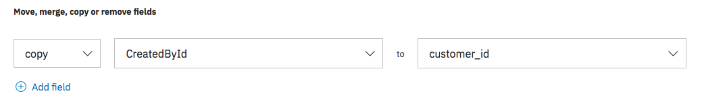

---

copyright:
  years: 2015, 2018, 2019
lastupdated: "2019-03-07"

subcollection: discovery

---

{:shortdesc: .shortdesc}
{:new_window: target="_blank"}
{:tip: .tip}
{:note: .note}
{:pre: .pre}
{:important: .important}
{:deprecated: .deprecated}
{:codeblock: .codeblock}
{:screen: .screen}
{:download: .download}
{:hide-dashboard: .hide-dashboard}
{:apikey: data-credential-placeholder='apikey'} 
{:url: data-credential-placeholder='url'}
{:curl: #curl .ph data-hd-programlang='curl'}
{:javascript: .ph data-hd-programlang='javascript'}
{:java: .ph data-hd-programlang='java'}
{:python: .ph data-hd-programlang='python'}
{:ruby: .ph data-hd-programlang='ruby'}
{:swift: .ph data-hd-programlang='swift'}
{:go: .ph data-hd-programlang='go'}

# 连接到数据源
{: #sources}

通过 {{site.data.keyword.discoveryshort}} 服务，您可以连接到远程源并从中搜寻文档。
{: shortdesc}

您可以连接到数据源，然后根据需要定期将文档拉取到 {{site.data.keyword.discoveryshort}} 服务中，具体做法是配置集合，使之与数据源相关联。如果使用 {{site.data.keyword.discoveryshort}} 工具，您可以为每个集合配置一个数据源，如果使用 API，您可以将多个数据源中的文档发送到单个集合。{{site.data.keyword.discoveryshort}} 服务会使用一个称为“搜寻”的过程来从数据源拉取文档。“搜寻”是指从指定的起始位置系统地浏览和检索文档的过程。{{site.data.keyword.discoveryshort}} 服务仅会搜寻您明确指定的项目。可搜寻的数据源类型如下所示：

-  [Box](/docs/services/discovery?topic=discovery-sources#connectbox)
-  [Salesforce](/docs/services/discovery?topic=discovery-sources#connectsf)
-  [Microsoft SharePoint Online](/docs/services/discovery?topic=discovery-sources#connectsp)
-  [Microsoft SharePoint 2016 On-Premise](/docs/services/discovery?topic=discovery-sources#connectsp_op)
-  [Web Crawl](/docs/services/discovery?topic=discovery-sources#connectwebcrawl) (beta)
-  [IBM Cloud Object Storage](/docs/services/discovery?topic=discovery-sources#connectcos)

要连接到数据源，可以使用 {{site.data.keyword.discoveryshort}} 工具或 API。{{site.data.keyword.discoveryshort}} 工具可提供一种简化的连接方法，该方法不要求您对源系统有太多的了解。API 可提供更细粒度的高度可配置界面，该界面要求您必须非常了解所要连接的源。下面列出了接下来您要阅读本文档的哪些部分：

1.  阅读[一般源需求](/docs/services/discovery?topic=discovery-sources#gen_req)，以大致了解所需的内容。
2.  阅读特定于源系统的需求：
    -  [Box](/docs/services/discovery?topic=discovery-sources#connectbox)
    -  [Salesforce](/docs/services/discovery?topic=discovery-sources#connectsf)
    -  [Microsoft SharePoint Online](/docs/services/discovery?topic=discovery-sources#connectsp)
    -  [Microsoft SharePoint 2016 On-Premise](/docs/services/discovery?topic=discovery-sources#connectsp_op)
    -  [Web Crawl](/docs/services/discovery?topic=discovery-sources#connectwebcrawl) (beta)
    -  [IBM Cloud Object Storage](/docs/services/discovery?topic=discovery-sources#connectcos)
3.  根据您所选的配置来阅读源配置指示信息：
    -  [使用工具](/docs/services/discovery?topic=discovery-sources#source_tooling)
    -  [使用 API](/docs/services/discovery?topic=discovery-sources#source_api)

如果选择内部部署数据源，您首先必须安装和配置 IBM Secure Gateway。请参阅[为内部部署数据安装 IBM Secure Gateway](/docs/services/discovery?topic=discovery-sources#gateway)，以获取更多信息。

## 一般源需求
{: #gen_req}

以下一般需求适用于所有数据源：

-  Box、Salesforce、SharePoint Online、SharePoint 2016、IBM Cloud Object Storage 和 Web Crawl 的单个文档文件大小限制为 10 MB。
-  您需要每个数据源的凭证和文件位置（或 URL）。这些信息通常由数据源的开发者/系统管理员提供。
-  您需要知道要搜寻数据源的哪些资源。此信息可由源管理员来提供。如果要搜寻 Box 或 Salesforce，当您使用 {{site.data.keyword.discoveryshort}} 工具来配置源时，系统会为您显示可用资源的列表。
-  如果使用 {{site.data.keyword.discoveryshort}} 工具，那么可以使用单个数据源配置集合。如果使用 API，那么可以将多个数据源中的文档发送到单个集合。
-  搜寻数据源时，会使用数据源的资源（API 调用）。API 调用数取决于需要搜寻的文档数。必须针对数据源获取相应级别的服务许可（例如企业级），相关信息请咨询源系统管理员。
-  {{site.data.keyword.discoveryshort}} 源搜寻不会删除集合中存储的文档。重新搜寻源时，会添加新文档，并将更新的文档修改为当前版本，而对于删除的文档，则会保留为上次存储的版本。
-  {{site.data.keyword.discoveryshort}} 可以摄入以下文件类型，其他所有文档类型都会被忽略：

集合 | 轻量套餐 | 高级套餐 
---------------- | ------------------------------ | ------------------------------------------- 
发布[智能文档理解 (SDU)](/docs/services/discovery?topic=discovery-release-notes#22jan19) 之前专为 {{site.data.keyword.discoveryfull}} 创建的现有集合。| Microsoft Word、PDF、HTML 和 JSON | Microsoft Word、PDF、HTML 和 JSON 
发布 [SDU](/docs/services/discovery?topic=discovery-sdu#sdu) 之后创建的集合 | PDF、Word、PowerPoint、Excel、JSON\* 和 HTML\* | PDF、Word、PowerPoint、Excel、PNG\*\*、TIFF\*\*、JPG\*\*、JSON\* 和 HTML\* 
    
\* {{site.data.keyword.discoveryfull}} 支持 JSON 和 HTML 文档，但无法使用 SDU 编辑器编辑这些文档。要更改 HTML 和 JSON 文档的配置，您需要使用 API。有关更多信息，请参阅 [API 参考 ](https://{DomainName}/apidocs/discovery/){: new_window}。

\*\* 将扫描各个图像文件（PNG、TIFF 和 JPG），并抽取文本（如果有）。此外，还将扫描 PDF、Word、PowerPoint 和 Excel 文件中嵌入的 PNG、TIFF 和 JPEG 图像，并抽取文本（如果有）。

## Box
{: #connectbox}

您将需要创建新的 Box 定制应用程序以连接到 {{site.data.keyword.discoveryfull}}。您创建的 Box 应用程序需要企业级别或应用程序级别访问权。

-  如果您不是组织的 Box 管理员，那么建议使用[**应用程序级别**访问权](/docs/services/discovery?topic=discovery-sources#applevelbox)。您将需要管理员来核准您的应用程序。
-  如果您是组织的 Box 管理员，那么建议使用[**企业级别**访问权](/docs/services/discovery?topic=discovery-sources#entlevelbox)。

如果有 Box 更新，那么设置 Box 访问权的步骤可能会改变。请参阅 [Box 开发者文档 ](https://developer.box.com/){: new_window} 以获取更新信息。
{: note}

### 设置应用程序级别访问权
{: #applevelbox}

1.   导航至 `https://app.box.com/developers/console`（使用您公司的 Box URL），然后单击**新建应用程序**。
1.   从**新建应用程序**屏幕中，选择**企业集成**，然后单击**下一步**。
1.   在**认证方法**屏幕中，选择**具有 JWT 的 OAuth 2.0（服务器认证）**，然后单击**下一步**。
1.   命名应用程序，然后单击**创建应用程序**按钮。创建 Box 应用程序之后，请单击**查看您的应用程序**。
1.   查看应用程序时，请选择**应用程序**作为**应用程序访问权**。您可以使用现有的受管用户继续执行操作；您无需创建新用户。
1.   向下滚动到页面的**应用程序作用域**部分，并启用以下复选框： 
     - `Read and write all folders stored in Box`
     - `Manage Users`
1.   向下滚动到**高级功能**部分，并启用以下切换开关：
     - `Perform Actions as Users`
     - `Generate User Access Tokens` 
1.  单击**保存更改**按钮。

接下来的这些步骤将需要您组织的 Box 帐户管理员提供帮助。如果您不是组织的 Box 管理员，为识别管理员，您可以打开 Box 开发者控制台并在**帐户设置** > **帐户详细信息** > **设置**下查找。

1.  [管理员步骤] 通过单击**授权新应用程序**按钮，授权 `https://app.box.com/master/settings/openbox` 中的应用程序客户机标识。
1.  [管理员步骤] 将 `https://app.box.com/developers/console` 中的**客户机标识**输入到 **API 密钥**字段中，然后单击**授权**按钮。
1.  [管理员步骤] 检索应用程序的开发者令牌。为此，请导航至 `https://app.box.com/developers/console`，滚动到**开发者令牌**部分，并生成您的令牌。
1.  既然管理员已授权应用程序，请导航至 `https://developer.box.com/reference#page-create-an-enterprise-user`，并使用 API 参考页面创建应用程序用户。

   创建应用程序用户的 Curl 示例：

   ```bash
    curl https://api.box.com/2.0/users -H "Authorization: Bearer ACCESS_TOKEN" -d '{"name": "NedStark", "is_platform_access_only": true}' -X POST
   ```
   {: pre}

1.  复制新生成的**标识**字段内容，并提供给非管理员，以将 Box 应用程序连接到 {{site.data.keyword.discoveryfull}}。
1.  创建应用程序用户之后，您要搜寻的文件夹需要与应用程序用户共享，并且必须为应用程序用户提供这些文件夹的`查看者`许可权。这需要来自上述 curl 命令响应的应用程序用户登录名。示例：`"login":"AppUser_737729_jmUo@boxdevedition.com"`。
1.  返回到 Box 开发者控制台 `https://app.box.com/developers/console`，并滚动到**添加并管理公用密钥**部分。单击**生成公用/专用密钥对**，然后下载您的密钥对文件。打开该文件。
1.  在密钥对文件中，将以下字段剪切并粘贴到 {{site.data.keyword.discoveryshort}} 工具中。
    -  `client_id`
    -  `enterprise_id`
    -  `client_secret` 
    -  `public_key_id` 
    -  `private_key` 
    -  `passphrase` 

### 设置企业级别访问权
{: #entlevelbox}

1.  导航至 `https://app.box.com/developers/console`（使用您公司的 Box URL），然后单击**新建应用程序**。
1.  从**新建应用程序**屏幕中，选择**企业集成**，然后单击**下一步**。
1.  在**认证方法**屏幕中，选择**具有 JWT 的 OAuth 2.0（服务器认证）**，然后单击**下一步**。
1.  命名应用程序，然后单击**创建应用程序**按钮。创建 Box 应用程序之后，请单击**查看您的应用程序**。
1.  查看应用程序时，请选择**企业**作为**应用程序访问权**。您可以使用现有的受管用户继续执行操作；您无需创建新用户。
1.  向下滚动到页面的**应用程序作用域**部分，并启用以下复选框： 
    - `Read and write all folders stored in Box`
    - `Manage Users`
    - `Manage Enterprise Properties`
1.  向下滚动到**高级功能**部分，并启用以下切换开关：
    - `Perform Actions as Users`
    - `Generate User Access Tokens` 
1.  单击**保存更改**按钮。

仅企业级别访问权支持`刷新`。
{: note}

如果更改您的 Box 应用程序设置，请`重新授权`应用程序，以使更改生效。
{: tip}

接下来的这些步骤将需要您组织的 Box 帐户管理员提供帮助。如果您不是组织的 Box 管理员，为识别管理员，您可以打开 Box 开发者控制台并在**帐户设置** > **帐户详细信息** > **设置**下查找。

1.  [管理员步骤] 通过导航至**管理控制台** > **企业设置** > **应用程序**并滚动到`定制应用程序`来授权应用程序客户机标识。示例 URL：`https://app.box.com/master/settings/openbox`。
1.  [管理员步骤] 将 `https://app.box.com/developers/console` 中的**客户机标识**输入到 **API 密钥**字段中，然后单击**授权**按钮。
1.  返回到 Box 开发者控制台 `https://app.box.com/developers/console`，并滚动到**添加并管理公用密钥**部分。单击**生成公用/专用密钥对**，然后下载您的密钥对文件。打开该文件。
1.  在密钥对文件中，将以下字段剪切并粘贴到 {{site.data.keyword.discoveryshort}} 工具中。
    -  `client_id`
    -  `enterprise_id`
    -  `client_secret` 
    -  `public_key_id` 
    -  `private_key` 
    -  `passphrase` 

搜寻 Box 时要考虑的其他事项：

-  Box 注释以 JSON 格式存储，以便 {{site.data.keyword.discoveryshort}} 可以摄入指定文件夹中的任何 Box 注释。
-  使用 API 时，您需要有要搜寻的每个文件夹的“文件夹标识”及其关联的“所有者标识”的列表。使用 {{site.data.keyword.discoveryshort}} 工具时，您可以浏览和选择要搜寻的内容。

## Salesforce
{: #connectsf}

连接到 Salesforce 源时，请确保您计划要连接的实例是企业套餐或更高级别的套餐。

下面是连接到 Salesforce 源时所需的凭证；您应该从 Salesforce 管理员那里获取这些凭证：
-  `url` - 这些凭证连接到的源的 `url`。
-  `username` - 这些凭证连接到的源的 `username`。
-  `password` - `password` 由 Salesforce 密码和有效的 Salesforce 安全性令牌串联而成。永远不会返回此值，仅会在创建或修改凭证时使用此值。

确定凭证时，可查阅 [Salesforce 开发者文档 ](https://developer.salesforce.com/docs/){: new_window} 来获取有用的信息。

搜寻 Salesforce 时要考虑的其他事项：

-  只能搜寻**版本**为 `published` 且语言为 `en-us` 的知识库文章。
-  使用 API 时，您需要有要搜寻的 Salesforce 对象的列表。使用 {{site.data.keyword.discoveryshort}} 工具时，您可以浏览和选择要搜寻的内容。

## SharePoint Online
{: #connectsp}

连接到 Microsoft SharePoint Online 源时，请确保您计划要连接的实例是企业 (E1) 套餐或更高级别的套餐。

下面是连接到 SharePoint Online 源时所需的凭证；您应该从 SharePoint 管理员那里获取这些凭证：

-  `organization_url` - 这些凭证连接到的源的 `organization_url`。
-  `site_collection_path` - 这些凭证连接到的源的 `site_collection_path`。
-  `username` - 这些凭证连接到的源的 `client_id`。该用户必须有权访问要搜寻和建立索引的所有站点和列表。
-  `password` - 这些凭证连接到的源的 `password`。永远不会返回此值，仅会在创建或修改凭证时使用此值。

确定凭证时，可查阅 [Microsoft SharePoint 开发者文档 ](https://docs.microsoft.com/en-us/sharepoint/dev/){: new_window} 来获取有用的信息。

搜寻 Microsoft SharePoint Online 时要考虑的其他事项：

-  要搜寻 SharePoint，`搜寻用户`帐户必须具有`站点集合管理员`许可权。
-  搜寻 SharePoint 时，将需要您希望搜寻的 SharePoint 站点集合路径的列表。{{site.data.keyword.discoveryshort}} 不支持文件夹路径作为输出。

## Web Crawl
{: #connectwebcrawl}

此 beta 功能可用于搜寻不需要密码的公共 Web 站点。您可以选择希望 {{site.data.keyword.discoveryshort}} 与 Web 站点同步的频率、语言和中继段数。

-  `与我的数据同步` - 您可以选择每 5 分钟、每小时、每天、每周或每月同步一次。 
-  `选择语言` - 从支持的语言列表中选择 Web 站点的语言。请参阅[语言支持](/docs/services/discovery?topic=discovery-language-support#supported-languages)以获取 {{site.data.keyword.discoveryshort}} 支持的语言列表。建议您为每种语言创建单独的集合。
-  `要同步的 URL 组` - 输入您的 URL，然后单击加号以将其添加到 URL 组中。要为此 URL 组指定**搜寻设置**，请单击  图标。您可以设置**最大中继段数**，表示起始 URL（起始 URL 为 `0`）之后的连续链接数。缺省中继段数为 `2`，且最大值为 `20`（如果使用 API，那么最大值为 `1000`）。 

对于此 Beta 发行版，将限制搜寻的网页数，以便 Web 搜寻器不会搜寻指定的所有 Web 站点而达到最大中继段数。
{: note}

如果需要对其他 URL 进行不同的**搜寻设置**，请单击**添加 URL 组**，并创建新的组。您可以根据需要创建任意多个 URL 组。
{: tip}

## SharePoint 2016 On-Premise
{: #connectsp_op}

Microsoft SharePoint 2016（也称为 SharePoint Server 2016）是内部部署数据源。要与其连接，您首先必须安装和配置 IBM Secure Gateway。请参阅[为内部部署数据安装 IBM Secure Gateway](/docs/services/discovery?topic=discovery-sources#gateway)，以获取更多信息。
{: note}

下面是连接到 SharePoint 2016 数据源时所需的凭证；您应该从 SharePoint 管理员那里获取这些凭证：

-  `username` - 这些凭证连接到的源的 `client_id`。该用户必须有权访问要搜寻和建立索引的所有站点和列表。
-  `password` - 这些凭证连接到的源的 `password`。永远不会返回此值，仅会在创建或修改凭证时使用此值。
-  `web_application_url` - SharePoint 2016 `web_application_url`；例如，https://sharepointwebapp.com:8443。如果未提供端口，那么将缺省为端口 `80`（适用于 http）和端口 `443`（适用于 https）。
-  `domain` - SharePoint 2016 帐户的 `domain`。

确定凭证时，可查阅 [Microsoft SharePoint 开发者文档 ](https://docs.microsoft.com/en-us/sharepoint/dev/){: new_window} 来获取有用的信息。

搜寻 Microsoft SharePoint 2016 时要考虑的其他事项：

-  要搜寻 SharePoint 2016，`搜寻用户`帐户必须具有`站点集合管理员`许可权。
-  搜寻 SharePoint 时，将需要您希望搜寻的 SharePoint 站点集合路径的列表。{{site.data.keyword.discoveryshort}} 不支持文件夹路径作为输出。

## IBM Cloud Object Storage
{: #connectcos}

连接到 IBM Cloud Object Storage 源时，需要以下凭证。您应该从 IBM Cloud Object Storage 管理员那里获取这些凭证：

-  `endpoint` - 用于与 IBM Cloud Object Storage 数据进行交互的 `endpoint`。
-  `access_key_id` - 创建 IBM Cloud Object Storage 实例时获取的 `access_key_id`。
-  `secret_access_key` - 创建 IBM Cloud Object storage 实例时获取的用于签署请求的 `secret_access_key`。

输入此信息之后，您可以选择希望对您的数据进行同步的频率，并选择要同步到的存储区。

搜寻 IBM Cloud Object Storage 时要考虑的其他事项：

-  此连接器不支持搜寻专用端点。
-  如果选择了所有存储区，那么会出现轻微性能问题。在此情况下，可能会有所延迟，然后才能完成对文档建立索引的操作。

## 使用工具
{: #source_tooling}

使用 {{site.data.keyword.discoveryshort}} 工具连接到数据源的操作可通过专门为源创建集合来完成。要创建源集合并对其进行搜寻，请执行以下步骤：

1.  在 {{site.data.keyword.discoveryshort}} 工具的**管理数据**页面上，选择**连接数据源**。
2.  选择要连接到的数据源。如果已选择内部部署数据源，您首先需要安装 IBM Secure Gateway，请参阅[为内部部署数据安装 IBM Secure Gateway](/docs/services/discovery?topic=discovery-sources#gateway)，以获取更多信息。 
3.  输入源凭证，然后单击“连接”。您必须从源系统管理员那里获取源凭证。
4.  选择要搜寻的数据以及要同步数据的频率。同步选项：
    -  每五分钟：每五分钟运行一次
    -  每小时：每小时运行一次
    -  每天：每天在指定时区的 00:00 和 06:00 之间运行一次
    -  每周：每周日在指定时区的 00:00 和 06:00 之间运行一次
    -  每月：每月第一个周日在指定时区的 00:00 和 06:00 之间运行一次
    
    搜寻状态示例：
    
    ```json
    "crawl_status" : {
    "source_crawl" : {
      "status" : "completed",
      "next_crawl" : "2019-02-10T05:00:00-05:00"
    }
    ```
5.  单击**保存并同步对象**，以开始搜寻数据源。然后，系统会将您重定向到“集合状态”屏幕，该屏幕会在文档添加到集合时进行更新。

搜寻会在一开始先同步数据，然后会按指定的频率来同步数据。**注：**如果在**同步设置**屏幕中修改了任何内容，然后单击了**保存并同步对象**，那么此时将启动新的搜寻（如果已经有搜寻在运行中，那么将重新启动该搜寻）。

## 使用 API
{: #source_api}

使用 API 连接到数据源时，请使用以下过程来创建集合。

如果计划连接到内部部署数据源，您首先需要安装 IBM Secure Gateway，请参阅[为内部部署数据安装 IBM Secure Gateway](/docs/services/discovery?topic=discovery-sources#gateway)，以获取更多信息。 

以下示例使用 SharePoint 数据源。

1.  使用[源凭证 API ](https://{DomainName}/apidocs/discovery#create-credentials){: new_window}，为要连接到的源创建凭证。将所返回的新创建凭证的 **credential_id** 记录下来。
2.  使用[配置 API ](https://{DomainName}/apidocs/discovery#add-configuration){: new_window}，创建一个新配置。此配置必须包含用于定义应该搜寻哪些内容的 **source** 对象。**source** 对象必须包含您先前记录的 **credential_id**。
    ```json
    "source" : {
      "type" : "salesforce",
      "credential_id" : "{credential_id}",
      "schedule" : {
        "enabled" : true,
        "time_zone" : "America/New_York",
        "frequency" : "weekly"
      },
      "options" : {
         "site_collections" : [ {
         "site_collection_path" : "/sites/TestSiteA",
         "limit" : 10
         } ]
      }
    }
    ```
    {: codeblock}
    将所返回的新创建配置的 **configuration_id** 记录下来。
3.  使用[集合 API ](https://{DomainName}/apidocs/discovery#create-a-collection){: new_window}，创建一个新集合。用于定义集合的对象必须包含您先前记录的 **configuration_id**。

源搜寻会在集合创建后立即启动，然后会根据您指定的频率再次启动。
**注：**如果在配置的 **source** 对象中修改了任何内容，那么此时将启动新的搜寻（如果已经有搜寻在运行中，那么将重新启动该搜寻）。

### 指定 `customer_id`
{: #source_customer_id}

摄入的 {{site.data.keyword.discoveryshort}} 文档中的 `customer_id` 字段可用于通过 API 中的 **user-data** 方法基于 `customer_id` 来删除内容。从数据源摄入传入文档时，不会自动为其分配 `customer_id`。如果应用程序需要定义 `customer_id`，那么可以指定要从源系统复制并用作 `customer_id` 的一个或多个传入字段。为此，您必须修改要用于连接到源的配置。

1.  执行样本查询并确定要用作 `customer_id` 的字段。
2.  修改配置。要创建 `customer_id` 字段，您需要添加**规范化**部分。
    -  在工具中，导航至您的集合，然后单击“配置”部分中的**编辑**链接。接下来，单击**规范化**选项卡，然后添加**复制**规范化，以创建 `customer_id` 字段。最后，单击**应用并保存**。
    
    -  使用 API 时，请将以下对象添加到 **normalizations** 数组中：
       ```json
       {
         "operation" : "copy",
         "source_field" : "{original_field_name}",
         "destination_field" : "customer_id"
       }
       ```
       {: codeblock}
3.  下一个安排的搜寻会将 `customer_id` 字段添加到所有文档中。如果要立即启动搜寻，请修改源配置（工具中的**同步设置**）。

有关更多信息以及有关基于 `customer_id` 进行删除的信息，请参阅[信息安全](/docs/services/discovery?topic=discovery-information-security#information-security)。

## 为内部部署数据安装 IBM Secure Gateway 
{: #gateway}

要连接到内部部署数据源，您首先需要下载、安装和配置 IBM Secure Gateway。为您的第一个内部部署数据源安装 IBM Secure Gateway 之后，您无需重复执行此过程。

1.  在 {{site.data.keyword.discoveryshort}} 工具的**管理数据**页面上，选择**连接数据源**。
1.  选择要连接到的数据源。选择内部部署数据源，转至**连接到内部部署网络**部分，然后单击**执行连接**按钮。
1.  在**下载并安装 Secure Gateway 客户机**屏幕上，下载相应的 IBM Secure Gateway 版本。
1.  完成下载之后，单击**下载 Secure Gateway 并继续**按钮。在安装期间，当 Secure Gateway 客户机提示时，您将需要屏幕上提供的**网关标识**和**令牌**。请参阅 Secure Gateway 文档中的[安装客户机 ](https://cloud.ibm.com/docs/services/SecureGateway/securegateway_install.html#installing-the-client){: new_window}，以获取安装指示信息。
1.  在运行 Secure Gateway 客户机的机器上，打开 http://localhost:9003 中的 Secure Gateway 仪表板。
1.  在仪表板上单击**添加 ACL**。将每个 SharePoint 集合的端点 URL 添加到**允许访问**列表中。例如，主机名：`mycompany.sharepoint.com` 和端口：`80`。
1.  返回到 {{site.data.keyword.discoveryshort}} 工具，并单击**继续**。如果连接成功，您将看到`连接成功`消息。如果连接未成功，请打开 Secure Gateway 仪表板，并验证**允许访问**列表上的端点是否正确。

连接成功之后，您可以开始输入内部部署数据源的凭证。

## 数据源连接和数据隔离
{: #source_isolation}

[连接到外部数据源](/docs/services/discovery?topic=discovery-sources#sources)会减少服务实例的数据隔离，这是因为在源和服务之间传输的数据无法隔离。所有其他隔离（静态、管理和查询）仍保持完整状态。服务与数据源之间以及彼此内部的所有动态通信都使用 TLS V1.2 进行加密。TLS 证书的专用密钥使用 AES-256-GCM 进行静态加密，服务证书每三年到期，且每月会更新证书撤销列表。所有凭证都会通过使用 TLS V1.2 的加密连接进行发送，且使用 AES-256 进行静态加密。与这些数据源的连接使用的任何安全协议都受这些数据源支持。
