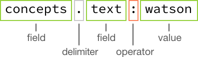

---

copyright:
  years: 2015, 2017
lastupdated: "2017-08-31"

---

{:shortdesc: .shortdesc}
{:new_window: target="_blank"}
{:tip: .tip}
{:pre: .pre}
{:codeblock: .codeblock}
{:screen: .screen}
{:javascript: .ph data-hd-programlang='javascript'}
{:java: .ph data-hd-programlang='java'}
{:python: .ph data-hd-programlang='python'}
{:swift: .ph data-hd-programlang='swift'}

# Discovery 归档

本主题包含的信息是关于可能仍然可用，但已经替换为更新的选项的 {{site.data.keyword.discoveryshort}} 功能。
{: tip}

## AlchemyLanguage 扩充项
{: #AlchemyLanguage-enrichments}

从 **2017 年 7 月 18 日**开始，{{site.data.keyword.discoveryfull}} 引入了名为 {{site.data.keyword.nlushort}} 的新扩充技术。这些扩充项与现有扩充项相同，但需要的配置和模式略有不同。不推荐使用名为 {{site.data.keyword.alchemylanguageshort}} 扩充项的原始扩充项，对这些扩充项的支持将于 **2018 年 1 月 15 日**结束。

`2017-10-16` API 版本字符串放弃支持将新文档上传到通过 {{site.data.keyword.alchemylanguageshort}} 扩充的现有集合，并且放弃支持创建新集合并通过 {{site.data.keyword.alchemylanguageshort}} 扩充项来扩充这些集合。使用较早的 API 版本字符串可继续使用 {{site.data.keyword.alchemylanguageshort}}，直到在 **2018 年 1 月 15 日**结束支持为止。

使用 AlchemyLanguage 扩充的现有集合应该尽快迁移到 Natural Language Understanding 扩充项。有关迁移利用 {{site.data.keyword.alchemylanguageshort}} 扩充项的集合和配置文件的信息，请参阅[将扩充项迁移到 {{site.data.keyword.nlushort}}](/docs/services/discovery/migrate-nlu.html)。

**注：**{{site.data.keyword.discoveryshort}} 工具始终使用最新的 API 版本字符串，所以从 `2017-10-16` API 版本字符串开始，您不再能够将文档上传到现有 {{site.data.keyword.alchemylanguageshort}} 集合，也不能使用 {{site.data.keyword.discoveryshort}} 工具创建通过 {{site.data.keyword.alchemylanguageshort}} 扩充项扩充的新集合。如果要继续使用 Discovery 工具来扩充集合，请先将集合迁移到 Natural Language Understanding。请参阅[将扩充项迁移到 {{site.data.keyword.nlushort}}](/docs/services/discovery/migrate-nlu.html) 以获取详细信息。

### 实体抽取 (AlchemyLanguage)
{: #entity-extraction-al}

返回输入文本中存在的项，例如人员、场所和组织。“实体抽取”可将语义知识添加到内容，以帮助了解所分析文本的主题和上下文。“实体抽取”方法基于复杂的统计算法和自然语言处理技术，在业内以独特的方式支持多语言分析、上下文相关的消歧和引文抽取。

使用“实体抽取”扩充的文档的示例部分：

```json
{
      "text": "The stockholders were pleased that Acme Corporation plans to build a new factory in Atlanta, Georgia.",
      "enriched-text": {
        "status": "OK",
        "language": "english",
        "entities": [
          {
            "type": "City",
            "relevance": 0.532754,
            "sentiment": {
              "type": "positive",
              "score": 0.527541,
              "mixed": false
            },
            "count": 1,
            "text": "Atlanta",
            "disambiguated": {
              "subType": [
                "AdministrativeDivision",
                "GovernmentalJurisdiction",
                "OlympicHostCity",
                "PlaceWithNeighborhoods"
              ],
              "name": "Atlanta",
              "website": "http://www.atlantaga.gov/",
              "dbpedia": "http://dbpedia.org/resource/Atlanta",
              "freebase": "http://rdf.freebase.com/ns/m.013yq"
            }
          }
        ]
      }
    }
```
{: codeblock}
在上面的示例中，您可以通过访问 `enriched_text.entities.type` 来查询实体类型。

即便未选择 **sentiment** 扩充项，也会针对实体类型计算 `sentiment`。要了解有关观点评分的更多信息，请参阅[观点分析](/docs/services/discovery/discovery-auxiliary.html#sentiment-analysis-al)。

`relevance` 分数范围从 `0.0` 到 `1.0`。分数越高，实体相关性越大。`disambiguated` 字段包含实体的消歧信息，包括实体 `subType` 信息以及资源的链接（如果适用）。`count` 是文档中提及该实体的次数。

### 关键字抽取 (AlchemyLanguage)
{: #keyword-extraction-al}

这是内容中的重要主题，通常在对数据建立索引、生成标记云或搜索时使用。{{site.data.keyword.discoveryshort}} 服务会自动识别输入内容中的受支持语言，然后识别该内容中的关键字并对其排名。

使用“关键字抽取”扩充的文档的示例部分：

```json
{
    "text": "The stockholders were pleased that Acme Corporation plans to build a new factory in Atlanta, Georgia.",
    "enriched-text": {
        "status": "OK",
        "language": "english",
        "keywords": [
          {
            "relevance": 0.66497,
            "sentiment": {
              "score": 0.527541,
              "type": "positive",
              "mixed": false
            },
            "text": "stockholders"
          }
        ]
      }
    }
```
{: codeblock}

在上面的示例中，您可以通过访问 `enriched_text.keywords.text` 来查询关键字文本。

即便未选择 **sentiment** 扩充项，也会针对关键字计算 `sentiment`。要了解有关观点评分的更多信息，请参阅[观点分析](/docs/services/discovery/discovery-auxiliary.html#sentiment-analysis-al)。

`relevance` 分数范围从 `0.0` 到 `1.0`。分数越高，关键字相关性越大。

### 分类法分类 (AlchemyLanguage)
{: #taxonomy-classification-al}

将输入文本、HTML 或基于 Web 的内容分类为最多 5 个级别深度的分层分类法。级别越深，就可以将内容分类为更准确、更有用的子分段。

使用“分类法分类”扩充的文档的示例部分：

```json
  {
    "text": "The stockholders were pleased that Acme Corporation plans to build a new factory in Atlanta, Georgia.",
    "enriched-text": {
        "status": "OK",
        "language": "english",
        "taxonomy": [
          {
            "label": "/business and industrial/company/merger and acquisition",
            "score": 0.517533,
            "confident": false
          }
        ]
      }
    }
```
{: codeblock}

在上面的示例中，您可以通过访问 `enriched_text.taxonomy.labelenriched_text.taxonomy.label` 来查询分类法标签。

`label` 是检测到的分类法类别。各层次结构级别用正斜杠分隔。该类别的 `score` 范围从 `0.0` 到 `1.0`。分数越高，该类别的置信度越大。

### 概念标记 (AlchemymLanguage)
{: #concept-tagging-al}

根据该文本中存在的其他概念和实体，识别与输入文本关联的概念。通过“概念标记”，可了解概念的相关性，并可识别文本中未直接引用的概念。例如，如果文章提及 CERN 和“希格斯玻色子”，那么“概念 API”函数会将“大型强子对撞机”识别为概念，即便该术语并未在页面中显式提及。“概念标记”支持对输入内容进行更高级别的分析，而不仅仅是基本的关键字识别。

使用“概念标记”扩充的文档的示例部分：

```json
{
    "text": "The stockholders were pleased that Acme Corporation plans to build a new factory in Atlanta, Georgia.",
    "enriched_text": {
        "status": "OK",
        "language": "english",
        "concepts": [
          {
            "text": "Acme Corporation",
            "relevance": 0.91136,
            "dbpedia": "http://dbpedia.org/resource/Acme_Corporation",
            "freebase": "http://rdf.freebase.com/ns/m.0dndy",
            "yago": "http://yago-knowledge.org/resource/Acme_Corporation"
          }
        ]
      }
    }
```
{: codeblock}

在上面的示例中，您可以通过访问 `enriched_text.concepts.text` 来查询概念文本类型。

`relevance` 分数范围从 `0.0` 到 `1.0`。分数越高，概念相关性越大。还提供了资源的链接（如果适用）。

### 关系抽取 (AlchemyLanguage)
{: #relation-extraction-al}

识别输入内容中语句内的主语、操作和宾语关系。关系信息可用于自动识别购买信号、关键事件和其他重要操作。

使用“关系抽取”扩充的文档的示例部分：

```json
{
      "text": "The stockholders were pleased that Acme Corporation plans to build a new factory in Atlanta, Georgia.",
      "enriched-text": {
        "status": "OK",
        "language": "english",
        "relations": [
          {
            "sentence": " The stockholders were pleased that Acme Corporation plans to build a new factory in Atlanta, GA.",
            "subject": {
              "text": "The stockholders",
              "keywords": [
                {
                  "text": "stockholders"
                }
              ]
            },
            "action": {
              "text": "were",
              "lemmatized": "be",
              "verb": {
              "text": "be",
              "tense": "past"
            }
            },
            "object": {
              "text": "pleased that Acme Corporation plans to build a new factory in Atlanta, GA",
              "sentiment": {
                "type": "positive",
                "score": 0.834516,
                "mixed": false
              },
              "entities": [
                {
                  "type": "Company",
                  "text": "Acme Corporation"
                },
                {
                  "type": "City",
                  "text": "Atlanta",
                  "disambiguated": {
                    "subType": [
                      "AdministrativeDivision",
                      "GovernmentalJurisdiction",
                      "OlympicHostCity",
                      "PlaceWithNeighborhoods"
                    ],
                    "name": "Atlanta",
                    "website": "http://www.atlantaga.gov/",
                    "dbpedia": "http://dbpedia.org/resource/Atlanta",
                    "freebase": "http://rdf.freebase.com/ns/m.013yq"
                  }
                },
                {
                  "type": "StateOrCounty",
                  "text": "GA"
                }
              ],
              "keywords": [
                {
                  "text": "Acme Corporation"
                },
                {
                  "text": "new factory"
                },
                {
                  "text": "GA"
                },
                {
                "text": "Atlanta"
                }
              ]
            }
          }
        ]
      }
    }
```
{: codeblock}

在上面的示例中，您可以通过访问 `enriched_text.relations.subject.text` 来查询关系主题文本。

即便未选择 **sentiment** 扩充项，也会针对关系计算 `sentiment`。要了解有关观点评分的更多信息，请参阅[观点分析](/docs/services/discovery/discovery-auxiliary.html#sentiment-analysis-al)。除非您同时选择了 **entity** 和 **keyword** 扩充项，否则不会抽取 `entities` 或 `keywords`（如示例中所示）。请参阅[实体抽取](/docs/services/discovery/discovery-auxiliary.html#entity-extraction-al)和[关键字抽取](/docs/services/discovery/discovery-auxiliary.html#keyword-extraction-al)，以获取有关这些扩充项的更多信息。

针对包含关系的每个语句，都会抽取 `subject`、`action` 和 `object`。

### 观点分析 (AlchemyLanguage)
{: #sentiment-analysis-al}

识别所分析内容中的态度、意见或感受。{{site.data.keyword.discoveryshort}} 服务可以计算一个文档中的总体观点、用户指定目标的观点、实体级别的观点、引文级别的观点、方向性观点和关键字级别的观点。这些功能组合在一起，可支持从社交媒体监视到趋势分析的各种用例。

使用“观点分析”扩充的文档的示例部分：

```json
{
      "text": "The stockholders were pleased that Acme Corporation plans to build a new factory in Atlanta, Georgia.",
      "enriched_text": {
        "status": "OK",
        "language": "english",
        "docSentiment": {
          "type": "positive",
          "score": 0.0966252,
          "mixed": true
        }
      }
    }
```
{: codeblock}

在上面的示例中，您可以通过访问 `enriched_text.docSentiment.type` 来查询 docSentiment 类型。

`type` 是文档的总体观点（`positive`、`negative` 或 `neutral`）。观点 `type` 基于 `score`；分数 `0.0` 指示文档为 `neutral`，正数指示文档为 `positive`，负数指示文档为 `negative`。如果 `mixed` 为 `true`，指示文档包含正面和负面的观点（此字段不是由 `score` 确定的）。

### 情绪分析 (AlchemyLanguage)
{: #emotion-analysis-al}

检测英语文本中隐含的愤怒、厌恶、恐惧、快乐和悲伤等情绪。“情绪分析”可以检测到与目标短语、实体或关键字关联的情绪，也可以分析内容的总体情绪语气。

使用“情绪分析”扩充的文档的示例部分：

```json
{
      "text": "The stockholders were pleased that Acme Corporation plans to build a new factory in Atlanta, Georgia.",
      "enriched_text": {
        "status": "OK",
        "language": "english",
        "docEmotions": {
          "anger": "0.077394",
          "disgust": "0.044024",
          "fear": "0.092664",
          "joy": "0.553327",
          "sadness": "0.3969"
        }
      }
    }
```
{: codeblock}

在上面的示例中，您可以通过访问 `enriched_text.docEmotions.joy` 来查询 `joy` docEmotion。

“情绪分析”会分析文本，并针对每种情绪（愤怒、厌恶、恐惧、快乐和悲伤）计算分数，分数量程为 `0.0` 到 `1.0`。如果任何情绪的分数等于或大于 `0.5`，即检测到该情绪（分数高于 `0.5` 越多，相关性越大）。在所示片段中，`joy` 的得分高于 0.5，因此 {{site.data.keyword.watson}} 检测到快乐。


## Watson Discovery News Original

新版本的 {{site.data.keyword.discoverynewsfull}} 已在 **2017 年 7 月 31 日**推出。{{site.data.keyword.discoverynewsfull}} Original 已引退，其终止服务日期为 **2018 年 1 月 15 日**。请参阅 [Watson Discovery News](watson-discovery-news.html) 以获取有关此新版本的信息。

{{site.data.keyword.discoverynewsfull}} Original 是一个以英语新闻来源为主且持续更新的数据集，每天约新增 300,000 篇文章和博客。此数据集已建立索引并已通过以下 {{site.data.keyword.alchemylanguageshort}} 扩充项进行预扩充：**关键字抽取**、**实体抽取**、**概念标记**、**关系抽取**、**观点分析**和**分类法分类**。此外，还添加了以下其他元数据：搜寻日期、发布日期、URL 排名、主机排名和锚点文本。历史搜索可用于搜索过去 60 天的新闻数据。

{{site.data.keyword.discoverynewsfull}} Original 通过 {{site.data.keyword.alchemylanguageshort}} 扩充项进行扩充。有关这些扩充项的更多信息，请参阅 [{{site.data.keyword.alchemylanguageshort}} 扩充项](discovery-auxiliary.html#AlchemyLanguage-enrichments)。

### 查询 Watson Discovery News Original

新版本的 {{site.data.keyword.discoverynewsfull}} 已在 **2017 年 7 月 31 日**推出。{{site.data.keyword.discoverynewsfull}} Original 已引退，其终止服务日期为 **2018 年 1 月 15 日**。请参阅 [Watson Discovery News](watson-discovery-news.html) 以获取有关此新版本的信息。

**注：**针对 Watson Discovery News 查询返回的最大结果数为 `50`。使用其他查询和 `offset` 参数可返回 `50` 个以上的结果。

{{site.data.keyword.discoverynewsfull}} Original 使用的 JSON 模式与专用集合所用的类似，但略有不同。例如，您无需在查询中包含 `enriched_text`：

**如何构造 {{site.data.keyword.discoverynewsfull}} Original 查询**



以下示例查询返回 {{site.data.keyword.discoverynewsfull}} Original 中有关 Pittsburgh Steelers 的具有正面观点的前 10 篇文章。

1.  在**管理数据**屏幕上，选择 {{site.data.keyword.discoverynewsfull}} 集合。
1.  单击**查看数据模式**，然后单击**构建查询**。
1.  在**搜索文档**下，单击**使用 {{site.data.keyword.discoveryshort}} Query Language**，然后在**在此输入查询**字段中输入 `text:Pittsburgh Steelers, docSentiment.type:positive`。
1.  单击**更多选项**，然后在`要返回的文档数`字段中输入 `10`（这是缺省值）。
1.  单击**运行查询**。这将显示有关 Pittsburgh Steelers 的具有正面观点的前 10 篇文章。

**其他示例 {{site.data.keyword.discoverynewsfull}} Original 查询**

-  `concepts.text:"Health care"` - 在**搜索文档**下，单击**使用 {{site.data.keyword.discoveryshort}} Query Language**，然后输入此查询。此查询将返回所有包含 `health care` 概念的文章。如果在**要返回的文档数**字段中指定计数，例如 50，那么只会收到前 50 篇最相关的文章。

**如何构造 {{site.data.keyword.discoverynewsfull}} Original 聚集**


以下示例聚集将按观点返回在 {{site.data.keyword.discoverynewsfull}} Original 中找到的有关 Pittsburgh Steelers 的文章数量。

1.  在**管理数据**屏幕上，选择 {{site.data.keyword.discoverynewsfull}} Original 集合。
1.  单击**查看数据模式**，然后单击**构建查询**。
1.  在**包含对结果的分析**下，在**使用 {{site.data.keyword.discoveryshort}} Query Language 编写聚集查询**字段中，输入 `filter(text:"Pittsburgh Steelers").term(docSentiment.type,count:3)`。
1.  单击**更多选项**，然后在**要返回的文档数**字段中输入 `0`。
1.  单击**运行查询**。结果将显示有关 Pittsburgh Steelers 的文档数以及这些结果中有多少具有 `positive`、`negative` 或 `neutral` docSentiment。

**其他示例 {{site.data.keyword.discoverynewsfull}} Original 聚集**

-  `filter(entities.text:twitter).term(docSentiment.type,count:3)` - 如果在**使用 {{site.data.keyword.discoveryshort}} Query Language 编写聚集查询**字段中输入此聚集查询，那么会先将文章集的范围缩小（过滤）为仅包含推特实体文本的文章，然后按文档观点类型划分这些文章。仅返回前三种文档观点类型（`positive`、`negative` 和 `neutral`）。

在聚集查询前面添加 `nested` 可将聚集限制为指定的结果区域。例如：`nested(text.entities)` 表示仅对任何结果的 `text.entities` 组成部分进行聚集。通过查看以下两个查询之间的差异，可以轻松看到这一影响：`filter(text.entities.type::City)` - 聚集统计包含一个或多个类型为 `City` 的 `entity` 的*结果*数量；`nested(text.entities).filter(text.entities.type::City)` - 聚集统计结果中类型为 `City` 的 `entity` 实例数量。此外，任何后续操作都将进一步限制可对其进行聚集的结果集。例如，`nested(text.entities).filter(text.entities.type::City)` 表示将仅聚集 `type::City` 的任何实体。例如：`nested(text.entities).filter(text.entities.type::City).term(text.entities.text,count:3)` 将聚集类型为 `City` 的前三个实体，其中 `filter(text.entities.type::City).term(text.entities.text,count:3)` 将返回前三个实体，而结果包含类型为 `City` 的至少一个实体。

**注**：不能调整 {{site.data.keyword.discoverynewsfull}} Original 配置，也不能培训此集合或向其中添加文档。

## 使用 AlchemyLanguage 扩充项与 Watson Knowledge Studio 集成

可以将 {{site.data.keyword.knowledgestudiofull}} 中的定制模型与 {{site.data.keyword.discoveryshort}} 服务集成，以提供定制扩充项。
{: shortdesc}

### 开始之前

要能够将 {{site.data.keyword.knowledgestudioshort}} 中的定制模型与 {{site.data.keyword.discoveryshort}} 服务集成，必须先使用 {{site.data.keyword.knowledgestudioshort}} 创建并部署该模型。请参阅 {{site.data.keyword.knowledgestudioshort}} 文档，以获取有关创建和部署模型的信息。您需要所部署模型的唯一标识，才能将其与 {{site.data.keyword.discoveryshort}} 服务集成。

### 关于此任务

可以使用在 {{site.data.keyword.knowledgestudioshort}} 中开发的定制模型来扩充 {{site.data.keyword.discoveryshort}} 服务中的文档。这使您能够灵活地应用 {{site.data.keyword.discoveryshort}} 服务的文档扩充功能，并提供特定于特定焦点领域的信息，如行业规程或科学学科。您可以在扩充模型中同时使用公共数据和您自己的专有数据。

必须使用服务 API 将 {{site.data.keyword.knowledgestudioshort}} 模型与 {{site.data.keyword.discoveryshort}} 服务集成。不能使用 {{site.data.keyword.discoveryshort}} 工具来集成定制模型。

### 过程

1.  获取您的 {{site.data.keyword.discoveryshort}} 环境的标识，如[列出环境 ](https://www.ibm.com/watson/developercloud/discovery/api/v1/#list_environments){: new_window} 中所述。记下环境标识。
1.  列出您的当前 {{site.data.keyword.discoveryshort}} 配置的标识，如[列出配置 ](https://www.ibm.com/watson/developercloud/discovery/api/v1/#list_configurations){: new_window} 中所述。记下要与 {{site.data.keyword.knowledgestudiofull}} 定制模型集成的配置的标识。
1.  通过在 bash shell 或等效程序（例如，Cygwin for Windows）中运行以下命令，下载您的当前 {{site.data.keyword.discoveryshort}} 配置的副本。将 `{environment_id}` 和 `{configuration_id}` 替换为在前两个步骤中记下的标识。

    ```bash
    curl -u "{username}":"{password}" "https://gateway.watsonplatform.net/discovery/api/v1/environments/{environment_id}/configurations/{configuration_id}?version=2017-09-01" > my_config.json
    ```
    {: pre}

    此命令会列出集合文件的内容，并将其放入名为 `my_config.json` 的 JSON 文件中。
1.  在文本编辑器中打开 `my_config.json` 文件，并进行以下更改：
    1.  将 `"name"` 字段的值更改为指示新配置用途的值。还可以选择更改 `"description"` 字段的值。

        ```json
        ...
        "name": "wks-config",
        "description": "This is a configuration to use with a WKS model",
        ...
        ```
        {: codeblock}

    1.  使用 {{site.data.keyword.knowledgestudioshort}} 模型的信息更新扩充字段。假定这些扩充字段初始为：

        ```json
        "enrichments": [
          {
            "destination_field": "enriched_text",
            "source_field": "text",
            "enrichment": "alchemy_language",
            "options": {
              "extract": "keyword, entity, doc-sentiment, taxonomy, concept, relation",
              "sentiment": true,
              "quotations": true
            }
          }
        ]
        ```
        {: codeblock}

    1.  如下所示更新此文件，使用“开始之前”中所述的 {{site.data.keyword.knowledgestudioshort}} 模型的唯一标识来替换 `{watson_knowledge_studio_model_ID}`。

        ```json
        "enrichments": [
          {
            "destination_field": "enriched_text",
            "source_field": "text",
            "enrichment": "alchemy_language",
            "options": {
              "extract": "keyword, entity, doc-sentiment, taxonomy, concept, relation, typed-rels",
              "sentiment": true,
              "quotations": true,
              "model": "{watson_knowledge_studio_model_ID}"
            }
          }
        ]
        ```
        {: codeblock}

1.  （可选）如[创建定制配置以规范化实体](/docs/services/discovery/normalize-entities.html)中所述，启用实体规范化。
1.  保存 `my_config.json` 文件。
1.  使用 JSON 验证器（例如 [JSLint ](http://jslint.com){: new_window}）进行验证，并根据需要更正编辑的 JSON，然后再执行后续步骤。
1.  如下所示更新配置。同样需要在此过程开始时收集的 `{environment_id}` 和 `{configuration_id}` 标识。

    ```bash
    curl -X PUT -u "{username}":"{password}" -H "Content-Type: application/json" -d @my_config.json "https://gateway.watsonplatform.net/discovery/api/v1/environments/{environment_id}/configurations/{configuration_id}?version=2017-09-01"
    ```
    {: pre}

    此命令会返回更新后的配置文件的内容。
1.  正常使用 {{site.data.keyword.discoveryshort}} 服务。使用更新后的配置摄入的文档会自动通过定制模型中的数据进行扩充。

## 创建定制配置以规范化 AlchemyLanguage 实体
{: #normalizing-entities}

可以配置 {{site.data.keyword.discoveryshort}} 服务以在查询输出中包含*规范化实体*（也称为*规范名称*）。
{: shortdesc}

**注：**编辑配置以启用规范化实体是一项必须使用文本编辑器和 API 调用来执行的手动任务。目前，“工具”不支持此操作。

**注：**仅当将 Discovery 服务用于 Watson Knowledge Studio 生成的定制模型时，实体规范化才可用，如[与 {{site.data.keyword.knowledgestudiofull}} 集成](/docs/services/discovery/integrate-wks.html)中所述。

实体规范化用于针对源文档中同一人或同一对象的不同引用插入规范化（规范）名称。例如，如果启用了实体规范化，然后摄入讨论“J.R. Cash”和“John R. Cash”的文档，那么处理后的输出将包含 `canonical_name` "Johnny Cash" 以及每个匹配的术语。此外，还将包含文档中遇到的其他文本实体的相关规范名称。请参阅本部分的末尾以获取示例输出。

使用规范名称扩充文档后，可以更轻松地搜索具有相同规范名称的特定项。

规范名称派生自公共字典。如果在字典中找不到合适的规范名称，那么服务会使用文档中最合适的实体引用作为规范名称。在实体规范化文档中查询规范名称之前，请检查已扩充的 JSON 文档，以验证服务生成的规范名称是否与所需的名称相匹配。

### 过程

1.  获取您的 {{site.data.keyword.discoveryshort}} 环境的标识，如[列出环境 ](https://www.ibm.com/watson/developercloud/discovery/api/v1/#list_environments){: new_window} 中所述。记下环境标识。
1.  列出您的当前 {{site.data.keyword.discoveryshort}} 配置的标识，如[列出配置 ](https://www.ibm.com/watson/developercloud/discovery/api/v1/#list_configurations){: new_window} 中所述。记下要更新的配置的标识。
1.  通过在 bash shell 或等效程序（例如，Cygwin for Windows）中运行以下命令，下载您的当前 {{site.data.keyword.discoveryshort}} 配置的副本。将 `{environment_id}` 和 `{configuration_id}` 替换为在前两个步骤中记下的标识。

    ```bash
    curl -u "{username}":"{password}" "https://gateway.watsonplatform.net/discovery/api/v1/environments/{environment_id}/configurations/{configuration_id}?version=2017-09-01" > new_config.json
    ```
    {: pre}

    此命令会列出集合文件的内容，并将其放入名为 `new_config.json` 的 JSON 文件中。

1.  在文本编辑器中打开 `new_config.json` 文件，并进行以下更改：
    1. 将 `"name"` 字段的值更改为指示新配置用途的值。还可以选择更改 `"description"` 字段的值。

       ```json
        ...
        "name": "normalize-entities-config",
        "description": "This configuration enables entity normalization",
        ...
       ```
       {: codeblock}

    1. 使用 {{site.data.keyword.knowledgestudioshort}} 模型的信息更新扩充字段。假定这些扩充字段初始为：

       ```json
       "enrichments": [
         {
           "destination_field": "enriched_text",
           "source_field": "text",
           "enrichment": "alchemy_language",
           "options": {
             "extract": "keyword, entity, doc-sentiment, taxonomy, concept, relation, typed-rels",
             "sentiment": true,
             "quotations": true,
             "model": "{watson_knowledge_studio_model_ID}"
           }
         }
       ]
       ```
       {: codeblock}

    1. 如下所示更新文件。

       ```json
       "enrichments": [
         {
           "destination_field": "enriched_text",
           "source_field": "text",
           "enrichment": "alchemy_language",
           "options": {
             "extract": "keyword, entity, doc-sentiment, taxonomy, concept, relation, typed-rels",
             "sentiment": true,
             "quotations": true,
             "model": "{watson_knowledge_studio_model_ID}"
             "normalizeEntities": 1
           }
         }
       ]
       ```
       {: codeblock}

    1. 保存 `new_config.json` 文件。

1.  使用 JSON 验证器（例如 [JSLint ](http://jslint.com){: new_window}）来验证编辑后的 JSON，然后再执行后续步骤。

1.  如下所示更新配置。同样需要在此过程开始时收集的 `{environment_id}` 和 `{configuration_id}` 标识。

    ```bash
    curl -X PUT -u "{username}":"{password}" -H "Content-Type: application/json" -F configuration-@new_config.json "https://gateway.watsonplatform.net/discovery/api/v1/environments/{environment_id}/configurations/{configuration_id}?version=2017-09-01"
    ```
    {: pre}

    此命令会返回更新后的配置文件的内容。

1.  正常使用 {{site.data.keyword.discoveryshort}} 服务。使用更新后的配置摄入的文档会自动通过规范化实体进行扩充，如以下输出摘录中所示。

### 输出示例

**不含** `"normalizeEntities": 1` 的输出片段：

```json
{
  "enriched_text": {
  ...
  ...
  ...
    "entity_relations": {
      "entities": {
        "entity": [
          {
            "class": "SPC",
            "eid": "-E0",
            "generic": false,
            "level": "NAM",
            "mentref": [
              {
                "mid": "-M0",
                "text": "J.R. Cash"
              },
              {
                "mid": "-M6",
                "text": "musician"
              },
              {
                "mid": "-M7",
                "text": "who"
              },
              {
                "mid": "-M13",
                "text": "He"
              },
              {
                "mid": "-M20",
                "text": "He"
              }
            ],
            "score": 0.7874817061794613,
            "subtype": "OTHER",
            "type": "PERSON"
          },
        ...
        ...
        ...
        ]
      },
      "relations": {
        "relation": [
          {
            "rel_entity_arg": [
              {
                "argnum": 1,
                "eid": "-E0"
              },
              {
                "argnum": 2,
                "eid": "-E1"
              }
            ],
            "relmentions": {
              "relmention": [
                {
                  "class": "SPECIFIC",
                  "modality": "ASSERTED",
                  "rel_mention_arg": [
                    {
                      "argnum": 1,
                      "mid": "-M0",
                      "text": "John R. Cash",
                    },
                    {
                      "argnum": 2,
                      "mid": "-M1",
                      "text": "country"
                    }
                  ],
                  "rmid": "-R1-1",
                  "score": 0.49918343781296,
                  "tense": "UNSPECIFIED"
                }
              ]
            },
            "rid": "-R1",
            "subtype": "OTHER",
            "type": "knownAs"
          },
          ...
          ...
          ...
        ]
      }
    }
  }
}
```
{: codeblock}

**含有** `"normalizeEntities": 1` 的输出片段：

```json
{
  "enriched_text": {
  ...
  ...
  ...
    "entity_relations": {
      "entities": {
        "entity": [
          {
            "class": "SPC",
            "eid": "-E0",
            "generic": false,
            "level": "NAM",
            "mentref": [
              {
                "mid": "-M0",
                "text": "J.R. Cash"
              },
              {
                "mid": "-M6",
                "text": "musician"
              },
              {
                "mid": "-M7",
                "text": "who"
              },
              {
                "mid": "-M13",
                "text": "He"
              },
              {
                "mid": "-M20",
                "text": "He"
              }
            ],
            "score": 0.7874817061794613,
            "subtype": "OTHER",
            "type": "PERSON",
            "canonical_name": "Johnny Cash"
          },
        ...
        ...
        ...
        ]
      },
      "relations": {
        "relation": [
          {
            "rel_entity_arg": [
              {
                "argnum": 1,
                "eid": "-E0"
              },
              {
                "argnum": 2,
                "eid": "-E1"
              }
            ],
            "relmentions": {
              "relmention": [
                {
                  "class": "SPECIFIC",
                  "modality": "ASSERTED",
                  "rel_mention_arg": [
                    {
                      "argnum": 1,
                      "mid": "-M0",
                      "text": "John R. Cash",
                      "canonical_name": "Johnny Cash"
                    },
                    {
                      "argnum": 2,
                      "mid": "-M1",
                      "text": "country",
                      "canonical_name": "country music"
                    }
                  ],
                  "rmid": "-R1-1",
                  "score": 0.49918343781296,
                  "tense": "UNSPECIFIED"
                }
              ]
            },
            "rid": "-R1",
            "subtype": "OTHER",
            "type": "knownAs"
          },
          ...
          ...
          ...
        ]
      }
    }
  }
}
```
{: codeblock}
