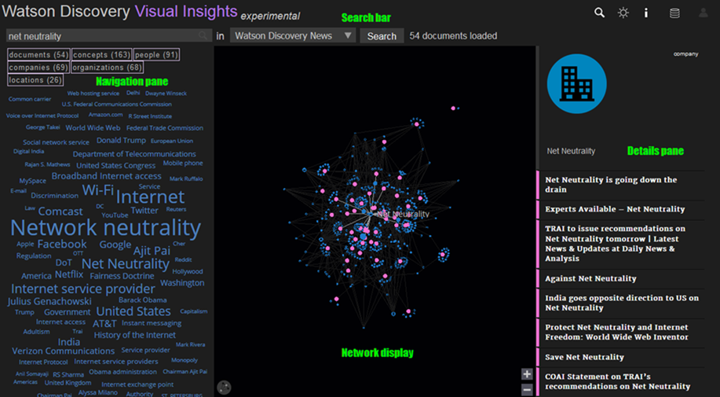

---

copyright:
  years: 2015, 2017
lastupdated: "2017-11-30"

---

{:shortdesc: .shortdesc}
{:new_window: target="_blank"}
{:tip: .tip}
{:pre: .pre}
{:codeblock: .codeblock}
{:screen: .screen}
{:javascript: .ph data-hd-programlang='javascript'}
{:java: .ph data-hd-programlang='java'}
{:python: .ph data-hd-programlang='python'}
{:swift: .ph data-hd-programlang='swift'}

# Watson Discovery Visual Insights
{: #visual-insights}

{{site.data.keyword.discoveryfull}} Visual Insights 是一个试验性功能，可以用于直观地浏览根据 {{site.data.keyword.discoveryshort}} 对语义元素、关系和概念等的理解而识别到的连接。

可以先使用 {{site.data.keyword.discoveryfull}} Visual Insights 来了解有关集合的更多信息，然后使用 {{site.data.keyword.discoveryshort}} 来创建查询；这些查询可以集成到新的应用程序或现有解决方案中，用于将用户定位到所需的信息。

在试验发行版中，Visual Insights 仅在公共环境中可用。

**免责声明：**Visual Insights 是一个试验性功能，这意味着它可能不稳定，可能会频繁更改，并且可能随时停止使用。提供此项是为了供您评估其功能。它提供的性能级别或兼容性可能与一般发布功能所提供的不同。此功能并非旨在用于生产环境，任何此类用途由您自行承担风险。请参阅 [Beta/试验性功能](/docs/services/discovery/release-notes.html#beta-features)以获取详细信息。

## Visual Insights 快速导览
{: #quick-tour-visual-insights}

Visual Insights 屏幕划分为 4 个主要区域。

### 搜索栏
{: #search-bar}

可以使用顶部的**搜索栏**来查询 {{site.data.keyword.discoveryshort}} 集合。

- 如果您已使用 {{site.data.keyword.Bluemix_notm}} 凭证登录，那么与您帐户关联的 {{site.data.keyword.discoveryshort}} 实例中的所有集合都可通过集合下拉列表使用（缺省情况下为 {{site.data.keyword.discoverynewsfull}}）。如果您尚未登录，那么只有 {{site.data.keyword.discoverynewsfull}} 集合可用。
- 选择您的集合，在搜索框中输入查询（例如，`What is net neutrality`），然后单击**搜索**按钮进行搜索。对于大型集合，可能需要一分钟或更长时间才会显示结果。可以通过单击`文档`、`概念`、`人员`、`位置`、`组织`或`公司`按钮来过滤搜索。
- 通过单击标题中的  图标，可以选择所显示结果（实体、概念或文档）中的任何项。
- 如果选择了专用集合且未输入查询，那么将在[“详细信息”窗格](/docs/services/discovery/visual-insights.html#details-pane)中显示最多 1000 个来自该集合的文档。如果选择了 {{site.data.keyword.discoverynewsshort}} 集合且未输入查询，那么将显示选择的 100 篇最近的文章。

### 网络显示
{: #network-display}

搜索栏下方的中心面板是**网络显示**。这是查询结果的交互式可视化。

- **网络显示**是从查询结果中抽取的文档、实体和概念的图形表示法。粉色节点表示文档；蓝色节点表示实体或概念。每个文档节点都会链接到 {{site.data.keyword.discoveryshort}} 在该文档中检测到的所有实体和概念节点。文档越相似，在可视化中彼此的距离越近。
- 将鼠标悬停在**网络显示**中的任一节点上将显示其关联的标题，并突出显示与其他节点的链接。
- 单击任一节点将在[“详细信息”窗格](/docs/services/discovery/visual-insights.html#details-pane)中显示有关该节点的信息。

### “详细信息”窗格
{: #details-pane}

“网络显示”右侧是**“详细信息”窗格**。

- “详细信息”窗格提供有关每个文档的更多详细信息，包括其分类和日期（如果可用）、简要摘录（带有用于打开完整文档的选项）以及该文档链接到的实体和概念。
- 如果在“网络显示”中选择了非文档节点，那么有关该节点的信息将显示在“详细信息”窗格顶部。
- 单击“详细信息”窗格中任一链接的实体或概念将在“网络显示”中选择相应的节点。

### 导航窗格
{: #navigation-pane}

“网络显示”左侧是**导航窗格**。此窗格提供从所选集合的查询结果中抽取的最常见词汇的标签云概述。词汇越大，在查询结果中越常见。

- 选择标签云中的任一词汇会将其变成粉红色，并在“网络显示”中突出显示与其关联的所有文档。“详细信息”窗格会显示已突出显示的文档的列表。标签云中的其他词汇现在会指示其与所选词汇的关系：
  - 灰显的词汇未与任何突出显示的文档关联。
  - 如果词汇变为紫色，说明该词汇与所有突出显示的文档相关联，因此对于尝试区分文档没有什么用。
  - 保持蓝色的词汇与某些（而不是全部）突出显示的文档相关联，因此可用于进一步优化突出显示的文档集。选择其中一个词汇会将突出显示的文档集减少为同时与这两个标记相关联的那些文档，并将“网络显示”区域缩小为那些文档所在的区域。使用此方法，仅通过几次单击，就可将大型文档集优化为较小的集。
- 要取消选择所选词汇，请再次单击该词汇。要清除所有所选词汇，请单击标签云中字词之间的空白处。单击灰色标记将清除现有选择项，并选择该词汇。
- 文档、人员、概念、组织、位置和公司的类型与计数会显示在标签云上方。单击其中任一项可过滤标签云以及“网络显示”可视化。

## 使用 Visual Insights
{: #using-visual-insights}

可以使用 Visual Insights 来查询 {{site.data.keyword.discoverynewsfull}}，而无需登录。为了将 Visual Insights 用于自己的集合，您需要：

- 包含 {{site.data.keyword.discoveryshort}} 实例的 {{site.data.keyword.Bluemix_notm}} 帐户。
- 该 {{site.data.keyword.discoveryshort}} 实例中已使用[实体抽取](/docs/services/discovery/building.html#entity-extraction)扩充项以及（可选）[概念标记](/docs/services/discovery/building.html#concept-tagging)、[关键字抽取](/docs/services/discovery/building.html#keyword-extraction)、[关系抽取](/docs/services/discovery/building.html#relation-extraction)和[类别分类](/docs/services/discovery/building.html#category-classification)扩充项中的任一项进行扩充的一个或多个集合。可能会包含其他扩充项，但 Visual Insights 不会表示这些扩充项。

有关 {{site.data.keyword.discoveryshort}} 以及有关如何开始免费使用的更多信息，请参阅 [Watson {{site.data.keyword.discoveryshort}} ](https://www.ibm.com/watson/services/discovery/){: new_window}。

一旦您拥有 {{site.data.keyword.Bluemix_notm}} 帐户、{{site.data.keyword.discoveryshort}} 实例以及一个或多个填充的集合后，您在登录时将在 Visual Insights 中看到这些集合。

登录到 Visual Insights

1. 打开 [{{site.data.keyword.discoveryshort}}Visual Insights ](https://visual-insights.bluemix.net){: new_window}。
1. 单击搜索栏中的  图标。
1. 输入您的 {{site.data.keyword.Bluemix_notm}} 标识和密码。片刻后，即可在搜索栏中选择您的集合。

## 提供反馈
{: #providing-feedback}

我们非常期待您对 {{site.data.keyword.discoveryshort}} Visual Insights 的反馈。要访问反馈链接，请单击标题中的  图标。
