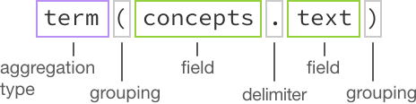

---

copyright:
  years: 2015, 2017
lastupdated: "2017-08-31"

---

{:shortdesc: .shortdesc}
{:new_window: target="_blank"}
{:tip: .tip}
{:pre: .pre}
{:codeblock: .codeblock}
{:screen: .screen}
{:javascript: .ph data-hd-programlang='javascript'}
{:java: .ph data-hd-programlang='java'}
{:python: .ph data-hd-programlang='python'}
{:swift: .ph data-hd-programlang='swift'}

# Discovery 保存檔

本主題包含可能仍然可用，但已由更新選項取代的 {{site.data.keyword.discoveryshort}} 特性的相關資訊。
{: tip}

## AlchemyLanguage 強化
{: #AlchemyLanguage-enrichments}

從 **2017 年 7 月 18 日**開始，{{site.data.keyword.discoveryfull}} 引進了一項新的強化技術，名稱為 {{site.data.keyword.nlushort}}。這些強化與您現有的強化相同，但需要稍微不同的配置和綱目。原始強化的名稱為 {{site.data.keyword.alchemylanguageshort}} 強化，將遭到淘汰，並將於 **2018 年 1 月 15 日**結束支援。

`2017-10-16` API 版本字串不再支援將新文件上傳至使用 {{site.data.keyword.alchemylanguageshort}} 強化的現有集合，也不再支援建立新集合及使用 {{site.data.keyword.alchemylanguageshort}} 強化來強化它們。請使用較早的 API 版本字串，以繼續使用 {{site.data.keyword.alchemylanguageshort}}，直到 **2018 年 1 月 15 日**結束支援為止。

以 AlchemyLanguage 強化的現有集合應儘快移轉到 Natural Language Understanding 強化。如需移轉利用 {{site.data.keyword.alchemylanguageshort}} 強化的集合及配置檔的相關資訊，請參閱[將強化移轉至 {{site.data.keyword.nlushort}}](/docs/services/discovery/migrate-nlu.html)。

**附註：**{{site.data.keyword.discoveryshort}} 工具一律使用最新的 API 版本字串，因此如果開頭為 `2017-10-16` API 版本字串，您將無法再將文件上傳至現有的 {{site.data.keyword.alchemylanguageshort}} 集合，或使用 {{site.data.keyword.discoveryshort}} 工具來建立利用 {{site.data.keyword.alchemylanguageshort}} 強化來強化的新集合。如果您要繼續使用 Discovery 工具來強化集合，請先將集合移轉至 Natural Language Understanding。如需詳細資料，請參閱[將強化移轉至 {{site.data.keyword.nlushort}}](/docs/services/discovery/migrate-nlu.html)。

### 實體擷取 (AlchemyLanguage)
{: #entity-extraction-al}

傳回在輸入文字中呈現的項目，例如人員、位置及組織。實體擷取會將語意知識新增至內容，以協助瞭解所分析文字的主旨及環境定義。實體擷取技術是以精密的統計演算法和自然語言處理程序技術為基礎，憑藉其對多語言分析、環境定義相關的釐清及引文擷取的支援，在業界獨一無二。

使用「實體擷取」強化的文件的部分範例：

```json
{
      "text": "The stockholders were pleased that Acme Corporation plans to build a new factory in Atlanta, Georgia.",
      "enriched-text": {
        "status": "OK",
        "language": "english",
        "entities": [
          {
            "type": "City",
            "relevance": 0.532754,
            "sentiment": {
              "type": "positive",
              "score": 0.527541,
              "mixed": false
            },
            "count": 1,
            "text": "Atlanta",
            "disambiguated": {
              "subType": [
                "AdministrativeDivision",
                "GovernmentalJurisdiction",
                "OlympicHostCity",
                "PlaceWithNeighborhoods"
              ],
              "name": "Atlanta",
              "website": "http://www.atlantaga.gov/",
              "dbpedia": "http://dbpedia.org/resource/Atlanta",
              "freebase": "http://rdf.freebase.com/ns/m.013yq"
            }
          }
        ]
      }
    }
```
{: codeblock}
在前述範例中，您可以透過存取 `enriched_text.entities.type` 來查詢實體類型

即使未選取**觀感**強化，也會計算實體類型的 `sentiment`。若要進一步瞭解觀感評分，請參閱[觀感分析](/docs/services/discovery/discovery-auxiliary.html#sentiment-analysis-al)。

`relevance` 評分範圍是從 `0.0` 到 `1.0`。評分越高，實體的相關性就越高。`disambiguated` 欄位包含實體的釐清資訊，其中包括實體 `subType` 資訊，以及資源的鏈結（適用的話）。`count` 是文件中提及實體的次數。

### 關鍵字擷取 (AlchemyLanguage)
{: #keyword-extraction-al}

在檢索資料、產生標籤雲或搜尋時通常會使用的內容中的重要主題。{{site.data.keyword.discoveryshort}} 服務會自動識別輸入內容中支援的語言，然後識別該內容中的關鍵字並進行分級。

使用「關鍵字擷取」強化的文件的部分範例：

```json
{
    "text": "The stockholders were pleased that Acme Corporation plans to build a new factory in Atlanta, Georgia.",
    "enriched-text": {
        "status": "OK",
        "language": "english",
        "keywords": [
          {
            "relevance": 0.66497,
            "sentiment": {
              "score": 0.527541,
              "type": "positive",
              "mixed": false
            },
            "text": "stockholders"
          }
        ]
      }
    }
```
{: codeblock}

在前述範例中，您可以透過存取 `enriched_text.keywords.text` 來查詢關鍵字

即使未選取**觀感**強化，也會計算關鍵字的 `sentiment`。若要進一步瞭解觀感評分，請參閱[觀感分析](/docs/services/discovery/discovery-auxiliary.html#sentiment-analysis-al)。

`relevance` 評分範圍是從 `0.0` 到 `1.0`。評分越高，關鍵字的相關性就越高。

### 分類架構分類 (AlchemyLanguage)
{: #taxonomy-classification-al}

將輸入文字、HTML 或 Web 型內容分類為多達五個層次的階層式分類架構。更深入的層次可讓您將內容分類為更精確且有用的子區段。

使用「分類架構分類」強化的文件的部分範例：

```json
  {
    "text": "The stockholders were pleased that Acme Corporation plans to build a new factory in Atlanta, Georgia.",
    "enriched-text": {
        "status": "OK",
        "language": "english",
        "taxonomy": [
          {
            "label": "/business and industrial/company/merger and acquisition",
            "score": 0.517533,
            "confident": false
          }
        ]
      }
    }
```
{: codeblock}

在前述範例中，您可以透過存取 `enriched_text.taxonomy.label` 來查詢分類架構標籤

`label` 是偵測到的分類架構種類。階層層次以正斜線區隔。該種類的 `score` 範圍是從 `0.0` 到 `1.0`。評分越高，該種類的信賴度就越高。

### 概念標記 (AlchemyLanguage)
{: #concept-tagging-al}

會根據存在於該文字中的其他概念和實體，識別與輸入文字相關聯的概念。概念標記瞭解概念之間的關係，而且可以識別文字中未直接參照的概念。例如，如果文章提及 CERN 和 Higgs boson，則概念 API 功能會將 Large Hadron Collider 識別為概念（即使頁面中並未明確提及該詞彙也一樣）。概念標記可以對輸入內容進行比基本關鍵字識別更高層次的分析。

使用「概念標記」強化的文件的部分範例：

```json
{
    "text": "The stockholders were pleased that Acme Corporation plans to build a new factory in Atlanta, Georgia.",
    "enriched_text": {
        "status": "OK",
        "language": "english",
        "concepts": [
          {
            "text": "Acme Corporation",
            "relevance": 0.91136,
            "dbpedia": "http://dbpedia.org/resource/Acme_Corporation",
            "freebase": "http://rdf.freebase.com/ns/m.0dndy",
            "yago": "http://yago-knowledge.org/resource/Acme_Corporation"
          }
        ]
      }
    }
```
{: codeblock}

在前述範例中，您可以透過存取 `enriched_text.concepts.text` 來查詢概念文字

`relevance` 評分範圍是從 `0.0` 到 `1.0`。評分越高，概念的相關性就越高。有提供資源的鏈結（適用的話）。

### 關係擷取 (AlchemyLanguage)
{: #relation-extraction-al}

識別輸入內容中句子內的主旨、動作及物件關係。關係資訊可用來自動識別購買信號、重要事件及其他重要動作。

使用「關係擷取」強化的文件的部分範例：

```json
{
      "text": "The stockholders were pleased that Acme Corporation plans to build a new factory in Atlanta, Georgia.",
      "enriched-text": {
        "status": "OK",
        "language": "english",
        "relations": [
          {
            "sentence": " The stockholders were pleased that Acme Corporation plans to build a new factory in Atlanta, GA.",
            "subject": {
              "text": "The stockholders",
              "keywords": [
                {
                  "text": "stockholders"
                }
              ]
            },
            "action": {
              "text": "were",
              "lemmatized": "be",
              "verb": {
              "text": "be",
              "tense": "past"
            }
            },
            "object": {
              "text": "pleased that Acme Corporation plans to build a new factory in Atlanta, GA",
              "sentiment": {
                "type": "positive",
                "score": 0.834516,
                "mixed": false
              },
              "entities": [
                {
                  "type": "Company",
                  "text": "Acme Corporation"
                },
                {
                  "type": "City",
                  "text": "Atlanta",
                  "disambiguated": {
                    "subType": [
                      "AdministrativeDivision",
                      "GovernmentalJurisdiction",
                      "OlympicHostCity",
                      "PlaceWithNeighborhoods"
                    ],
                    "name": "Atlanta",
                    "website": "http://www.atlantaga.gov/",
                    "dbpedia": "http://dbpedia.org/resource/Atlanta",
                    "freebase": "http://rdf.freebase.com/ns/m.013yq"
                  }
                },
                {
                  "type": "StateOrCounty",
                  "text": "GA"
                }
              ],
              "keywords": [
                {
                  "text": "Acme Corporation"
                },
                {
                  "text": "new factory"
                },
                {
                  "text": "GA"
                },
                {
                "text": "Atlanta"
                }
              ]
            }
          }
        ]
      }
    }
```
{: codeblock}

在前述範例中，您可以透過存取 `enriched_text.relations.subject.text` 來查詢關係主旨文字

即使未選取**觀感**強化，也會計算關係的 `sentiment`。若要進一步瞭解觀感評分，請參閱[觀感分析](/docs/services/discovery/discovery-auxiliary.html#sentiment-analysis-al)。除非您也選取**實體**和**關鍵字**強化，否則它不會擷取 `entities` 或 `keywords`（如下列範例所示）。如需那些強化的相關資訊，請參閱[實體擷取](/docs/services/discovery/discovery-auxiliary.html#entity-extraction-al)及[關鍵字擷取](/docs/services/discovery/discovery-auxiliary.html#keyword-extraction-al)。

會針對包含關係的每個句子，擷取 `subject`、`action` 及 `object`。

### 觀感分析 (AlchemyLanguage)
{: #sentiment-analysis-al}

識別要分析之內容中的態度、意見或感受。{{site.data.keyword.discoveryshort}} 服務可以計算文件內的整體觀感、使用者所指定目標的觀感、實體層次觀感、引文層次觀感、方向觀感及關鍵字層次觀感。這些功能的組合可支援範圍從社交媒體監視到趨勢分析的各種使用案例。

使用「觀感分析」強化的文件的部分範例：

```json
{
      "text": "The stockholders were pleased that Acme Corporation plans to build a new factory in Atlanta, Georgia.",
      "enriched_text": {
        "status": "OK",
        "language": "english",
        "docSentiment": {
          "type": "positive",
          "score": 0.0966252,
          "mixed": true
        }
      }
    }
```
{: codeblock}

在前述範例中，您可以透過存取 `enriched_text.docSentiment.type` 來查詢 docSentiment 類型

`type` 是文件的整體觀感（`positive`、`negative` 或 `neutral`）。觀感 `type` 是根據 `score`；`0.0` 的評分指出文件是 `neutral`，正數指出文件為 `positive`，負數指出文件為 `negative`。如果 `mixed` 為 `true`，則表示該文件同時包含正面和負面觀感（此欄位不是由 `score` 來決定）。

### 情緒分析 (AlchemyLanguage)
{: #emotion-analysis-al}

偵測英文字中隱含的生氣、厭惡、恐懼、歡樂及悲傷。「情緒分析」可以偵測與目標詞組、實體或關鍵字相關聯的情緒，也可以分析內容的整體情緒語氣。

使用「情緒分析」強化的文件的部分範例：

```json
{
      "text": "The stockholders were pleased that Acme Corporation plans to build a new factory in Atlanta, Georgia.",
      "enriched_text": {
        "status": "OK",
        "language": "english",
        "docEmotions": {
          "anger": "0.077394",
          "disgust": "0.044024",
          "fear": "0.092664",
          "joy": "0.553327",
          "sadness": "0.3969"
        }
      }
    }
```
{: codeblock}

在前述範例中，您可以透過存取 `enriched_text.docEmotions.joy` 來查詢 `joy` docEmotion

「情緒分析」會分析您的文字，並以 `0.0` 到 `1.0` 的刻度來計算每一種情緒（生氣、厭惡、恐懼、歡樂、悲傷）的評分。如果有任何情緒的評分為 `0.5` 或更高，則會偵測到該情緒（高於 `0.5` 的評分越高，相關性就越高）。在顯示的 Snippet 中，`joy` 的評分高於 0.5，因此 {{site.data.keyword.watson}} 偵測到 joy。


## Watson Discovery News Original

新版本的 {{site.data.keyword.discoverynewsfull}} 在 **2017 年 7 月 31 日**初次亮相。{{site.data.keyword.discoverynewsfull}} Original 已絕版，從 **2018 年 1 月 15 日**起不再提供服務。如需這個新版本的相關資訊，請參閱 [Watson Discovery News](watson-discovery-news.html)。

{{site.data.keyword.discoverynewsfull}} Original 是以英文為主且持續更新的新聞來源資料集，每天新增大約 300,000 篇新文章及部落格。這個檢索的資料集已使用下列 {{site.data.keyword.alchemylanguageshort}} 強化進行預先強化：**關鍵字擷取**、**實體擷取**、**概念標記**、**關係擷取**、**觀感分析**及**分類架構分類**。也新增了下列其他 meta 資料：搜索日期、發佈日期、URL 分級、主機分級及錨點文字。過去 60 天的新聞資料可供歷程搜尋。

{{site.data.keyword.discoverynewsfull}} Original 是使用 {{site.data.keyword.alchemylanguageshort}} 強化來強化。如需這些強化的相關資訊，請參閱 [{{site.data.keyword.alchemylanguageshort}} 強化](discovery-auxiliary.html#AlchemyLanguage-enrichments)。

### 查詢 Watson Discovery News Original

新版本的 {{site.data.keyword.discoverynewsfull}} 在 **2017 年 7 月 31 日**初次亮相。{{site.data.keyword.discoverynewsfull}} Original 已絕版，從 **2018 年 1 月 15 日**起不再提供服務。如需這個新版本的相關資訊，請參閱 [Watson Discovery News](watson-discovery-news.html)。

**附註：**對 Watson Discovery News 查詢傳回的結果數上限為 `50`。使用其他查詢及 `offset` 參數，可傳回超過 `50` 個結果。

{{site.data.keyword.discoverynewsfull}} Original 使用類似但稍微不同於專用集合所使用的 JSON 綱目。您不需要在查詢中包括 `enriched_text`，例如：

**如何建構 {{site.data.keyword.discoverynewsfull}} Original 查詢**


下列查詢範例會傳回 {{site.data.keyword.discoverynewsfull}} Original 中關於 Pittsburgh Steelers 且具有正面觀感的前十篇文章。

1.  在**管理資料**畫面上，選擇 {{site.data.keyword.discoverynewsfull}} 集合。
1.  按一下**檢視資料綱目**，然後按一下**建置查詢**。
1.  在**搜尋文件**下，按一下**使用 {{site.data.keyword.discoveryshort}} 查詢語言**，然後於**在這裡輸入查詢**欄位中輸入 `text:cittsburgh Steelers, docSTentiment.type:positive`。
1.  按一下**其他選項**，然後在 `Number of documents to return`（要傳回的文件數）欄位中輸入 `10`（這是預設值）。
1.  按一下**執行查詢**。即會顯示關於 Pittsburgh Steelers 且具有正面觀感的前十篇文章。

**其他的 {{site.data.keyword.discoverynewsfull}} Original 查詢範例**

-  `concepts.text:"Health care"` - 在**搜尋文件**下，按一下**使用 {{site.data.keyword.discoveryshort}} 查詢語言**，然後輸入此查詢。它會傳回包含 `health care` 概念的所有文章。如果您在**要傳回的文件數**欄位中指定一個計數（例如 50），則只會收到前 50 篇最相關的文章。

**如何建構 {{site.data.keyword.discoverynewsfull}}Original 聚集**



下列聚集範例會依觀感傳回 {{site.data.keyword.discoverynewsfull}} Original 中所找到關於 Pittsburgh Steelers 的文章數。

1.  在**管理資料**畫面上，選擇 {{site.data.keyword.discoverynewsfull}} Original 集合。
1.  按一下**檢視資料綱目**，然後按一下**建置查詢**。
1.  在**包含結果的分析**下，於**使用 {{site.data.keyword.discoveryshort}} 查詢語言撰寫聚集查詢**欄位中，輸入 `filter(text:"Pittsburgh Steelers").term(docSentiment.type,count:3)`。
1.  按一下**其他選項**，然後在**要傳回的文件數**欄位中輸入 `0`。
1.  按一下**執行查詢**。結果會顯示關於 Pittsburgh Steelers 的文件數，以及其中有多少結果具有 `positive`、`negative` 或 `neutral` docSentiment。

**其他 {{site.data.keyword.discoverynewsfull}} Original 聚集範例**

-  `filter(entities.text:twitter).term(docSentiment.type,count:3)` - 如果您在**使用 {{site.data.keyword.discoveryshort}} 查詢語言撰寫聚集查詢**欄位中輸入此聚集查詢，它會先將文章集縮減（過濾）為只包含 twitter 實體文字的文章，然後依觀感類型來劃分那些文章。只會傳回前三個文件觀感類型（`positive`、`negative`、`neutral`）。

在聚集查詢之前新增 `nested`，會將聚集限制為所指定結果的區域。例如：`nested(text.entities)` 表示只會使用任何結果的 `text.entities` 元件來執行聚集。透過查看下列兩個查詢之間的差異，可輕易看到此影響：`filter(text.entities.type::City)` - 此聚集會計算包含一個以上的 `entity` 且類型為 `City` 的*結果* 數，以及 `nested(text.entities).filter(text.entities.type::City)` - 此聚集會計算結果中類型為 `city` 的 `entity` 的實例數。此外，任何後續作業都會進一步限制可執行聚集的結果集。例如，`nested(text.entities).filter(text.entities.type::City)` 表示只會聚集 `type::City` 的實體。例如：`nested(text.entities).filter(text.entities.type::City).term(text.entities.text,count:3)` 會聚集 `City` 類型的前三個實體，而 `filter(text.entities.type::City).term(text.entities.text,count:3)` 將傳回前三個實體，其結果至少包含 `City` 類型的一個實體。

**附註**：您無法調整 {{site.data.keyword.discoverynewsfull}} Original 配置、訓練或將文件新增至此集合。

## 使用 AlchemyLanguage 強化與 Watson Knowledge Studio 整合

您可以透過 {{site.data.keyword.knowledgestudiofull}} 來整合自訂模型與 {{site.data.keyword.discoveryshort}} 服務，以提供自訂強化。
{: shortdesc}

### 開始之前

在透過 {{site.data.keyword.knowledgestudioshort}} 來整合自訂模型與 {{site.data.keyword.discoveryshort}} 服務之前，您必須先使用 {{site.data.keyword.knowledgestudioshort}} 建立及部署該模型。如需建立及部署模型的相關資訊，請參閱 {{site.data.keyword.knowledgestudioshort}} 文件。您需要所部署模型的唯一 ID，才能將它與 {{site.data.keyword.discoveryshort}} 服務整合。

### 關於此作業

您可以使用在 {{site.data.keyword.knowledgestudioshort}} 中開發的自訂模型，來強化 {{site.data.keyword.discoveryshort}} 服務中的文件。這可讓您使用特定焦點區域的特有資訊來彈性地套用 {{site.data.keyword.discoveryshort}} 服務的文件強化功能，例如產業或科學紀律。您可以在強化模型中同時使用公用資料和您自己專屬的資料。

您必須使用服務 API 來整合 {{site.data.keyword.knowledgestudioshort}} 模型與 {{site.data.keyword.discoveryshort}} 服務。您不能使用 {{site.data.keyword.discoveryshort}} 工具來整合自訂模型。

### 程序

1.  取得 {{site.data.keyword.discoveryshort}} 環境的 ID，如[列出環境 ](https://www.ibm.com/watson/developercloud/discovery/api/v1/#list_environments){: new_window} 所述。記下環境 ID。
1.  列出現行 {{site.data.keyword.discoveryshort}} 配置的 ID，如[列出配置 ](https://www.ibm.com/watson/developercloud/discovery/api/v1/#list_configurations){: new_window} 所述。記下您要與 {{site.data.keyword.knowledgestudiofull}} 自訂模型整合的配置 ID。
1.  在 Bash Shell 或同等環境（例如 Cygwin for Windows）中執行下列指令，以下載現行 {{site.data.keyword.discoveryshort}} 配置的副本。將 `{environment_id}` 和 `{configuration_id}` 替換為您在前兩個步驟中記下的 ID。

    ```bash
    curl -u "{username}":"{password}" "https://gateway.watsonplatform.net/discovery/api/v1/environments/{environment_id}/configurations/{configuration_id}?version=2017-09-01" > my_config.json
    ```
    {: pre}

    此指令列出集合檔案的內容，並將它們放置在名稱為 `my_config.json` 的 JSON 檔案中。
1.  在文字編輯器中開啟 `my_config.json` 檔案，並進行下列變更：
    1.  變更 `"name"` 欄位的值，以指出新配置的用途。您也可以選擇性地變更 `"description"` 欄位的值。

        ```json
        ...
        "name": "wks-config",
        "description": "This is a configuration to use with a WKS model",
        ...
        ```
        {: codeblock}

    1.  使用 {{site.data.keyword.knowledgestudioshort}} 模型的資訊來更新強化欄位。假設強化欄位最初如下所示：

        ```json
        "enrichments": [
          {
            "destination_field": "enriched_text",
            "source_field": "text",
            "enrichment": "alchemy_language",
            "options": {
              "extract": "keyword, entity, doc-sentiment, taxonomy, concept, relation",
              "sentiment": true,
              "quotations": true
            }
          }
        ]
        ```
        {: codeblock}

    1.  如下所示更新檔案，以「開始之前」所描述的 {{site.data.keyword.knowledgestudioshort}} 模型的唯一 ID 來替換 `{watson_knowledge_studio_model_ID}`。

        ```json
        "enrichments": [
          {
            "destination_field": "enriched_text",
            "source_field": "text",
            "enrichment": "alchemy_language",
            "options": {
              "extract": "keyword, entity, doc-sentiment, taxonomy, concept, relation, typed-rels",
              "sentiment": true,
              "quotations": true,
              "model": "{watson_knowledge_studio_model_ID}"
            }
          }
        ]
        ```
        {: codeblock}

1.  選擇性地啟用實體正規化，如[建立自訂配置以將實體正規化](/docs/services/discovery/normalize-entities.html)中所述。
1.  儲存 `my_config.json` 檔案。
1.  使用 JSON 驗證器（例如 [JSLint ](http://jslint.com){: new_window}）來驗證，必要的話，請先更正您所編輯的 JSON，然後再執行下一步。
1.  如下所示更新配置。同樣地，您需要在此程序開始時所收集的 `{environment_id}` 和 `{configuration_id}` ID。

    ```bash
    curl -X PUT -u "{username}":"{password}" -H "Content-Type: application/json" -d @my_config.json "https://gateway.watsonplatform.net/discovery/api/v1/environments/{environment_id}/configurations/{configuration_id}?version=2017-09-01"
    ```
    {: pre}

    這個指令會傳回已更新配置檔的內容。
1.  正常使用 {{site.data.keyword.discoveryshort}} 服務。您以更新的配置所汲取的文件會使用自訂模型的資料自動強化。

## 建立自訂配置以將 AlchemyLanguage 實體正規化
{: #normalizing-entities}

您可以配置 {{site.data.keyword.discoveryshort}} 服務，使其在查詢的輸出中包含*正規化實體*（也稱為*標準名稱*）。
{: shortdesc}

**附註：**編輯配置以啟用正規化實體是一項手動作業，必須利用文字編輯器和 API 呼叫來執行。「工具」目前不支援它。

**附註：**只有當您將 Discovery 服務與 Watson Knowledge Studio 產生的自訂模型搭配使用時，才能使用實體正規化，如[與 {{site.data.keyword.knowledgestudiofull}} 整合](/docs/services/discovery/integrate-wks.html)中所述。

實體正規化會將不同參照的正規化（標準）名稱插入至來源文件中的相同人員或物件。例如，如果您啟用實體正規化，然後汲取討論 "J.R. Cash" 和 "John R. Cash" 的文件，則所處理的輸出將包含 `canonical_name` "Johnny Cash" 以及每一個符合的詞彙。它也會包含文件中發現的其他文字實體的相關標準名稱。如需輸出範例，請參閱本節結尾。

使用標準名稱強化文件之後，您可以更輕鬆地搜尋具有相同標準名稱的特定項目。

標準名稱是從公用字典衍生而來。如果在字典中找不到合適的標準名稱，則該服務會使用文件中最合適的實體參照作為標準名稱。在查詢實體正規化文件以找出標準名稱之前，請檢查強化的 JSON 文件，以驗證該服務所產生的標準名稱符合您預期的名稱。

### 程序

1.  取得 {{site.data.keyword.discoveryshort}} 環境的 ID，如[列出環境 ](https://www.ibm.com/watson/developercloud/discovery/api/v1/#list_environments){: new_window} 所述。記下環境 ID。
1.  列出現行 {{site.data.keyword.discoveryshort}} 配置的 ID，如[列出配置 ](https://www.ibm.com/watson/developercloud/discovery/api/v1/#list_configurations){: new_window} 所述。記下您要更新的配置 ID。
1.  在 Bash Shell 或同等環境（例如 Cygwin for Windows）中執行下列指令，以下載現行 {{site.data.keyword.discoveryshort}} 配置的副本。將 `{environment_id}` 和 `{configuration_id}` 替換為您在前兩個步驟中記下的 ID。

    ```bash
    curl -u "{username}":"{password}" "https://gateway.watsonplatform.net/discovery/api/v1/environments/{environment_id}/configurations/{configuration_id}?version=2017-09-01" > new_config.json
    ```
    {: pre}

    此指令列出集合檔案的內容，並將它們放置在名稱為 `new_config.json` 的 JSON 檔案中。

1.  在文字編輯器中開啟 `new_config.json` 檔案，並進行下列變更：
    1. 變更 `"name"` 欄位的值，以指出新配置的用途。您也可以選擇性地變更 `"description"` 欄位的值。

       ```json
        ...
        "name": "normalize-entities-config",
        "description": "This configuration enables entity normalization",
        ...
       ```
       {: codeblock}

    1. 使用 {{site.data.keyword.knowledgestudioshort}} 模型的資訊來更新強化欄位。假設強化欄位最初如下所示：

       ```json
       "enrichments": [
         {
           "destination_field": "enriched_text",
           "source_field": "text",
           "enrichment": "alchemy_language",
           "options": {
             "extract": "keyword, entity, doc-sentiment, taxonomy, concept, relation, typed-rels",
             "sentiment": true,
             "quotations": true,
             "model": "{watson_knowledge_studio_model_ID}"
           }
         }
       ]
       ```
       {: codeblock}

    1. 如下所示更新檔案。

       ```json
       "enrichments": [
         {
           "destination_field": "enriched_text",
           "source_field": "text",
           "enrichment": "alchemy_language",
           "options": {
             "extract": "keyword, entity, doc-sentiment, taxonomy, concept, relation, typed-rels",
             "sentiment": true,
             "quotations": true,
             "model": "{watson_knowledge_studio_model_ID}"
             "normalizeEntities": 1
           }
         }
       ]
       ```
       {: codeblock}

    1. 儲存 `new_config.json` 檔案。

1.  使用 JSON 驗證器（例如 [JSLint ](http://jslint.com){: new_window}）來驗證您所編輯的 JSON，然後再執行下一步。

1.  如下所示更新配置。同樣地，您需要在此程序開始時所收集的 `{environment_id}` 和 `{configuration_id}` ID。

    ```bash
    curl -X PUT -u "{username}":"{password}" -H "Content-Type: application/json" -F configuration-@new_config.json "https://gateway.watsonplatform.net/discovery/api/v1/environments/{environment_id}/configurations/{configuration_id}?version=2017-09-01"
    ```
    {: pre}

    這個指令會傳回已更新配置檔的內容。

1.  正常使用 {{site.data.keyword.discoveryshort}} 服務。您以更新的配置所汲取的文件會自動使用正規化實體來強化，如下列輸出摘錄所示。

### 輸出範例

輸出 Snippet（**不含** `"normalizeEntities": 1`）：

```json
{
  "enriched_text": {
  ...
  ...
  ...
    "entity_relations": {
      "entities": {
        "entity": [
          {
            "class": "SPC",
            "eid": "-E0",
            "generic": false,
            "level": "NAM",
            "mentref": [
              {
                "mid": "-M0",
                "text": "J.R. Cash"
              },
              {
                "mid": "-M6",
                "text": "musician"
              },
              {
                "mid": "-M7",
                "text": "who"
              },
              {
                "mid": "-M13",
                "text": "He"
              },
              {
                "mid": "-M20",
                "text": "He"
              }
            ],
            "score": 0.7874817061794613,
            "subtype": "OTHER",
            "type": "PERSON"
          },
        ...
        ...
        ...
        ]
      },
      "relations": {
        "relation": [
          {
            "rel_entity_arg": [
              {
                "argnum": 1,
                "eid": "-E0"
              },
              {
                "argnum": 2,
                "eid": "-E1"
              }
            ],
            "relmentions": {
              "relmention": [
                {
                  "class": "SPECIFIC",
                  "modality": "ASSERTED",
                  "rel_mention_arg": [
                    {
                      "argnum": 1,
                      "mid": "-M0",
                      "text": "John R. Cash",
                    },
                    {
                      "argnum": 2,
                      "mid": "-M1",
                      "text": "country"
                    }
                  ],
                  "rmid": "-R1-1",
                  "score": 0.49918343781296,
                  "tense": "UNSPECIFIED"
                }
              ]
            },
            "rid": "-R1",
            "subtype": "OTHER",
            "type": "knownAs"
          },
          ...
          ...
          ...
        ]
      }
    }
  }
}
```
{: codeblock}

輸出 Snippet（**含有** `"normalizeEntities": 1`）：

```json
{
  "enriched_text": {
  ...
  ...
  ...
    "entity_relations": {
      "entities": {
        "entity": [
          {
            "class": "SPC",
            "eid": "-E0",
            "generic": false,
            "level": "NAM",
            "mentref": [
              {
                "mid": "-M0",
                "text": "J.R. Cash"
              },
              {
                "mid": "-M6",
                "text": "musician"
              },
              {
                "mid": "-M7",
                "text": "who"
              },
              {
                "mid": "-M13",
                "text": "He"
              },
              {
                "mid": "-M20",
                "text": "He"
              }
            ],
            "score": 0.7874817061794613,
            "subtype": "OTHER",
            "type": "PERSON",
            "canonical_name": "Johnny Cash"
          },
        ...
        ...
        ...
        ]
      },
      "relations": {
        "relation": [
          {
            "rel_entity_arg": [
              {
                "argnum": 1,
                "eid": "-E0"
              },
              {
                "argnum": 2,
                "eid": "-E1"
              }
            ],
            "relmentions": {
              "relmention": [
                {
                  "class": "SPECIFIC",
                  "modality": "ASSERTED",
                  "rel_mention_arg": [
                    {
                      "argnum": 1,
                      "mid": "-M0",
                      "text": "John R. Cash",
                      "canonical_name": "Johnny Cash"
                    },
                    {
                      "argnum": 2,
                      "mid": "-M1",
                      "text": "country",
                      "canonical_name": "country music"
                    }
                  ],
                  "rmid": "-R1-1",
                  "score": 0.49918343781296,
                  "tense": "UNSPECIFIED"
                }
              ]
            },
            "rid": "-R1",
            "subtype": "OTHER",
            "type": "knownAs"
          },
          ...
          ...
          ...
        ]
      }
    }
  }
}
```
{: codeblock}
