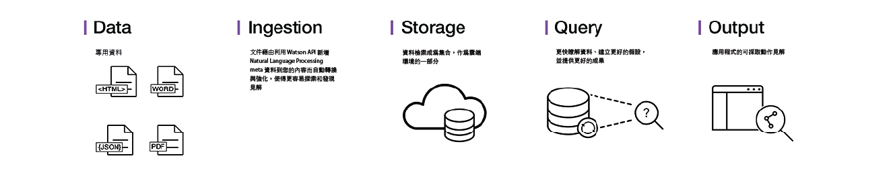

---

copyright:
  years: 2015, 2018
lastupdated: "2018-09-07"

---

{:shortdesc: .shortdesc}
{:new_window: target="_blank"}
{:tip: .tip}
{:pre: .pre}
{:codeblock: .codeblock}
{:screen: .screen}
{:javascript: .ph data-hd-programlang='javascript'}
{:java: .ph data-hd-programlang='java'}
{:python: .ph data-hd-programlang='python'}
{:swift: .ph data-hd-programlang='swift'}

# 關於

{{site.data.keyword.discoveryfull}} 可讓您快速建置認知、雲端型探索應用程式，來揭露非結構化資料中所隱藏之可採取動作的見解 - 包括您自己的專屬資料，以及公用資料和協力廠商資料。
{: shortdesc}

這是完整的 {{site.data.keyword.discoveryshort}} 服務解決方案架構：

有了 {{site.data.keyword.discoveryshort}}，只需要幾個步驟即可準備非結構化資料、建立查詢來精確找出您需要的資訊，然後將那些見解整合到新的應用程式或現有的解決方案中。

{{site.data.keyword.discoveryshort}} 如何做到？利用結合了認知直覺的資料分析來取得非結構化資料並強化它，您可以探索需要的資訊。

{{site.data.keyword.discoveryfull}} 結合一套功能豐富的整合型自動化 {{site.data.keyword.watson}} API 來達成下列目的：

- 搜索、轉換、強化及正規化資料。
- 安全地探索您的專屬內容，以及免費和授權的公用內容。
- 透過 {{site.data.keyword.nlushort}} (NLU) 來套用其他的強化，例如概念、關係和觀感。
- 簡化開發，同時仍提供 API 的直接存取。

如需語言支援的相關資訊，請參閱 [{{site.data.keyword.discoveryshort}} 語言支援](/docs/services/discovery/language-support.html)。

如需 {{site.data.keyword.Bluemix_notm}} 安全的相關資訊，請參閱 [{{site.data.keyword.Bluemix_notm}} 服務說明 ](https://www.ibm.com/software/sla/sladb.nsf/searchsaas/?searchview&searchorder=4&searchmax=0&query=%28IBM+Cloud+Service+description%29){: new_window}

{{site.data.keyword.discoveryfull}} Knowledge Graph 是測試版特性，可提供新的端點來查詢文件之間的實體及關係。這包括以上下文為基礎的搜尋和相關性分級。如需相關資訊，請參閱 [{{site.data.keyword.discoveryfull}} Knowledge Graph](/docs/services/discovery/building-kg.html)。

## 瀏覽器支援及必要條件

如需 {{site.data.keyword.Bluemix}} 必要條件及支援的瀏覽器清單，請參閱[必要條件 ](https://console.bluemix.net/docs/overview/prereqs.html#prereqs){: new_window}。

## Watson Discovery News
{: #watson-discovery-news}

{{site.data.keyword.discoverynewsshort}} 是一個已利用認知見解預先強化的公用資料集，它也隨附於 {{site.data.keyword.discoveryshort}} 中。您可以使用這個公用的非結構化資料集來查詢見解，以將這些見解整合至應用程式中。如需相關資訊，請參閱 [Watson Discovery News](/docs/services/discovery/watson-discovery-news.html#watson-discovery-news)。請參閱[這裡 ](https://discovery-news-demo.ng.bluemix.net/){: new_window}，它示範使用 {{site.data.keyword.discoverynewsshort}} 可建置的內容。

[{{site.data.keyword.Bluemix_notm}} ](https://console.ng.bluemix.net/catalog/services/discovery/){: new_window} 有提供 {{site.data.keyword.discoveryshort}} 服務

## Discovery 工具
{: #discovery-tooling}

{{site.data.keyword.discoveryshort}} 服務包含一套完整的線上工具（{{site.data.keyword.discoveryshort}} 工具），可協助您快速設定服務的實例，並在其中移入資料。

{{site.data.keyword.discoveryshort}} 服務工具已設計為不需要使用 API 即可配置服務並在其中移入資料，藉此節省時間。這可讓應用程式開發人員專注在建立高價值的方法，讓一般使用者體驗 {{site.data.keyword.discoveryshort}} 服務。如需 {{site.data.keyword.discoveryshort}} 工具的簡介，請參閱[開始使用工具](/docs/services/discovery/getting-started-tool.html)。

## 後續步驟
{: #next-steps}

- 開始使用 {{site.data.keyword.discoveryshort}} 工具或 {{site.data.keyword.discoveryshort}} API：
    - [開始使用 {{site.data.keyword.discoveryshort}} 工具](/docs/services/discovery/getting-started-tool.html)
    - [開始使用 {{site.data.keyword.discoveryshort}} API](/docs/services/discovery/getting-started.html)
- {{site.data.keyword.discoveryshort}} 服務支援許多 SDK 來簡化應用程式的開發。SDK 適用於許多熱門程式設計語言和平台，包括 Node.js、Java 及 Python。在 GitHub 上，可以從 [watson-developer-cloud 名稱空間 ](https://github.com/watson-developer-cloud){: new_window} 取得所有 SDK。
    - 如需 SDK 的完整清單及使用它們的相關資訊，請參閱 [{{site.data.keyword.watson}}SDK](https://console.bluemix.net/docs/services/watson/getting-started-sdks.html#sdks)。
    - 如需 Node、Java 及 Python SDK 之所有方法的詳細資訊，請參閱 [API 參考資料 ](https://www.ibm.com/watson/developercloud/discovery/api/v1/curl.html?curl){: new_window}。
