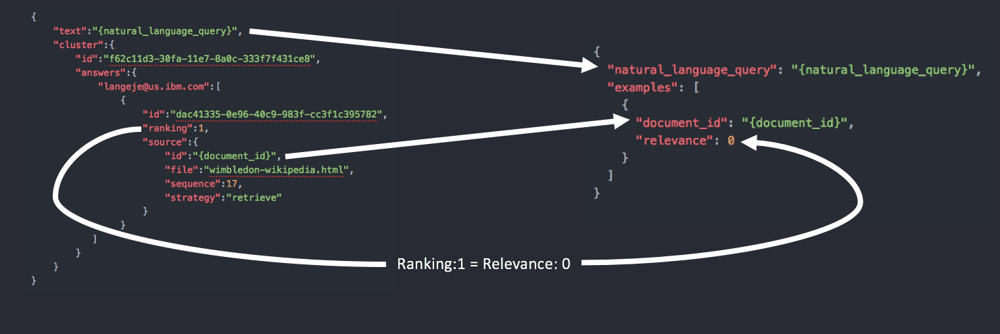

---

copyright:
  years: 2015, 2017
lastupdated: "2017-10-03"

subcollection: discovery

---

{:shortdesc: .shortdesc}
{:new_window: target="_blank"}
{:tip: .tip}
{:note: .note}
{:pre: .pre}
{:important: .important}
{:deprecated: .deprecated}
{:codeblock: .codeblock}
{:screen: .screen}
{:download: .download}
{:hide-dashboard: .hide-dashboard}
{:apikey: data-credential-placeholder='apikey'} 
{:url: data-credential-placeholder='url'}
{:curl: #curl .ph data-hd-programlang='curl'}
{:javascript: .ph data-hd-programlang='javascript'}
{:java: .ph data-hd-programlang='java'}
{:python: .ph data-hd-programlang='python'}
{:ruby: .ph data-hd-programlang='ruby'}
{:swift: .ph data-hd-programlang='swift'}
{:go: .ph data-hd-programlang='go'}


# 從 Watson Document Conversion 及 Retrieve and Rank 移轉
{: #migrate-dcs-rr}

{{site.data.keyword.documentconversionfull}} 和 {{site.data.keyword.retrieveandrankfull}} 已淘汰並取代為 {{site.data.keyword.discoveryfull}}。一般而言，這兩項服務會一起使用，來進行汲取、分級，然後將結果遞送至應用程式。提供本文件是為了引導您完成從 {{site.data.keyword.documentconversionshort}} 及 {{site.data.keyword.retrieveandrankshort}} 移轉至 {{site.data.keyword.discoveryshort}} 的處理程序。

{{site.data.keyword.discoveryfull}} 提供更健全的查詢介面、簡化的資料汲取、改良的訓練管理，以及增加的等級。{{site.data.keyword.discoveryshort}} 可解決許多與 {{site.data.keyword.retrieveandrankshort}} 相同的核心使用案例，包括支援代理程式協助、組織知識庫搜尋及研究協助。它在建置時考量到 {{site.data.keyword.retrieveandrankshort}} 的使用者所面臨的許多挑戰，因此能解決其中許多問題。對於 {{site.data.keyword.retrieveandrankshort}} 未提供的資訊擷取，{{site.data.keyword.discoveryshort}} 也提供了新功能，包括段落擷取及改良的搜尋演算法，用來找到更相關的結果。

**特性比較**
{: #features-dcs-rr}

|特性 | {{site.data.keyword.retrieveandrankshort}} | {{site.data.keyword.discoveryshort}} |
|:-------------|:--------------------:|:-------------:|
|自然語言搜尋|是|是|
|機器學習相關性訓練|是|是|
|訓練的使用者介面工具|是|是|
|JSON 回答單元輸入|是|是|
|文件分割|是|是|
|段落擷取|   |是|
|文件 CRUD |是|是|
|批次 JSON 上傳|是|   |
|自動文件 NLP 強化|   |是|
|用於強化的自訂 NLP 模型整合|   |是|
|儲存在服務中的訓練資料|   |是|
|自動化模型生命週期管理|   |是|
|在沒有訓練的情況下，可改進相關性的語意相似性|   |是|
|在工具中根據測試集的正確性測量|是|   |
|自訂特性向量支援|是|   |
|自訂分析器配置|是|預先配置|
|自訂停用字詞|是|預先配置|
|自訂語言字典|是|預先配置|
|自訂同義字|是|是|
**附註：**新增 {{site.data.keyword.discoveryshort}} 的新功能時，將更新此表格。


在開始移轉動作之前，您必須先[評估](#evaluate) {{site.data.keyword.retrieveandrankshort}} 服務中儲存的資料，並瞭解如何移動構成現行解決方案的不同元件。

大部分客戶會將 {{site.data.keyword.documentconversionshort}} 與 {{site.data.keyword.retrieveandrankshort}} 一起使用。如果您未使用 {{site.data.keyword.documentconversionshort}} 來轉換內容，使它可以儲存在可搜尋的索引中，請繼續檢閱[移轉獨立式 {{site.data.keyword.documentconversionshort}} 的選項](#dcs)。

如果您最初使用 {{site.data.keyword.retrieveandrankshort}} 指導教學，並以該指導教學作為您專屬之服務實例的基礎，則可以在[這裡](/docs/services/discovery?topic=discovery-migrate-rnr#migrate-rnr)找到如何將相同資料汲取至 {{site.data.keyword.discoveryshort}} 的指導教學延伸。

**附註：**轉換和強化功能隨附於 {{site.data.keyword.discoveryshort}}。如果您已使用 {{site.data.keyword.documentconversionshort}} 及（或）{{site.data.keyword.nlushort}} 來轉換及強化來源 HTML、PDF 或 Microsoft Word 文件，則這些服務將取代為 {{site.data.keyword.discoveryshort}} 服務內的特性。

## 評估您到 Watson Discovery 服務的移轉路徑
{: #evaluate}

從 {{site.data.keyword.retrieveandrankshort}} 移轉有兩個實用選項：從來源內容移轉，以及從檢索的內容移轉。在決定要使用哪一個選項之前，請先評估這兩個選項。

### 從來源內容移轉
{: #source}

為了從來源內容移轉，您將：

-  需要對從中汲取內容的原始檔具有存取權。
-  需要以程式設計方式擷取每一個文件的 ID（結果在檢索之前已具有 ID）

如果您可以符合所有的移轉準則，建議您使用此方法來移至 {{site.data.keyword.discoveryshort}} 服務。

若要移轉您的來源內容，請修改[移轉指導教學](/docs/services/discovery?topic=discovery-migrate-rnr#migrate-rnr)中所描述的程序，以符合來源資料的特性。

#### 移轉回答單元
{: #answerunit-dcs-rr}

如果您使用 {{site.data.keyword.documentconversionshort}} 來建立回答單元，請選擇下列其中一個選項來移轉該內容：

-  如果您已訓練分級者，且需要移轉等級，您應該採用從 {{site.data.keyword.documentconversionshort}} 傳回的內容，並將該內容汲取至 {{site.data.keyword.discoveryshort}}
-  如果您沒有任何訓練資料可移轉，請使用[文件分段特性](/docs/services/discovery?topic=discovery-configservice#doc-segmentation)，將原始來源文件汲取至 {{site.data.keyword.discoveryshort}}

### 從檢索的內容移轉
{: #indexed}

如果您沒有原始來源文件的存取權，則應該從 {{site.data.keyword.retrieveandrankshort}} 中檢索的內容移轉，或：

- 您使用了自動文件 ID 產生功能，且已訓練分級者。
- 已在 {{site.data.keyword.documentconversionshort}} 中建立回答單元，並將其分級，但未保留由 {{site.data.keyword.documentconversionshort}} 服務所產生的回答單元。

**附註：**只有當所有必要內容都在 {{site.data.keyword.retrieveandrankshort}} 中的已儲存欄位時，才能使用此方法。如果僅檢索內容但未儲存內容，則無法在服務中查詢該內容，而且必須從來源重新轉換及分割資料。

會使用 [/v1/solr_clusters/{solr_cluster_id}/solr/\{collection_name\}/select ](https://www.ibm.com/watson/developercloud/retrieve-and-rank/api/v1/#index_doc){: new_window} 方法，利用空白查詢 `q=*:*` 從服務中擷取文件。傳回的文件數可能會超過實際的傳回計數上限（大部分集合的上限為 `200`）。如果是這種情況，則應該使用適當的[分頁 ](https://lucene.apache.org/solr/guide/6_6/pagination-of-results.html){: new_window} 來發出多個呼叫，以收集所有文件。

具有指定 **ID** 的文件會使用 [/v1/environments/\{environment_id\}/collections/\{collection_id\}/documents/\{document_id\} ](https://{DomainName}/apidocs/discovery#update-a-document){: new_window} 方法上傳至 {{site.data.keyword.discoveryshort}} 服務。每一個文件上傳都是個別的 API 呼叫。

## 移轉訓練資料
{: #trainingdata-dcs-rr}

在移轉結果之後，下一步是移轉已針對內容建立的任何訓練資料。移轉訓練資料有兩個選項：從來源（`csv`）移轉，以及從服務移轉。如果您已從 `csv` 檔案上傳訓練資料，而且仍然具有該檔案的存取權，則應該從來源移轉。如果您使用 {{site.data.keyword.retrieveandrankshort}} 工具，或沒有原始 `csv` 檔案的存取權，則應該從服務移轉。

### 從來源內容移轉訓練
{: #csv}

為了從分級來源內容移轉，您將：

- 需要對原本上傳其訓練資訊的原始來源 `csv` 檔案具有存取權。
- 確保在其中檢索的已訓練文件的 ID 符合在 {{site.data.keyword.retrieveandrankshort}} 中檢索的已訓練文件的 ID。

如果您可以符合所有的移轉準則，建議您使用此方法將訓練移至 {{site.data.keyword.discoveryshort}} 服務。

若要移轉您的訓練資料，請修改[移轉指導教學](/docs/services/discovery?topic=discovery-migrate-rnr#migrate-rnr)中所描述的程序，以符合來源資料的特性。

### 從服務移轉訓練資料
{: #extract-train}

若要從 {{site.data.keyword.retrieveandrankshort}} 服務移轉訓練資料，您將需要：使用 {{site.data.keyword.retrieveandrankshort}} API 擷取訓練資料，將 {{site.data.keyword.retrieveandrankshort}} 訓練 JSON 轉換成 {{site.data.keyword.discoveryshort}} 可用的格式，最後使用 API 將訓練資料汲取至 {{site.data.keyword.discoveryshort}}。

若要從 {{site.data.keyword.retrieveandrankshort}} 擷取訓練資料，請使用 {{site.data.keyword.retrieveandrankshort}} 工具內的 `Export` 函數。順利下載完整的匯出項目之後，請將已儲存的 `.zip` 檔案解壓縮。保存檔內有兩個檔案。訓練資料是儲存在名稱為 `export-questions.json` 的檔案中。此檔案包含 JSON 訓練物件的陣列。

陣列中的每一個訓練結果都會以下列格式呈現：

**範例 {{site.data.keyword.retrieveandrankshort}} 訓練資料**
```json
{
    "text":"Who was the first royal to attend Wimbledon?",
    "cluster":{
        "id":"f62c11d3-30fa-11e7-8a0c-333f7f431ce8",
        "answers":{
            "f62c11d3-30fa-11e7-8a0c-33":[
                {
                    "id":"dac41335-0e96-40c9-983f-cc3f1c395782",
                    "ranking":1,
                    "source":{
                        "id":"e26a3d20-30fa-11e7-aa5e-d1632b06e0b1",
                        "file":"wimbledon-wikipedia.html",
                        "sequence":17,
                        "strategy":"retrieve"
                    }
                },
                {
                    "id":"661b4c9f-ecdb-4dad-aafc-6ae561a148c0",
                    "ranking":2,
                    "source":{
                        "id":"da1bc620-30fa-11e7-8f90-3305f35a93c9",
                        "file":"generated-otherFactsFigures.docx",
                        "sequence":67,
                        "strategy":"retrieve"
                    }
                },
                {
                    "id":"0053fdb8-c77e-4fcf-b0e0-6a4cd377266a",
                    "ranking":3,
                    "source":{
                        "id":"d9c0add0-30fa-11e7-aa5e-d1632b06e0b1",
                        "file":"generated-allEngland.docx",
                        "sequence":20,
                        "strategy":"retrieve"
                    }
                },
                {
                    "id":"506d3d50-19ed-49c8-b32f-65f848e60e86",
                    "ranking":4,
                    "source":{
                        "id":"da1bc620-30fa-11e7-8f90-3305f35a93c9",
                        "file":"generated-otherFactsFigures.docx",
                        "sequence":63,
                        "strategy":"retrieve"
                    }
                }
            ]
        },
        "flags":{

        }
    }
},
```
{: codeblock}

{{site.data.keyword.discoveryshort}} 不需要從 {{site.data.keyword.retrieveandrankshort}} 匯出的所有資訊。下列 Snippet 顯示 {{site.data.keyword.discoveryshort}} 訓練項目的必要結構。

```json
{
  "natural_language_query": "{natural_language_query}",
  "examples": [
    {
      "document_id": "{document_id_1}",
      "relevance": 0
    },
    {
      "document_id": "{document_id_2}",
      "relevance": 10
    }
  ]
}
```
{: codeblock}

此時，您需要將 {{site.data.keyword.retrieveandrankshort}} 訓練資訊轉換成 {{site.data.keyword.discoveryshort}} 訓練資訊。轉換時需考量下列要點。

- **不相關**是由 {{site.data.keyword.discoveryshort}} 中的 `relevance` 評分 `0` 所指定，但它是由 {{site.data.keyword.retrieveandrankshort}} 中的 `ranking` `1` 所指定  - 所有 `"ranking": 1` 項目都必須轉換為 {{site.data.keyword.discoveryshort}} 中的 `"relevance": 0`
- {{site.data.keyword.discoveryshort}} 工具使用二進位等級 `0` 和 `10`。如果您要將更多結果分級，並使用 {{site.data.keyword.discoveryshort}} 工具，則必須將所有 `"ranking": 1` 和 `"ranking": 2` 項目轉換為 `"relevance": 0`，並將所有 `"ranking": 3` 和 `"ranking": 4` 項目轉換為 `"relevance": 10`。如果您沒有要將其他結果進行分級，或者未使用 {{site.data.keyword.discoveryshort}} 工具，則不需要這麼做。
- {{site.data.keyword.discoveryshort}} 不需要未回答的問題，將手動執行相關性訓練的有效性檢查。



舉例來說，上面所列的**範例 {{site.data.keyword.retrieveandrankshort}} 訓練資料**會轉換為在 {{site.data.keyword.discoveryshort}} 工具中使用，如下所示：

```json
{
  "natural_language_query": "Who was the first royal to attend Wimbledon?",
  "examples": [
    {
      "document_id": "e26a3d20-30fa-11e7-aa5e-d1632b06e0b1",
      "relevance": 0
    },
    {
      "document_id": "da1bc620-30fa-11e7-8f90-3305f35a93c9",
      "relevance": 0
    },
    {
      "document_id": "d9c0add0-30fa-11e7-aa5e-d1632b06e0b1",
      "relevance": 10
    },
    {
      "document_id": "da1bc620-30fa-11e7-8f90-3305f35a93c9",
      "relevance": 10
    }
  ]
}
```
{: codeblock}

## 語言支援
{: #language}

請參閱 [{{site.data.keyword.discoveryshort}} 的語言支援表格](/docs/services/discovery?topic=discovery-language-support#language-support)。{{site.data.keyword.retrieveandrankshort}} 特性主要是透過**基本** {{site.data.keyword.discoveryshort}} 語言支援予以支援。

## 移轉查詢
{: #queries}

{{site.data.keyword.discoveryfull}} 查詢語言與 {{site.data.keyword.retrieveandrankshort}} 所使用的 Solr 查詢語言不同。現有的查詢應該重新遞送到其中一個 {{site.data.keyword.discoveryfull}} 查詢方法，並轉換為使用 {{site.data.keyword.discoveryfull}} 查詢語言。下表說明大部分查詢中使用的某些一般運算子：

**從 Solr 查詢移轉至 {{site.data.keyword.discoveryshort}} - 一般運算子**

|Solr 運算子|Discovery 運算子|說明|
|:-------------:|--------------------|-------------|
| `.` | `.` |JSON 定界字元 |
| `:` | `:` |包含 |
|  | `::` |完全相符 |
|`-{fieldname}:` | `:!` |不包含 |
|  | `::!` |不完全相符 |
| ``\` | ``\` |跳出字元 |
| `""` | `""` |詞組查詢 |
| `()` | `()`, `[]` |巢狀分組 |
|`OR` |[<code>&#124;</code>] |或 |
|`AND` | [,] |及 |
|`[* TO 100]` | `<=`, `>=`, `>`, `<` |數值比較 |
|`^x` |`^x` |評分乘數 |
| `*` | `*` |萬用字元 |
|`~`(0 to 1) |[~n] |字串變異 |

請參閱[查詢概念](/docs/services/discovery?topic=discovery-query-concepts#query-concepts)及[查詢參考資料](/docs/services/discovery?topic=discovery-query-reference#query-reference)文件，以取得 {{site.data.keyword.discoveryfull}} 查詢語言的詳細資訊。


## 獨立式 Watson Document Conversion 服務移轉
{: #dcs}

如果您是使用 {{site.data.keyword.documentconversionshort}} 協助將內容汲取至 {{site.data.keyword.retrieveandrankshort}}，則該功能已演變成單一服務 - {{site.data.keyword.discoveryshort}}。{{site.data.keyword.discoveryshort}} 可讓您輕鬆地將 Microsoft Word、PDF、HTML 及 JSON 文件轉換、強化及汲取至可訓練及可搜尋的索引。如果您的使用案例不涉及在索引中儲存已轉換的內容，則本節與您有關。如果您要將文件汲取至索引，請參閱[汲取至 {{site.data.keyword.discoveryshort}} 服務](/docs/services/discovery?topic=discovery-configservice#configservice)。

IBM 不再提供針對 Microsoft Word、PDF 及 HTML 文件的獨立式轉換而設計的服務。如果您目前使用的是 {{site.data.keyword.documentconversionshort}} 服務，而且未將輸出汲取到線上檢索服務（例如 {{site.data.keyword.discoveryshort}}），建議您考慮移轉至開放程式碼替代方案，例如 [Apache Tika ](https://tika.apache.org/){: new_window}。
