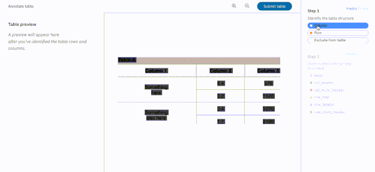

---

copyright:
  years: 2015, 2018, 2019
lastupdated: "2019-03-07"

subcollection: discovery

---

{:shortdesc: .shortdesc}
{:new_window: target="_blank"}
{:tip: .tip}
{:note: .note}
{:pre: .pre}
{:important: .important}
{:deprecated: .deprecated}
{:codeblock: .codeblock}
{:screen: .screen}
{:download: .download}
{:hide-dashboard: .hide-dashboard}
{:apikey: data-credential-placeholder='apikey'} 
{:url: data-credential-placeholder='url'}
{:curl: #curl .ph data-hd-programlang='curl'}
{:javascript: .ph data-hd-programlang='javascript'}
{:java: .ph data-hd-programlang='java'}
{:python: .ph data-hd-programlang='python'}
{:ruby: .ph data-hd-programlang='ruby'}
{:swift: .ph data-hd-programlang='swift'}
{:go: .ph data-hd-programlang='go'}
{:gif: data-image-type='gif'}

# Smart Document Understanding
{: #sdu}

Smart Document Understanding (SDU) is a new way to train {{site.data.keyword.discoveryfull}} to extract custom fields in your documents. Customizing how your documents are indexed into {{site.data.keyword.discoveryshort}} will improve the answers returned by your application.

With SDU, you annotate fields within your documents to train custom conversion models. As you annotate, Watson is learning and will start predicting annotations. SDU models can be exported and used on other collections. 

## Supported document types and browsers
{: #doctypes}

Supported document types for Smart Document Understanding: 
-  Lite plans: PDF, Word, PowerPoint, Excel, JSON\*, HTML\*
-  Advanced plans: PDF, Word, PowerPoint, Excel, PNG\*\*, TIFF\*\*, JPG\*\*, JSON\*, HTML\* 

\* JSON and HTML documents are supported by {{site.data.keyword.discoveryfull}}, but can not be edited using the SDU editor. To change the configuration of HTML and JSON docs, you need to use the API. For more information, see the [API reference ](https://{DomainName}/apidocs/discovery/){: new_window}.

\*\* Individual image files (PNG, TIFF, JPG) are scanned and the text (if any) is extracted. PNG, TIFF, and JPEG images embedded in PDF, Word, PowerPoint, and Excel files will also be scanned and the text (if any) extracted.

Supported browsers: Chrome and Firefox.

## Using the Smart Document Understanding editor
{: #annotate}

The SDU editor is only available for new collections that contain supported document types and do not have the Element Classification enrichment applied. Existing Private collections will use the original configuration method. If you would like to use the SDU editor on an existing collection, you will need to create a new collection and upload those documents to it. If you do not want to use the SDU editor, you can set up your configuration using the API, see the [API reference ](https://{DomainName}/apidocs/discovery/){: new_window}.
{: important}

The SDU editor functions are only available in the {{site.data.keyword.discoveryshort}} tooling, they are not available in the API.
{: note}

Navigating the Smart Document Understanding editor:

If you have not yet created a {{site.data.keyword.discoveryshort}} instance and environment, see [Getting started](/docs/services/discovery?topic=discovery-getting-started#getting-started) for instructions.
{: tip}

1. On the **Manage Data** screen, click the **Upload your own data** button and create a new Private collection in {{site.data.keyword.discoveryshort}}.
1. If you wish, drag and drop documents into your collection, or click **browse from computer** to upload documents. After the upload is complete, this information displays:
   -  The fields identified from your documents.
   -  Enrichments applied to your documents. The Entity Extraction, Sentiment Analysis, Category Classification, and Concept Tagging enrichments are automatically applied to the `text` field by {{site.data.keyword.discoveryshort}} (unless you are importing documents using a connector). You can add (or remove) additional enrichments to the `text` field.
   -  Pre-built queries you can run immediately.
1. Click **Configure data** on the upper right. 
1. On the **Configure data** screen, there will be three tabs: **Identify fields**, **Manage fields**, and **Enrich fields**.

   - **Identify fields** contains the SDU editor. This tab replaces both the **Convert** and **Normalize** tabs on the original {{site.data.keyword.discoveryshort}} screen. 
   - **Manage fields** lists all indexed fields (all fields are indexed by default). Switch off any fields you do not want to index. For example, your PDFs may contain a running header or footer that does not contain useful information, so you can exclude those fields from the index. You can also split documents here, based on fields, see [Splitting documents](/docs/services/discovery?topic=discovery-sdu#splitting).
   - **Enrich fields** is identical to the **Enrich** tab on the original screen. For more information about enrichments, see [Adding enrichments](/docs/services/discovery?topic=discovery-configservice#adding-enrichments). The **Upload sample documents** option is not available with SDU collections.

   If you did not upload any documents earlier, return to the **Overview** screen by clicking the name of your collection in the upper left, or click the  icon and choose your collection. Drag and drop documents into your collection, or click **browse from computer**. After you have done an initial upload, the **Upload documents** button will appear on the upper right.
   {: important}

   When using Smart Document Understanding, only the `text` field can be enriched. Do not attempt to enrich any other field.
   {: important}

1. Open the **Identify fields** tab. A maximum of twenty (20) documents from your collection will automatically load in the Smart Document Understanding editor.

The toolbar at the top will allow you to:
- Choose a document to annotate
- Navigate the document displayed
- Adjust the page view (`single page view`, `zoom in`, `zoom out`), `clear changes`, and `export/import models`. Click on `single page view` to toggle the display - you can view your annotations and document separately, or together.

You can also crawl Box, Salesforce, Microsoft SharePoint Online, IBM Cloud Object Storage, and Microsoft SharePoint 2016 data sources, or do a web crawl with the {{site.data.keyword.discoveryshort}} tooling. Click the **Connect a data source** button and see [Connecting to data sources](/docs/services/discovery?topic=discovery-sources#sources) for more information. If you create a collection using this method, no enrichments will be automatically applied.
{: tip}

## How to annotate a document
{: #documents}

**Note:** Tables are annotated in a separate step.

See [Best practices for annotating documents and tables](/docs/services/discovery?topic=discovery-sdu#bestpractices) before you begin annotating.

1. A default set of fields will appear to the right of your document. The available fields are `answer`, `author`, `footer`, `header`, `question`, `subtitle`, `table_of_contents`, `text`, and `title`. If you would like to create one or more new custom field labels, click **Create new**. You are limited to the following number of custom labels: Lite plans - `0`, Advanced plans - `5`, Premium plans - `20`.
1. Click on a field label on the right to activate it.
1. Click on the content representing that field in the SDU editor. It will highlight. 
   - Alternately, you can select a field label on the right, and drag it to the content in the SDU editor. 
   - To clear a change, click the **Clear change** button on the toolbar.
1. Click **Submit**.
   **Note:** As you annotate, Watson is learning and will start predicting annotations. Continue annotating until Watson correctly and consistently identifies fields.
1. When you have completed annotating, click **Apply changes to collection.** The **Upload your documents** screen opens. Re-upload the documents in your collection. After uploading is complete, you will be redirected to the **Manage Data** screen.

Field | Definition  
------ | ------ 
answer | In a Q/A pair (often in an FAQ), the answer to the question.
author | Name of author (or authors).
footer | Use this tag to denote meta-information about the document (such as the page number or references), that appear at the bottom of the page.
header | Use this tag to denote meta-information about the document that appears at the top of the page.
question | In a Q/A pair (often in an FAQ), the question.
subtitle | The secondary title of the document being annotated. 
table_of_contents | Use this tag on listings in the document table of contents.
text | Use this tag for standard copy text, including paragraphs, definitions, or any set of words that is not a title, part of a table, answer, author, subtitle, header, or a footer. 
title | The main title of the document being annotated.

## How to annotate a table
{: #tables}

Table annotation is in beta release. A statement explaining beta features can be found [here](/docs/services/discovery?topic=discovery-release-notes#beta-features).
{: important}

See [Best practices for annotating documents and tables](/docs/services/discovery?topic=discovery-sdu#bestpractices) before you begin annotating.

1. Select the `table` field from the right side of the SDU editor, then select the table in the document. 
1. Hover over the table to display the **Annotate table** button. Click the button to open the table editor.
1. First, outline the table:
   - Select the `column` field.
   - Click on a column in the table to activate it.
   - Select the `row` field.
   - Click on a row in the table to activate it.

   The outline of the table will appear in the table preview on the left.

   **Note:** As you annotate tables, Watson is learning and will start predicting annotations.
1. Second, label the content within the table.
1. When you have completed annotating the table, click **Done annotating**.
1. Click **Apply changes to collection.** The **Upload your documents** screen opens. Re-upload the documents in your collection. After uploading is complete, you will be redirected to the **Manage Data** screen.

Use this video as a guide {: gif}

Field | Definition  
------ | ------ 
body | Any non-header cell containing information
column header | The heading cell (if present) for each column in the table 
multi-column header | Any heading cell that spans more than one column
row title | The column header for the column of row headings (if present)
row header | The row label (if present) for each row in the table
multi-row header | Any row label that spans more than one row

## Splitting documents
{: #splitting}

The **Manage fields** tab contains the option to **Improve query results by splitting your documents**. This option allows you to split your documents into segments based on a field name. Once split, each segment is a separate document that will be enriched, indexed, and returned as a separate query result. 

Documents are split based on a single field name, for example: `title`, `author`, `question`. 

Considerations:

  - The number of segments per document is limited to `250`. Any document content remaining after `249` segments will be stored within segment `250`.

  - Each segment counts towards the document limit of your plan. {{site.data.keyword.discoveryshort}} will index segments until the plan limit is reached. See [Discovery pricing plans](/docs/services/discovery?topic=discovery-discovery-pricing-plans#discovery-pricing-plans) for document limits.

  - PDF and Word metadata, as well as any custom metadata, is extracted and included in the index with each segment. Every segment of a document will include identical metadata.

  - If a split document has been updated and needs to be re-uploaded, the document should be replaced using the [Update document ](https://{DomainName}/apidocs/discovery#update-a-document){: new_window} method. The document should be uploaded using the POST method of the `/environments/{environment_id}/collections/{collection_id}/documents/{document_id}` API, specifying the contents of the `parent_id` field of one of the current segments as the `{document_id}` path variable. All segments will be overwritten, unless the updated version of the document has fewer total sections than the original. Those older segments will remain in the index and may be individually deleted using the API. See the [API Reference ](https://{DomainName}/apidocs/discovery#delete-a-document){: new_window} for details. 

## Importing and exporting models
{: #import}

Once you have defined a model with the SDU editor, you can save it and reuse it on other collections.

You can import or export your completed SDU model using the toolbar at the top of the editor. Click the last icon and choose `Import model` or `Export model`.

Exported models have the file extension of `.sdumodel`. 

An imported model is intended to be used without any further annotations. The model will be completely overwritten if you continue annotating after importing it. If you plan to import a model into a new collection, it is a good best practice to create a new collection that contains only 1 document, import the model, then upload the remainder of your documents.

## Best practices for annotating documents and tables
{: #bestpractices}

Table annotation is in beta release. A statement explaining beta features can be found [here](/docs/services/discovery?topic=discovery-release-notes#beta-features).
{: important}

- Follow all guidelines and use consistent labeling on all documents
- Do not label whitespace
- Use the `image` labels on images and diagrams
- Do not treat **bold**, _italic_, or underlined text differently. Label based on the context, not the style. 
- When labeling a document, work from the first page to the last.
- If you incorrectly label an item, choose another label for the item to overwrite the first.
- Pages can be submitted at any time. Ensure that all appropriate labeling is complete before submitting.
- Documents and tables that appear to have text overlaying other text are considered “double overlaid” and cannot be annotated. Report these documents to your administrator.
- Documents and tables that contain multiple columns of text on a single page cannot be annotated. Report these documents to your administrator.
- Footnotes should be labeled only when they appear at the bottom of the page and are referenced in the main body of text in the document.
- Notes appearing within sections or lists (for example, explicitly called out as “Notes”) should be labeled as `text`.
- If you are unsure that the table has been labeled correctly and the preview pane has become unresponsive, the page should be reloaded in your browser and the table re-labeled in order to ensure correctness.

