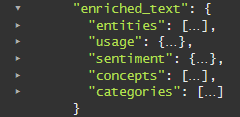

---

copyright:
  years: 2015, 2018, 2019
lastupdated: "2019-03-29"

subcollection: discovery

---

{:shortdesc: .shortdesc}
{:new_window: target="_blank"}
{:tip: .tip}
{:note: .note}
{:pre: .pre}
{:important: .important}
{:deprecated: .deprecated}
{:codeblock: .codeblock}
{:screen: .screen}
{:download: .download}
{:hide-dashboard: .hide-dashboard}
{:apikey: data-credential-placeholder='apikey'} 
{:url: data-credential-placeholder='url'}
{:curl: #curl .ph data-hd-programlang='curl'}
{:javascript: .ph data-hd-programlang='javascript'}
{:java: .ph data-hd-programlang='java'}
{:python: .ph data-hd-programlang='python'}
{:ruby: .ph data-hd-programlang='ruby'}
{:swift: .ph data-hd-programlang='swift'}
{:go: .ph data-hd-programlang='go'}

# Query concepts
{: #query-concepts}

{{site.data.keyword.discoveryfull}} offers powerful content search capabilities. Once your content is uploaded and enriched by {{site.data.keyword.discoveryshort}}, you can build queries, then integrate {{site.data.keyword.discoveryshort}} into your own projects, or create a custom application by using the {{site.data.keyword.watson}} Explorer Application Builder.
{: shortdesc}

  The queries you write will vary by collection, because all collections contain unique content.
  {: tip}

When you create a query or filter, {{site.data.keyword.discoveryshort}} looks at each result and tries to match the paths you have defined. When matches occur, they are added to the results set. When creating a query, you can be as vague or as specific as you want. The more specific the query, the more targeted the results.

You also have the option to turn on passage retrieval. Passages are short, relevant excerpts extracted from the full documents returned by your query. By default, up to 10 passages of around 400 characters each will be returned for a query. A maximum of three passages are extracted from a single result. The `passages` parameter is only available for private collections; it is not available in the {{site.data.keyword.discoverynewsshort}} collection. See [Passages](/docs/services/discovery?topic=discovery-query-parameters#passages) for more information on how passages are identified.

  You can write natural language queries (such as "IBM Watson partnerships") using the {{site.data.keyword.discoveryshort}} tooling or the API.
  {: tip}

All private collections will return a `confidence` score in the query results in most cases. See [Confidence scores](/docs/services/discovery?topic=discovery-improving-result-relevance-with-the-tooling#confidence) for details.

{{site.data.keyword.discoveryshort}} returns query results that include special characters for the following languages: English, German, French, Dutch, Italian, and Portuguese. For example, if you query for `aqui`, you will now receive results for both for `aqui` and <code>aqu&iacute;</code>.

You can create longer, more complex queries that include multiple filters and complex aggregations. This option is available in the API-only, and will increase the character limit of a query to 10,000 characters. See [Long collection queries ](https://{DomainName}/apidocs/discovery#long-collection-queries){: new_window} and [Long environment queries ](https://{DomainName}/apidocs/discovery#long-environment-queries){: new_window} for details.

{{site.data.keyword.discoveryfull}} Knowledge Graph is a beta feature which provides new end-points for querying entities and relations across documents. This includes context-based searches and relevance ranking. See [{{site.data.keyword.discoveryfull}} Knowledge Graph](/docs/services/discovery?topic=discovery-kg#kg) for more information.

For more information about writing queries, see:
- [Getting started with querying tutorial](/docs/services/discovery?topic=discovery-getting-started-with-querying#getting-started-with-querying)
- [Query reference](/docs/services/discovery?topic=discovery-query-reference#query-reference) (includes the list of parameters, operators, and aggregations available in the {{site.data.keyword.discoveryshort}} Query Language)

## The Discovery data schema
{: #discovery-schema}

Start out by getting to know the {{site.data.keyword.discoveryshort}} JSON. To understand how to build a query using the {{site.data.keyword.discoveryshort}} Query Language, you need to be familiar with the JSON produced by {{site.data.keyword.discoveryshort}} after it enriches the documents in your collection. Once you are familiar with the data schema of your documents, it will be easier to write queries in the {{site.data.keyword.discoveryshort}} Query Language. There are three ways to do this.

  1. In the {{site.data.keyword.discoveryshort}} Tooling, open the **Manage data** screen, choose the collection that contains the {{site.data.keyword.IBM_notm}} Press Releases. Click the **View Data Schema** button. The **View data schema** screen displays the fields and values in your transformed documents two ways: by document (**Document view**), or by field (**Collection view**). A maximum of 50 documents will display in **Document view**. **Collection view** will display the fields in the entire collection.

    In the **Collection view**, under `enriched_text`, you can examine the enrichments you applied to your collection. Click on `categories`, `concepts`, `entities`, and `sentiment` to see how your collection was enriched with Watson insights.

  1. Run an "empty" query to view the JSON. On the **View data schema** screen, click the **Build queries** button, then click **Run Query**. The results display on the right, under two tabs, **Summary** (an overview of the query results) and **JSON**. Start by opening the **JSON** tab.

     -  Each of the four documents will be preceded by an `id` number.
     -  Scroll down to the `enriched_text` field. Examine each enrichment to learn about the JSON fields you can query on.

        

     -  **entities** - Start by finding the `text` field, and examine the other enrichment information.
     -  **sentiment** - Start by finding the `label` field, and examine the other enrichment information.
     -  **concepts** - Start by finding the `text` field, and examine the other enrichment information.
     -  **categories** - Start by finding the `document` field, and examine the other enrichment information.

     After you have examined the insights in the first document, you can look at the other three documents if you wish.

  1. View the available fields in the **Visual Query Builder**. On the **Build queries** screen, click **Search for documents**, then **Use the {{site.data.keyword.discoveryshort}} Query Language**. Click the **Field** drop-down to view the fields available in your data. Click **Edit in query language** to build queries manually using the {{site.data.keyword.discoveryshort}} Query Language.      

### How to structure a basic query
{: #structure-basic-query}

<!-- Learn more topic WDS -->
As you have noticed, the JSON is hierarchical, so queries need to be written using that same hierarchy. So if your JSON looks like this:

```json
"enriched_text": {
  "concepts": [
    {
    "text": "Cloud computing",
    "relevance": 0.610029}
    ]
  }
```
{: codeblock}

Your query would be structured like this:


  Operators that evaluate a field (`<=` , `>=`, `<`, `>`) require a `number` or `date` as the value. Using quotations around a value always makes it a `string`. Therefore `score>=0.5` is a valid query and `score>="0.5"` is not. See [Query operators](/docs/services/discovery?topic=discovery-query-operators#query-operators) for a complete list of operators.
  {: tip}

Considerations:

- Not sure when to query on an entity, concept, or keyword? See [Understanding the difference between Entities, Concepts, and Keywords](/docs/services/discovery?topic=discovery-configservice#udbeck).

- **Note:**  After you click **Run query** and open the **JSON** tab, you will notice that query highlighting is turned on by default. This will add a `highlight` field to your query results. Within the `highlight` field, the words that match your query will be wrapped in HTML `<em>` (emphasis) tags. See the [Query parameters](/docs/services/discovery?topic=discovery-query-parameters#highlight) for details.

## Building combined queries
{: #building-combined-queries}

You can combine query parameters together to build more targeted queries. For example, you can use the both the `filter` and `query` parameters together. For more information about filtering vs. querying, see [Differences between the filter and query parameters](/docs/services/discovery?topic=discovery-query-parameters#filtervquery).

## How to structure an aggregation
{: #structure-aggregation}

<!-- Learn more topic WDS -->
Aggregations return a set of data values; for example, top keywords, overall sentiment of entities, and more. For the full list of aggregation options, see [Aggregations](/docs/services/discovery?topic=discovery-query-reference#aggregations).


This example aggregation will find all of the `concepts` in your collection.
The delimiter in this query is `.` and the operator is `()`, see [Query operators](/docs/services/discovery?topic=discovery-query-operators#query-operators) to learn about other operators available in the {{site.data.keyword.discoveryshort}} Query Language.

### Example aggregation queries
{: #example-aggregations}

There are several types of ways you can aggregate results with {{site.data.keyword.discoverynewsshort}}, including top values, sum, min, max, average, timeslice, and histogram. You can also add filters and nest aggregations.

#### Filter aggregations
{: #filter-aggregations}

This example aggregation returns the number of articles found in {{site.data.keyword.discoverynewsshort}} about the Pittsburgh Steelers and how many of those results have a `positive`, `negative`, or `neutral` sentiment.

- `filter(enriched_text.entities.text:"Pittsburgh Steelers").term(enriched_text.sentiment.document.label,count:3)`


This example aggregation will first narrow down (filter) a set of articles in {{site.data.keyword.discoverynewsshort}} to only the ones that include the entities text of `twitter`, then divide those articles by the document sentiment types. Only the top 3 document sentiment types (`positive`, `negative`, `neutral`) will be returned.

- `filter(enriched_text.entities.text:twitter).term(enriched_text.sentiment.document.label,count:3)`

#### Nested aggregations
{: #nested-aggregations}

Adding `nested` before an aggregation restricts the aggregation to the area of the results specified. For example: `nested(enriched_text.entities)` means that only the `enriched_text.entities` components of any result are used to aggregate against.

This can be seen easily by looking at the differences between the following two queries:
- `filter(enriched_text.entities.disambiguation.subtype::City)` - the aggregation counts the number of *Results* that contain one or more `entity` with the type `City`
- `nested(enriched_text.entities).filter(enriched_text.entities.disambiguation.subtype::City)` - the aggregation counts the number of instances of an `entity` with the type `City` in the results.  

Additionally, any subsequent operation will further restrict the result set that can be aggregated against. For example:

- `nested(enriched_text.entities).filter(enriched_text.entities.disambiguation.subtype::City)` means that only entities of `subtype::City` will be aggregated.
- `nested(enriched_text.entities).filter(enriched_text.entities.disambiguation.subtype::City).term(enriched_text.entities.text,count:3)` will aggregate the top 3 entities of subtype `City`
- `filter(enriched_text.entities.disambiguation.subtype::City).term(enriched_text.entities.text,count:3)` will return the top 3 entities where the result contains at least one entity of subtype `City`.

## Querying Watson Discovery News
{: #querying-news}

{{site.data.keyword.discoverynewsshort}}, a public data set that has been pre-enriched with cognitive insights, is also included with {{site.data.keyword.discoveryshort}}. See [Watson Discovery News](/docs/services/discovery?topic=discovery-watson-discovery-news#watson-discovery-news) for more information about this collection.

You can query this collection using natural language queries, for example "IBM Watson partnerships", or the {{site.data.keyword.discoveryshort}} Query Language. To learn more about natural language queries, see the [Natural language query](/docs/services/discovery?topic=discovery-query-parameters#nlq).

You cannot adjust the {{site.data.keyword.discoverynewsshort}} configuration, train, or add documents to {{site.data.keyword.discoverynewsshort}} collection. See a demo of what you can build with {{site.data.keyword.discoverynewsshort}} [here ](https://discovery-news-demo.ng.bluemix.net/){: new_window}.

The English, Korean, German, Spanish, and Japanese language {{site.data.keyword.watson}} {{site.data.keyword.discoverynewsshort}} collections are available from both the {{site.data.keyword.discoveryshort}} tooling and the API.

The default language of {{site.data.keyword.watson}} {{site.data.keyword.discoverynewsshort}} in the tooling is English. To switch the language, you must first click the  icon, then choose the appropriate language from the drop-down.

For information about querying a collection via the API, see [API Reference ](https://{DomainName}/apidocs/discovery#query-your-collection){: new_window}. The `collection_id` of the English language version of Watson {{site.data.keyword.discoverynewsshort}} is `news-en`. Formerly, the `collection_id` was `news` - if you have been using the former `collection_id`, it will continue to work, however, you may want to switch to the new `collection_id` for new projects. The `collection_id` of the Korean collection is `news-ko`, the Spanish `collection_id` is `news-es`, the German `collection_id` is `news-de`, the Japanese `collection_id` is `news-ja`.

{{site.data.keyword.discoverynewsfull}} queries display the first 50 words of each article in the `text` JSON field.

The maximum number of results returned for a {{site.data.keyword.watson}} {{site.data.keyword.discoverynewsshort}} query is `50`. Use additional queries and the `offset` parameter to return more than `50` results.

If using the {{site.data.keyword.discoveryshort}} Query Language, you can include a relative date range in your {{site.data.keyword.discoverynewsshort}} queries, for example: `crawl_date>=now-1month`. Valid date interval values are `second/seconds` `minute/minutes`, `hour/hours`, `day/days`, `week/weeks`, `month/months`, and `year/years`. `now` is not affected by the `time_zone` parameter; the `UTC` time zone is the default.

This example will query for a keyword within a specific date range. The time zone information is not required:
- `enriched_text.keywords.text:"olympics", publication_date<=2018-02-15T00:00:00Z, publication_date>=2018-02-01T00:00:00Z`

News articles may be syndicated to several news outlets and {{site.data.keyword.discoverynewsfull}} will pick up each of them, resulting in duplicate articles. This means that a query to {{site.data.keyword.discoverynewsfull}} may potentially return several identical or nearly identical articles in query results. You can manage this using deduplication. To learn more about this beta capability, see [Excluding duplicate documents from query results](/docs/services/discovery?topic=discovery-query-parameters#deduplication).

## Querying multiple collections
{: #multiple-collections}

If you have multiple collections in your environment, you might want to view results across those collections. The query methods (`query`, `fields`, and `notices`) at the `environments` level allow you to query multiple specified collections. Querying across collections is not currently available in the {{site.data.keyword.discoveryshort}} tooling.

You can query multiple collections in the same environment by using the `environments/{environment_id}/query` API method. When querying across multiple collections, take into consideration the following items.
-  The `collection_ids` parameter must be specified when using this method. `collection_ids` is a comma-separated list of collections in the environment to query.
-  `passages` are supported when querying multiple collections.
-  `collection_id` is returned as part of each result object. This field specifies the collection where the result was found.
-  The {{site.data.keyword.discoverynewsshort}} is part of the `system` environment and cannot be included in multiple collection queries.
-  Individual collection relevancy training does not affect ranking of results when querying multiple collections. To rerank results returned when querying multiple collections implement [Continuous Relevancy Training](/docs/services/discovery?topic=discovery-crt#crt).
-  Re-ranking is not performed on any part of a multiple collection query, even if all collections in the query have been trained.

See the [multiple collection query API reference ](https://{DomainName}/apidocs/discovery#query-documents-in-multiple-collections){: new_window} for more information.

You can view notices across multiple collections in the same environment by using the `environments/{environment_id}/notices` API method.
-  The `collection_ids` parameter must be specified when using this method. `collection_ids` is a comma-separated list of collections in the environment to query.
-  `passages` are supported when querying multiple collections.

See the [multiple collection notices API reference ](https://{DomainName}/apidocs/discovery#get-collection-details){: new_window} for more information.

You can view the fields available across collections in the same environment by using the `environments/{environment_id}/fields` API method. See the [multiple collection field query API reference ](https://{DomainName}/apidocs/discovery#list-fields-across-collections){: new_window} for more information.

## Query expansion
{: #query-expansion}

You can expand the scope of a query beyond exact matches - for example, you can expand a query for "car" to include "automobile" and "vehicle" - by uploading a list of query expansion terms using the {{site.data.keyword.discoveryshort}} API. Query expansion terms are usually synonyms, antonyms, or typical misspellings for common terms.

You can define two types of expansions:
-  **bidirectional** - each `expanded_term` will expand to include all expanded terms. For example, a query for `car` would expand to `car OR automobile OR vehicle`).
-  **unidirectional** - the `input_terms` in the query will be replaced by the `expanded_terms`. For example, a query for `banana` could expand to `plantain` and `fruit`. `input_terms` are not used as part of the resulting query. In the previous `banana` example, the query `banana` would be converted to `plantain` OR `fruit` and not contain the original term.

This file can be used as a starting point when building a query expansion list:
<a target="_blank" href="https://watson-developer-cloud.github.io/doc-tutorial-downloads/discovery/expansions.json" download>expansions.json </a>. You can modify this file to create your custom query expansion list.

Bidirectional example:
```JSON
 {
   "expansions": [
     {
       "expanded_terms": [
         "car",
         "automobile",
         "vehicle"
       ]
     }
   ]
 }
```
{: codeblock}

Unidirectional example:
```JSON
 {
   "expansions": [
     {
      "input_terms": [
        "banana"
       ],
      "expanded_terms": [
        "banana",
        "plantain",
        "fruit"
       ]
     }
   ]
 }
```
{: codeblock}

Notes about query expansion:

-  Multi-token query expansion is not supported.
-  Query expansion is only available for private collections. The number of available `expansions` arrays (total bidirectional and unidirectional arrays) and terms (the total `input_terms` plus `expanded_terms`) varies by plan. See [Discovery pricing plans](/docs/services/discovery?topic=discovery-discovery-pricing-plans#discovery-pricing-plans) for details. **Note:** All query terms (both `input_terms` and `expanded_terms`) each count as one term. This example contains two objects in the `expansions` array and seven term strings.

```JSON
 {
   "expansions": [
     {
      "input_terms": [
         "ibm"
       ],
      "expanded_terms": [
         "ibm",
         "watson"
       ]
     },
     {
      "input_terms": [
         "banana"
       ],
      "expanded_terms": [
         "banana",
         "plantain",
         "fruit"
       ]
     }
   ]
 }
```
{: codeblock}

-  Only one query expansion list can be uploaded per collection; if a second expansion list is uploaded, it will replace the first.
-  All `input_terms` and `expanded_terms` should be lowercase. Lowercase terms will expand to uppercase.
-  The query expansion list must be written in JSON.
-  To disable query expansion, delete the query expansion list.
-  You cannot currently upload or delete a query expansion list using the {{site.data.keyword.discoveryshort}} tooling; it must be done using the {{site.data.keyword.discoveryshort}} API.
-  Query expansion is performed on the `query` and `multiple collection query` methods. Query expansion is not performed on Knowledge Graph queries.
-  Each set of expansions is associated with a collection. When querying across [multiple collections](/docs/services/discovery?topic=discovery-query-concepts#multiple-collections), each collection is expanded individually.
-  Query expansions are applied at query time, not during indexing, so the query expansion list can be updated without the need to re-ingest your documents.
-  Do not upload or delete a query expansion list at the same time documents are being ingested into your collection. This could cause the index to be unavailable for that brief period.

See the [query expansion API reference ](https://{DomainName}/apidocs/discovery#get-the-expansion-list){: new_window} for the API commands to upload and delete query expansion files.

## Defining Stopwords
{: #stopwords}

Stopwords are words that are filtered out of queries because they add little value, for example: `a, an, the`. Adding common words to a stopwords list can also improve the relevance of results for natural language queries. 

{{site.data.keyword.discoveryshort}} applies a default list of stopwords for several languages at query time. However, you can define and upload a custom list of stopwords that will override the default list. {{site.data.keyword.discoveryshort}} will apply the appropriate default or custom stopword list to your private collections based on the language specified for that collection. 

Your custom stopword list must be a newline separated `txt` file. Example custom stopword list:

```
ibm
watson
a
an
the
what
how
when
can
should
```
This list contains all the default English stopwords <a target="_blank" href="https://watson-developer-cloud.github.io/doc-tutorial-downloads/discovery/custom_stopwords_en.txt" download>custom_stopwords_en.txt </a>. It can be used as a starting point when building a custom stopword list in English. Creating a custom stopword list that does not include very common terms like `a` and `the` can lead to reduced query performance, so it is recommended that you keep these words in your custom stopword list. Following are stopword lists for several other supported languages. They all include the default stopwords for that language:

-  Dutch: <a target="_blank" href="https://watson-developer-cloud.github.io/doc-tutorial-downloads/discovery/custom_stopwords_nl.txt" download>custom_stopwords_nl.txt </a>.
-  French: <a target="_blank" href="https://watson-developer-cloud.github.io/doc-tutorial-downloads/discovery/custom_stopwords_fr.txt" download>custom_stopwords_fr.txt </a>.
-  German: <a target="_blank" href="https://watson-developer-cloud.github.io/doc-tutorial-downloads/discovery/custom_stopwords_de.txt" download>custom_stopwords_de.txt </a>. 
-  Italian: <a target="_blank" href="https://watson-developer-cloud.github.io/doc-tutorial-downloads/discovery/custom_stopwords_it.txt" download>custom_stopwords_it.txt </a>.
-  Japanese: <a target="_blank" href="https://watson-developer-cloud.github.io/doc-tutorial-downloads/discovery/custom_stopwords_ja.txt" download>custom_stopwords_ja.txt </a>.
-  Spanish: <a target="_blank" href="https://watson-developer-cloud.github.io/doc-tutorial-downloads/discovery/custom_stopwords_es.txt" download>custom_stopwords_es.txt </a>. 

See [Language support](/docs/services/discovery?topic=discovery-language-support#supported-languages) for the list of languages supported by {{site.data.keyword.discoveryshort}}. Several supported languages do not have a default stopwords list.

See the [stopwords API reference ](https://{DomainName}/apidocs/discovery#create-stopword-list){: new_window} for the API commands to upload and delete custom stopword lists.

Notes about stopwords:

-  You cannot currently upload or delete a custom stopword list using the {{site.data.keyword.discoveryshort}} tooling; it must be done using the {{site.data.keyword.discoveryshort}} API. See the [stopwords API reference ](https://{DomainName}/apidocs/discovery#create-stopword-list){: new_window}.
-  Uploading a custom stopword list is only available for private collections on `Advanced` and `Premium` plans.
-  The size limit for a custom stopword list `txt` file is one million characters. However, if you upload a custom stopwords list with a large number of terms, you may negatively affect search accuracy. The number of words is dependent on the language, the document contents, and the words chosen. A good best practice would be to keep your list of stopwords under `200` total words. 
-  Only one custom stopword list can be uploaded per collection; if a second custom stopword list is uploaded, it will replace the first.
-  All stopwords should be lowercase. 
-  To disable the custom stopword list, delete the custom stopword list.
-  Do not upload or delete a custom stopword list at the same time documents are being ingested into your collection. This could cause the index to be unavailable for that brief period.
-  Stopwords are removed at both index and query time. A good best practice is to upload your custom stopword list before uploading documents.
   - If your documents have already been indexed with the default stopwords, and you then add a custom stopword list, the new stopwords will still be included in the index. In that case, queries that contain these new stopword will filter them out at query time.
   - If a user searches for a word that was a stopword at one point in time, but has since been removed from the custom stopword list, they will not find documents that match the original stopword because the term was removed at index time. To fix this issue, delete the documents in your collection and re-upload all the documents so that they are indexed with the updated custom stopword list.
-  Each set of stopwords is associated with a collection. When querying across multiple collections, each collection will use the custom stopword list associated with that collection.
- If you make significant changes to your custom stopword list, you should delete the documents in your collection and re-upload all the documents so that they are indexed with the updated custom stopword list.

## Creating custom tokenization dictionaries
{: #tokenization}

Tokenization breaks text into units called tokens. A standard tokenization dictionary is applied to your collections, but you can improve the search accuracy for your domain or language by uploading a custom tokenization dictionary. Your custom dictionary will override the standard dictionary. You can upload your dictionary using the {{site.data.keyword.discoveryshort}} API. 

See the [tokenization API reference ](https://{DomainName}/apidocs/discovery#create-tokenization-dictionary){: new_window} for the API commands to upload and delete tokenization files. 

**Note:** This feature is currently only available for Japanese collections. 

In the example below, **text** is the phrase that will be tokenized when encountered and **tokens** are the words that the **text** will be split into (they must be defined individually). **Readings** list the version of the tokens represented by a different character set, and **part_of_speech** is the part of speech the tokens represent.

With this custom dictionary, if you search for this text: `ネコ`, the search results will include text containing `すしネコ`, as well as text containing only `ネコ`.

```
{ "tokenization_rules":
  [
     {
      "text":"すし",
      "tokens":[
        "すし"
      ],
      "readings":[
        "寿司"
      ],
      "part_of_speech":"カスタム名詞"
    },
    {
      "text":"ネコ",
      "tokens":[
        "ネコ"
      ],
      "readings":[
        "ネコ"
      ],
      "part_of_speech":"カスタム名詞"
    }
```

With this custom dictionary, you can create rules with a single token. In this example, `ibm発見` will be tokenized as a single token, so it will not be broken up into smaller units.

```
{ "tokenization_rules":
  [
    {
      "text":"ibm発見",
      "tokens":[  
      "ibm発見"
      ],
      "readings":[  
      "ibm発見"
      ],
      "part_of_speech":"カスタム名 詞"
    },
    ...
  ]
}
```

-  Tokenization occurs at both index and query time.
-  Tokens must be defined individually.
-  Tokens and readings may not contain spaces or the `#` character.
-  A standard tokenization dictionary is used on all collections. If your collection has already been indexed with that dictionary, you must reingest the documents in that collection after you upload a custom tokenization dictionary.
-  Uploading a tokenization dictionary is only available for private collections on `Advanced` and `Premium` plans. 
-  Only one tokenization dictionary can be uploaded per collection; if a second tokenization dictionary is uploaded, it will replace the first. If that collection already contained documents, you must reingest them for the new custom tokenization dictionary to be applied.
-  The custom tokenization dictionary must be written in JSON, example file name: `custom_tokenization_dictionary.json`.
-  All custom tokenization dictionary terms should be lowercase.
-  To disable tokenization, delete the tokenization dictionary and reingest your documents.
-  You cannot currently upload or delete a tokenization dictionary using the {{site.data.keyword.discoveryshort}} tooling; it must be done using the {{site.data.keyword.discoveryshort}} API.
-  Tokenization is performed on the `query` and `multiple collection query` methods. Tokenization is not performed on Knowledge Graph queries.
-  Each tokenization dictionary is associated with a collection. When querying across [multiple collections](/docs/services/discovery?topic=discovery-query-concepts#multiple-collections), each collection is tokenized individually.
-  Do not upload or delete a tokenization dictionary at the same time documents are being ingested into your collection. 

## Document similarity
{: #doc-similarity}

A document similarity query will find other documents similar to the currently viewed document, for example, a call center operator could be viewing the manuals for a product and use document similarity to find other documents with similar characteristics. You can query for similar documents by `similar.document_ids`, and can optionally refine the similarity by specifying additional `similar.fields`.

Document similarity is determined by extracting the 25 most relevant terms from the original document and then searching for documents with similar relevant terms.

Example query by `similar.document_ids` (there should be no space after the comma if specifying multiple `similar.document_ids`):

`curl -u "apikey":"{apikey_value}" "https://gateway.watsonplatform.net/discovery/api/v1/environments/{environment_id}/collections/{collection_id}/query?version=2017-11-07&similar.document_ids=4107b6f1-5d3f-4bea-bbcf-fb05bbf960b1,6057k6d1-7d7k-6aeh-cfbb-kj98ssf786c2"`

Example query with `similar.fields` added:

`curl -u "apikey":"{apikey_value}" "https://gateway.watsonplatform.net/discovery/api/v1/environments/{environment_id}/collections/{collection_id}/query?version=2017-11-07&similar.document_ids=4107b6f1-5d3f-4bea-bbcf-fb05bbf960b1&similar.fields=title&return=title&count=100"`

See the [document similarity API reference ](https://{DomainName}/apidocs/discovery#query-your-collection){: new_window} and [query parameters](/docs/services/discovery?topic=discovery-query-parameters#similar) for more information.